# 🤖 AI & Machine Learning (142)

[⬅️ Back to the full catalog](../README.md) · [🖼️ Browse & download on the website](https://logos.lndev.me/)
<table>
<tr><td align="center"><a href="../logos/ai.svg"> <code>ai</code></a></td><td align="center"><a href="../logos/ai-dungeon.svg"> <code>ai-dungeon</code></a></td><td align="center"><a href="../logos/ai-on-the-edge-device.svg">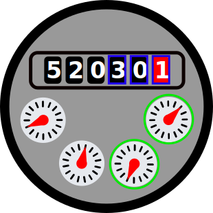 <code>ai-on-the-edge-device</code></a></td><td align="center"><a href="../logos/amazon-alexa.svg"> <code>amazon-alexa</code></a></td><td align="center"><a href="../logos/amazon-q.svg">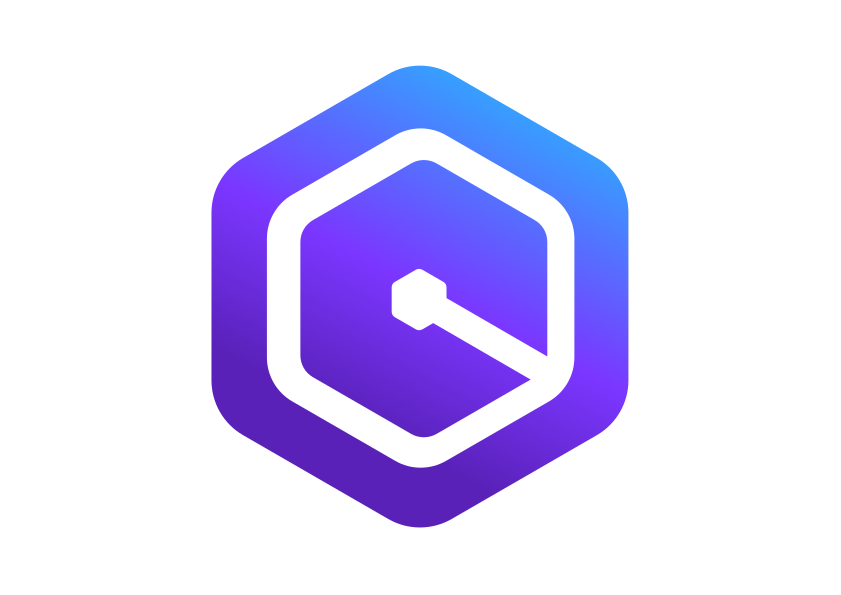 <code>amazon-q</code></a></td><td align="center"><a href="../logos/anaconda.svg"> <code>anaconda</code></a></td></tr>
<tr><td align="center"><a href="../logos/anthropic.svg"> <code>anthropic</code></a></td><td align="center"><a href="../logos/anthropic-wordmark.svg"> <code>anthropic-wordmark</code></a></td><td align="center"><a href="../logos/anything-llm.svg"> <code>anything-llm</code></a></td><td align="center"><a href="../logos/api-ai.svg"> <code>api-ai</code></a></td><td align="center"><a href="../logos/basewell.svg">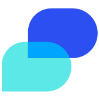 <code>basewell</code></a></td><td align="center"><a href="../logos/bolt.svg"> <code>bolt</code></a></td></tr>
<tr><td align="center"><a href="../logos/bons-ai.svg"> <code>bons-ai</code></a></td><td align="center"><a href="../logos/bons-ai-wordmark.svg"> <code>bons-ai-wordmark</code></a></td><td align="center"><a href="../logos/brainjs.svg"> <code>brainjs</code></a></td><td align="center"><a href="../logos/buildship.svg"> <code>buildship</code></a></td><td align="center"><a href="../logos/caffe2.svg"> <code>caffe2</code></a></td><td align="center"><a href="../logos/cerebras.svg"> <code>cerebras</code></a></td></tr>
<tr><td align="center"><a href="../logos/cerebras-wordmark.svg"> <code>cerebras-wordmark</code></a></td><td align="center"><a href="../logos/chatgpt.svg"> <code>chatgpt</code></a></td><td align="center"><a href="../logos/chatpad-ai.svg"> <code>chatpad-ai</code></a></td><td align="center"><a href="../logos/claude.svg"> <code>claude</code></a></td><td align="center"><a href="../logos/claude-ai.svg"> <code>claude-ai</code></a></td><td align="center"><a href="../logos/claude-wordmark.svg"> <code>claude-wordmark</code></a></td></tr>
<tr><td align="center"><a href="../logos/codellm.svg"> <code>codellm</code></a></td><td align="center"><a href="../logos/codemod.svg">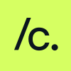 <code>codemod</code></a></td><td align="center"><a href="../logos/codemod-wordmark.svg"> <code>codemod-wordmark</code></a></td><td align="center"><a href="../logos/codeproject-ai-server.svg">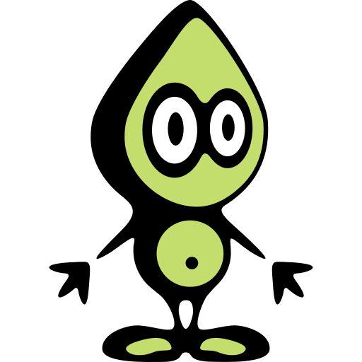 <code>codeproject-ai-server</code></a></td><td align="center"><a href="../logos/coderabbit.svg"> <code>coderabbit</code></a></td><td align="center"><a href="../logos/codex.svg"> <code>codex</code></a></td></tr>
<tr><td align="center"><a href="../logos/codex-wordmark.svg"> <code>codex-wordmark</code></a></td><td align="center"><a href="../logos/cody.svg"> <code>cody</code></a></td><td align="center"><a href="../logos/cohere.svg"> <code>cohere</code></a></td><td align="center"><a href="../logos/cohere-wordmark.svg"> <code>cohere-wordmark</code></a></td><td align="center"><a href="../logos/conductor.svg">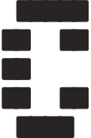 <code>conductor</code></a></td><td align="center"><a href="../logos/conductor-wordmark.svg">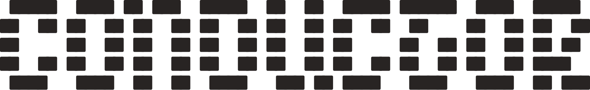 <code>conductor-wordmark</code></a></td></tr>
<tr><td align="center"><a href="../logos/danfo.svg"> <code>danfo</code></a></td><td align="center"><a href="../logos/data-ai.svg"> <code>data-ai</code></a></td><td align="center"><a href="../logos/deepseek.svg">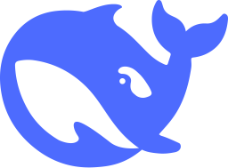 <code>deepseek</code></a></td><td align="center"><a href="../logos/deepseek-wordmark.svg"> <code>deepseek-wordmark</code></a></td><td align="center"><a href="../logos/dialogflow.svg"> <code>dialogflow</code></a></td><td align="center"><a href="../logos/fastgpt.svg">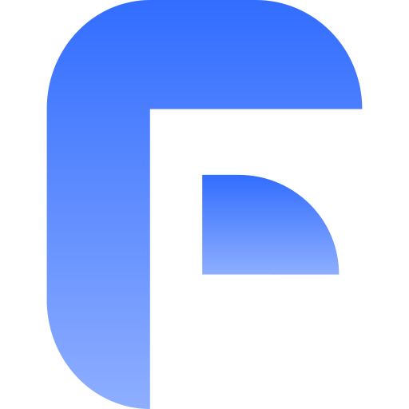 <code>fastgpt</code></a></td></tr>
<tr><td align="center"><a href="../logos/firebase-studio.svg"> <code>firebase-studio</code></a></td><td align="center"><a href="../logos/firecrawl.svg"> <code>firecrawl</code></a></td><td align="center"><a href="../logos/firecrawl-wordmark.svg"> <code>firecrawl-wordmark</code></a></td><td align="center"><a href="../logos/floydhub.svg"> <code>floydhub</code></a></td><td align="center"><a href="../logos/github-copilot.svg"> <code>github-copilot</code></a></td><td align="center"><a href="../logos/glide.svg"> <code>glide</code></a></td></tr>
<tr><td align="center"><a href="../logos/google-assistant.svg"> <code>google-assistant</code></a></td><td align="center"><a href="../logos/google-bard.svg">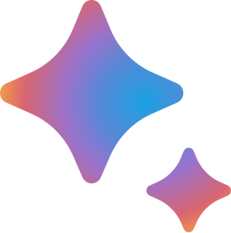 <code>google-bard</code></a></td><td align="center"><a href="../logos/google-bard-wordmark.svg"> <code>google-bard-wordmark</code></a></td><td align="center"><a href="../logos/google-gemini.svg"> <code>google-gemini</code></a></td><td align="center"><a href="../logos/google-palm.svg"> <code>google-palm</code></a></td><td align="center"><a href="../logos/gpt4free.svg"> <code>gpt4free</code></a></td></tr>
<tr><td align="center"><a href="../logos/gradio.svg"> <code>gradio</code></a></td><td align="center"><a href="../logos/gradio-wordmark.svg"> <code>gradio-wordmark</code></a></td><td align="center"><a href="../logos/granola.svg"> <code>granola</code></a></td><td align="center"><a href="../logos/grid-ai.svg"> <code>grid-ai</code></a></td><td align="center"><a href="../logos/grok.svg"> <code>grok</code></a></td><td align="center"><a href="../logos/groq.svg"> <code>groq</code></a></td></tr>
<tr><td align="center"><a href="../logos/groq-wordmark.svg"> <code>groq-wordmark</code></a></td><td align="center"><a href="../logos/hugging-face.svg"> <code>hugging-face</code></a></td><td align="center"><a href="../logos/hugging-face-wordmark.svg"> <code>hugging-face-wordmark</code></a></td><td align="center"><a href="../logos/hume-ai.svg">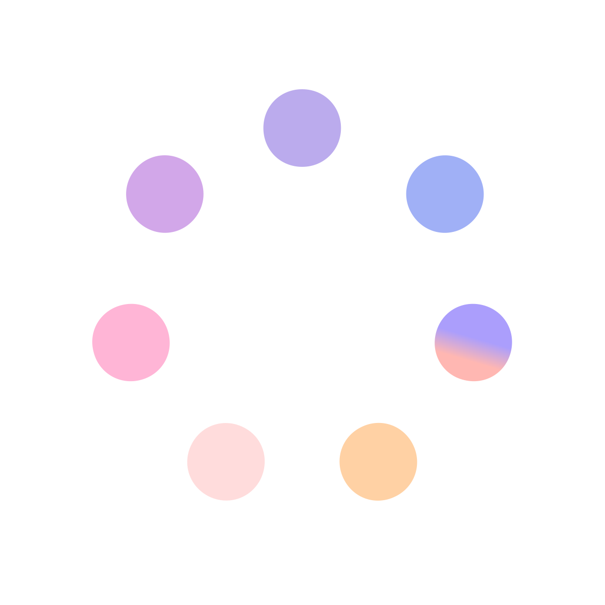 <code>hume-ai</code></a></td><td align="center"><a href="../logos/inflection-ai.svg"> <code>inflection-ai</code></a></td><td align="center"><a href="../logos/intlayer.svg"> <code>intlayer</code></a></td></tr>
<tr><td align="center"><a href="../logos/invoke-ai.svg"> <code>invoke-ai</code></a></td><td align="center"><a href="../logos/jupyter.svg"> <code>jupyter</code></a></td><td align="center"><a href="../logos/jupyter-wordmark.svg"> <code>jupyter-wordmark</code></a></td><td align="center"><a href="../logos/kaggle.svg">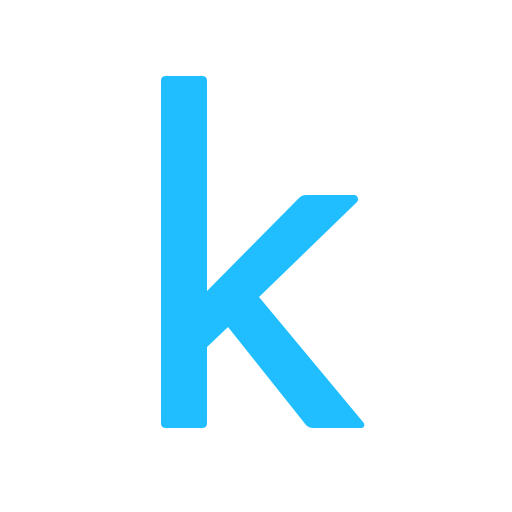 <code>kaggle</code></a></td><td align="center"><a href="../logos/kaggle-wordmark.svg"> <code>kaggle-wordmark</code></a></td><td align="center"><a href="../logos/kilo-code.svg"> <code>kilo-code</code></a></td></tr>
<tr><td align="center"><a href="../logos/kimi.svg">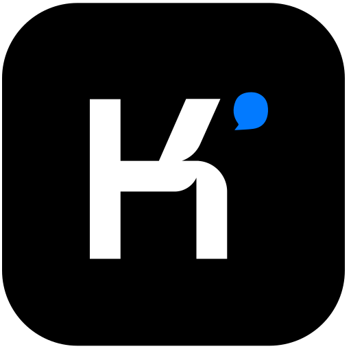 <code>kimi</code></a></td><td align="center"><a href="../logos/kimi-ai.svg">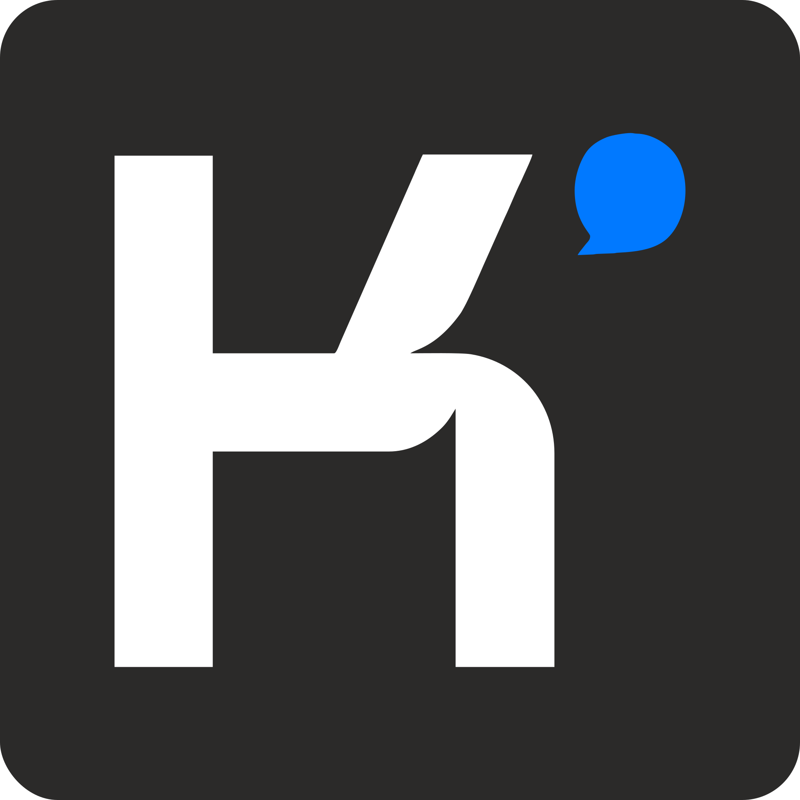 <code>kimi-ai</code></a></td><td align="center"><a href="../logos/kimi-wordmark.svg"> <code>kimi-wordmark</code></a></td><td align="center"><a href="../logos/langchain.svg"> <code>langchain</code></a></td><td align="center"><a href="../logos/langchain-wordmark.svg"> <code>langchain-wordmark</code></a></td><td align="center"><a href="../logos/leedlime.svg"> <code>leedlime</code></a></td></tr>
<tr><td align="center"><a href="../logos/lemonade-ai.svg">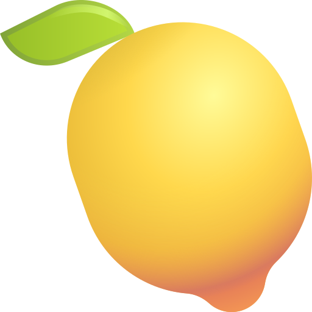 <code>lemonade-ai</code></a></td><td align="center"><a href="../logos/litellm.svg">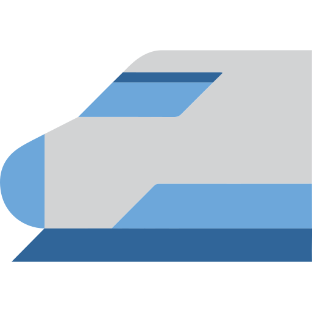 <code>litellm</code></a></td><td align="center"><a href="../logos/litlellm.svg"> <code>litlellm</code></a></td><td align="center"><a href="../logos/locofy.svg"> <code>locofy</code></a></td><td align="center"><a href="../logos/lovable.svg"> <code>lovable</code></a></td><td align="center"><a href="../logos/manus.svg"> <code>manus</code></a></td></tr>
<tr><td align="center"><a href="../logos/manus-wordmark.svg"> <code>manus-wordmark</code></a></td><td align="center"><a href="../logos/matplotlib.svg"> <code>matplotlib</code></a></td><td align="center"><a href="../logos/matplotlib-wordmark.svg"> <code>matplotlib-wordmark</code></a></td><td align="center"><a href="../logos/mend-ai.svg">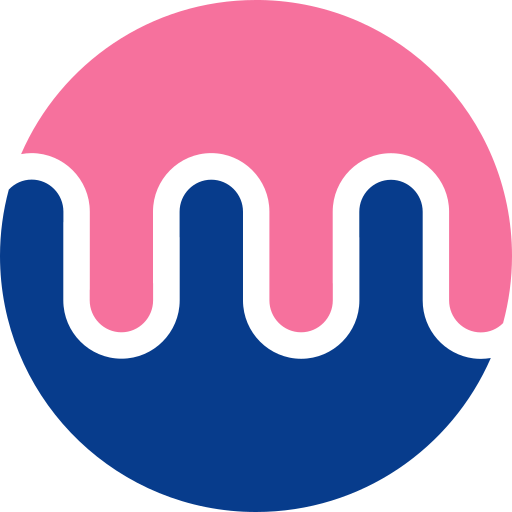 <code>mend-ai</code></a></td><td align="center"><a href="../logos/microsoft-copilot.svg"> <code>microsoft-copilot</code></a></td><td align="center"><a href="../logos/midday.svg"> <code>midday</code></a></td></tr>
<tr><td align="center"><a href="../logos/midjourney.svg"> <code>midjourney</code></a></td><td align="center"><a href="../logos/mindsdb.svg"> <code>mindsdb</code></a></td><td align="center"><a href="../logos/mindsdb-wordmark.svg"> <code>mindsdb-wordmark</code></a></td><td align="center"><a href="../logos/mistral-ai.svg"> <code>mistral-ai</code></a></td><td align="center"><a href="../logos/mistral-ai-wordmark.svg"> <code>mistral-ai-wordmark</code></a></td><td align="center"><a href="../logos/model-context-protocol.svg"> <code>model-context-protocol</code></a></td></tr>
<tr><td align="center"><a href="../logos/moonshot-ai.svg"> <code>moonshot-ai</code></a></td><td align="center"><a href="../logos/nanonets.svg"> <code>nanonets</code></a></td><td align="center"><a href="../logos/nextbillion-ai.svg"> <code>nextbillion-ai</code></a></td><td align="center"><a href="../logos/numpy.svg"> <code>numpy</code></a></td><td align="center"><a href="../logos/observer-ai.svg"> <code>observer-ai</code></a></td><td align="center"><a href="../logos/ollama.svg"> <code>ollama</code></a></td></tr>
<tr><td align="center"><a href="../logos/openai.svg"> <code>openai</code></a></td><td align="center"><a href="../logos/openclaw.svg"> <code>openclaw</code></a></td><td align="center"><a href="../logos/opencode.svg"> <code>opencode</code></a></td><td align="center"><a href="../logos/opencode-wordmark.svg"> <code>opencode-wordmark</code></a></td><td align="center"><a href="../logos/opencv.svg"> <code>opencv</code></a></td><td align="center"><a href="../logos/opencv-wordmark.svg"> <code>opencv-wordmark</code></a></td></tr>
<tr><td align="center"><a href="../logos/openrouter.svg">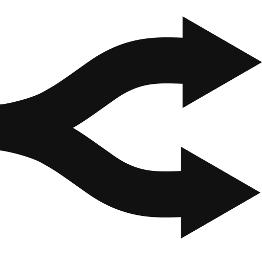 <code>openrouter</code></a></td><td align="center"><a href="../logos/pandas.svg"> <code>pandas</code></a></td><td align="center"><a href="../logos/pandas-wordmark.svg"> <code>pandas-wordmark</code></a></td><td align="center"><a href="../logos/paperclip-ai.svg">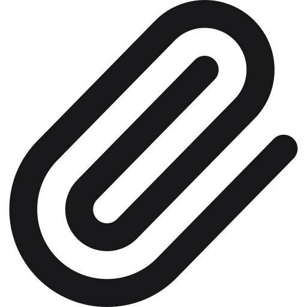 <code>paperclip-ai</code></a></td><td align="center"><a href="../logos/paperless-gpt.svg">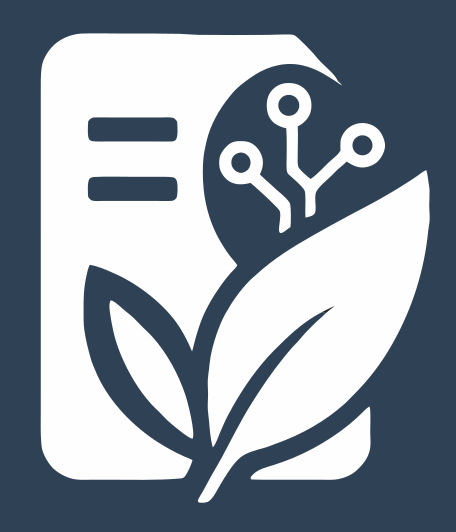 <code>paperless-gpt</code></a></td><td align="center"><a href="../logos/perplexity.svg"> <code>perplexity</code></a></td></tr>
<tr><td align="center"><a href="../logos/perplexity-ai.svg">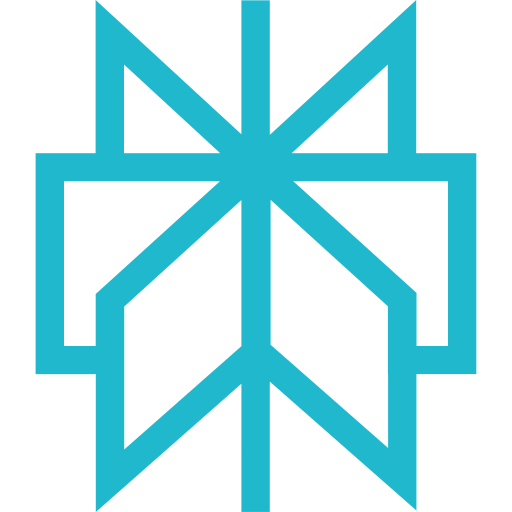 <code>perplexity-ai</code></a></td><td align="center"><a href="../logos/perplexity-wordmark.svg"> <code>perplexity-wordmark</code></a></td><td align="center"><a href="../logos/poolside-ai.svg"> <code>poolside-ai</code></a></td><td align="center"><a href="../logos/poper.svg">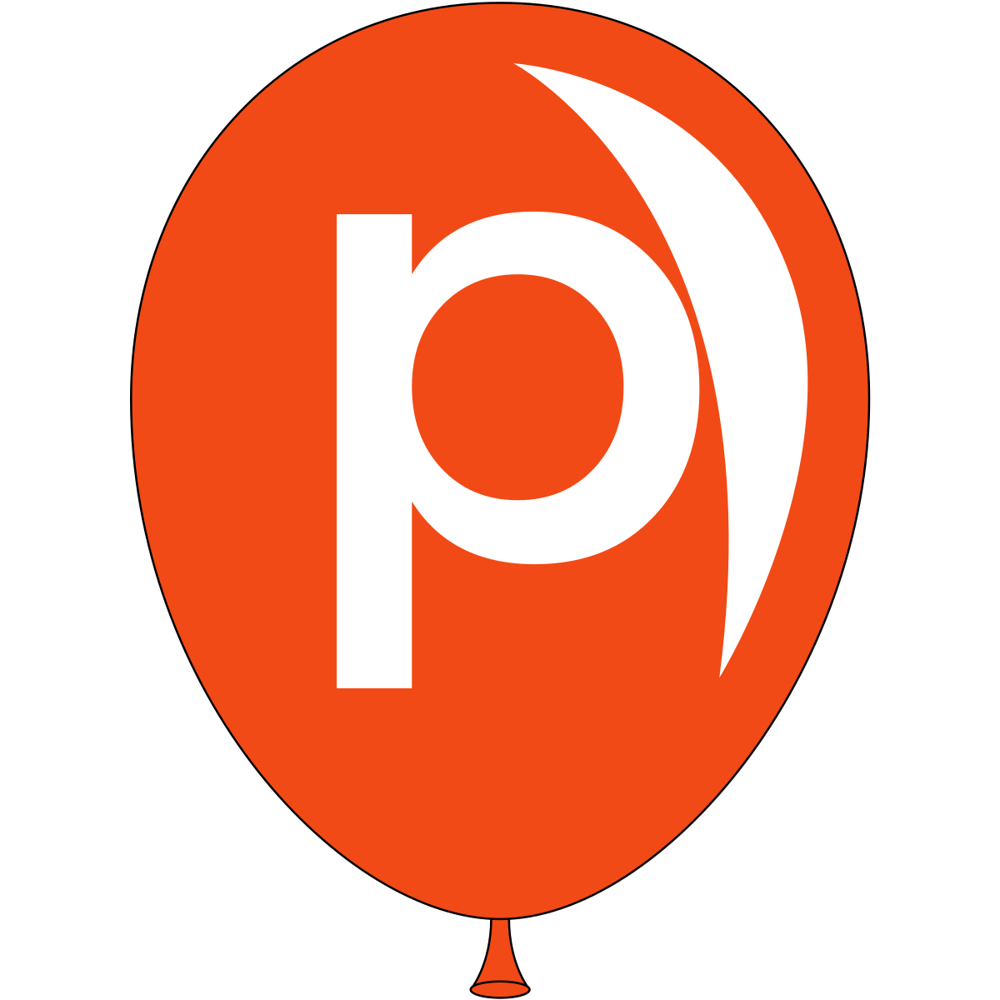 <code>poper</code></a></td><td align="center"><a href="../logos/pvy-ai.svg"> <code>pvy-ai</code></a></td><td align="center"><a href="../logos/pvy-ai-wordmark.svg"> <code>pvy-ai-wordmark</code></a></td></tr>
<tr><td align="center"><a href="../logos/pytorch.svg">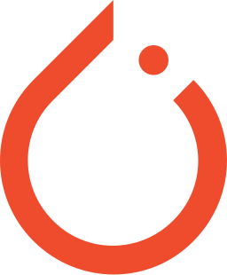 <code>pytorch</code></a></td><td align="center"><a href="../logos/pytorch-wordmark.svg"> <code>pytorch-wordmark</code></a></td><td align="center"><a href="../logos/qwen.svg"> <code>qwen</code></a></td><td align="center"><a href="../logos/qwen-wordmark.svg"> <code>qwen-wordmark</code></a></td><td align="center"><a href="../logos/replicate.svg"> <code>replicate</code></a></td><td align="center"><a href="../logos/runway.svg"> <code>runway</code></a></td></tr>
<tr><td align="center"><a href="../logos/sarvam.svg"> <code>sarvam</code></a></td><td align="center"><a href="../logos/sarvam-wordmark.svg"> <code>sarvam-wordmark</code></a></td><td align="center"><a href="../logos/seaborn.svg"> <code>seaborn</code></a></td><td align="center"><a href="../logos/seaborn-wordmark.svg"> <code>seaborn-wordmark</code></a></td><td align="center"><a href="../logos/stability-ai.svg"> <code>stability-ai</code></a></td><td align="center"><a href="../logos/stability-ai-wordmark.svg"> <code>stability-ai-wordmark</code></a></td></tr>
<tr><td align="center"><a href="../logos/streamlit.svg"> <code>streamlit</code></a></td><td align="center"><a href="../logos/suno.svg"> <code>suno</code></a></td><td align="center"><a href="../logos/tembo.svg"> <code>tembo</code></a></td><td align="center"><a href="../logos/tembo-wordmark.svg"> <code>tembo-wordmark</code></a></td><td align="center"><a href="../logos/tensorflow.svg"> <code>tensorflow</code></a></td><td align="center"><a href="../logos/together-ai.svg">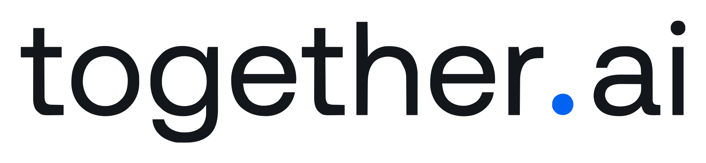 <code>together-ai</code></a></td></tr>
<tr><td align="center"><a href="../logos/v0.svg"> <code>v0</code></a></td><td align="center"><a href="../logos/vllm.svg"> <code>vllm</code></a></td><td align="center"><a href="../logos/x-ai.svg"> <code>x-ai</code></a></td><td align="center"><a href="../logos/z-ai.svg"> <code>z-ai</code></a></td></tr>
</table>

[⬅️ Back to the full catalog](../README.md)
