# ☁️ Cloud, Hosting & Infrastructure (559)

[⬅️ Back to the full catalog](../README.md) · [🖼️ Browse & download on the website](https://logos.lndev.me/)
<table>
<tr><td align="center"><a href="../logos/100tb.svg"> <code>100tb</code></a></td><td align="center"><a href="../logos/3-scale.svg"> <code>3-scale</code></a></td><td align="center"><a href="../logos/adobe-experience-platform.svg"> <code>adobe-experience-platform</code></a></td><td align="center"><a href="../logos/aeraki-mesh.svg">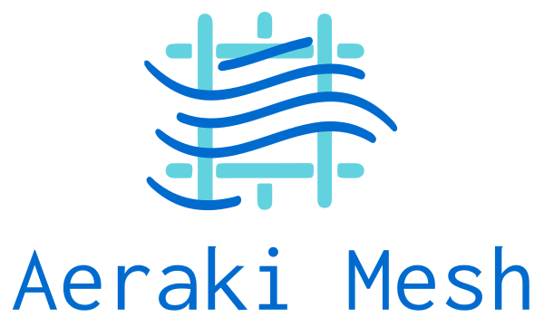 <code>aeraki-mesh</code></a></td><td align="center"><a href="../logos/afi-ai.svg">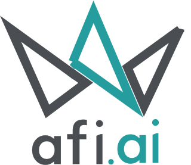 <code>afi-ai</code></a></td><td align="center"><a href="../logos/ahrefs.svg"> <code>ahrefs</code></a></td></tr>
<tr><td align="center"><a href="../logos/ahrefs-wordmark.svg"> <code>ahrefs-wordmark</code></a></td><td align="center"><a href="../logos/akamai.svg"> <code>akamai</code></a></td><td align="center"><a href="../logos/akana.svg"> <code>akana</code></a></td><td align="center"><a href="../logos/alibaba-cloud-container-service-for-kubernetes.svg"> <code>alibaba-cloud-container-service-for-kubernetes</code></a></td><td align="center"><a href="../logos/alibaba-cloud-file-storage.svg"> <code>alibaba-cloud-file-storage</code></a></td><td align="center"><a href="../logos/alibaba-cloud-file-storage-cpfs.svg">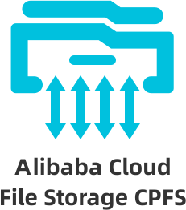 <code>alibaba-cloud-file-storage-cpfs</code></a></td></tr>
<tr><td align="center"><a href="../logos/alibaba-cloud-function-compute.svg">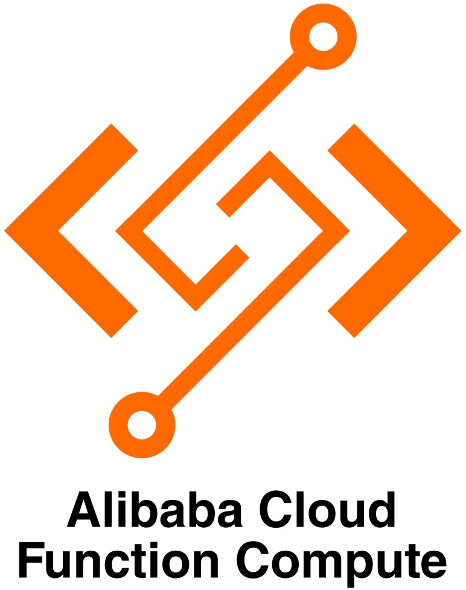 <code>alibaba-cloud-function-compute</code></a></td><td align="center"><a href="../logos/alibaba-nacos.svg">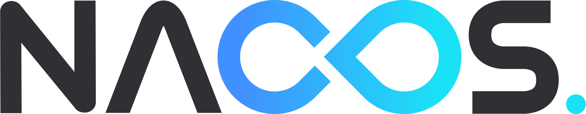 <code>alibaba-nacos</code></a></td><td align="center"><a href="../logos/alibaba-sae.svg">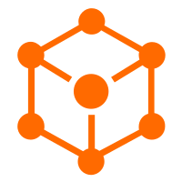 <code>alibaba-sae</code></a></td><td align="center"><a href="../logos/alibaba-tengine.svg">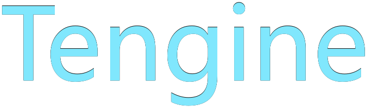 <code>alibaba-tengine</code></a></td><td align="center"><a href="../logos/alluxio.svg">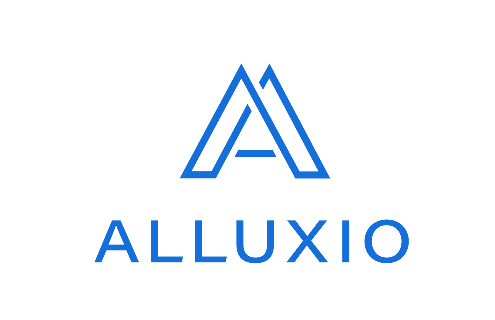 <code>alluxio</code></a></td><td align="center"><a href="../logos/alternate-dns.svg"> <code>alternate-dns</code></a></td></tr>
<tr><td align="center"><a href="../logos/alternate-dns-wordmark.svg"> <code>alternate-dns-wordmark</code></a></td><td align="center"><a href="../logos/amazon-ecs.svg"> <code>amazon-ecs</code></a></td><td align="center"><a href="../logos/amazon-ecs-wordmark.svg"> <code>amazon-ecs-wordmark</code></a></td><td align="center"><a href="../logos/amazon-elastic-block-store.svg">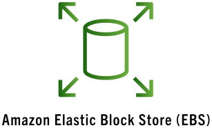 <code>amazon-elastic-block-store</code></a></td><td align="center"><a href="../logos/amazon-s3.svg"> <code>amazon-s3</code></a></td><td align="center"><a href="../logos/antrea.svg"> <code>antrea</code></a></td></tr>
<tr><td align="center"><a href="../logos/apache-camel-k.svg"> <code>apache-camel-k</code></a></td><td align="center"><a href="../logos/apioak.svg">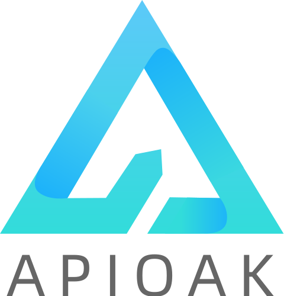 <code>apioak</code></a></td><td align="center"><a href="../logos/apisix.svg">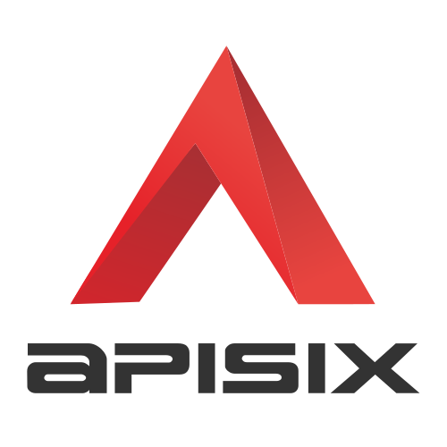 <code>apisix</code></a></td><td align="center"><a href="../logos/appfog.svg"> <code>appfog</code></a></td><td align="center"><a href="../logos/appwrite.svg"> <code>appwrite</code></a></td><td align="center"><a href="../logos/appwrite-wordmark.svg"> <code>appwrite-wordmark</code></a></td></tr>
<tr><td align="center"><a href="../logos/armada.svg">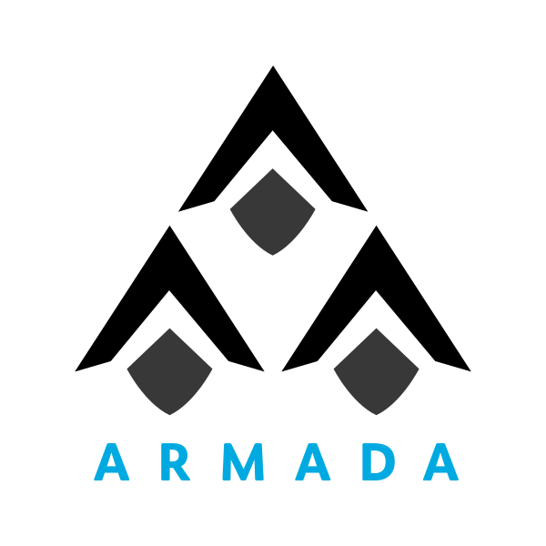 <code>armada</code></a></td><td align="center"><a href="../logos/asus-cloud-infra.svg"> <code>asus-cloud-infra</code></a></td><td align="center"><a href="../logos/aws.svg"> <code>aws</code></a></td><td align="center"><a href="../logos/aws-amplify.svg"> <code>aws-amplify</code></a></td><td align="center"><a href="../logos/aws-api-gateway.svg"> <code>aws-api-gateway</code></a></td><td align="center"><a href="../logos/aws-app-mesh.svg"> <code>aws-app-mesh</code></a></td></tr>
<tr><td align="center"><a href="../logos/aws-appflow.svg"> <code>aws-appflow</code></a></td><td align="center"><a href="../logos/aws-appsync.svg">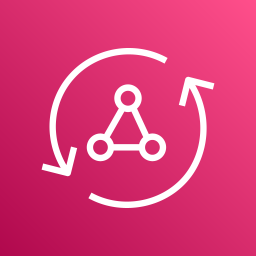 <code>aws-appsync</code></a></td><td align="center"><a href="../logos/aws-athena.svg">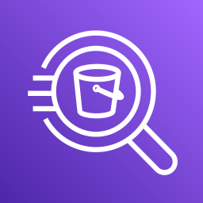 <code>aws-athena</code></a></td><td align="center"><a href="../logos/aws-aurora.svg"> <code>aws-aurora</code></a></td><td align="center"><a href="../logos/aws-backup.svg"> <code>aws-backup</code></a></td><td align="center"><a href="../logos/aws-batch.svg"> <code>aws-batch</code></a></td></tr>
<tr><td align="center"><a href="../logos/aws-certificate-manager.svg"> <code>aws-certificate-manager</code></a></td><td align="center"><a href="../logos/aws-cloud-map.svg">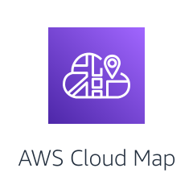 <code>aws-cloud-map</code></a></td><td align="center"><a href="../logos/aws-cloudformation.svg"> <code>aws-cloudformation</code></a></td><td align="center"><a href="../logos/aws-cloudfront.svg"> <code>aws-cloudfront</code></a></td><td align="center"><a href="../logos/aws-cloudsearch.svg"> <code>aws-cloudsearch</code></a></td><td align="center"><a href="../logos/aws-cloudtrail.svg"> <code>aws-cloudtrail</code></a></td></tr>
<tr><td align="center"><a href="../logos/aws-cloudwatch.svg"> <code>aws-cloudwatch</code></a></td><td align="center"><a href="../logos/aws-codebuild.svg"> <code>aws-codebuild</code></a></td><td align="center"><a href="../logos/aws-codecommit.svg"> <code>aws-codecommit</code></a></td><td align="center"><a href="../logos/aws-codedeploy.svg">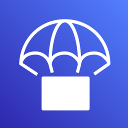 <code>aws-codedeploy</code></a></td><td align="center"><a href="../logos/aws-codepipeline.svg"> <code>aws-codepipeline</code></a></td><td align="center"><a href="../logos/aws-codestar.svg"> <code>aws-codestar</code></a></td></tr>
<tr><td align="center"><a href="../logos/aws-cognito.svg"> <code>aws-cognito</code></a></td><td align="center"><a href="../logos/aws-config.svg"> <code>aws-config</code></a></td><td align="center"><a href="../logos/aws-documentdb.svg"> <code>aws-documentdb</code></a></td><td align="center"><a href="../logos/aws-dynamodb.svg"> <code>aws-dynamodb</code></a></td><td align="center"><a href="../logos/aws-ec2.svg">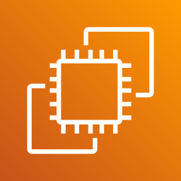 <code>aws-ec2</code></a></td><td align="center"><a href="../logos/aws-ecs.svg"> <code>aws-ecs</code></a></td></tr>
<tr><td align="center"><a href="../logos/aws-eks.svg">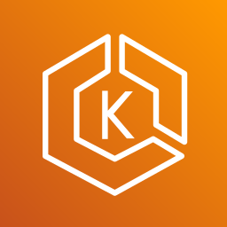 <code>aws-eks</code></a></td><td align="center"><a href="../logos/aws-elastic-beanstalk.svg"> <code>aws-elastic-beanstalk</code></a></td><td align="center"><a href="../logos/aws-elastic-cache.svg">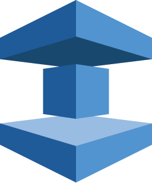 <code>aws-elastic-cache</code></a></td><td align="center"><a href="../logos/aws-elasticache.svg"> <code>aws-elasticache</code></a></td><td align="center"><a href="../logos/aws-elb.svg"> <code>aws-elb</code></a></td><td align="center"><a href="../logos/aws-eventbridge.svg"> <code>aws-eventbridge</code></a></td></tr>
<tr><td align="center"><a href="../logos/aws-fargate.svg">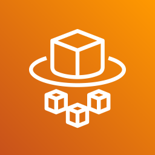 <code>aws-fargate</code></a></td><td align="center"><a href="../logos/aws-glacier.svg"> <code>aws-glacier</code></a></td><td align="center"><a href="../logos/aws-glue.svg">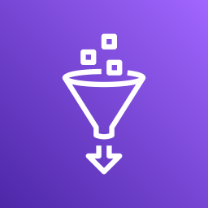 <code>aws-glue</code></a></td><td align="center"><a href="../logos/aws-iam.svg"> <code>aws-iam</code></a></td><td align="center"><a href="../logos/aws-keyspaces.svg">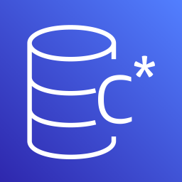 <code>aws-keyspaces</code></a></td><td align="center"><a href="../logos/aws-kinesis.svg"> <code>aws-kinesis</code></a></td></tr>
<tr><td align="center"><a href="../logos/aws-kms.svg"> <code>aws-kms</code></a></td><td align="center"><a href="../logos/aws-lake-formation.svg">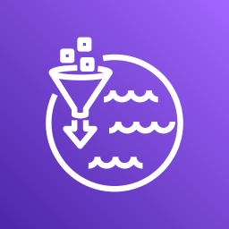 <code>aws-lake-formation</code></a></td><td align="center"><a href="../logos/aws-lambda.svg"> <code>aws-lambda</code></a></td><td align="center"><a href="../logos/aws-lightsail.svg"> <code>aws-lightsail</code></a></td><td align="center"><a href="../logos/aws-mobilehub.svg"> <code>aws-mobilehub</code></a></td><td align="center"><a href="../logos/aws-mq.svg"> <code>aws-mq</code></a></td></tr>
<tr><td align="center"><a href="../logos/aws-msk.svg"> <code>aws-msk</code></a></td><td align="center"><a href="../logos/aws-neptune.svg"> <code>aws-neptune</code></a></td><td align="center"><a href="../logos/aws-open-search.svg"> <code>aws-open-search</code></a></td><td align="center"><a href="../logos/aws-opsworks.svg"> <code>aws-opsworks</code></a></td><td align="center"><a href="../logos/aws-quicksight.svg"> <code>aws-quicksight</code></a></td><td align="center"><a href="../logos/aws-rds.svg"> <code>aws-rds</code></a></td></tr>
<tr><td align="center"><a href="../logos/aws-redshift.svg"> <code>aws-redshift</code></a></td><td align="center"><a href="../logos/aws-route53.svg"> <code>aws-route53</code></a></td><td align="center"><a href="../logos/aws-s3.svg"> <code>aws-s3</code></a></td><td align="center"><a href="../logos/aws-sam.svg">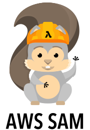 <code>aws-sam</code></a></td><td align="center"><a href="../logos/aws-secrets-manager.svg"> <code>aws-secrets-manager</code></a></td><td align="center"><a href="../logos/aws-ses.svg"> <code>aws-ses</code></a></td></tr>
<tr><td align="center"><a href="../logos/aws-shield.svg"> <code>aws-shield</code></a></td><td align="center"><a href="../logos/aws-sns.svg"> <code>aws-sns</code></a></td><td align="center"><a href="../logos/aws-sqs.svg"> <code>aws-sqs</code></a></td><td align="center"><a href="../logos/aws-step-functions.svg"> <code>aws-step-functions</code></a></td><td align="center"><a href="../logos/aws-systems-manager.svg"> <code>aws-systems-manager</code></a></td><td align="center"><a href="../logos/aws-timestream.svg">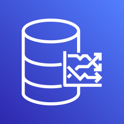 <code>aws-timestream</code></a></td></tr>
<tr><td align="center"><a href="../logos/aws-vpc.svg"> <code>aws-vpc</code></a></td><td align="center"><a href="../logos/aws-waf.svg"> <code>aws-waf</code></a></td><td align="center"><a href="../logos/aws-xray.svg"> <code>aws-xray</code></a></td><td align="center"><a href="../logos/azure.svg"> <code>azure</code></a></td><td align="center"><a href="../logos/azure-api-management.svg"> <code>azure-api-management</code></a></td><td align="center"><a href="../logos/azure-disk-storage.svg">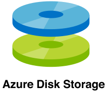 <code>azure-disk-storage</code></a></td></tr>
<tr><td align="center"><a href="../logos/azure-dns.svg"> <code>azure-dns</code></a></td><td align="center"><a href="../logos/azure-service-fabric.svg">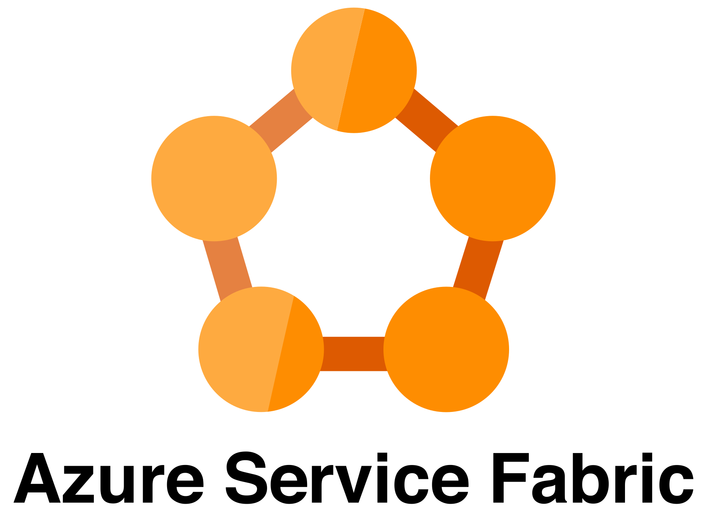 <code>azure-service-fabric</code></a></td><td align="center"><a href="../logos/azure-wordmark.svg"> <code>azure-wordmark</code></a></td><td align="center"><a href="../logos/backend-ai.svg"> <code>backend-ai</code></a></td><td align="center"><a href="../logos/baidu-cfc.svg"> <code>baidu-cfc</code></a></td><td align="center"><a href="../logos/balena.svg"> <code>balena</code></a></td></tr>
<tr><td align="center"><a href="../logos/balena-cloud.svg"> <code>balena-cloud</code></a></td><td align="center"><a href="../logos/bfe.svg">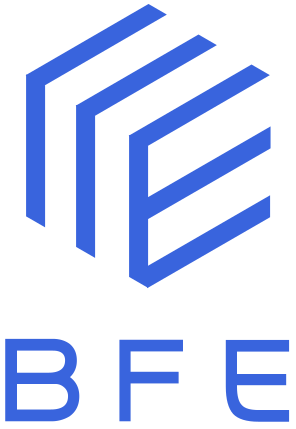 <code>bfe</code></a></td><td align="center"><a href="../logos/bitballoon.svg"> <code>bitballoon</code></a></td><td align="center"><a href="../logos/bluemix.svg">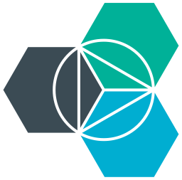 <code>bluemix</code></a></td><td align="center"><a href="../logos/bootc.svg"> <code>bootc</code></a></td><td align="center"><a href="../logos/bunny-net.svg"> <code>bunny-net</code></a></td></tr>
<tr><td align="center"><a href="../logos/bunny-net-wordmark.svg"> <code>bunny-net-wordmark</code></a></td><td align="center"><a href="../logos/capsule.svg"> <code>capsule</code></a></td><td align="center"><a href="../logos/carina.svg">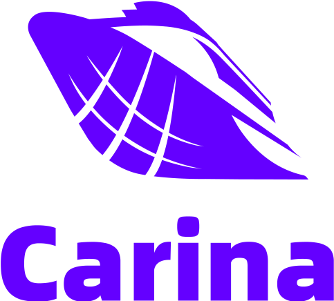 <code>carina</code></a></td><td align="center"><a href="../logos/catalyst-by-zoho.svg"> <code>catalyst-by-zoho</code></a></td><td align="center"><a href="../logos/chalice.svg">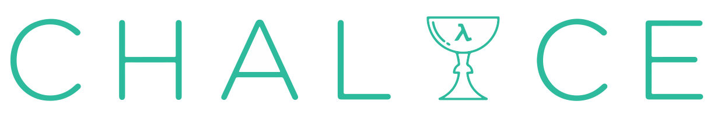 <code>chalice</code></a></td><td align="center"><a href="../logos/china-mobile-cloud-cnp.svg">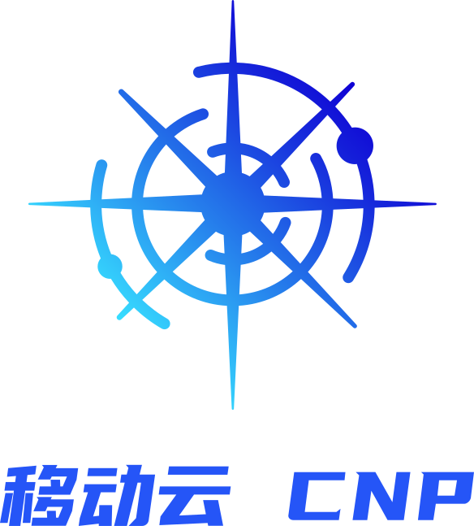 <code>china-mobile-cloud-cnp</code></a></td></tr>
<tr><td align="center"><a href="../logos/china-mobile-panji-paas.svg"> <code>china-mobile-panji-paas</code></a></td><td align="center"><a href="../logos/clevercloud.svg">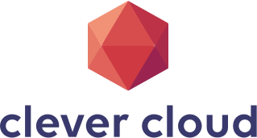 <code>clevercloud</code></a></td><td align="center"><a href="../logos/cloud-native-build.svg"> <code>cloud-native-build</code></a></td><td align="center"><a href="../logos/cloud-native-landscape.svg">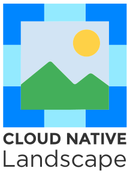 <code>cloud-native-landscape</code></a></td><td align="center"><a href="../logos/cloudcasa.svg"> <code>cloudcasa</code></a></td><td align="center"><a href="../logos/cloudflare.svg"> <code>cloudflare</code></a></td></tr>
<tr><td align="center"><a href="../logos/cloudflare-wordmark.svg"> <code>cloudflare-wordmark</code></a></td><td align="center"><a href="../logos/cloudflare-workers.svg"> <code>cloudflare-workers</code></a></td><td align="center"><a href="../logos/cloudflare-workers-wordmark.svg"> <code>cloudflare-workers-wordmark</code></a></td><td align="center"><a href="../logos/cloudinary.svg"> <code>cloudinary</code></a></td><td align="center"><a href="../logos/cloudinary-wordmark.svg"> <code>cloudinary-wordmark</code></a></td><td align="center"><a href="../logos/cloudlinux.svg"> <code>cloudlinux</code></a></td></tr>
<tr><td align="center"><a href="../logos/clush-kube.svg"> <code>clush-kube</code></a></td><td align="center"><a href="../logos/clusterhq.svg"> <code>clusterhq</code></a></td><td align="center"><a href="../logos/clusternet.svg">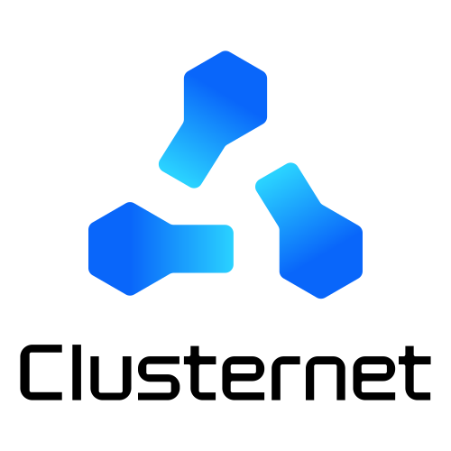 <code>clusternet</code></a></td><td align="center"><a href="../logos/clusterpedia.svg">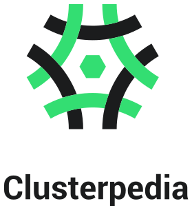 <code>clusterpedia</code></a></td><td align="center"><a href="../logos/cni-genie.svg"> <code>cni-genie</code></a></td><td align="center"><a href="../logos/cocktail-cloud.svg"> <code>cocktail-cloud</code></a></td></tr>
<tr><td align="center"><a href="../logos/commvault.svg">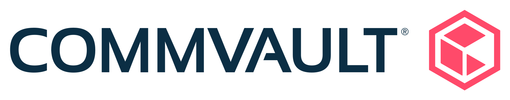 <code>commvault</code></a></td><td align="center"><a href="../logos/container-network-interface-cni.svg">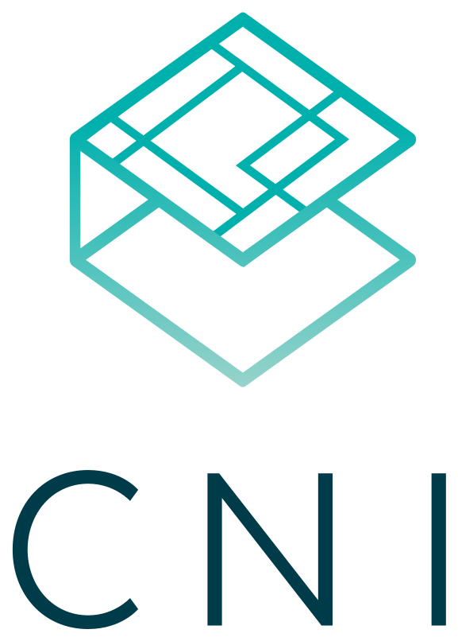 <code>container-network-interface-cni</code></a></td><td align="center"><a href="../logos/container-storage-interface-csi.svg">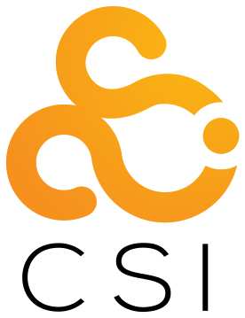 <code>container-storage-interface-csi</code></a></td><td align="center"><a href="../logos/containership.svg"> <code>containership</code></a></td><td align="center"><a href="../logos/contour.svg"> <code>contour</code></a></td><td align="center"><a href="../logos/convox.svg"> <code>convox</code></a></td></tr>
<tr><td align="center"><a href="../logos/convox-wordmark.svg"> <code>convox-wordmark</code></a></td><td align="center"><a href="../logos/coreos.svg"> <code>coreos</code></a></td><td align="center"><a href="../logos/coreos-wordmark.svg"> <code>coreos-wordmark</code></a></td><td align="center"><a href="../logos/cozystack.svg">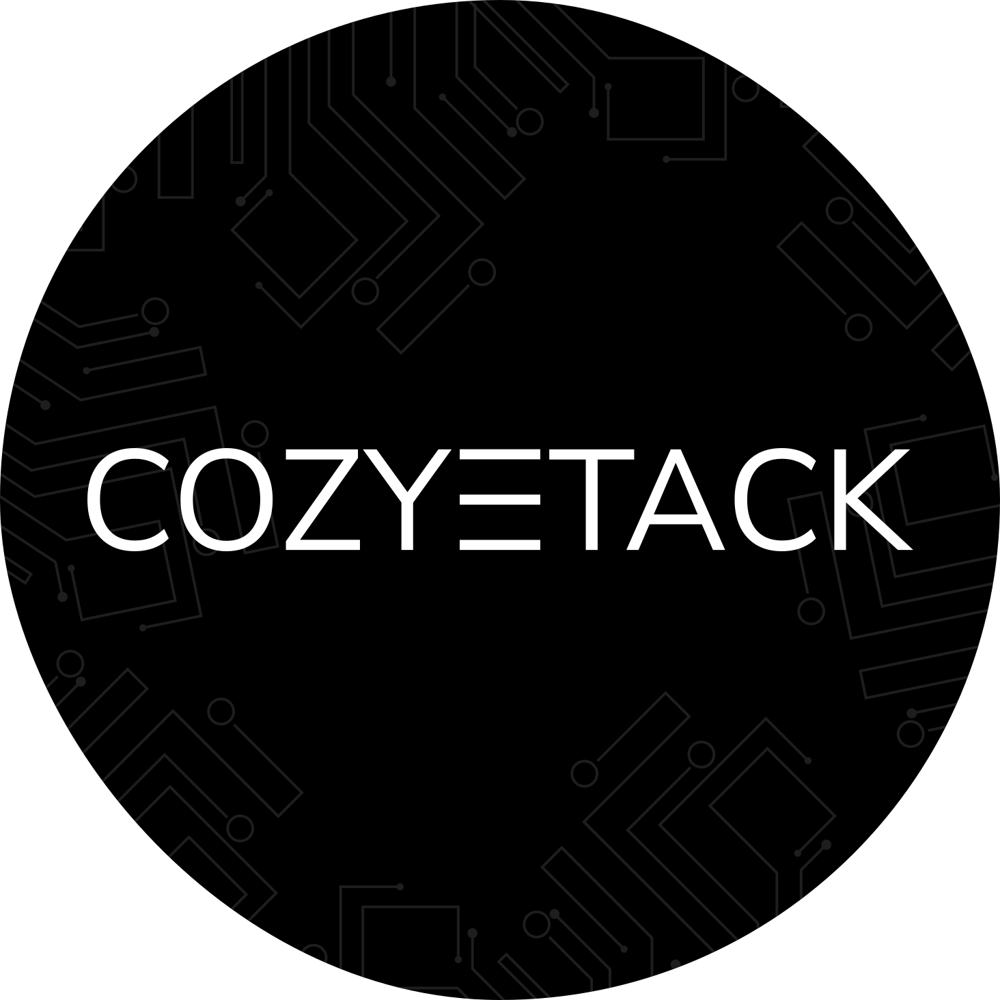 <code>cozystack</code></a></td><td align="center"><a href="../logos/cpanel.svg"> <code>cpanel</code></a></td><td align="center"><a href="../logos/cubefs.svg">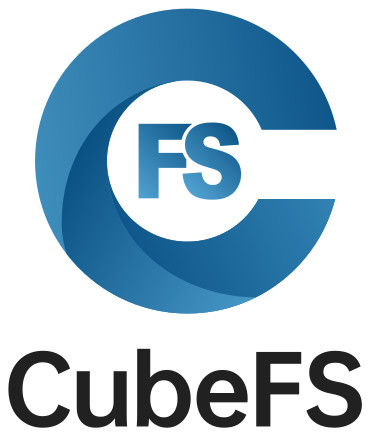 <code>cubefs</code></a></td></tr>
<tr><td align="center"><a href="../logos/cubex.svg"> <code>cubex</code></a></td><td align="center"><a href="../logos/cumulus.svg"> <code>cumulus</code></a></td><td align="center"><a href="../logos/dashbird.svg"> <code>dashbird</code></a></td><td align="center"><a href="../logos/datacore-puls8.svg"> <code>datacore-puls8</code></a></td><td align="center"><a href="../logos/datenlord.svg"> <code>datenlord</code></a></td><td align="center"><a href="../logos/datera.svg"> <code>datera</code></a></td></tr>
<tr><td align="center"><a href="../logos/dcos.svg"> <code>dcos</code></a></td><td align="center"><a href="../logos/dcos-wordmark.svg"> <code>dcos-wordmark</code></a></td><td align="center"><a href="../logos/dell-emc.svg"> <code>dell-emc</code></a></td><td align="center"><a href="../logos/desktop-kubernetes.svg">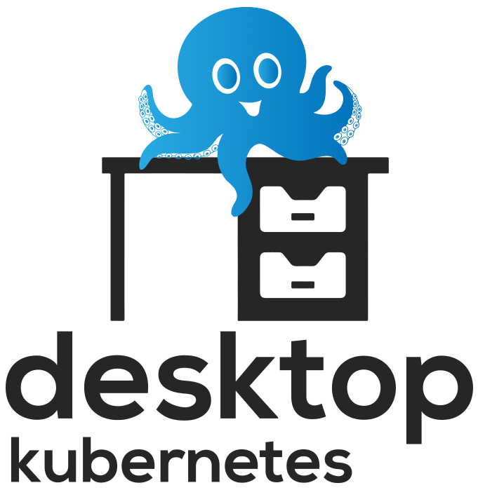 <code>desktop-kubernetes</code></a></td><td align="center"><a href="../logos/digital-ocean.svg">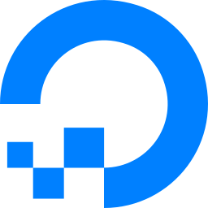 <code>digital-ocean</code></a></td><td align="center"><a href="../logos/digital-ocean-kubernetes.svg"> <code>digital-ocean-kubernetes</code></a></td></tr>
<tr><td align="center"><a href="../logos/digital-ocean-wordmark.svg"> <code>digital-ocean-wordmark</code></a></td><td align="center"><a href="../logos/direktiv.svg">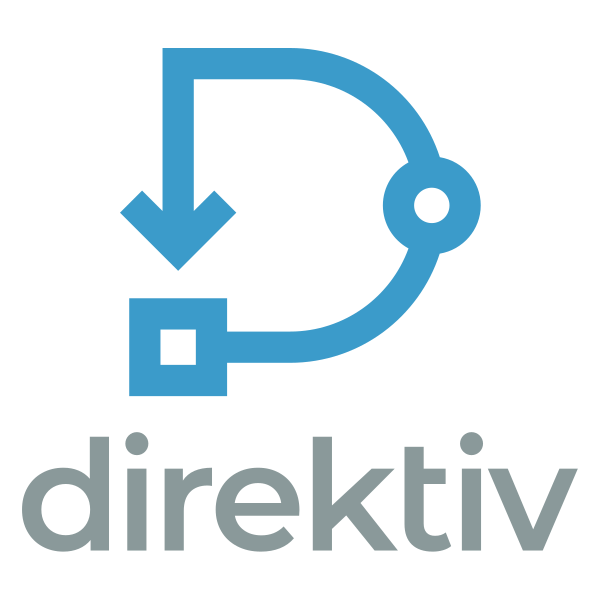 <code>direktiv</code></a></td><td align="center"><a href="../logos/divshot.svg"> <code>divshot</code></a></td><td align="center"><a href="../logos/dns-private-resolver.svg"> <code>dns-private-resolver</code></a></td><td align="center"><a href="../logos/dns-zone.svg"> <code>dns-zone</code></a></td><td align="center"><a href="../logos/dockerswarm.svg">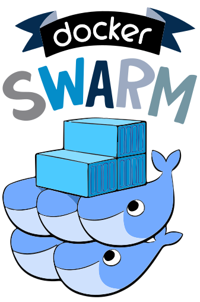 <code>dockerswarm</code></a></td></tr>
<tr><td align="center"><a href="../logos/dolphin-scheduler.svg">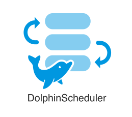 <code>dolphin-scheduler</code></a></td><td align="center"><a href="../logos/dotcloud.svg"> <code>dotcloud</code></a></td><td align="center"><a href="../logos/dreamhost.svg"> <code>dreamhost</code></a></td><td align="center"><a href="../logos/dreamhost-wordmark.svg"> <code>dreamhost-wordmark</code></a></td><td align="center"><a href="../logos/drivescale.svg">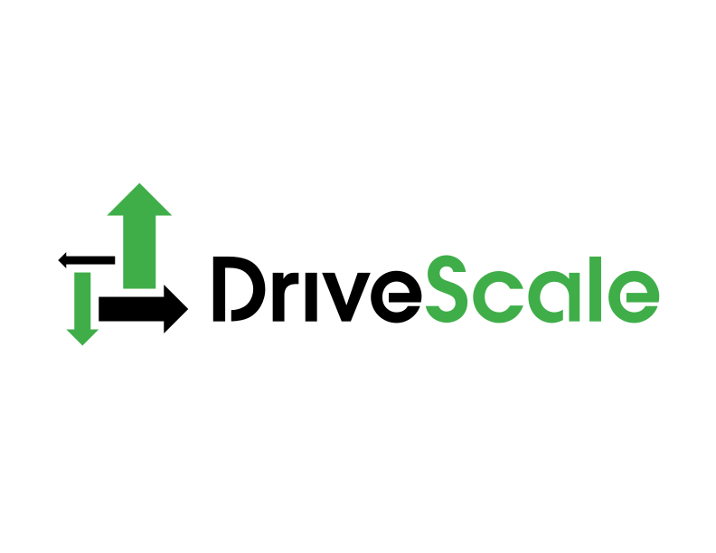 <code>drivescale</code></a></td><td align="center"><a href="../logos/dyndns.svg"> <code>dyndns</code></a></td></tr>
<tr><td align="center"><a href="../logos/easegress.svg">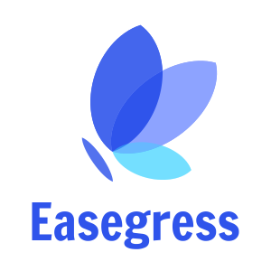 <code>easegress</code></a></td><td align="center"><a href="../logos/easemesh.svg"> <code>easemesh</code></a></td><td align="center"><a href="../logos/easystack-eks.svg"> <code>easystack-eks</code></a></td><td align="center"><a href="../logos/edgio.svg"> <code>edgio</code></a></td><td align="center"><a href="../logos/edgio-wordmark.svg"> <code>edgio-wordmark</code></a></td><td align="center"><a href="../logos/elastic-cloud.svg"> <code>elastic-cloud</code></a></td></tr>
<tr><td align="center"><a href="../logos/elasticbox.svg">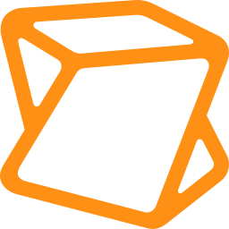 <code>elasticbox</code></a></td><td align="center"><a href="../logos/emissary-ingress.svg"> <code>emissary-ingress</code></a></td><td align="center"><a href="../logos/encore.svg"> <code>encore</code></a></td><td align="center"><a href="../logos/engine-yard.svg"> <code>engine-yard</code></a></td><td align="center"><a href="../logos/engine-yard-wordmark.svg"> <code>engine-yard-wordmark</code></a></td><td align="center"><a href="../logos/envoy-gateway.svg">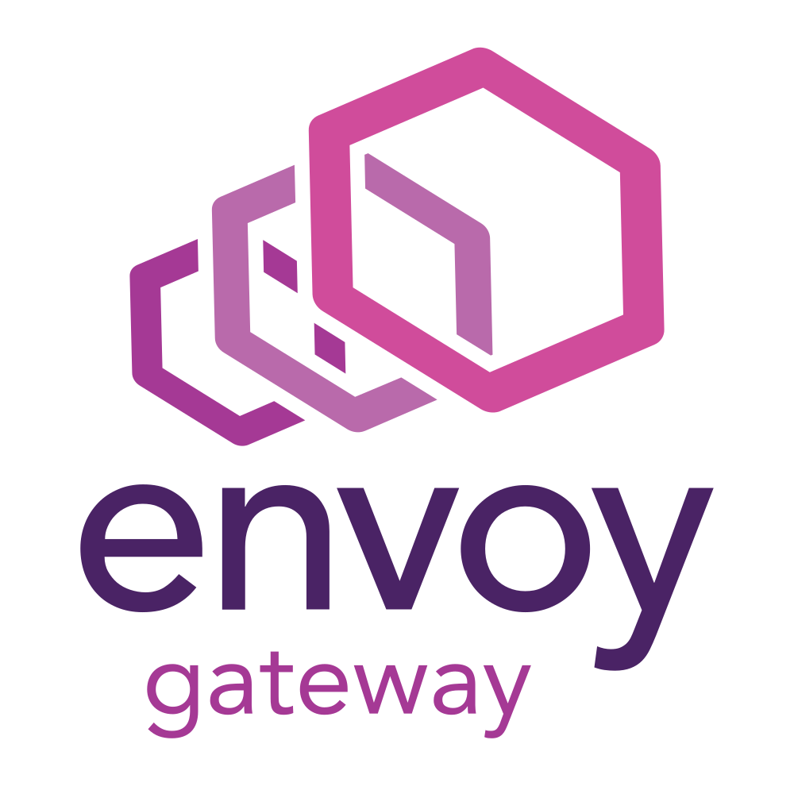 <code>envoy-gateway</code></a></td></tr>
<tr><td align="center"><a href="../logos/eventmesh.svg">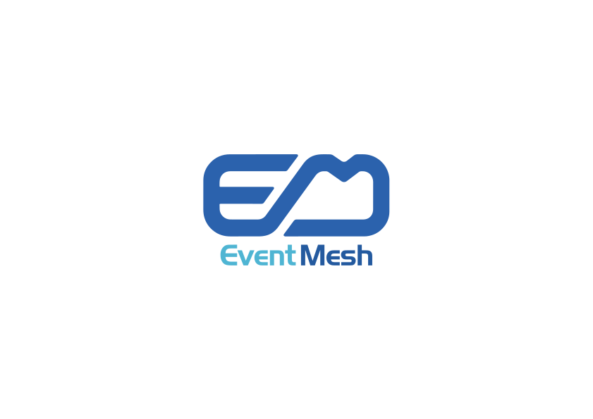 <code>eventmesh</code></a></td><td align="center"><a href="../logos/expontech.svg"> <code>expontech</code></a></td><td align="center"><a href="../logos/fabedge.svg"> <code>fabedge</code></a></td><td align="center"><a href="../logos/fastly.svg"> <code>fastly</code></a></td><td align="center"><a href="../logos/fdio.svg"> <code>fdio</code></a></td><td align="center"><a href="../logos/firebase.svg"> <code>firebase</code></a></td></tr>
<tr><td align="center"><a href="../logos/firebase-wordmark.svg"> <code>firebase-wordmark</code></a></td><td align="center"><a href="../logos/firecracker.svg">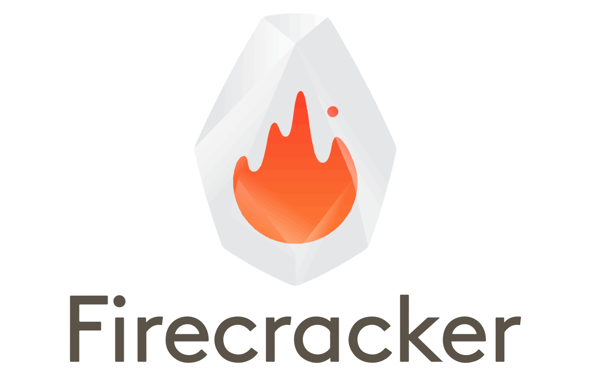 <code>firecracker</code></a></td><td align="center"><a href="../logos/fission.svg"> <code>fission</code></a></td><td align="center"><a href="../logos/flannel.svg"> <code>flannel</code></a></td><td align="center"><a href="../logos/flatcar.svg"> <code>flatcar</code></a></td><td align="center"><a href="../logos/flocker.svg">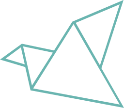 <code>flocker</code></a></td></tr>
<tr><td align="center"><a href="../logos/flogo.svg"> <code>flogo</code></a></td><td align="center"><a href="../logos/fluid.svg"> <code>fluid</code></a></td><td align="center"><a href="../logos/fly.svg"> <code>fly</code></a></td><td align="center"><a href="../logos/fly-wordmark.svg"> <code>fly-wordmark</code></a></td><td align="center"><a href="../logos/frappe-cloud.svg"> <code>frappe-cloud</code></a></td><td align="center"><a href="../logos/fsm.svg"> <code>fsm</code></a></td></tr>
<tr><td align="center"><a href="../logos/fuga-cloud.svg"> <code>fuga-cloud</code></a></td><td align="center"><a href="../logos/gandi.svg"> <code>gandi</code></a></td><td align="center"><a href="../logos/gandi-wordmark.svg"> <code>gandi-wordmark</code></a></td><td align="center"><a href="../logos/gardener.svg"> <code>gardener</code></a></td><td align="center"><a href="../logos/giantswarm.svg"> <code>giantswarm</code></a></td><td align="center"><a href="../logos/glasnostic.svg"> <code>glasnostic</code></a></td></tr>
<tr><td align="center"><a href="../logos/gloo.svg"> <code>gloo</code></a></td><td align="center"><a href="../logos/gloomesh.svg"> <code>gloomesh</code></a></td><td align="center"><a href="../logos/gluster.svg">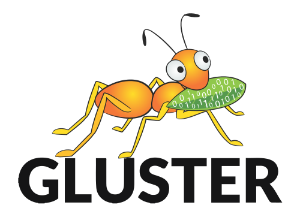 <code>gluster</code></a></td><td align="center"><a href="../logos/godaddy.svg"> <code>godaddy</code></a></td><td align="center"><a href="../logos/godaddy-wordmark.svg"> <code>godaddy-wordmark</code></a></td><td align="center"><a href="../logos/godel-scheduler.svg">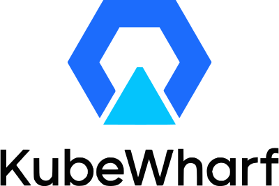 <code>godel-scheduler</code></a></td></tr>
<tr><td align="center"><a href="../logos/google-cloud.svg"> <code>google-cloud</code></a></td><td align="center"><a href="../logos/google-cloud-composer.svg"> <code>google-cloud-composer</code></a></td><td align="center"><a href="../logos/google-cloud-functions.svg"> <code>google-cloud-functions</code></a></td><td align="center"><a href="../logos/google-cloud-platform.svg"> <code>google-cloud-platform</code></a></td><td align="center"><a href="../logos/google-cloud-run.svg"> <code>google-cloud-run</code></a></td><td align="center"><a href="../logos/google-cloud-run-wordmark.svg"> <code>google-cloud-run-wordmark</code></a></td></tr>
<tr><td align="center"><a href="../logos/google-cloud-spanner.svg">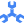 <code>google-cloud-spanner</code></a></td><td align="center"><a href="../logos/google-cloud-storage.svg">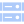 <code>google-cloud-storage</code></a></td><td align="center"><a href="../logos/google-cloud-wordmark.svg"> <code>google-cloud-wordmark</code></a></td><td align="center"><a href="../logos/google-persistent-disk.svg"> <code>google-persistent-disk</code></a></td><td align="center"><a href="../logos/graphcool.svg"> <code>graphcool</code></a></td><td align="center"><a href="../logos/graphcool-wordmark.svg"> <code>graphcool-wordmark</code></a></td></tr>
<tr><td align="center"><a href="../logos/gravitee.svg"> <code>gravitee</code></a></td><td align="center"><a href="../logos/grey-matter.svg"> <code>grey-matter</code></a></td><td align="center"><a href="../logos/guardi-core-centra.svg">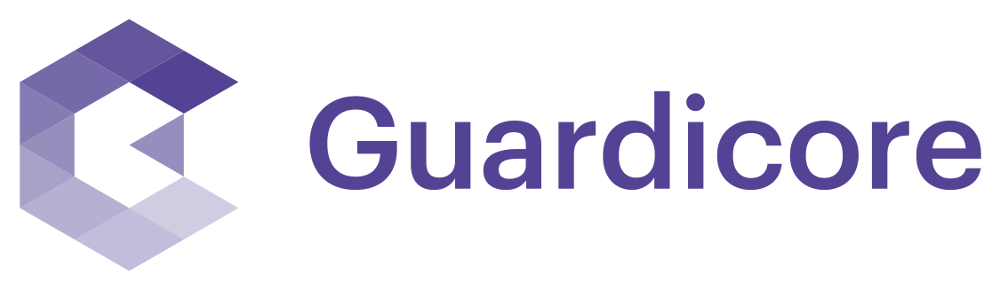 <code>guardi-core-centra</code></a></td><td align="center"><a href="../logos/gvisor.svg"> <code>gvisor</code></a></td><td align="center"><a href="../logos/h3-c-cloud-os.svg"> <code>h3-c-cloud-os</code></a></td><td align="center"><a href="../logos/hami.svg">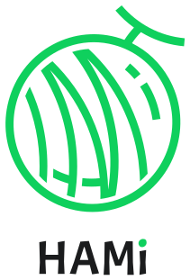 <code>hami</code></a></td></tr>
<tr><td align="center"><a href="../logos/hango.svg"> <code>hango</code></a></td><td align="center"><a href="../logos/hasura.svg"> <code>hasura</code></a></td><td align="center"><a href="../logos/hasura-graphqlengine.svg"> <code>hasura-graphqlengine</code></a></td><td align="center"><a href="../logos/hasura-wordmark.svg"> <code>hasura-wordmark</code></a></td><td align="center"><a href="../logos/heroku.svg"> <code>heroku</code></a></td><td align="center"><a href="../logos/heroku-redis.svg"> <code>heroku-redis</code></a></td></tr>
<tr><td align="center"><a href="../logos/heroku-wordmark.svg"> <code>heroku-wordmark</code></a></td><td align="center"><a href="../logos/higress.svg"> <code>higress</code></a></td><td align="center"><a href="../logos/hikube.svg"> <code>hikube</code></a></td><td align="center"><a href="../logos/hostgator.svg"> <code>hostgator</code></a></td><td align="center"><a href="../logos/hostgator-wordmark.svg"> <code>hostgator-wordmark</code></a></td><td align="center"><a href="../logos/huawei-cloud-container-engine-cce.svg"> <code>huawei-cloud-container-engine-cce</code></a></td></tr>
<tr><td align="center"><a href="../logos/huawei-functionstage.svg"> <code>huawei-functionstage</code></a></td><td align="center"><a href="../logos/hwameistor.svg">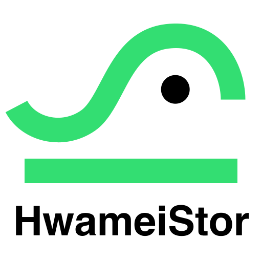 <code>hwameistor</code></a></td><td align="center"><a href="../logos/hyperlight.svg">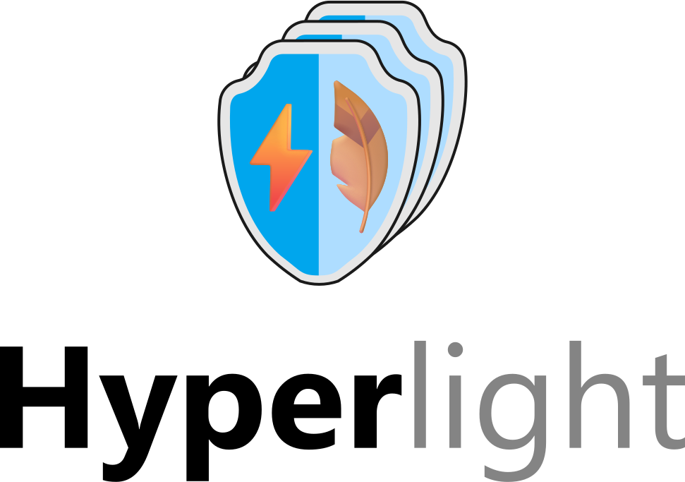 <code>hyperlight</code></a></td><td align="center"><a href="../logos/ibm-cloud.svg"> <code>ibm-cloud</code></a></td><td align="center"><a href="../logos/ibm-cloud-wordmark.svg"> <code>ibm-cloud-wordmark</code></a></td><td align="center"><a href="../logos/ibm-kubernetes.svg">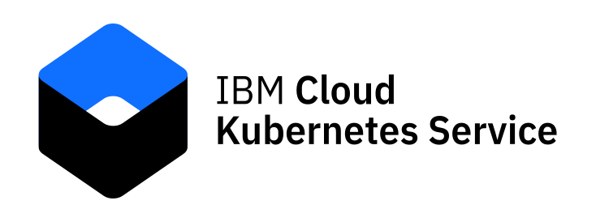 <code>ibm-kubernetes</code></a></td></tr>
<tr><td align="center"><a href="../logos/ibm-storage.svg">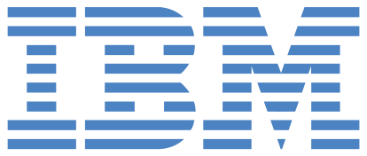 <code>ibm-storage</code></a></td><td align="center"><a href="../logos/ibmcloud-codeengine.svg">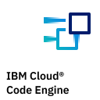 <code>ibmcloud-codeengine</code></a></td><td align="center"><a href="../logos/ibmcloud-functions.svg"> <code>ibmcloud-functions</code></a></td><td align="center"><a href="../logos/inclavare.svg">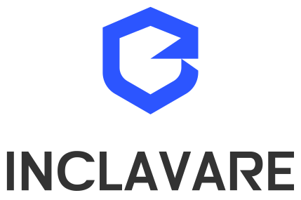 <code>inclavare</code></a></td><td align="center"><a href="../logos/infinidat.svg"> <code>infinidat</code></a></td><td align="center"><a href="../logos/infoscale.svg">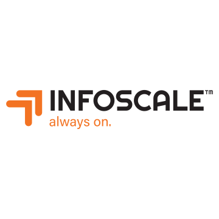 <code>infoscale</code></a></td></tr>
<tr><td align="center"><a href="../logos/inlets.svg">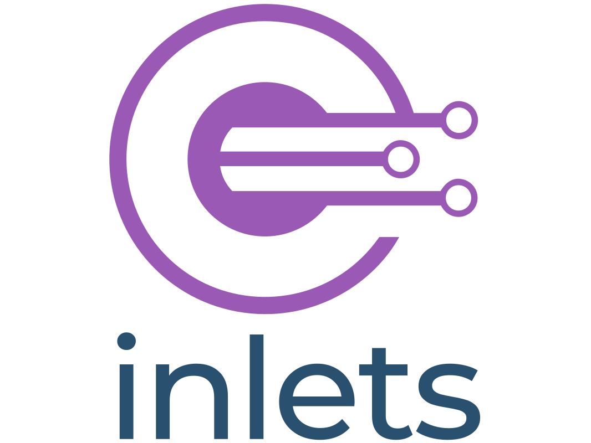 <code>inlets</code></a></td><td align="center"><a href="../logos/intello.svg"> <code>intello</code></a></td><td align="center"><a href="../logos/intello-wordmark.svg"> <code>intello-wordmark</code></a></td><td align="center"><a href="../logos/interlink.svg"> <code>interlink</code></a></td><td align="center"><a href="../logos/iomesh.svg"> <code>iomesh</code></a></td><td align="center"><a href="../logos/ionir.svg">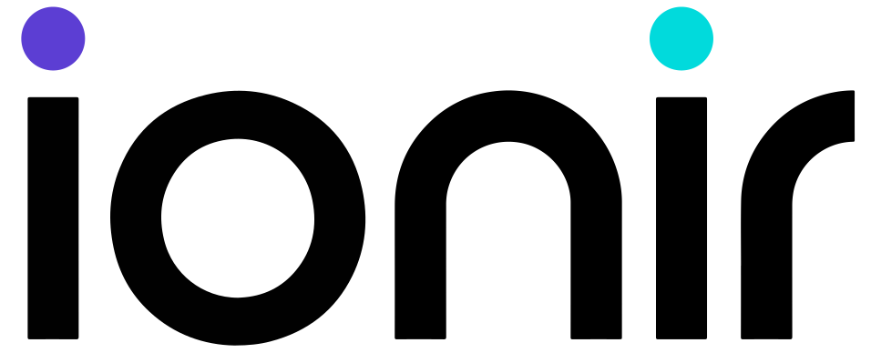 <code>ionir</code></a></td></tr>
<tr><td align="center"><a href="../logos/iron.svg"> <code>iron</code></a></td><td align="center"><a href="../logos/iron-wordmark.svg"> <code>iron-wordmark</code></a></td><td align="center"><a href="../logos/isscloud.svg"> <code>isscloud</code></a></td><td align="center"><a href="../logos/isulad.svg">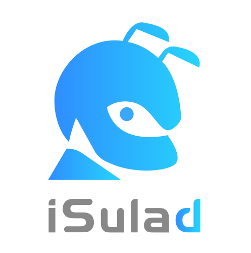 <code>isulad</code></a></td><td align="center"><a href="../logos/jelastic.svg"> <code>jelastic</code></a></td><td align="center"><a href="../logos/jelastic-wordmark.svg"> <code>jelastic-wordmark</code></a></td></tr>
<tr><td align="center"><a href="../logos/jsdelivr.svg"> <code>jsdelivr</code></a></td><td align="center"><a href="../logos/jsdelivr-wordmark.svg"> <code>jsdelivr-wordmark</code></a></td><td align="center"><a href="../logos/juicefs.svg"> <code>juicefs</code></a></td><td align="center"><a href="../logos/juju.svg"> <code>juju</code></a></td><td align="center"><a href="../logos/k0rdent.svg"> <code>k0rdent</code></a></td><td align="center"><a href="../logos/k0rdent-logo-1.svg">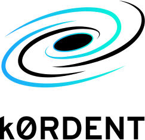 <code>k0rdent-logo-1</code></a></td></tr>
<tr><td align="center"><a href="../logos/k0s-logo-2025.svg"> <code>k0s-logo-2025</code></a></td><td align="center"><a href="../logos/k3k.svg">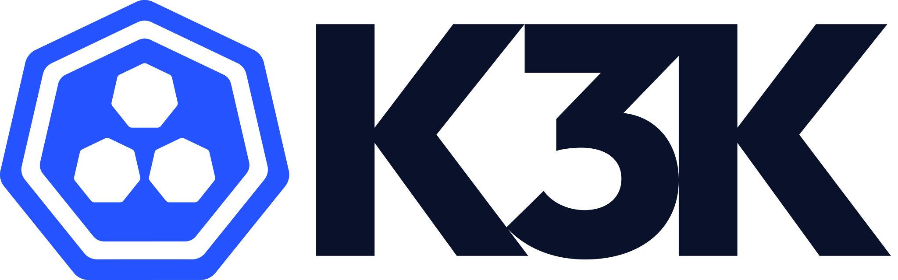 <code>k3k</code></a></td><td align="center"><a href="../logos/k8gb.svg"> <code>k8gb</code></a></td><td align="center"><a href="../logos/k8s-the-easier-way.svg">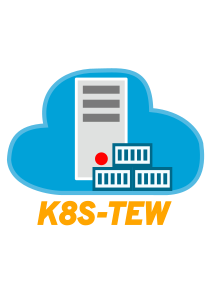 <code>k8s-the-easier-way</code></a></td><td align="center"><a href="../logos/k8up.svg"> <code>k8up</code></a></td><td align="center"><a href="../logos/kanister.svg">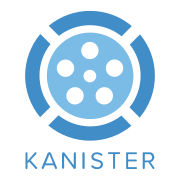 <code>kanister</code></a></td></tr>
<tr><td align="center"><a href="../logos/karmada.svg"> <code>karmada</code></a></td><td align="center"><a href="../logos/kasten.svg">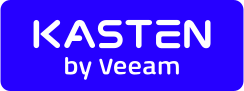 <code>kasten</code></a></td><td align="center"><a href="../logos/kata.svg">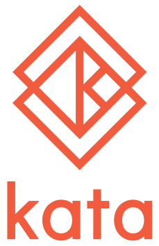 <code>kata</code></a></td><td align="center"><a href="../logos/katalyst.svg">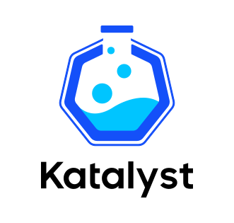 <code>katalyst</code></a></td><td align="center"><a href="../logos/kcp.svg">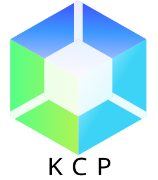 <code>kcp</code></a></td><td align="center"><a href="../logos/keycdn.svg"> <code>keycdn</code></a></td></tr>
<tr><td align="center"><a href="../logos/keycdn-wordmark.svg"> <code>keycdn-wordmark</code></a></td><td align="center"><a href="../logos/kilo.svg"> <code>kilo</code></a></td><td align="center"><a href="../logos/kind.svg"> <code>kind</code></a></td><td align="center"><a href="../logos/kinvey.svg">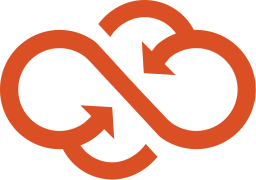 <code>kinvey</code></a></td><td align="center"><a href="../logos/kloudless.svg"> <code>kloudless</code></a></td><td align="center"><a href="../logos/kmesh.svg">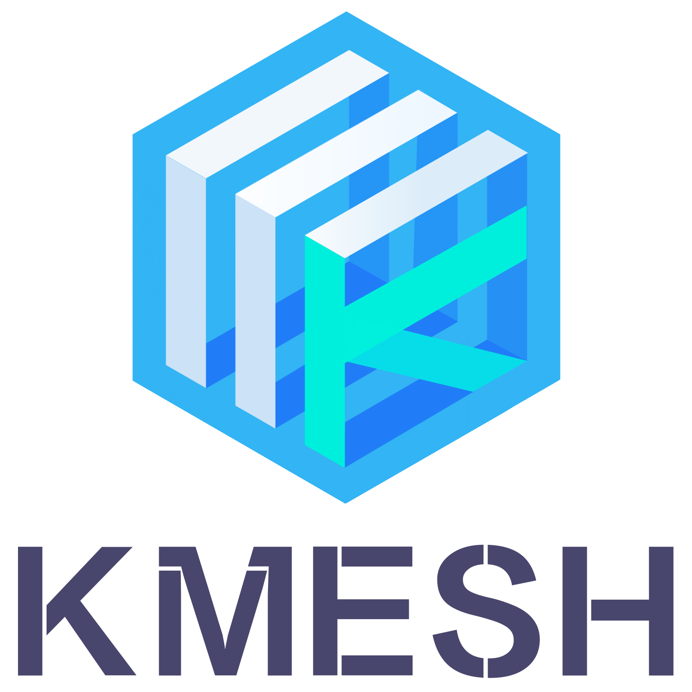 <code>kmesh</code></a></td></tr>
<tr><td align="center"><a href="../logos/knative.svg">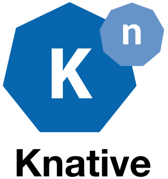 <code>knative</code></a></td><td align="center"><a href="../logos/knix.svg">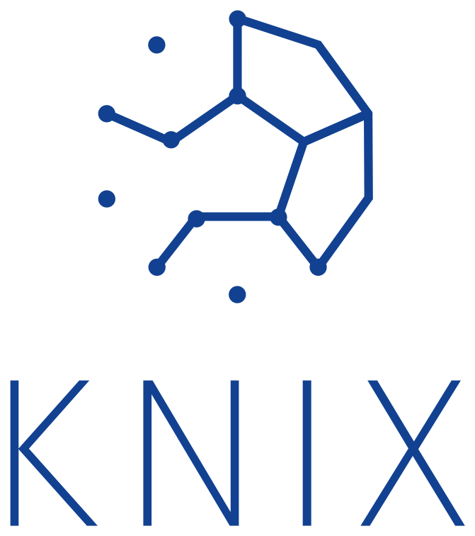 <code>knix</code></a></td><td align="center"><a href="../logos/kontena.svg">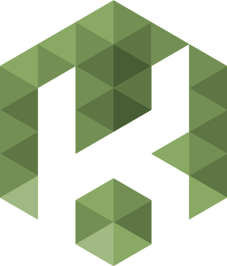 <code>kontena</code></a></td><td align="center"><a href="../logos/koyeb.svg"> <code>koyeb</code></a></td><td align="center"><a href="../logos/krustlet.svg">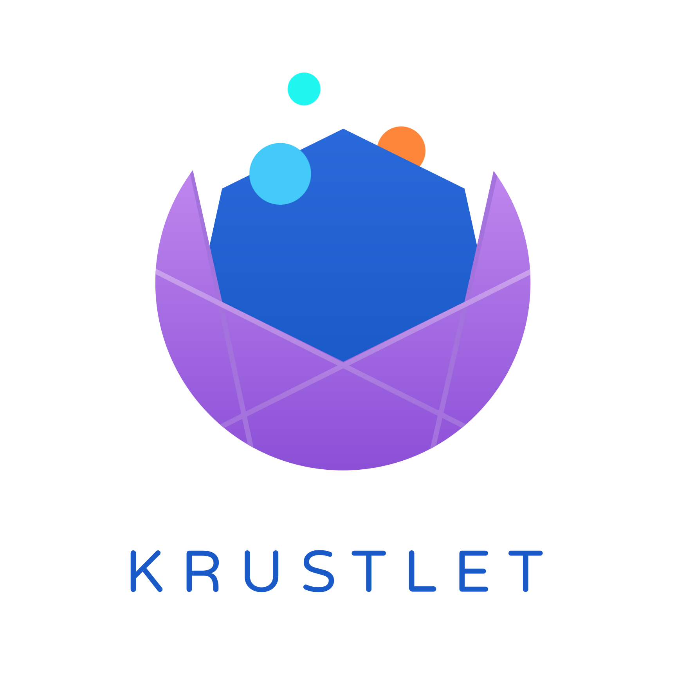 <code>krustlet</code></a></td><td align="center"><a href="../logos/kuadrant.svg">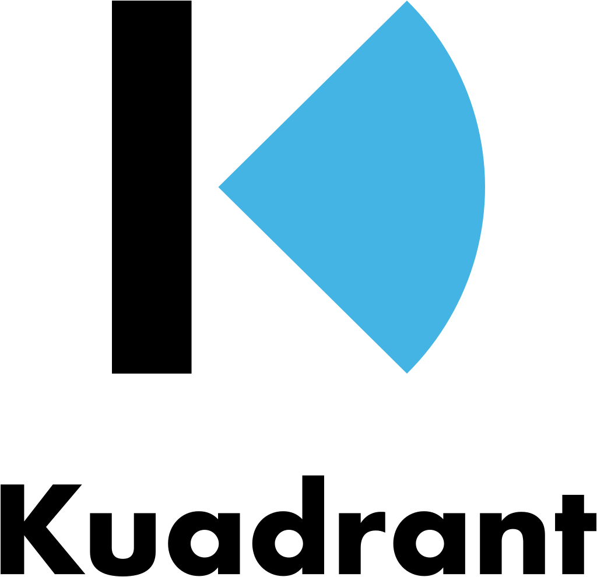 <code>kuadrant</code></a></td></tr>
<tr><td align="center"><a href="../logos/kube-green.svg">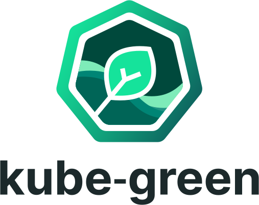 <code>kube-green</code></a></td><td align="center"><a href="../logos/kube-ovn.svg"> <code>kube-ovn</code></a></td><td align="center"><a href="../logos/kube-router.svg"> <code>kube-router</code></a></td><td align="center"><a href="../logos/kube-rs.svg">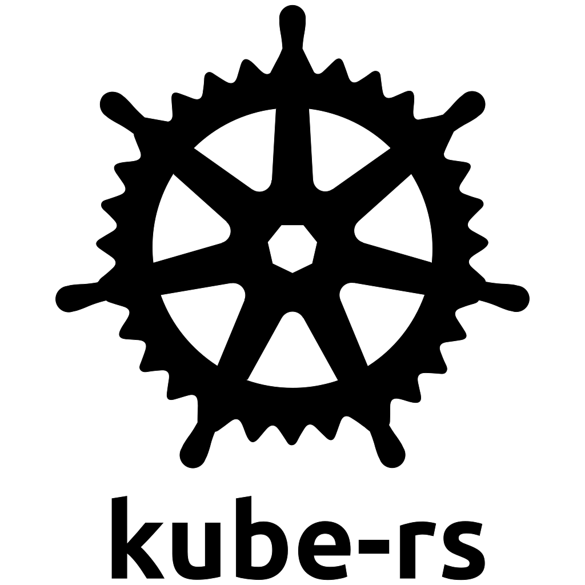 <code>kube-rs</code></a></td><td align="center"><a href="../logos/kubeadmiral.svg">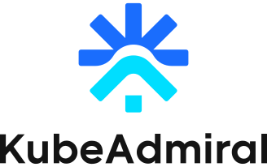 <code>kubeadmiral</code></a></td><td align="center"><a href="../logos/kubeasz.svg">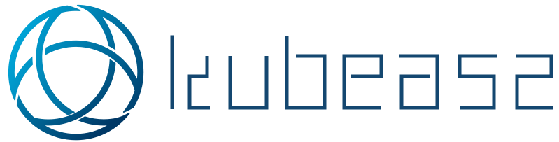 <code>kubeasz</code></a></td></tr>
<tr><td align="center"><a href="../logos/kubebrain.svg">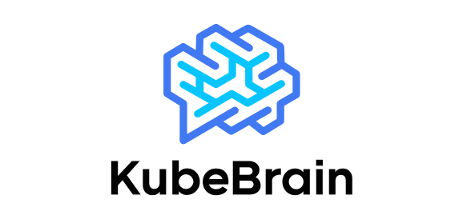 <code>kubebrain</code></a></td><td align="center"><a href="../logos/kubeclipper.svg">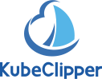 <code>kubeclipper</code></a></td><td align="center"><a href="../logos/kubefleet.svg">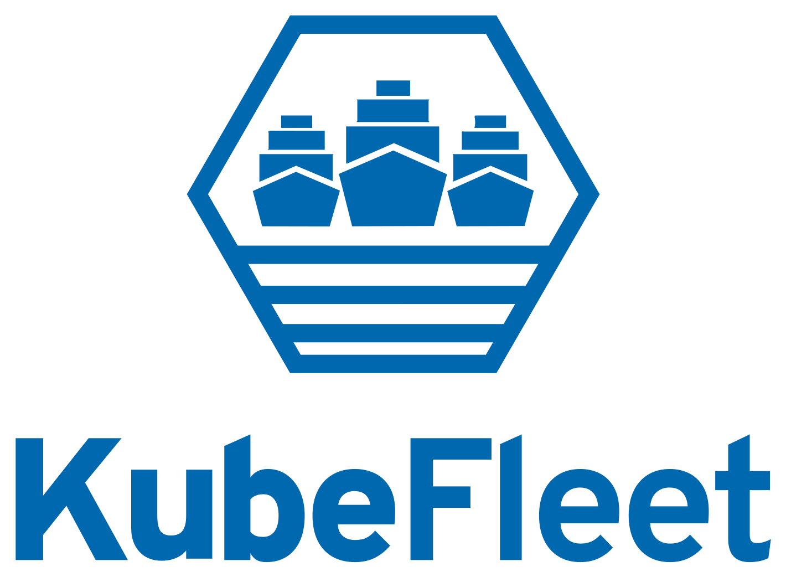 <code>kubefleet</code></a></td><td align="center"><a href="../logos/kubegateway.svg"> <code>kubegateway</code></a></td><td align="center"><a href="../logos/kubekey.svg"> <code>kubekey</code></a></td><td align="center"><a href="../logos/kubero.svg"> <code>kubero</code></a></td></tr>
<tr><td align="center"><a href="../logos/kubeservice-stack.svg"> <code>kubeservice-stack</code></a></td><td align="center"><a href="../logos/kubeslice.svg">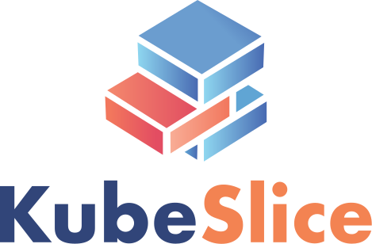 <code>kubeslice</code></a></td><td align="center"><a href="../logos/kubesphere.svg"> <code>kubesphere</code></a></td><td align="center"><a href="../logos/kubespray.svg"> <code>kubespray</code></a></td><td align="center"><a href="../logos/kubevip.svg">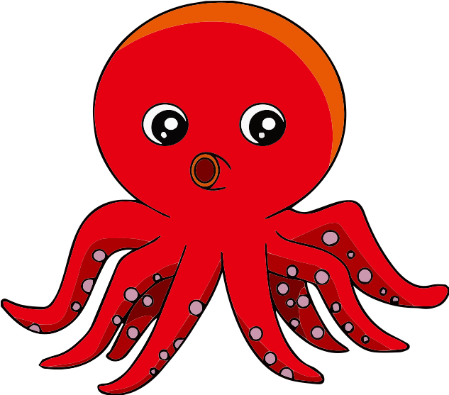 <code>kubevip</code></a></td><td align="center"><a href="../logos/kuma-stacked.svg"> <code>kuma-stacked</code></a></td></tr>
<tr><td align="center"><a href="../logos/kured.svg">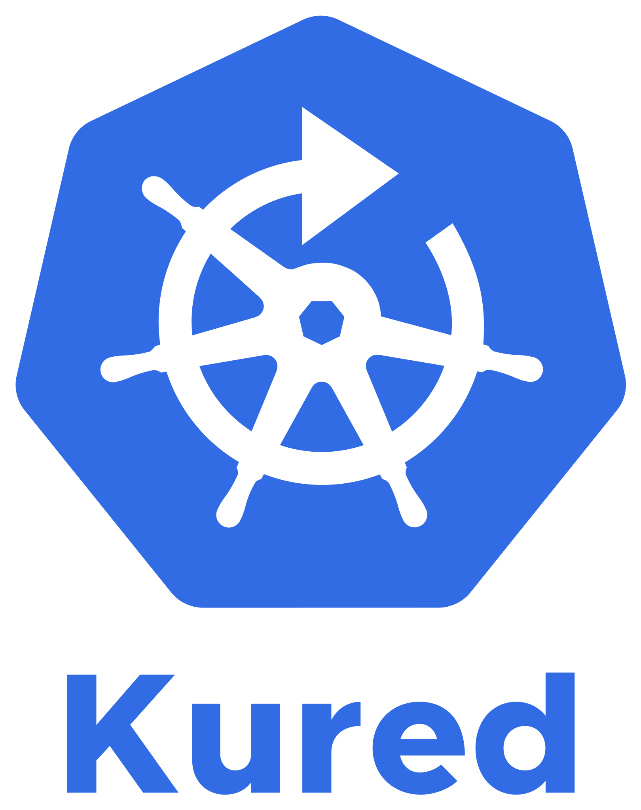 <code>kured</code></a></td><td align="center"><a href="../logos/kurl.svg"> <code>kurl</code></a></td><td align="center"><a href="../logos/kusk.svg"> <code>kusk</code></a></td><td align="center"><a href="../logos/kwok.svg"> <code>kwok</code></a></td><td align="center"><a href="../logos/kyma.svg">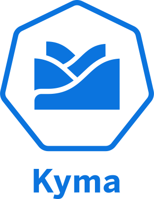 <code>kyma</code></a></td><td align="center"><a href="../logos/layotto.svg">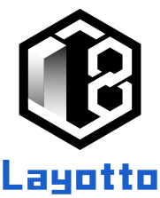 <code>layotto</code></a></td></tr>
<tr><td align="center"><a href="../logos/lets-cloud.svg"> <code>lets-cloud</code></a></td><td align="center"><a href="../logos/ligato.svg"> <code>ligato</code></a></td><td align="center"><a href="../logos/lima.svg"> <code>lima</code></a></td><td align="center"><a href="../logos/linkerd.svg"> <code>linkerd</code></a></td><td align="center"><a href="../logos/linode.svg"> <code>linode</code></a></td><td align="center"><a href="../logos/linode-wordmark.svg"> <code>linode-wordmark</code></a></td></tr>
<tr><td align="center"><a href="../logos/linstor.svg"> <code>linstor</code></a></td><td align="center"><a href="../logos/logo-red-hat-openshift-dedicated-a-standard-rgb.svg"> <code>logo-red-hat-openshift-dedicated-a-standard-rgb</code></a></td><td align="center"><a href="../logos/losant.svg"> <code>losant</code></a></td><td align="center"><a href="../logos/loxilb.svg"> <code>loxilb</code></a></td><td align="center"><a href="../logos/lumigo.svg"> <code>lumigo</code></a></td><td align="center"><a href="../logos/lunar-dev.svg"> <code>lunar-dev</code></a></td></tr>
<tr><td align="center"><a href="../logos/lxd.svg">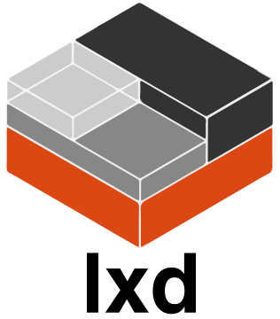 <code>lxd</code></a></td><td align="center"><a href="../logos/mantech-accordion.svg"> <code>mantech-accordion</code></a></td><td align="center"><a href="../logos/mantl.svg"> <code>mantl</code></a></td><td align="center"><a href="../logos/mapbox.svg"> <code>mapbox</code></a></td><td align="center"><a href="../logos/mapbox-wordmark.svg"> <code>mapbox-wordmark</code></a></td><td align="center"><a href="../logos/mapzen.svg">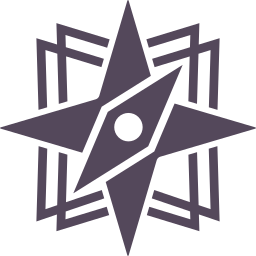 <code>mapzen</code></a></td></tr>
<tr><td align="center"><a href="../logos/mapzen-wordmark.svg"> <code>mapzen-wordmark</code></a></td><td align="center"><a href="../logos/maxcdn.svg"> <code>maxcdn</code></a></td><td align="center"><a href="../logos/membrane.svg"> <code>membrane</code></a></td><td align="center"><a href="../logos/merbridge.svg">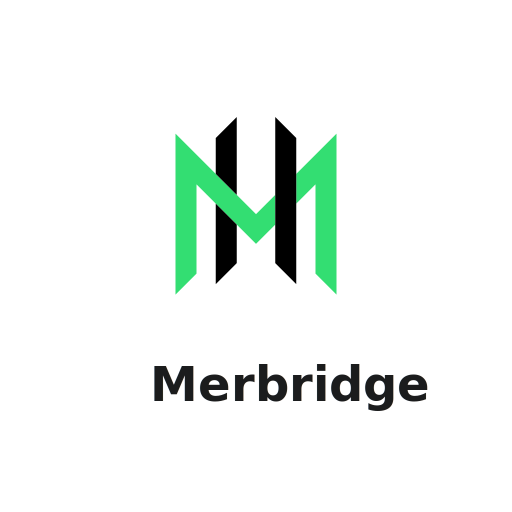 <code>merbridge</code></a></td><td align="center"><a href="../logos/mesos.svg">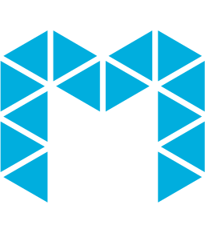 <code>mesos</code></a></td><td align="center"><a href="../logos/mesosphere.svg"> <code>mesosphere</code></a></td></tr>
<tr><td align="center"><a href="../logos/mesosphere-wordmark.svg"> <code>mesosphere-wordmark</code></a></td><td align="center"><a href="../logos/metalstack-cloud.svg"> <code>metalstack-cloud</code></a></td><td align="center"><a href="../logos/microk8s.svg"> <code>microk8s</code></a></td><td align="center"><a href="../logos/microsoft-sharepoint.svg"> <code>microsoft-sharepoint</code></a></td><td align="center"><a href="../logos/midway.svg"> <code>midway</code></a></td><td align="center"><a href="../logos/minikube.svg"> <code>minikube</code></a></td></tr>
<tr><td align="center"><a href="../logos/modulus.svg"> <code>modulus</code></a></td><td align="center"><a href="../logos/moosefs.svg"> <code>moosefs</code></a></td><td align="center"><a href="../logos/morpheus.svg">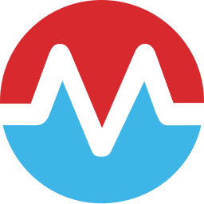 <code>morpheus</code></a></td><td align="center"><a href="../logos/morpheus-wordmark.svg"> <code>morpheus-wordmark</code></a></td><td align="center"><a href="../logos/mosn-mosn.svg"> <code>mosn-mosn</code></a></td><td align="center"><a href="../logos/msap-ai.svg"> <code>msap-ai</code></a></td></tr>
<tr><td align="center"><a href="../logos/multipass.svg"> <code>multipass</code></a></td><td align="center"><a href="../logos/multus.svg"> <code>multus</code></a></td><td align="center"><a href="../logos/namecheap.svg"> <code>namecheap</code></a></td><td align="center"><a href="../logos/netease-cloud-music.svg"> <code>netease-cloud-music</code></a></td><td align="center"><a href="../logos/netflix-oss-eureka.svg"> <code>netflix-oss-eureka</code></a></td><td align="center"><a href="../logos/netflix-oss-zuul.svg"> <code>netflix-oss-zuul</code></a></td></tr>
<tr><td align="center"><a href="../logos/netlify.svg"> <code>netlify</code></a></td><td align="center"><a href="../logos/netlify-functions.svg"> <code>netlify-functions</code></a></td><td align="center"><a href="../logos/netlify-wordmark.svg"> <code>netlify-wordmark</code></a></td><td align="center"><a href="../logos/neverinstall.svg">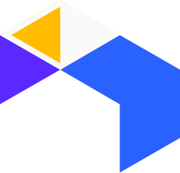 <code>neverinstall</code></a></td><td align="center"><a href="../logos/neverinstall-wordmark.svg"> <code>neverinstall-wordmark</code></a></td><td align="center"><a href="../logos/nhost.svg"> <code>nhost</code></a></td></tr>
<tr><td align="center"><a href="../logos/nhost-wordmark.svg"> <code>nhost-wordmark</code></a></td><td align="center"><a href="../logos/nia-k-paas.svg">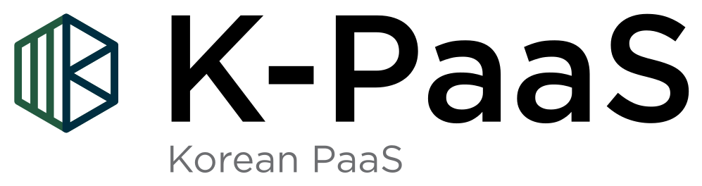 <code>nia-k-paas</code></a></td><td align="center"><a href="../logos/nimbella.svg"> <code>nimbella</code></a></td><td align="center"><a href="../logos/nitric.svg">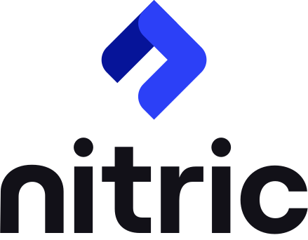 <code>nitric</code></a></td><td align="center"><a href="../logos/nocode.svg"> <code>nocode</code></a></td><td align="center"><a href="../logos/nodejitsu.svg"> <code>nodejitsu</code></a></td></tr>
<tr><td align="center"><a href="../logos/nodelambda.svg">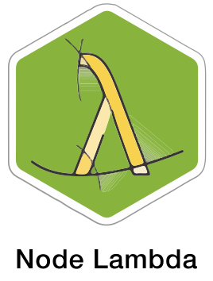 <code>nodelambda</code></a></td><td align="center"><a href="../logos/nokv.svg"> <code>nokv</code></a></td><td align="center"><a href="../logos/nomad.svg"> <code>nomad</code></a></td><td align="center"><a href="../logos/nomad-wordmark.svg"> <code>nomad-wordmark</code></a></td><td align="center"><a href="../logos/nova.svg">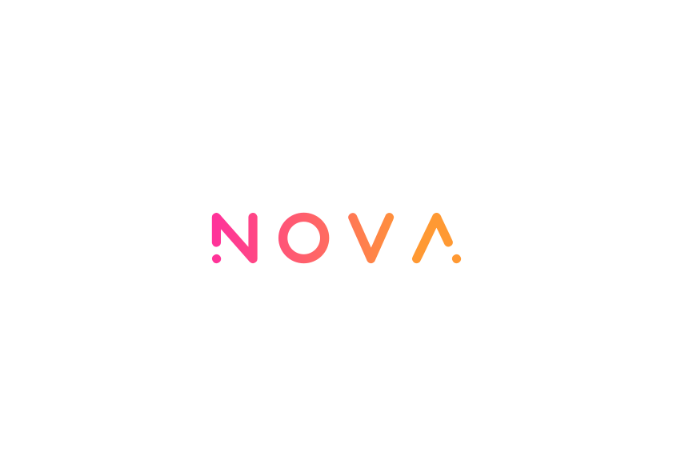 <code>nova</code></a></td><td align="center"><a href="../logos/now.svg"> <code>now</code></a></td></tr>
<tr><td align="center"><a href="../logos/nuagenetworks.svg"> <code>nuagenetworks</code></a></td><td align="center"><a href="../logos/nuclio.svg"> <code>nuclio</code></a></td><td align="center"><a href="../logos/nuweba.svg">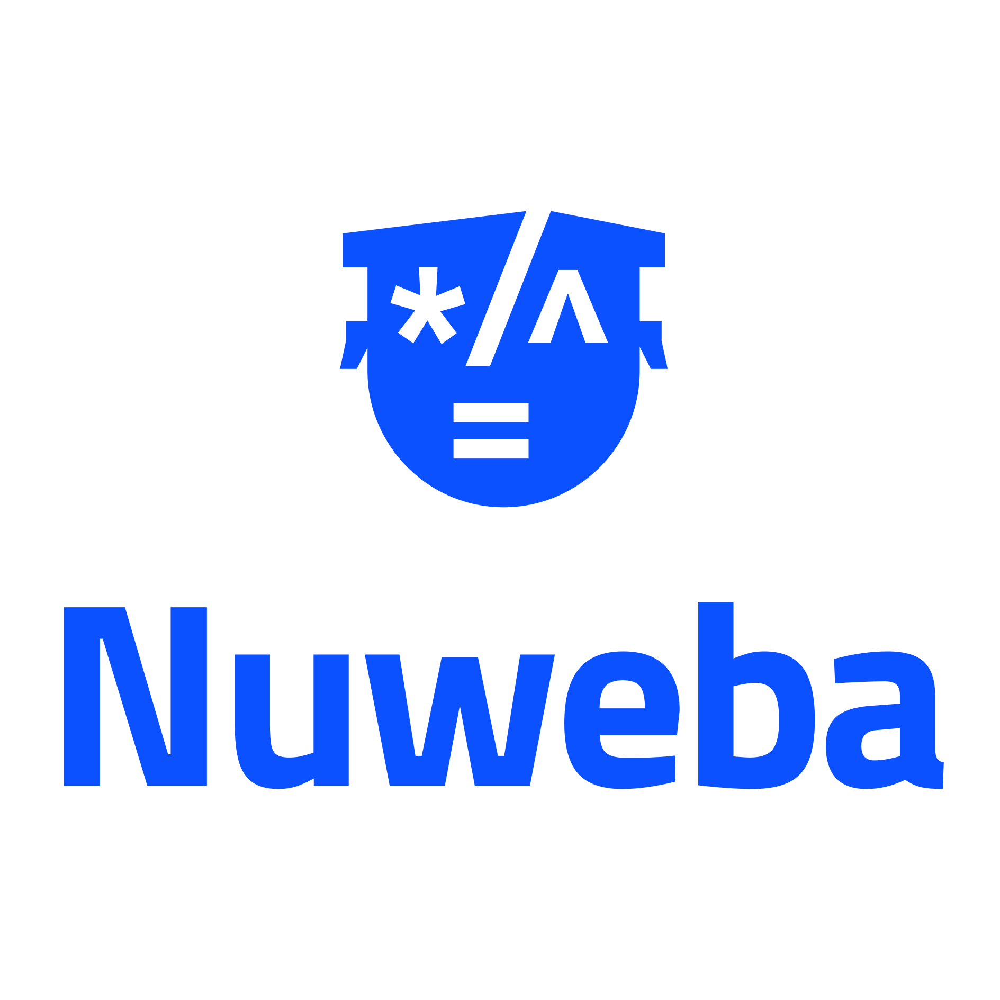 <code>nuweba</code></a></td><td align="center"><a href="../logos/oci-runc.svg">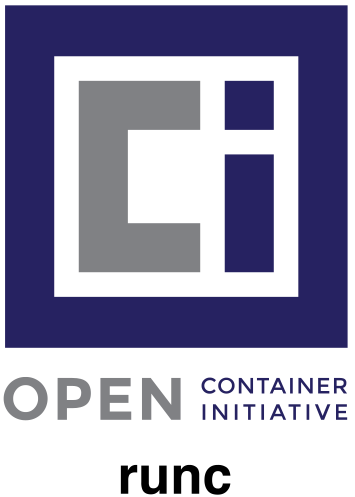 <code>oci-runc</code></a></td><td align="center"><a href="../logos/octodns.svg"> <code>octodns</code></a></td><td align="center"><a href="../logos/omada-cloud.svg"> <code>omada-cloud</code></a></td></tr>
<tr><td align="center"><a href="../logos/ondat.svg"> <code>ondat</code></a></td><td align="center"><a href="../logos/open-cloud.svg"> <code>open-cloud</code></a></td><td align="center"><a href="../logos/open-cluster-management.svg"> <code>open-cluster-management</code></a></td><td align="center"><a href="../logos/open-service-mesh.svg">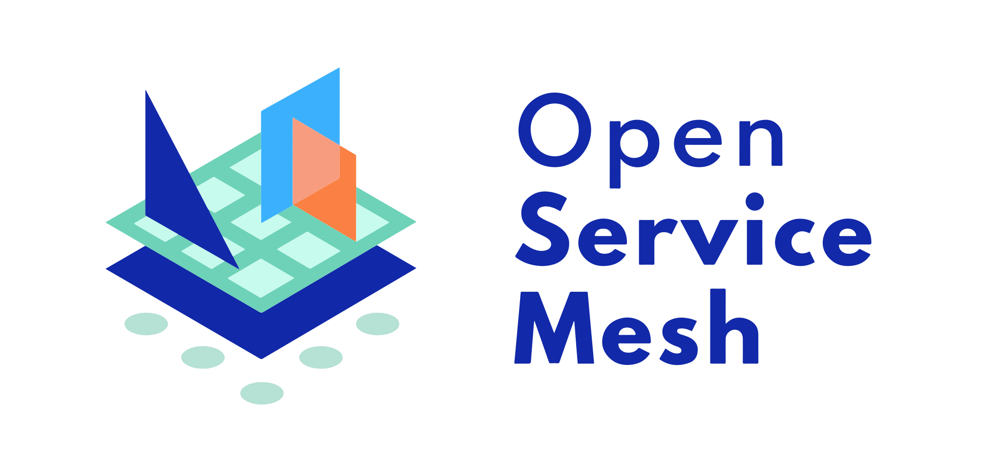 <code>open-service-mesh</code></a></td><td align="center"><a href="../logos/open-v-switch.svg">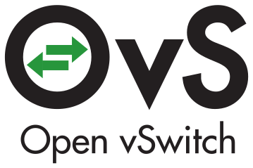 <code>open-v-switch</code></a></td><td align="center"><a href="../logos/openatom-nestos-kubernetes.svg"> <code>openatom-nestos-kubernetes</code></a></td></tr>
<tr><td align="center"><a href="../logos/openebs.svg">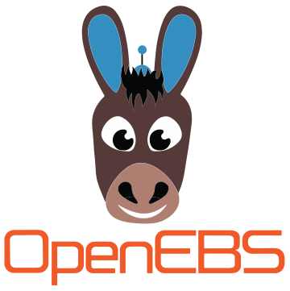 <code>openebs</code></a></td><td align="center"><a href="../logos/openelb-io.svg">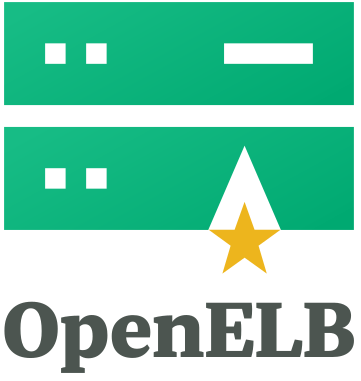 <code>openelb-io</code></a></td><td align="center"><a href="../logos/openfaas.svg"> <code>openfaas</code></a></td><td align="center"><a href="../logos/openfunction.svg">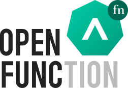 <code>openfunction</code></a></td><td align="center"><a href="../logos/openio.svg">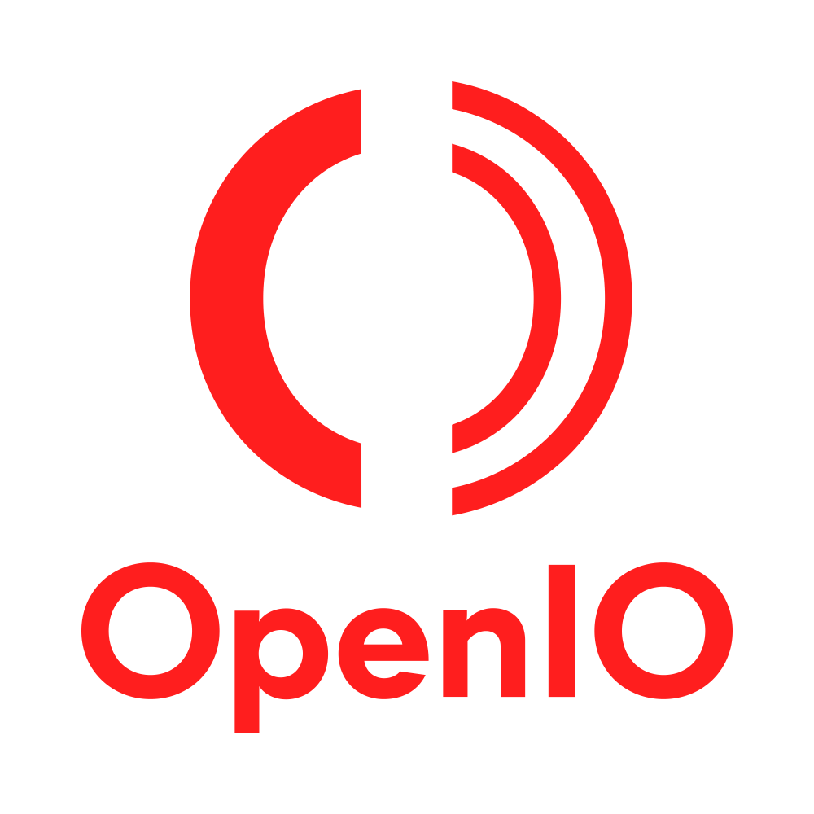 <code>openio</code></a></td><td align="center"><a href="../logos/openresty.svg"> <code>openresty</code></a></td></tr>
<tr><td align="center"><a href="../logos/opensandbox.svg">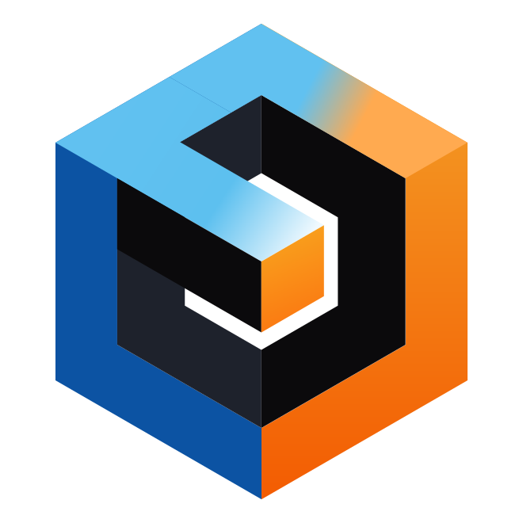 <code>opensandbox</code></a></td><td align="center"><a href="../logos/opensdn.svg">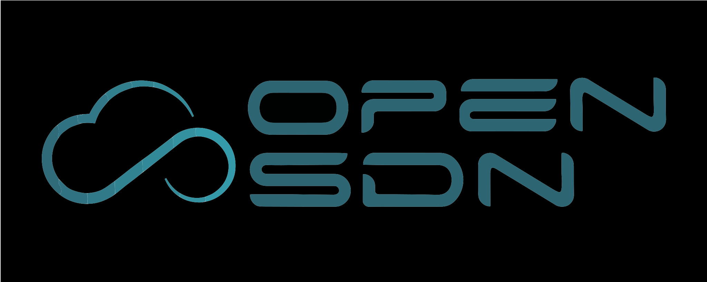 <code>opensdn</code></a></td><td align="center"><a href="../logos/opensergo.svg"> <code>opensergo</code></a></td><td align="center"><a href="../logos/openshift.svg"> <code>openshift</code></a></td><td align="center"><a href="../logos/openshift-wordmark.svg"> <code>openshift-wordmark</code></a></td><td align="center"><a href="../logos/openstack.svg">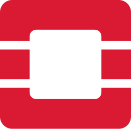 <code>openstack</code></a></td></tr>
<tr><td align="center"><a href="../logos/openstack-swift.svg">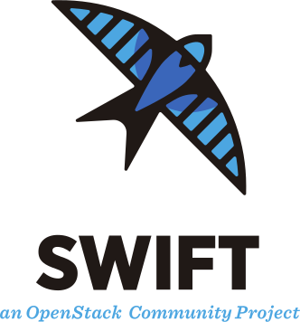 <code>openstack-swift</code></a></td><td align="center"><a href="../logos/openstack-wordmark.svg"> <code>openstack-wordmark</code></a></td><td align="center"><a href="../logos/oracle-cloud.svg"> <code>oracle-cloud</code></a></td><td align="center"><a href="../logos/oracle-functions.svg"> <code>oracle-functions</code></a></td><td align="center"><a href="../logos/oras.svg"> <code>oras</code></a></td><td align="center"><a href="../logos/orka.svg"> <code>orka</code></a></td></tr>
<tr><td align="center"><a href="../logos/orshot.svg"> <code>orshot</code></a></td><td align="center"><a href="../logos/orshot-wordmark.svg"> <code>orshot-wordmark</code></a></td><td align="center"><a href="../logos/ovn-kubernetes.svg">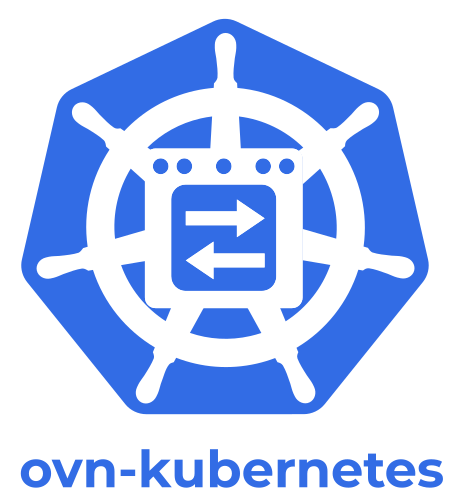 <code>ovn-kubernetes</code></a></td><td align="center"><a href="../logos/oxia.svg">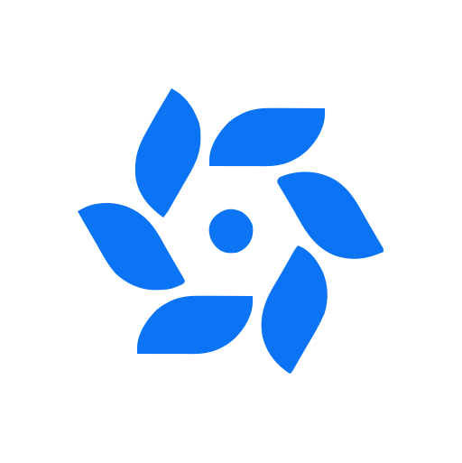 <code>oxia</code></a></td><td align="center"><a href="../logos/paasta.svg">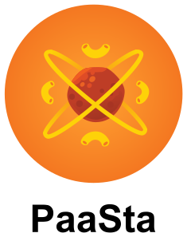 <code>paasta</code></a></td><td align="center"><a href="../logos/pagekite.svg"> <code>pagekite</code></a></td></tr>
<tr><td align="center"><a href="../logos/palette.svg"> <code>palette</code></a></td><td align="center"><a href="../logos/parse.svg"> <code>parse</code></a></td><td align="center"><a href="../logos/peer5.svg"> <code>peer5</code></a></td><td align="center"><a href="../logos/pengyun.svg"> <code>pengyun</code></a></td><td align="center"><a href="../logos/pipeline-ai.svg">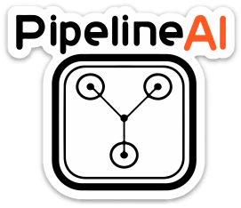 <code>pipeline-ai</code></a></td><td align="center"><a href="../logos/pipy.svg"> <code>pipy</code></a></td></tr>
<tr><td align="center"><a href="../logos/piraeus.svg">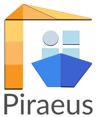 <code>piraeus</code></a></td><td align="center"><a href="../logos/platform-sh.svg"> <code>platform-sh</code></a></td><td align="center"><a href="../logos/pocket-base.svg"> <code>pocket-base</code></a></td><td align="center"><a href="../logos/portworx.svg"> <code>portworx</code></a></td><td align="center"><a href="../logos/prisma-cloud-palo-alto.svg">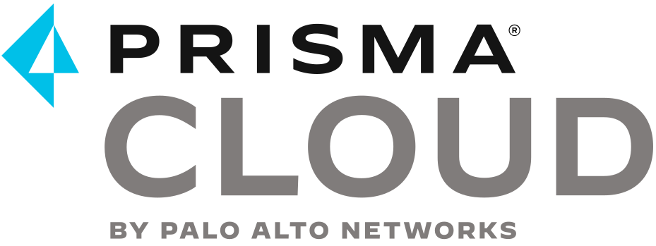 <code>prisma-cloud-palo-alto</code></a></td><td align="center"><a href="../logos/project-calico.svg">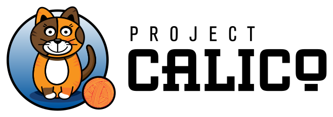 <code>project-calico</code></a></td></tr>
<tr><td align="center"><a href="../logos/project-velero.svg">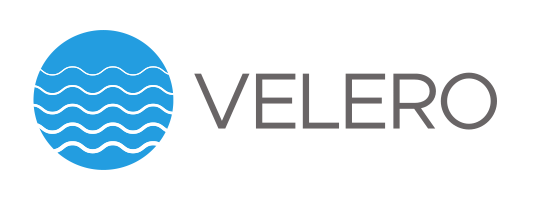 <code>project-velero</code></a></td><td align="center"><a href="../logos/protego.svg"> <code>protego</code></a></td><td align="center"><a href="../logos/proxmox.svg"> <code>proxmox</code></a></td><td align="center"><a href="../logos/pub-nub-functions.svg">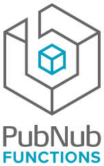 <code>pub-nub-functions</code></a></td><td align="center"><a href="../logos/pusher.svg"> <code>pusher</code></a></td><td align="center"><a href="../logos/pusher-wordmark.svg"> <code>pusher-wordmark</code></a></td></tr>
<tr><td align="center"><a href="../logos/qingstor.svg"> <code>qingstor</code></a></td><td align="center"><a href="../logos/qumulo.svg"> <code>qumulo</code></a></td><td align="center"><a href="../logos/rackspace.svg"> <code>rackspace</code></a></td><td align="center"><a href="../logos/rackspace-wordmark.svg"> <code>rackspace-wordmark</code></a></td><td align="center"><a href="../logos/railway.svg"> <code>railway</code></a></td><td align="center"><a href="../logos/reactive-interaction-gateway.svg"> <code>reactive-interaction-gateway</code></a></td></tr>
<tr><td align="center"><a href="../logos/red-hat-open-shift.svg"> <code>red-hat-open-shift</code></a></td><td align="center"><a href="../logos/red-hat-openshift-ibm-cloud.svg">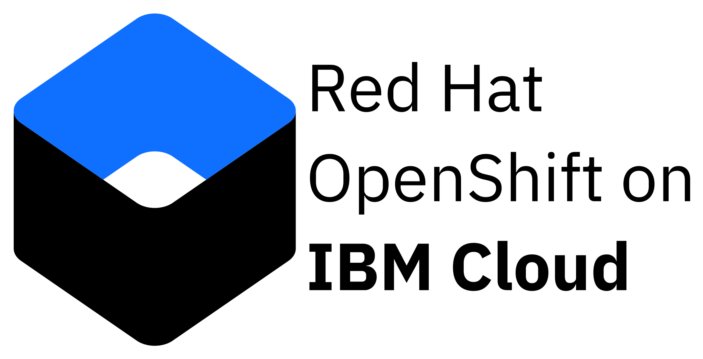 <code>red-hat-openshift-ibm-cloud</code></a></td><td align="center"><a href="../logos/redspread.svg"> <code>redspread</code></a></td><td align="center"><a href="../logos/reindex.svg"> <code>reindex</code></a></td><td align="center"><a href="../logos/render.svg"> <code>render</code></a></td><td align="center"><a href="../logos/ring.svg"> <code>ring</code></a></td></tr>
<tr><td align="center"><a href="../logos/rke2.svg"> <code>rke2</code></a></td><td align="center"><a href="../logos/rkt.svg"> <code>rkt</code></a></td><td align="center"><a href="../logos/robin-systems.svg">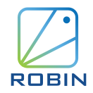 <code>robin-systems</code></a></td><td align="center"><a href="../logos/saaras.svg">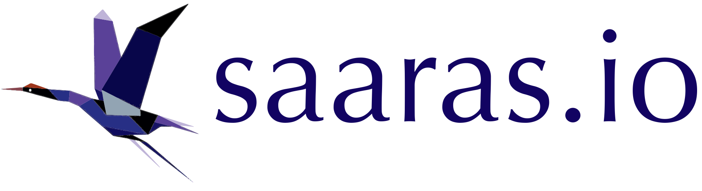 <code>saaras</code></a></td><td align="center"><a href="../logos/salad.svg"> <code>salad</code></a></td><td align="center"><a href="../logos/samsung-cloud.svg"> <code>samsung-cloud</code></a></td></tr>
<tr><td align="center"><a href="../logos/sandstone.svg"> <code>sandstone</code></a></td><td align="center"><a href="../logos/sangfor.svg"> <code>sangfor</code></a></td><td align="center"><a href="../logos/scaledrone.svg"> <code>scaledrone</code></a></td><td align="center"><a href="../logos/scaleflash.svg">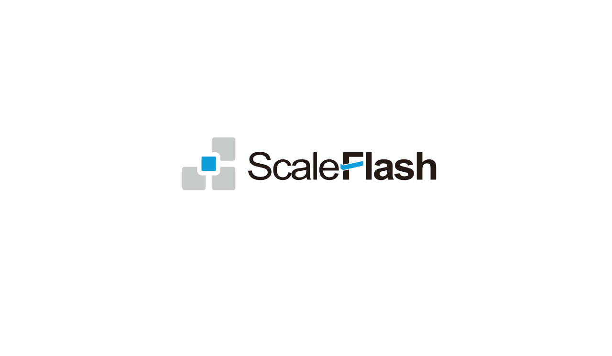 <code>scaleflash</code></a></td><td align="center"><a href="../logos/scalingo.svg"> <code>scalingo</code></a></td><td align="center"><a href="../logos/scaphold.svg"> <code>scaphold</code></a></td></tr>
<tr><td align="center"><a href="../logos/scar.svg">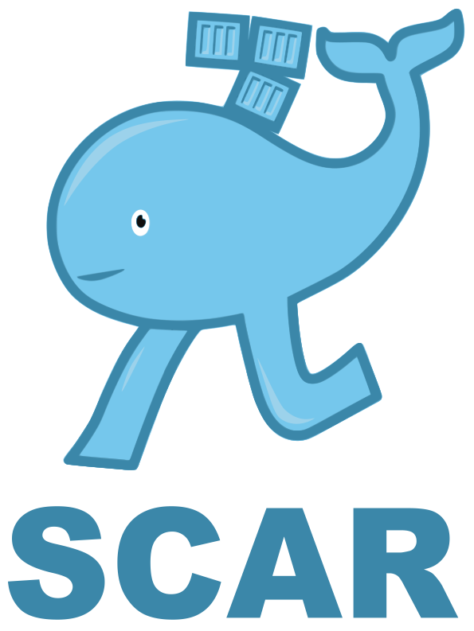 <code>scar</code></a></td><td align="center"><a href="../logos/secloudit.svg"> <code>secloudit</code></a></td><td align="center"><a href="../logos/second-state-functions.svg"> <code>second-state-functions</code></a></td><td align="center"><a href="../logos/section.svg"> <code>section</code></a></td><td align="center"><a href="../logos/section-wordmark.svg"> <code>section-wordmark</code></a></td><td align="center"><a href="../logos/sectionio.svg"> <code>sectionio</code></a></td></tr>
<tr><td align="center"><a href="../logos/sectionio-wordmark.svg"> <code>sectionio-wordmark</code></a></td><td align="center"><a href="../logos/sentinel.svg">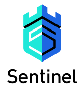 <code>sentinel</code></a></td><td align="center"><a href="../logos/sermant.svg">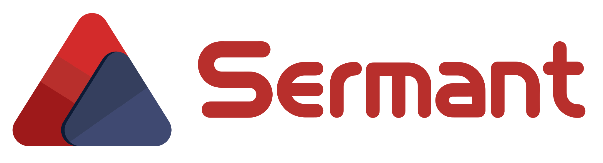 <code>sermant</code></a></td><td align="center"><a href="../logos/serveless.svg"> <code>serveless</code></a></td><td align="center"><a href="../logos/serverless.svg">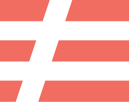 <code>serverless</code></a></td><td align="center"><a href="../logos/serverless-devs.svg">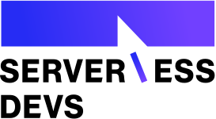 <code>serverless-devs</code></a></td></tr>
<tr><td align="center"><a href="../logos/serverless-wordmark.svg"> <code>serverless-wordmark</code></a></td><td align="center"><a href="../logos/service-mesh-interface.svg">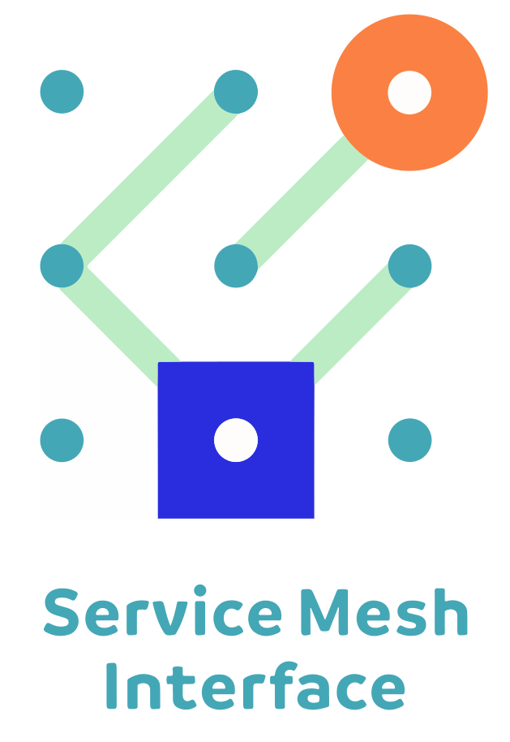 <code>service-mesh-interface</code></a></td><td align="center"><a href="../logos/service-mesh-performance.svg">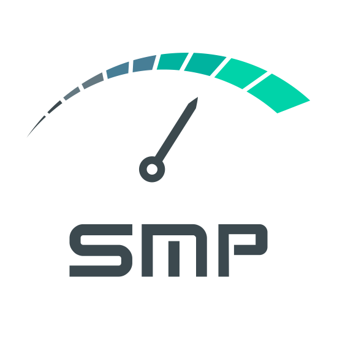 <code>service-mesh-performance</code></a></td><td align="center"><a href="../logos/shturval.svg">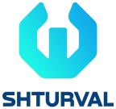 <code>shturval</code></a></td><td align="center"><a href="../logos/sighup-distribution.svg"> <code>sighup-distribution</code></a></td><td align="center"><a href="../logos/simplyblock.svg"> <code>simplyblock</code></a></td></tr>
<tr><td align="center"><a href="../logos/singularity.svg"> <code>singularity</code></a></td><td align="center"><a href="../logos/skipper.svg">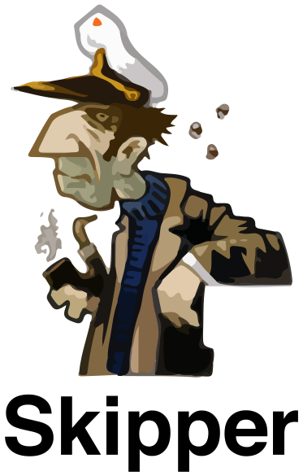 <code>skipper</code></a></td><td align="center"><a href="../logos/slappforge-sigma.svg"> <code>slappforge-sigma</code></a></td><td align="center"><a href="../logos/slime.svg">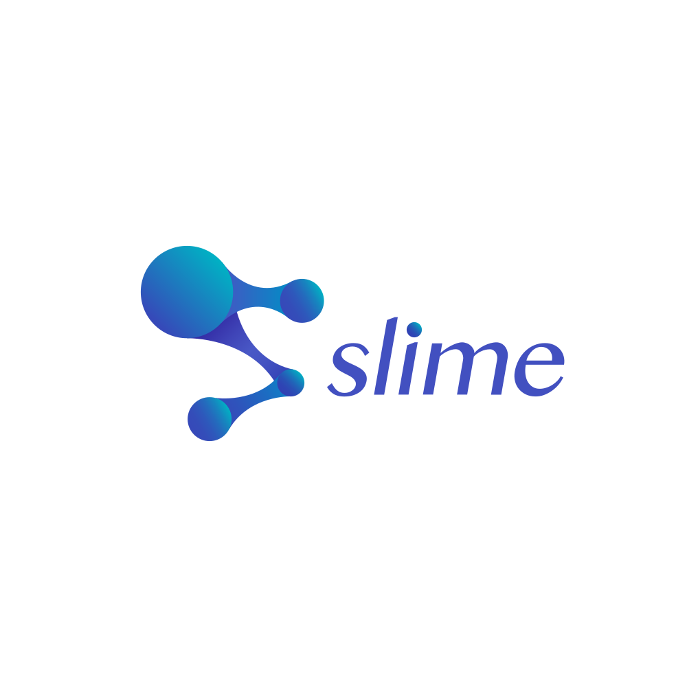 <code>slime</code></a></td><td align="center"><a href="../logos/slimfaas.svg">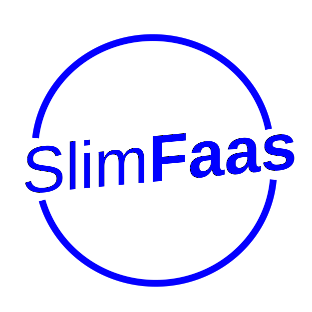 <code>slimfaas</code></a></td><td align="center"><a href="../logos/slurm.svg"> <code>slurm</code></a></td></tr>
<tr><td align="center"><a href="../logos/smartos.svg">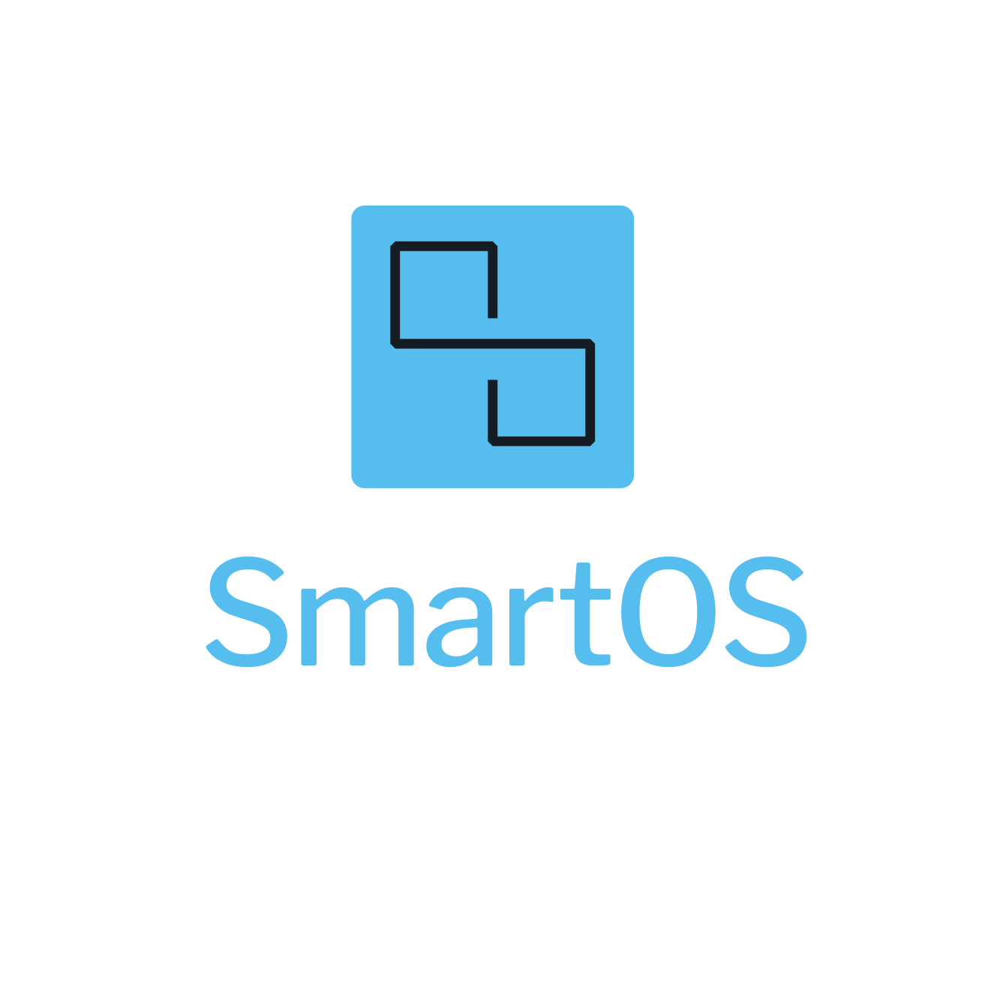 <code>smartos</code></a></td><td align="center"><a href="../logos/soda-foundation.svg"> <code>soda-foundation</code></a></td><td align="center"><a href="../logos/soldera.svg"> <code>soldera</code></a></td><td align="center"><a href="../logos/soldera-wordmark.svg"> <code>soldera-wordmark</code></a></td><td align="center"><a href="../logos/sonarqube-cloud.svg"> <code>sonarqube-cloud</code></a></td><td align="center"><a href="../logos/sparta.svg">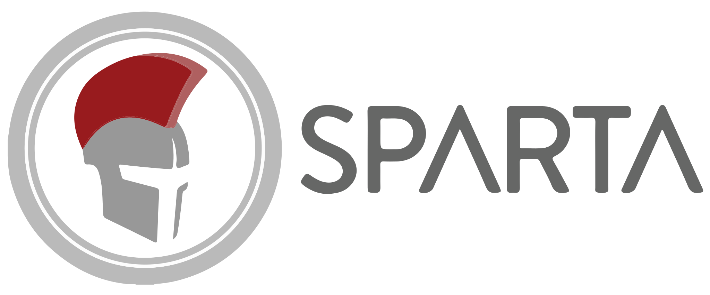 <code>sparta</code></a></td></tr>
<tr><td align="center"><a href="../logos/spiderpool.svg">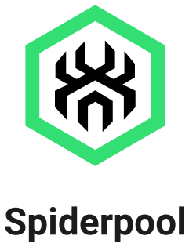 <code>spiderpool</code></a></td><td align="center"><a href="../logos/spring-cloud-function.svg"> <code>spring-cloud-function</code></a></td><td align="center"><a href="../logos/sst.svg"> <code>sst</code></a></td><td align="center"><a href="../logos/sst-wordmark.svg"> <code>sst-wordmark</code></a></td><td align="center"><a href="../logos/stackery.svg">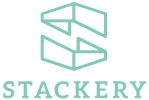 <code>stackery</code></a></td><td align="center"><a href="../logos/stacksmith.svg"> <code>stacksmith</code></a></td></tr>
<tr><td align="center"><a href="../logos/stackstorm.svg">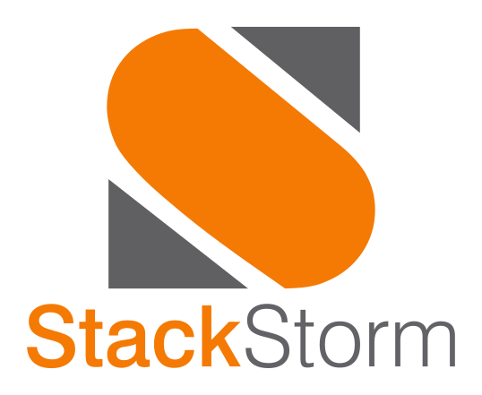 <code>stackstorm</code></a></td><td align="center"><a href="../logos/standard-library.svg"> <code>standard-library</code></a></td><td align="center"><a href="../logos/starlingx.svg"> <code>starlingx</code></a></td><td align="center"><a href="../logos/stash-by-apps-code.svg">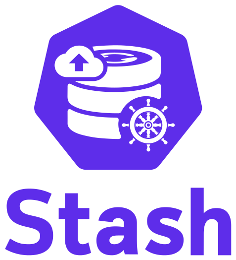 <code>stash-by-apps-code</code></a></td><td align="center"><a href="../logos/statefun.svg"> <code>statefun</code></a></td><td align="center"><a href="../logos/storpool.svg">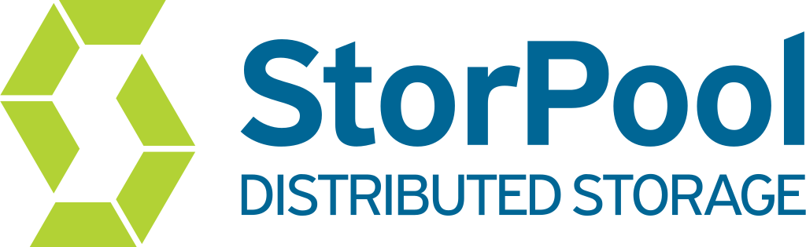 <code>storpool</code></a></td></tr>
<tr><td align="center"><a href="../logos/stratovirt.svg"> <code>stratovirt</code></a></td><td align="center"><a href="../logos/stunner.svg"> <code>stunner</code></a></td><td align="center"><a href="../logos/submariner.svg">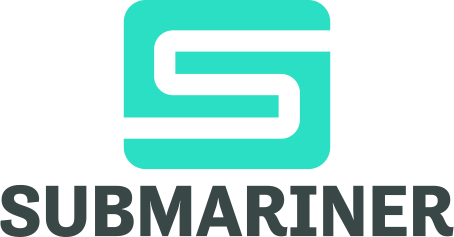 <code>submariner</code></a></td><td align="center"><a href="../logos/supabase.svg"> <code>supabase</code></a></td><td align="center"><a href="../logos/supabase-wordmark.svg"> <code>supabase-wordmark</code></a></td><td align="center"><a href="../logos/supergiant.svg"> <code>supergiant</code></a></td></tr>
<tr><td align="center"><a href="../logos/superplane.svg">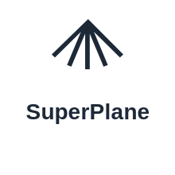 <code>superplane</code></a></td><td align="center"><a href="../logos/surge.svg">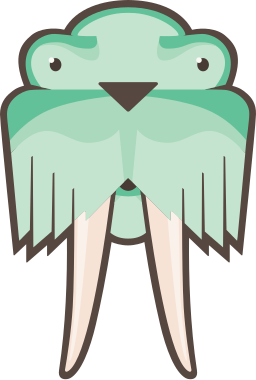 <code>surge</code></a></td><td align="center"><a href="../logos/sysbox.svg"> <code>sysbox</code></a></td><td align="center"><a href="../logos/talos-linux.svg"> <code>talos-linux</code></a></td><td align="center"><a href="../logos/tarook.svg"> <code>tarook</code></a></td><td align="center"><a href="../logos/tata-vayu.svg"> <code>tata-vayu</code></a></td></tr>
<tr><td align="center"><a href="../logos/tectonic.svg"> <code>tectonic</code></a></td><td align="center"><a href="../logos/tencent-cloud-serverless-cloud-function.svg">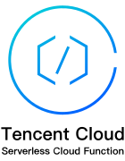 <code>tencent-cloud-serverless-cloud-function</code></a></td><td align="center"><a href="../logos/threat-stack.svg">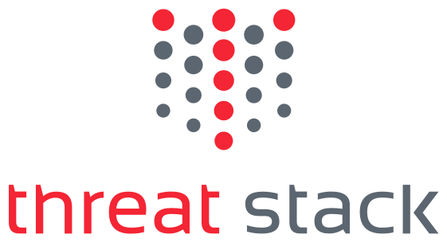 <code>threat-stack</code></a></td><td align="center"><a href="../logos/thundra.svg">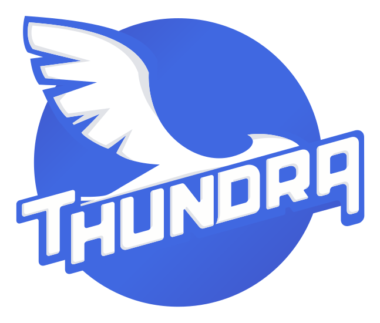 <code>thundra</code></a></td><td align="center"><a href="../logos/traefik-mesh.svg">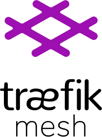 <code>traefik-mesh</code></a></td><td align="center"><a href="../logos/trilio.svg">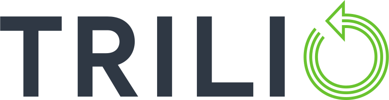 <code>trilio</code></a></td></tr>
<tr><td align="center"><a href="../logos/triton-object-storage.svg">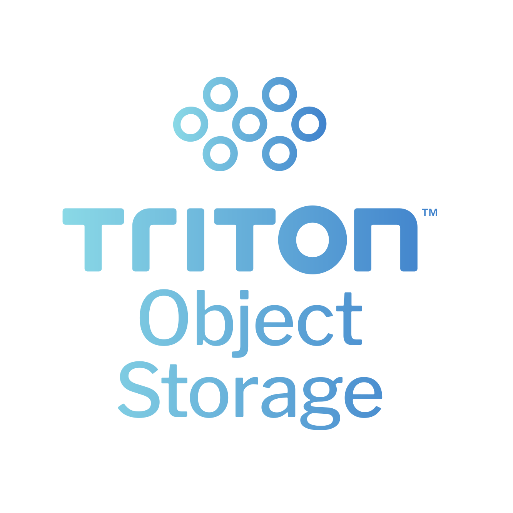 <code>triton-object-storage</code></a></td><td align="center"><a href="../logos/truenas.svg"> <code>truenas</code></a></td><td align="center"><a href="../logos/tsb.svg"> <code>tsb</code></a></td><td align="center"><a href="../logos/tsuru.svg"> <code>tsuru</code></a></td><td align="center"><a href="../logos/tutum.svg"> <code>tutum</code></a></td><td align="center"><a href="../logos/twilio.svg"> <code>twilio</code></a></td></tr>
<tr><td align="center"><a href="../logos/twilio-functions.svg"> <code>twilio-functions</code></a></td><td align="center"><a href="../logos/twilio-wordmark.svg"> <code>twilio-wordmark</code></a></td><td align="center"><a href="../logos/typhoon.svg">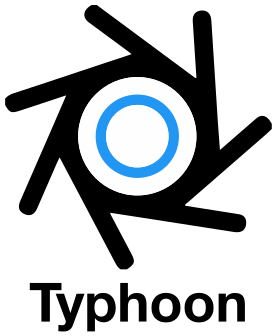 <code>typhoon</code></a></td><td align="center"><a href="../logos/urunc.svg"> <code>urunc</code></a></td><td align="center"><a href="../logos/vercel.svg"> <code>vercel</code></a></td><td align="center"><a href="../logos/vineyard.svg">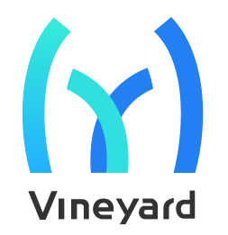 <code>vineyard</code></a></td></tr>
<tr><td align="center"><a href="../logos/virtual-kubelet.svg">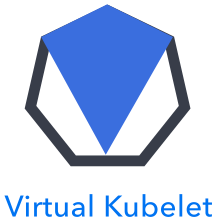 <code>virtual-kubelet</code></a></td><td align="center"><a href="../logos/vmware-nsx.svg"> <code>vmware-nsx</code></a></td><td align="center"><a href="../logos/volcano.svg"> <code>volcano</code></a></td><td align="center"><a href="../logos/vultr.svg"> <code>vultr</code></a></td><td align="center"><a href="../logos/vultr-wordmark.svg"> <code>vultr-wordmark</code></a></td><td align="center"><a href="../logos/wasmedge.svg">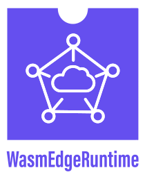 <code>wasmedge</code></a></td></tr>
<tr><td align="center"><a href="../logos/weave.svg"> <code>weave</code></a></td><td align="center"><a href="../logos/webiny.svg"> <code>webiny</code></a></td><td align="center"><a href="../logos/webmin.svg"> <code>webmin</code></a></td><td align="center"><a href="../logos/webtask.svg"> <code>webtask</code></a></td><td align="center"><a href="../logos/welkin.svg"> <code>welkin</code></a></td><td align="center"><a href="../logos/wiredtree.svg"> <code>wiredtree</code></a></td></tr>
<tr><td align="center"><a href="../logos/workflow.svg"> <code>workflow</code></a></td><td align="center"><a href="../logos/wpengine.svg"> <code>wpengine</code></a></td><td align="center"><a href="../logos/wso2.svg"> <code>wso2</code></a></td><td align="center"><a href="../logos/xline.svg"> <code>xline</code></a></td><td align="center"><a href="../logos/xsky.svg"> <code>xsky</code></a></td><td align="center"><a href="../logos/yandex-cloud.svg"> <code>yandex-cloud</code></a></td></tr>
<tr><td align="center"><a href="../logos/yanrong.svg"> <code>yanrong</code></a></td><td align="center"><a href="../logos/yellowdog.svg"> <code>yellowdog</code></a></td><td align="center"><a href="../logos/zeabur.svg">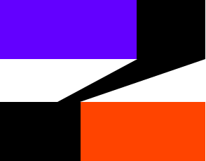 <code>zeabur</code></a></td><td align="center"><a href="../logos/zeabur-wordmark.svg"> <code>zeabur-wordmark</code></a></td><td align="center"><a href="../logos/zeit.svg"> <code>zeit</code></a></td><td align="center"><a href="../logos/zeit-wordmark.svg"> <code>zeit-wordmark</code></a></td></tr>
<tr><td align="center"><a href="../logos/zenko.svg"> <code>zenko</code></a></td></tr>
</table>

[⬅️ Back to the full catalog](../README.md)
