# 🗄️ Databases & Data (276)

[⬅️ Back to the full catalog](../README.md) · [🖼️ Browse & download on the website](https://logos.lndev.me/)
<table>
<tr><td align="center"><a href="../logos/aerospike.svg">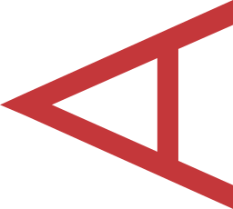 <code>aerospike</code></a></td><td align="center"><a href="../logos/aerospike-wordmark.svg"> <code>aerospike-wordmark</code></a></td><td align="center"><a href="../logos/airbyte.svg"> <code>airbyte</code></a></td><td align="center"><a href="../logos/airflow.svg"> <code>airflow</code></a></td><td align="center"><a href="../logos/airflow-wordmark.svg"> <code>airflow-wordmark</code></a></td><td align="center"><a href="../logos/algolia.svg"> <code>algolia</code></a></td></tr>
<tr><td align="center"><a href="../logos/algolia-wordmark.svg"> <code>algolia-wordmark</code></a></td><td align="center"><a href="../logos/altair.svg"> <code>altair</code></a></td><td align="center"><a href="../logos/amazon-kinesis.svg"> <code>amazon-kinesis</code></a></td><td align="center"><a href="../logos/amazon-kinesis-wordmark.svg"> <code>amazon-kinesis-wordmark</code></a></td><td align="center"><a href="../logos/apache-age.svg"> <code>apache-age</code></a></td><td align="center"><a href="../logos/apache-flink.svg"> <code>apache-flink</code></a></td></tr>
<tr><td align="center"><a href="../logos/apache-flink-wordmark.svg"> <code>apache-flink-wordmark</code></a></td><td align="center"><a href="../logos/apache-ignite.svg"> <code>apache-ignite</code></a></td><td align="center"><a href="../logos/apache-spark.svg"> <code>apache-spark</code></a></td><td align="center"><a href="../logos/apache-streampipes.svg"> <code>apache-streampipes</code></a></td><td align="center"><a href="../logos/apache-superset.svg"> <code>apache-superset</code></a></td><td align="center"><a href="../logos/apache-superset-wordmark.svg"> <code>apache-superset-wordmark</code></a></td></tr>
<tr><td align="center"><a href="../logos/apicurio-registry.svg"> <code>apicurio-registry</code></a></td><td align="center"><a href="../logos/appbase.svg"> <code>appbase</code></a></td><td align="center"><a href="../logos/appbaseio.svg">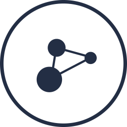 <code>appbaseio</code></a></td><td align="center"><a href="../logos/appbaseio-wordmark.svg"> <code>appbaseio-wordmark</code></a></td><td align="center"><a href="../logos/arangodb.svg"> <code>arangodb</code></a></td><td align="center"><a href="../logos/arangodb-wordmark.svg"> <code>arangodb-wordmark</code></a></td></tr>
<tr><td align="center"><a href="../logos/arkflow.svg"> <code>arkflow</code></a></td><td align="center"><a href="../logos/astronomer.svg"> <code>astronomer</code></a></td><td align="center"><a href="../logos/aurora.svg"> <code>aurora</code></a></td><td align="center"><a href="../logos/automq.svg"> <code>automq</code></a></td><td align="center"><a href="../logos/azure-cosmos-db.svg"> <code>azure-cosmos-db</code></a></td><td align="center"><a href="../logos/azure-event-hubs.svg"> <code>azure-event-hubs</code></a></td></tr>
<tr><td align="center"><a href="../logos/azure-sql-db.svg"> <code>azure-sql-db</code></a></td><td align="center"><a href="../logos/azure-sql-server.svg"> <code>azure-sql-server</code></a></td><td align="center"><a href="../logos/beam.svg"> <code>beam</code></a></td><td align="center"><a href="../logos/bklit.svg">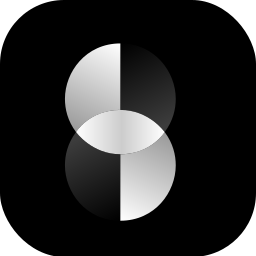 <code>bklit</code></a></td><td align="center"><a href="../logos/carbondata.svg"> <code>carbondata</code></a></td><td align="center"><a href="../logos/cassandra.svg"> <code>cassandra</code></a></td></tr>
<tr><td align="center"><a href="../logos/cdevents.svg"> <code>cdevents</code></a></td><td align="center"><a href="../logos/chroma.svg">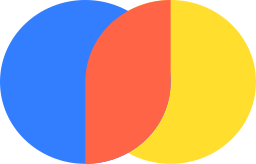 <code>chroma</code></a></td><td align="center"><a href="../logos/clickhouse.svg"> <code>clickhouse</code></a></td><td align="center"><a href="../logos/cloud-events.svg">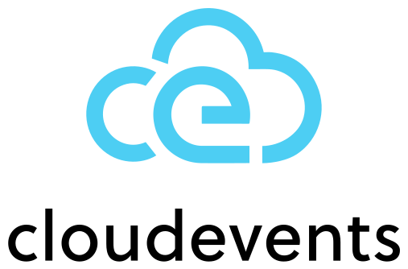 <code>cloud-events</code></a></td><td align="center"><a href="../logos/cloudant.svg"> <code>cloudant</code></a></td><td align="center"><a href="../logos/cloudera.svg"> <code>cloudera</code></a></td></tr>
<tr><td align="center"><a href="../logos/cloudnative-pg.svg"> <code>cloudnative-pg</code></a></td><td align="center"><a href="../logos/cockroachdb.svg">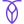 <code>cockroachdb</code></a></td><td align="center"><a href="../logos/convex.svg"> <code>convex</code></a></td><td align="center"><a href="../logos/convex-wordmark.svg"> <code>convex-wordmark</code></a></td><td align="center"><a href="../logos/couchbase.svg"> <code>couchbase</code></a></td><td align="center"><a href="../logos/couchbase-wordmark.svg"> <code>couchbase-wordmark</code></a></td></tr>
<tr><td align="center"><a href="../logos/couchdb.svg"> <code>couchdb</code></a></td><td align="center"><a href="../logos/couchdb-wordmark.svg"> <code>couchdb-wordmark</code></a></td><td align="center"><a href="../logos/crateio.svg"> <code>crateio</code></a></td><td align="center"><a href="../logos/crateio-wordmark.svg"> <code>crateio-wordmark</code></a></td><td align="center"><a href="../logos/crunchy-data.svg">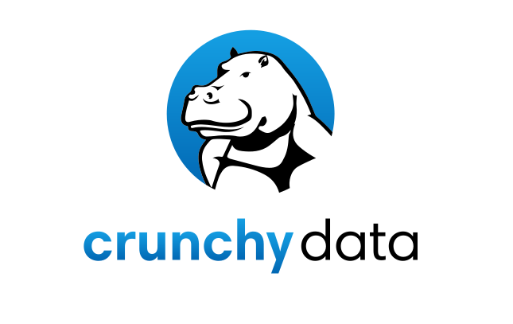 <code>crunchy-data</code></a></td><td align="center"><a href="../logos/cube.svg"> <code>cube</code></a></td></tr>
<tr><td align="center"><a href="../logos/cube-wordmark.svg"> <code>cube-wordmark</code></a></td><td align="center"><a href="../logos/data-station.svg"> <code>data-station</code></a></td><td align="center"><a href="../logos/database-labs.svg"> <code>database-labs</code></a></td><td align="center"><a href="../logos/databasement.svg">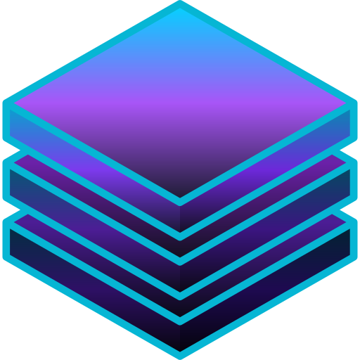 <code>databasement</code></a></td><td align="center"><a href="../logos/databend.svg"> <code>databend</code></a></td><td align="center"><a href="../logos/databricks.svg"> <code>databricks</code></a></td></tr>
<tr><td align="center"><a href="../logos/databricks-wordmark.svg"> <code>databricks-wordmark</code></a></td><td align="center"><a href="../logos/datasette.svg"> <code>datasette</code></a></td><td align="center"><a href="../logos/datasette-wordmark.svg"> <code>datasette-wordmark</code></a></td><td align="center"><a href="../logos/db-ui.svg"> <code>db-ui</code></a></td><td align="center"><a href="../logos/dbt.svg">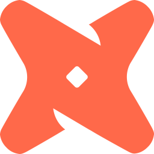 <code>dbt</code></a></td><td align="center"><a href="../logos/dbt-wordmark.svg"> <code>dbt-wordmark</code></a></td></tr>
<tr><td align="center"><a href="../logos/deepstream.svg">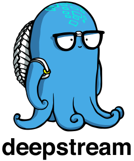 <code>deepstream</code></a></td><td align="center"><a href="../logos/dgraph.svg"> <code>dgraph</code></a></td><td align="center"><a href="../logos/dgraph-wordmark.svg"> <code>dgraph-wordmark</code></a></td><td align="center"><a href="../logos/doctrine.svg"> <code>doctrine</code></a></td><td align="center"><a href="../logos/dolt.svg"> <code>dolt</code></a></td><td align="center"><a href="../logos/doris.svg">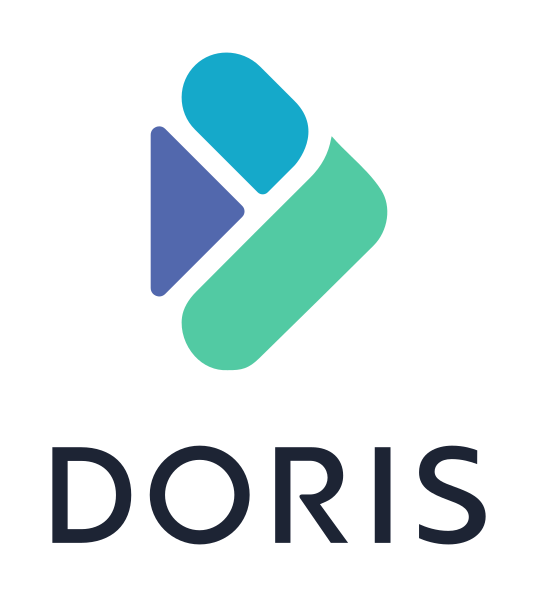 <code>doris</code></a></td></tr>
<tr><td align="center"><a href="../logos/drasi.svg"> <code>drasi</code></a></td><td align="center"><a href="../logos/drizzle.svg">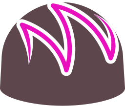 <code>drizzle</code></a></td><td align="center"><a href="../logos/drizzle-wordmark.svg">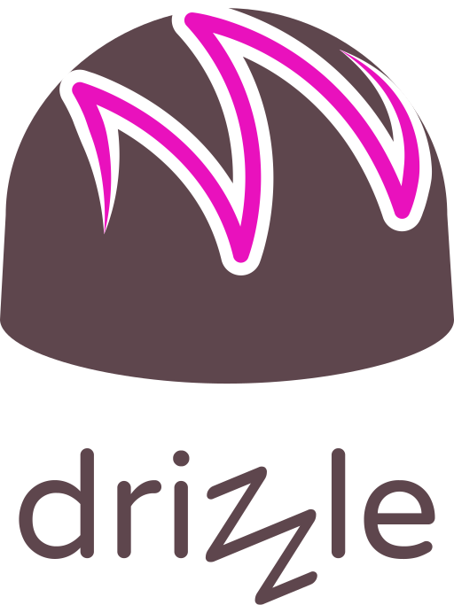 <code>drizzle-wordmark</code></a></td><td align="center"><a href="../logos/druid.svg"> <code>druid</code></a></td><td align="center"><a href="../logos/duckdb.svg"> <code>duckdb</code></a></td><td align="center"><a href="../logos/edgedb.svg"> <code>edgedb</code></a></td></tr>
<tr><td align="center"><a href="../logos/eduplace.svg"> <code>eduplace</code></a></td><td align="center"><a href="../logos/elastic.svg"> <code>elastic</code></a></td><td align="center"><a href="../logos/elastic-wordmark.svg"> <code>elastic-wordmark</code></a></td><td align="center"><a href="../logos/elasticsearch.svg">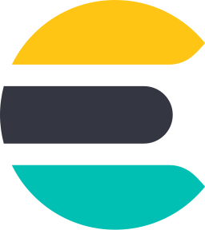 <code>elasticsearch</code></a></td><td align="center"><a href="../logos/endee.svg">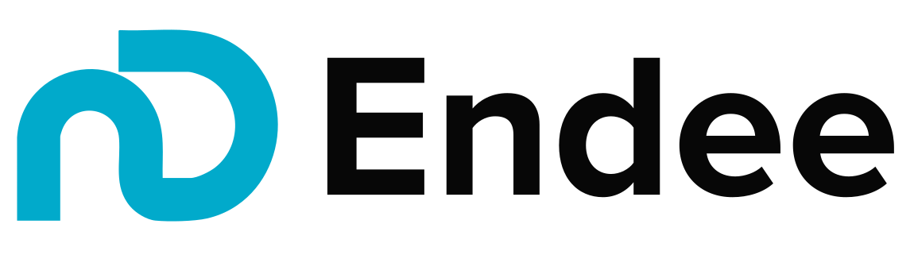 <code>endee</code></a></td><td align="center"><a href="../logos/fauna.svg"> <code>fauna</code></a></td></tr>
<tr><td align="center"><a href="../logos/fauna-wordmark.svg"> <code>fauna-wordmark</code></a></td><td align="center"><a href="../logos/flink.svg">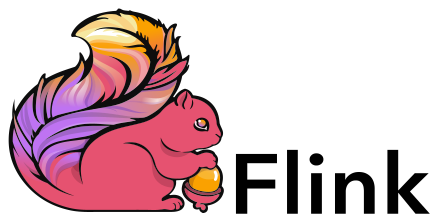 <code>flink</code></a></td><td align="center"><a href="../logos/foundationdb.svg"> <code>foundationdb</code></a></td><td align="center"><a href="../logos/foundationdb-wordmark.svg"> <code>foundationdb-wordmark</code></a></td><td align="center"><a href="../logos/glassflow.svg"> <code>glassflow</code></a></td><td align="center"><a href="../logos/google-cloud-dataflow.svg"> <code>google-cloud-dataflow</code></a></td></tr>
<tr><td align="center"><a href="../logos/google-data-studio.svg">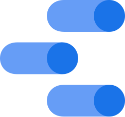 <code>google-data-studio</code></a></td><td align="center"><a href="../logos/graphscope.svg"> <code>graphscope</code></a></td><td align="center"><a href="../logos/greptimedb.svg">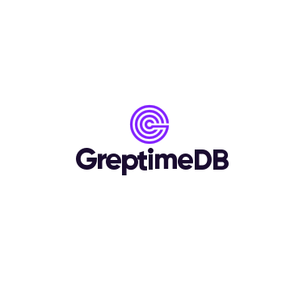 <code>greptimedb</code></a></td><td align="center"><a href="../logos/gunjs.svg"> <code>gunjs</code></a></td><td align="center"><a href="../logos/h2-database.svg"> <code>h2-database</code></a></td><td align="center"><a href="../logos/hadoop.svg"> <code>hadoop</code></a></td></tr>
<tr><td align="center"><a href="../logos/hazelcast.svg"> <code>hazelcast</code></a></td><td align="center"><a href="../logos/hbase.svg"> <code>hbase</code></a></td><td align="center"><a href="../logos/heron.svg"> <code>heron</code></a></td><td align="center"><a href="../logos/hibernate.svg"> <code>hibernate</code></a></td><td align="center"><a href="../logos/hibernate-wordmark.svg"> <code>hibernate-wordmark</code></a></td><td align="center"><a href="../logos/humongous.svg"> <code>humongous</code></a></td></tr>
<tr><td align="center"><a href="../logos/ibmdb2.svg">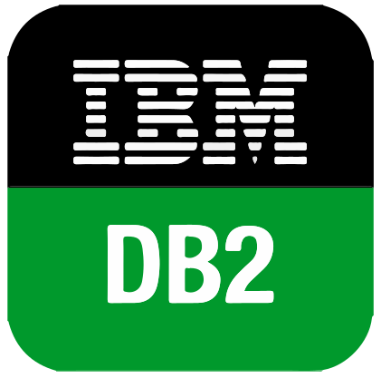 <code>ibmdb2</code></a></td><td align="center"><a href="../logos/iguazio.svg"> <code>iguazio</code></a></td><td align="center"><a href="../logos/impala.svg"> <code>impala</code></a></td><td align="center"><a href="../logos/importio.svg"> <code>importio</code></a></td><td align="center"><a href="../logos/importio-wordmark.svg"> <code>importio-wordmark</code></a></td><td align="center"><a href="../logos/infinispan.svg"> <code>infinispan</code></a></td></tr>
<tr><td align="center"><a href="../logos/influxdb.svg">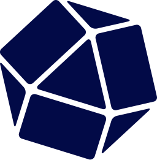 <code>influxdb</code></a></td><td align="center"><a href="../logos/influxdb-wordmark.svg"> <code>influxdb-wordmark</code></a></td><td align="center"><a href="../logos/intersystemsiris.svg"> <code>intersystemsiris</code></a></td><td align="center"><a href="../logos/kafka.svg"> <code>kafka</code></a></td><td align="center"><a href="../logos/kafka-wordmark.svg"> <code>kafka-wordmark</code></a></td><td align="center"><a href="../logos/keydb.svg"> <code>keydb</code></a></td></tr>
<tr><td align="center"><a href="../logos/keydb-wordmark.svg">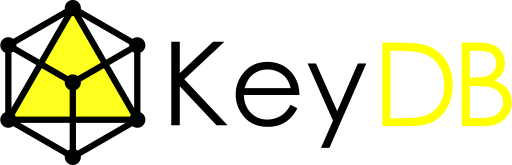 <code>keydb-wordmark</code></a></td><td align="center"><a href="../logos/kinto.svg"> <code>kinto</code></a></td><td align="center"><a href="../logos/kinto-wordmark.svg"> <code>kinto-wordmark</code></a></td><td align="center"><a href="../logos/knex.svg"> <code>knex</code></a></td><td align="center"><a href="../logos/kube-db-by-apps-code.svg">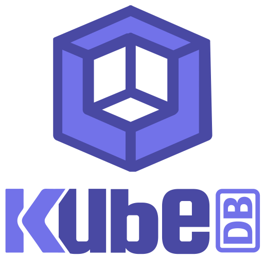 <code>kube-db-by-apps-code</code></a></td><td align="center"><a href="../logos/kubeblocks.svg">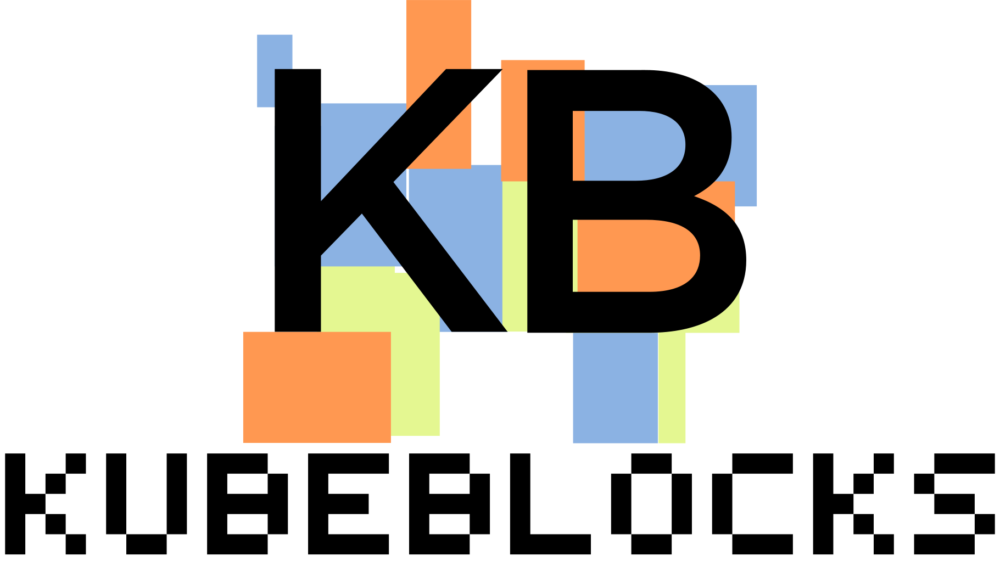 <code>kubeblocks</code></a></td></tr>
<tr><td align="center"><a href="../logos/kubemq.svg"> <code>kubemq</code></a></td><td align="center"><a href="../logos/leveldb.svg"> <code>leveldb</code></a></td><td align="center"><a href="../logos/libreoffice-colibre-database.svg"> <code>libreoffice-colibre-database</code></a></td><td align="center"><a href="../logos/looker.svg"> <code>looker</code></a></td><td align="center"><a href="../logos/looker-wordmark.svg"> <code>looker-wordmark</code></a></td><td align="center"><a href="../logos/lucene.svg"> <code>lucene</code></a></td></tr>
<tr><td align="center"><a href="../logos/lucene-net.svg"> <code>lucene-net</code></a></td><td align="center"><a href="../logos/mariadb.svg"> <code>mariadb</code></a></td><td align="center"><a href="../logos/mariadb-wordmark.svg"> <code>mariadb-wordmark</code></a></td><td align="center"><a href="../logos/meilisearch.svg"> <code>meilisearch</code></a></td><td align="center"><a href="../logos/memcached.svg">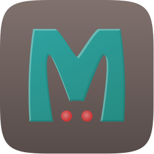 <code>memcached</code></a></td><td align="center"><a href="../logos/memcached-wordmark.svg"> <code>memcached-wordmark</code></a></td></tr>
<tr><td align="center"><a href="../logos/memgraph.svg">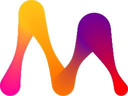 <code>memgraph</code></a></td><td align="center"><a href="../logos/memphis.svg"> <code>memphis</code></a></td><td align="center"><a href="../logos/memsql.svg"> <code>memsql</code></a></td><td align="center"><a href="../logos/memsql-wordmark.svg"> <code>memsql-wordmark</code></a></td><td align="center"><a href="../logos/metabase.svg"> <code>metabase</code></a></td><td align="center"><a href="../logos/metabase-wordmark.svg"> <code>metabase-wordmark</code></a></td></tr>
<tr><td align="center"><a href="../logos/microsoft-access.svg">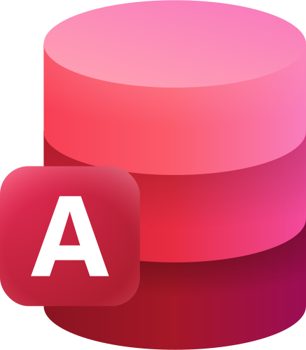 <code>microsoft-access</code></a></td><td align="center"><a href="../logos/microsoft-power-bi.svg"> <code>microsoft-power-bi</code></a></td><td align="center"><a href="../logos/microsoft-power-bi-wordmark.svg"> <code>microsoft-power-bi-wordmark</code></a></td><td align="center"><a href="../logos/microsoft-sql-server.svg"> <code>microsoft-sql-server</code></a></td><td align="center"><a href="../logos/milvus.svg"> <code>milvus</code></a></td><td align="center"><a href="../logos/milvus-wordmark.svg"> <code>milvus-wordmark</code></a></td></tr>
<tr><td align="center"><a href="../logos/mlab.svg"> <code>mlab</code></a></td><td align="center"><a href="../logos/mlab-wordmark.svg"> <code>mlab-wordmark</code></a></td><td align="center"><a href="../logos/mongodb.svg"> <code>mongodb</code></a></td><td align="center"><a href="../logos/mongodb-wordmark.svg"> <code>mongodb-wordmark</code></a></td><td align="center"><a href="../logos/mongolab.svg"> <code>mongolab</code></a></td><td align="center"><a href="../logos/mysql.svg"> <code>mysql</code></a></td></tr>
<tr><td align="center"><a href="../logos/mysql-wordmark.svg"> <code>mysql-wordmark</code></a></td><td align="center"><a href="../logos/nats.svg"> <code>nats</code></a></td><td align="center"><a href="../logos/nats-wordmark.svg"> <code>nats-wordmark</code></a></td><td align="center"><a href="../logos/nebulagraph.svg">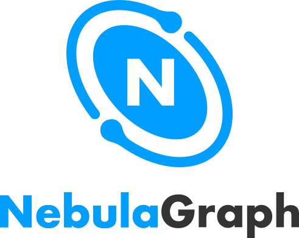 <code>nebulagraph</code></a></td><td align="center"><a href="../logos/neo4j.svg"> <code>neo4j</code></a></td><td align="center"><a href="../logos/neo4j-wordmark.svg"> <code>neo4j-wordmark</code></a></td></tr>
<tr><td align="center"><a href="../logos/neon.svg"> <code>neon</code></a></td><td align="center"><a href="../logos/neon-wordmark.svg"> <code>neon-wordmark</code></a></td><td align="center"><a href="../logos/nocodb.svg"> <code>nocodb</code></a></td><td align="center"><a href="../logos/numaproj.svg"> <code>numaproj</code></a></td><td align="center"><a href="../logos/nuodb.svg"> <code>nuodb</code></a></td><td align="center"><a href="../logos/observablehq.svg"> <code>observablehq</code></a></td></tr>
<tr><td align="center"><a href="../logos/oceanbase.svg"> <code>oceanbase</code></a></td><td align="center"><a href="../logos/openeverest.svg"> <code>openeverest</code></a></td><td align="center"><a href="../logos/opengemini.svg">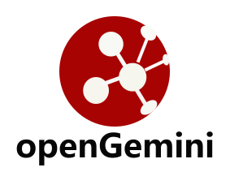 <code>opengemini</code></a></td><td align="center"><a href="../logos/openmessaging.svg">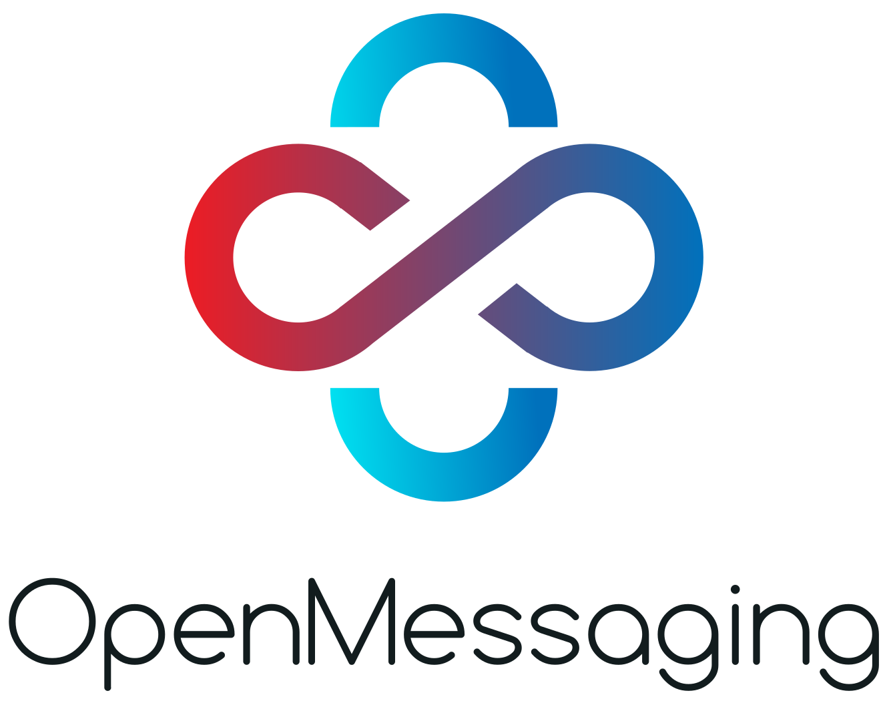 <code>openmessaging</code></a></td><td align="center"><a href="../logos/opensearch.svg"> <code>opensearch</code></a></td><td align="center"><a href="../logos/opensearch-wordmark.svg"> <code>opensearch-wordmark</code></a></td></tr>
<tr><td align="center"><a href="../logos/orient-db.svg">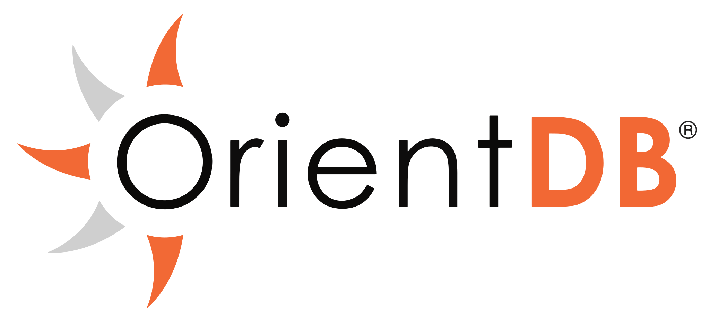 <code>orient-db</code></a></td><td align="center"><a href="../logos/pachyderm.svg">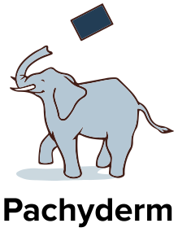 <code>pachyderm</code></a></td><td align="center"><a href="../logos/panweidb.svg"> <code>panweidb</code></a></td><td align="center"><a href="../logos/parsehub.svg"> <code>parsehub</code></a></td><td align="center"><a href="../logos/part-db.svg"> <code>part-db</code></a></td><td align="center"><a href="../logos/percona.svg"> <code>percona</code></a></td></tr>
<tr><td align="center"><a href="../logos/pinecone.svg"> <code>pinecone</code></a></td><td align="center"><a href="../logos/pinecone-wordmark.svg"> <code>pinecone-wordmark</code></a></td><td align="center"><a href="../logos/plainsignal.svg"> <code>plainsignal</code></a></td><td align="center"><a href="../logos/planetscale.svg"> <code>planetscale</code></a></td><td align="center"><a href="../logos/polardb.svg"> <code>polardb</code></a></td><td align="center"><a href="../logos/postgraphile.svg"> <code>postgraphile</code></a></td></tr>
<tr><td align="center"><a href="../logos/postgresql.svg"> <code>postgresql</code></a></td><td align="center"><a href="../logos/postgresql-wordmark.svg"> <code>postgresql-wordmark</code></a></td><td align="center"><a href="../logos/pouchdb.svg">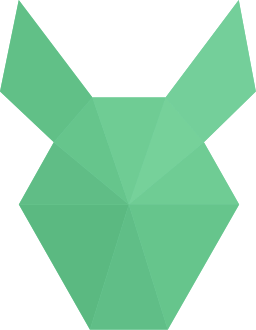 <code>pouchdb</code></a></td><td align="center"><a href="../logos/powersync.svg"> <code>powersync</code></a></td><td align="center"><a href="../logos/powersync-wordmark.svg"> <code>powersync-wordmark</code></a></td><td align="center"><a href="../logos/pravega.svg"> <code>pravega</code></a></td></tr>
<tr><td align="center"><a href="../logos/prefect.svg"> <code>prefect</code></a></td><td align="center"><a href="../logos/presto.svg">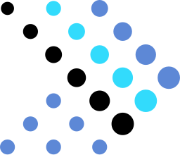 <code>presto</code></a></td><td align="center"><a href="../logos/presto-wordmark.svg"> <code>presto-wordmark</code></a></td><td align="center"><a href="../logos/prisma.svg"> <code>prisma</code></a></td><td align="center"><a href="../logos/pulsar.svg">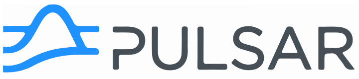 <code>pulsar</code></a></td><td align="center"><a href="../logos/pumpkindb.svg"> <code>pumpkindb</code></a></td></tr>
<tr><td align="center"><a href="../logos/qdrant.svg">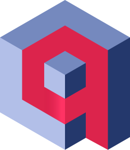 <code>qdrant</code></a></td><td align="center"><a href="../logos/qdrant-wordmark.svg"> <code>qdrant-wordmark</code></a></td><td align="center"><a href="../logos/qlik.svg"> <code>qlik</code></a></td><td align="center"><a href="../logos/qubole.svg"> <code>qubole</code></a></td><td align="center"><a href="../logos/quobyte.svg"> <code>quobyte</code></a></td><td align="center"><a href="../logos/rabbitmq.svg"> <code>rabbitmq</code></a></td></tr>
<tr><td align="center"><a href="../logos/rabbitmq-wordmark.svg"> <code>rabbitmq-wordmark</code></a></td><td align="center"><a href="../logos/realm.svg"> <code>realm</code></a></td><td align="center"><a href="../logos/redis.svg"> <code>redis</code></a></td><td align="center"><a href="../logos/redis-wordmark.svg"> <code>redis-wordmark</code></a></td><td align="center"><a href="../logos/redsmin.svg"> <code>redsmin</code></a></td><td align="center"><a href="../logos/rethinkdb.svg"> <code>rethinkdb</code></a></td></tr>
<tr><td align="center"><a href="../logos/riak.svg"> <code>riak</code></a></td><td align="center"><a href="../logos/risingwave.svg"> <code>risingwave</code></a></td><td align="center"><a href="../logos/risingwave-wordmark.svg"> <code>risingwave-wordmark</code></a></td><td align="center"><a href="../logos/rocksdb.svg"> <code>rocksdb</code></a></td><td align="center"><a href="../logos/rocksdb-wordmark.svg"> <code>rocksdb-wordmark</code></a></td><td align="center"><a href="../logos/rsmq.svg"> <code>rsmq</code></a></td></tr>
<tr><td align="center"><a href="../logos/rxdb.svg"> <code>rxdb</code></a></td><td align="center"><a href="../logos/scalardb.svg">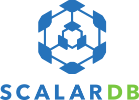 <code>scalardb</code></a></td><td align="center"><a href="../logos/schemahero.svg">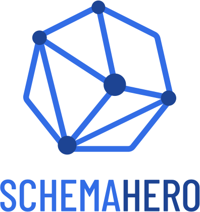 <code>schemahero</code></a></td><td align="center"><a href="../logos/scylladb.svg"> <code>scylladb</code></a></td><td align="center"><a href="../logos/scylladb-wordmark.svg"> <code>scylladb-wordmark</code></a></td><td align="center"><a href="../logos/seata.svg"> <code>seata</code></a></td></tr>
<tr><td align="center"><a href="../logos/sequelize.svg"> <code>sequelize</code></a></td><td align="center"><a href="../logos/shardingsphere.svg">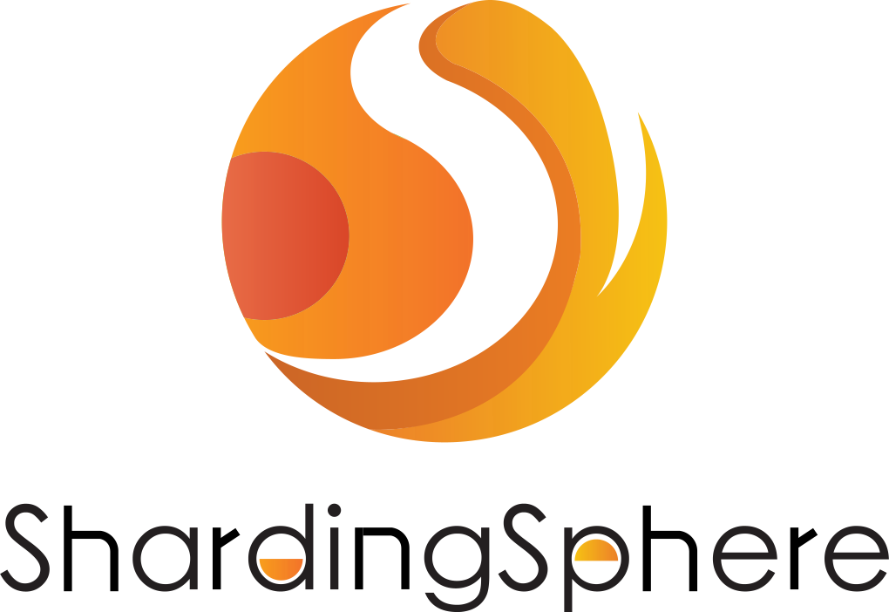 <code>shardingsphere</code></a></td><td align="center"><a href="../logos/siddhi.svg"> <code>siddhi</code></a></td><td align="center"><a href="../logos/singlestore.svg"> <code>singlestore</code></a></td><td align="center"><a href="../logos/singlestore-wordmark.svg"> <code>singlestore-wordmark</code></a></td><td align="center"><a href="../logos/snaplet.svg"> <code>snaplet</code></a></td></tr>
<tr><td align="center"><a href="../logos/snaplet-wordmark.svg"> <code>snaplet-wordmark</code></a></td><td align="center"><a href="../logos/snowflake.svg"> <code>snowflake</code></a></td><td align="center"><a href="../logos/snowflake-wordmark.svg"> <code>snowflake-wordmark</code></a></td><td align="center"><a href="../logos/software.svg"> <code>software</code></a></td><td align="center"><a href="../logos/solr.svg"> <code>solr</code></a></td><td align="center"><a href="../logos/spark.svg"> <code>spark</code></a></td></tr>
<tr><td align="center"><a href="../logos/sparql.svg"> <code>sparql</code></a></td><td align="center"><a href="../logos/spicedb.svg"> <code>spicedb</code></a></td><td align="center"><a href="../logos/sqldep.svg"> <code>sqldep</code></a></td><td align="center"><a href="../logos/sqlite.svg"> <code>sqlite</code></a></td><td align="center"><a href="../logos/starrocks.svg"> <code>starrocks</code></a></td><td align="center"><a href="../logos/stitch.svg"> <code>stitch</code></a></td></tr>
<tr><td align="center"><a href="../logos/stolon.svg"> <code>stolon</code></a></td><td align="center"><a href="../logos/strimzi.svg">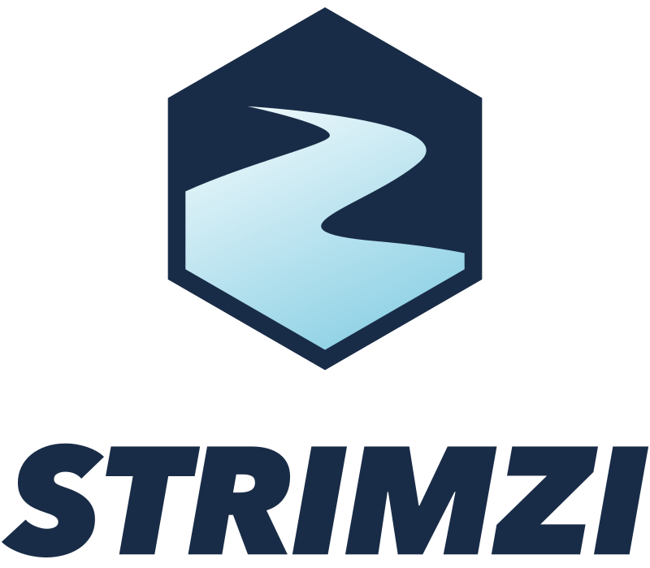 <code>strimzi</code></a></td><td align="center"><a href="../logos/surrealdb.svg"> <code>surrealdb</code></a></td><td align="center"><a href="../logos/surrealdb-wordmark.svg"> <code>surrealdb-wordmark</code></a></td><td align="center"><a href="../logos/tableau.svg"> <code>tableau</code></a></td><td align="center"><a href="../logos/tableau-wordmark.svg"> <code>tableau-wordmark</code></a></td></tr>
<tr><td align="center"><a href="../logos/talend.svg"> <code>talend</code></a></td><td align="center"><a href="../logos/talend-data-streams.svg"> <code>talend-data-streams</code></a></td><td align="center"><a href="../logos/talend-wordmark.svg"> <code>talend-wordmark</code></a></td><td align="center"><a href="../logos/tarantool.svg"> <code>tarantool</code></a></td><td align="center"><a href="../logos/tdengine.svg"> <code>tdengine</code></a></td><td align="center"><a href="../logos/the-movie-database.svg"> <code>the-movie-database</code></a></td></tr>
<tr><td align="center"><a href="../logos/tidb.svg"> <code>tidb</code></a></td><td align="center"><a href="../logos/timescale.svg"> <code>timescale</code></a></td><td align="center"><a href="../logos/treasuredata.svg"> <code>treasuredata</code></a></td><td align="center"><a href="../logos/treasuredata-wordmark.svg"> <code>treasuredata-wordmark</code></a></td><td align="center"><a href="../logos/tremor.svg">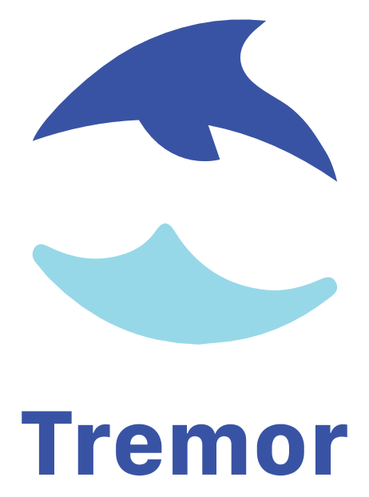 <code>tremor</code></a></td><td align="center"><a href="../logos/turso.svg"> <code>turso</code></a></td></tr>
<tr><td align="center"><a href="../logos/turso-wordmark.svg"> <code>turso-wordmark</code></a></td><td align="center"><a href="../logos/typeorm.svg"> <code>typeorm</code></a></td><td align="center"><a href="../logos/typesense.svg"> <code>typesense</code></a></td><td align="center"><a href="../logos/typesense-wordmark.svg"> <code>typesense-wordmark</code></a></td><td align="center"><a href="../logos/upstash.svg">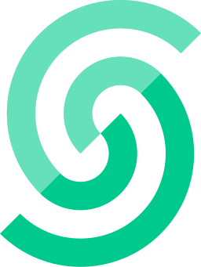 <code>upstash</code></a></td><td align="center"><a href="../logos/upstash-wordmark.svg"> <code>upstash-wordmark</code></a></td></tr>
<tr><td align="center"><a href="../logos/uqbar.svg"> <code>uqbar</code></a></td><td align="center"><a href="../logos/userver.svg"> <code>userver</code></a></td><td align="center"><a href="../logos/vald.svg">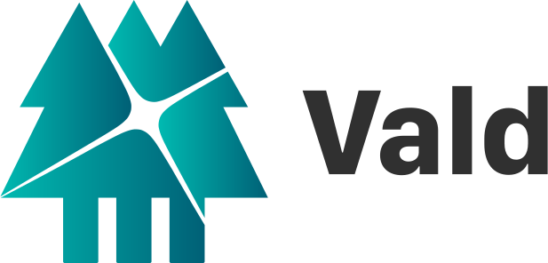 <code>vald</code></a></td><td align="center"><a href="../logos/vernemq.svg"> <code>vernemq</code></a></td><td align="center"><a href="../logos/vertica-ot.svg"> <code>vertica-ot</code></a></td><td align="center"><a href="../logos/victoriametrics.svg"> <code>victoriametrics</code></a></td></tr>
<tr><td align="center"><a href="../logos/visual-db.svg"> <code>visual-db</code></a></td><td align="center"><a href="../logos/vitess.svg"> <code>vitess</code></a></td><td align="center"><a href="../logos/voltdb.svg"> <code>voltdb</code></a></td><td align="center"><a href="../logos/weaviate.svg">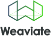 <code>weaviate</code></a></td><td align="center"><a href="../logos/xata.svg"> <code>xata</code></a></td><td align="center"><a href="../logos/xata-wordmark.svg"> <code>xata-wordmark</code></a></td></tr>
<tr><td align="center"><a href="../logos/xplenty.svg"> <code>xplenty</code></a></td><td align="center"><a href="../logos/xtdb.svg"> <code>xtdb</code></a></td><td align="center"><a href="../logos/ydb.svg"> <code>ydb</code></a></td><td align="center"><a href="../logos/yugabyte.svg"> <code>yugabyte</code></a></td><td align="center"><a href="../logos/yugabyte-wordmark.svg"> <code>yugabyte-wordmark</code></a></td><td align="center"><a href="../logos/yugabytedb.svg">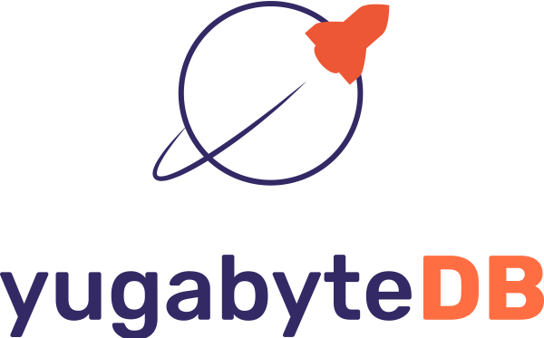 <code>yugabytedb</code></a></td></tr>
</table>

[⬅️ Back to the full catalog](../README.md)
