# 🛠️ Dev Tools, CI/CD & Testing (976)

[⬅️ Back to the full catalog](../README.md) · [🖼️ Browse & download on the website](https://logos.lndev.me/)
<table>
<tr><td align="center"><a href="../logos/30-seconds-of-code.svg"> <code>30-seconds-of-code</code></a></td><td align="center"><a href="../logos/advent-of-code.svg"> <code>advent-of-code</code></a></td><td align="center"><a href="../logos/aerogear.svg"> <code>aerogear</code></a></td><td align="center"><a href="../logos/agentregistry.svg"> <code>agentregistry</code></a></td><td align="center"><a href="../logos/agola.svg"> <code>agola</code></a></td><td align="center"><a href="../logos/airbrake.svg"> <code>airbrake</code></a></td></tr>
<tr><td align="center"><a href="../logos/airship.svg"> <code>airship</code></a></td><td align="center"><a href="../logos/akri.svg">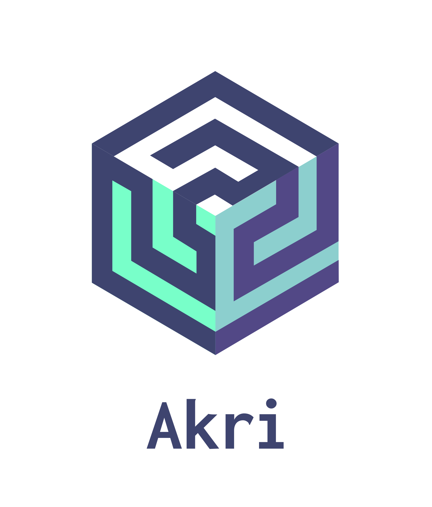 <code>akri</code></a></td><td align="center"><a href="../logos/alacritty.svg"> <code>alacritty</code></a></td><td align="center"><a href="../logos/alibaba-cloud-ahas.svg"> <code>alibaba-cloud-ahas</code></a></td><td align="center"><a href="../logos/alibaba-cloud-application-real-time-service.svg"> <code>alibaba-cloud-application-real-time-service</code></a></td><td align="center"><a href="../logos/alibaba-cloud-container-registry.svg"> <code>alibaba-cloud-container-registry</code></a></td></tr>
<tr><td align="center"><a href="../logos/alibaba-cloud-log-service.svg"> <code>alibaba-cloud-log-service</code></a></td><td align="center"><a href="../logos/alibaba-fnf.svg"> <code>alibaba-fnf</code></a></td><td align="center"><a href="../logos/amazon-cloudwatch.svg"> <code>amazon-cloudwatch</code></a></td><td align="center"><a href="../logos/amazon-cloudwatch-wordmark.svg"> <code>amazon-cloudwatch-wordmark</code></a></td><td align="center"><a href="../logos/amazon-ecr.svg"> <code>amazon-ecr</code></a></td><td align="center"><a href="../logos/amplication.svg">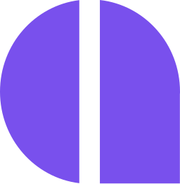 <code>amplication</code></a></td></tr>
<tr><td align="center"><a href="../logos/amplication-wordmark.svg"> <code>amplication-wordmark</code></a></td><td align="center"><a href="../logos/ansible.svg"> <code>ansible</code></a></td><td align="center"><a href="../logos/ansible-wordmark.svg"> <code>ansible-wordmark</code></a></td><td align="center"><a href="../logos/anteon.svg"> <code>anteon</code></a></td><td align="center"><a href="../logos/apache.svg"> <code>apache</code></a></td><td align="center"><a href="../logos/apache-activemq.svg"> <code>apache-activemq</code></a></td></tr>
<tr><td align="center"><a href="../logos/apache-activemq-wordmark.svg"> <code>apache-activemq-wordmark</code></a></td><td align="center"><a href="../logos/apache-airflow.svg"> <code>apache-airflow</code></a></td><td align="center"><a href="../logos/apache-answer.svg">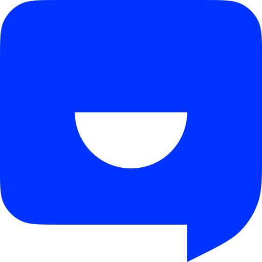 <code>apache-answer</code></a></td><td align="center"><a href="../logos/apache-ant.svg"> <code>apache-ant</code></a></td><td align="center"><a href="../logos/apache-ant-wordmark.svg"> <code>apache-ant-wordmark</code></a></td><td align="center"><a href="../logos/apache-apex.svg"> <code>apache-apex</code></a></td></tr>
<tr><td align="center"><a href="../logos/apache-apex-wordmark.svg"> <code>apache-apex-wordmark</code></a></td><td align="center"><a href="../logos/apache-arrow.svg"> <code>apache-arrow</code></a></td><td align="center"><a href="../logos/apache-avro.svg"> <code>apache-avro</code></a></td><td align="center"><a href="../logos/apache-batik.svg"> <code>apache-batik</code></a></td><td align="center"><a href="../logos/apache-batik-wordmark.svg"> <code>apache-batik-wordmark</code></a></td><td align="center"><a href="../logos/apache-beam.svg"> <code>apache-beam</code></a></td></tr>
<tr><td align="center"><a href="../logos/apache-beam-wordmark.svg"> <code>apache-beam-wordmark</code></a></td><td align="center"><a href="../logos/apache-calcite.svg"> <code>apache-calcite</code></a></td><td align="center"><a href="../logos/apache-calcite-wordmark.svg"> <code>apache-calcite-wordmark</code></a></td><td align="center"><a href="../logos/apache-camel.svg"> <code>apache-camel</code></a></td><td align="center"><a href="../logos/apache-carbondata.svg">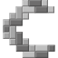 <code>apache-carbondata</code></a></td><td align="center"><a href="../logos/apache-carbondata-wordmark.svg"> <code>apache-carbondata-wordmark</code></a></td></tr>
<tr><td align="center"><a href="../logos/apache-cassandra.svg"> <code>apache-cassandra</code></a></td><td align="center"><a href="../logos/apache-cloudstack.svg"> <code>apache-cloudstack</code></a></td><td align="center"><a href="../logos/apache-cordova.svg"> <code>apache-cordova</code></a></td><td align="center"><a href="../logos/apache-couchdb.svg"> <code>apache-couchdb</code></a></td><td align="center"><a href="../logos/apache-couchdb-wordmark.svg"> <code>apache-couchdb-wordmark</code></a></td><td align="center"><a href="../logos/apache-dolphinscheduler.svg"> <code>apache-dolphinscheduler</code></a></td></tr>
<tr><td align="center"><a href="../logos/apache-doris.svg"> <code>apache-doris</code></a></td><td align="center"><a href="../logos/apache-druid.svg"> <code>apache-druid</code></a></td><td align="center"><a href="../logos/apache-echarts.svg"> <code>apache-echarts</code></a></td><td align="center"><a href="../logos/apache-freemarker.svg"> <code>apache-freemarker</code></a></td><td align="center"><a href="../logos/apache-groovy.svg"> <code>apache-groovy</code></a></td><td align="center"><a href="../logos/apache-guacamole.svg"> <code>apache-guacamole</code></a></td></tr>
<tr><td align="center"><a href="../logos/apache-guacamole-wordmark.svg"> <code>apache-guacamole-wordmark</code></a></td><td align="center"><a href="../logos/apache-hadoop.svg"> <code>apache-hadoop</code></a></td><td align="center"><a href="../logos/apache-hadoop-wordmark.svg"> <code>apache-hadoop-wordmark</code></a></td><td align="center"><a href="../logos/apache-hbase.svg"> <code>apache-hbase</code></a></td><td align="center"><a href="../logos/apache-heron.svg"> <code>apache-heron</code></a></td><td align="center"><a href="../logos/apache-heron-wordmark.svg"> <code>apache-heron-wordmark</code></a></td></tr>
<tr><td align="center"><a href="../logos/apache-hive.svg"> <code>apache-hive</code></a></td><td align="center"><a href="../logos/apache-hive-wordmark.svg"> <code>apache-hive-wordmark</code></a></td><td align="center"><a href="../logos/apache-iceberg.svg"> <code>apache-iceberg</code></a></td><td align="center"><a href="../logos/apache-jena.svg">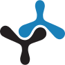 <code>apache-jena</code></a></td><td align="center"><a href="../logos/apache-jena-wordmark.svg"> <code>apache-jena-wordmark</code></a></td><td align="center"><a href="../logos/apache-jmeter.svg"> <code>apache-jmeter</code></a></td></tr>
<tr><td align="center"><a href="../logos/apache-kafka.svg"> <code>apache-kafka</code></a></td><td align="center"><a href="../logos/apache-kafka-wordmark.svg"> <code>apache-kafka-wordmark</code></a></td><td align="center"><a href="../logos/apache-kudu.svg"> <code>apache-kudu</code></a></td><td align="center"><a href="../logos/apache-kylin.svg"> <code>apache-kylin</code></a></td><td align="center"><a href="../logos/apache-lucene.svg"> <code>apache-lucene</code></a></td><td align="center"><a href="../logos/apache-lucene-wordmark.svg"> <code>apache-lucene-wordmark</code></a></td></tr>
<tr><td align="center"><a href="../logos/apache-maven.svg"> <code>apache-maven</code></a></td><td align="center"><a href="../logos/apache-maven-wordmark.svg"> <code>apache-maven-wordmark</code></a></td><td align="center"><a href="../logos/apache-mesos.svg"> <code>apache-mesos</code></a></td><td align="center"><a href="../logos/apache-mesos-wordmark.svg"> <code>apache-mesos-wordmark</code></a></td><td align="center"><a href="../logos/apache-netbeans-ide.svg"> <code>apache-netbeans-ide</code></a></td><td align="center"><a href="../logos/apache-nifi.svg"> <code>apache-nifi</code></a></td></tr>
<tr><td align="center"><a href="../logos/apache-nifi-wordmark.svg"> <code>apache-nifi-wordmark</code></a></td><td align="center"><a href="../logos/apache-openoffice.svg"> <code>apache-openoffice</code></a></td><td align="center"><a href="../logos/apache-openwhisk.svg"> <code>apache-openwhisk</code></a></td><td align="center"><a href="../logos/apache-openwhisk-wordmark.svg"> <code>apache-openwhisk-wordmark</code></a></td><td align="center"><a href="../logos/apache-orc.svg"> <code>apache-orc</code></a></td><td align="center"><a href="../logos/apache-orc-wordmark.svg"> <code>apache-orc-wordmark</code></a></td></tr>
<tr><td align="center"><a href="../logos/apache-parquet.svg"> <code>apache-parquet</code></a></td><td align="center"><a href="../logos/apache-pdfbox.svg"> <code>apache-pdfbox</code></a></td><td align="center"><a href="../logos/apache-pdfbox-wordmark.svg"> <code>apache-pdfbox-wordmark</code></a></td><td align="center"><a href="../logos/apache-pig.svg"> <code>apache-pig</code></a></td><td align="center"><a href="../logos/apache-pig-wordmark.svg"> <code>apache-pig-wordmark</code></a></td><td align="center"><a href="../logos/apache-poi.svg"> <code>apache-poi</code></a></td></tr>
<tr><td align="center"><a href="../logos/apache-poi-wordmark.svg"> <code>apache-poi-wordmark</code></a></td><td align="center"><a href="../logos/apache-pulsar.svg"> <code>apache-pulsar</code></a></td><td align="center"><a href="../logos/apache-rocketmq.svg"> <code>apache-rocketmq</code></a></td><td align="center"><a href="../logos/apache-rocketmq-wordmark.svg"> <code>apache-rocketmq-wordmark</code></a></td><td align="center"><a href="../logos/apache-solr.svg"> <code>apache-solr</code></a></td><td align="center"><a href="../logos/apache-solr-wordmark.svg"> <code>apache-solr-wordmark</code></a></td></tr>
<tr><td align="center"><a href="../logos/apache-storm.svg"> <code>apache-storm</code></a></td><td align="center"><a href="../logos/apache-storm-wordmark.svg"> <code>apache-storm-wordmark</code></a></td><td align="center"><a href="../logos/apache-struts.svg"> <code>apache-struts</code></a></td><td align="center"><a href="../logos/apache-struts-wordmark.svg"> <code>apache-struts-wordmark</code></a></td><td align="center"><a href="../logos/apache-subversion.svg"> <code>apache-subversion</code></a></td><td align="center"><a href="../logos/apache-subversion-wordmark.svg"> <code>apache-subversion-wordmark</code></a></td></tr>
<tr><td align="center"><a href="../logos/apache-tika.svg"> <code>apache-tika</code></a></td><td align="center"><a href="../logos/apache-tika-binary.svg"> <code>apache-tika-binary</code></a></td><td align="center"><a href="../logos/apache-tomcat.svg"> <code>apache-tomcat</code></a></td><td align="center"><a href="../logos/apache-tomcat-wordmark.svg"> <code>apache-tomcat-wordmark</code></a></td><td align="center"><a href="../logos/apache-wordmark.svg"> <code>apache-wordmark</code></a></td><td align="center"><a href="../logos/apache-zookeeper.svg"> <code>apache-zookeeper</code></a></td></tr>
<tr><td align="center"><a href="../logos/apache-zookeeper-wordmark.svg">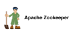 <code>apache-zookeeper-wordmark</code></a></td><td align="center"><a href="../logos/apiary.svg"> <code>apiary</code></a></td><td align="center"><a href="../logos/apidog.svg"> <code>apidog</code></a></td><td align="center"><a href="../logos/apidog-wordmark.svg"> <code>apidog-wordmark</code></a></td><td align="center"><a href="../logos/apigee.svg"> <code>apigee</code></a></td><td align="center"><a href="../logos/apitools.svg"> <code>apitools</code></a></td></tr>
<tr><td align="center"><a href="../logos/apollo-1.svg">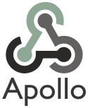 <code>apollo-1</code></a></td><td align="center"><a href="../logos/appcelerator.svg"> <code>appcelerator</code></a></td><td align="center"><a href="../logos/appcenter.svg"> <code>appcenter</code></a></td><td align="center"><a href="../logos/appcenter-wordmark.svg"> <code>appcenter-wordmark</code></a></td><td align="center"><a href="../logos/appcircle.svg"> <code>appcircle</code></a></td><td align="center"><a href="../logos/appcircle-wordmark.svg"> <code>appcircle-wordmark</code></a></td></tr>
<tr><td align="center"><a href="../logos/appcode.svg"> <code>appcode</code></a></td><td align="center"><a href="../logos/appdynamics.svg"> <code>appdynamics</code></a></td><td align="center"><a href="../logos/apphub.svg"> <code>apphub</code></a></td><td align="center"><a href="../logos/appium.svg"> <code>appium</code></a></td><td align="center"><a href="../logos/applications-manager.svg"> <code>applications-manager</code></a></td><td align="center"><a href="../logos/applitools.svg"> <code>applitools</code></a></td></tr>
<tr><td align="center"><a href="../logos/applitools-wordmark.svg"> <code>applitools-wordmark</code></a></td><td align="center"><a href="../logos/appmaker.svg"> <code>appmaker</code></a></td><td align="center"><a href="../logos/apportable.svg"> <code>apportable</code></a></td><td align="center"><a href="../logos/appsignal.svg">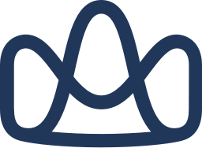 <code>appsignal</code></a></td><td align="center"><a href="../logos/appsignal-wordmark.svg"> <code>appsignal-wordmark</code></a></td><td align="center"><a href="../logos/appveyor.svg"> <code>appveyor</code></a></td></tr>
<tr><td align="center"><a href="../logos/appveyor-wordmark.svg"> <code>appveyor-wordmark</code></a></td><td align="center"><a href="../logos/architect.svg"> <code>architect</code></a></td><td align="center"><a href="../logos/argo.svg"> <code>argo</code></a></td><td align="center"><a href="../logos/argo-wordmark.svg"> <code>argo-wordmark</code></a></td><td align="center"><a href="../logos/armory.svg"> <code>armory</code></a></td><td align="center"><a href="../logos/armory-wordmark.svg"> <code>armory-wordmark</code></a></td></tr>
<tr><td align="center"><a href="../logos/asciidoctor.svg"> <code>asciidoctor</code></a></td><td align="center"><a href="../logos/aspecto.svg">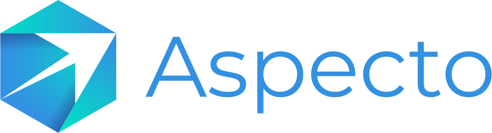 <code>aspecto</code></a></td><td align="center"><a href="../logos/assembla.svg">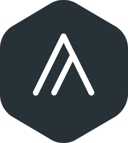 <code>assembla</code></a></td><td align="center"><a href="../logos/assembla-wordmark.svg"> <code>assembla-wordmark</code></a></td><td align="center"><a href="../logos/async-api.svg"> <code>async-api</code></a></td><td align="center"><a href="../logos/async-api-wordmark.svg"> <code>async-api-wordmark</code></a></td></tr>
<tr><td align="center"><a href="../logos/aternity.svg"> <code>aternity</code></a></td><td align="center"><a href="../logos/atom.svg"> <code>atom</code></a></td><td align="center"><a href="../logos/atom-wordmark.svg"> <code>atom-wordmark</code></a></td><td align="center"><a href="../logos/autocode.svg"> <code>autocode</code></a></td><td align="center"><a href="../logos/ava.svg"> <code>ava</code></a></td><td align="center"><a href="../logos/azure-kubernetes-services.svg"> <code>azure-kubernetes-services</code></a></td></tr>
<tr><td align="center"><a href="../logos/azure-monitor.svg"> <code>azure-monitor</code></a></td><td align="center"><a href="../logos/azure-pipelines.svg"> <code>azure-pipelines</code></a></td><td align="center"><a href="../logos/azure-registry.svg"> <code>azure-registry</code></a></td><td align="center"><a href="../logos/babel.svg"> <code>babel</code></a></td><td align="center"><a href="../logos/bamboo.svg"> <code>bamboo</code></a></td><td align="center"><a href="../logos/bash.svg"> <code>bash</code></a></td></tr>
<tr><td align="center"><a href="../logos/bash-wordmark.svg"> <code>bash-wordmark</code></a></td><td align="center"><a href="../logos/beats.svg"> <code>beats</code></a></td><td align="center"><a href="../logos/bigpanda.svg"> <code>bigpanda</code></a></td><td align="center"><a href="../logos/biomejs.svg"> <code>biomejs</code></a></td><td align="center"><a href="../logos/biomejs-wordmark.svg"> <code>biomejs-wordmark</code></a></td><td align="center"><a href="../logos/bitbar.svg"> <code>bitbar</code></a></td></tr>
<tr><td align="center"><a href="../logos/bitbucket.svg"> <code>bitbucket</code></a></td><td align="center"><a href="../logos/bitbucket-wordmark.svg"> <code>bitbucket-wordmark</code></a></td><td align="center"><a href="../logos/bitnami.svg"> <code>bitnami</code></a></td><td align="center"><a href="../logos/bitnami-wordmark.svg"> <code>bitnami-wordmark</code></a></td><td align="center"><a href="../logos/bitrise.svg"> <code>bitrise</code></a></td><td align="center"><a href="../logos/bitrise-wordmark.svg"> <code>bitrise-wordmark</code></a></td></tr>
<tr><td align="center"><a href="../logos/blue-matador.svg"> <code>blue-matador</code></a></td><td align="center"><a href="../logos/bosun.svg"> <code>bosun</code></a></td><td align="center"><a href="../logos/botkube.svg">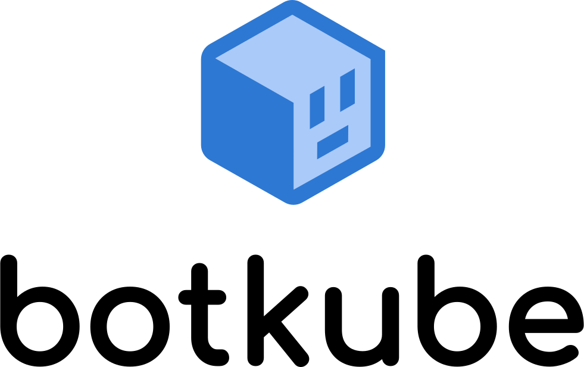 <code>botkube</code></a></td><td align="center"><a href="../logos/bower.svg"> <code>bower</code></a></td><td align="center"><a href="../logos/bower-wordmark.svg"> <code>bower-wordmark</code></a></td><td align="center"><a href="../logos/brackets.svg"> <code>brackets</code></a></td></tr>
<tr><td align="center"><a href="../logos/brigade.svg">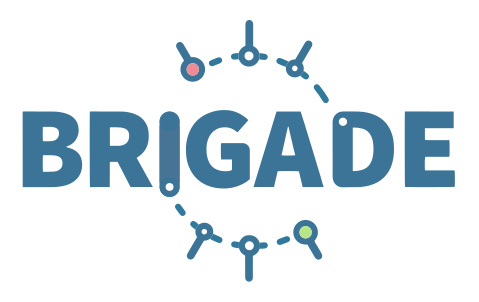 <code>brigade</code></a></td><td align="center"><a href="../logos/broccoli.svg">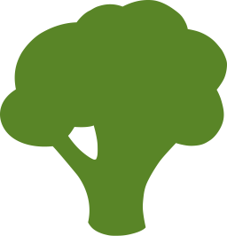 <code>broccoli</code></a></td><td align="center"><a href="../logos/brotli.svg"> <code>brotli</code></a></td><td align="center"><a href="../logos/browserify.svg"> <code>browserify</code></a></td><td align="center"><a href="../logos/browserify-wordmark.svg"> <code>browserify-wordmark</code></a></td><td align="center"><a href="../logos/browserling.svg"> <code>browserling</code></a></td></tr>
<tr><td align="center"><a href="../logos/browserslist.svg"> <code>browserslist</code></a></td><td align="center"><a href="../logos/browserstack.svg"> <code>browserstack</code></a></td><td align="center"><a href="../logos/browserstack-wordmark.svg"> <code>browserstack-wordmark</code></a></td><td align="center"><a href="../logos/browsersync.svg"> <code>browsersync</code></a></td><td align="center"><a href="../logos/brunch.svg">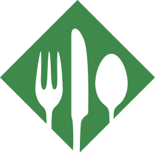 <code>brunch</code></a></td><td align="center"><a href="../logos/bub.svg">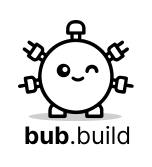 <code>bub</code></a></td></tr>
<tr><td align="center"><a href="../logos/buck.svg"> <code>buck</code></a></td><td align="center"><a href="../logos/bucket.svg"> <code>bucket</code></a></td><td align="center"><a href="../logos/bucketeer.svg">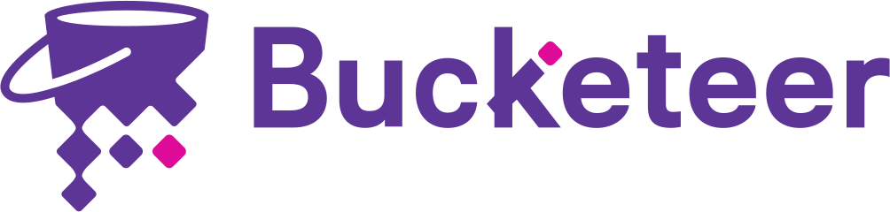 <code>bucketeer</code></a></td><td align="center"><a href="../logos/buddy.svg"> <code>buddy</code></a></td><td align="center"><a href="../logos/bugherd.svg"> <code>bugherd</code></a></td><td align="center"><a href="../logos/bugherd-wordmark.svg"> <code>bugherd-wordmark</code></a></td></tr>
<tr><td align="center"><a href="../logos/bugsee.svg"> <code>bugsee</code></a></td><td align="center"><a href="../logos/bugsnag.svg"> <code>bugsnag</code></a></td><td align="center"><a href="../logos/bugsnag-wordmark.svg">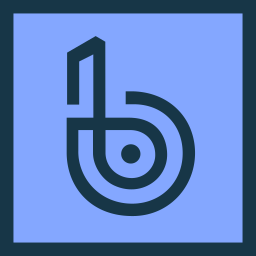 <code>bugsnag-wordmark</code></a></td><td align="center"><a href="../logos/buildkite.svg"> <code>buildkite</code></a></td><td align="center"><a href="../logos/buildkite-wordmark.svg"> <code>buildkite-wordmark</code></a></td><td align="center"><a href="../logos/buildpacks.svg">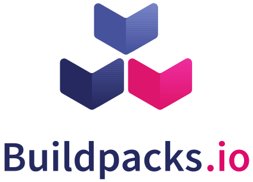 <code>buildpacks</code></a></td></tr>
<tr><td align="center"><a href="../logos/bunnyshell.svg"> <code>bunnyshell</code></a></td><td align="center"><a href="../logos/bytebase.svg"> <code>bytebase</code></a></td><td align="center"><a href="../logos/cachet.svg"> <code>cachet</code></a></td><td align="center"><a href="../logos/caddy.svg"> <code>caddy</code></a></td><td align="center"><a href="../logos/cadenceworkflow.svg"> <code>cadenceworkflow</code></a></td><td align="center"><a href="../logos/calibre.svg"> <code>calibre</code></a></td></tr>
<tr><td align="center"><a href="../logos/calibre-wordmark.svg"> <code>calibre-wordmark</code></a></td><td align="center"><a href="../logos/cape.svg"> <code>cape</code></a></td><td align="center"><a href="../logos/capistrano.svg"> <code>capistrano</code></a></td><td align="center"><a href="../logos/carbide.svg">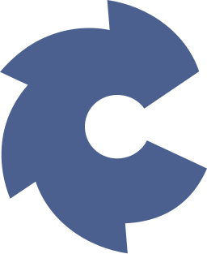 <code>carbide</code></a></td><td align="center"><a href="../logos/cartographer.svg">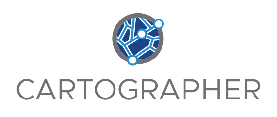 <code>cartographer</code></a></td><td align="center"><a href="../logos/carvel.svg">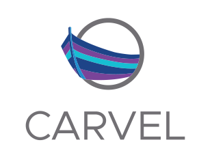 <code>carvel</code></a></td></tr>
<tr><td align="center"><a href="../logos/cdk8s.svg">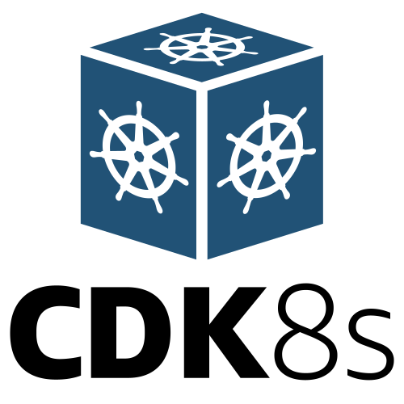 <code>cdk8s</code></a></td><td align="center"><a href="../logos/chai.svg"> <code>chai</code></a></td><td align="center"><a href="../logos/chalk.svg"> <code>chalk</code></a></td><td align="center"><a href="../logos/chaos-mesh.svg">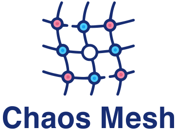 <code>chaos-mesh</code></a></td><td align="center"><a href="../logos/chaos-meta.svg">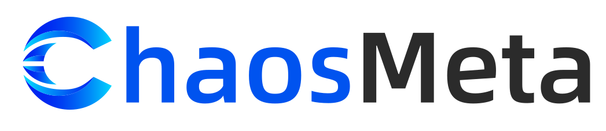 <code>chaos-meta</code></a></td><td align="center"><a href="../logos/chaosblade.svg">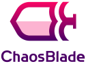 <code>chaosblade</code></a></td></tr>
<tr><td align="center"><a href="../logos/chaoskube.svg">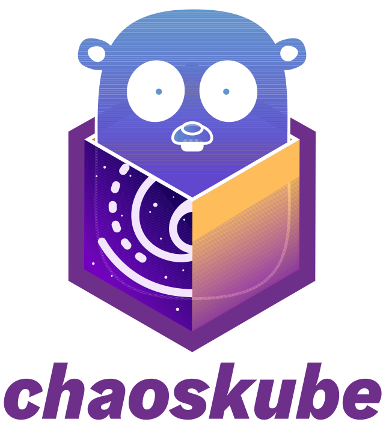 <code>chaoskube</code></a></td><td align="center"><a href="../logos/chaterm.svg">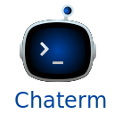 <code>chaterm</code></a></td><td align="center"><a href="../logos/chef.svg">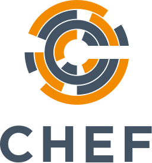 <code>chef</code></a></td><td align="center"><a href="../logos/chef-habitat.svg">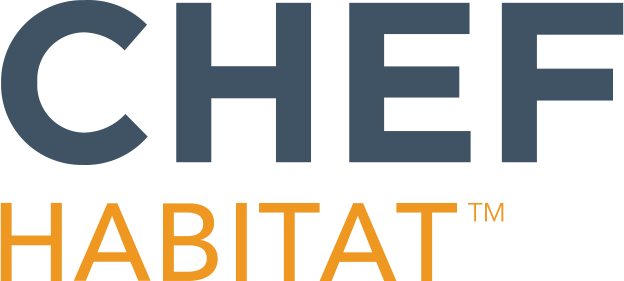 <code>chef-habitat</code></a></td><td align="center"><a href="../logos/chef-infra.svg"> <code>chef-infra</code></a></td><td align="center"><a href="../logos/chromatic.svg"> <code>chromatic</code></a></td></tr>
<tr><td align="center"><a href="../logos/chromatic-wordmark.svg"> <code>chromatic-wordmark</code></a></td><td align="center"><a href="../logos/circleci.svg"> <code>circleci</code></a></td><td align="center"><a href="../logos/circleci-wordmark.svg"> <code>circleci-wordmark</code></a></td><td align="center"><a href="../logos/cirrus.svg">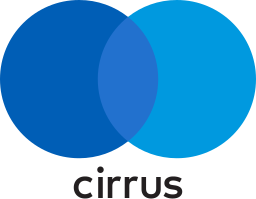 <code>cirrus</code></a></td><td align="center"><a href="../logos/cirrus-ci.svg"> <code>cirrus-ci</code></a></td><td align="center"><a href="../logos/claude-code.svg"> <code>claude-code</code></a></td></tr>
<tr><td align="center"><a href="../logos/clickdeploy.svg"> <code>clickdeploy</code></a></td><td align="center"><a href="../logos/clion.svg"> <code>clion</code></a></td><td align="center"><a href="../logos/cloud-custodian.svg"> <code>cloud-custodian</code></a></td><td align="center"><a href="../logos/cloud9.svg">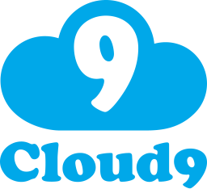 <code>cloud9</code></a></td><td align="center"><a href="../logos/cloudark-kubeplus.svg"> <code>cloudark-kubeplus</code></a></td><td align="center"><a href="../logos/cloudfoundry-bosh.svg">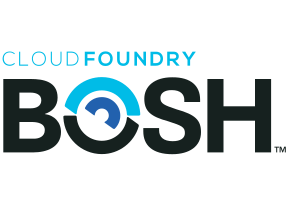 <code>cloudfoundry-bosh</code></a></td></tr>
<tr><td align="center"><a href="../logos/cloudhealth.svg"> <code>cloudhealth</code></a></td><td align="center"><a href="../logos/cloudify.svg"> <code>cloudify</code></a></td><td align="center"><a href="../logos/cloudpilot-ai.svg"> <code>cloudpilot-ai</code></a></td><td align="center"><a href="../logos/cloudtty.svg"> <code>cloudtty</code></a></td><td align="center"><a href="../logos/cloudwise-synthetic-monitoring.svg">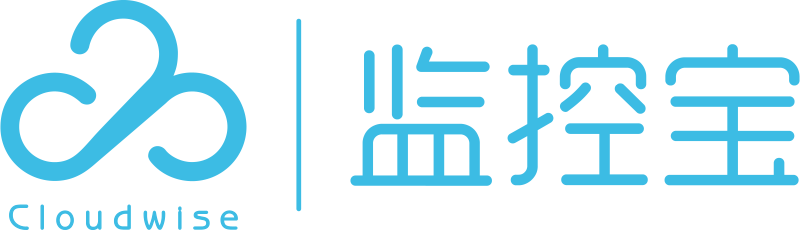 <code>cloudwise-synthetic-monitoring</code></a></td><td align="center"><a href="../logos/cocoapods.svg"> <code>cocoapods</code></a></td></tr>
<tr><td align="center"><a href="../logos/codacy.svg"> <code>codacy</code></a></td><td align="center"><a href="../logos/codacy-wordmark.svg"> <code>codacy-wordmark</code></a></td><td align="center"><a href="../logos/code-blocks.svg"> <code>code-blocks</code></a></td><td align="center"><a href="../logos/codebase.svg"> <code>codebase</code></a></td><td align="center"><a href="../logos/codebeat.svg">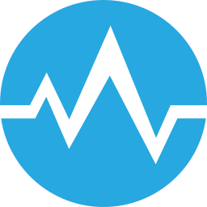 <code>codebeat</code></a></td><td align="center"><a href="../logos/codeberg.svg"> <code>codeberg</code></a></td></tr>
<tr><td align="center"><a href="../logos/codeception.svg"> <code>codeception</code></a></td><td align="center"><a href="../logos/codeclimate.svg"> <code>codeclimate</code></a></td><td align="center"><a href="../logos/codeclimate-wordmark.svg"> <code>codeclimate-wordmark</code></a></td><td align="center"><a href="../logos/codecov.svg"> <code>codecov</code></a></td><td align="center"><a href="../logos/codecov-wordmark.svg"> <code>codecov-wordmark</code></a></td><td align="center"><a href="../logos/codefactor.svg">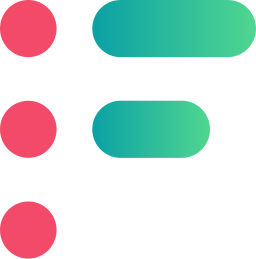 <code>codefactor</code></a></td></tr>
<tr><td align="center"><a href="../logos/codefactor-wordmark.svg"> <code>codefactor-wordmark</code></a></td><td align="center"><a href="../logos/codefresh.svg">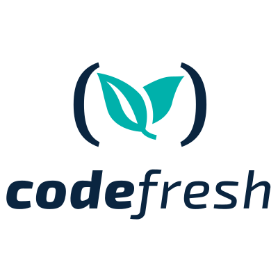 <code>codefresh</code></a></td><td align="center"><a href="../logos/codepen.svg"> <code>codepen</code></a></td><td align="center"><a href="../logos/codepicnic.svg"> <code>codepicnic</code></a></td><td align="center"><a href="../logos/codepush.svg"> <code>codepush</code></a></td><td align="center"><a href="../logos/codersrank.svg"> <code>codersrank</code></a></td></tr>
<tr><td align="center"><a href="../logos/codersrank-wordmark.svg"> <code>codersrank-wordmark</code></a></td><td align="center"><a href="../logos/coderwall.svg"> <code>coderwall</code></a></td><td align="center"><a href="../logos/coderwall-wordmark.svg"> <code>coderwall-wordmark</code></a></td><td align="center"><a href="../logos/codesandbox.svg"> <code>codesandbox</code></a></td><td align="center"><a href="../logos/codeschool.svg"> <code>codeschool</code></a></td><td align="center"><a href="../logos/codesee.svg"> <code>codesee</code></a></td></tr>
<tr><td align="center"><a href="../logos/codeship.svg"> <code>codeship</code></a></td><td align="center"><a href="../logos/codeship-wordmark.svg"> <code>codeship-wordmark</code></a></td><td align="center"><a href="../logos/codezero.svg"> <code>codezero</code></a></td><td align="center"><a href="../logos/codio.svg">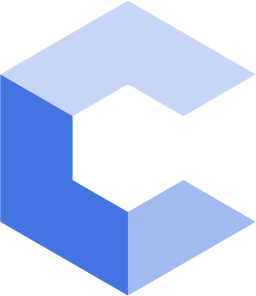 <code>codio</code></a></td><td align="center"><a href="../logos/codium.svg"> <code>codium</code></a></td><td align="center"><a href="../logos/codium-wordmark.svg"> <code>codium-wordmark</code></a></td></tr>
<tr><td align="center"><a href="../logos/commitizen.svg"> <code>commitizen</code></a></td><td align="center"><a href="../logos/compose.svg"> <code>compose</code></a></td><td align="center"><a href="../logos/composer.svg"> <code>composer</code></a></td><td align="center"><a href="../logos/conan-io.svg"> <code>conan-io</code></a></td><td align="center"><a href="../logos/concourse.svg"> <code>concourse</code></a></td><td align="center"><a href="../logos/conda.svg"> <code>conda</code></a></td></tr>
<tr><td align="center"><a href="../logos/consul.svg"> <code>consul</code></a></td><td align="center"><a href="../logos/coroot.svg"> <code>coroot</code></a></td><td align="center"><a href="../logos/cortex.svg">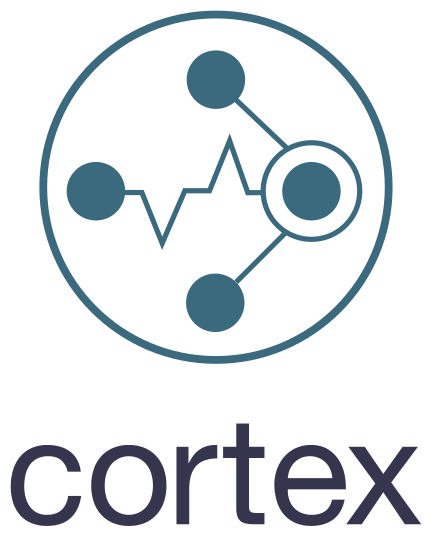 <code>cortex</code></a></td><td align="center"><a href="../logos/couler.svg">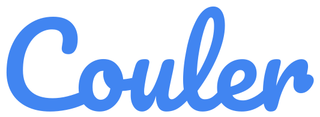 <code>couler</code></a></td><td align="center"><a href="../logos/coveralls.svg"> <code>coveralls</code></a></td><td align="center"><a href="../logos/coverity.svg"> <code>coverity</code></a></td></tr>
<tr><td align="center"><a href="../logos/crashlytics.svg"> <code>crashlytics</code></a></td><td align="center"><a href="../logos/crittercism.svg"> <code>crittercism</code></a></td><td align="center"><a href="../logos/cross-browser-testing.svg"> <code>cross-browser-testing</code></a></td><td align="center"><a href="../logos/crossbrowsertesting.svg"> <code>crossbrowsertesting</code></a></td><td align="center"><a href="../logos/crossplane.svg"> <code>crossplane</code></a></td><td align="center"><a href="../logos/crossplane-wordmark.svg"> <code>crossplane-wordmark</code></a></td></tr>
<tr><td align="center"><a href="../logos/crucible.svg"> <code>crucible</code></a></td><td align="center"><a href="../logos/cucumber.svg"> <code>cucumber</code></a></td><td align="center"><a href="../logos/curl.svg"> <code>curl</code></a></td><td align="center"><a href="../logos/cursor.svg">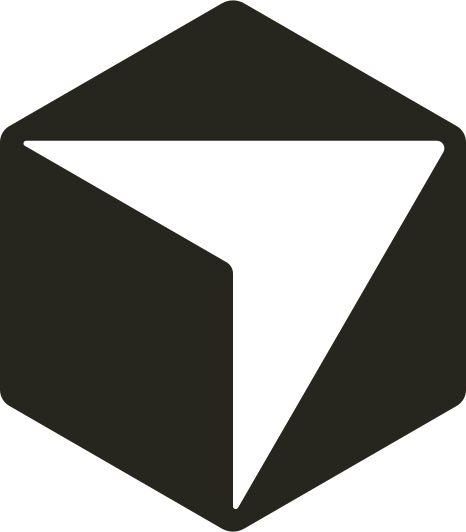 <code>cursor</code></a></td><td align="center"><a href="../logos/cursor-wordmark.svg">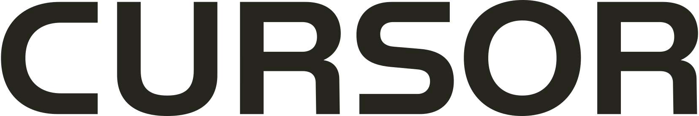 <code>cursor-wordmark</code></a></td><td align="center"><a href="../logos/cyclops.svg">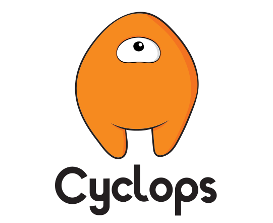 <code>cyclops</code></a></td></tr>
<tr><td align="center"><a href="../logos/cypress.svg">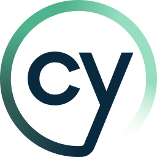 <code>cypress</code></a></td><td align="center"><a href="../logos/cypress-wordmark.svg"> <code>cypress-wordmark</code></a></td><td align="center"><a href="../logos/dalec.svg"> <code>dalec</code></a></td><td align="center"><a href="../logos/dapr.svg">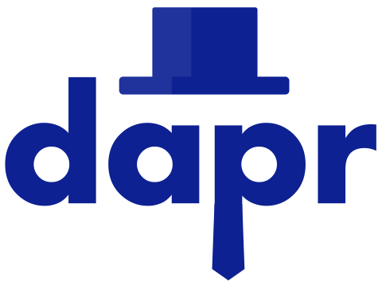 <code>dapr</code></a></td><td align="center"><a href="../logos/dat.svg"> <code>dat</code></a></td><td align="center"><a href="../logos/datadog.svg"> <code>datadog</code></a></td></tr>
<tr><td align="center"><a href="../logos/datadog-wordmark.svg"> <code>datadog-wordmark</code></a></td><td align="center"><a href="../logos/datagrip.svg"> <code>datagrip</code></a></td><td align="center"><a href="../logos/dataset.svg"> <code>dataset</code></a></td><td align="center"><a href="../logos/dataspell.svg"> <code>dataspell</code></a></td><td align="center"><a href="../logos/daytona.svg"> <code>daytona</code></a></td><td align="center"><a href="../logos/deno-deploy.svg"> <code>deno-deploy</code></a></td></tr>
<tr><td align="center"><a href="../logos/dependabot.svg"> <code>dependabot</code></a></td><td align="center"><a href="../logos/dependencyci.svg"> <code>dependencyci</code></a></td><td align="center"><a href="../logos/deploy.svg"> <code>deploy</code></a></td><td align="center"><a href="../logos/deploy-hub.svg">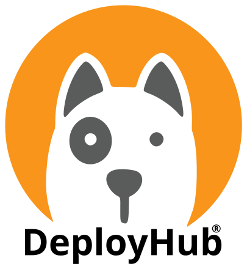 <code>deploy-hub</code></a></td><td align="center"><a href="../logos/deployhq.svg">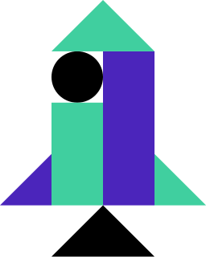 <code>deployhq</code></a></td><td align="center"><a href="../logos/deployhq-wordmark.svg"> <code>deployhq-wordmark</code></a></td></tr>
<tr><td align="center"><a href="../logos/deppbot.svg">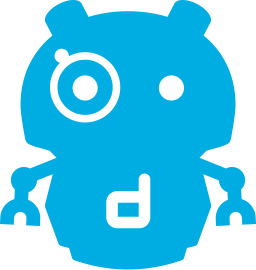 <code>deppbot</code></a></td><td align="center"><a href="../logos/devcycle.svg">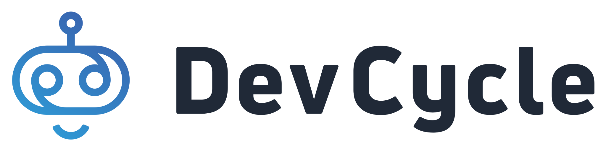 <code>devcycle</code></a></td><td align="center"><a href="../logos/devfile.svg">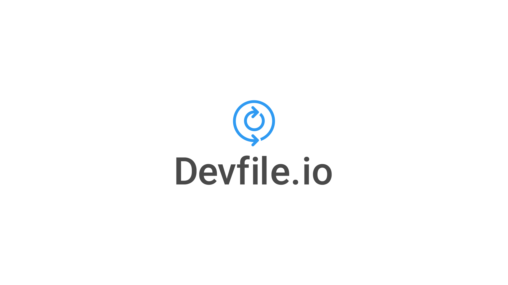 <code>devfile</code></a></td><td align="center"><a href="../logos/devspace.svg"> <code>devspace</code></a></td><td align="center"><a href="../logos/devstream.svg">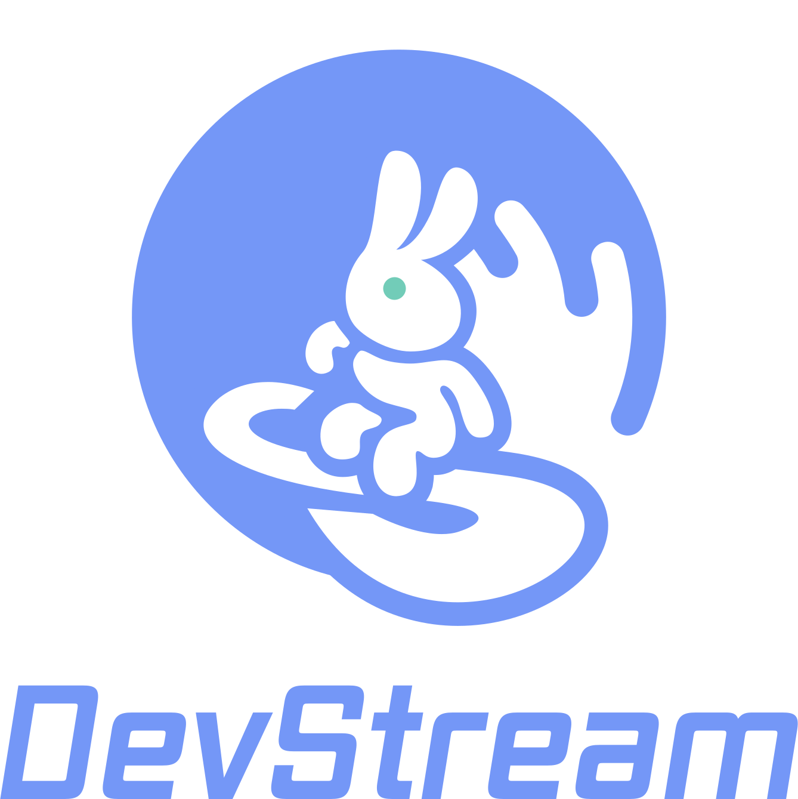 <code>devstream</code></a></td><td align="center"><a href="../logos/dimer.svg"> <code>dimer</code></a></td></tr>
<tr><td align="center"><a href="../logos/distelli.svg"> <code>distelli</code></a></td><td align="center"><a href="../logos/distrsh.svg"> <code>distrsh</code></a></td><td align="center"><a href="../logos/dockbit.svg"> <code>dockbit</code></a></td><td align="center"><a href="../logos/docker.svg"> <code>docker</code></a></td><td align="center"><a href="../logos/docker-compose.svg"> <code>docker-compose</code></a></td><td align="center"><a href="../logos/docker-engine.svg"> <code>docker-engine</code></a></td></tr>
<tr><td align="center"><a href="../logos/docker-mailserver.svg"> <code>docker-mailserver</code></a></td><td align="center"><a href="../logos/docker-moby.svg"> <code>docker-moby</code></a></td><td align="center"><a href="../logos/docker-volume-backup.svg"> <code>docker-volume-backup</code></a></td><td align="center"><a href="../logos/docker-wordmark.svg"> <code>docker-wordmark</code></a></td><td align="center"><a href="../logos/dockerizalo.svg"> <code>dockerizalo</code></a></td><td align="center"><a href="../logos/docusaurus.svg"> <code>docusaurus</code></a></td></tr>
<tr><td align="center"><a href="../logos/docusaurus-wordmark.svg"> <code>docusaurus-wordmark</code></a></td><td align="center"><a href="../logos/domain-monitor.svg"> <code>domain-monitor</code></a></td><td align="center"><a href="../logos/dotenv.svg"> <code>dotenv</code></a></td><td align="center"><a href="../logos/dovecot.svg"> <code>dovecot</code></a></td><td align="center"><a href="../logos/dragonfly.svg"> <code>dragonfly</code></a></td><td align="center"><a href="../logos/drawio.svg"> <code>drawio</code></a></td></tr>
<tr><td align="center"><a href="../logos/dreamfactory.svg"> <code>dreamfactory</code></a></td><td align="center"><a href="../logos/drone.svg"> <code>drone</code></a></td><td align="center"><a href="../logos/drone-wordmark.svg"> <code>drone-wordmark</code></a></td><td align="center"><a href="../logos/drools.svg"> <code>drools</code></a></td><td align="center"><a href="../logos/drools-wordmark.svg"> <code>drools-wordmark</code></a></td><td align="center"><a href="../logos/dxo2-by-broadcom.svg"> <code>dxo2-by-broadcom</code></a></td></tr>
<tr><td align="center"><a href="../logos/dynatrace.svg"> <code>dynatrace</code></a></td><td align="center"><a href="../logos/dynatrace-wordmark.svg"> <code>dynatrace-wordmark</code></a></td><td align="center"><a href="../logos/easeagent.svg"> <code>easeagent</code></a></td><td align="center"><a href="../logos/eclipse.svg"> <code>eclipse</code></a></td><td align="center"><a href="../logos/eclipse-wordmark.svg"> <code>eclipse-wordmark</code></a></td><td align="center"><a href="../logos/editorconfig.svg"> <code>editorconfig</code></a></td></tr>
<tr><td align="center"><a href="../logos/editorconfig-wordmark.svg"> <code>editorconfig-wordmark</code></a></td><td align="center"><a href="../logos/elastic-apm.svg"> <code>elastic-apm</code></a></td><td align="center"><a href="../logos/elastiflow-mermin.svg"> <code>elastiflow-mermin</code></a></td><td align="center"><a href="../logos/emacs.svg"> <code>emacs</code></a></td><td align="center"><a href="../logos/emacs-classic.svg"> <code>emacs-classic</code></a></td><td align="center"><a href="../logos/embedly.svg"> <code>embedly</code></a></td></tr>
<tr><td align="center"><a href="../logos/embedly-wordmark.svg"> <code>embedly-wordmark</code></a></td><td align="center"><a href="../logos/emmet.svg"> <code>emmet</code></a></td><td align="center"><a href="../logos/envoy.svg"> <code>envoy</code></a></td><td align="center"><a href="../logos/envoy-wordmark.svg"> <code>envoy-wordmark</code></a></td><td align="center"><a href="../logos/envoyer.svg"> <code>envoyer</code></a></td><td align="center"><a href="../logos/envoyproxy.svg"> <code>envoyproxy</code></a></td></tr>
<tr><td align="center"><a href="../logos/epsagon.svg"> <code>epsagon</code></a></td><td align="center"><a href="../logos/epsagon-wordmark.svg"> <code>epsagon-wordmark</code></a></td><td align="center"><a href="../logos/esbuild.svg"> <code>esbuild</code></a></td><td align="center"><a href="../logos/esdoc.svg"> <code>esdoc</code></a></td><td align="center"><a href="../logos/eslint.svg"> <code>eslint</code></a></td><td align="center"><a href="../logos/eslint-old.svg"> <code>eslint-old</code></a></td></tr>
<tr><td align="center"><a href="../logos/eslint-wordmark.svg"> <code>eslint-wordmark</code></a></td><td align="center"><a href="../logos/etcd.svg"> <code>etcd</code></a></td><td align="center"><a href="../logos/eventsentry.svg"> <code>eventsentry</code></a></td><td align="center"><a href="../logos/fabric.svg"> <code>fabric</code></a></td><td align="center"><a href="../logos/fabric-io.svg"> <code>fabric-io</code></a></td><td align="center"><a href="../logos/fabric8-kubernetes-client.svg"> <code>fabric8-kubernetes-client</code></a></td></tr>
<tr><td align="center"><a href="../logos/faker.svg"> <code>faker</code></a></td><td align="center"><a href="../logos/falcon.svg"> <code>falcon</code></a></td><td align="center"><a href="../logos/fastlane.svg"> <code>fastlane</code></a></td><td align="center"><a href="../logos/featurehub.svg"> <code>featurehub</code></a></td><td align="center"><a href="../logos/flagger.svg"> <code>flagger</code></a></td><td align="center"><a href="../logos/flagsmith.svg"> <code>flagsmith</code></a></td></tr>
<tr><td align="center"><a href="../logos/flipt.svg"> <code>flipt</code></a></td><td align="center"><a href="../logos/floodio.svg"> <code>floodio</code></a></td><td align="center"><a href="../logos/flow.svg"> <code>flow</code></a></td><td align="center"><a href="../logos/flowmill.svg"> <code>flowmill</code></a></td><td align="center"><a href="../logos/fogbugz.svg"> <code>fogbugz</code></a></td><td align="center"><a href="../logos/fogbugz-wordmark.svg"> <code>fogbugz-wordmark</code></a></td></tr>
<tr><td align="center"><a href="../logos/fonio.svg"> <code>fonio</code></a></td><td align="center"><a href="../logos/foreman.svg"> <code>foreman</code></a></td><td align="center"><a href="../logos/foresight.svg"> <code>foresight</code></a></td><td align="center"><a href="../logos/forest.svg"> <code>forest</code></a></td><td align="center"><a href="../logos/forestadmin.svg"> <code>forestadmin</code></a></td><td align="center"><a href="../logos/forestadmin-wordmark.svg"> <code>forestadmin-wordmark</code></a></td></tr>
<tr><td align="center"><a href="../logos/forever.svg"> <code>forever</code></a></td><td align="center"><a href="../logos/formkeep.svg"> <code>formkeep</code></a></td><td align="center"><a href="../logos/formkeep-wordmark.svg"> <code>formkeep-wordmark</code></a></td><td align="center"><a href="../logos/fortio.svg"> <code>fortio</code></a></td><td align="center"><a href="../logos/gaugeio.svg"> <code>gaugeio</code></a></td><td align="center"><a href="../logos/gefyra.svg"> <code>gefyra</code></a></td></tr>
<tr><td align="center"><a href="../logos/ghostty.svg"> <code>ghostty</code></a></td><td align="center"><a href="../logos/ghostty-wordmark.svg"> <code>ghostty-wordmark</code></a></td><td align="center"><a href="../logos/git.svg"> <code>git</code></a></td><td align="center"><a href="../logos/git-extensions.svg"> <code>git-extensions</code></a></td><td align="center"><a href="../logos/git-for-windows.svg"> <code>git-for-windows</code></a></td><td align="center"><a href="../logos/git-lfs.svg"> <code>git-lfs</code></a></td></tr>
<tr><td align="center"><a href="../logos/git-pages.svg"> <code>git-pages</code></a></td><td align="center"><a href="../logos/git-scm.svg"> <code>git-scm</code></a></td><td align="center"><a href="../logos/git-scm-wordmark.svg"> <code>git-scm-wordmark</code></a></td><td align="center"><a href="../logos/git-tower.svg"> <code>git-tower</code></a></td><td align="center"><a href="../logos/git-tower-wordmark.svg"> <code>git-tower-wordmark</code></a></td><td align="center"><a href="../logos/git-wordmark.svg"> <code>git-wordmark</code></a></td></tr>
<tr><td align="center"><a href="../logos/gitboard.svg"> <code>gitboard</code></a></td><td align="center"><a href="../logos/gitbook.svg"> <code>gitbook</code></a></td><td align="center"><a href="../logos/gitbook-wordmark.svg"> <code>gitbook-wordmark</code></a></td><td align="center"><a href="../logos/gitea.svg"> <code>gitea</code></a></td><td align="center"><a href="../logos/github.svg"> <code>github</code></a></td><td align="center"><a href="../logos/github-actions.svg"> <code>github-actions</code></a></td></tr>
<tr><td align="center"><a href="../logos/github-octocat.svg"> <code>github-octocat</code></a></td><td align="center"><a href="../logos/github-release-monitor.svg"> <code>github-release-monitor</code></a></td><td align="center"><a href="../logos/github-wordmark.svg"> <code>github-wordmark</code></a></td><td align="center"><a href="../logos/gitkraken.svg"> <code>gitkraken</code></a></td><td align="center"><a href="../logos/gitkraken-wordmark.svg"> <code>gitkraken-wordmark</code></a></td><td align="center"><a href="../logos/gitlab.svg"> <code>gitlab</code></a></td></tr>
<tr><td align="center"><a href="../logos/gitlab-wordmark.svg"> <code>gitlab-wordmark</code></a></td><td align="center"><a href="../logos/gitness.svg"> <code>gitness</code></a></td><td align="center"><a href="../logos/gitpod.svg"> <code>gitpod</code></a></td><td align="center"><a href="../logos/gitup.svg"> <code>gitup</code></a></td><td align="center"><a href="../logos/glint.svg"> <code>glint</code></a></td><td align="center"><a href="../logos/glitch.svg"> <code>glitch</code></a></td></tr>
<tr><td align="center"><a href="../logos/glitch-wordmark.svg"> <code>glitch-wordmark</code></a></td><td align="center"><a href="../logos/gocd.svg"> <code>gocd</code></a></td><td align="center"><a href="../logos/gocrane.svg"> <code>gocrane</code></a></td><td align="center"><a href="../logos/gofeatureflag.svg"> <code>gofeatureflag</code></a></td><td align="center"><a href="../logos/goland.svg"> <code>goland</code></a></td><td align="center"><a href="../logos/gomix.svg"> <code>gomix</code></a></td></tr>
<tr><td align="center"><a href="../logos/gonzo.svg"> <code>gonzo</code></a></td><td align="center"><a href="../logos/google-cloud-build.svg"> <code>google-cloud-build</code></a></td><td align="center"><a href="../logos/google-container-registry.svg"> <code>google-container-registry</code></a></td><td align="center"><a href="../logos/google-summer-of-code.svg"> <code>google-summer-of-code</code></a></td><td align="center"><a href="../logos/goose.svg"> <code>goose</code></a></td><td align="center"><a href="../logos/gradle.svg"> <code>gradle</code></a></td></tr>
<tr><td align="center"><a href="../logos/gradle-wordmark.svg"> <code>gradle-wordmark</code></a></td><td align="center"><a href="../logos/grafana.svg"> <code>grafana</code></a></td><td align="center"><a href="../logos/grafana-loki.svg"> <code>grafana-loki</code></a></td><td align="center"><a href="../logos/grafana-mimir.svg"> <code>grafana-mimir</code></a></td><td align="center"><a href="../logos/grafana-pyroscope.svg"> <code>grafana-pyroscope</code></a></td><td align="center"><a href="../logos/grafana-tempo.svg"> <code>grafana-tempo</code></a></td></tr>
<tr><td align="center"><a href="../logos/grafana-wordmark.svg"> <code>grafana-wordmark</code></a></td><td align="center"><a href="../logos/granulate.svg"> <code>granulate</code></a></td><td align="center"><a href="../logos/graylog.svg"> <code>graylog</code></a></td><td align="center"><a href="../logos/graylog-wordmark.svg"> <code>graylog-wordmark</code></a></td><td align="center"><a href="../logos/growth-book.svg"> <code>growth-book</code></a></td><td align="center"><a href="../logos/growth-book-wordmark.svg"> <code>growth-book-wordmark</code></a></td></tr>
<tr><td align="center"><a href="../logos/grunt.svg"> <code>grunt</code></a></td><td align="center"><a href="../logos/guacamole.svg"> <code>guacamole</code></a></td><td align="center"><a href="../logos/guance-cloud.svg"> <code>guance-cloud</code></a></td><td align="center"><a href="../logos/gulp.svg"> <code>gulp</code></a></td><td align="center"><a href="../logos/gunicorn.svg"> <code>gunicorn</code></a></td><td align="center"><a href="../logos/gunicorn-wordmark.svg"> <code>gunicorn-wordmark</code></a></td></tr>
<tr><td align="center"><a href="../logos/harness.svg"> <code>harness</code></a></td><td align="center"><a href="../logos/harness-wordmark.svg"> <code>harness-wordmark</code></a></td><td align="center"><a href="../logos/harrow.svg"> <code>harrow</code></a></td><td align="center"><a href="../logos/helios.svg"> <code>helios</code></a></td><td align="center"><a href="../logos/helm.svg"> <code>helm</code></a></td><td align="center"><a href="../logos/helmwave.svg"> <code>helmwave</code></a></td></tr>
<tr><td align="center"><a href="../logos/hertzbeat.svg"> <code>hertzbeat</code></a></td><td align="center"><a href="../logos/holmesgpt.svg"> <code>holmesgpt</code></a></td><td align="center"><a href="../logos/homebrew.svg"> <code>homebrew</code></a></td><td align="center"><a href="../logos/honeybadger.svg"> <code>honeybadger</code></a></td><td align="center"><a href="../logos/hoppscotch.svg"> <code>hoppscotch</code></a></td><td align="center"><a href="../logos/hosted-graphite.svg"> <code>hosted-graphite</code></a></td></tr>
<tr><td align="center"><a href="../logos/houndci.svg"> <code>houndci</code></a></td><td align="center"><a href="../logos/httpie.svg"> <code>httpie</code></a></td><td align="center"><a href="../logos/huatuo.svg"> <code>huatuo</code></a></td><td align="center"><a href="../logos/hubble-rgb.svg"> <code>hubble-rgb</code></a></td><td align="center"><a href="../logos/hyper.svg"> <code>hyper</code></a></td><td align="center"><a href="../logos/hyscale.svg"> <code>hyscale</code></a></td></tr>
<tr><td align="center"><a href="../logos/ibm-cloud-container-registry.svg"> <code>ibm-cloud-container-registry</code></a></td><td align="center"><a href="../logos/idem-project.svg"> <code>idem-project</code></a></td><td align="center"><a href="../logos/imagemin.svg"> <code>imagemin</code></a></td><td align="center"><a href="../logos/incident.svg"> <code>incident</code></a></td><td align="center"><a href="../logos/incident-wordmark.svg"> <code>incident-wordmark</code></a></td><td align="center"><a href="../logos/infer.svg"> <code>infer</code></a></td></tr>
<tr><td align="center"><a href="../logos/infracost.svg"> <code>infracost</code></a></td><td align="center"><a href="../logos/insomnia.svg"> <code>insomnia</code></a></td><td align="center"><a href="../logos/inspektor-gadget.svg"> <code>inspektor-gadget</code></a></td><td align="center"><a href="../logos/intellij-idea.svg"> <code>intellij-idea</code></a></td><td align="center"><a href="../logos/irondb.svg"> <code>irondb</code></a></td><td align="center"><a href="../logos/itopia.svg"> <code>itopia</code></a></td></tr>
<tr><td align="center"><a href="../logos/j-frog-artifactory.svg"> <code>j-frog-artifactory</code></a></td><td align="center"><a href="../logos/jasmine.svg"> <code>jasmine</code></a></td><td align="center"><a href="../logos/jasmine-wordmark.svg"> <code>jasmine-wordmark</code></a></td><td align="center"><a href="../logos/jenkins.svg"> <code>jenkins</code></a></td><td align="center"><a href="../logos/jenkins-wordmark.svg"> <code>jenkins-wordmark</code></a></td><td align="center"><a href="../logos/jenkins-x.svg"> <code>jenkins-x</code></a></td></tr>
<tr><td align="center"><a href="../logos/jest.svg"> <code>jest</code></a></td><td align="center"><a href="../logos/jetbrains.svg"> <code>jetbrains</code></a></td><td align="center"><a href="../logos/jetbrains-fleet.svg"> <code>jetbrains-fleet</code></a></td><td align="center"><a href="../logos/jetbrains-space.svg"> <code>jetbrains-space</code></a></td><td align="center"><a href="../logos/jetbrains-space-wordmark.svg"> <code>jetbrains-space-wordmark</code></a></td><td align="center"><a href="../logos/jetbrains-wordmark.svg"> <code>jetbrains-wordmark</code></a></td></tr>
<tr><td align="center"><a href="../logos/jfrog.svg"> <code>jfrog</code></a></td><td align="center"><a href="../logos/jreleaser.svg"> <code>jreleaser</code></a></td><td align="center"><a href="../logos/jsbin.svg"> <code>jsbin</code></a></td><td align="center"><a href="../logos/jscs.svg"> <code>jscs</code></a></td><td align="center"><a href="../logos/jsdom.svg"> <code>jsdom</code></a></td><td align="center"><a href="../logos/jsfiddle.svg"> <code>jsfiddle</code></a></td></tr>
<tr><td align="center"><a href="../logos/jsfiddle-wordmark.svg"> <code>jsfiddle-wordmark</code></a></td><td align="center"><a href="../logos/jspm.svg"> <code>jspm</code></a></td><td align="center"><a href="../logos/jsr.svg"> <code>jsr</code></a></td><td align="center"><a href="../logos/k-inv.svg"> <code>k-inv</code></a></td><td align="center"><a href="../logos/k6.svg"> <code>k6</code></a></td><td align="center"><a href="../logos/k8sgpt.svg"> <code>k8sgpt</code></a></td></tr>
<tr><td align="center"><a href="../logos/kagent.svg"> <code>kagent</code></a></td><td align="center"><a href="../logos/kairos.svg"> <code>kairos</code></a></td><td align="center"><a href="../logos/kallithea.svg"> <code>kallithea</code></a></td><td align="center"><a href="../logos/kaniko.svg"> <code>kaniko</code></a></td><td align="center"><a href="../logos/kapeta.svg"> <code>kapeta</code></a></td><td align="center"><a href="../logos/kapitan.svg"> <code>kapitan</code></a></td></tr>
<tr><td align="center"><a href="../logos/karma.svg"> <code>karma</code></a></td><td align="center"><a href="../logos/karpenter.svg"> <code>karpenter</code></a></td><td align="center"><a href="../logos/katalon.svg"> <code>katalon</code></a></td><td align="center"><a href="../logos/katalon-wordmark.svg"> <code>katalon-wordmark</code></a></td><td align="center"><a href="../logos/kcl.svg"> <code>kcl</code></a></td><td align="center"><a href="../logos/keep.svg"> <code>keep</code></a></td></tr>
<tr><td align="center"><a href="../logos/kepler.svg"> <code>kepler</code></a></td><td align="center"><a href="../logos/keploy.svg"> <code>keploy</code></a></td><td align="center"><a href="../logos/keptn.svg"> <code>keptn</code></a></td><td align="center"><a href="../logos/keymetrics.svg"> <code>keymetrics</code></a></td><td align="center"><a href="../logos/kiali.svg"> <code>kiali</code></a></td><td align="center"><a href="../logos/kibana.svg"> <code>kibana</code></a></td></tr>
<tr><td align="center"><a href="../logos/kiosk.svg"> <code>kiosk</code></a></td><td align="center"><a href="../logos/kite-kubernetes.svg"> <code>kite-kubernetes</code></a></td><td align="center"><a href="../logos/kitematic.svg"> <code>kitematic</code></a></td><td align="center"><a href="../logos/kitops.svg"> <code>kitops</code></a></td><td align="center"><a href="../logos/kloudfuse.svg"> <code>kloudfuse</code></a></td><td align="center"><a href="../logos/ko.svg"> <code>ko</code></a></td></tr>
<tr><td align="center"><a href="../logos/kong.svg"> <code>kong</code></a></td><td align="center"><a href="../logos/kong-wordmark.svg"> <code>kong-wordmark</code></a></td><td align="center"><a href="../logos/konveyor.svg"> <code>konveyor</code></a></td><td align="center"><a href="../logos/kops.svg"> <code>kops</code></a></td><td align="center"><a href="../logos/kosko.svg"> <code>kosko</code></a></td><td align="center"><a href="../logos/kots.svg"> <code>kots</code></a></td></tr>
<tr><td align="center"><a href="../logos/kpt.svg"> <code>kpt</code></a></td><td align="center"><a href="../logos/kratix.svg"> <code>kratix</code></a></td><td align="center"><a href="../logos/krator.svg"> <code>krator</code></a></td><td align="center"><a href="../logos/krkn.svg"> <code>krkn</code></a></td><td align="center"><a href="../logos/kruize.svg"> <code>kruize</code></a></td><td align="center"><a href="../logos/kube-burner.svg"> <code>kube-burner</code></a></td></tr>
<tr><td align="center"><a href="../logos/kubean.svg"> <code>kubean</code></a></td><td align="center"><a href="../logos/kubecost.svg"> <code>kubecost</code></a></td><td align="center"><a href="../logos/kubectl-mcp-server.svg"> <code>kubectl-mcp-server</code></a></td><td align="center"><a href="../logos/kubedl.svg"> <code>kubedl</code></a></td><td align="center"><a href="../logos/kubefirst.svg"> <code>kubefirst</code></a></td><td align="center"><a href="../logos/kubefwd.svg"> <code>kubefwd</code></a></td></tr>
<tr><td align="center"><a href="../logos/kubeorbit.svg"> <code>kubeorbit</code></a></td><td align="center"><a href="../logos/kubereport.svg"> <code>kubereport</code></a></td><td align="center"><a href="../logos/kuberhealthy.svg"> <code>kuberhealthy</code></a></td><td align="center"><a href="../logos/kubernetes.svg"> <code>kubernetes</code></a></td><td align="center"><a href="../logos/kubernetes-dashboard.svg"> <code>kubernetes-dashboard</code></a></td><td align="center"><a href="../logos/kubernetes-wordmark.svg"> <code>kubernetes-wordmark</code></a></td></tr>
<tr><td align="center"><a href="../logos/kubeskoop.svg"> <code>kubeskoop</code></a></td><td align="center"><a href="../logos/kubevela.svg"> <code>kubevela</code></a></td><td align="center"><a href="../logos/kubevirt.svg"> <code>kubevirt</code></a></td><td align="center"><a href="../logos/kubevpn.svg"> <code>kubevpn</code></a></td><td align="center"><a href="../logos/kubezoo.svg"> <code>kubezoo</code></a></td><td align="center"><a href="../logos/kudo.svg"> <code>kudo</code></a></td></tr>
<tr><td align="center"><a href="../logos/kui.svg"> <code>kui</code></a></td><td align="center"><a href="../logos/kunobi.svg"> <code>kunobi</code></a></td><td align="center"><a href="../logos/kusionstack.svg"> <code>kusionstack</code></a></td><td align="center"><a href="../logos/kustomer.svg"> <code>kustomer</code></a></td><td align="center"><a href="../logos/lagoon.svg"> <code>lagoon</code></a></td><td align="center"><a href="../logos/launchdarkly.svg"> <code>launchdarkly</code></a></td></tr>
<tr><td align="center"><a href="../logos/launchkit.svg"> <code>launchkit</code></a></td><td align="center"><a href="../logos/lerna.svg"> <code>lerna</code></a></td><td align="center"><a href="../logos/librato.svg"> <code>librato</code></a></td><td align="center"><a href="../logos/librespeed.svg"> <code>librespeed</code></a></td><td align="center"><a href="../logos/lighthouse.svg"> <code>lighthouse</code></a></td><td align="center"><a href="../logos/lightstep.svg"> <code>lightstep</code></a></td></tr>
<tr><td align="center"><a href="../logos/lightstep-wordmark.svg"> <code>lightstep-wordmark</code></a></td><td align="center"><a href="../logos/lighttpd.svg"> <code>lighttpd</code></a></td><td align="center"><a href="../logos/lindb.svg"> <code>lindb</code></a></td><td align="center"><a href="../logos/linux-kit.svg"> <code>linux-kit</code></a></td><td align="center"><a href="../logos/linuxcontainers.svg"> <code>linuxcontainers</code></a></td><td align="center"><a href="../logos/liquibase.svg"> <code>liquibase</code></a></td></tr>
<tr><td align="center"><a href="../logos/loader.svg"> <code>loader</code></a></td><td align="center"><a href="../logos/logentries.svg"> <code>logentries</code></a></td><td align="center"><a href="../logos/loggie.svg"> <code>loggie</code></a></td><td align="center"><a href="../logos/logging-operator.svg"> <code>logging-operator</code></a></td><td align="center"><a href="../logos/loggly.svg"> <code>loggly</code></a></td><td align="center"><a href="../logos/loggly-wordmark.svg"> <code>loggly-wordmark</code></a></td></tr>
<tr><td align="center"><a href="../logos/logiq.svg"> <code>logiq</code></a></td><td align="center"><a href="../logos/logmatic.svg"> <code>logmatic</code></a></td><td align="center"><a href="../logos/logstash.svg"> <code>logstash</code></a></td><td align="center"><a href="../logos/logz-io.svg"> <code>logz-io</code></a></td><td align="center"><a href="../logos/m3.svg"> <code>m3</code></a></td><td align="center"><a href="../logos/maas.svg"> <code>maas</code></a></td></tr>
<tr><td align="center"><a href="../logos/mackerel.svg"> <code>mackerel</code></a></td><td align="center"><a href="../logos/madge.svg"> <code>madge</code></a></td><td align="center"><a href="../logos/maestro.svg"> <code>maestro</code></a></td><td align="center"><a href="../logos/maildeveloper.svg"> <code>maildeveloper</code></a></td><td align="center"><a href="../logos/manage-iq.svg"> <code>manage-iq</code></a></td><td align="center"><a href="../logos/manifoldjs.svg"> <code>manifoldjs</code></a></td></tr>
<tr><td align="center"><a href="../logos/manuscript.svg"> <code>manuscript</code></a></td><td align="center"><a href="../logos/maven.svg"> <code>maven</code></a></td><td align="center"><a href="../logos/mercurial.svg"> <code>mercurial</code></a></td><td align="center"><a href="../logos/mergify.svg"> <code>mergify</code></a></td><td align="center"><a href="../logos/mermaid.svg"> <code>mermaid</code></a></td><td align="center"><a href="../logos/meshinfra.svg"> <code>meshinfra</code></a></td></tr>
<tr><td align="center"><a href="../logos/metal3.svg"> <code>metal3</code></a></td><td align="center"><a href="../logos/mia-platform.svg"> <code>mia-platform</code></a></td><td align="center"><a href="../logos/microcks.svg"> <code>microcks</code></a></td><td align="center"><a href="../logos/micrometer.svg"> <code>micrometer</code></a></td><td align="center"><a href="../logos/mirrord.svg"> <code>mirrord</code></a></td><td align="center"><a href="../logos/mocha.svg"> <code>mocha</code></a></td></tr>
<tr><td align="center"><a href="../logos/modelpack.svg"> <code>modelpack</code></a></td><td align="center"><a href="../logos/modernizr.svg"> <code>modernizr</code></a></td><td align="center"><a href="../logos/monocle.svg"> <code>monocle</code></a></td><td align="center"><a href="../logos/monokle.svg"> <code>monokle</code></a></td><td align="center"><a href="../logos/mozilla-monitor.svg"> <code>mozilla-monitor</code></a></td><td align="center"><a href="../logos/mplat.svg"> <code>mplat</code></a></td></tr>
<tr><td align="center"><a href="../logos/mps.svg"> <code>mps</code></a></td><td align="center"><a href="../logos/mps-wordmark.svg"> <code>mps-wordmark</code></a></td><td align="center"><a href="../logos/msw.svg"> <code>msw</code></a></td><td align="center"><a href="../logos/neovim.svg"> <code>neovim</code></a></td><td align="center"><a href="../logos/netbeans.svg"> <code>netbeans</code></a></td><td align="center"><a href="../logos/netis.svg"> <code>netis</code></a></td></tr>
<tr><td align="center"><a href="../logos/netobserv.svg"> <code>netobserv</code></a></td><td align="center"><a href="../logos/netuitive.svg"> <code>netuitive</code></a></td><td align="center"><a href="../logos/new-relic.svg"> <code>new-relic</code></a></td><td align="center"><a href="../logos/new-relic-wordmark.svg"> <code>new-relic-wordmark</code></a></td><td align="center"><a href="../logos/nexclipper.svg"> <code>nexclipper</code></a></td><td align="center"><a href="../logos/nginx.svg"> <code>nginx</code></a></td></tr>
<tr><td align="center"><a href="../logos/nginx-wordmark.svg"> <code>nginx-wordmark</code></a></td><td align="center"><a href="../logos/ngrok.svg"> <code>ngrok</code></a></td><td align="center"><a href="../logos/nightingale.svg"> <code>nightingale</code></a></td><td align="center"><a href="../logos/nightwatch.svg"> <code>nightwatch</code></a></td><td align="center"><a href="../logos/nmstate.svg"> <code>nmstate</code></a></td><td align="center"><a href="../logos/nocalhost.svg"> <code>nocalhost</code></a></td></tr>
<tr><td align="center"><a href="../logos/nodebots.svg"> <code>nodebots</code></a></td><td align="center"><a href="../logos/nodemon.svg"> <code>nodemon</code></a></td><td align="center"><a href="../logos/nodesource.svg"> <code>nodesource</code></a></td><td align="center"><a href="../logos/npm.svg"> <code>npm</code></a></td><td align="center"><a href="../logos/npm-2.svg"> <code>npm-2</code></a></td><td align="center"><a href="../logos/npm-wordmark.svg"> <code>npm-wordmark</code></a></td></tr>
<tr><td align="center"><a href="../logos/nuclide.svg"> <code>nuclide</code></a></td><td align="center"><a href="../logos/nuget.svg"> <code>nuget</code></a></td><td align="center"><a href="../logos/nuget-wordmark.svg"> <code>nuget-wordmark</code></a></td><td align="center"><a href="../logos/nvm.svg"> <code>nvm</code></a></td><td align="center"><a href="../logos/nx.svg"> <code>nx</code></a></td><td align="center"><a href="../logos/oam.svg"> <code>oam</code></a></td></tr>
<tr><td align="center"><a href="../logos/octopus-deploy.svg"> <code>octopus-deploy</code></a></td><td align="center"><a href="../logos/okteto.svg"> <code>okteto</code></a></td><td align="center"><a href="../logos/omni.svg"> <code>omni</code></a></td><td align="center"><a href="../logos/omnistrate.svg"> <code>omnistrate</code></a></td><td align="center"><a href="../logos/opbeat.svg"> <code>opbeat</code></a></td><td align="center"><a href="../logos/open-tracing.svg"> <code>open-tracing</code></a></td></tr>
<tr><td align="center"><a href="../logos/openapi.svg"> <code>openapi</code></a></td><td align="center"><a href="../logos/openapi-wordmark.svg"> <code>openapi-wordmark</code></a></td><td align="center"><a href="../logos/openchoreo.svg"> <code>openchoreo</code></a></td><td align="center"><a href="../logos/opencores.svg"> <code>opencores</code></a></td><td align="center"><a href="../logos/openfeature.svg"> <code>openfeature</code></a></td><td align="center"><a href="../logos/opengitops.svg"> <code>opengitops</code></a></td></tr>
<tr><td align="center"><a href="../logos/openkruise.svg"> <code>openkruise</code></a></td><td align="center"><a href="../logos/openlit.svg"> <code>openlit</code></a></td><td align="center"><a href="../logos/openllmetry.svg"> <code>openllmetry</code></a></td><td align="center"><a href="../logos/openmetrics.svg"> <code>openmetrics</code></a></td><td align="center"><a href="../logos/openrun.svg"> <code>openrun</code></a></td><td align="center"><a href="../logos/openservicebrokerapi.svg"> <code>openservicebrokerapi</code></a></td></tr>
<tr><td align="center"><a href="../logos/opentelemetry.svg"> <code>opentelemetry</code></a></td><td align="center"><a href="../logos/opentelemetry-wordmark.svg"> <code>opentelemetry-wordmark</code></a></td><td align="center"><a href="../logos/opentsdb.svg"> <code>opentsdb</code></a></td><td align="center"><a href="../logos/openyurt.svg"> <code>openyurt</code></a></td><td align="center"><a href="../logos/operator-framework.svg"> <code>operator-framework</code></a></td><td align="center"><a href="../logos/opsani.svg"> <code>opsani</code></a></td></tr>
<tr><td align="center"><a href="../logos/opsee.svg"> <code>opsee</code></a></td><td align="center"><a href="../logos/opsgenie.svg"> <code>opsgenie</code></a></td><td align="center"><a href="../logos/opsmatic.svg"> <code>opsmatic</code></a></td><td align="center"><a href="../logos/ortelius.svg"> <code>ortelius</code></a></td><td align="center"><a href="../logos/otto.svg"> <code>otto</code></a></td><td align="center"><a href="../logos/oxc.svg"> <code>oxc</code></a></td></tr>
<tr><td align="center"><a href="../logos/oxc-dark.svg"> <code>oxc-dark</code></a></td><td align="center"><a href="../logos/oxc-icon-dark.svg"> <code>oxc-icon-dark</code></a></td><td align="center"><a href="../logos/oxc-wordmark.svg"> <code>oxc-wordmark</code></a></td><td align="center"><a href="../logos/ozone.svg"> <code>ozone</code></a></td><td align="center"><a href="../logos/packer.svg"> <code>packer</code></a></td><td align="center"><a href="../logos/pagerduty.svg"> <code>pagerduty</code></a></td></tr>
<tr><td align="center"><a href="../logos/pagerduty-wordmark.svg"> <code>pagerduty-wordmark</code></a></td><td align="center"><a href="../logos/pandora.svg"> <code>pandora</code></a></td><td align="center"><a href="../logos/papers-with-code.svg"> <code>papers-with-code</code></a></td><td align="center"><a href="../logos/parcel.svg"> <code>parcel</code></a></td><td align="center"><a href="../logos/parcel-wordmark.svg"> <code>parcel-wordmark</code></a></td><td align="center"><a href="../logos/percy.svg"> <code>percy</code></a></td></tr>
<tr><td align="center"><a href="../logos/percy-wordmark.svg"> <code>percy-wordmark</code></a></td><td align="center"><a href="../logos/perf-rocks.svg"> <code>perf-rocks</code></a></td><td align="center"><a href="../logos/perses.svg"> <code>perses</code></a></td><td align="center"><a href="../logos/phpstorm.svg"> <code>phpstorm</code></a></td><td align="center"><a href="../logos/pingdom.svg"> <code>pingdom</code></a></td><td align="center"><a href="../logos/pingy.svg"> <code>pingy</code></a></td></tr>
<tr><td align="center"><a href="../logos/pinpoint.svg"> <code>pinpoint</code></a></td><td align="center"><a href="../logos/pipecd.svg"> <code>pipecd</code></a></td><td align="center"><a href="../logos/pipedream.svg"> <code>pipedream</code></a></td><td align="center"><a href="../logos/pixie.svg"> <code>pixie</code></a></td><td align="center"><a href="../logos/pkg.svg"> <code>pkg</code></a></td><td align="center"><a href="../logos/plastic-scm.svg"> <code>plastic-scm</code></a></td></tr>
<tr><td align="center"><a href="../logos/platformio.svg"> <code>platformio</code></a></td><td align="center"><a href="../logos/playwright.svg"> <code>playwright</code></a></td><td align="center"><a href="../logos/pm2.svg"> <code>pm2</code></a></td><td align="center"><a href="../logos/pm2-wordmark.svg"> <code>pm2-wordmark</code></a></td><td align="center"><a href="../logos/pnpm.svg"> <code>pnpm</code></a></td><td align="center"><a href="../logos/podman-desktop.svg"> <code>podman-desktop</code></a></td></tr>
<tr><td align="center"><a href="../logos/portainer.svg"> <code>portainer</code></a></td><td align="center"><a href="../logos/porter-sh.svg"> <code>porter-sh</code></a></td><td align="center"><a href="../logos/postman.svg"> <code>postman</code></a></td><td align="center"><a href="../logos/postman-wordmark.svg"> <code>postman-wordmark</code></a></td><td align="center"><a href="../logos/powerful-seal.svg"> <code>powerful-seal</code></a></td><td align="center"><a href="../logos/prerender.svg"> <code>prerender</code></a></td></tr>
<tr><td align="center"><a href="../logos/prerender-wordmark.svg"> <code>prerender-wordmark</code></a></td><td align="center"><a href="../logos/prettier.svg"> <code>prettier</code></a></td><td align="center"><a href="../logos/projectsyn.svg"> <code>projectsyn</code></a></td><td align="center"><a href="../logos/prometheus.svg"> <code>prometheus</code></a></td><td align="center"><a href="../logos/protractor.svg"> <code>protractor</code></a></td><td align="center"><a href="../logos/pulumi.svg"> <code>pulumi</code></a></td></tr>
<tr><td align="center"><a href="../logos/pulumi-wordmark.svg"> <code>pulumi-wordmark</code></a></td><td align="center"><a href="../logos/puppet.svg"> <code>puppet</code></a></td><td align="center"><a href="../logos/puppet-wordmark.svg"> <code>puppet-wordmark</code></a></td><td align="center"><a href="../logos/puppeteer.svg"> <code>puppeteer</code></a></td><td align="center"><a href="../logos/pvy-code.svg"> <code>pvy-code</code></a></td><td align="center"><a href="../logos/pvy-code-wordmark.svg"> <code>pvy-code-wordmark</code></a></td></tr>
<tr><td align="center"><a href="../logos/pycharm.svg"> <code>pycharm</code></a></td><td align="center"><a href="../logos/pypi.svg"> <code>pypi</code></a></td><td align="center"><a href="../logos/pyup.svg"> <code>pyup</code></a></td><td align="center"><a href="../logos/quay.svg"> <code>quay</code></a></td><td align="center"><a href="../logos/radar.svg"> <code>radar</code></a></td><td align="center"><a href="../logos/radius.svg"> <code>radius</code></a></td></tr>
<tr><td align="center"><a href="../logos/raftt.svg"> <code>raftt</code></a></td><td align="center"><a href="../logos/raml.svg"> <code>raml</code></a></td><td align="center"><a href="../logos/rancher.svg"> <code>rancher</code></a></td><td align="center"><a href="../logos/rancher-wordmark.svg"> <code>rancher-wordmark</code></a></td><td align="center"><a href="../logos/razee.svg"> <code>razee</code></a></td><td align="center"><a href="../logos/rclone.svg"> <code>rclone</code></a></td></tr>
<tr><td align="center"><a href="../logos/rclone-wordmark.svg"> <code>rclone-wordmark</code></a></td><td align="center"><a href="../logos/refactor.svg"> <code>refactor</code></a></td><td align="center"><a href="../logos/release.svg"> <code>release</code></a></td><td align="center"><a href="../logos/renovatebot.svg"> <code>renovatebot</code></a></td><td align="center"><a href="../logos/replay.svg"> <code>replay</code></a></td><td align="center"><a href="../logos/replay-wordmark.svg"> <code>replay-wordmark</code></a></td></tr>
<tr><td align="center"><a href="../logos/replex.svg"> <code>replex</code></a></td><td align="center"><a href="../logos/replit.svg"> <code>replit</code></a></td><td align="center"><a href="../logos/replit-wordmark.svg"> <code>replit-wordmark</code></a></td><td align="center"><a href="../logos/rider.svg"> <code>rider</code></a></td><td align="center"><a href="../logos/rizhiyi.svg"> <code>rizhiyi</code></a></td><td align="center"><a href="../logos/rollbar.svg"> <code>rollbar</code></a></td></tr>
<tr><td align="center"><a href="../logos/rollbar-wordmark.svg"> <code>rollbar-wordmark</code></a></td><td align="center"><a href="../logos/rolldown.svg"> <code>rolldown</code></a></td><td align="center"><a href="../logos/rolldown-dark.svg"> <code>rolldown-dark</code></a></td><td align="center"><a href="../logos/rolldown-icon-dark.svg"> <code>rolldown-icon-dark</code></a></td><td align="center"><a href="../logos/rolldown-wordmark.svg"> <code>rolldown-wordmark</code></a></td><td align="center"><a href="../logos/rollupjs.svg"> <code>rollupjs</code></a></td></tr>
<tr><td align="center"><a href="../logos/rome.svg"> <code>rome</code></a></td><td align="center"><a href="../logos/rome-wordmark.svg"> <code>rome-wordmark</code></a></td><td align="center"><a href="../logos/ros.svg"> <code>ros</code></a></td><td align="center"><a href="../logos/rsbuild.svg"> <code>rsbuild</code></a></td><td align="center"><a href="../logos/rspack.svg"> <code>rspack</code></a></td><td align="center"><a href="../logos/rstudio.svg"> <code>rstudio</code></a></td></tr>
<tr><td align="center"><a href="../logos/rubocop.svg"> <code>rubocop</code></a></td><td align="center"><a href="../logos/rubygems.svg"> <code>rubygems</code></a></td><td align="center"><a href="../logos/rubymine.svg"> <code>rubymine</code></a></td><td align="center"><a href="../logos/run-above.svg"> <code>run-above</code></a></td><td align="center"><a href="../logos/runme-notebooks.svg"> <code>runme-notebooks</code></a></td><td align="center"><a href="../logos/runnable.svg"> <code>runnable</code></a></td></tr>
<tr><td align="center"><a href="../logos/runscope.svg"> <code>runscope</code></a></td><td align="center"><a href="../logos/rush.svg"> <code>rush</code></a></td><td align="center"><a href="../logos/rush-wordmark.svg"> <code>rush-wordmark</code></a></td><td align="center"><a href="../logos/saltstack.svg"> <code>saltstack</code></a></td><td align="center"><a href="../logos/saltstack-wordmark.svg"> <code>saltstack-wordmark</code></a></td><td align="center"><a href="../logos/saucelabs.svg"> <code>saucelabs</code></a></td></tr>
<tr><td align="center"><a href="../logos/saucelabs-wordmark.svg"> <code>saucelabs-wordmark</code></a></td><td align="center"><a href="../logos/score.svg"> <code>score</code></a></td><td align="center"><a href="../logos/screwdriver.svg"> <code>screwdriver</code></a></td><td align="center"><a href="../logos/sdc.svg"> <code>sdc</code></a></td><td align="center"><a href="../logos/sealer.svg"> <code>sealer</code></a></td><td align="center"><a href="../logos/selenium.svg"> <code>selenium</code></a></td></tr>
<tr><td align="center"><a href="../logos/semantic-release.svg"> <code>semantic-release</code></a></td><td align="center"><a href="../logos/semaphore.svg"> <code>semaphore</code></a></td><td align="center"><a href="../logos/semaphoreci.svg"> <code>semaphoreci</code></a></td><td align="center"><a href="../logos/semaphoreci-wordmark.svg"> <code>semaphoreci-wordmark</code></a></td><td align="center"><a href="../logos/sensu.svg"> <code>sensu</code></a></td><td align="center"><a href="../logos/sensu-wordmark.svg"> <code>sensu-wordmark</code></a></td></tr>
<tr><td align="center"><a href="../logos/sentry.svg"> <code>sentry</code></a></td><td align="center"><a href="../logos/sentry-wordmark.svg"> <code>sentry-wordmark</code></a></td><td align="center"><a href="../logos/servicecomb.svg"> <code>servicecomb</code></a></td><td align="center"><a href="../logos/serviceradar.svg"> <code>serviceradar</code></a></td><td align="center"><a href="../logos/shields.svg"> <code>shields</code></a></td><td align="center"><a href="../logos/shifu.svg"> <code>shifu</code></a></td></tr>
<tr><td align="center"><a href="../logos/shipit.svg"> <code>shipit</code></a></td><td align="center"><a href="../logos/shippable.svg"> <code>shippable</code></a></td><td align="center"><a href="../logos/shippable-wordmark.svg"> <code>shippable-wordmark</code></a></td><td align="center"><a href="../logos/shipwright.svg"> <code>shipwright</code></a></td><td align="center"><a href="../logos/sidekick.svg"> <code>sidekick</code></a></td><td align="center"><a href="../logos/sidekiq.svg"> <code>sidekiq</code></a></td></tr>
<tr><td align="center"><a href="../logos/sidekiq-wordmark.svg"> <code>sidekiq-wordmark</code></a></td><td align="center"><a href="../logos/siphon.svg"> <code>siphon</code></a></td><td align="center"><a href="../logos/skaffold.svg"> <code>skaffold</code></a></td><td align="center"><a href="../logos/skaffolder.svg"> <code>skaffolder</code></a></td><td align="center"><a href="../logos/skooner.svg"> <code>skooner</code></a></td><td align="center"><a href="../logos/sky-walking.svg"> <code>sky-walking</code></a></td></tr>
<tr><td align="center"><a href="../logos/skylight.svg"> <code>skylight</code></a></td><td align="center"><a href="../logos/slidev.svg"> <code>slidev</code></a></td><td align="center"><a href="../logos/snowpack.svg"> <code>snowpack</code></a></td><td align="center"><a href="../logos/sofastack-sofa-tracer.svg"> <code>sofastack-sofa-tracer</code></a></td><td align="center"><a href="../logos/solarwinds.svg"> <code>solarwinds</code></a></td><td align="center"><a href="../logos/sonarcloud.svg"> <code>sonarcloud</code></a></td></tr>
<tr><td align="center"><a href="../logos/sonarcloud-wordmark.svg"> <code>sonarcloud-wordmark</code></a></td><td align="center"><a href="../logos/sonarlint.svg"> <code>sonarlint</code></a></td><td align="center"><a href="../logos/sonarlint-wordmark.svg"> <code>sonarlint-wordmark</code></a></td><td align="center"><a href="../logos/sonarqube.svg"> <code>sonarqube</code></a></td><td align="center"><a href="../logos/sosivio.svg"> <code>sosivio</code></a></td><td align="center"><a href="../logos/sourcegraph.svg"> <code>sourcegraph</code></a></td></tr>
<tr><td align="center"><a href="../logos/sourcegraph-wordmark.svg"> <code>sourcegraph-wordmark</code></a></td><td align="center"><a href="../logos/sourcetrail.svg"> <code>sourcetrail</code></a></td><td align="center"><a href="../logos/sourcetree.svg"> <code>sourcetree</code></a></td><td align="center"><a href="../logos/speedcurve.svg"> <code>speedcurve</code></a></td><td align="center"><a href="../logos/spinnaker.svg"> <code>spinnaker</code></a></td><td align="center"><a href="../logos/splitio.svg"> <code>splitio</code></a></td></tr>
<tr><td align="center"><a href="../logos/splunk.svg"> <code>splunk</code></a></td><td align="center"><a href="../logos/spot.svg"> <code>spot</code></a></td><td align="center"><a href="../logos/spring-cloud-sleuth.svg"> <code>spring-cloud-sleuth</code></a></td><td align="center"><a href="../logos/squash.svg"> <code>squash</code></a></td><td align="center"><a href="../logos/stackblitz.svg"> <code>stackblitz</code></a></td><td align="center"><a href="../logos/stackblitz-wordmark.svg"> <code>stackblitz-wordmark</code></a></td></tr>
<tr><td align="center"><a href="../logos/stacker.svg"> <code>stacker</code></a></td><td align="center"><a href="../logos/stackstate.svg"> <code>stackstate</code></a></td><td align="center"><a href="../logos/stash.svg"> <code>stash</code></a></td><td align="center"><a href="../logos/statuspage.svg"> <code>statuspage</code></a></td><td align="center"><a href="../logos/stdlib.svg"> <code>stdlib</code></a></td><td align="center"><a href="../logos/steadybit.svg"> <code>steadybit</code></a></td></tr>
<tr><td align="center"><a href="../logos/stepsize.svg"> <code>stepsize</code></a></td><td align="center"><a href="../logos/stepsize-wordmark.svg"> <code>stepsize-wordmark</code></a></td><td align="center"><a href="../logos/stetho.svg"> <code>stetho</code></a></td><td align="center"><a href="../logos/stigg.svg"> <code>stigg</code></a></td><td align="center"><a href="../logos/stigg-wordmark.svg"> <code>stigg-wordmark</code></a></td><td align="center"><a href="../logos/stoplight.svg"> <code>stoplight</code></a></td></tr>
<tr><td align="center"><a href="../logos/storybook.svg"> <code>storybook</code></a></td><td align="center"><a href="../logos/storybook-wordmark.svg"> <code>storybook-wordmark</code></a></td><td align="center"><a href="../logos/strider.svg"> <code>strider</code></a></td><td align="center"><a href="../logos/styleci.svg"> <code>styleci</code></a></td><td align="center"><a href="../logos/stylefmt.svg"> <code>stylefmt</code></a></td><td align="center"><a href="../logos/stylelint.svg"> <code>stylelint</code></a></td></tr>
<tr><td align="center"><a href="../logos/sublimemerge.svg"> <code>sublimemerge</code></a></td><td align="center"><a href="../logos/sublimetext.svg"> <code>sublimetext</code></a></td><td align="center"><a href="../logos/sublimetext-wordmark.svg"> <code>sublimetext-wordmark</code></a></td><td align="center"><a href="../logos/subversion.svg"> <code>subversion</code></a></td><td align="center"><a href="../logos/svgomg.svg"> <code>svgomg</code></a></td><td align="center"><a href="../logos/swagger.svg"> <code>swagger</code></a></td></tr>
<tr><td align="center"><a href="../logos/swc.svg"> <code>swc</code></a></td><td align="center"><a href="../logos/swiftype.svg"> <code>swiftype</code></a></td><td align="center"><a href="../logos/swimm.svg"> <code>swimm</code></a></td><td align="center"><a href="../logos/sws.svg"> <code>sws</code></a></td><td align="center"><a href="../logos/sysdig.svg"> <code>sysdig</code></a></td><td align="center"><a href="../logos/sysdig-wordmark.svg"> <code>sysdig-wordmark</code></a></td></tr>
<tr><td align="center"><a href="../logos/tabby.svg"> <code>tabby</code></a></td><td align="center"><a href="../logos/tanka.svg"> <code>tanka</code></a></td><td align="center"><a href="../logos/tastejs.svg"> <code>tastejs</code></a></td><td align="center"><a href="../logos/teamcity.svg"> <code>teamcity</code></a></td><td align="center"><a href="../logos/tekton.svg"> <code>tekton</code></a></td><td align="center"><a href="../logos/telemetryhub-scoutapm.svg"> <code>telemetryhub-scoutapm</code></a></td></tr>
<tr><td align="center"><a href="../logos/telepresence.svg"> <code>telepresence</code></a></td><td align="center"><a href="../logos/tencent-cloud-log-service.svg"> <code>tencent-cloud-log-service</code></a></td><td align="center"><a href="../logos/terminal.svg"> <code>terminal</code></a></td><td align="center"><a href="../logos/terraform.svg"> <code>terraform</code></a></td><td align="center"><a href="../logos/terraform-wordmark.svg"> <code>terraform-wordmark</code></a></td><td align="center"><a href="../logos/terranetes.svg"> <code>terranetes</code></a></td></tr>
<tr><td align="center"><a href="../logos/terser.svg"> <code>terser</code></a></td><td align="center"><a href="../logos/terser-wordmark.svg"> <code>terser-wordmark</code></a></td><td align="center"><a href="../logos/testcafe.svg"> <code>testcafe</code></a></td><td align="center"><a href="../logos/testing-library.svg"> <code>testing-library</code></a></td><td align="center"><a href="../logos/testkube.svg"> <code>testkube</code></a></td><td align="center"><a href="../logos/testlodge.svg"> <code>testlodge</code></a></td></tr>
<tr><td align="center"><a href="../logos/testmunk.svg"> <code>testmunk</code></a></td><td align="center"><a href="../logos/thimble.svg"> <code>thimble</code></a></td><td align="center"><a href="../logos/tilt.svg"> <code>tilt</code></a></td><td align="center"><a href="../logos/tingyun.svg"> <code>tingyun</code></a></td><td align="center"><a href="../logos/tinkerbell.svg"> <code>tinkerbell</code></a></td><td align="center"><a href="../logos/todomvc.svg"> <code>todomvc</code></a></td></tr>
<tr><td align="center"><a href="../logos/tomcat.svg"> <code>tomcat</code></a></td><td align="center"><a href="../logos/traas-bos.svg"> <code>traas-bos</code></a></td><td align="center"><a href="../logos/traas-has.svg"> <code>traas-has</code></a></td><td align="center"><a href="../logos/trac.svg"> <code>trac</code></a></td><td align="center"><a href="../logos/trace.svg"> <code>trace</code></a></td><td align="center"><a href="../logos/tracetest.svg"> <code>tracetest</code></a></td></tr>
<tr><td align="center"><a href="../logos/traefik.svg"> <code>traefik</code></a></td><td align="center"><a href="../logos/travis-ci.svg"> <code>travis-ci</code></a></td><td align="center"><a href="../logos/travis-ci-monochrome.svg"> <code>travis-ci-monochrome</code></a></td><td align="center"><a href="../logos/travis-ci-wordmark.svg"> <code>travis-ci-wordmark</code></a></td><td align="center"><a href="../logos/trickster.svg"> <code>trickster</code></a></td><td align="center"><a href="../logos/trink.svg"> <code>trink</code></a></td></tr>
<tr><td align="center"><a href="../logos/turbonomic.svg"> <code>turbonomic</code></a></td><td align="center"><a href="../logos/turbopack.svg"> <code>turbopack</code></a></td><td align="center"><a href="../logos/turbopack-wordmark.svg"> <code>turbopack-wordmark</code></a></td><td align="center"><a href="../logos/turborepo.svg"> <code>turborepo</code></a></td><td align="center"><a href="../logos/turborepo-wordmark.svg"> <code>turborepo-wordmark</code></a></td><td align="center"><a href="../logos/undertow.svg"> <code>undertow</code></a></td></tr>
<tr><td align="center"><a href="../logos/unitjs.svg"> <code>unitjs</code></a></td><td align="center"><a href="../logos/unleash.svg"> <code>unleash</code></a></td><td align="center"><a href="../logos/unryo.svg"> <code>unryo</code></a></td><td align="center"><a href="../logos/updatecli.svg"> <code>updatecli</code></a></td><td align="center"><a href="../logos/uptime-monitor.svg"> <code>uptime-monitor</code></a></td><td align="center"><a href="../logos/uv.svg"> <code>uv</code></a></td></tr>
<tr><td align="center"><a href="../logos/uwsgi.svg"> <code>uwsgi</code></a></td><td align="center"><a href="../logos/vagrant.svg"> <code>vagrant</code></a></td><td align="center"><a href="../logos/vagrant-wordmark.svg"> <code>vagrant-wordmark</code></a></td><td align="center"><a href="../logos/vamp.svg"> <code>vamp</code></a></td><td align="center"><a href="../logos/vector.svg"> <code>vector</code></a></td><td align="center"><a href="../logos/vector-timber.svg"> <code>vector-timber</code></a></td></tr>
<tr><td align="center"><a href="../logos/verdaccio.svg"> <code>verdaccio</code></a></td><td align="center"><a href="../logos/verdaccio-wordmark.svg"> <code>verdaccio-wordmark</code></a></td><td align="center"><a href="../logos/victorops.svg"> <code>victorops</code></a></td><td align="center"><a href="../logos/victorops-wordmark.svg"> <code>victorops-wordmark</code></a></td><td align="center"><a href="../logos/vim.svg"> <code>vim</code></a></td><td align="center"><a href="../logos/vim-wordmark.svg"> <code>vim-wordmark</code></a></td></tr>
<tr><td align="center"><a href="../logos/virtasant.svg"> <code>virtasant</code></a></td><td align="center"><a href="../logos/visual-studio.svg"> <code>visual-studio</code></a></td><td align="center"><a href="../logos/visual-studio-code.svg"> <code>visual-studio-code</code></a></td><td align="center"><a href="../logos/visual-studio-code-wordmark.svg"> <code>visual-studio-code-wordmark</code></a></td><td align="center"><a href="../logos/vite.svg"> <code>vite</code></a></td><td align="center"><a href="../logos/vite-dark.svg"> <code>vite-dark</code></a></td></tr>
<tr><td align="center"><a href="../logos/vite-icon-dark.svg"> <code>vite-icon-dark</code></a></td><td align="center"><a href="../logos/vite-wordmark.svg"> <code>vite-wordmark</code></a></td><td align="center"><a href="../logos/vitejs.svg"> <code>vitejs</code></a></td><td align="center"><a href="../logos/vitest.svg"> <code>vitest</code></a></td><td align="center"><a href="../logos/vito-deploy.svg"> <code>vito-deploy</code></a></td><td align="center"><a href="../logos/vmware-application-catalog.svg"> <code>vmware-application-catalog</code></a></td></tr>
<tr><td align="center"><a href="../logos/vmware-aria-operations-for-applications.svg"> <code>vmware-aria-operations-for-applications</code></a></td><td align="center"><a href="../logos/vmware-vsphere.svg"> <code>vmware-vsphere</code></a></td><td align="center"><a href="../logos/volar.svg"> <code>volar</code></a></td><td align="center"><a href="../logos/volcano-engine-apmplus.svg"> <code>volcano-engine-apmplus</code></a></td><td align="center"><a href="../logos/volcano-engine-vmp.svg"> <code>volcano-engine-vmp</code></a></td><td align="center"><a href="../logos/volta.svg"> <code>volta</code></a></td></tr>
<tr><td align="center"><a href="../logos/vscodek8stools.svg"> <code>vscodek8stools</code></a></td><td align="center"><a href="../logos/wakatime.svg"> <code>wakatime</code></a></td><td align="center"><a href="../logos/warp.svg"> <code>warp</code></a></td><td align="center"><a href="../logos/watchman.svg"> <code>watchman</code></a></td><td align="center"><a href="../logos/waypoint.svg"> <code>waypoint</code></a></td><td align="center"><a href="../logos/waypoint-wordmark.svg"> <code>waypoint-wordmark</code></a></td></tr>
<tr><td align="center"><a href="../logos/wayscript.svg"> <code>wayscript</code></a></td><td align="center"><a href="../logos/wayscript-wordmark.svg"> <code>wayscript-wordmark</code></a></td><td align="center"><a href="../logos/webdriverio.svg"> <code>webdriverio</code></a></td><td align="center"><a href="../logos/webdriverio-wordmark.svg"> <code>webdriverio-wordmark</code></a></td><td align="center"><a href="../logos/webhint.svg"> <code>webhint</code></a></td><td align="center"><a href="../logos/webhint-wordmark.svg"> <code>webhint-wordmark</code></a></td></tr>
<tr><td align="center"><a href="../logos/webpack.svg"> <code>webpack</code></a></td><td align="center"><a href="../logos/webstorm.svg"> <code>webstorm</code></a></td><td align="center"><a href="../logos/wercker.svg"> <code>wercker</code></a></td><td align="center"><a href="../logos/werf.svg"> <code>werf</code></a></td><td align="center"><a href="../logos/whats-up-docker.svg"> <code>whats-up-docker</code></a></td><td align="center"><a href="../logos/wildfly.svg"> <code>wildfly</code></a></td></tr>
<tr><td align="center"><a href="../logos/windsurf.svg"> <code>windsurf</code></a></td><td align="center"><a href="../logos/windsurf-wordmark.svg"> <code>windsurf-wordmark</code></a></td><td align="center"><a href="../logos/wmr.svg"> <code>wmr</code></a></td><td align="center"><a href="../logos/world-monitor.svg"> <code>world-monitor</code></a></td><td align="center"><a href="../logos/x-ray-goggles.svg"> <code>x-ray-goggles</code></a></td><td align="center"><a href="../logos/xampp.svg"> <code>xampp</code></a></td></tr>
<tr><td align="center"><a href="../logos/xcode.svg"> <code>xcode</code></a></td><td align="center"><a href="../logos/xl-deploy.svg"> <code>xl-deploy</code></a></td><td align="center"><a href="../logos/xoap-plain.svg"> <code>xoap-plain</code></a></td><td align="center"><a href="../logos/xray-for-jira.svg"> <code>xray-for-jira</code></a></td><td align="center"><a href="../logos/xregistry.svg"> <code>xregistry</code></a></td><td align="center"><a href="../logos/yarn.svg"> <code>yarn</code></a></td></tr>
<tr><td align="center"><a href="../logos/yeoman.svg"> <code>yeoman</code></a></td><td align="center"><a href="../logos/yeoman-wordmark.svg"> <code>yeoman-wordmark</code></a></td><td align="center"><a href="../logos/yoke.svg"> <code>yoke</code></a></td><td align="center"><a href="../logos/zabbix.svg"> <code>zabbix</code></a></td><td align="center"><a href="../logos/zabbix-wordmark.svg"> <code>zabbix-wordmark</code></a></td><td align="center"><a href="../logos/zed.svg"> <code>zed</code></a></td></tr>
<tr><td align="center"><a href="../logos/zipkin.svg"> <code>zipkin</code></a></td><td align="center"><a href="../logos/zot.svg"> <code>zot</code></a></td><td align="center"><a href="../logos/zsh.svg"> <code>zsh</code></a></td><td align="center"><a href="../logos/zuul.svg"> <code>zuul</code></a></td></tr>
</table>

[⬅️ Back to the full catalog](../README.md)
