# ⚛️ Frameworks & UI Libraries (498)

[⬅️ Back to the full catalog](../README.md) · [🖼️ Browse & download on the website](https://logos.lndev.me/)
<table>
<tr><td align="center"><a href="../logos/adonisjs.svg"> <code>adonisjs</code></a></td><td align="center"><a href="../logos/adonisjs-wordmark.svg"> <code>adonisjs-wordmark</code></a></td><td align="center"><a href="../logos/afterjs.svg"> <code>afterjs</code></a></td><td align="center"><a href="../logos/afterjs-wordmark.svg"> <code>afterjs-wordmark</code></a></td><td align="center"><a href="../logos/ahooks.svg"> <code>ahooks</code></a></td><td align="center"><a href="../logos/ahooks-wordmark.svg"> <code>ahooks-wordmark</code></a></td></tr>
<tr><td align="center"><a href="../logos/akka.svg"> <code>akka</code></a></td><td align="center"><a href="../logos/alertifyjs.svg"> <code>alertifyjs</code></a></td><td align="center"><a href="../logos/alertifyjs-wordmark.svg"> <code>alertifyjs-wordmark</code></a></td><td align="center"><a href="../logos/alpinejs.svg"> <code>alpinejs</code></a></td><td align="center"><a href="../logos/alpinejs-wordmark.svg"> <code>alpinejs-wordmark</code></a></td><td align="center"><a href="../logos/amberframework.svg">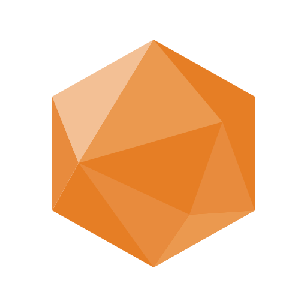 <code>amberframework</code></a></td></tr>
<tr><td align="center"><a href="../logos/ampersand.svg">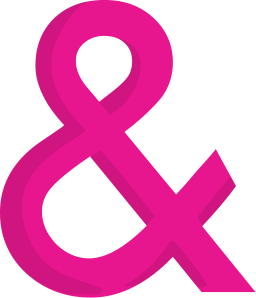 <code>ampersand</code></a></td><td align="center"><a href="../logos/analog.svg"> <code>analog</code></a></td><td align="center"><a href="../logos/angular.svg">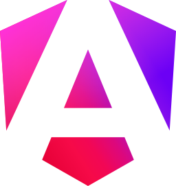 <code>angular</code></a></td><td align="center"><a href="../logos/angular-wordmark.svg"> <code>angular-wordmark</code></a></td><td align="center"><a href="../logos/anime-js.svg"> <code>anime-js</code></a></td><td align="center"><a href="../logos/ant-design.svg"> <code>ant-design</code></a></td></tr>
<tr><td align="center"><a href="../logos/apache-brpc.svg">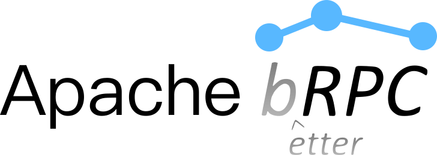 <code>apache-brpc</code></a></td><td align="center"><a href="../logos/apache-thrift.svg"> <code>apache-thrift</code></a></td><td align="center"><a href="../logos/apollo-graphql.svg"> <code>apollo-graphql</code></a></td><td align="center"><a href="../logos/apollo-graphql-wordmark.svg"> <code>apollo-graphql-wordmark</code></a></td><td align="center"><a href="../logos/apollostack.svg"> <code>apollostack</code></a></td><td align="center"><a href="../logos/ark-ui.svg">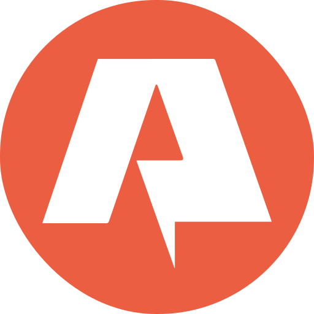 <code>ark-ui</code></a></td></tr>
<tr><td align="center"><a href="../logos/astro.svg"> <code>astro</code></a></td><td align="center"><a href="../logos/astro-wordmark.svg"> <code>astro-wordmark</code></a></td><td align="center"><a href="../logos/asyncjs.svg"> <code>asyncjs</code></a></td><td align="center"><a href="../logos/asyncjs-wordmark.svg"> <code>asyncjs-wordmark</code></a></td><td align="center"><a href="../logos/atomicojs.svg"> <code>atomicojs</code></a></td><td align="center"><a href="../logos/aurelia.svg"> <code>aurelia</code></a></td></tr>
<tr><td align="center"><a href="../logos/autoprefixer.svg"> <code>autoprefixer</code></a></td><td align="center"><a href="../logos/avajs.svg"> <code>avajs</code></a></td><td align="center"><a href="../logos/avaloniaui.svg"> <code>avaloniaui</code></a></td><td align="center"><a href="../logos/avro.svg"> <code>avro</code></a></td><td align="center"><a href="../logos/axios.svg"> <code>axios</code></a></td><td align="center"><a href="../logos/axios-wordmark.svg"> <code>axios-wordmark</code></a></td></tr>
<tr><td align="center"><a href="../logos/babeljs.svg"> <code>babeljs</code></a></td><td align="center"><a href="../logos/babylon-js.svg"> <code>babylon-js</code></a></td><td align="center"><a href="../logos/backbone.svg"> <code>backbone</code></a></td><td align="center"><a href="../logos/backbone-wordmark.svg"> <code>backbone-wordmark</code></a></td><td align="center"><a href="../logos/backbonejs.svg"> <code>backbonejs</code></a></td><td align="center"><a href="../logos/backbonejs-wordmark.svg"> <code>backbonejs-wordmark</code></a></td></tr>
<tr><td align="center"><a href="../logos/base-ui.svg"> <code>base-ui</code></a></td><td align="center"><a href="../logos/bem.svg"> <code>bem</code></a></td><td align="center"><a href="../logos/bem-2.svg"> <code>bem-2</code></a></td><td align="center"><a href="../logos/blitzjs.svg">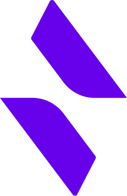 <code>blitzjs</code></a></td><td align="center"><a href="../logos/blitzjs-wordmark.svg"> <code>blitzjs-wordmark</code></a></td><td align="center"><a href="../logos/blockus.svg"> <code>blockus</code></a></td></tr>
<tr><td align="center"><a href="../logos/blueprint.svg">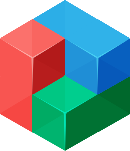 <code>blueprint</code></a></td><td align="center"><a href="../logos/blueprintjs.svg"> <code>blueprintjs</code></a></td><td align="center"><a href="../logos/blueprintjs-wordmark.svg"> <code>blueprintjs-wordmark</code></a></td><td align="center"><a href="../logos/bootstrap.svg"> <code>bootstrap</code></a></td><td align="center"><a href="../logos/borg-ui.svg"> <code>borg-ui</code></a></td><td align="center"><a href="../logos/bourbon.svg"> <code>bourbon</code></a></td></tr>
<tr><td align="center"><a href="../logos/broccolijs.svg"> <code>broccolijs</code></a></td><td align="center"><a href="../logos/broccolijs-wordmark.svg"> <code>broccolijs-wordmark</code></a></td><td align="center"><a href="../logos/bulma.svg">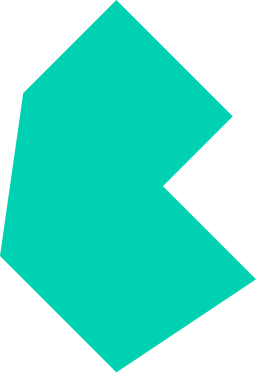 <code>bulma</code></a></td><td align="center"><a href="../logos/cakephp.svg"> <code>cakephp</code></a></td><td align="center"><a href="../logos/cakephp-wordmark.svg"> <code>cakephp-wordmark</code></a></td><td align="center"><a href="../logos/canjs.svg"> <code>canjs</code></a></td></tr>
<tr><td align="center"><a href="../logos/capacitorjs.svg"> <code>capacitorjs</code></a></td><td align="center"><a href="../logos/capacitorjs-wordmark.svg"> <code>capacitorjs-wordmark</code></a></td><td align="center"><a href="../logos/celluloid.svg"> <code>celluloid</code></a></td><td align="center"><a href="../logos/chaijs.svg"> <code>chaijs</code></a></td><td align="center"><a href="../logos/chaijs-wordmark.svg"> <code>chaijs-wordmark</code></a></td><td align="center"><a href="../logos/chakra-ui.svg">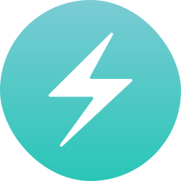 <code>chakra-ui</code></a></td></tr>
<tr><td align="center"><a href="../logos/chakra-ui-wordmark.svg"> <code>chakra-ui-wordmark</code></a></td><td align="center"><a href="../logos/chartjs.svg">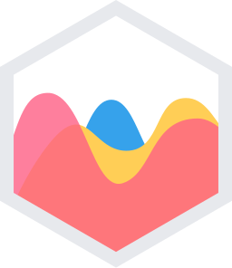 <code>chartjs</code></a></td><td align="center"><a href="../logos/chedraui.svg"> <code>chedraui</code></a></td><td align="center"><a href="../logos/cinder.svg"> <code>cinder</code></a></td><td align="center"><a href="../logos/claudiajs.svg"> <code>claudiajs</code></a></td><td align="center"><a href="../logos/claudiajs-wordmark.svg"> <code>claudiajs-wordmark</code></a></td></tr>
<tr><td align="center"><a href="../logos/clipboardjs.svg"> <code>clipboardjs</code></a></td><td align="center"><a href="../logos/clipboardjs-wordmark.svg"> <code>clipboardjs-wordmark</code></a></td><td align="center"><a href="../logos/cloudwego.svg">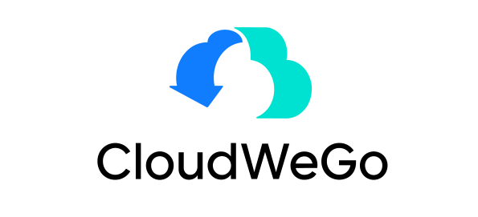 <code>cloudwego</code></a></td><td align="center"><a href="../logos/codeceptjs.svg"> <code>codeceptjs</code></a></td><td align="center"><a href="../logos/codeigniter.svg"> <code>codeigniter</code></a></td><td align="center"><a href="../logos/codeigniter-wordmark.svg"> <code>codeigniter-wordmark</code></a></td></tr>
<tr><td align="center"><a href="../logos/comfyui.svg"> <code>comfyui</code></a></td><td align="center"><a href="../logos/compass.svg"> <code>compass</code></a></td><td align="center"><a href="../logos/component.svg"> <code>component</code></a></td><td align="center"><a href="../logos/componentkit.svg"> <code>componentkit</code></a></td><td align="center"><a href="../logos/compose-multiplatform.svg">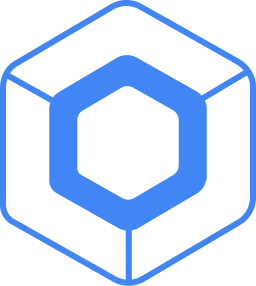 <code>compose-multiplatform</code></a></td><td align="center"><a href="../logos/conduit-open-webui.svg">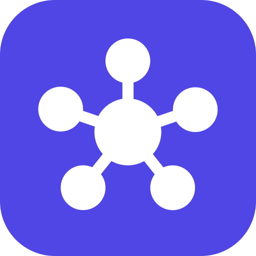 <code>conduit-open-webui</code></a></td></tr>
<tr><td align="center"><a href="../logos/connect-rpc.svg">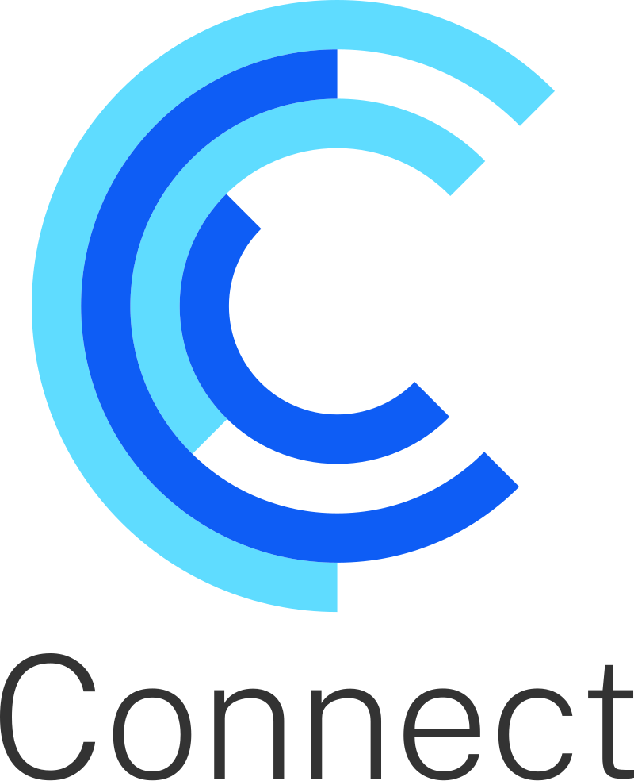 <code>connect-rpc</code></a></td><td align="center"><a href="../logos/cordova.svg"> <code>cordova</code></a></td><td align="center"><a href="../logos/cosmicjs.svg"> <code>cosmicjs</code></a></td><td align="center"><a href="../logos/cosmicjs-wordmark.svg"> <code>cosmicjs-wordmark</code></a></td><td align="center"><a href="../logos/create-react-app.svg"> <code>create-react-app</code></a></td><td align="center"><a href="../logos/createjs.svg"> <code>createjs</code></a></td></tr>
<tr><td align="center"><a href="../logos/crowdsec-web-ui.svg"> <code>crowdsec-web-ui</code></a></td><td align="center"><a href="../logos/cssnext.svg"> <code>cssnext</code></a></td><td align="center"><a href="../logos/cyclejs.svg"> <code>cyclejs</code></a></td><td align="center"><a href="../logos/cytoscape-js.svg"> <code>cytoscape-js</code></a></td><td align="center"><a href="../logos/d3.svg"> <code>d3</code></a></td><td align="center"><a href="../logos/d3js-wordmark.svg"> <code>d3js-wordmark</code></a></td></tr>
<tr><td align="center"><a href="../logos/daisyui.svg"> <code>daisyui</code></a></td><td align="center"><a href="../logos/daisyui-wordmark.svg"> <code>daisyui-wordmark</code></a></td><td align="center"><a href="../logos/derby.svg"> <code>derby</code></a></td><td align="center"><a href="../logos/discord-js.svg"> <code>discord-js</code></a></td><td align="center"><a href="../logos/django.svg"> <code>django</code></a></td><td align="center"><a href="../logos/django-wordmark.svg"> <code>django-wordmark</code></a></td></tr>
<tr><td align="center"><a href="../logos/dojo.svg"> <code>dojo</code></a></td><td align="center"><a href="../logos/dojo-toolkit.svg"> <code>dojo-toolkit</code></a></td><td align="center"><a href="../logos/dojo-toolkit-wordmark.svg"> <code>dojo-toolkit-wordmark</code></a></td><td align="center"><a href="../logos/dojo-wordmark.svg"> <code>dojo-wordmark</code></a></td><td align="center"><a href="../logos/dropzone.svg"> <code>dropzone</code></a></td><td align="center"><a href="../logos/dubbo.svg"> <code>dubbo</code></a></td></tr>
<tr><td align="center"><a href="../logos/easy-ngo.svg"> <code>easy-ngo</code></a></td><td align="center"><a href="../logos/effect.svg"> <code>effect</code></a></td><td align="center"><a href="../logos/effect-ts.svg"> <code>effect-ts</code></a></td><td align="center"><a href="../logos/effector.svg">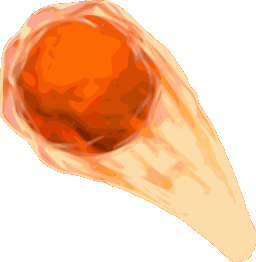 <code>effector</code></a></td><td align="center"><a href="../logos/eggjs.svg"> <code>eggjs</code></a></td><td align="center"><a href="../logos/eggjs-wordmark.svg"> <code>eggjs-wordmark</code></a></td></tr>
<tr><td align="center"><a href="../logos/ejs.svg"> <code>ejs</code></a></td><td align="center"><a href="../logos/electron.svg"> <code>electron</code></a></td><td align="center"><a href="../logos/electronjs.svg"> <code>electronjs</code></a></td><td align="center"><a href="../logos/electronjs-wordmark.svg"> <code>electronjs-wordmark</code></a></td><td align="center"><a href="../logos/element.svg"> <code>element</code></a></td><td align="center"><a href="../logos/elemental-ui.svg">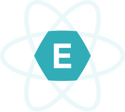 <code>elemental-ui</code></a></td></tr>
<tr><td align="center"><a href="../logos/eleventy.svg"> <code>eleventy</code></a></td><td align="center"><a href="../logos/elysiajs.svg">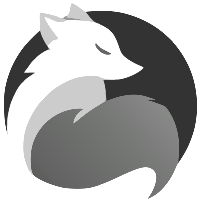 <code>elysiajs</code></a></td><td align="center"><a href="../logos/ember.svg"> <code>ember</code></a></td><td align="center"><a href="../logos/ember-tomster.svg"> <code>ember-tomster</code></a></td><td align="center"><a href="../logos/emberjs.svg"> <code>emberjs</code></a></td><td align="center"><a href="../logos/emberjs-wordmark.svg"> <code>emberjs-wordmark</code></a></td></tr>
<tr><td align="center"><a href="../logos/emulatorjs.svg">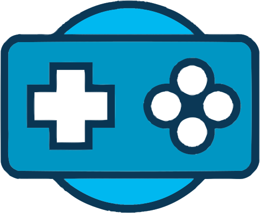 <code>emulatorjs</code></a></td><td align="center"><a href="../logos/enact.svg"> <code>enact</code></a></td><td align="center"><a href="../logos/enyo.svg"> <code>enyo</code></a></td><td align="center"><a href="../logos/eta.svg"> <code>eta</code></a></td><td align="center"><a href="../logos/eta-wordmark.svg"> <code>eta-wordmark</code></a></td><td align="center"><a href="../logos/evergreen.svg"> <code>evergreen</code></a></td></tr>
<tr><td align="center"><a href="../logos/evergreen-wordmark.svg"> <code>evergreen-wordmark</code></a></td><td align="center"><a href="../logos/exome.svg"> <code>exome</code></a></td><td align="center"><a href="../logos/expo.svg"> <code>expo</code></a></td><td align="center"><a href="../logos/expo-wordmark.svg"> <code>expo-wordmark</code></a></td><td align="center"><a href="../logos/exponent.svg"> <code>exponent</code></a></td><td align="center"><a href="../logos/express.svg"> <code>express</code></a></td></tr>
<tr><td align="center"><a href="../logos/expressjs-wordmark.svg"> <code>expressjs-wordmark</code></a></td><td align="center"><a href="../logos/falcor.svg"> <code>falcor</code></a></td><td align="center"><a href="../logos/famous.svg"> <code>famous</code></a></td><td align="center"><a href="../logos/fastapi.svg"> <code>fastapi</code></a></td><td align="center"><a href="../logos/fastapi-wordmark.svg"> <code>fastapi-wordmark</code></a></td><td align="center"><a href="../logos/fastify.svg"> <code>fastify</code></a></td></tr>
<tr><td align="center"><a href="../logos/feathersjs.svg"> <code>feathersjs</code></a></td><td align="center"><a href="../logos/flask.svg"> <code>flask</code></a></td><td align="center"><a href="../logos/flat-ui.svg"> <code>flat-ui</code></a></td><td align="center"><a href="../logos/flight.svg"> <code>flight</code></a></td><td align="center"><a href="../logos/flowbite.svg"> <code>flowbite</code></a></td><td align="center"><a href="../logos/flutter.svg"> <code>flutter</code></a></td></tr>
<tr><td align="center"><a href="../logos/flux.svg"> <code>flux</code></a></td><td align="center"><a href="../logos/fluxxor.svg">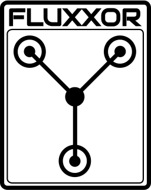 <code>fluxxor</code></a></td><td align="center"><a href="../logos/flyjs.svg"> <code>flyjs</code></a></td><td align="center"><a href="../logos/foundation.svg"> <code>foundation</code></a></td><td align="center"><a href="../logos/framework7.svg"> <code>framework7</code></a></td><td align="center"><a href="../logos/framework7-wordmark.svg"> <code>framework7-wordmark</code></a></td></tr>
<tr><td align="center"><a href="../logos/fresh.svg"> <code>fresh</code></a></td><td align="center"><a href="../logos/gatsby.svg"> <code>gatsby</code></a></td><td align="center"><a href="../logos/gatsbyjs.svg"> <code>gatsbyjs</code></a></td><td align="center"><a href="../logos/gatsbyjs-wordmark.svg"> <code>gatsbyjs-wordmark</code></a></td><td align="center"><a href="../logos/gin.svg"> <code>gin</code></a></td><td align="center"><a href="../logos/gioui.svg"> <code>gioui</code></a></td></tr>
<tr><td align="center"><a href="../logos/github-postgresjs.svg"> <code>github-postgresjs</code></a></td><td align="center"><a href="../logos/glamorous.svg"> <code>glamorous</code></a></td><td align="center"><a href="../logos/glamorous-wordmark.svg"> <code>glamorous-wordmark</code></a></td><td align="center"><a href="../logos/glimmerjs.svg"> <code>glimmerjs</code></a></td><td align="center"><a href="../logos/go-zero.svg">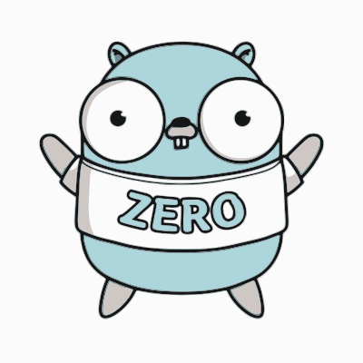 <code>go-zero</code></a></td><td align="center"><a href="../logos/godot.svg"> <code>godot</code></a></td></tr>
<tr><td align="center"><a href="../logos/godot-wordmark.svg"> <code>godot-wordmark</code></a></td><td align="center"><a href="../logos/gofr.svg">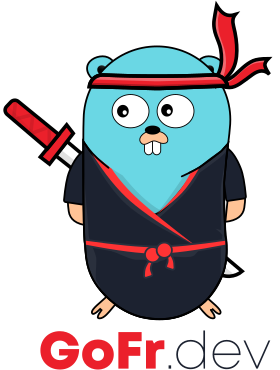 <code>gofr</code></a></td><td align="center"><a href="../logos/grails.svg">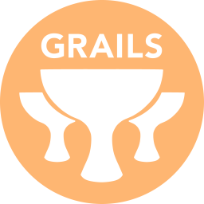 <code>grails</code></a></td><td align="center"><a href="../logos/grape.svg"> <code>grape</code></a></td><td align="center"><a href="../logos/graphene.svg"> <code>graphene</code></a></td><td align="center"><a href="../logos/graphql.svg"> <code>graphql</code></a></td></tr>
<tr><td align="center"><a href="../logos/graphql-wordmark.svg"> <code>graphql-wordmark</code></a></td><td align="center"><a href="../logos/greensock.svg">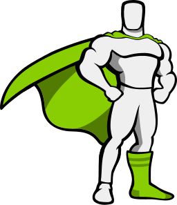 <code>greensock</code></a></td><td align="center"><a href="../logos/greensock-wordmark.svg"> <code>greensock-wordmark</code></a></td><td align="center"><a href="../logos/gridsome.svg"> <code>gridsome</code></a></td><td align="center"><a href="../logos/gridsome-wordmark.svg"> <code>gridsome-wordmark</code></a></td><td align="center"><a href="../logos/grommet.svg">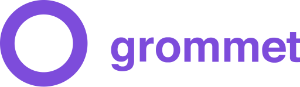 <code>grommet</code></a></td></tr>
<tr><td align="center"><a href="../logos/grpc.svg">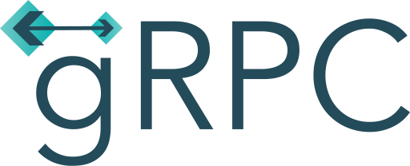 <code>grpc</code></a></td><td align="center"><a href="../logos/gruntjs.svg"> <code>gruntjs</code></a></td><td align="center"><a href="../logos/gruntjs-wordmark.svg"> <code>gruntjs-wordmark</code></a></td><td align="center"><a href="../logos/guess-js.svg"> <code>guess-js</code></a></td><td align="center"><a href="../logos/guess-js-wordmark.svg"> <code>guess-js-wordmark</code></a></td><td align="center"><a href="../logos/gulpjs.svg"> <code>gulpjs</code></a></td></tr>
<tr><td align="center"><a href="../logos/gulpjs-wordmark.svg"> <code>gulpjs-wordmark</code></a></td><td align="center"><a href="../logos/gwt.svg"> <code>gwt</code></a></td><td align="center"><a href="../logos/haml.svg">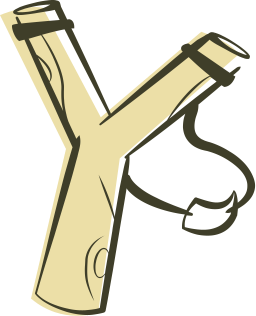 <code>haml</code></a></td><td align="center"><a href="../logos/hanami.svg"> <code>hanami</code></a></td><td align="center"><a href="../logos/handlebars.svg"> <code>handlebars</code></a></td><td align="center"><a href="../logos/handlebarsjs.svg"> <code>handlebarsjs</code></a></td></tr>
<tr><td align="center"><a href="../logos/hapi.svg">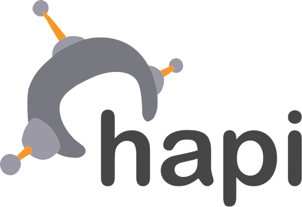 <code>hapi</code></a></td><td align="center"><a href="../logos/hapijs.svg">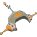 <code>hapijs</code></a></td><td align="center"><a href="../logos/hapijs-wordmark.svg">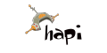 <code>hapijs-wordmark</code></a></td><td align="center"><a href="../logos/haxl.svg">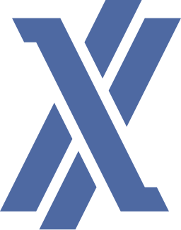 <code>haxl</code></a></td><td align="center"><a href="../logos/headlessui.svg"> <code>headlessui</code></a></td><td align="center"><a href="../logos/headlessui-wordmark.svg"> <code>headlessui-wordmark</code></a></td></tr>
<tr><td align="center"><a href="../logos/heroui.svg"> <code>heroui</code></a></td><td align="center"><a href="../logos/hexo.svg"> <code>hexo</code></a></td><td align="center"><a href="../logos/highcharts.svg">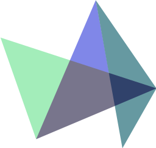 <code>highcharts</code></a></td><td align="center"><a href="../logos/hono.svg"> <code>hono</code></a></td><td align="center"><a href="../logos/hoodie.svg"> <code>hoodie</code></a></td><td align="center"><a href="../logos/hookstate.svg"> <code>hookstate</code></a></td></tr>
<tr><td align="center"><a href="../logos/horizon.svg"> <code>horizon</code></a></td><td align="center"><a href="../logos/htmx.svg"> <code>htmx</code></a></td><td align="center"><a href="../logos/htmx-wordmark.svg"> <code>htmx-wordmark</code></a></td><td align="center"><a href="../logos/hugo.svg"> <code>hugo</code></a></td><td align="center"><a href="../logos/hyperapp.svg"> <code>hyperapp</code></a></td><td align="center"><a href="../logos/i18next.svg"> <code>i18next</code></a></td></tr>
<tr><td align="center"><a href="../logos/i18next-wordmark.svg"> <code>i18next-wordmark</code></a></td><td align="center"><a href="../logos/immer.svg"> <code>immer</code></a></td><td align="center"><a href="../logos/immer-wordmark.svg"> <code>immer-wordmark</code></a></td><td align="center"><a href="../logos/immutable.svg"> <code>immutable</code></a></td><td align="center"><a href="../logos/inferno.svg"> <code>inferno</code></a></td><td align="center"><a href="../logos/infernojs.svg"> <code>infernojs</code></a></td></tr>
<tr><td align="center"><a href="../logos/infernojs-wordmark.svg"> <code>infernojs-wordmark</code></a></td><td align="center"><a href="../logos/ink.svg">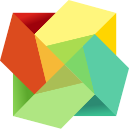 <code>ink</code></a></td><td align="center"><a href="../logos/interactjs.svg"> <code>interactjs</code></a></td><td align="center"><a href="../logos/ionic.svg"> <code>ionic</code></a></td><td align="center"><a href="../logos/ionic-wordmark.svg">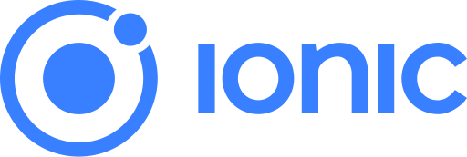 <code>ionic-wordmark</code></a></td><td align="center"><a href="../logos/ivy-framework.svg"> <code>ivy-framework</code></a></td></tr>
<tr><td align="center"><a href="../logos/jade.svg">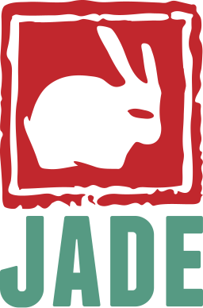 <code>jade</code></a></td><td align="center"><a href="../logos/jekyll.svg"> <code>jekyll</code></a></td><td align="center"><a href="../logos/jhipster.svg"> <code>jhipster</code></a></td><td align="center"><a href="../logos/jhipster-wordmark.svg"> <code>jhipster-wordmark</code></a></td><td align="center"><a href="../logos/jotai.svg"> <code>jotai</code></a></td><td align="center"><a href="../logos/jquery.svg"> <code>jquery</code></a></td></tr>
<tr><td align="center"><a href="../logos/jquery-mobile.svg"> <code>jquery-mobile</code></a></td><td align="center"><a href="../logos/jss.svg"> <code>jss</code></a></td><td align="center"><a href="../logos/kemal.svg"> <code>kemal</code></a></td><td align="center"><a href="../logos/kibo-ui.svg"> <code>kibo-ui</code></a></td><td align="center"><a href="../logos/knex-js.svg"> <code>knex-js</code></a></td><td align="center"><a href="../logos/knockout.svg"> <code>knockout</code></a></td></tr>
<tr><td align="center"><a href="../logos/koa.svg"> <code>koa</code></a></td><td align="center"><a href="../logos/koajs.svg"> <code>koajs</code></a></td><td align="center"><a href="../logos/koajs-wordmark.svg"> <code>koajs-wordmark</code></a></td><td align="center"><a href="../logos/kokonut-ui.svg">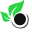 <code>kokonut-ui</code></a></td><td align="center"><a href="../logos/kore.svg"> <code>kore</code></a></td><td align="center"><a href="../logos/koreio.svg">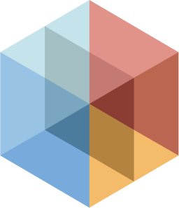 <code>koreio</code></a></td></tr>
<tr><td align="center"><a href="../logos/kraken.svg"> <code>kraken</code></a></td><td align="center"><a href="../logos/krakenjs.svg"> <code>krakenjs</code></a></td><td align="center"><a href="../logos/kratos.svg">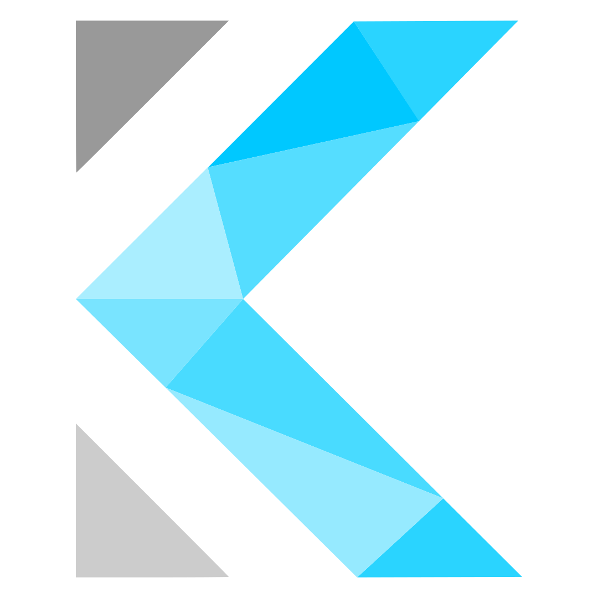 <code>kratos</code></a></td><td align="center"><a href="../logos/ktor.svg">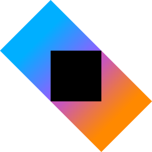 <code>ktor</code></a></td><td align="center"><a href="../logos/ktor-wordmark.svg">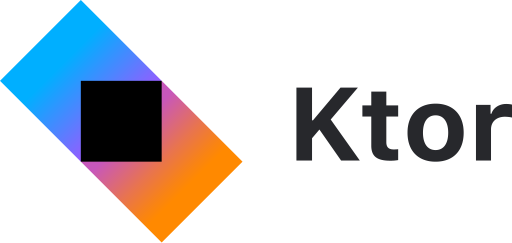 <code>ktor-wordmark</code></a></td><td align="center"><a href="../logos/laravel.svg"> <code>laravel</code></a></td></tr>
<tr><td align="center"><a href="../logos/laravel-wordmark.svg"> <code>laravel-wordmark</code></a></td><td align="center"><a href="../logos/leaflet.svg"> <code>leaflet</code></a></td><td align="center"><a href="../logos/leafletjs.svg"> <code>leafletjs</code></a></td><td align="center"><a href="../logos/leafletjs-wordmark.svg"> <code>leafletjs-wordmark</code></a></td><td align="center"><a href="../logos/less.svg"> <code>less</code></a></td><td align="center"><a href="../logos/lesscss.svg"> <code>lesscss</code></a></td></tr>
<tr><td align="center"><a href="../logos/lesscss-wordmark.svg"> <code>lesscss-wordmark</code></a></td><td align="center"><a href="../logos/lexical.svg"> <code>lexical</code></a></td><td align="center"><a href="../logos/lexical-wordmark.svg"> <code>lexical-wordmark</code></a></td><td align="center"><a href="../logos/liftweb.svg"> <code>liftweb</code></a></td><td align="center"><a href="../logos/lit.svg"> <code>lit</code></a></td><td align="center"><a href="../logos/lit-wordmark.svg"> <code>lit-wordmark</code></a></td></tr>
<tr><td align="center"><a href="../logos/lndev-ui.svg"> <code>lndev-ui</code></a></td><td align="center"><a href="../logos/lodash.svg"> <code>lodash</code></a></td><td align="center"><a href="../logos/loopback.svg">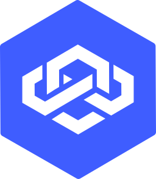 <code>loopback</code></a></td><td align="center"><a href="../logos/loopback-wordmark.svg"> <code>loopback-wordmark</code></a></td><td align="center"><a href="../logos/lotus.svg"> <code>lotus</code></a></td><td align="center"><a href="../logos/luckyframework.svg"> <code>luckyframework</code></a></td></tr>
<tr><td align="center"><a href="../logos/lumen.svg"> <code>lumen</code></a></td><td align="center"><a href="../logos/lunrjs.svg"> <code>lunrjs</code></a></td><td align="center"><a href="../logos/lunrjs-wordmark.svg"> <code>lunrjs-wordmark</code></a></td><td align="center"><a href="../logos/magic-ui.svg"> <code>magic-ui</code></a></td><td align="center"><a href="../logos/malinajs.svg"> <code>malinajs</code></a></td><td align="center"><a href="../logos/mamba-ui.svg">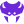 <code>mamba-ui</code></a></td></tr>
<tr><td align="center"><a href="../logos/mantine.svg"> <code>mantine</code></a></td><td align="center"><a href="../logos/mantine-wordmark.svg"> <code>mantine-wordmark</code></a></td><td align="center"><a href="../logos/marionette.svg"> <code>marionette</code></a></td><td align="center"><a href="../logos/marko.svg"> <code>marko</code></a></td><td align="center"><a href="../logos/marko-wordmark.svg"> <code>marko-wordmark</code></a></td><td align="center"><a href="../logos/marpui.svg"> <code>marpui</code></a></td></tr>
<tr><td align="center"><a href="../logos/material-ui.svg"> <code>material-ui</code></a></td><td align="center"><a href="../logos/materializecss.svg"> <code>materializecss</code></a></td><td align="center"><a href="../logos/matter-js.svg"> <code>matter-js</code></a></td><td align="center"><a href="../logos/meanio.svg"> <code>meanio</code></a></td><td align="center"><a href="../logos/mern.svg">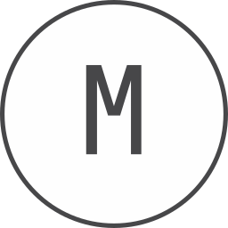 <code>mern</code></a></td><td align="center"><a href="../logos/meteor.svg"> <code>meteor</code></a></td></tr>
<tr><td align="center"><a href="../logos/meteor-wordmark.svg"> <code>meteor-wordmark</code></a></td><td align="center"><a href="../logos/micro.svg"> <code>micro</code></a></td><td align="center"><a href="../logos/micro-wordmark.svg"> <code>micro-wordmark</code></a></td><td align="center"><a href="../logos/microcosm.svg">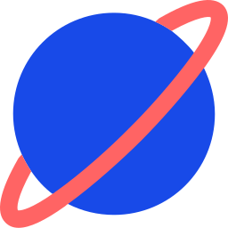 <code>microcosm</code></a></td><td align="center"><a href="../logos/middleman.svg"> <code>middleman</code></a></td><td align="center"><a href="../logos/milligram.svg"> <code>milligram</code></a></td></tr>
<tr><td align="center"><a href="../logos/million.svg"> <code>million</code></a></td><td align="center"><a href="../logos/million-wordmark.svg"> <code>million-wordmark</code></a></td><td align="center"><a href="../logos/mithril.svg"> <code>mithril</code></a></td><td align="center"><a href="../logos/mobx.svg"> <code>mobx</code></a></td><td align="center"><a href="../logos/mochajs.svg"> <code>mochajs</code></a></td><td align="center"><a href="../logos/mochajs-wordmark.svg"> <code>mochajs-wordmark</code></a></td></tr>
<tr><td align="center"><a href="../logos/momentjs.svg"> <code>momentjs</code></a></td><td align="center"><a href="../logos/moon.svg"> <code>moon</code></a></td><td align="center"><a href="../logos/mootools.svg"> <code>mootools</code></a></td><td align="center"><a href="../logos/mui.svg"> <code>mui</code></a></td><td align="center"><a href="../logos/mui-wordmark.svg"> <code>mui-wordmark</code></a></td><td align="center"><a href="../logos/myth.svg"> <code>myth</code></a></td></tr>
<tr><td align="center"><a href="../logos/naiveui.svg"> <code>naiveui</code></a></td><td align="center"><a href="../logos/nativescript.svg">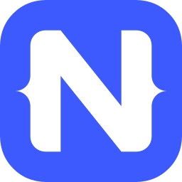 <code>nativescript</code></a></td><td align="center"><a href="../logos/neat.svg"> <code>neat</code></a></td><td align="center"><a href="../logos/nestjs.svg"> <code>nestjs</code></a></td><td align="center"><a href="../logos/nestjs-wordmark.svg"> <code>nestjs-wordmark</code></a></td><td align="center"><a href="../logos/netlifyapp-watercss.svg"> <code>netlifyapp-watercss</code></a></td></tr>
<tr><td align="center"><a href="../logos/netlifyapp-watercss-wordmark.svg"> <code>netlifyapp-watercss-wordmark</code></a></td><td align="center"><a href="../logos/neutralinojs.svg"> <code>neutralinojs</code></a></td><td align="center"><a href="../logos/nextjs.svg"> <code>nextjs</code></a></td><td align="center"><a href="../logos/nextjs-wordmark.svg"> <code>nextjs-wordmark</code></a></td><td align="center"><a href="../logos/nginx-ui.svg">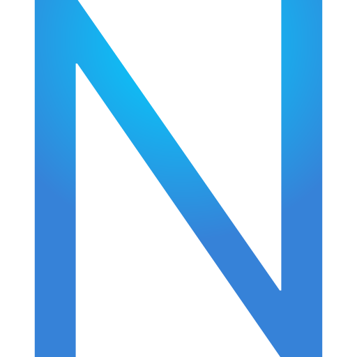 <code>nginx-ui</code></a></td><td align="center"><a href="../logos/nodal.svg"> <code>nodal</code></a></td></tr>
<tr><td align="center"><a href="../logos/node-sass.svg">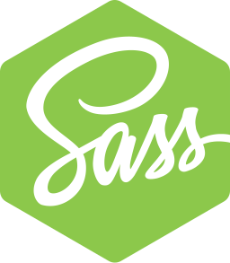 <code>node-sass</code></a></td><td align="center"><a href="../logos/nodegui.svg"> <code>nodegui</code></a></td><td align="center"><a href="../logos/nodewebkit.svg">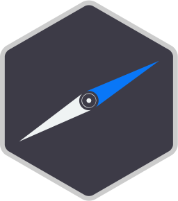 <code>nodewebkit</code></a></td><td align="center"><a href="../logos/normalize-css.svg"> <code>normalize-css</code></a></td><td align="center"><a href="../logos/npmjs.svg"> <code>npmjs</code></a></td><td align="center"><a href="../logos/npmjs-wordmark.svg"> <code>npmjs-wordmark</code></a></td></tr>
<tr><td align="center"><a href="../logos/nuqs.svg"> <code>nuqs</code></a></td><td align="center"><a href="../logos/nuqs-wordmark.svg"> <code>nuqs-wordmark</code></a></td><td align="center"><a href="../logos/nut-webgui.svg">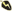 <code>nut-webgui</code></a></td><td align="center"><a href="../logos/nuxt.svg">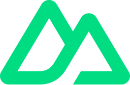 <code>nuxt</code></a></td><td align="center"><a href="../logos/nuxt-content.svg"> <code>nuxt-content</code></a></td><td align="center"><a href="../logos/nuxt-studio.svg"> <code>nuxt-studio</code></a></td></tr>
<tr><td align="center"><a href="../logos/nuxt-ui.svg"> <code>nuxt-ui</code></a></td><td align="center"><a href="../logos/nuxt-wordmark.svg"> <code>nuxt-wordmark</code></a></td><td align="center"><a href="../logos/nuxthub.svg"> <code>nuxthub</code></a></td><td align="center"><a href="../logos/nuxthub-wordmark.svg"> <code>nuxthub-wordmark</code></a></td><td align="center"><a href="../logos/nuxtjs.svg"> <code>nuxtjs</code></a></td><td align="center"><a href="../logos/nuxtjs-wordmark.svg"> <code>nuxtjs-wordmark</code></a></td></tr>
<tr><td align="center"><a href="../logos/openframeworks.svg"> <code>openframeworks</code></a></td><td align="center"><a href="../logos/opengl.svg"> <code>opengl</code></a></td><td align="center"><a href="../logos/openlayers.svg"> <code>openlayers</code></a></td><td align="center"><a href="../logos/opentui.svg"> <code>opentui</code></a></td><td align="center"><a href="../logos/p5js.svg"> <code>p5js</code></a></td><td align="center"><a href="../logos/pandacss.svg"> <code>pandacss</code></a></td></tr>
<tr><td align="center"><a href="../logos/pandacss-wordmark.svg"> <code>pandacss-wordmark</code></a></td><td align="center"><a href="../logos/parceljs.svg"> <code>parceljs</code></a></td><td align="center"><a href="../logos/parceljs-wordmark.svg"> <code>parceljs-wordmark</code></a></td><td align="center"><a href="../logos/partytown.svg"> <code>partytown</code></a></td><td align="center"><a href="../logos/partytown-wordmark.svg"> <code>partytown-wordmark</code></a></td><td align="center"><a href="../logos/pdf.svg"> <code>pdf</code></a></td></tr>
<tr><td align="center"><a href="../logos/pepperoni.svg"> <code>pepperoni</code></a></td><td align="center"><a href="../logos/phalcon.svg">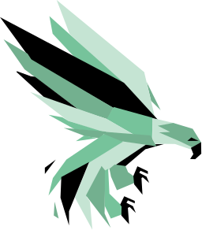 <code>phalcon</code></a></td><td align="center"><a href="../logos/phoenix.svg"> <code>phoenix</code></a></td><td align="center"><a href="../logos/phonegap.svg"> <code>phonegap</code></a></td><td align="center"><a href="../logos/phonegap-bot.svg"> <code>phonegap-bot</code></a></td><td align="center"><a href="../logos/picocss.svg"> <code>picocss</code></a></td></tr>
<tr><td align="center"><a href="../logos/pinia.svg"> <code>pinia</code></a></td><td align="center"><a href="../logos/pixijs.svg"> <code>pixijs</code></a></td><td align="center"><a href="../logos/play.svg"> <code>play</code></a></td><td align="center"><a href="../logos/polars.svg"> <code>polars</code></a></td><td align="center"><a href="../logos/polymer.svg"> <code>polymer</code></a></td><td align="center"><a href="../logos/postcss.svg"> <code>postcss</code></a></td></tr>
<tr><td align="center"><a href="../logos/postcss-wordmark.svg"> <code>postcss-wordmark</code></a></td><td align="center"><a href="../logos/preact.svg"> <code>preact</code></a></td><td align="center"><a href="../logos/processing.svg"> <code>processing</code></a></td><td align="center"><a href="../logos/pug.svg"> <code>pug</code></a></td><td align="center"><a href="../logos/pugjs.svg"> <code>pugjs</code></a></td><td align="center"><a href="../logos/pugjs-wordmark.svg"> <code>pugjs-wordmark</code></a></td></tr>
<tr><td align="center"><a href="../logos/purgecss.svg"> <code>purgecss</code></a></td><td align="center"><a href="../logos/q.svg"> <code>q</code></a></td><td align="center"><a href="../logos/qt.svg"> <code>qt</code></a></td><td align="center"><a href="../logos/quarkus.svg"> <code>quarkus</code></a></td><td align="center"><a href="../logos/quarkus-wordmark.svg"> <code>quarkus-wordmark</code></a></td><td align="center"><a href="../logos/qui.svg"> <code>qui</code></a></td></tr>
<tr><td align="center"><a href="../logos/qwik.svg"> <code>qwik</code></a></td><td align="center"><a href="../logos/qwik-wordmark.svg"> <code>qwik-wordmark</code></a></td><td align="center"><a href="../logos/radix-ui.svg"> <code>radix-ui</code></a></td><td align="center"><a href="../logos/rails.svg"> <code>rails</code></a></td><td align="center"><a href="../logos/ramda.svg"> <code>ramda</code></a></td><td align="center"><a href="../logos/randomcolor.svg"> <code>randomcolor</code></a></td></tr>
<tr><td align="center"><a href="../logos/raphael.svg"> <code>raphael</code></a></td><td align="center"><a href="../logos/ratatui.svg"> <code>ratatui</code></a></td><td align="center"><a href="../logos/rax.svg"> <code>rax</code></a></td><td align="center"><a href="../logos/react.svg"> <code>react</code></a></td><td align="center"><a href="../logos/react-query.svg"> <code>react-query</code></a></td><td align="center"><a href="../logos/react-query-wordmark.svg"> <code>react-query-wordmark</code></a></td></tr>
<tr><td align="center"><a href="../logos/react-router.svg"> <code>react-router</code></a></td><td align="center"><a href="../logos/react-spring.svg"> <code>react-spring</code></a></td><td align="center"><a href="../logos/react-styleguidist.svg"> <code>react-styleguidist</code></a></td><td align="center"><a href="../logos/react-wheel-picker.svg"> <code>react-wheel-picker</code></a></td><td align="center"><a href="../logos/reactivex.svg"> <code>reactivex</code></a></td><td align="center"><a href="../logos/reactjs.svg"> <code>reactjs</code></a></td></tr>
<tr><td align="center"><a href="../logos/reactjs-wordmark.svg"> <code>reactjs-wordmark</code></a></td><td align="center"><a href="../logos/reapp.svg"> <code>reapp</code></a></td><td align="center"><a href="../logos/recoil.svg"> <code>recoil</code></a></td><td align="center"><a href="../logos/recoil-wordmark.svg"> <code>recoil-wordmark</code></a></td><td align="center"><a href="../logos/redux.svg"> <code>redux</code></a></td><td align="center"><a href="../logos/redux-observable.svg"> <code>redux-observable</code></a></td></tr>
<tr><td align="center"><a href="../logos/redux-saga.svg"> <code>redux-saga</code></a></td><td align="center"><a href="../logos/redwoodjs.svg"> <code>redwoodjs</code></a></td><td align="center"><a href="../logos/refine.svg"> <code>refine</code></a></td><td align="center"><a href="../logos/reka-ui.svg"> <code>reka-ui</code></a></td><td align="center"><a href="../logos/relay.svg"> <code>relay</code></a></td><td align="center"><a href="../logos/remix.svg"> <code>remix</code></a></td></tr>
<tr><td align="center"><a href="../logos/remix-wordmark.svg"> <code>remix-wordmark</code></a></td><td align="center"><a href="../logos/remotion.svg"> <code>remotion</code></a></td><td align="center"><a href="../logos/require.svg"> <code>require</code></a></td><td align="center"><a href="../logos/requirejs.svg"> <code>requirejs</code></a></td><td align="center"><a href="../logos/rest-li.svg"> <code>rest-li</code></a></td><td align="center"><a href="../logos/reveal-js.svg"> <code>reveal-js</code></a></td></tr>
<tr><td align="center"><a href="../logos/riot.svg"> <code>riot</code></a></td><td align="center"><a href="../logos/rxjs.svg"> <code>rxjs</code></a></td><td align="center"><a href="../logos/sagui.svg"> <code>sagui</code></a></td><td align="center"><a href="../logos/sails.svg"> <code>sails</code></a></td><td align="center"><a href="../logos/sails-js.svg"> <code>sails-js</code></a></td><td align="center"><a href="../logos/sass.svg"> <code>sass</code></a></td></tr>
<tr><td align="center"><a href="../logos/sass-doc.svg"> <code>sass-doc</code></a></td><td align="center"><a href="../logos/semantic-ui.svg"> <code>semantic-ui</code></a></td><td align="center"><a href="../logos/semaphore-ui.svg"> <code>semaphore-ui</code></a></td><td align="center"><a href="../logos/sencha.svg"> <code>sencha</code></a></td><td align="center"><a href="../logos/seneca.svg"> <code>seneca</code></a></td><td align="center"><a href="../logos/sequelizejs.svg"> <code>sequelizejs</code></a></td></tr>
<tr><td align="center"><a href="../logos/shadcn-ui.svg"> <code>shadcn-ui</code></a></td><td align="center"><a href="../logos/shiki.svg"> <code>shiki</code></a></td><td align="center"><a href="../logos/sinatra.svg"> <code>sinatra</code></a></td><td align="center"><a href="../logos/slim.svg"> <code>slim</code></a></td><td align="center"><a href="../logos/snap-svg.svg"> <code>snap-svg</code></a></td><td align="center"><a href="../logos/socket-io.svg"> <code>socket-io</code></a></td></tr>
<tr><td align="center"><a href="../logos/socket-io-wordmark.svg"> <code>socket-io-wordmark</code></a></td><td align="center"><a href="../logos/sofastack-sofa-rpc.svg"> <code>sofastack-sofa-rpc</code></a></td><td align="center"><a href="../logos/solidjs.svg"> <code>solidjs</code></a></td><td align="center"><a href="../logos/solidjs-wordmark.svg"> <code>solidjs-wordmark</code></a></td><td align="center"><a href="../logos/spring.svg"> <code>spring</code></a></td><td align="center"><a href="../logos/spring-wordmark.svg"> <code>spring-wordmark</code></a></td></tr>
<tr><td align="center"><a href="../logos/srpc.svg"> <code>srpc</code></a></td><td align="center"><a href="../logos/standardjs.svg"> <code>standardjs</code></a></td><td align="center"><a href="../logos/stately.svg"> <code>stately</code></a></td><td align="center"><a href="../logos/stenciljs.svg"> <code>stenciljs</code></a></td><td align="center"><a href="../logos/steroids.svg"> <code>steroids</code></a></td><td align="center"><a href="../logos/stimulus.svg"> <code>stimulus</code></a></td></tr>
<tr><td align="center"><a href="../logos/stimulus-wordmark.svg"> <code>stimulus-wordmark</code></a></td><td align="center"><a href="../logos/strongloop.svg"> <code>strongloop</code></a></td><td align="center"><a href="../logos/struts.svg"> <code>struts</code></a></td><td align="center"><a href="../logos/styled-components.svg"> <code>styled-components</code></a></td><td align="center"><a href="../logos/stylis.svg"> <code>stylis</code></a></td><td align="center"><a href="../logos/stylus.svg"> <code>stylus</code></a></td></tr>
<tr><td align="center"><a href="../logos/sugarss.svg"> <code>sugarss</code></a></td><td align="center"><a href="../logos/sui.svg"> <code>sui</code></a></td><td align="center"><a href="../logos/supersonic.svg"> <code>supersonic</code></a></td><td align="center"><a href="../logos/surveyjs.svg"> <code>surveyjs</code></a></td><td align="center"><a href="../logos/susy.svg"> <code>susy</code></a></td><td align="center"><a href="../logos/svelte.svg"> <code>svelte</code></a></td></tr>
<tr><td align="center"><a href="../logos/svelte-kit.svg"> <code>svelte-kit</code></a></td><td align="center"><a href="../logos/svelte-wordmark.svg"> <code>svelte-wordmark</code></a></td><td align="center"><a href="../logos/svg-js.svg"> <code>svg-js</code></a></td><td align="center"><a href="../logos/svgl.svg"> <code>svgl</code></a></td><td align="center"><a href="../logos/swr.svg"> <code>swr</code></a></td><td align="center"><a href="../logos/symfony.svg"> <code>symfony</code></a></td></tr>
<tr><td align="center"><a href="../logos/symfony-wordmark.svg"> <code>symfony-wordmark</code></a></td><td align="center"><a href="../logos/t3.svg"> <code>t3</code></a></td><td align="center"><a href="../logos/tailwindcss.svg"> <code>tailwindcss</code></a></td><td align="center"><a href="../logos/tailwindcss-wordmark.svg"> <code>tailwindcss-wordmark</code></a></td><td align="center"><a href="../logos/tangerine-ui.svg"> <code>tangerine-ui</code></a></td><td align="center"><a href="../logos/tanstack.svg"> <code>tanstack</code></a></td></tr>
<tr><td align="center"><a href="../logos/tars.svg"> <code>tars</code></a></td><td align="center"><a href="../logos/tauri.svg"> <code>tauri</code></a></td><td align="center"><a href="../logos/threejs.svg"> <code>threejs</code></a></td><td align="center"><a href="../logos/thymeleaf.svg"> <code>thymeleaf</code></a></td><td align="center"><a href="../logos/thymeleaf-wordmark.svg"> <code>thymeleaf-wordmark</code></a></td><td align="center"><a href="../logos/titon.svg"> <code>titon</code></a></td></tr>
<tr><td align="center"><a href="../logos/totaljs.svg"> <code>totaljs</code></a></td><td align="center"><a href="../logos/totaljs-wordmark.svg"> <code>totaljs-wordmark</code></a></td><td align="center"><a href="../logos/trpc.svg"> <code>trpc</code></a></td><td align="center"><a href="../logos/tui.svg"> <code>tui</code></a></td><td align="center"><a href="../logos/turret.svg"> <code>turret</code></a></td><td align="center"><a href="../logos/uikit.svg"> <code>uikit</code></a></td></tr>
<tr><td align="center"><a href="../logos/underscore-js.svg"> <code>underscore-js</code></a></td><td align="center"><a href="../logos/unity.svg"> <code>unity</code></a></td><td align="center"><a href="../logos/unjs.svg"> <code>unjs</code></a></td><td align="center"><a href="../logos/unocss.svg"> <code>unocss</code></a></td><td align="center"><a href="../logos/unrealengine.svg"> <code>unrealengine</code></a></td><td align="center"><a href="../logos/vaadin.svg"> <code>vaadin</code></a></td></tr>
<tr><td align="center"><a href="../logos/valibot.svg"> <code>valibot</code></a></td><td align="center"><a href="../logos/valibot-wordmark.svg"> <code>valibot-wordmark</code></a></td><td align="center"><a href="../logos/vue.svg"> <code>vue</code></a></td><td align="center"><a href="../logos/vue-js.svg"> <code>vue-js</code></a></td><td align="center"><a href="../logos/vue-js-wordmark.svg"> <code>vue-js-wordmark</code></a></td><td align="center"><a href="../logos/vuetifyjs.svg"> <code>vuetifyjs</code></a></td></tr>
<tr><td align="center"><a href="../logos/vueuse.svg"> <code>vueuse</code></a></td><td align="center"><a href="../logos/vulkan.svg"> <code>vulkan</code></a></td><td align="center"><a href="../logos/w3-css.svg"> <code>w3-css</code></a></td><td align="center"><a href="../logos/w3-css-wordmark.svg"> <code>w3-css-wordmark</code></a></td><td align="center"><a href="../logos/webgl.svg"> <code>webgl</code></a></td><td align="center"><a href="../logos/webix.svg"> <code>webix</code></a></td></tr>
<tr><td align="center"><a href="../logos/webix-wordmark.svg"> <code>webix-wordmark</code></a></td><td align="center"><a href="../logos/wicket.svg"> <code>wicket</code></a></td><td align="center"><a href="../logos/wicket-wordmark.svg"> <code>wicket-wordmark</code></a></td><td align="center"><a href="../logos/wikijs.svg"> <code>wikijs</code></a></td><td align="center"><a href="../logos/windi-css.svg"> <code>windi-css</code></a></td><td align="center"><a href="../logos/xamarin.svg"> <code>xamarin</code></a></td></tr>
<tr><td align="center"><a href="../logos/xstate.svg"> <code>xstate</code></a></td><td align="center"><a href="../logos/yii.svg"> <code>yii</code></a></td><td align="center"><a href="../logos/z-wave-js-ui.svg"> <code>z-wave-js-ui</code></a></td><td align="center"><a href="../logos/zend-framework.svg"> <code>zend-framework</code></a></td><td align="center"><a href="../logos/zod.svg"> <code>zod</code></a></td><td align="center"><a href="../logos/zyft.svg"> <code>zyft</code></a></td></tr>
</table>

[⬅️ Back to the full catalog](../README.md)
