# 💻 Languages & Runtimes (161)

[⬅️ Back to the full catalog](../README.md) · [🖼️ Browse & download on the website](https://logos.lndev.me/)
<table>
<tr><td align="center"><a href="../logos/ambient.svg">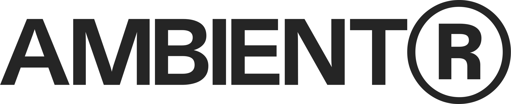 <code>ambient</code></a></td><td align="center"><a href="../logos/autoit.svg"> <code>autoit</code></a></td><td align="center"><a href="../logos/azure-kubernetes-service.svg"> <code>azure-kubernetes-service</code></a></td><td align="center"><a href="../logos/bun.svg"> <code>bun</code></a></td><td align="center"><a href="../logos/bytecode-alliance.svg">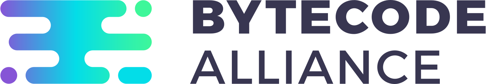 <code>bytecode-alliance</code></a></td><td align="center"><a href="../logos/c.svg">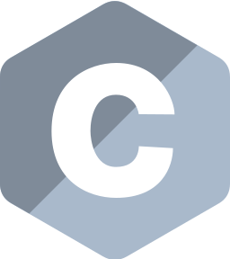 <code>c</code></a></td></tr>
<tr><td align="center"><a href="../logos/c-plusplus.svg">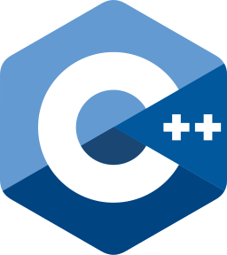 <code>c-plusplus</code></a></td><td align="center"><a href="../logos/c-sharp.svg">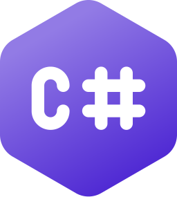 <code>c-sharp</code></a></td><td align="center"><a href="../logos/cargo.svg"> <code>cargo</code></a></td><td align="center"><a href="../logos/casper.svg">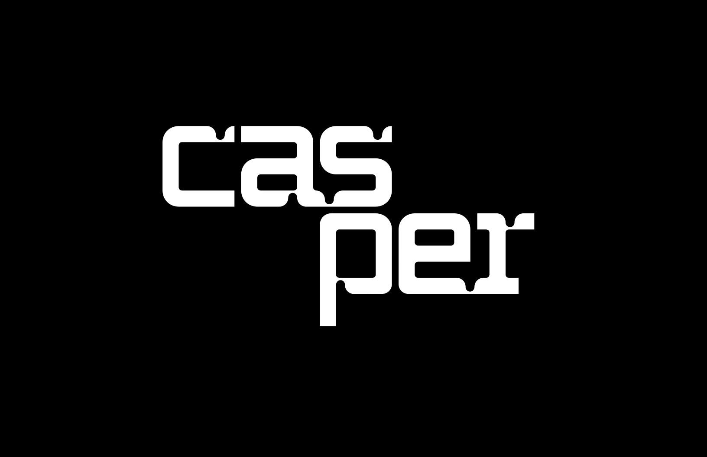 <code>casper</code></a></td><td align="center"><a href="../logos/ceylon.svg"> <code>ceylon</code></a></td><td align="center"><a href="../logos/clio-lang.svg"> <code>clio-lang</code></a></td></tr>
<tr><td align="center"><a href="../logos/cljs.svg"> <code>cljs</code></a></td><td align="center"><a href="../logos/clojure.svg"> <code>clojure</code></a></td><td align="center"><a href="../logos/clojure-wordmark.svg"> <code>clojure-wordmark</code></a></td><td align="center"><a href="../logos/cobol.svg"> <code>cobol</code></a></td><td align="center"><a href="../logos/coffeescript.svg"> <code>coffeescript</code></a></td><td align="center"><a href="../logos/coffeescript-wordmark.svg"> <code>coffeescript-wordmark</code></a></td></tr>
<tr><td align="center"><a href="../logos/container2wasm.svg">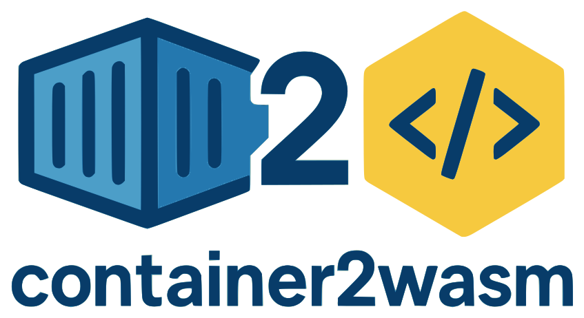 <code>container2wasm</code></a></td><td align="center"><a href="../logos/containerd.svg"> <code>containerd</code></a></td><td align="center"><a href="../logos/cosmonic.svg"> <code>cosmonic</code></a></td><td align="center"><a href="../logos/cosmwasm.svg"> <code>cosmwasm</code></a></td><td align="center"><a href="../logos/crates.svg">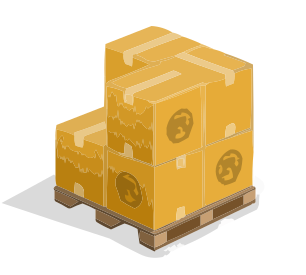 <code>crates</code></a></td><td align="center"><a href="../logos/cri-o.svg">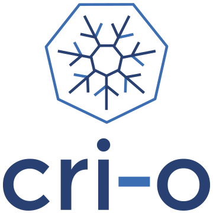 <code>cri-o</code></a></td></tr>
<tr><td align="center"><a href="../logos/crystal.svg"> <code>crystal</code></a></td><td align="center"><a href="../logos/dapr-for-wasmedge.svg">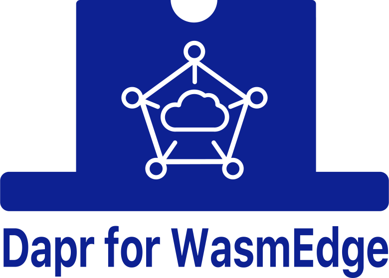 <code>dapr-for-wasmedge</code></a></td><td align="center"><a href="../logos/dart.svg"> <code>dart</code></a></td><td align="center"><a href="../logos/deno.svg"> <code>deno</code></a></td><td align="center"><a href="../logos/deno-wordmark.svg"> <code>deno-wordmark</code></a></td><td align="center"><a href="../logos/dfinity.svg">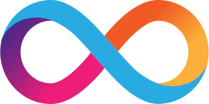 <code>dfinity</code></a></td></tr>
<tr><td align="center"><a href="../logos/docker-member.svg">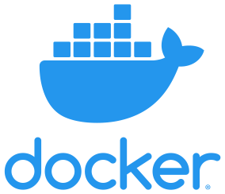 <code>docker-member</code></a></td><td align="center"><a href="../logos/dotnet.svg"> <code>dotnet</code></a></td><td align="center"><a href="../logos/dotnet-wordmark.svg"> <code>dotnet-wordmark</code></a></td><td align="center"><a href="../logos/ecma.svg"> <code>ecma</code></a></td><td align="center"><a href="../logos/elfconv.svg">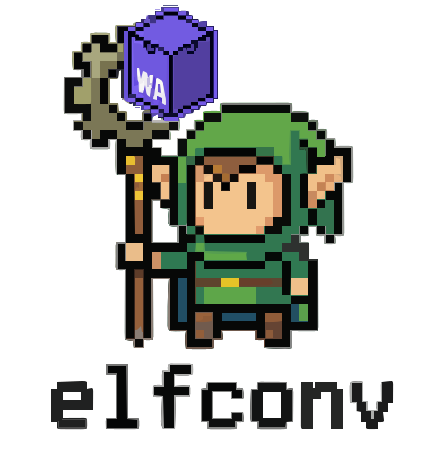 <code>elfconv</code></a></td><td align="center"><a href="../logos/elm.svg">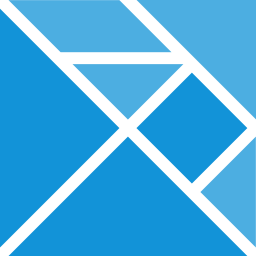 <code>elm</code></a></td></tr>
<tr><td align="center"><a href="../logos/elm-classic.svg">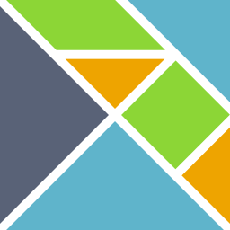 <code>elm-classic</code></a></td><td align="center"><a href="../logos/erlang.svg"> <code>erlang</code></a></td><td align="center"><a href="../logos/erlang-wordmark.svg"> <code>erlang-wordmark</code></a></td><td align="center"><a href="../logos/es6.svg"> <code>es6</code></a></td><td align="center"><a href="../logos/eunomia.svg">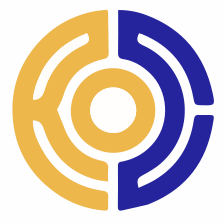 <code>eunomia</code></a></td><td align="center"><a href="../logos/fermyon.svg"> <code>fermyon</code></a></td></tr>
<tr><td align="center"><a href="../logos/filecoin.svg"> <code>filecoin</code></a></td><td align="center"><a href="../logos/flows-network.svg">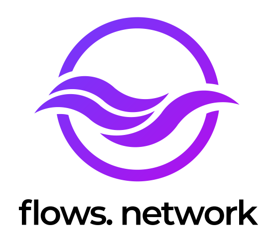 <code>flows-network</code></a></td><td align="center"><a href="../logos/fluvio.svg">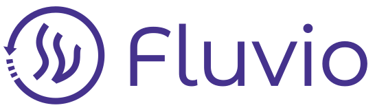 <code>fluvio</code></a></td><td align="center"><a href="../logos/fortran.svg"> <code>fortran</code></a></td><td align="center"><a href="../logos/fsharp.svg">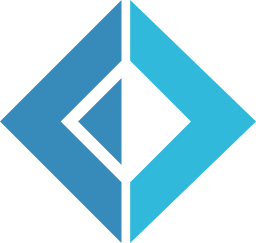 <code>fsharp</code></a></td><td align="center"><a href="../logos/gear.svg"> <code>gear</code></a></td></tr>
<tr><td align="center"><a href="../logos/gleam.svg"> <code>gleam</code></a></td><td align="center"><a href="../logos/go.svg">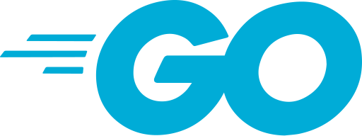 <code>go</code></a></td><td align="center"><a href="../logos/golem.svg"> <code>golem</code></a></td><td align="center"><a href="../logos/gopher.svg">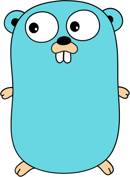 <code>gopher</code></a></td><td align="center"><a href="../logos/grain.svg"> <code>grain</code></a></td><td align="center"><a href="../logos/hack.svg"> <code>hack</code></a></td></tr>
<tr><td align="center"><a href="../logos/haskell.svg"> <code>haskell</code></a></td><td align="center"><a href="../logos/haskell-wordmark.svg"> <code>haskell-wordmark</code></a></td><td align="center"><a href="../logos/haxe.svg"> <code>haxe</code></a></td><td align="center"><a href="../logos/haxe-wordmark.svg"> <code>haxe-wordmark</code></a></td><td align="center"><a href="../logos/hermes.svg"> <code>hermes</code></a></td><td align="center"><a href="../logos/hhvm.svg"> <code>hhvm</code></a></td></tr>
<tr><td align="center"><a href="../logos/hoa.svg"> <code>hoa</code></a></td><td align="center"><a href="../logos/imba.svg"> <code>imba</code></a></td><td align="center"><a href="../logos/imba-wordmark.svg"> <code>imba-wordmark</code></a></td><td align="center"><a href="../logos/io.svg">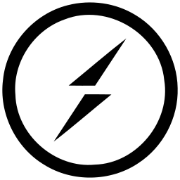 <code>io</code></a></td><td align="center"><a href="../logos/java.svg">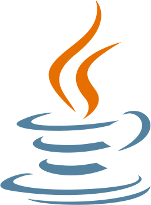 <code>java</code></a></td><td align="center"><a href="../logos/java-wordmark.svg"> <code>java-wordmark</code></a></td></tr>
<tr><td align="center"><a href="../logos/javascript.svg"> <code>javascript</code></a></td><td align="center"><a href="../logos/javascript-wordmark.svg"> <code>javascript-wordmark</code></a></td><td align="center"><a href="../logos/jruby.svg">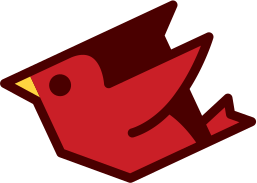 <code>jruby</code></a></td><td align="center"><a href="../logos/julia.svg"> <code>julia</code></a></td><td align="center"><a href="../logos/kotlin.svg"> <code>kotlin</code></a></td><td align="center"><a href="../logos/kotlin-wordmark.svg">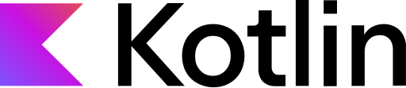 <code>kotlin-wordmark</code></a></td></tr>
<tr><td align="center"><a href="../logos/kuasar.svg">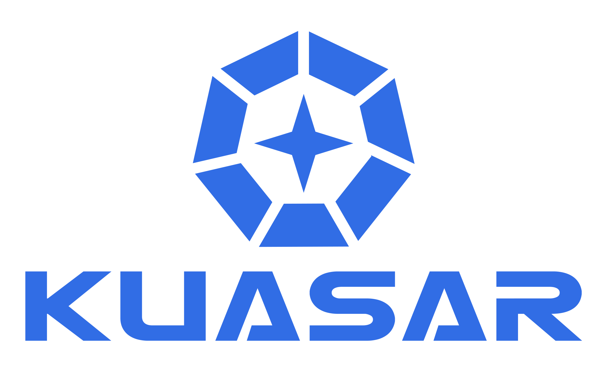 <code>kuasar</code></a></td><td align="center"><a href="../logos/kube-edge.svg"> <code>kube-edge</code></a></td><td align="center"><a href="../logos/kwasm.svg">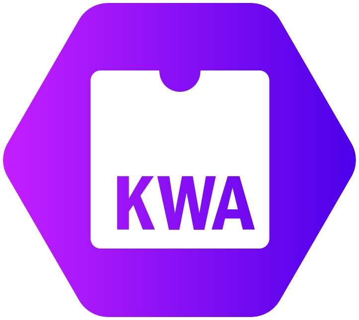 <code>kwasm</code></a></td><td align="center"><a href="../logos/libsql.svg"> <code>libsql</code></a></td><td align="center"><a href="../logos/llvm.svg">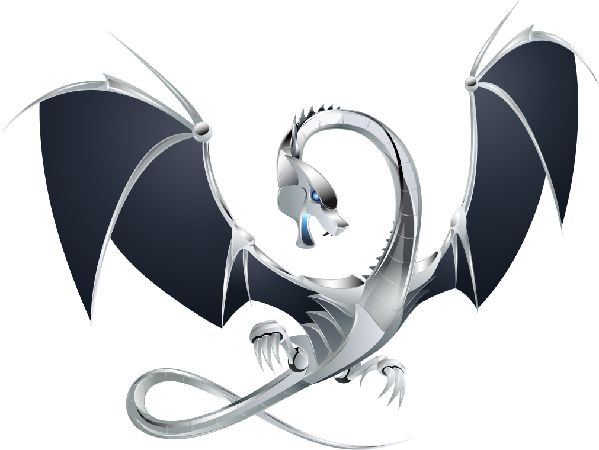 <code>llvm</code></a></td><td align="center"><a href="../logos/lua.svg">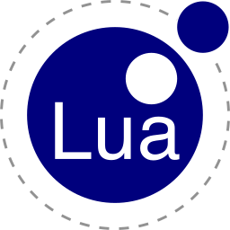 <code>lua</code></a></td></tr>
<tr><td align="center"><a href="../logos/lua-wordmark.svg">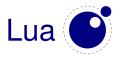 <code>lua-wordmark</code></a></td><td align="center"><a href="../logos/lunatic.svg"> <code>lunatic</code></a></td><td align="center"><a href="../logos/matlab.svg">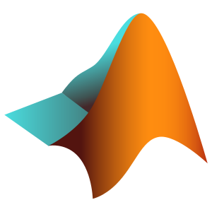 <code>matlab</code></a></td><td align="center"><a href="../logos/meshery.svg">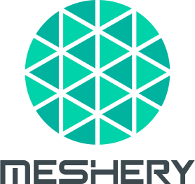 <code>meshery</code></a></td><td align="center"><a href="../logos/metatype.svg">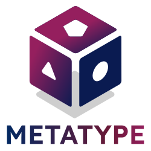 <code>metatype</code></a></td><td align="center"><a href="../logos/micro-python.svg"> <code>micro-python</code></a></td></tr>
<tr><td align="center"><a href="../logos/mint-lang.svg"> <code>mint-lang</code></a></td><td align="center"><a href="../logos/modsurfer.svg">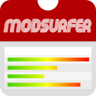 <code>modsurfer</code></a></td><td align="center"><a href="../logos/mono.svg">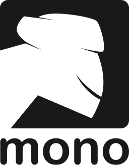 <code>mono</code></a></td><td align="center"><a href="../logos/nasm.svg"> <code>nasm</code></a></td><td align="center"><a href="../logos/near.svg"> <code>near</code></a></td><td align="center"><a href="../logos/net.svg"> <code>net</code></a></td></tr>
<tr><td align="center"><a href="../logos/nim-lang.svg"> <code>nim-lang</code></a></td><td align="center"><a href="../logos/nim-lang-wordmark.svg"> <code>nim-lang-wordmark</code></a></td><td align="center"><a href="../logos/nodejs.svg"> <code>nodejs</code></a></td><td align="center"><a href="../logos/nodejs-icon-alt.svg"> <code>nodejs-icon-alt</code></a></td><td align="center"><a href="../logos/nodejs-wordmark.svg"> <code>nodejs-wordmark</code></a></td><td align="center"><a href="../logos/observe.svg">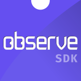 <code>observe</code></a></td></tr>
<tr><td align="center"><a href="../logos/ocaml.svg"> <code>ocaml</code></a></td><td align="center"><a href="../logos/opengauss.svg"> <code>opengauss</code></a></td><td align="center"><a href="../logos/perl.svg">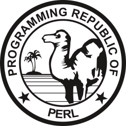 <code>perl</code></a></td><td align="center"><a href="../logos/perl-wordmark.svg"> <code>perl-wordmark</code></a></td><td align="center"><a href="../logos/php.svg"> <code>php</code></a></td><td align="center"><a href="../logos/php-alt.svg"> <code>php-alt</code></a></td></tr>
<tr><td align="center"><a href="../logos/php-wordmark.svg"> <code>php-wordmark</code></a></td><td align="center"><a href="../logos/powershell.svg"> <code>powershell</code></a></td><td align="center"><a href="../logos/purescript.svg">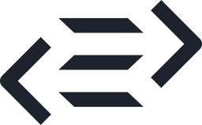 <code>purescript</code></a></td><td align="center"><a href="../logos/purescript-wordmark.svg"> <code>purescript-wordmark</code></a></td><td align="center"><a href="../logos/pyodide.svg">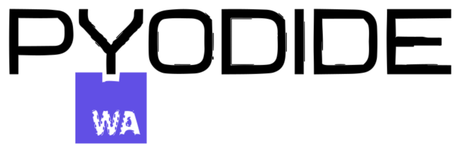 <code>pyodide</code></a></td><td align="center"><a href="../logos/pyscript.svg">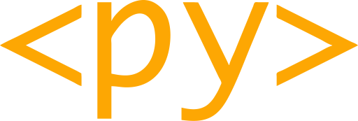 <code>pyscript</code></a></td></tr>
<tr><td align="center"><a href="../logos/python.svg">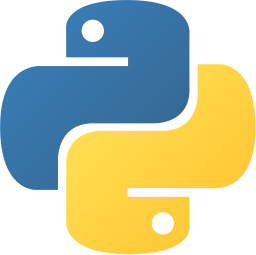 <code>python</code></a></td><td align="center"><a href="../logos/python-wordmark.svg">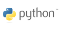 <code>python-wordmark</code></a></td><td align="center"><a href="../logos/quai.svg"> <code>quai</code></a></td><td align="center"><a href="../logos/r-lang.svg"> <code>r-lang</code></a></td><td align="center"><a href="../logos/reasonml.svg"> <code>reasonml</code></a></td><td align="center"><a href="../logos/reasonml-wordmark.svg"> <code>reasonml-wordmark</code></a></td></tr>
<tr><td align="center"><a href="../logos/redpanda.svg"> <code>redpanda</code></a></td><td align="center"><a href="../logos/rescript.svg"> <code>rescript</code></a></td><td align="center"><a href="../logos/rescript-wordmark.svg"> <code>rescript-wordmark</code></a></td><td align="center"><a href="../logos/ruby.svg"> <code>ruby</code></a></td><td align="center"><a href="../logos/runwasi.svg">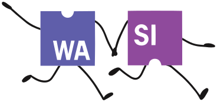 <code>runwasi</code></a></td><td align="center"><a href="../logos/rust.svg"> <code>rust</code></a></td></tr>
<tr><td align="center"><a href="../logos/rustwasm.svg"> <code>rustwasm</code></a></td><td align="center"><a href="../logos/scala.svg"> <code>scala</code></a></td><td align="center"><a href="../logos/scale.svg"> <code>scale</code></a></td><td align="center"><a href="../logos/sel4.svg"> <code>sel4</code></a></td><td align="center"><a href="../logos/solidity.svg"> <code>solidity</code></a></td><td align="center"><a href="../logos/spiderlightning.svg">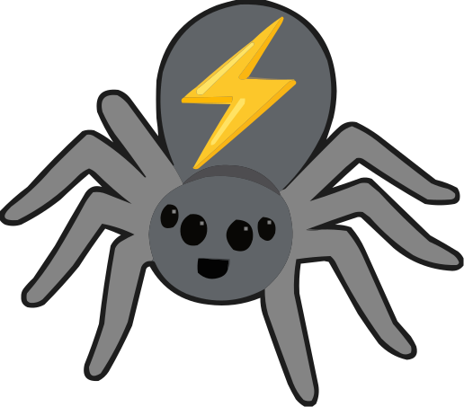 <code>spiderlightning</code></a></td></tr>
<tr><td align="center"><a href="../logos/spidermonkey.svg"> <code>spidermonkey</code></a></td><td align="center"><a href="../logos/spin.svg">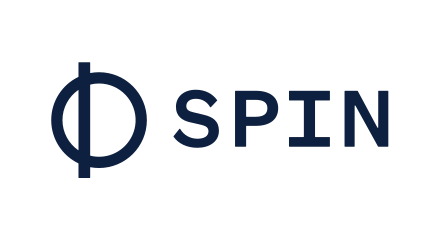 <code>spin</code></a></td><td align="center"><a href="../logos/spinkube.svg">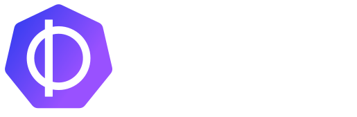 <code>spinkube</code></a></td><td align="center"><a href="../logos/superedge.svg">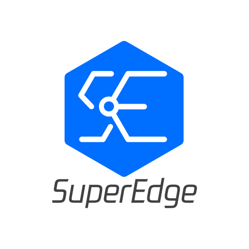 <code>superedge</code></a></td><td align="center"><a href="../logos/swift.svg">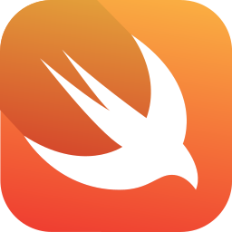 <code>swift</code></a></td><td align="center"><a href="../logos/swift-wordmark.svg">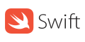 <code>swift-wordmark</code></a></td></tr>
<tr><td align="center"><a href="../logos/taikun.svg">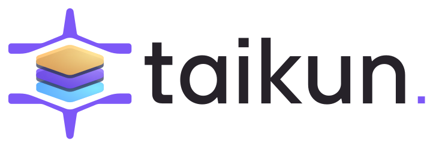 <code>taikun</code></a></td><td align="center"><a href="../logos/taubyte.svg"> <code>taubyte</code></a></td><td align="center"><a href="../logos/tsnode.svg"> <code>tsnode</code></a></td><td align="center"><a href="../logos/typescript.svg"> <code>typescript</code></a></td><td align="center"><a href="../logos/typescript-icon-round.svg"> <code>typescript-icon-round</code></a></td><td align="center"><a href="../logos/typescript-wordmark.svg"> <code>typescript-wordmark</code></a></td></tr>
<tr><td align="center"><a href="../logos/unikraft.svg"> <code>unikraft</code></a></td><td align="center"><a href="../logos/v8.svg"> <code>v8</code></a></td><td align="center"><a href="../logos/v8-ignition.svg"> <code>v8-ignition</code></a></td><td align="center"><a href="../logos/v8-turbofan.svg"> <code>v8-turbofan</code></a></td><td align="center"><a href="../logos/vlang.svg"> <code>vlang</code></a></td><td align="center"><a href="../logos/wa-lang.svg"> <code>wa-lang</code></a></td></tr>
<tr><td align="center"><a href="../logos/wasix.svg"> <code>wasix</code></a></td><td align="center"><a href="../logos/wasm.svg"> <code>wasm</code></a></td><td align="center"><a href="../logos/wasm2c.svg"> <code>wasm2c</code></a></td><td align="center"><a href="../logos/wasm3.svg"> <code>wasm3</code></a></td><td align="center"><a href="../logos/wasmcloud.svg"> <code>wasmcloud</code></a></td><td align="center"><a href="../logos/wasmedge-quickjs.svg"> <code>wasmedge-quickjs</code></a></td></tr>
<tr><td align="center"><a href="../logos/wasmer.svg"> <code>wasmer</code></a></td><td align="center"><a href="../logos/wavm.svg"> <code>wavm</code></a></td><td align="center"><a href="../logos/wazero.svg"> <code>wazero</code></a></td><td align="center"><a href="../logos/webassembly.svg"> <code>webassembly</code></a></td><td align="center"><a href="../logos/webassembly-wordmark.svg"> <code>webassembly-wordmark</code></a></td><td align="center"><a href="../logos/winglang.svg"> <code>winglang</code></a></td></tr>
<tr><td align="center"><a href="../logos/winglang-wordmark.svg"> <code>winglang-wordmark</code></a></td><td align="center"><a href="../logos/witc.svg"> <code>witc</code></a></td><td align="center"><a href="../logos/xtend.svg"> <code>xtend</code></a></td><td align="center"><a href="../logos/youki.svg"> <code>youki</code></a></td><td align="center"><a href="../logos/zig.svg"> <code>zig</code></a></td></tr>
</table>

[⬅️ Back to the full catalog](../README.md)
