# 🖥️ OS, Platforms & Browsers (137)

[⬅️ Back to the full catalog](../README.md) · [🖼️ Browse & download on the website](https://logos.lndev.me/)
<table>
<tr><td align="center"><a href="../logos/aix.svg"> <code>aix</code></a></td><td align="center"><a href="../logos/alma-linux.svg"> <code>alma-linux</code></a></td><td align="center"><a href="../logos/alpinelinux.svg"> <code>alpinelinux</code></a></td><td align="center"><a href="../logos/alpinelinux-wordmark.svg"> <code>alpinelinux-wordmark</code></a></td><td align="center"><a href="../logos/android.svg"> <code>android</code></a></td><td align="center"><a href="../logos/android-vertical.svg"> <code>android-vertical</code></a></td></tr>
<tr><td align="center"><a href="../logos/android-wordmark.svg"> <code>android-wordmark</code></a></td><td align="center"><a href="../logos/apple-app-store.svg"> <code>apple-app-store</code></a></td><td align="center"><a href="../logos/apple-app-store-wordmark.svg"> <code>apple-app-store-wordmark</code></a></td><td align="center"><a href="../logos/arc.svg"> <code>arc</code></a></td><td align="center"><a href="../logos/archlinux.svg"> <code>archlinux</code></a></td><td align="center"><a href="../logos/archlinux-wordmark.svg"> <code>archlinux-wordmark</code></a></td></tr>
<tr><td align="center"><a href="../logos/arduino.svg">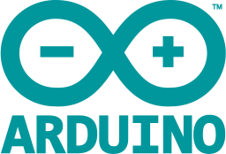 <code>arduino</code></a></td><td align="center"><a href="../logos/arduino-wordmark.svg"> <code>arduino-wordmark</code></a></td><td align="center"><a href="../logos/aroz-os.svg"> <code>aroz-os</code></a></td><td align="center"><a href="../logos/artix-linux.svg"> <code>artix-linux</code></a></td><td align="center"><a href="../logos/asahi-linux.svg"> <code>asahi-linux</code></a></td><td align="center"><a href="../logos/brave.svg"> <code>brave</code></a></td></tr>
<tr><td align="center"><a href="../logos/brave-wordmark.svg"> <code>brave-wordmark</code></a></td><td align="center"><a href="../logos/bsd.svg"> <code>bsd</code></a></td><td align="center"><a href="../logos/cachyos-linux.svg"> <code>cachyos-linux</code></a></td><td align="center"><a href="../logos/centos.svg"> <code>centos</code></a></td><td align="center"><a href="../logos/centos-wordmark.svg"> <code>centos-wordmark</code></a></td><td align="center"><a href="../logos/chimera-linux.svg">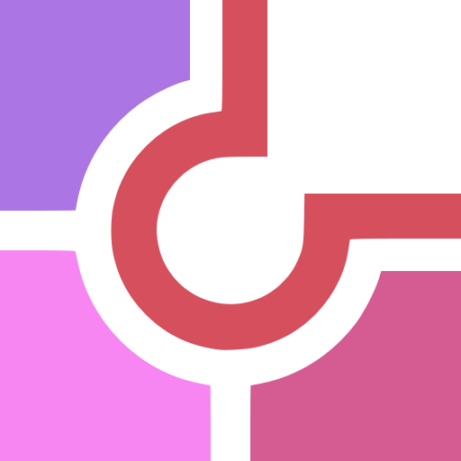 <code>chimera-linux</code></a></td></tr>
<tr><td align="center"><a href="../logos/chrome.svg"> <code>chrome</code></a></td><td align="center"><a href="../logos/chrome-web-store.svg"> <code>chrome-web-store</code></a></td><td align="center"><a href="../logos/chromium.svg"> <code>chromium</code></a></td><td align="center"><a href="../logos/css-new.svg">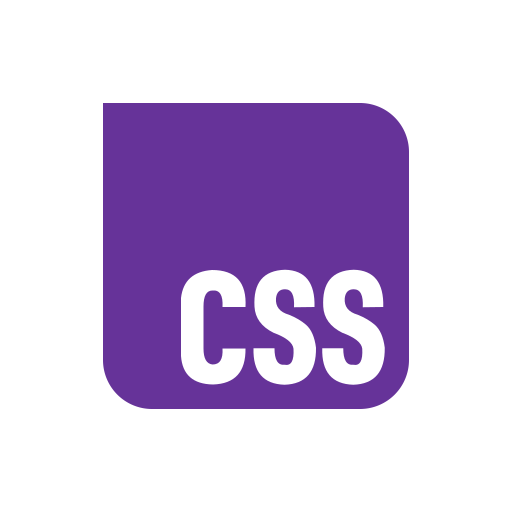 <code>css-new</code></a></td><td align="center"><a href="../logos/debian.svg"> <code>debian</code></a></td><td align="center"><a href="../logos/debian-linux.svg">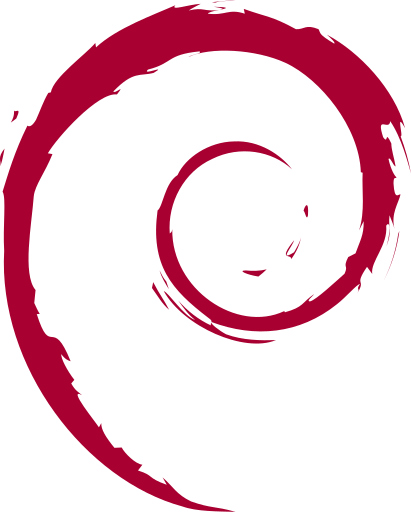 <code>debian-linux</code></a></td></tr>
<tr><td align="center"><a href="../logos/debian-wordmark.svg"> <code>debian-wordmark</code></a></td><td align="center"><a href="../logos/duckduckgo.svg"> <code>duckduckgo</code></a></td><td align="center"><a href="../logos/duckduckgo-wordmark.svg"> <code>duckduckgo-wordmark</code></a></td><td align="center"><a href="../logos/e-os.svg"> <code>e-os</code></a></td><td align="center"><a href="../logos/elementary.svg"> <code>elementary</code></a></td><td align="center"><a href="../logos/elementaryos.svg">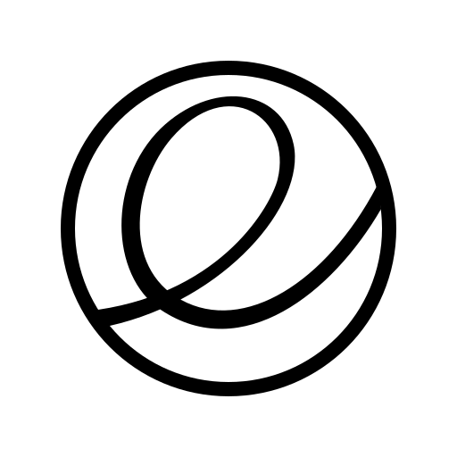 <code>elementaryos</code></a></td></tr>
<tr><td align="center"><a href="../logos/eliza-os.svg">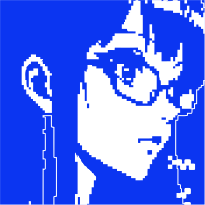 <code>eliza-os</code></a></td><td align="center"><a href="../logos/endeavouros.svg"> <code>endeavouros</code></a></td><td align="center"><a href="../logos/endeavouros-linux.svg"> <code>endeavouros-linux</code></a></td><td align="center"><a href="../logos/f-droid.svg"> <code>f-droid</code></a></td><td align="center"><a href="../logos/f-droid-wordmark.svg"> <code>f-droid-wordmark</code></a></td><td align="center"><a href="../logos/fedora.svg"> <code>fedora</code></a></td></tr>
<tr><td align="center"><a href="../logos/finder.svg"> <code>finder</code></a></td><td align="center"><a href="../logos/firefox.svg"> <code>firefox</code></a></td><td align="center"><a href="../logos/firefox-wordmark.svg"> <code>firefox-wordmark</code></a></td><td align="center"><a href="../logos/flatpak.svg"> <code>flatpak</code></a></td><td align="center"><a href="../logos/freebsd.svg"> <code>freebsd</code></a></td><td align="center"><a href="../logos/freebsd-wordmark.svg"> <code>freebsd-wordmark</code></a></td></tr>
<tr><td align="center"><a href="../logos/fuchsia.svg"> <code>fuchsia</code></a></td><td align="center"><a href="../logos/galliumos.svg"> <code>galliumos</code></a></td><td align="center"><a href="../logos/garuda-linux.svg"> <code>garuda-linux</code></a></td><td align="center"><a href="../logos/gentoo-linux.svg">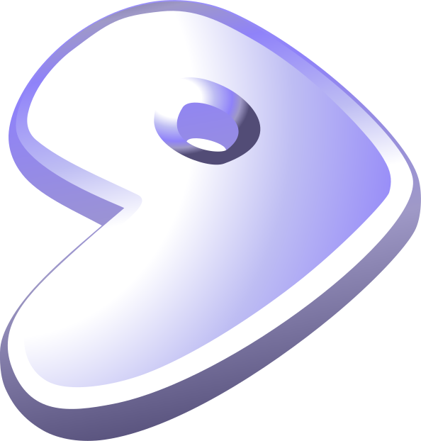 <code>gentoo-linux</code></a></td><td align="center"><a href="../logos/gnome.svg"> <code>gnome</code></a></td><td align="center"><a href="../logos/gnu.svg"> <code>gnu</code></a></td></tr>
<tr><td align="center"><a href="../logos/gnu-net.svg"> <code>gnu-net</code></a></td><td align="center"><a href="../logos/google-container-optimized-os.svg"> <code>google-container-optimized-os</code></a></td><td align="center"><a href="../logos/google-play.svg"> <code>google-play</code></a></td><td align="center"><a href="../logos/google-play-wordmark.svg"> <code>google-play-wordmark</code></a></td><td align="center"><a href="../logos/google-tv.svg"> <code>google-tv</code></a></td><td align="center"><a href="../logos/grapheneos.svg"> <code>grapheneos</code></a></td></tr>
<tr><td align="center"><a href="../logos/haiku.svg"> <code>haiku</code></a></td><td align="center"><a href="../logos/haiku-os.svg"> <code>haiku-os</code></a></td><td align="center"><a href="../logos/haiku-os-wordmark.svg"> <code>haiku-os-wordmark</code></a></td><td align="center"><a href="../logos/haiku-wordmark.svg"> <code>haiku-wordmark</code></a></td><td align="center"><a href="../logos/homedock-os.svg"> <code>homedock-os</code></a></td><td align="center"><a href="../logos/homekit.svg">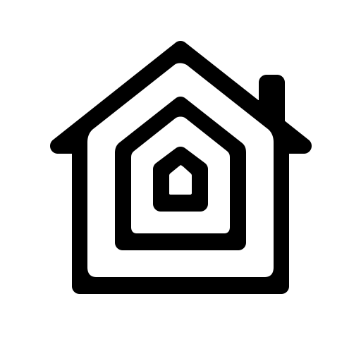 <code>homekit</code></a></td></tr>
<tr><td align="center"><a href="../logos/internetexplorer.svg"> <code>internetexplorer</code></a></td><td align="center"><a href="../logos/iode-os.svg"> <code>iode-os</code></a></td><td align="center"><a href="../logos/ios.svg"> <code>ios</code></a></td><td align="center"><a href="../logos/kaios.svg"> <code>kaios</code></a></td><td align="center"><a href="../logos/kali-linux.svg">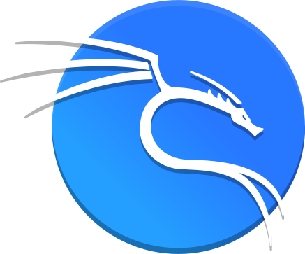 <code>kali-linux</code></a></td><td align="center"><a href="../logos/kali-linux-wordmark.svg"> <code>kali-linux-wordmark</code></a></td></tr>
<tr><td align="center"><a href="../logos/kde.svg">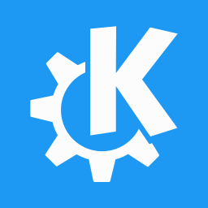 <code>kde</code></a></td><td align="center"><a href="../logos/kubuntu-linux.svg"> <code>kubuntu-linux</code></a></td><td align="center"><a href="../logos/linux.svg"> <code>linux</code></a></td><td align="center"><a href="../logos/linux-containers-lxc.svg">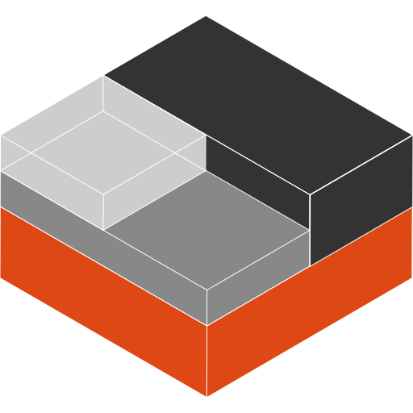 <code>linux-containers-lxc</code></a></td><td align="center"><a href="../logos/linux-mint.svg"> <code>linux-mint</code></a></td><td align="center"><a href="../logos/linux-professional-institute.svg"> <code>linux-professional-institute</code></a></td></tr>
<tr><td align="center"><a href="../logos/linux-tux.svg"> <code>linux-tux</code></a></td><td align="center"><a href="../logos/linux-update-dashboard.svg"> <code>linux-update-dashboard</code></a></td><td align="center"><a href="../logos/linux-wordmark.svg"> <code>linux-wordmark</code></a></td><td align="center"><a href="../logos/linuxdo.svg"> <code>linuxdo</code></a></td><td align="center"><a href="../logos/linuxgsm.svg"> <code>linuxgsm</code></a></td><td align="center"><a href="../logos/linuxserver.svg"> <code>linuxserver</code></a></td></tr>
<tr><td align="center"><a href="../logos/linuxserver-io.svg">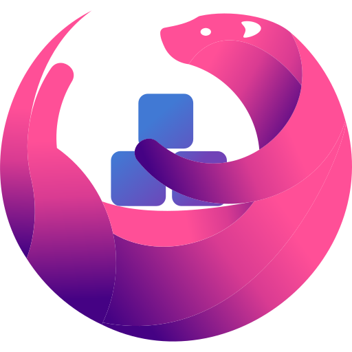 <code>linuxserver-io</code></a></td><td align="center"><a href="../logos/macos.svg"> <code>macos</code></a></td><td align="center"><a href="../logos/macosx.svg">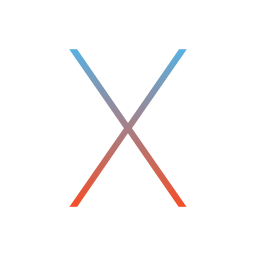 <code>macosx</code></a></td><td align="center"><a href="../logos/mageia.svg"> <code>mageia</code></a></td><td align="center"><a href="../logos/manjaro.svg"> <code>manjaro</code></a></td><td align="center"><a href="../logos/manjaro-linux.svg">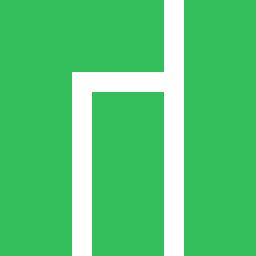 <code>manjaro-linux</code></a></td></tr>
<tr><td align="center"><a href="../logos/microsoft-edge.svg"> <code>microsoft-edge</code></a></td><td align="center"><a href="../logos/microsoft-edge-wordmark.svg"> <code>microsoft-edge-wordmark</code></a></td><td align="center"><a href="../logos/microsoft-windows.svg"> <code>microsoft-windows</code></a></td><td align="center"><a href="../logos/microsoft-windows-wordmark.svg"> <code>microsoft-windows-wordmark</code></a></td><td align="center"><a href="../logos/mx-linux.svg"> <code>mx-linux</code></a></td><td align="center"><a href="../logos/netbsd.svg"> <code>netbsd</code></a></td></tr>
<tr><td align="center"><a href="../logos/nixos.svg"> <code>nixos</code></a></td><td align="center"><a href="../logos/nixos-wordmark.svg"> <code>nixos-wordmark</code></a></td><td align="center"><a href="../logos/nobara.svg">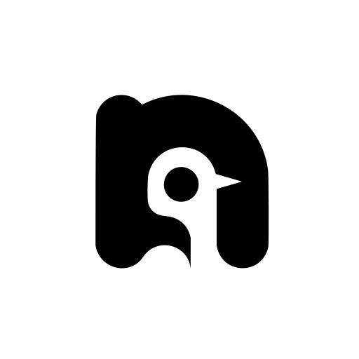 <code>nobara</code></a></td><td align="center"><a href="../logos/nobara-linux.svg"> <code>nobara-linux</code></a></td><td align="center"><a href="../logos/nodeos.svg">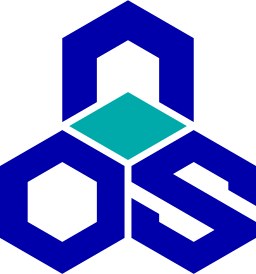 <code>nodeos</code></a></td><td align="center"><a href="../logos/opera.svg"> <code>opera</code></a></td></tr>
<tr><td align="center"><a href="../logos/opera-wordmark.svg"> <code>opera-wordmark</code></a></td><td align="center"><a href="../logos/parrotos.svg">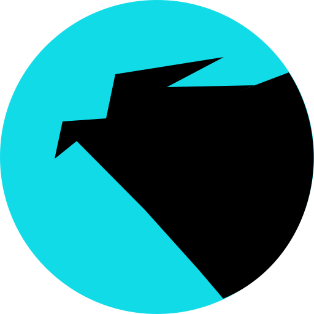 <code>parrotos</code></a></td><td align="center"><a href="../logos/popos.svg"> <code>popos</code></a></td><td align="center"><a href="../logos/postmarketos.svg"> <code>postmarketos</code></a></td><td align="center"><a href="../logos/postmarketos-wordmark.svg"> <code>postmarketos-wordmark</code></a></td><td align="center"><a href="../logos/prozilla-os.svg"> <code>prozilla-os</code></a></td></tr>
<tr><td align="center"><a href="../logos/puppy-linux.svg"> <code>puppy-linux</code></a></td><td align="center"><a href="../logos/qubes-os.svg"> <code>qubes-os</code></a></td><td align="center"><a href="../logos/raspberry-pi.svg">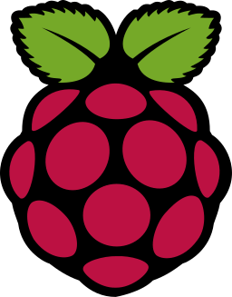 <code>raspberry-pi</code></a></td><td align="center"><a href="../logos/raspberry-pi-wordmark.svg"> <code>raspberry-pi-wordmark</code></a></td><td align="center"><a href="../logos/redhat-linux.svg"> <code>redhat-linux</code></a></td><td align="center"><a href="../logos/resurrection-remix-os.svg"> <code>resurrection-remix-os</code></a></td></tr>
<tr><td align="center"><a href="../logos/rocky-linux.svg"> <code>rocky-linux</code></a></td><td align="center"><a href="../logos/rocky-linux-wordmark.svg"> <code>rocky-linux-wordmark</code></a></td><td align="center"><a href="../logos/safari.svg">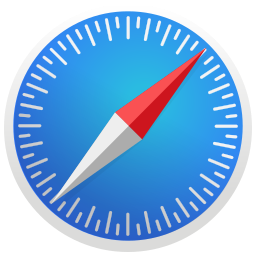 <code>safari</code></a></td><td align="center"><a href="../logos/samsung-internet.svg"> <code>samsung-internet</code></a></td><td align="center"><a href="../logos/tor-browser.svg"> <code>tor-browser</code></a></td><td align="center"><a href="../logos/turnkey-linux.svg"> <code>turnkey-linux</code></a></td></tr>
<tr><td align="center"><a href="../logos/ubuntu.svg"> <code>ubuntu</code></a></td><td align="center"><a href="../logos/ubuntu-linux.svg"> <code>ubuntu-linux</code></a></td><td align="center"><a href="../logos/ubuntu-linux-alt.svg"> <code>ubuntu-linux-alt</code></a></td><td align="center"><a href="../logos/ubuntu-wordmark.svg"> <code>ubuntu-wordmark</code></a></td><td align="center"><a href="../logos/vivaldi.svg"> <code>vivaldi</code></a></td><td align="center"><a href="../logos/vivaldi-wordmark.svg"> <code>vivaldi-wordmark</code></a></td></tr>
<tr><td align="center"><a href="../logos/void.svg"> <code>void</code></a></td><td align="center"><a href="../logos/void-linux.svg"> <code>void-linux</code></a></td><td align="center"><a href="../logos/wayland.svg"> <code>wayland</code></a></td><td align="center"><a href="../logos/wearos.svg"> <code>wearos</code></a></td><td align="center"><a href="../logos/webkit.svg"> <code>webkit</code></a></td><td align="center"><a href="../logos/x11.svg"> <code>x11</code></a></td></tr>
<tr><td align="center"><a href="../logos/xubuntu-linux.svg"> <code>xubuntu-linux</code></a></td><td align="center"><a href="../logos/zen-browser.svg"> <code>zen-browser</code></a></td><td align="center"><a href="../logos/zen-browser-wordmark.svg"> <code>zen-browser-wordmark</code></a></td><td align="center"><a href="../logos/zorin-linux.svg">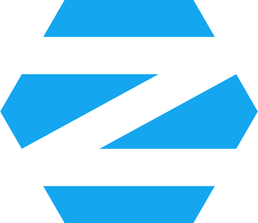 <code>zorin-linux</code></a></td><td align="center"><a href="../logos/zorin-os.svg"> <code>zorin-os</code></a></td></tr>
</table>

[⬅️ Back to the full catalog](../README.md)
