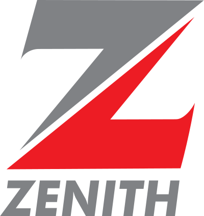

# 💳 Payments, Fintech & Crypto (2428)

[⬅️ Back to the full catalog](../README.md) · [🖼️ Browse & download on the website](https://logos.lndev.me/)

Page [1](./pay.md) · **2**

<table>
<tr><td align="center"><a href="../logos/xprt.svg"> <code>xprt</code></a></td><td align="center"><a href="../logos/xrp.svg"> <code>xrp</code></a></td><td align="center"><a href="../logos/xrune.svg"> <code>xrune</code></a></td><td align="center"><a href="../logos/xsgd.svg"> <code>xsgd</code></a></td><td align="center"><a href="../logos/xsushi.svg"> <code>xsushi</code></a></td><td align="center"><a href="../logos/xtrabytes.svg"> <code>xtrabytes</code></a></td></tr>
<tr><td align="center"><a href="../logos/xwin.svg"> <code>xwin</code></a></td><td align="center"><a href="../logos/yearn-finance.svg"> <code>yearn-finance</code></a></td><td align="center"><a href="../logos/yfii.svg"> <code>yfii</code></a></td><td align="center"><a href="../logos/yoshi.svg"> <code>yoshi</code></a></td><td align="center"><a href="../logos/yoyow.svg"> <code>yoyow</code></a></td><td align="center"><a href="../logos/zano.svg"> <code>zano</code></a></td></tr>
<tr><td align="center"><a href="../logos/zclassic.svg"> <code>zclassic</code></a></td><td align="center"><a href="../logos/zcoin.svg"> <code>zcoin</code></a></td><td align="center"><a href="../logos/zelcash.svg"> <code>zelcash</code></a></td><td align="center"><a href="../logos/zengo.svg"> <code>zengo</code></a></td><td align="center"><a href="../logos/zenith-bank.svg"> <code>zenith-bank</code></a></td><td align="center"><a href="../logos/zerion.svg"> <code>zerion</code></a></td></tr>
<tr><td align="center"><a href="../logos/zero.svg"> <code>zero</code></a></td><td align="center"><a href="../logos/zero-network.svg"> <code>zero-network</code></a></td><td align="center"><a href="../logos/zeta-chain.svg"> <code>zeta-chain</code></a></td><td align="center"><a href="../logos/zilliqa.svg"> <code>zilliqa</code></a></td><td align="center"><a href="../logos/zircuit.svg"> <code>zircuit</code></a></td><td align="center"><a href="../logos/zkid.svg"> <code>zkid</code></a></td></tr>
<tr><td align="center"><a href="../logos/zksync.svg"> <code>zksync</code></a></td><td align="center"><a href="../logos/zoomer.svg"> <code>zoomer</code></a></td><td align="center"><a href="../logos/zora.svg"> <code>zora</code></a></td><td align="center"><a href="../logos/zpay.svg"> <code>zpay</code></a></td></tr>
</table>

Page [1](./pay.md) · **2**

[⬅️ Back to the full catalog](../README.md)
