# 📋 Productivity & Collaboration (2943)

[⬅️ Back to the full catalog](../README.md) · [🖼️ Browse & download on the website](https://logos.lndev.me/)

Page **1** · [2](./prod-2.md)

<table>
<tr><td align="center"><a href="../logos/1337x.svg"> <code>1337x</code></a></td><td align="center"><a href="../logos/13ft.svg">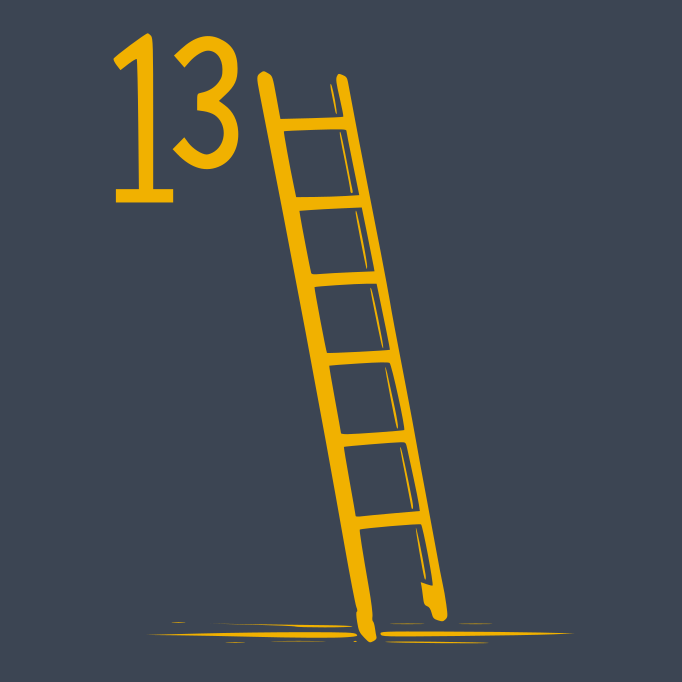 <code>13ft</code></a></td><td align="center"><a href="../logos/1panel.svg"> <code>1panel</code></a></td><td align="center"><a href="../logos/20i.svg"> <code>20i</code></a></td><td align="center"><a href="../logos/2dehands.svg"> <code>2dehands</code></a></td><td align="center"><a href="../logos/2fauth.svg">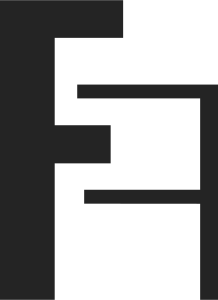 <code>2fauth</code></a></td></tr>
<tr><td align="center"><a href="../logos/3cx.svg"> <code>3cx</code></a></td><td align="center"><a href="../logos/4chan.svg"> <code>4chan</code></a></td><td align="center"><a href="../logos/5etools.svg">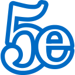 <code>5etools</code></a></td><td align="center"><a href="../logos/7zip.svg"> <code>7zip</code></a></td><td align="center"><a href="../logos/8311.svg"> <code>8311</code></a></td><td align="center"><a href="../logos/8mb-local.svg">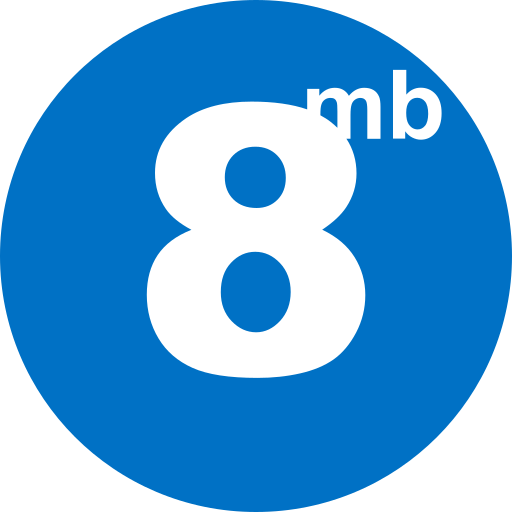 <code>8mb-local</code></a></td></tr>
<tr><td align="center"><a href="../logos/9router.svg"> <code>9router</code></a></td><td align="center"><a href="../logos/a-mule.svg">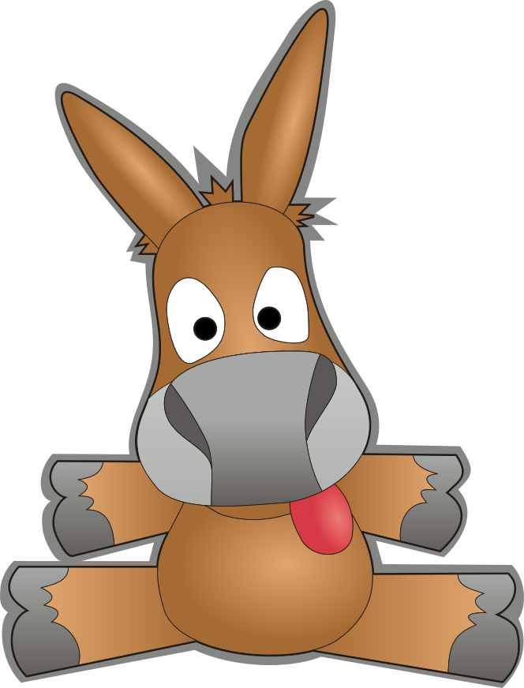 <code>a-mule</code></a></td><td align="center"><a href="../logos/aboard.svg"> <code>aboard</code></a></td><td align="center"><a href="../logos/accent.svg"> <code>accent</code></a></td><td align="center"><a href="../logos/ackee.svg">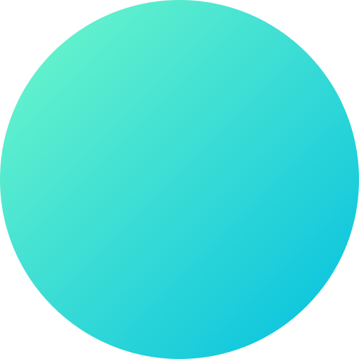 <code>ackee</code></a></td><td align="center"><a href="../logos/ackify.svg"> <code>ackify</code></a></td></tr>
<tr><td align="center"><a href="../logos/acquiremock.svg">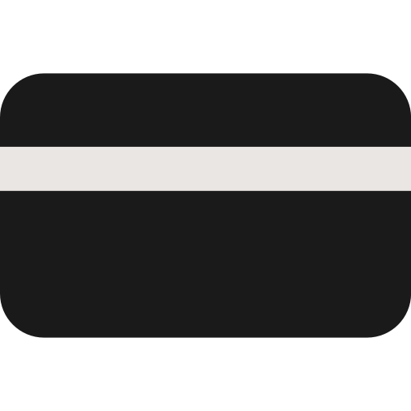 <code>acquiremock</code></a></td><td align="center"><a href="../logos/acrobat-reader.svg"> <code>acrobat-reader</code></a></td><td align="center"><a href="../logos/acrobat-scan.svg"> <code>acrobat-scan</code></a></td><td align="center"><a href="../logos/action1.svg"> <code>action1</code></a></td><td align="center"><a href="../logos/activepieces.svg">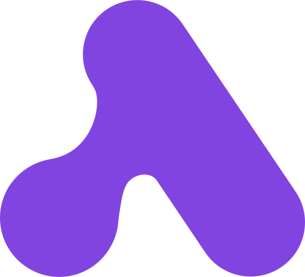 <code>activepieces</code></a></td><td align="center"><a href="../logos/actual-budget.svg"> <code>actual-budget</code></a></td></tr>
<tr><td align="center"><a href="../logos/adguard-home.svg"> <code>adguard-home</code></a></td><td align="center"><a href="../logos/adguard-home-central-manager.svg"> <code>adguard-home-central-manager</code></a></td><td align="center"><a href="../logos/adguard-home-sync.svg">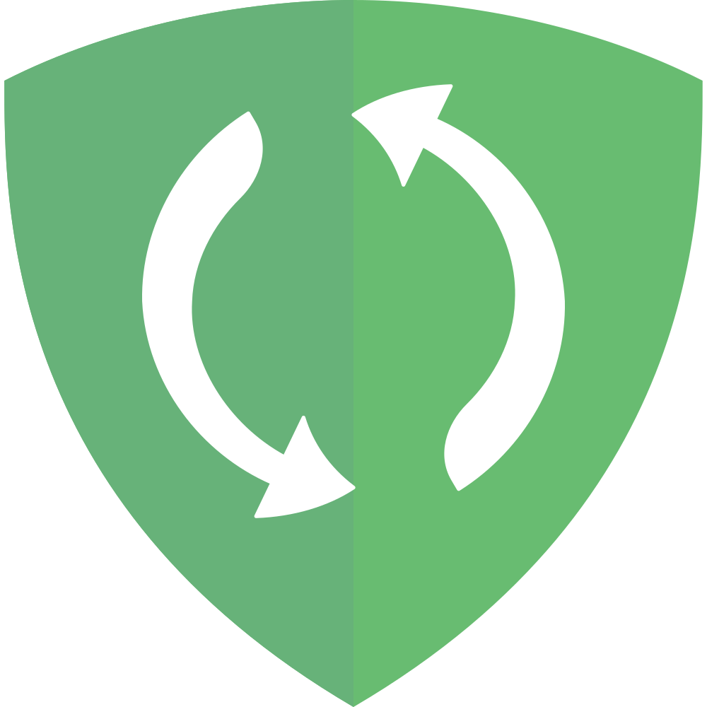 <code>adguard-home-sync</code></a></td><td align="center"><a href="../logos/adminer.svg"> <code>adminer</code></a></td><td align="center"><a href="../logos/adminerevo.svg">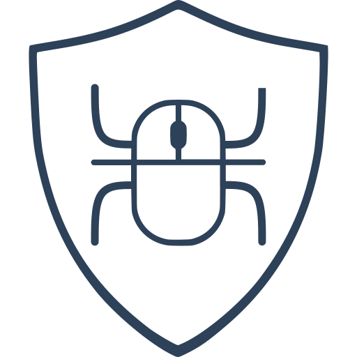 <code>adminerevo</code></a></td><td align="center"><a href="../logos/adnanh-webhook.svg">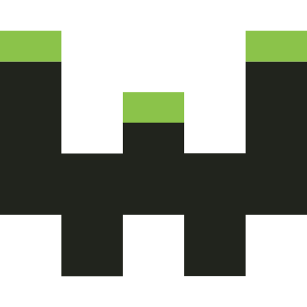 <code>adnanh-webhook</code></a></td></tr>
<tr><td align="center"><a href="../logos/adobe-audition.svg"> <code>adobe-audition</code></a></td><td align="center"><a href="../logos/adobe-bridge.svg"> <code>adobe-bridge</code></a></td><td align="center"><a href="../logos/adobe-captivate.svg"> <code>adobe-captivate</code></a></td><td align="center"><a href="../logos/adobe-captivate-prime.svg"> <code>adobe-captivate-prime</code></a></td><td align="center"><a href="../logos/adobe-character-animator.svg"> <code>adobe-character-animator</code></a></td><td align="center"><a href="../logos/adobe-connect.svg"> <code>adobe-connect</code></a></td></tr>
<tr><td align="center"><a href="../logos/adobe-digital-editions.svg"> <code>adobe-digital-editions</code></a></td><td align="center"><a href="../logos/adobe-fill-and-sign.svg"> <code>adobe-fill-and-sign</code></a></td><td align="center"><a href="../logos/adobe-firefly.svg"> <code>adobe-firefly</code></a></td><td align="center"><a href="../logos/adobe-framemaker.svg"> <code>adobe-framemaker</code></a></td><td align="center"><a href="../logos/adobe-framemaker-server.svg"> <code>adobe-framemaker-server</code></a></td><td align="center"><a href="../logos/adobe-http-dynamic-streaming.svg"> <code>adobe-http-dynamic-streaming</code></a></td></tr>
<tr><td align="center"><a href="../logos/adobe-indesign-server.svg"> <code>adobe-indesign-server</code></a></td><td align="center"><a href="../logos/adobe-lightroom-classic.svg"> <code>adobe-lightroom-classic</code></a></td><td align="center"><a href="../logos/adobe-media-encoder.svg"> <code>adobe-media-encoder</code></a></td><td align="center"><a href="../logos/adobe-media-server.svg"> <code>adobe-media-server</code></a></td><td align="center"><a href="../logos/adobe-portfolio.svg"> <code>adobe-portfolio</code></a></td><td align="center"><a href="../logos/adobe-premiere-elements.svg"> <code>adobe-premiere-elements</code></a></td></tr>
<tr><td align="center"><a href="../logos/adobe-premiere-pro.svg"> <code>adobe-premiere-pro</code></a></td><td align="center"><a href="../logos/adobe-premiere-rush.svg"> <code>adobe-premiere-rush</code></a></td><td align="center"><a href="../logos/adobe-presenter-video-express.svg"> <code>adobe-presenter-video-express</code></a></td><td align="center"><a href="../logos/adobe-robohelp.svg"> <code>adobe-robohelp</code></a></td><td align="center"><a href="../logos/adobe-robohelp-server.svg"> <code>adobe-robohelp-server</code></a></td><td align="center"><a href="../logos/adobe-sign.svg"> <code>adobe-sign</code></a></td></tr>
<tr><td align="center"><a href="../logos/adobe-technical-communication-suite.svg"> <code>adobe-technical-communication-suite</code></a></td><td align="center"><a href="../logos/advanzia.svg"> <code>advanzia</code></a></td><td align="center"><a href="../logos/adventure-log.svg">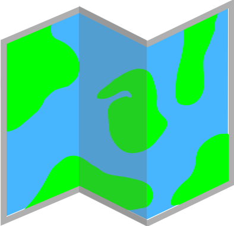 <code>adventure-log</code></a></td><td align="center"><a href="../logos/aerie.svg">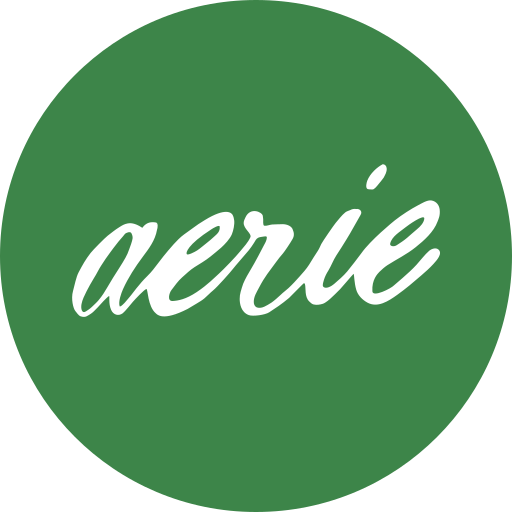 <code>aerie</code></a></td><td align="center"><a href="../logos/aeterna.svg"> <code>aeterna</code></a></td><td align="center"><a href="../logos/affine.svg"> <code>affine</code></a></td></tr>
<tr><td align="center"><a href="../logos/affinity-photo.svg"> <code>affinity-photo</code></a></td><td align="center"><a href="../logos/affinity-publisher.svg"> <code>affinity-publisher</code></a></td><td align="center"><a href="../logos/agam-space.svg"> <code>agam-space</code></a></td><td align="center"><a href="../logos/agent-dvr.svg">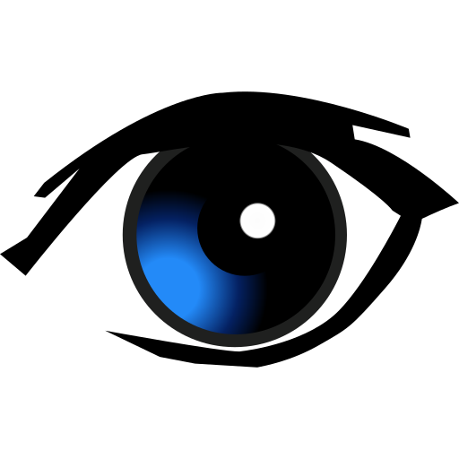 <code>agent-dvr</code></a></td><td align="center"><a href="../logos/agent-zero.svg">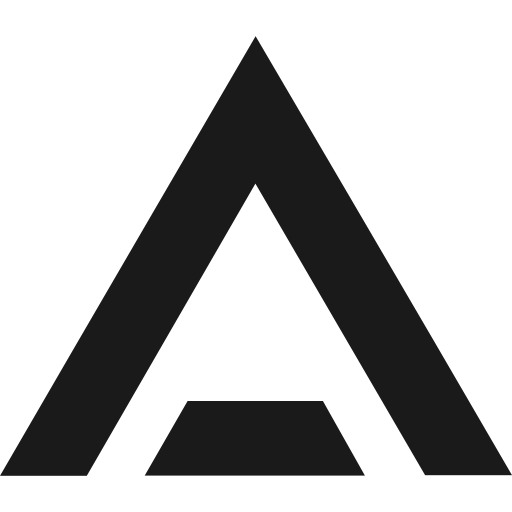 <code>agent-zero</code></a></td><td align="center"><a href="../logos/agregarr.svg"> <code>agregarr</code></a></td></tr>
<tr><td align="center"><a href="../logos/aha.svg"> <code>aha</code></a></td><td align="center"><a href="../logos/aiostreams.svg"> <code>aiostreams</code></a></td><td align="center"><a href="../logos/air-trail.svg"> <code>air-trail</code></a></td><td align="center"><a href="../logos/airpipe.svg">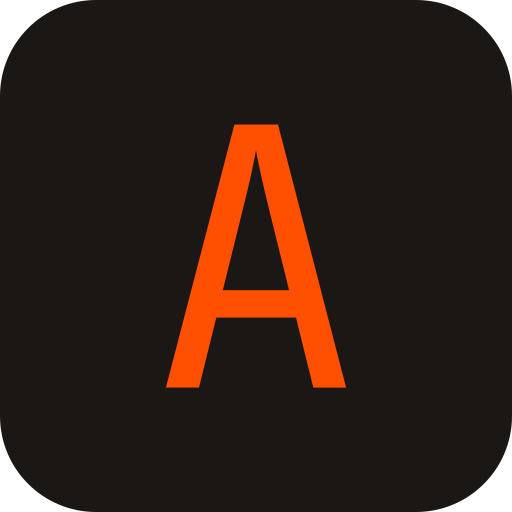 <code>airpipe</code></a></td><td align="center"><a href="../logos/airsonic.svg"> <code>airsonic</code></a></td><td align="center"><a href="../logos/airtable.svg"> <code>airtable</code></a></td></tr>
<tr><td align="center"><a href="../logos/airtable-wordmark.svg"> <code>airtable-wordmark</code></a></td><td align="center"><a href="../logos/airtel.svg"> <code>airtel</code></a></td><td align="center"><a href="../logos/akaunting.svg">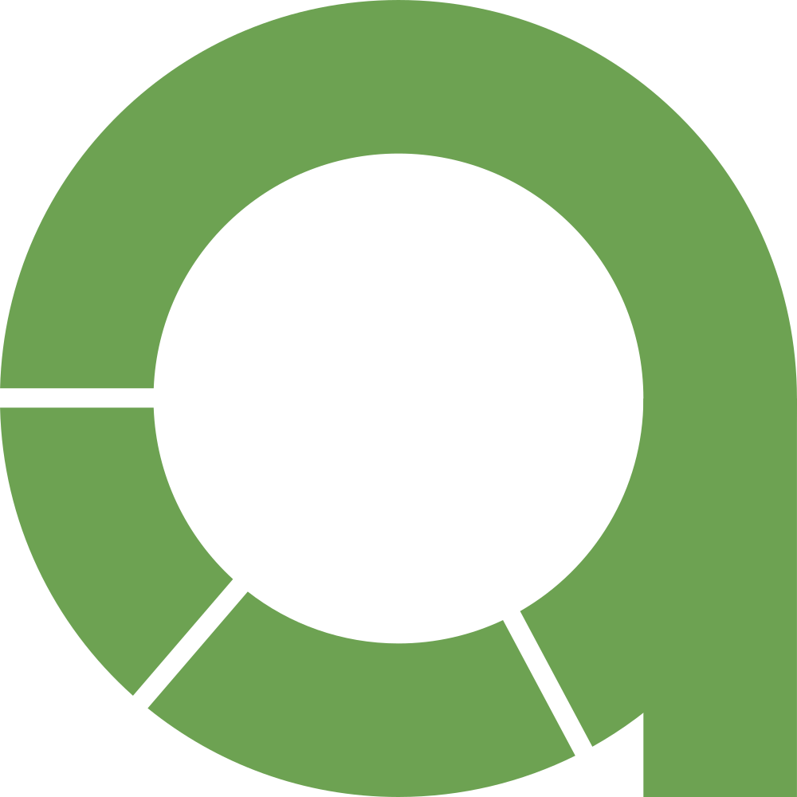 <code>akaunting</code></a></td><td align="center"><a href="../logos/akkoma.svg"> <code>akkoma</code></a></td><td align="center"><a href="../logos/aks-automatic.svg"> <code>aks-automatic</code></a></td><td align="center"><a href="../logos/alarmpi.svg"> <code>alarmpi</code></a></td></tr>
<tr><td align="center"><a href="../logos/alaska-airlines.svg"> <code>alaska-airlines</code></a></td><td align="center"><a href="../logos/albert-heijn.svg">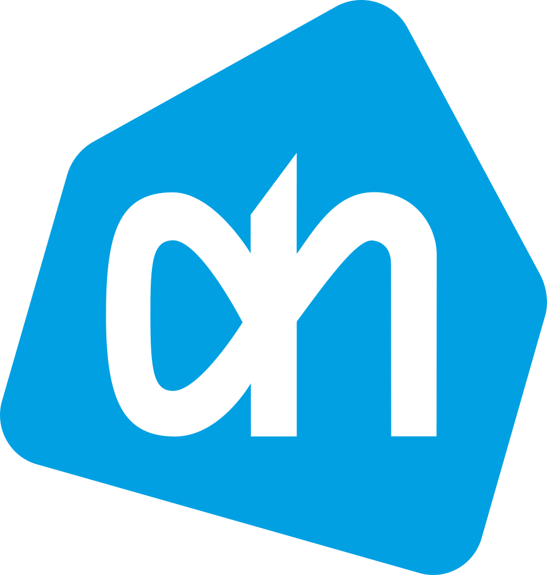 <code>albert-heijn</code></a></td><td align="center"><a href="../logos/alby-hub.svg"> <code>alby-hub</code></a></td><td align="center"><a href="../logos/alertmanager.svg"> <code>alertmanager</code></a></td><td align="center"><a href="../logos/alexa.svg"> <code>alexa</code></a></td><td align="center"><a href="../logos/alexandrie.svg"> <code>alexandrie</code></a></td></tr>
<tr><td align="center"><a href="../logos/aliasvault.svg"> <code>aliasvault</code></a></td><td align="center"><a href="../logos/alibaba.svg"> <code>alibaba</code></a></td><td align="center"><a href="../logos/alist.svg">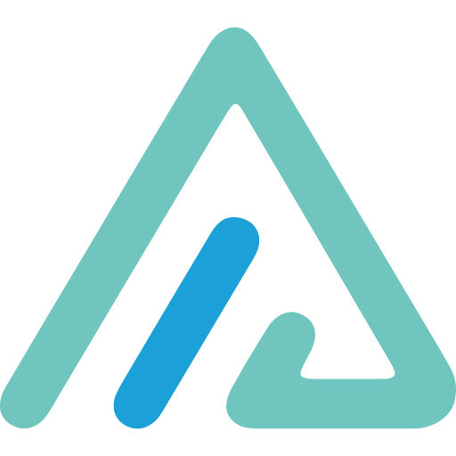 <code>alist</code></a></td><td align="center"><a href="../logos/aliyun.svg"> <code>aliyun</code></a></td><td align="center"><a href="../logos/alloy.svg"> <code>alloy</code></a></td><td align="center"><a href="../logos/altcha.svg"> <code>altcha</code></a></td></tr>
<tr><td align="center"><a href="../logos/amazon-luna.svg"> <code>amazon-luna</code></a></td><td align="center"><a href="../logos/amazon-prime.svg"> <code>amazon-prime</code></a></td><td align="center"><a href="../logos/amazon-rds.svg">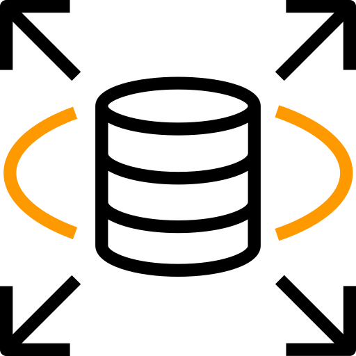 <code>amazon-rds</code></a></td><td align="center"><a href="../logos/amazon-web-services.svg"> <code>amazon-web-services</code></a></td><td align="center"><a href="../logos/ambys.svg"> <code>ambys</code></a></td><td align="center"><a href="../logos/amcrest.svg"> <code>amcrest</code></a></td></tr>
<tr><td align="center"><a href="../logos/american-eagle.svg">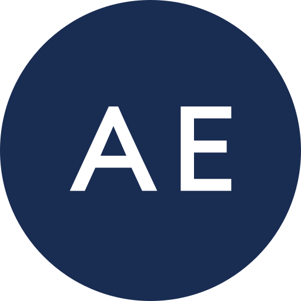 <code>american-eagle</code></a></td><td align="center"><a href="../logos/amicoscript.svg">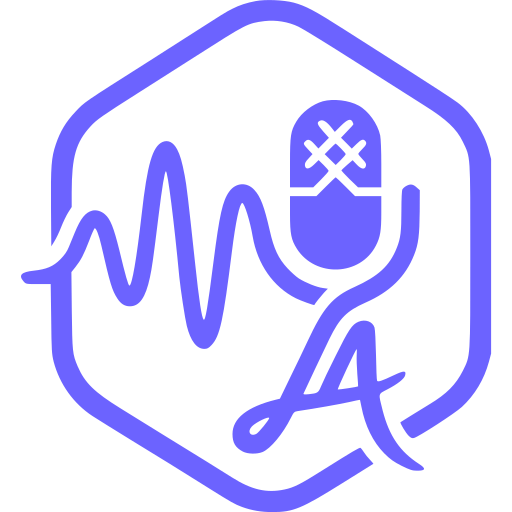 <code>amicoscript</code></a></td><td align="center"><a href="../logos/amnezia.svg">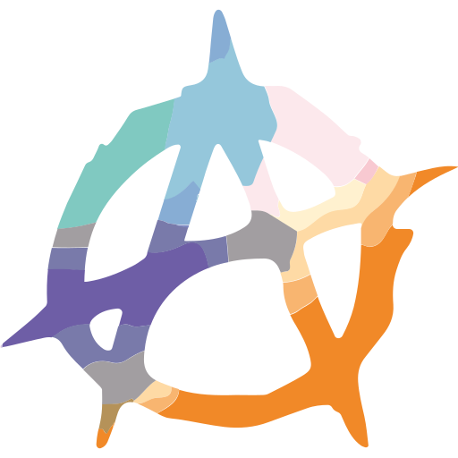 <code>amnezia</code></a></td><td align="center"><a href="../logos/amurex.svg"> <code>amurex</code></a></td><td align="center"><a href="../logos/an-otter-wiki.svg"> <code>an-otter-wiki</code></a></td><td align="center"><a href="../logos/anaconda-wordmark.svg"> <code>anaconda-wordmark</code></a></td></tr>
<tr><td align="center"><a href="../logos/anchr.svg"> <code>anchr</code></a></td><td align="center"><a href="../logos/android-auto.svg"> <code>android-auto</code></a></td><td align="center"><a href="../logos/android-police.svg">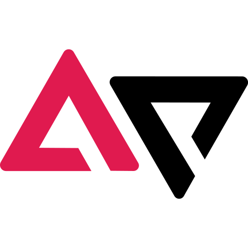 <code>android-police</code></a></td><td align="center"><a href="../logos/android-robot.svg"> <code>android-robot</code></a></td><td align="center"><a href="../logos/angel-studios.svg"> <code>angel-studios</code></a></td><td align="center"><a href="../logos/anibridge.svg"> <code>anibridge</code></a></td></tr>
<tr><td align="center"><a href="../logos/animation-digital-network.svg">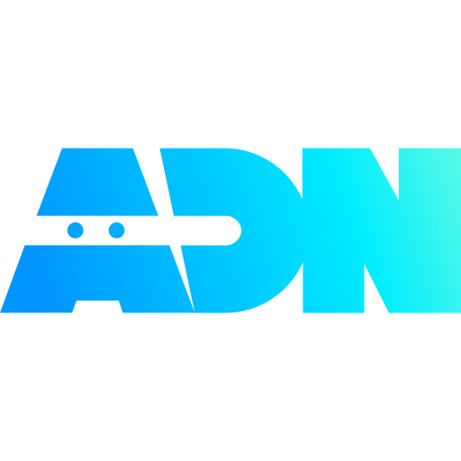 <code>animation-digital-network</code></a></td><td align="center"><a href="../logos/anime-kai.svg"> <code>anime-kai</code></a></td><td align="center"><a href="../logos/anonaddy.svg"> <code>anonaddy</code></a></td><td align="center"><a href="../logos/anonymousoverflow.svg">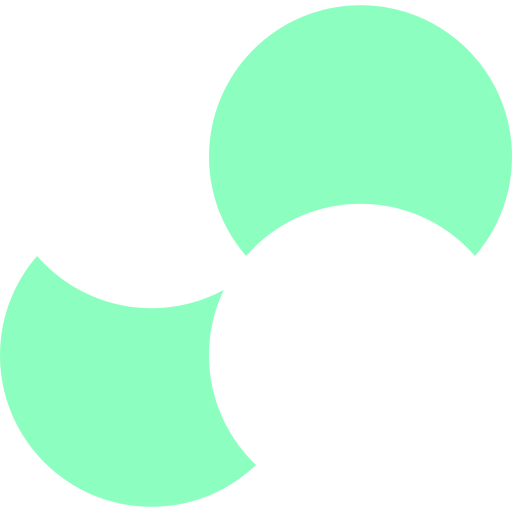 <code>anonymousoverflow</code></a></td><td align="center"><a href="../logos/antora.svg">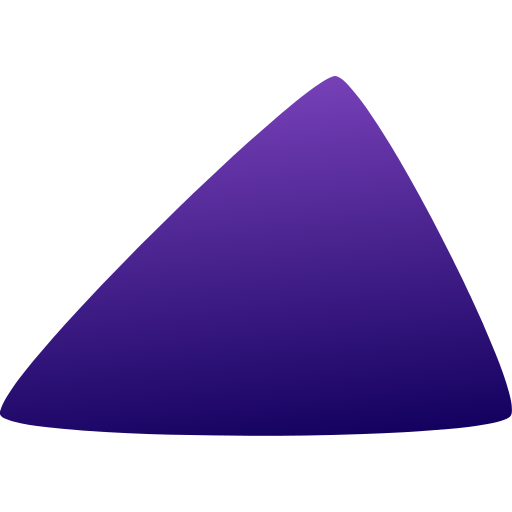 <code>antora</code></a></td><td align="center"><a href="../logos/antville.svg">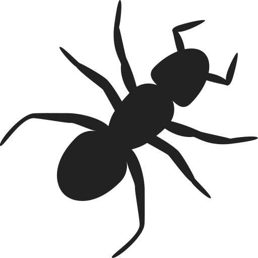 <code>antville</code></a></td></tr>
<tr><td align="center"><a href="../logos/any-listen.svg"> <code>any-listen</code></a></td><td align="center"><a href="../logos/anyappstart.svg"> <code>anyappstart</code></a></td><td align="center"><a href="../logos/anycable.svg">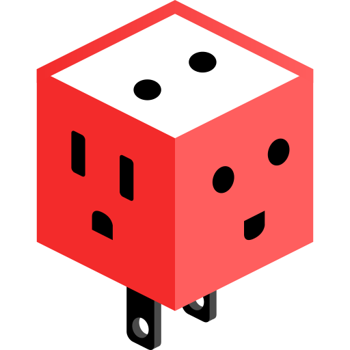 <code>anycable</code></a></td><td align="center"><a href="../logos/anydesk.svg"> <code>anydesk</code></a></td><td align="center"><a href="../logos/anytype.svg">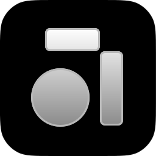 <code>anytype</code></a></td><td align="center"><a href="../logos/aonsoku.svg"> <code>aonsoku</code></a></td></tr>
<tr><td align="center"><a href="../logos/apc.svg"> <code>apc</code></a></td><td align="center"><a href="../logos/apiscp.svg"> <code>apiscp</code></a></td><td align="center"><a href="../logos/apollo-io.svg"> <code>apollo-io</code></a></td><td align="center"><a href="../logos/apollo-io-wordmark.svg"> <code>apollo-io-wordmark</code></a></td><td align="center"><a href="../logos/apostrophecms.svg">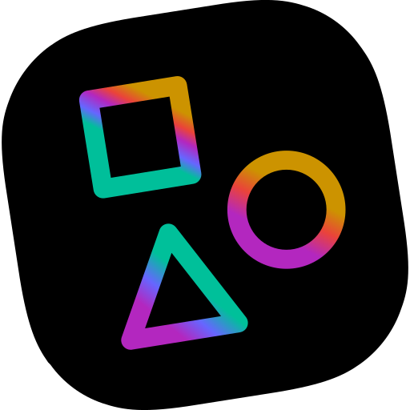 <code>apostrophecms</code></a></td><td align="center"><a href="../logos/app-service.svg"> <code>app-service</code></a></td></tr>
<tr><td align="center"><a href="../logos/appflowy.svg"> <code>appflowy</code></a></td><td align="center"><a href="../logos/apple-alt.svg"> <code>apple-alt</code></a></td><td align="center"><a href="../logos/apple-homekit.svg"> <code>apple-homekit</code></a></td><td align="center"><a href="../logos/apple-maps.svg">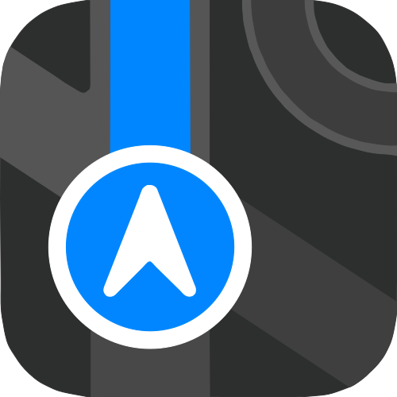 <code>apple-maps</code></a></td><td align="center"><a href="../logos/apple-retro.svg">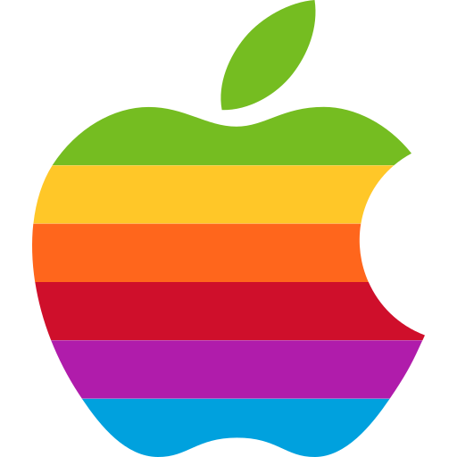 <code>apple-retro</code></a></td><td align="center"><a href="../logos/application-gateway-container.svg"> <code>application-gateway-container</code></a></td></tr>
<tr><td align="center"><a href="../logos/application-gateways.svg"> <code>application-gateways</code></a></td><td align="center"><a href="../logos/apprise.svg"> <code>apprise</code></a></td><td align="center"><a href="../logos/aptabase.svg">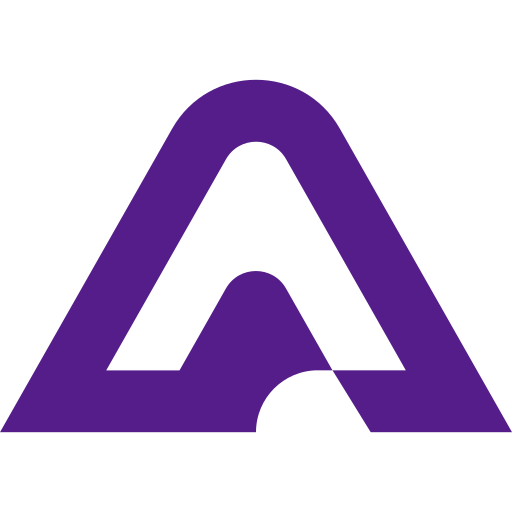 <code>aptabase</code></a></td><td align="center"><a href="../logos/ara-records-ansible.svg"> <code>ara-records-ansible</code></a></td><td align="center"><a href="../logos/arcane.svg">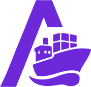 <code>arcane</code></a></td><td align="center"><a href="../logos/archidekt.svg"> <code>archidekt</code></a></td></tr>
<tr><td align="center"><a href="../logos/archiesteamfarm.svg">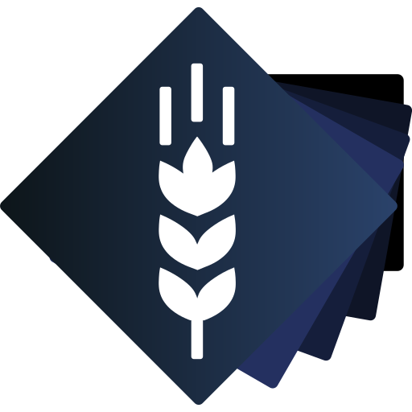 <code>archiesteamfarm</code></a></td><td align="center"><a href="../logos/archivebox.svg"> <code>archivebox</code></a></td><td align="center"><a href="../logos/archivedotorg.svg"> <code>archivedotorg</code></a></td><td align="center"><a href="../logos/argo-cd.svg"> <code>argo-cd</code></a></td><td align="center"><a href="../logos/argon-theme.svg"> <code>argon-theme</code></a></td><td align="center"><a href="../logos/argus.svg">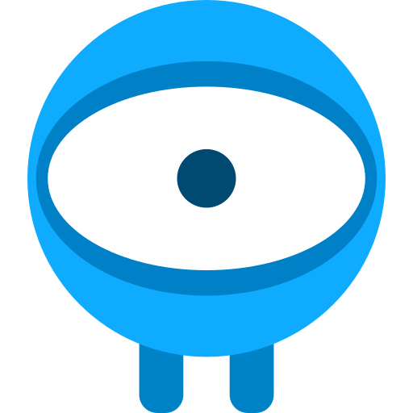 <code>argus</code></a></td></tr>
<tr><td align="center"><a href="../logos/aria2.svg"> <code>aria2</code></a></td><td align="center"><a href="../logos/armbian.svg"> <code>armbian</code></a></td><td align="center"><a href="../logos/arrmatey.svg"> <code>arrmatey</code></a></td><td align="center"><a href="../logos/artifacthub.svg">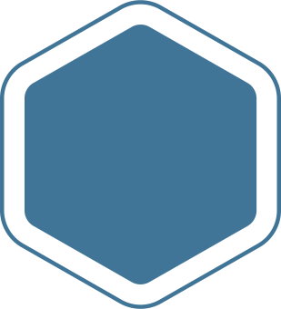 <code>artifacthub</code></a></td><td align="center"><a href="../logos/artifactory.svg">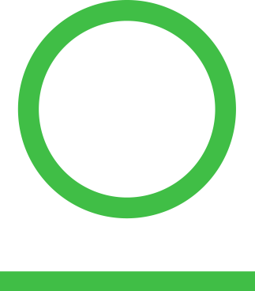 <code>artifactory</code></a></td><td align="center"><a href="../logos/aruba.svg"> <code>aruba</code></a></td></tr>
<tr><td align="center"><a href="../logos/asana.svg">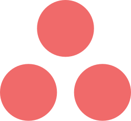 <code>asana</code></a></td><td align="center"><a href="../logos/asana-wordmark.svg"> <code>asana-wordmark</code></a></td><td align="center"><a href="../logos/asciinema.svg">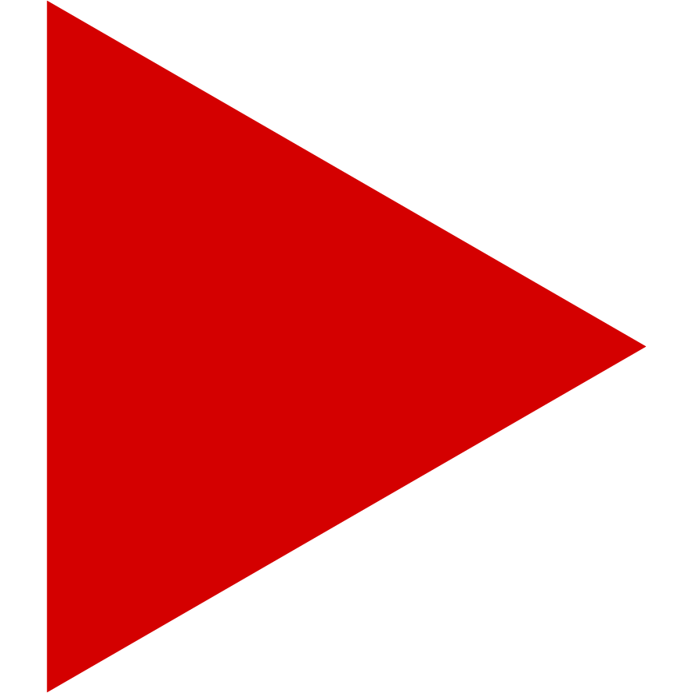 <code>asciinema</code></a></td><td align="center"><a href="../logos/ashim.svg">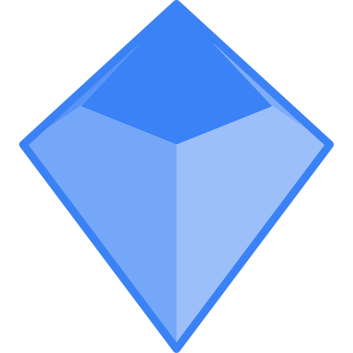 <code>ashim</code></a></td><td align="center"><a href="../logos/asp-net-core.svg">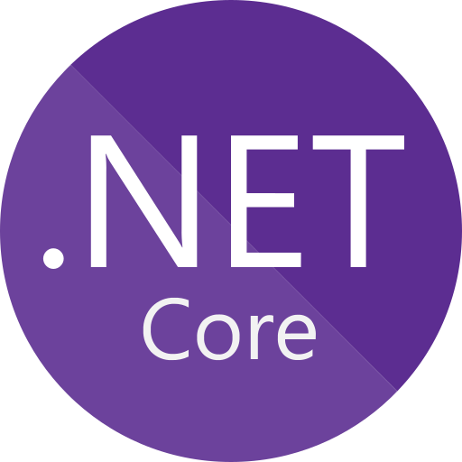 <code>asp-net-core</code></a></td><td align="center"><a href="../logos/asrock.svg"> <code>asrock</code></a></td></tr>
<tr><td align="center"><a href="../logos/asrock-rack.svg"> <code>asrock-rack</code></a></td><td align="center"><a href="../logos/astral.svg"> <code>astral</code></a></td><td align="center"><a href="../logos/astrbot.svg"> <code>astrbot</code></a></td><td align="center"><a href="../logos/astroluma.svg"> <code>astroluma</code></a></td><td align="center"><a href="../logos/astuto.svg"> <code>astuto</code></a></td><td align="center"><a href="../logos/asus-full.svg"> <code>asus-full</code></a></td></tr>
<tr><td align="center"><a href="../logos/asus-rog.svg"> <code>asus-rog</code></a></td><td align="center"><a href="../logos/asus-router.svg">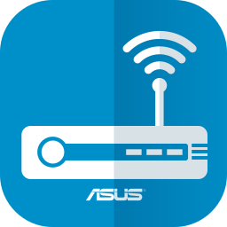 <code>asus-router</code></a></td><td align="center"><a href="../logos/asustor.svg"> <code>asustor</code></a></td><td align="center"><a href="../logos/atera.svg">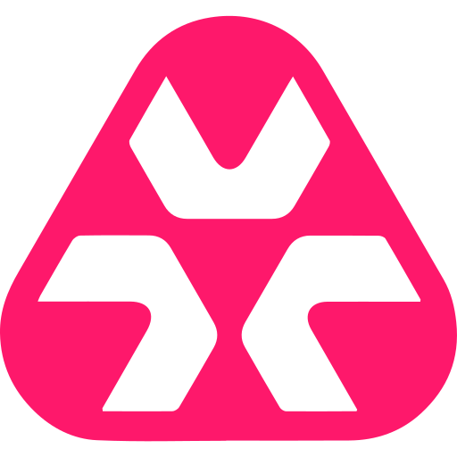 <code>atera</code></a></td><td align="center"><a href="../logos/atlas-network.svg">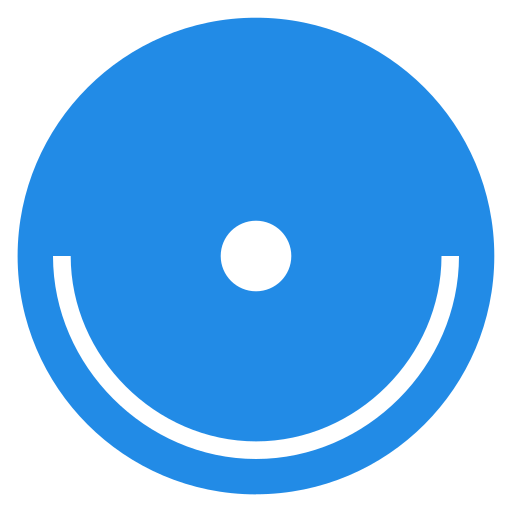 <code>atlas-network</code></a></td><td align="center"><a href="../logos/atlasnode.svg">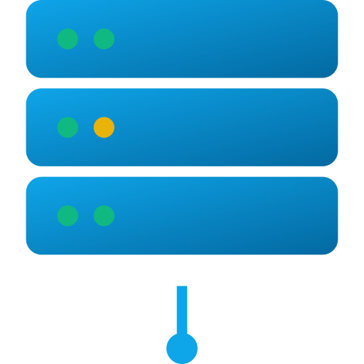 <code>atlasnode</code></a></td></tr>
<tr><td align="center"><a href="../logos/atlassian-bitbucket.svg"> <code>atlassian-bitbucket</code></a></td><td align="center"><a href="../logos/atlassian-confluence.svg"> <code>atlassian-confluence</code></a></td><td align="center"><a href="../logos/atlassian-opsgenie.svg"> <code>atlassian-opsgenie</code></a></td><td align="center"><a href="../logos/atlassian-trello.svg"> <code>atlassian-trello</code></a></td><td align="center"><a href="../logos/atria.svg"> <code>atria</code></a></td><td align="center"><a href="../logos/attic-assets.svg"> <code>attic-assets</code></a></td></tr>
<tr><td align="center"><a href="../logos/atuin.svg">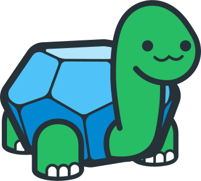 <code>atuin</code></a></td><td align="center"><a href="../logos/audacity.svg"> <code>audacity</code></a></td><td align="center"><a href="../logos/audiobookrequest.svg"> <code>audiobookrequest</code></a></td><td align="center"><a href="../logos/audiobookshelf.svg"> <code>audiobookshelf</code></a></td><td align="center"><a href="../logos/audiodeck.svg"> <code>audiodeck</code></a></td><td align="center"><a href="../logos/audora.svg"> <code>audora</code></a></td></tr>
<tr><td align="center"><a href="../logos/aura.svg"> <code>aura</code></a></td><td align="center"><a href="../logos/auracast.svg"> <code>auracast</code></a></td><td align="center"><a href="../logos/aureus.svg">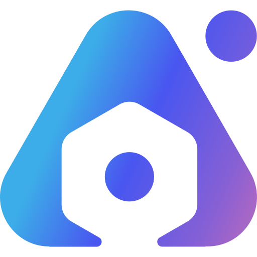 <code>aureus</code></a></td><td align="center"><a href="../logos/aurral.svg">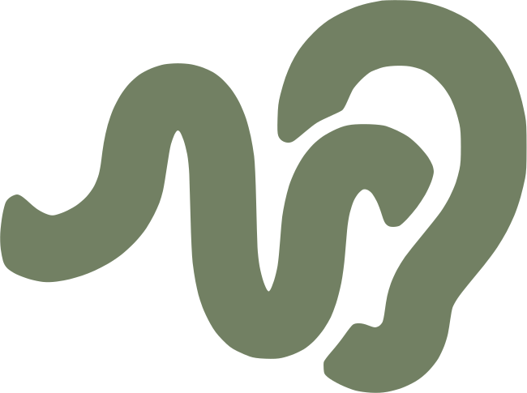 <code>aurral</code></a></td><td align="center"><a href="../logos/authelia.svg"> <code>authelia</code></a></td><td align="center"><a href="../logos/authentik.svg"> <code>authentik</code></a></td></tr>
<tr><td align="center"><a href="../logos/authgear.svg">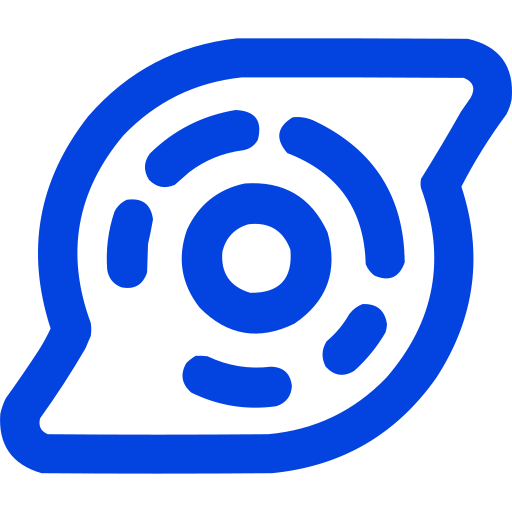 <code>authgear</code></a></td><td align="center"><a href="../logos/authman.svg"> <code>authman</code></a></td><td align="center"><a href="../logos/authportal.svg"> <code>authportal</code></a></td><td align="center"><a href="../logos/auto-cad.svg"> <code>auto-cad</code></a></td><td align="center"><a href="../logos/autobangumi.svg"> <code>autobangumi</code></a></td><td align="center"><a href="../logos/autobrr.svg">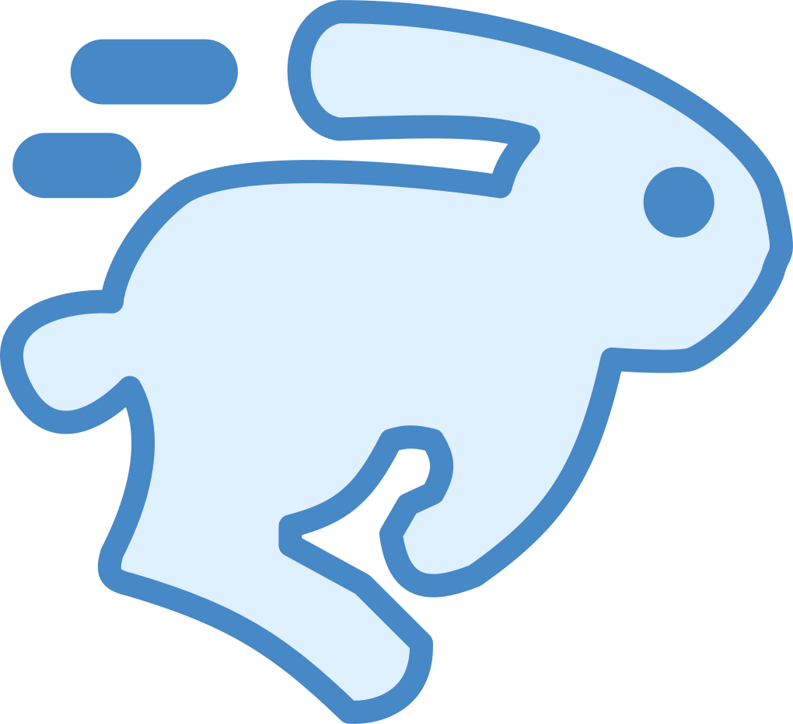 <code>autobrr</code></a></td></tr>
<tr><td align="center"><a href="../logos/autocaliweb.svg">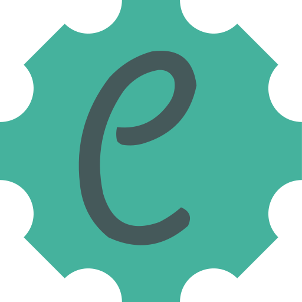 <code>autocaliweb</code></a></td><td align="center"><a href="../logos/autokitteh.svg"> <code>autokitteh</code></a></td><td align="center"><a href="../logos/automad.svg"> <code>automad</code></a></td><td align="center"><a href="../logos/automatic1111.svg"> <code>automatic1111</code></a></td><td align="center"><a href="../logos/av1.svg">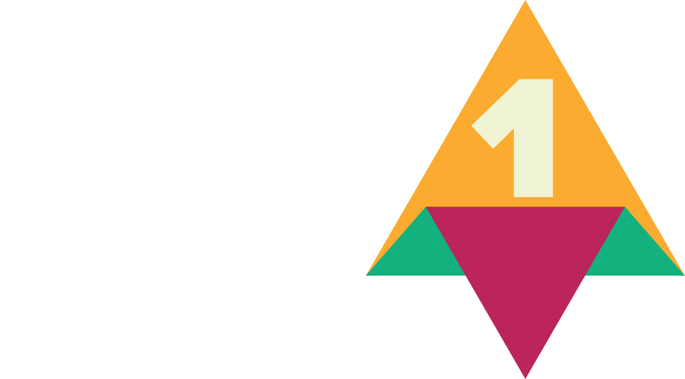 <code>av1</code></a></td><td align="center"><a href="../logos/avg.svg"> <code>avg</code></a></td></tr>
<tr><td align="center"><a href="../logos/aviato.svg">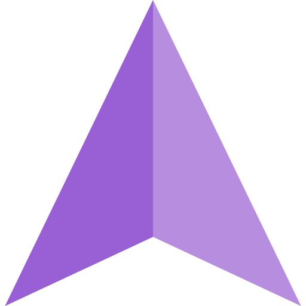 <code>aviato</code></a></td><td align="center"><a href="../logos/avif.svg">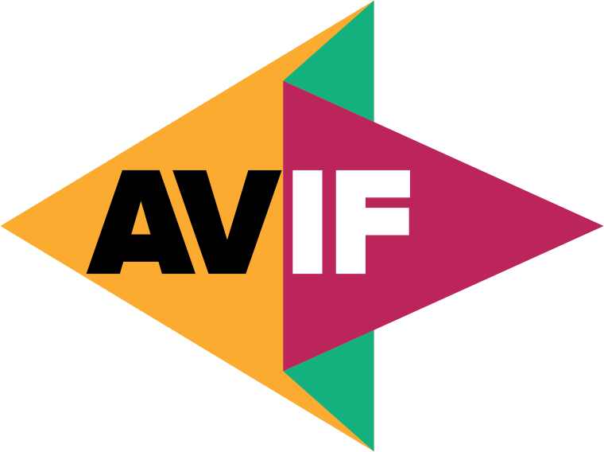 <code>avif</code></a></td><td align="center"><a href="../logos/avigilon.svg">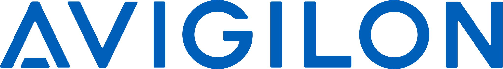 <code>avigilon</code></a></td><td align="center"><a href="../logos/avm-fritzbox-4060.svg"> <code>avm-fritzbox-4060</code></a></td><td align="center"><a href="../logos/avm-fritzbox-5690.svg"> <code>avm-fritzbox-5690</code></a></td><td align="center"><a href="../logos/avm-fritzbox-6820.svg">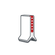 <code>avm-fritzbox-6820</code></a></td></tr>
<tr><td align="center"><a href="../logos/avm-fritzbox-6890.svg"> <code>avm-fritzbox-6890</code></a></td><td align="center"><a href="../logos/avm-fritzbox-7490.svg"> <code>avm-fritzbox-7490</code></a></td><td align="center"><a href="../logos/avm-fritzbox-7590oem.svg"> <code>avm-fritzbox-7590oem</code></a></td><td align="center"><a href="../logos/avm-fritzbox-7590real.svg"> <code>avm-fritzbox-7590real</code></a></td><td align="center"><a href="../logos/avm-powerline-1000.svg"> <code>avm-powerline-1000</code></a></td><td align="center"><a href="../logos/avm-powerline-546.svg">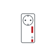 <code>avm-powerline-546</code></a></td></tr>
<tr><td align="center"><a href="../logos/avm-repeater-2400.svg"> <code>avm-repeater-2400</code></a></td><td align="center"><a href="../logos/avm-repeater-3000.svg">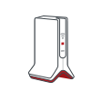 <code>avm-repeater-3000</code></a></td><td align="center"><a href="../logos/avm-repeater-310.svg"> <code>avm-repeater-310</code></a></td><td align="center"><a href="../logos/avm-repeater-600.svg"> <code>avm-repeater-600</code></a></td><td align="center"><a href="../logos/aws-dynamodb-logo.svg"> <code>aws-dynamodb-logo</code></a></td><td align="center"><a href="../logos/awwesome.svg"> <code>awwesome</code></a></td></tr>
<tr><td align="center"><a href="../logos/awx.svg">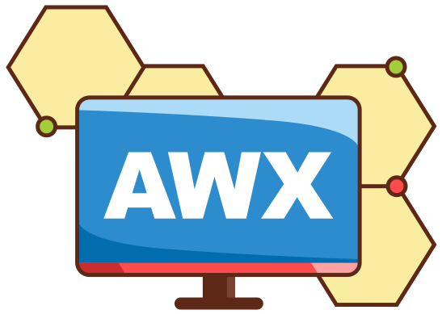 <code>awx</code></a></td><td align="center"><a href="../logos/axiom.svg"> <code>axiom</code></a></td><td align="center"><a href="../logos/axis.svg"> <code>axis</code></a></td><td align="center"><a href="../logos/azuracast.svg"> <code>azuracast</code></a></td><td align="center"><a href="../logos/azure-application-insights.svg"> <code>azure-application-insights</code></a></td><td align="center"><a href="../logos/azure-bicep.svg">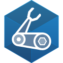 <code>azure-bicep</code></a></td></tr>
<tr><td align="center"><a href="../logos/azure-container-apps.svg"> <code>azure-container-apps</code></a></td><td align="center"><a href="../logos/azure-container-instances.svg"> <code>azure-container-instances</code></a></td><td align="center"><a href="../logos/azure-container-service.svg"> <code>azure-container-service</code></a></td><td align="center"><a href="../logos/azure-cost-management.svg"> <code>azure-cost-management</code></a></td><td align="center"><a href="../logos/azure-data-factory.svg"> <code>azure-data-factory</code></a></td><td align="center"><a href="../logos/azure-devops.svg"> <code>azure-devops</code></a></td></tr>
<tr><td align="center"><a href="../logos/azure-expressroute-cirtcuits.svg"> <code>azure-expressroute-cirtcuits</code></a></td><td align="center"><a href="../logos/azure-front-door.svg"> <code>azure-front-door</code></a></td><td align="center"><a href="../logos/azure-keyvault.svg"> <code>azure-keyvault</code></a></td><td align="center"><a href="../logos/azure-postgres-server.svg"> <code>azure-postgres-server</code></a></td><td align="center"><a href="../logos/azure-service-bus.svg"> <code>azure-service-bus</code></a></td><td align="center"><a href="../logos/azure-storage-accounts.svg"> <code>azure-storage-accounts</code></a></td></tr>
<tr><td align="center"><a href="../logos/azure-traffic-manager.svg"> <code>azure-traffic-manager</code></a></td><td align="center"><a href="../logos/azure-virtual-desktop.svg"> <code>azure-virtual-desktop</code></a></td><td align="center"><a href="../logos/azure-virtual-network-gateways.svg"> <code>azure-virtual-network-gateways</code></a></td><td align="center"><a href="../logos/azure-vm.svg"> <code>azure-vm</code></a></td><td align="center"><a href="../logos/azure-vnet.svg"> <code>azure-vnet</code></a></td><td align="center"><a href="../logos/bab-technologie.svg"> <code>bab-technologie</code></a></td></tr>
<tr><td align="center"><a href="../logos/baby-buddy.svg"> <code>baby-buddy</code></a></td><td align="center"><a href="../logos/backstage.svg"> <code>backstage</code></a></td><td align="center"><a href="../logos/backuppc.svg"> <code>backuppc</code></a></td><td align="center"><a href="../logos/bagisto.svg">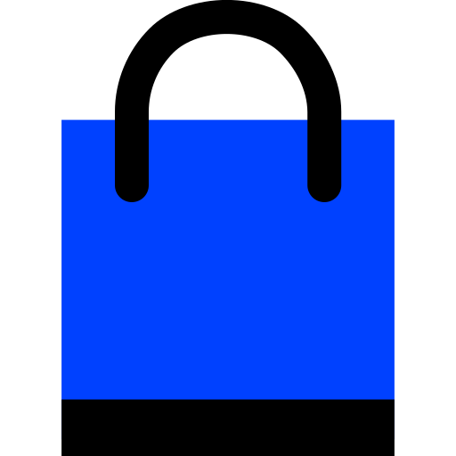 <code>bagisto</code></a></td><td align="center"><a href="../logos/baikal.svg"> <code>baikal</code></a></td><td align="center"><a href="../logos/bale.svg"> <code>bale</code></a></td></tr>
<tr><td align="center"><a href="../logos/balena-etcher.svg"> <code>balena-etcher</code></a></td><td align="center"><a href="../logos/ballerina.svg"> <code>ballerina</code></a></td><td align="center"><a href="../logos/bar-assistant.svg"> <code>bar-assistant</code></a></td><td align="center"><a href="../logos/barco.svg">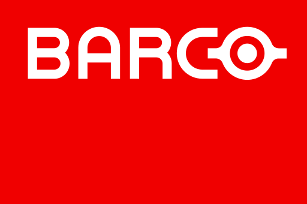 <code>barco</code></a></td><td align="center"><a href="../logos/barcode-buddy.svg">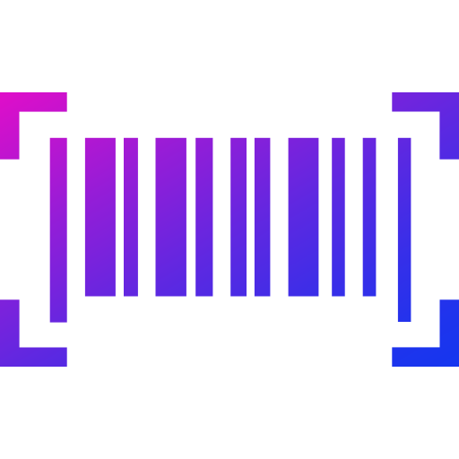 <code>barcode-buddy</code></a></td><td align="center"><a href="../logos/barkeep.svg">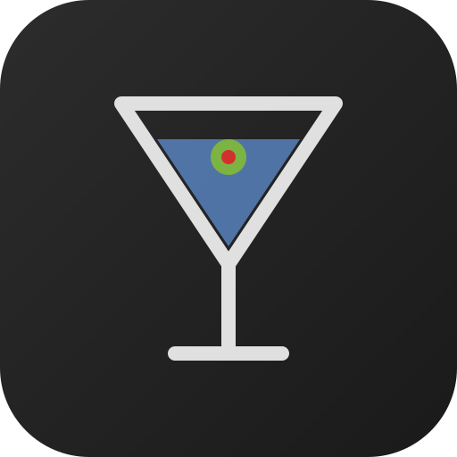 <code>barkeep</code></a></td></tr>
<tr><td align="center"><a href="../logos/barrage.svg">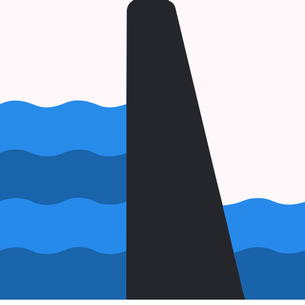 <code>barrage</code></a></td><td align="center"><a href="../logos/basecamp.svg"> <code>basecamp</code></a></td><td align="center"><a href="../logos/basecamp-wordmark.svg"> <code>basecamp-wordmark</code></a></td><td align="center"><a href="../logos/baserow.svg">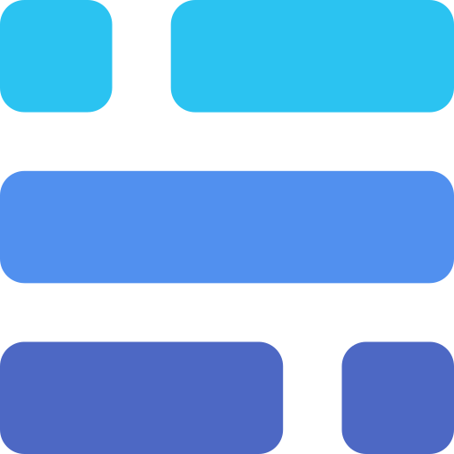 <code>baserow</code></a></td><td align="center"><a href="../logos/basic-memory.svg"> <code>basic-memory</code></a></td><td align="center"><a href="../logos/batch.svg"> <code>batch</code></a></td></tr>
<tr><td align="center"><a href="../logos/bazarr.svg"> <code>bazarr</code></a></td><td align="center"><a href="../logos/bazecor.svg"> <code>bazecor</code></a></td><td align="center"><a href="../logos/be-quiet.svg"> <code>be-quiet</code></a></td><td align="center"><a href="../logos/beacon.svg"> <code>beacon</code></a></td><td align="center"><a href="../logos/beaver-habit-tracker.svg"> <code>beaver-habit-tracker</code></a></td><td align="center"><a href="../logos/bechtle.svg"> <code>bechtle</code></a></td></tr>
<tr><td align="center"><a href="../logos/beef.svg"> <code>beef</code></a></td><td align="center"><a href="../logos/beefiles.svg"> <code>beefiles</code></a></td><td align="center"><a href="../logos/beeper.svg">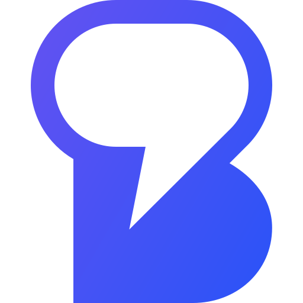 <code>beeper</code></a></td><td align="center"><a href="../logos/beephotos.svg"> <code>beephotos</code></a></td><td align="center"><a href="../logos/beestation.svg"> <code>beestation</code></a></td><td align="center"><a href="../logos/beets.svg">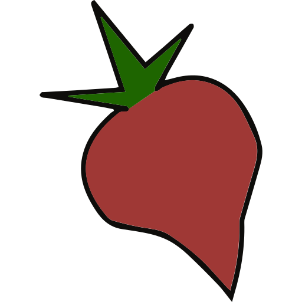 <code>beets</code></a></td></tr>
<tr><td align="center"><a href="../logos/beets-flask.svg"> <code>beets-flask</code></a></td><td align="center"><a href="../logos/bento.svg"> <code>bento</code></a></td><td align="center"><a href="../logos/bentopdf.svg"> <code>bentopdf</code></a></td><td align="center"><a href="../logos/beszel.svg"> <code>beszel</code></a></td><td align="center"><a href="../logos/bewcloud.svg"> <code>bewcloud</code></a></td><td align="center"><a href="../logos/bible-gateway.svg">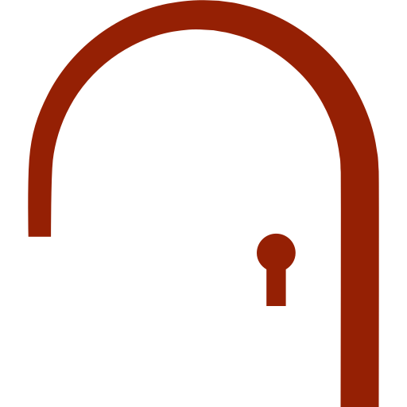 <code>bible-gateway</code></a></td></tr>
<tr><td align="center"><a href="../logos/biblioreads.svg"> <code>biblioreads</code></a></td><td align="center"><a href="../logos/bichon.svg"> <code>bichon</code></a></td><td align="center"><a href="../logos/bigcapital.svg">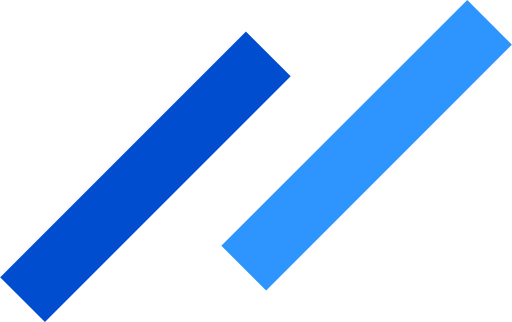 <code>bigcapital</code></a></td><td align="center"><a href="../logos/bikerouter.svg"> <code>bikerouter</code></a></td><td align="center"><a href="../logos/bilibili.svg"> <code>bilibili</code></a></td><td align="center"><a href="../logos/biltema.svg">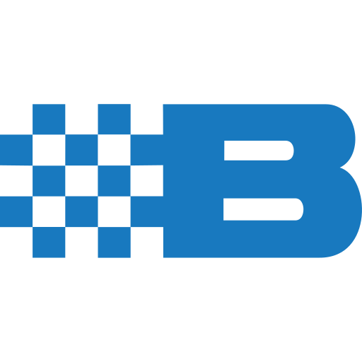 <code>biltema</code></a></td></tr>
<tr><td align="center"><a href="../logos/bin.svg"> <code>bin</code></a></td><td align="center"><a href="../logos/bind-9.svg">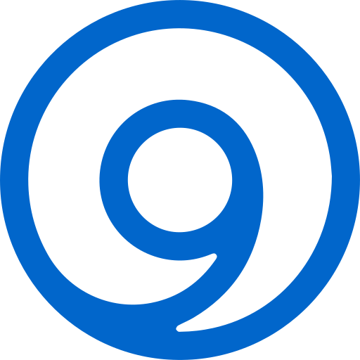 <code>bind-9</code></a></td><td align="center"><a href="../logos/binner.svg">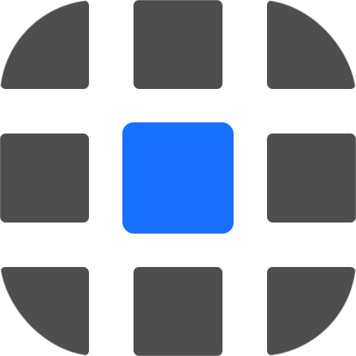 <code>binner</code></a></td><td align="center"><a href="../logos/bitify.svg"> <code>bitify</code></a></td><td align="center"><a href="../logos/bitly.svg"> <code>bitly</code></a></td><td align="center"><a href="../logos/bitly-wordmark.svg"> <code>bitly-wordmark</code></a></td></tr>
<tr><td align="center"><a href="../logos/bitmagnet.svg"> <code>bitmagnet</code></a></td><td align="center"><a href="../logos/bitvoker.svg"> <code>bitvoker</code></a></td><td align="center"><a href="../logos/bitwarden-portal.svg">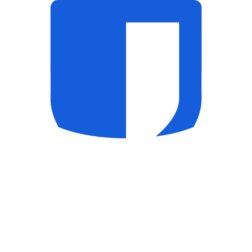 <code>bitwarden-portal</code></a></td><td align="center"><a href="../logos/bknd.svg">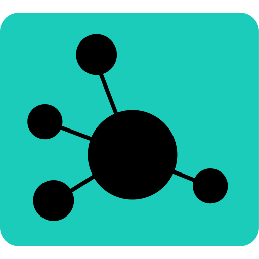 <code>bknd</code></a></td><td align="center"><a href="../logos/black-candy.svg">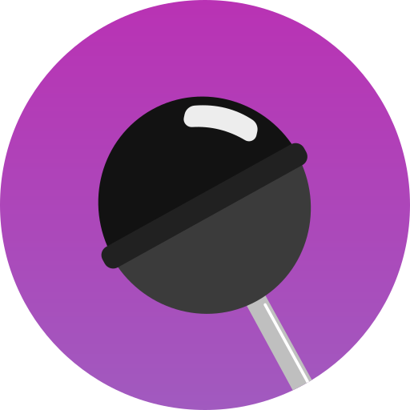 <code>black-candy</code></a></td><td align="center"><a href="../logos/black-forest-labs.svg"> <code>black-forest-labs</code></a></td></tr>
<tr><td align="center"><a href="../logos/black-forest-labs-wordmark.svg"> <code>black-forest-labs-wordmark</code></a></td><td align="center"><a href="../logos/blinko.svg"> <code>blinko</code></a></td><td align="center"><a href="../logos/blocky.svg">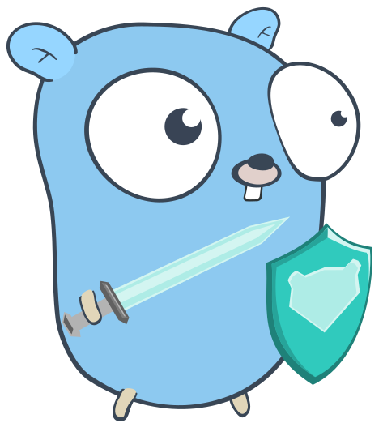 <code>blocky</code></a></td><td align="center"><a href="../logos/blossom.svg"> <code>blossom</code></a></td><td align="center"><a href="../logos/blu-ray.svg"> <code>blu-ray</code></a></td><td align="center"><a href="../logos/blu-ray-3d.svg"> <code>blu-ray-3d</code></a></td></tr>
<tr><td align="center"><a href="../logos/bludit.svg"> <code>bludit</code></a></td><td align="center"><a href="../logos/bolt-diy.svg"> <code>bolt-diy</code></a></td><td align="center"><a href="../logos/boltnew.svg"> <code>boltnew</code></a></td><td align="center"><a href="../logos/book-lore.svg"> <code>book-lore</code></a></td><td align="center"><a href="../logos/bookhaven.svg"> <code>bookhaven</code></a></td><td align="center"><a href="../logos/bookheaven.svg"> <code>bookheaven</code></a></td></tr>
<tr><td align="center"><a href="../logos/booklogr.svg"> <code>booklogr</code></a></td><td align="center"><a href="../logos/booklore.svg"> <code>booklore</code></a></td><td align="center"><a href="../logos/booklore-wordmark.svg"> <code>booklore-wordmark</code></a></td><td align="center"><a href="../logos/booko.svg"> <code>booko</code></a></td><td align="center"><a href="../logos/bookorbit.svg"> <code>bookorbit</code></a></td><td align="center"><a href="../logos/bookstack.svg"> <code>bookstack</code></a></td></tr>
<tr><td align="center"><a href="../logos/bookwyrm.svg"> <code>bookwyrm</code></a></td><td align="center"><a href="../logos/boost-mobile.svg">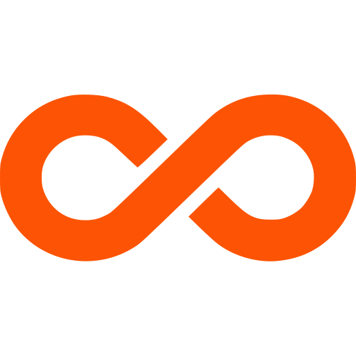 <code>boost-mobile</code></a></td><td align="center"><a href="../logos/borg.svg"> <code>borg</code></a></td><td align="center"><a href="../logos/borgmatic.svg"> <code>borgmatic</code></a></td><td align="center"><a href="../logos/boson.svg"> <code>boson</code></a></td><td align="center"><a href="../logos/bottom.svg">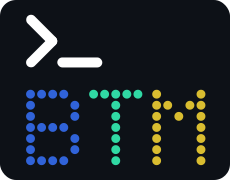 <code>bottom</code></a></td></tr>
<tr><td align="center"><a href="../logos/boundary.svg"> <code>boundary</code></a></td><td align="center"><a href="../logos/box.svg"> <code>box</code></a></td><td align="center"><a href="../logos/bracket.svg">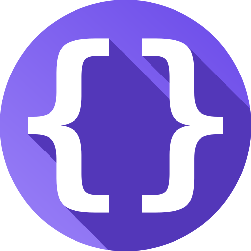 <code>bracket</code></a></td><td align="center"><a href="../logos/brick-tracker.svg"> <code>brick-tracker</code></a></td><td align="center"><a href="../logos/briefing.svg"> <code>briefing</code></a></td><td align="center"><a href="../logos/bright-move.svg"> <code>bright-move</code></a></td></tr>
<tr><td align="center"><a href="../logos/broadcastchannel.svg"> <code>broadcastchannel</code></a></td><td align="center"><a href="../logos/brocade.svg"> <code>brocade</code></a></td><td align="center"><a href="../logos/brother.svg">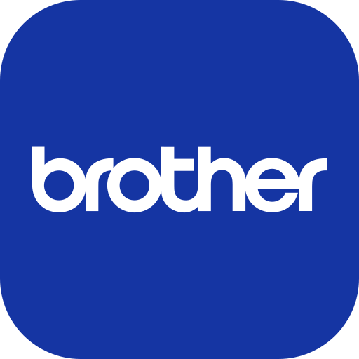 <code>brother</code></a></td><td align="center"><a href="../logos/browserless.svg"> <code>browserless</code></a></td><td align="center"><a href="../logos/browsh.svg">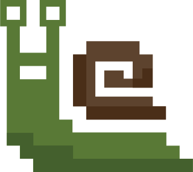 <code>browsh</code></a></td><td align="center"><a href="../logos/budget-board.svg"> <code>budget-board</code></a></td></tr>
<tr><td align="center"><a href="../logos/budgetbee.svg"> <code>budgetbee</code></a></td><td align="center"><a href="../logos/budibase.svg">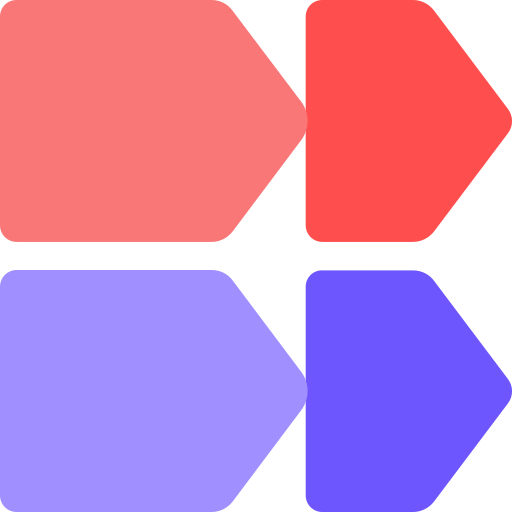 <code>budibase</code></a></td><td align="center"><a href="../logos/buggregator.svg">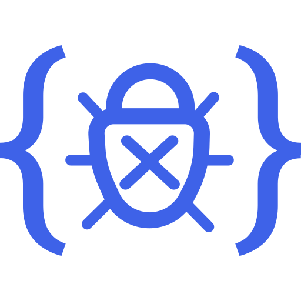 <code>buggregator</code></a></td><td align="center"><a href="../logos/build-better.svg"> <code>build-better</code></a></td><td align="center"><a href="../logos/buildbot.svg">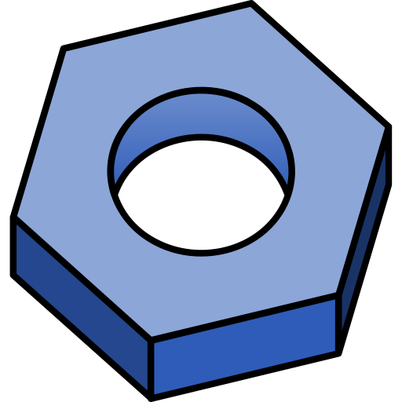 <code>buildbot</code></a></td><td align="center"><a href="../logos/bulwark.svg"> <code>bulwark</code></a></td></tr>
<tr><td align="center"><a href="../logos/bunkerweb.svg"> <code>bunkerweb</code></a></td><td align="center"><a href="../logos/bunny.svg"> <code>bunny</code></a></td><td align="center"><a href="../logos/burpsuite.svg"> <code>burpsuite</code></a></td><td align="center"><a href="../logos/byparr.svg"> <code>byparr</code></a></td><td align="center"><a href="../logos/bytestash.svg"> <code>bytestash</code></a></td><td align="center"><a href="../logos/cabernet.svg">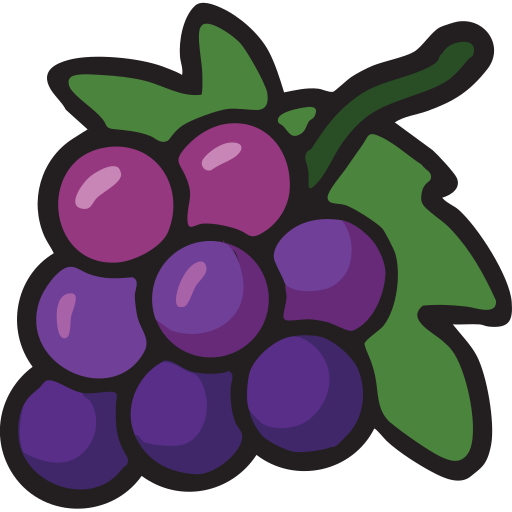 <code>cabernet</code></a></td></tr>
<tr><td align="center"><a href="../logos/cacti.svg"> <code>cacti</code></a></td><td align="center"><a href="../logos/caddymanager.svg"> <code>caddymanager</code></a></td><td align="center"><a href="../logos/caderno.svg"> <code>caderno</code></a></td><td align="center"><a href="../logos/cadvisor.svg"> <code>cadvisor</code></a></td><td align="center"><a href="../logos/cal-com.svg"> <code>cal-com</code></a></td><td align="center"><a href="../logos/calagopus.svg">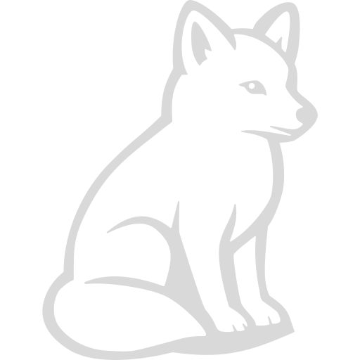 <code>calagopus</code></a></td></tr>
<tr><td align="center"><a href="../logos/calendly.svg">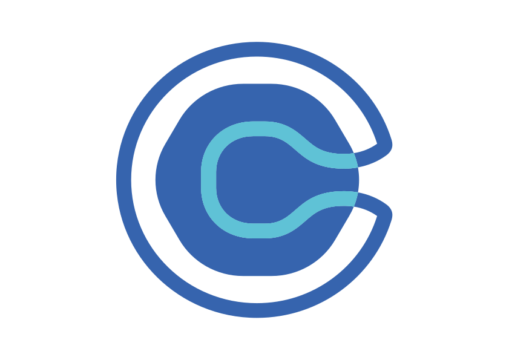 <code>calendly</code></a></td><td align="center"><a href="../logos/calibre-web.svg"> <code>calibre-web</code></a></td><td align="center"><a href="../logos/calmness.svg"> <code>calmness</code></a></td><td align="center"><a href="../logos/calyxos.svg"> <code>calyxos</code></a></td><td align="center"><a href="../logos/cannery.svg"> <code>cannery</code></a></td><td align="center"><a href="../logos/cannoli-shell.svg"> <code>cannoli-shell</code></a></td></tr>
<tr><td align="center"><a href="../logos/canvas-lms.svg"> <code>canvas-lms</code></a></td><td align="center"><a href="../logos/cap-cut.svg"> <code>cap-cut</code></a></td><td align="center"><a href="../logos/capacitarr.svg"> <code>capacitarr</code></a></td><td align="center"><a href="../logos/capacities.svg"> <code>capacities</code></a></td><td align="center"><a href="../logos/capacitor-runtime.svg"> <code>capacitor-runtime</code></a></td><td align="center"><a href="../logos/caprover.svg"> <code>caprover</code></a></td></tr>
<tr><td align="center"><a href="../logos/carcare.svg"> <code>carcare</code></a></td><td align="center"><a href="../logos/cardinal-apps.svg">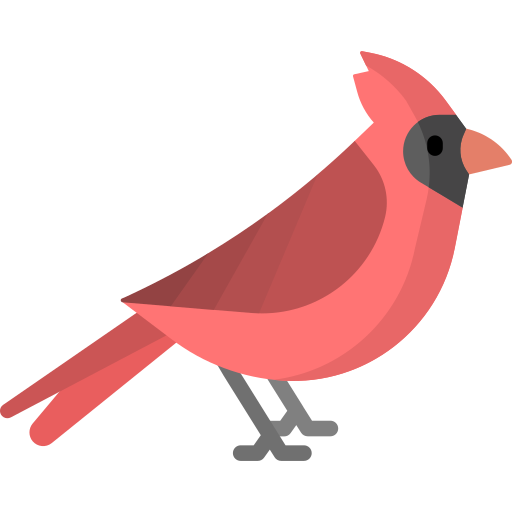 <code>cardinal-apps</code></a></td><td align="center"><a href="../logos/cardinal-cinema.svg">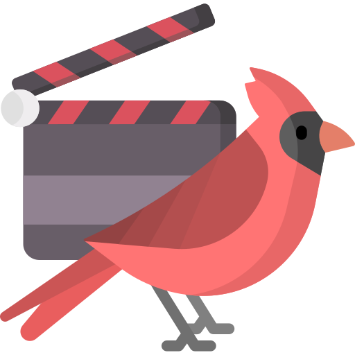 <code>cardinal-cinema</code></a></td><td align="center"><a href="../logos/cardinal-media-server.svg">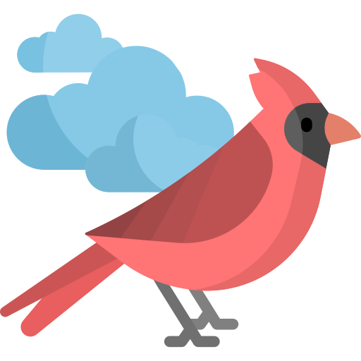 <code>cardinal-media-server</code></a></td><td align="center"><a href="../logos/cardinal-photos.svg"> <code>cardinal-photos</code></a></td><td align="center"><a href="../logos/carousell.svg"> <code>carousell</code></a></td></tr>
<tr><td align="center"><a href="../logos/carrefour.svg">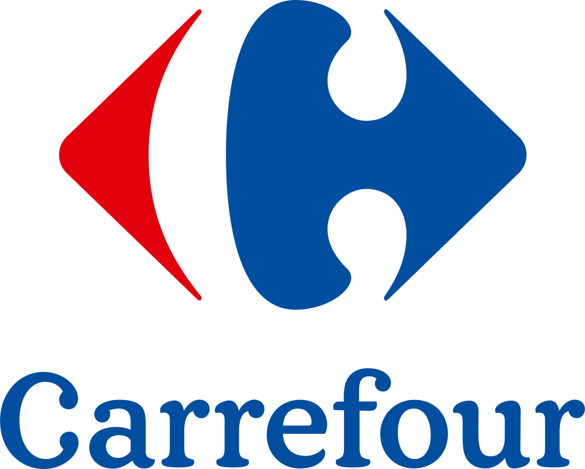 <code>carrefour</code></a></td><td align="center"><a href="../logos/casaos.svg">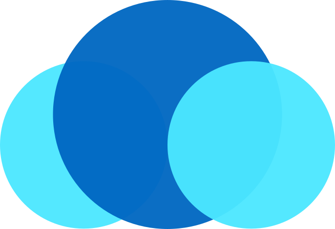 <code>casaos</code></a></td><td align="center"><a href="../logos/castopod.svg"> <code>castopod</code></a></td><td align="center"><a href="../logos/catppuccin.svg"> <code>catppuccin</code></a></td><td align="center"><a href="../logos/cc.svg"> <code>cc</code></a></td><td align="center"><a href="../logos/cd.svg"> <code>cd</code></a></td></tr>
<tr><td align="center"><a href="../logos/cert-manager.svg"> <code>cert-manager</code></a></td><td align="center"><a href="../logos/cert-warden.svg"> <code>cert-warden</code></a></td><td align="center"><a href="../logos/certimate.svg"> <code>certimate</code></a></td><td align="center"><a href="../logos/cessna.svg"> <code>cessna</code></a></td><td align="center"><a href="../logos/chainguard.svg"> <code>chainguard</code></a></td><td align="center"><a href="../logos/changedetection.svg">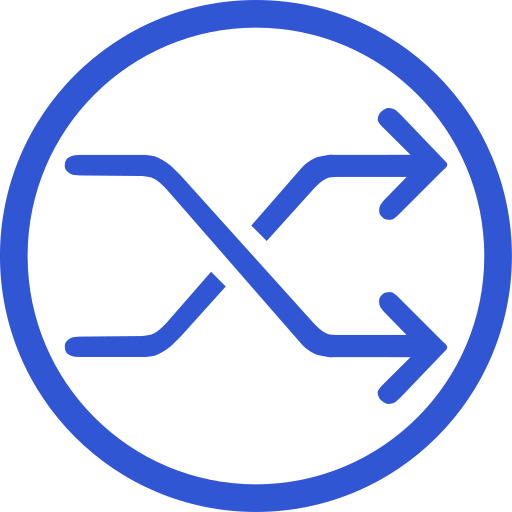 <code>changedetection</code></a></td></tr>
<tr><td align="center"><a href="../logos/changelog-nightly.svg">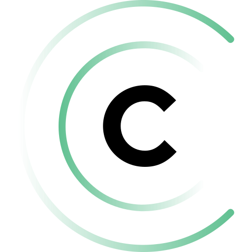 <code>changelog-nightly</code></a></td><td align="center"><a href="../logos/channels-dvr.svg"> <code>channels-dvr</code></a></td><td align="center"><a href="../logos/charles-schwab.svg"> <code>charles-schwab</code></a></td><td align="center"><a href="../logos/chartbrew.svg">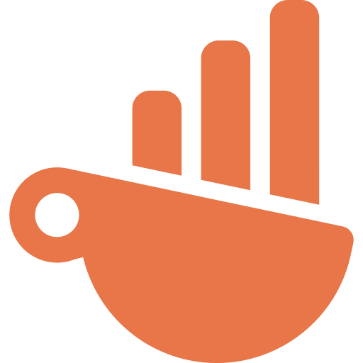 <code>chartbrew</code></a></td><td align="center"><a href="../logos/chatwoot.svg"> <code>chatwoot</code></a></td><td align="center"><a href="../logos/check-cle.svg">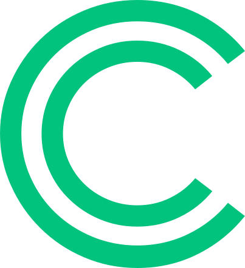 <code>check-cle</code></a></td></tr>
<tr><td align="center"><a href="../logos/check-point.svg"> <code>check-point</code></a></td><td align="center"><a href="../logos/check-point-wordmark.svg"> <code>check-point-wordmark</code></a></td><td align="center"><a href="../logos/checkmate.svg">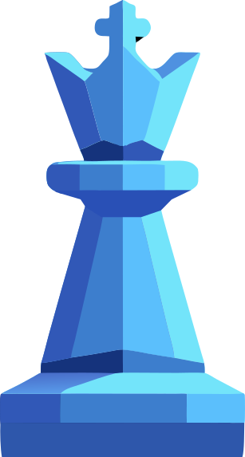 <code>checkmate</code></a></td><td align="center"><a href="../logos/checkmk.svg"> <code>checkmk</code></a></td><td align="center"><a href="../logos/chess.svg"> <code>chess</code></a></td><td align="center"><a href="../logos/chhoto-url.svg"> <code>chhoto-url</code></a></td></tr>
<tr><td align="center"><a href="../logos/chibisafe.svg">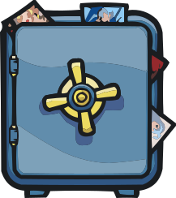 <code>chibisafe</code></a></td><td align="center"><a href="../logos/chili3d.svg"> <code>chili3d</code></a></td><td align="center"><a href="../logos/chirpy.svg"> <code>chirpy</code></a></td><td align="center"><a href="../logos/chitchatter.svg"> <code>chitchatter</code></a></td><td align="center"><a href="../logos/chocolate.svg">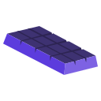 <code>chocolate</code></a></td><td align="center"><a href="../logos/chorizard.svg">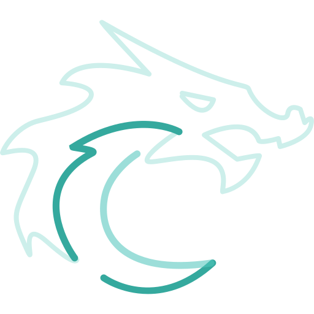 <code>chorizard</code></a></td></tr>
<tr><td align="center"><a href="../logos/chrome-devtools.svg"> <code>chrome-devtools</code></a></td><td align="center"><a href="../logos/cilium.svg"> <code>cilium</code></a></td><td align="center"><a href="../logos/cilium-hubble.svg">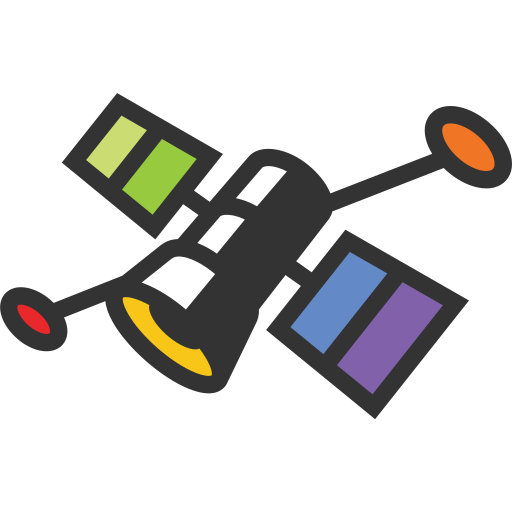 <code>cilium-hubble</code></a></td><td align="center"><a href="../logos/cilium-tetragon.svg"> <code>cilium-tetragon</code></a></td><td align="center"><a href="../logos/cinny.svg"> <code>cinny</code></a></td><td align="center"><a href="../logos/ciphermail.svg"> <code>ciphermail</code></a></td></tr>
<tr><td align="center"><a href="../logos/citibank.svg"> <code>citibank</code></a></td><td align="center"><a href="../logos/clam-av.svg"> <code>clam-av</code></a></td><td align="center"><a href="../logos/clean-slate.svg"> <code>clean-slate</code></a></td><td align="center"><a href="../logos/clickup.svg"> <code>clickup</code></a></td><td align="center"><a href="../logos/clipable.svg"> <code>clipable</code></a></td><td align="center"><a href="../logos/clipcascade.svg">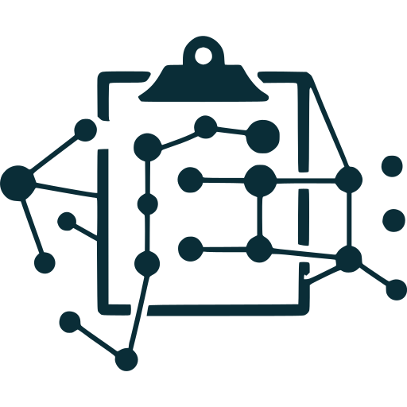 <code>clipcascade</code></a></td></tr>
<tr><td align="center"><a href="../logos/cloud66.svg"> <code>cloud66</code></a></td><td align="center"><a href="../logos/cloudbeaver.svg"> <code>cloudbeaver</code></a></td><td align="center"><a href="../logos/cloudflare-pages.svg"> <code>cloudflare-pages</code></a></td><td align="center"><a href="../logos/cloudflare-zero-trust.svg"> <code>cloudflare-zero-trust</code></a></td><td align="center"><a href="../logos/cloudflared.svg"> <code>cloudflared</code></a></td><td align="center"><a href="../logos/cloudpanel.svg"> <code>cloudpanel</code></a></td></tr>
<tr><td align="center"><a href="../logos/cloudreve.svg"> <code>cloudreve</code></a></td><td align="center"><a href="../logos/cloudstream.svg"> <code>cloudstream</code></a></td><td align="center"><a href="../logos/clovalink.svg"> <code>clovalink</code></a></td><td align="center"><a href="../logos/cockpit-cms.svg"> <code>cockpit-cms</code></a></td><td align="center"><a href="../logos/coda.svg"> <code>coda</code></a></td><td align="center"><a href="../logos/coda-wordmark.svg"> <code>coda-wordmark</code></a></td></tr>
<tr><td align="center"><a href="../logos/coder.svg"> <code>coder</code></a></td><td align="center"><a href="../logos/codestats.svg"> <code>codestats</code></a></td><td align="center"><a href="../logos/coinmarketcap-blue.svg"> <code>coinmarketcap-blue</code></a></td><td align="center"><a href="../logos/colanode.svg"> <code>colanode</code></a></td><td align="center"><a href="../logos/coldfusion.svg"> <code>coldfusion</code></a></td><td align="center"><a href="../logos/coldfusion-builder.svg"> <code>coldfusion-builder</code></a></td></tr>
<tr><td align="center"><a href="../logos/collabora-online.svg"> <code>collabora-online</code></a></td><td align="center"><a href="../logos/colota.svg"> <code>colota</code></a></td><td align="center"><a href="../logos/comentario.svg"> <code>comentario</code></a></td><td align="center"><a href="../logos/commafeed.svg"> <code>commafeed</code></a></td><td align="center"><a href="../logos/commento.svg"> <code>commento</code></a></td><td align="center"><a href="../logos/compose-craft.svg"> <code>compose-craft</code></a></td></tr>
<tr><td align="center"><a href="../logos/composerize.svg"> <code>composerize</code></a></td><td align="center"><a href="../logos/composetoolbox.svg"> <code>composetoolbox</code></a></td><td align="center"><a href="../logos/composr.svg">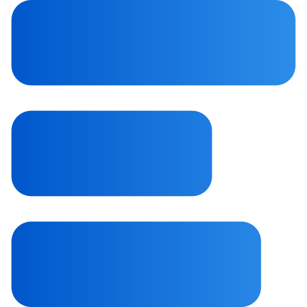 <code>composr</code></a></td><td align="center"><a href="../logos/compreface.svg"> <code>compreface</code></a></td><td align="center"><a href="../logos/conduit.svg"> <code>conduit</code></a></td><td align="center"><a href="../logos/conduwuit.svg">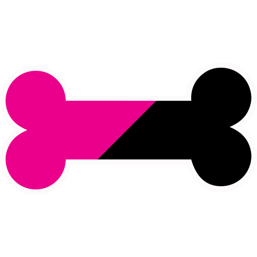 <code>conduwuit</code></a></td></tr>
<tr><td align="center"><a href="../logos/coneshare.svg"> <code>coneshare</code></a></td><td align="center"><a href="../logos/configarr.svg">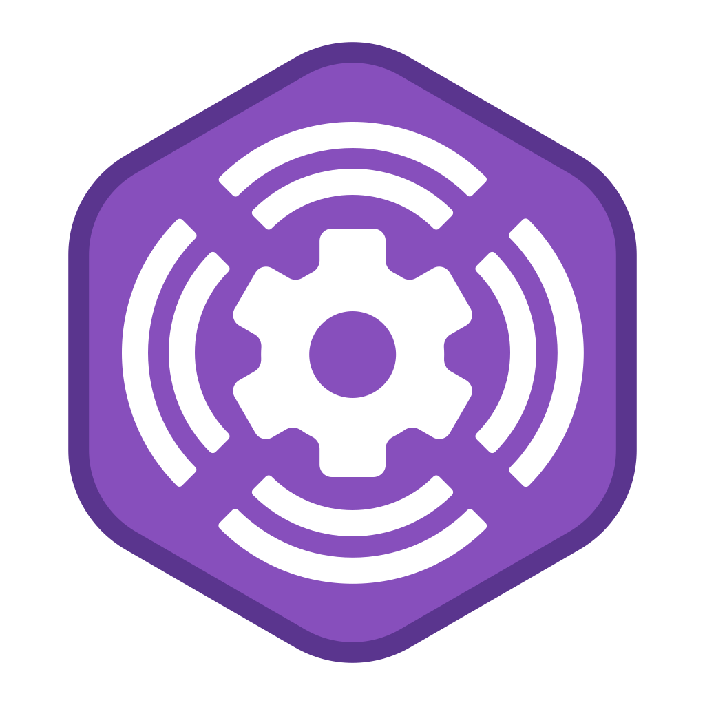 <code>configarr</code></a></td><td align="center"><a href="../logos/configclarity.svg">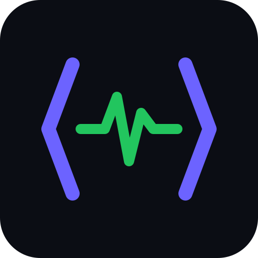 <code>configclarity</code></a></td><td align="center"><a href="../logos/confix.svg"> <code>confix</code></a></td><td align="center"><a href="../logos/confluence.svg">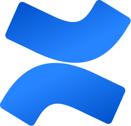 <code>confluence</code></a></td><td align="center"><a href="../logos/confluent.svg"> <code>confluent</code></a></td></tr>
<tr><td align="center"><a href="../logos/connectwise-brightgauge.svg">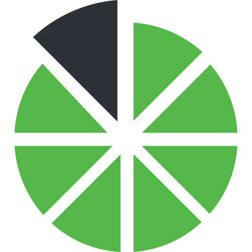 <code>connectwise-brightgauge</code></a></td><td align="center"><a href="../logos/connectwise-screenconnect.svg">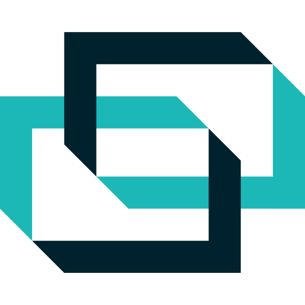 <code>connectwise-screenconnect</code></a></td><td align="center"><a href="../logos/conslee.svg">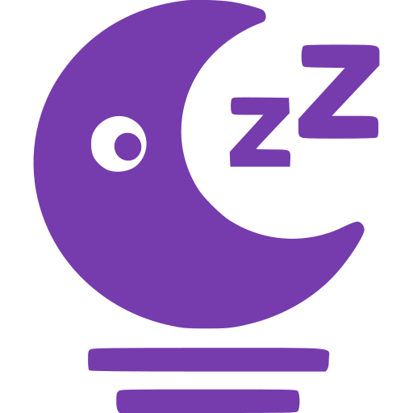 <code>conslee</code></a></td><td align="center"><a href="../logos/contabo.svg"> <code>contabo</code></a></td><td align="center"><a href="../logos/container-hub.svg">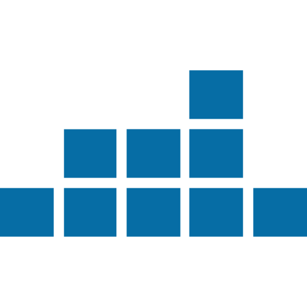 <code>container-hub</code></a></td><td align="center"><a href="../logos/continuwuity.svg"> <code>continuwuity</code></a></td></tr>
<tr><td align="center"><a href="../logos/control-d.svg"> <code>control-d</code></a></td><td align="center"><a href="../logos/converse.svg"> <code>converse</code></a></td><td align="center"><a href="../logos/convos.svg"> <code>convos</code></a></td><td align="center"><a href="../logos/convoy.svg">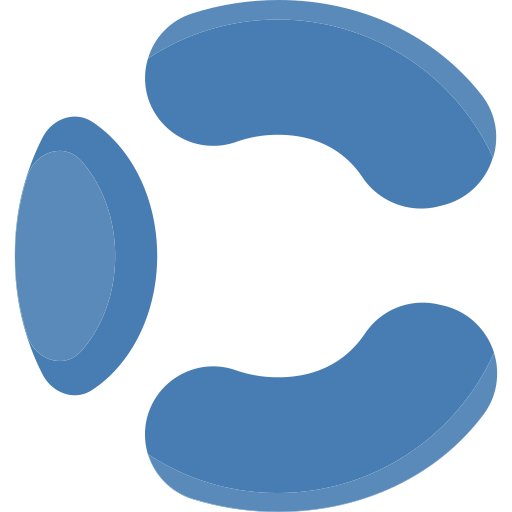 <code>convoy</code></a></td><td align="center"><a href="../logos/cookcli.svg">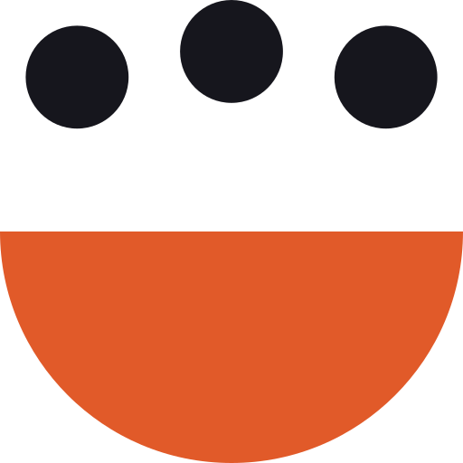 <code>cookcli</code></a></td><td align="center"><a href="../logos/cooklang-chef.svg"> <code>cooklang-chef</code></a></td></tr>
<tr><td align="center"><a href="../logos/cooler-control.svg">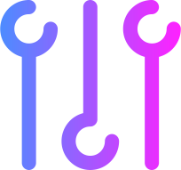 <code>cooler-control</code></a></td><td align="center"><a href="../logos/coolify.svg">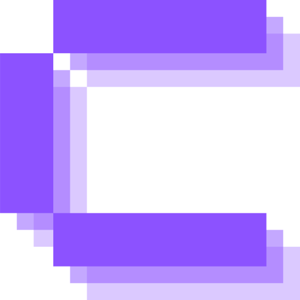 <code>coolify</code></a></td><td align="center"><a href="../logos/copyparty.svg"> <code>copyparty</code></a></td><td align="center"><a href="../logos/copyq.svg"> <code>copyq</code></a></td><td align="center"><a href="../logos/corecontrol.svg"> <code>corecontrol</code></a></td><td align="center"><a href="../logos/coredns.svg"> <code>coredns</code></a></td></tr>
<tr><td align="center"><a href="../logos/cosign.svg"> <code>cosign</code></a></td><td align="center"><a href="../logos/cosmic.svg"> <code>cosmic</code></a></td><td align="center"><a href="../logos/countly.svg">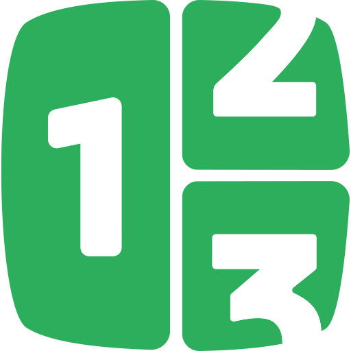 <code>countly</code></a></td><td align="center"><a href="../logos/cozy.svg">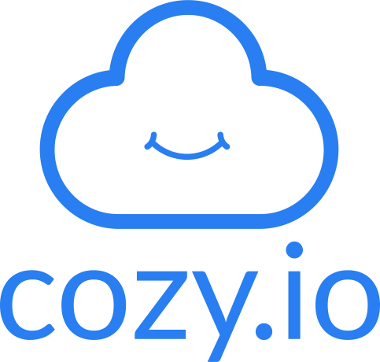 <code>cozy</code></a></td><td align="center"><a href="../logos/cpp.svg">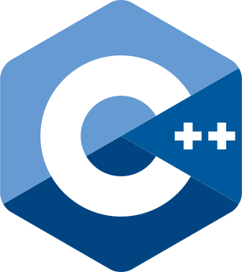 <code>cpp</code></a></td><td align="center"><a href="../logos/cr-nmaster.svg"> <code>cr-nmaster</code></a></td></tr>
<tr><td align="center"><a href="../logos/crafty-controller.svg">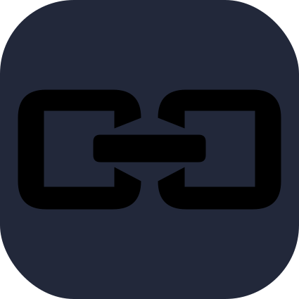 <code>crafty-controller</code></a></td><td align="center"><a href="../logos/cronicle.svg">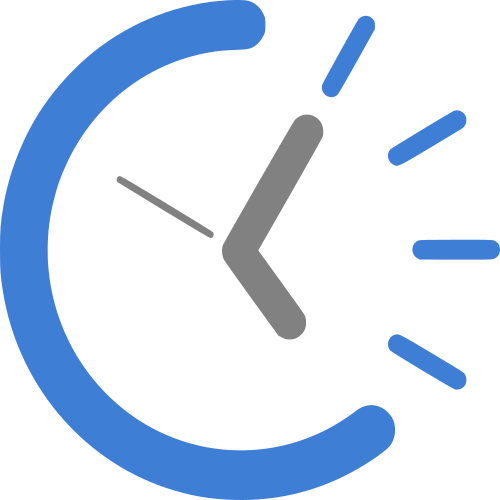 <code>cronicle</code></a></td><td align="center"><a href="../logos/cronmaster.svg"> <code>cronmaster</code></a></td><td align="center"><a href="../logos/crontab-guru.svg">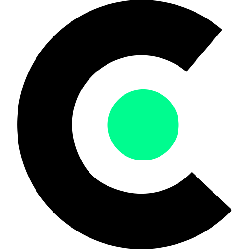 <code>crontab-guru</code></a></td><td align="center"><a href="../logos/cross-seed.svg"> <code>cross-seed</code></a></td><td align="center"><a href="../logos/crosswatch.svg"> <code>crosswatch</code></a></td></tr>
<tr><td align="center"><a href="../logos/crow-ci.svg">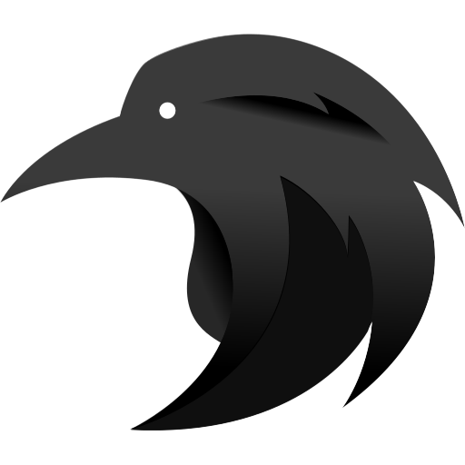 <code>crow-ci</code></a></td><td align="center"><a href="../logos/crowdin.svg"> <code>crowdin</code></a></td><td align="center"><a href="../logos/crowdsec.svg"> <code>crowdsec</code></a></td><td align="center"><a href="../logos/crowdsec-manager.svg"> <code>crowdsec-manager</code></a></td><td align="center"><a href="../logos/crowdstrike.svg"> <code>crowdstrike</code></a></td><td align="center"><a href="../logos/crowdstrike-wordmark.svg"> <code>crowdstrike-wordmark</code></a></td></tr>
<tr><td align="center"><a href="../logos/crt-sh.svg"> <code>crt-sh</code></a></td><td align="center"><a href="../logos/crunchyroll.svg"> <code>crunchyroll</code></a></td><td align="center"><a href="../logos/cryptgeon.svg"> <code>cryptgeon</code></a></td><td align="center"><a href="../logos/cryptomator.svg"> <code>cryptomator</code></a></td><td align="center"><a href="../logos/cryptpad.svg"> <code>cryptpad</code></a></td><td align="center"><a href="../logos/ctfreak.svg"> <code>ctfreak</code></a></td></tr>
<tr><td align="center"><a href="../logos/ctrader.svg"> <code>ctrader</code></a></td><td align="center"><a href="../logos/ctrader-wordmark.svg"> <code>ctrader-wordmark</code></a></td><td align="center"><a href="../logos/cup.svg"> <code>cup</code></a></td><td align="center"><a href="../logos/cup-updates.svg">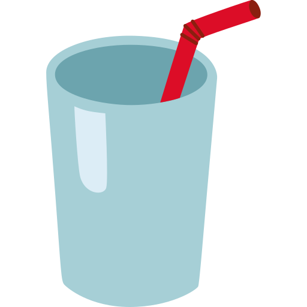 <code>cup-updates</code></a></td><td align="center"><a href="../logos/cups.svg"> <code>cups</code></a></td><td align="center"><a href="../logos/cura.svg"> <code>cura</code></a></td></tr>
<tr><td align="center"><a href="../logos/curator-bookmarks.svg"> <code>curator-bookmarks</code></a></td><td align="center"><a href="../logos/cyber-power-full.svg"> <code>cyber-power-full</code></a></td><td align="center"><a href="../logos/cyberchef.svg">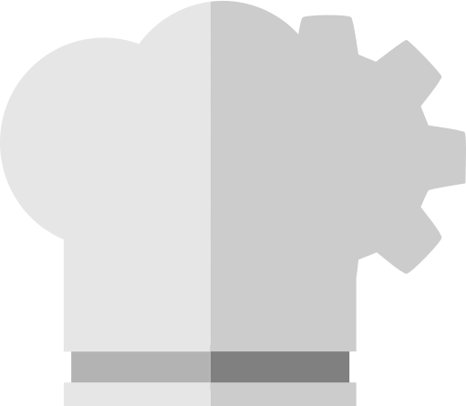 <code>cyberchef</code></a></td><td align="center"><a href="../logos/cypht.svg"> <code>cypht</code></a></td><td align="center"><a href="../logos/czkawka.svg"> <code>czkawka</code></a></td><td align="center"><a href="../logos/d-link.svg"> <code>d-link</code></a></td></tr>
<tr><td align="center"><a href="../logos/dadabik.svg"> <code>dadabik</code></a></td><td align="center"><a href="../logos/daemon-sync.svg">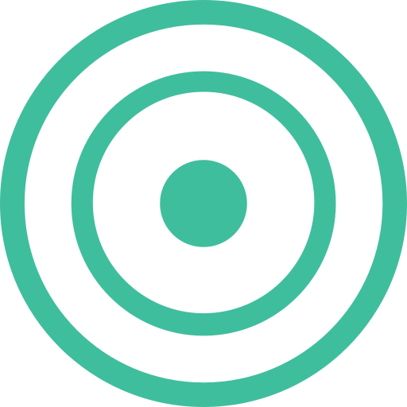 <code>daemon-sync</code></a></td><td align="center"><a href="../logos/dagster.svg">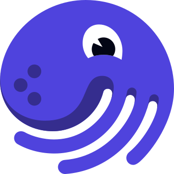 <code>dagster</code></a></td><td align="center"><a href="../logos/dagu.svg">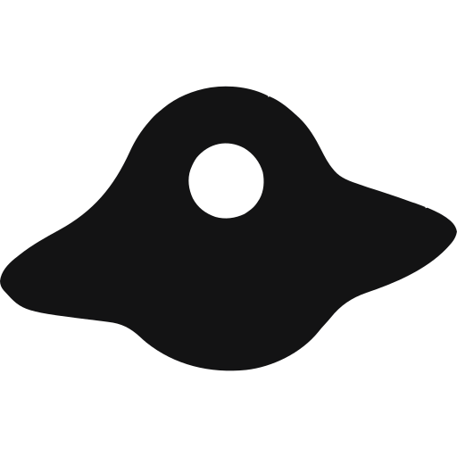 <code>dagu</code></a></td><td align="center"><a href="../logos/dailytxt.svg"> <code>dailytxt</code></a></td><td align="center"><a href="../logos/dalibo.svg"> <code>dalibo</code></a></td></tr>
<tr><td align="center"><a href="../logos/dall-e.svg"> <code>dall-e</code></a></td><td align="center"><a href="../logos/dapulse.svg"> <code>dapulse</code></a></td><td align="center"><a href="../logos/dasharr.svg"> <code>dasharr</code></a></td><td align="center"><a href="../logos/dashboard-icons.svg">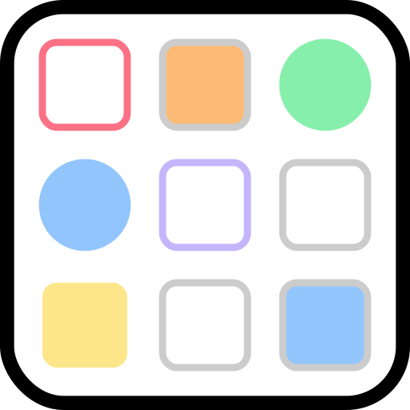 <code>dashboard-icons</code></a></td><td align="center"><a href="../logos/dashlit.svg"> <code>dashlit</code></a></td><td align="center"><a href="../logos/dashwise.svg"> <code>dashwise</code></a></td></tr>
<tr><td align="center"><a href="../logos/data-studio.svg"> <code>data-studio</code></a></td><td align="center"><a href="../logos/databasus.svg"> <code>databasus</code></a></td><td align="center"><a href="../logos/datapup.svg"> <code>datapup</code></a></td><td align="center"><a href="../logos/davical.svg"> <code>davical</code></a></td><td align="center"><a href="../logos/dawarich.svg">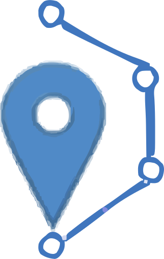 <code>dawarich</code></a></td><td align="center"><a href="../logos/daylog.svg"> <code>daylog</code></a></td></tr>
<tr><td align="center"><a href="../logos/ddclient.svg"> <code>ddclient</code></a></td><td align="center"><a href="../logos/ddev.svg"> <code>ddev</code></a></td><td align="center"><a href="../logos/ddns-updater.svg">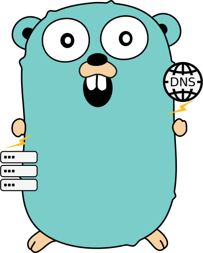 <code>ddns-updater</code></a></td><td align="center"><a href="../logos/defguard.svg"> <code>defguard</code></a></td><td align="center"><a href="../logos/degoog.svg"> <code>degoog</code></a></td><td align="center"><a href="../logos/delta-air-lines.svg"> <code>delta-air-lines</code></a></td></tr>
<tr><td align="center"><a href="../logos/deluge.svg">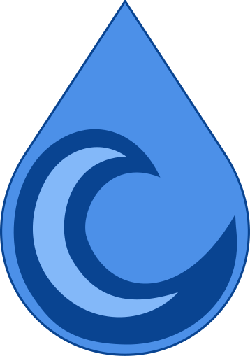 <code>deluge</code></a></td><td align="center"><a href="../logos/denodo.svg"> <code>denodo</code></a></td><td align="center"><a href="../logos/denon.svg"> <code>denon</code></a></td><td align="center"><a href="../logos/dependency-track.svg">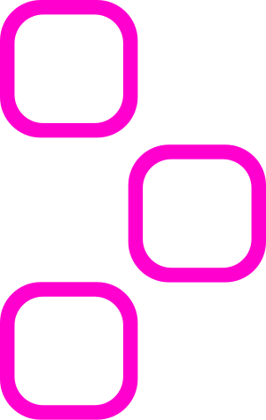 <code>dependency-track</code></a></td><td align="center"><a href="../logos/dependency-track-wordmark.svg"> <code>dependency-track-wordmark</code></a></td><td align="center"><a href="../logos/deployarr.svg"> <code>deployarr</code></a></td></tr>
<tr><td align="center"><a href="../logos/deployrr.svg">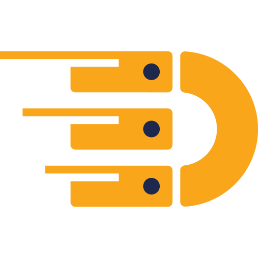 <code>deployrr</code></a></td><td align="center"><a href="../logos/deq.svg"> <code>deq</code></a></td><td align="center"><a href="../logos/designali.svg"> <code>designali</code></a></td><td align="center"><a href="../logos/dev-push.svg"> <code>dev-push</code></a></td><td align="center"><a href="../logos/devuan.svg"> <code>devuan</code></a></td><td align="center"><a href="../logos/dfir-iris.svg"> <code>dfir-iris</code></a></td></tr>
<tr><td align="center"><a href="../logos/dflow.svg"> <code>dflow</code></a></td><td align="center"><a href="../logos/dia.svg"> <code>dia</code></a></td><td align="center"><a href="../logos/diagrams-net.svg"> <code>diagrams-net</code></a></td><td align="center"><a href="../logos/diamond-aircraft.svg"> <code>diamond-aircraft</code></a></td><td align="center"><a href="../logos/dictcc.svg"> <code>dictcc</code></a></td><td align="center"><a href="../logos/digi-kam.svg"> <code>digi-kam</code></a></td></tr>
<tr><td align="center"><a href="../logos/digikey.svg"> <code>digikey</code></a></td><td align="center"><a href="../logos/dillinger.svg"> <code>dillinger</code></a></td><td align="center"><a href="../logos/directadmin.svg"> <code>directadmin</code></a></td><td align="center"><a href="../logos/discopanel.svg">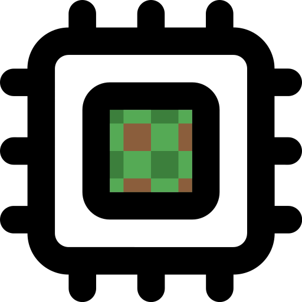 <code>discopanel</code></a></td><td align="center"><a href="../logos/discover-card.svg"> <code>discover-card</code></a></td><td align="center"><a href="../logos/diskover.svg">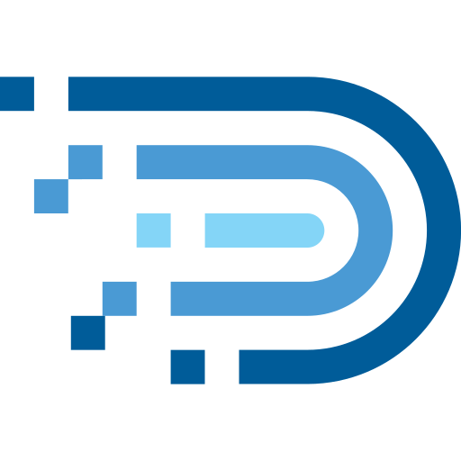 <code>diskover</code></a></td></tr>
<tr><td align="center"><a href="../logos/dispatch-tasks.svg"> <code>dispatch-tasks</code></a></td><td align="center"><a href="../logos/dispatcharr.svg"> <code>dispatcharr</code></a></td><td align="center"><a href="../logos/distribution.svg">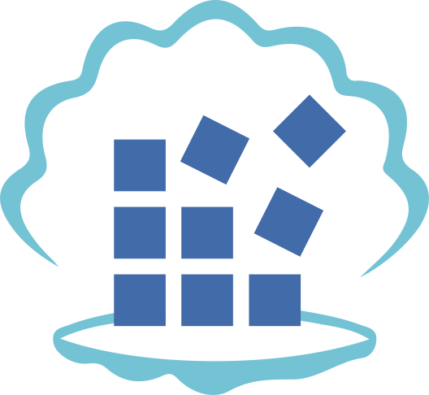 <code>distribution</code></a></td><td align="center"><a href="../logos/diun-dash.svg"> <code>diun-dash</code></a></td><td align="center"><a href="../logos/dixa.svg"> <code>dixa</code></a></td><td align="center"><a href="../logos/diyhue.svg">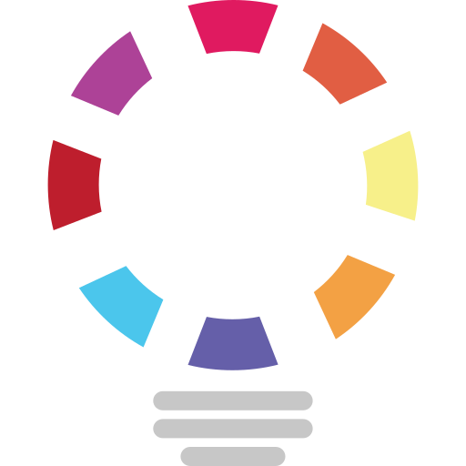 <code>diyhue</code></a></td></tr>
<tr><td align="center"><a href="../logos/dji-logbook.svg"> <code>dji-logbook</code></a></td><td align="center"><a href="../logos/dkb.svg"> <code>dkb</code></a></td><td align="center"><a href="../logos/dlna.svg"> <code>dlna</code></a></td><td align="center"><a href="../logos/docassemble.svg"> <code>docassemble</code></a></td><td align="center"><a href="../logos/dockflare.svg"> <code>dockflare</code></a></td><td align="center"><a href="../logos/dockform.svg"> <code>dockform</code></a></td></tr>
<tr><td align="center"><a href="../logos/dockge.svg">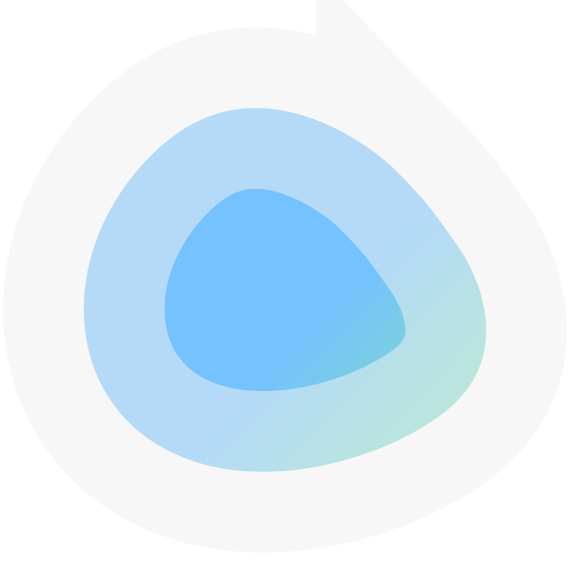 <code>dockge</code></a></td><td align="center"><a href="../logos/docking-station.svg">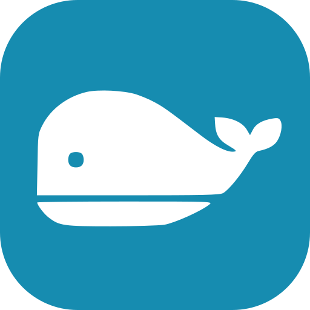 <code>docking-station</code></a></td><td align="center"><a href="../logos/dockpeek.svg"> <code>dockpeek</code></a></td><td align="center"><a href="../logos/dockprobe.svg"> <code>dockprobe</code></a></td><td align="center"><a href="../logos/docling.svg"> <code>docling</code></a></td><td align="center"><a href="../logos/docmost.svg"> <code>docmost</code></a></td></tr>
<tr><td align="center"><a href="../logos/doco-cd.svg">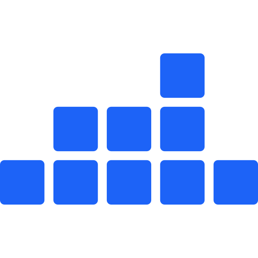 <code>doco-cd</code></a></td><td align="center"><a href="../logos/docs-collaboration.svg"> <code>docs-collaboration</code></a></td><td align="center"><a href="../logos/docsify.svg"> <code>docsify</code></a></td><td align="center"><a href="../logos/docsight.svg">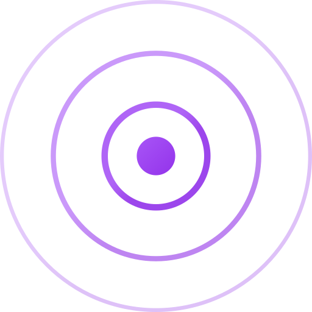 <code>docsight</code></a></td><td align="center"><a href="../logos/docspell.svg">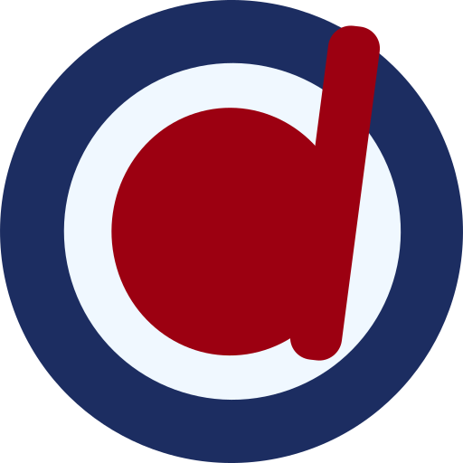 <code>docspell</code></a></td><td align="center"><a href="../logos/documenso.svg"> <code>documenso</code></a></td></tr>
<tr><td align="center"><a href="../logos/docus.svg"> <code>docus</code></a></td><td align="center"><a href="../logos/docuseal.svg">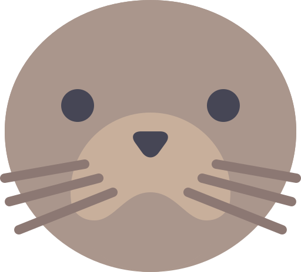 <code>docuseal</code></a></td><td align="center"><a href="../logos/dokemon.svg">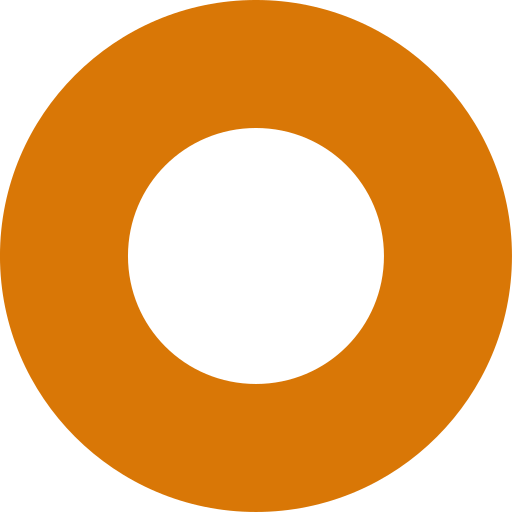 <code>dokemon</code></a></td><td align="center"><a href="../logos/dokku.svg">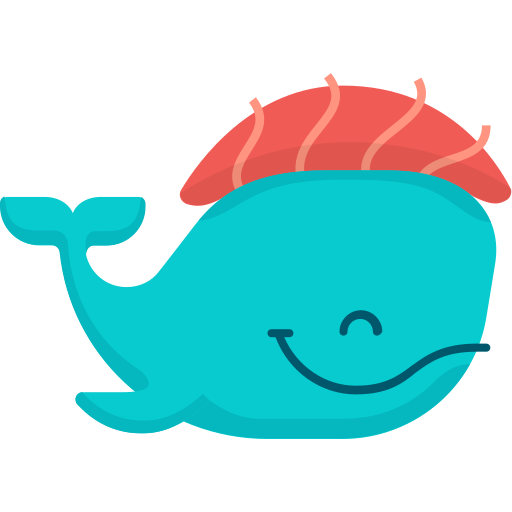 <code>dokku</code></a></td><td align="center"><a href="../logos/dokploy.svg"> <code>dokploy</code></a></td><td align="center"><a href="../logos/dokuwiki.svg">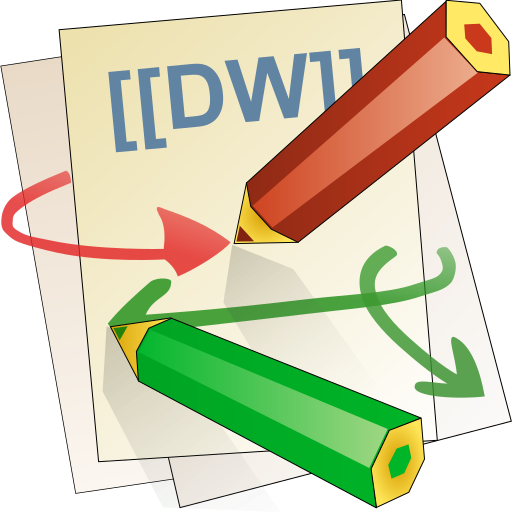 <code>dokuwiki</code></a></td></tr>
<tr><td align="center"><a href="../logos/dolibarr.svg"> <code>dolibarr</code></a></td><td align="center"><a href="../logos/domain-locker.svg"> <code>domain-locker</code></a></td><td align="center"><a href="../logos/domain-watchdog.svg"> <code>domain-watchdog</code></a></td><td align="center"><a href="../logos/domainmod.svg"> <code>domainmod</code></a></td><td align="center"><a href="../logos/donetick.svg"> <code>donetick</code></a></td><td align="center"><a href="../logos/dooropener.svg">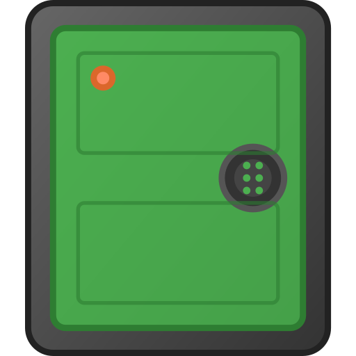 <code>dooropener</code></a></td></tr>
<tr><td align="center"><a href="../logos/doozle.svg"> <code>doozle</code></a></td><td align="center"><a href="../logos/doplarr.svg">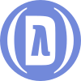 <code>doplarr</code></a></td><td align="center"><a href="../logos/doppler.svg"> <code>doppler</code></a></td><td align="center"><a href="../logos/dosvault.svg">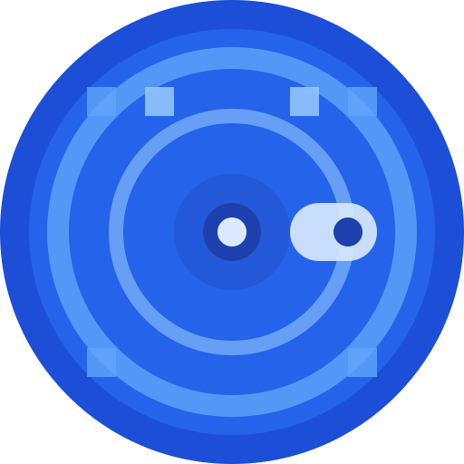 <code>dosvault</code></a></td><td align="center"><a href="../logos/double-commander.svg"> <code>double-commander</code></a></td><td align="center"><a href="../logos/double-take.svg">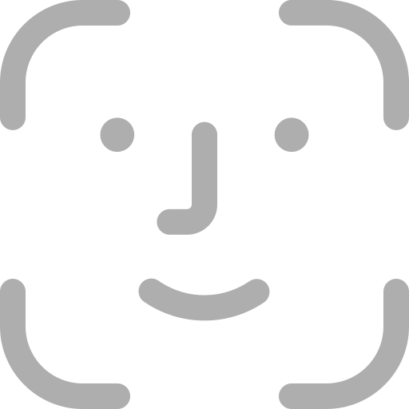 <code>double-take</code></a></td></tr>
<tr><td align="center"><a href="../logos/dovetail.svg"> <code>dovetail</code></a></td><td align="center"><a href="../logos/dovetail-wordmark.svg"> <code>dovetail-wordmark</code></a></td><td align="center"><a href="../logos/dozzle.svg"> <code>dozzle</code></a></td><td align="center"><a href="../logos/drasl.svg"> <code>drasl</code></a></td><td align="center"><a href="../logos/draytek.svg"> <code>draytek</code></a></td><td align="center"><a href="../logos/dribdat.svg">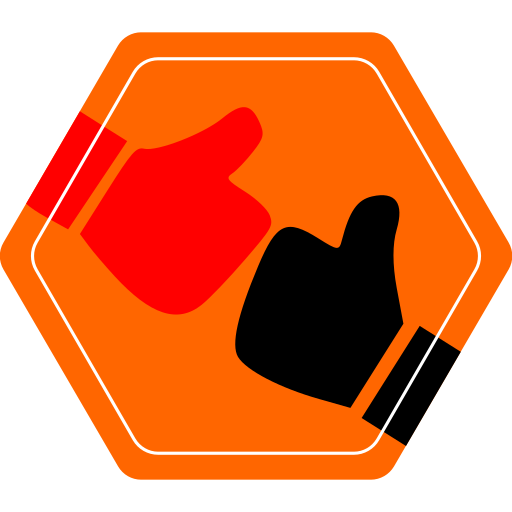 <code>dribdat</code></a></td></tr>
<tr><td align="center"><a href="../logos/drivebase.svg"> <code>drivebase</code></a></td><td align="center"><a href="../logos/drone-ci.svg"> <code>drone-ci</code></a></td><td align="center"><a href="../logos/drop.svg"> <code>drop</code></a></td><td align="center"><a href="../logos/dropbox.svg"> <code>dropbox</code></a></td><td align="center"><a href="../logos/dropbox-wordmark.svg"> <code>dropbox-wordmark</code></a></td><td align="center"><a href="../logos/dropmark.svg"> <code>dropmark</code></a></td></tr>
<tr><td align="center"><a href="../logos/dropout.svg"> <code>dropout</code></a></td><td align="center"><a href="../logos/droppy.svg"> <code>droppy</code></a></td><td align="center"><a href="../logos/dub.svg">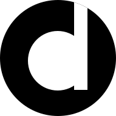 <code>dub</code></a></td><td align="center"><a href="../logos/duckdns.svg">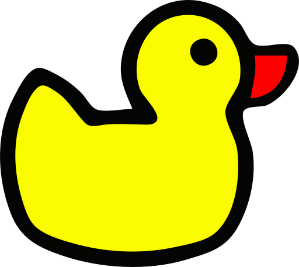 <code>duckdns</code></a></td><td align="center"><a href="../logos/dumb-genius.svg"> <code>dumb-genius</code></a></td><td align="center"><a href="../logos/dumbassets.svg">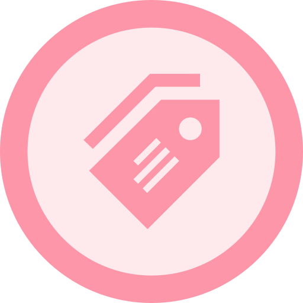 <code>dumbassets</code></a></td></tr>
<tr><td align="center"><a href="../logos/dumbbudget.svg">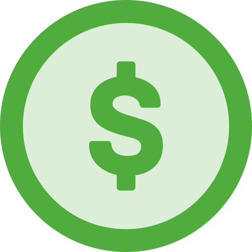 <code>dumbbudget</code></a></td><td align="center"><a href="../logos/dumbdo.svg">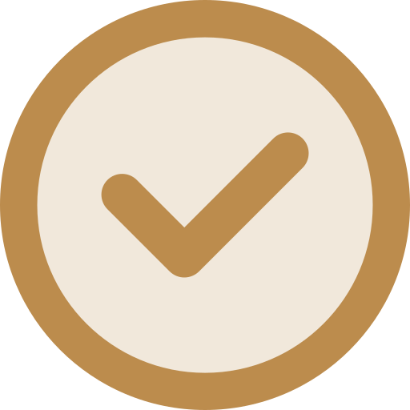 <code>dumbdo</code></a></td><td align="center"><a href="../logos/dumbdrop.svg">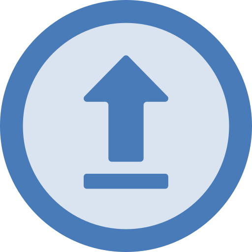 <code>dumbdrop</code></a></td><td align="center"><a href="../logos/dumbkan.svg">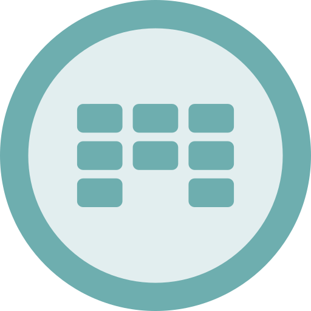 <code>dumbkan</code></a></td><td align="center"><a href="../logos/dumbpad.svg">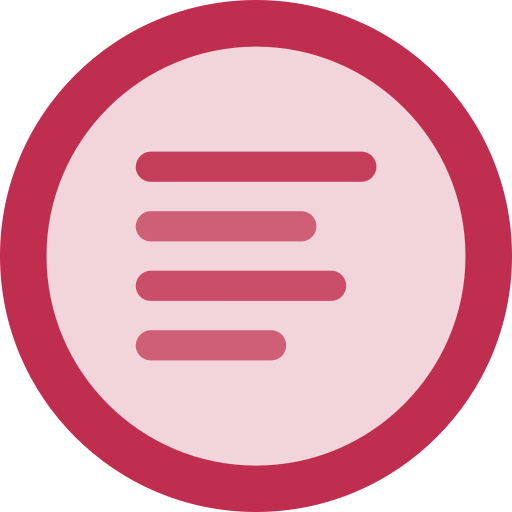 <code>dumbpad</code></a></td><td align="center"><a href="../logos/dumbterm.svg">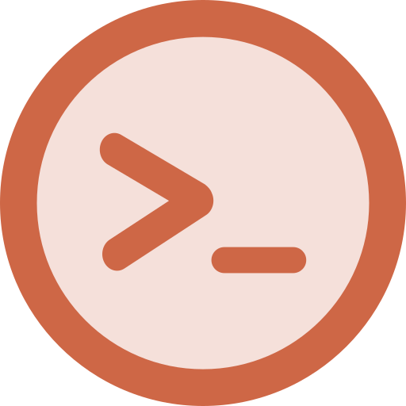 <code>dumbterm</code></a></td></tr>
<tr><td align="center"><a href="../logos/dumbwhois.svg">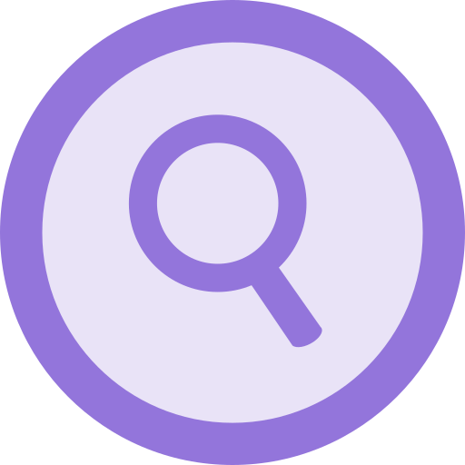 <code>dumbwhois</code></a></td><td align="center"><a href="../logos/duo.svg">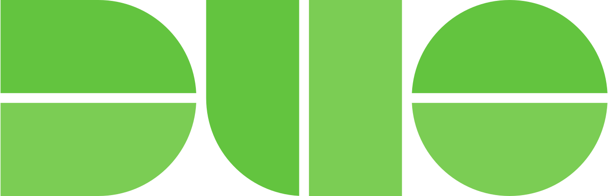 <code>duo</code></a></td><td align="center"><a href="../logos/duplicati.svg"> <code>duplicati</code></a></td><td align="center"><a href="../logos/dvd.svg"> <code>dvd</code></a></td><td align="center"><a href="../logos/dynacat.svg">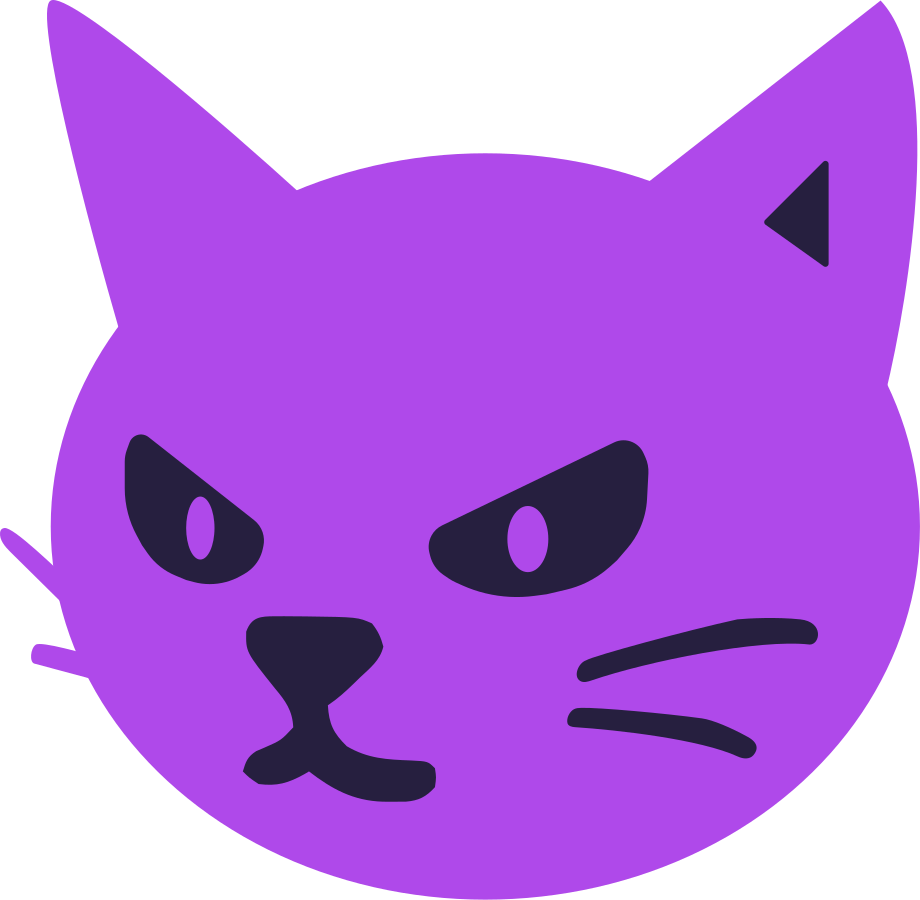 <code>dynacat</code></a></td><td align="center"><a href="../logos/dynamodb-dashboard.svg">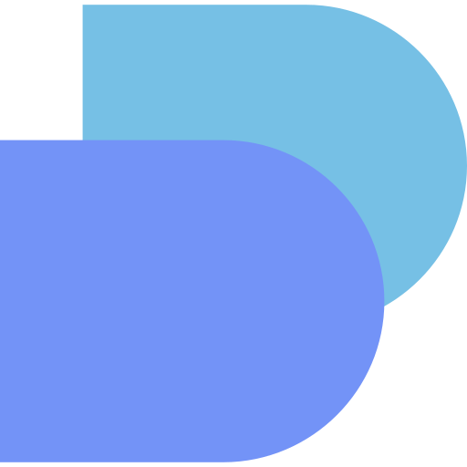 <code>dynamodb-dashboard</code></a></td></tr>
<tr><td align="center"><a href="../logos/dynfi.svg"> <code>dynfi</code></a></td><td align="center"><a href="../logos/e-trade.svg">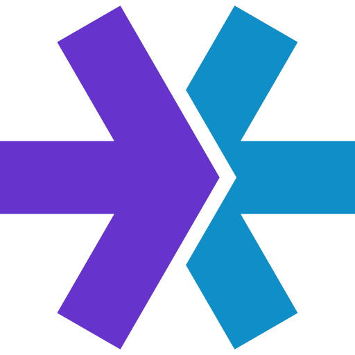 <code>e-trade</code></a></td><td align="center"><a href="../logos/easy-gate.svg"> <code>easy-gate</code></a></td><td align="center"><a href="../logos/easy-redmine.svg"> <code>easy-redmine</code></a></td><td align="center"><a href="../logos/easyepg-lite.svg"> <code>easyepg-lite</code></a></td><td align="center"><a href="../logos/easypanel.svg">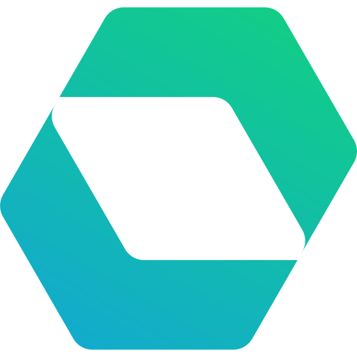 <code>easypanel</code></a></td></tr>
<tr><td align="center"><a href="../logos/eblocker.svg"> <code>eblocker</code></a></td><td align="center"><a href="../logos/ecosia-wordmark.svg"> <code>ecosia-wordmark</code></a></td><td align="center"><a href="../logos/ecowitt.svg">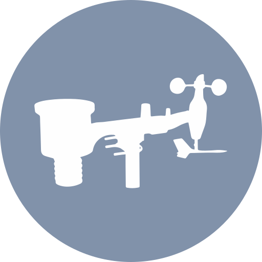 <code>ecowitt</code></a></td><td align="center"><a href="../logos/edge.svg">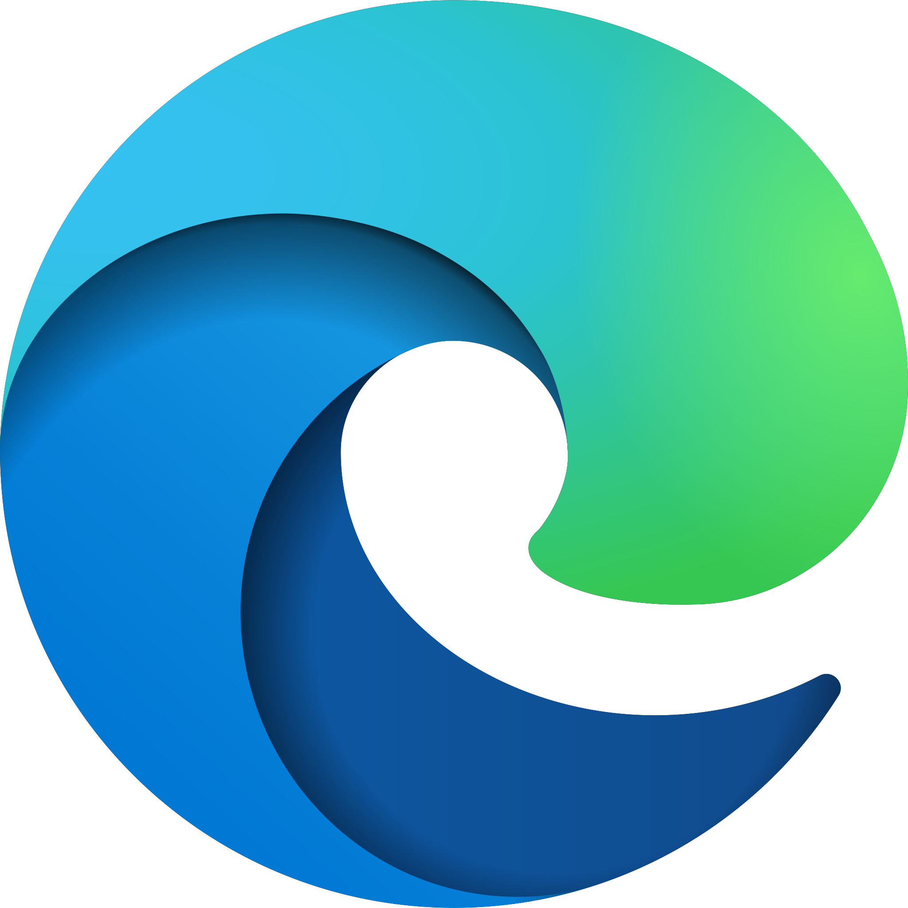 <code>edge</code></a></td><td align="center"><a href="../logos/edubuntu.svg"> <code>edubuntu</code></a></td><td align="center"><a href="../logos/eenvo.svg">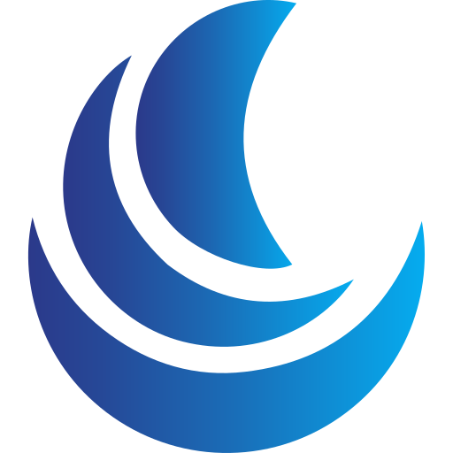 <code>eenvo</code></a></td></tr>
<tr><td align="center"><a href="../logos/eigenfocus.svg">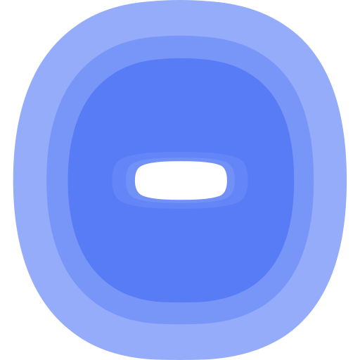 <code>eigenfocus</code></a></td><td align="center"><a href="../logos/eisfair.svg">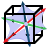 <code>eisfair</code></a></td><td align="center"><a href="../logos/eitaa.svg"> <code>eitaa</code></a></td><td align="center"><a href="../logos/ejabberd.svg"> <code>ejabberd</code></a></td><td align="center"><a href="../logos/elabftw.svg"> <code>elabftw</code></a></td><td align="center"><a href="../logos/elastic-beats.svg"> <code>elastic-beats</code></a></td></tr>
<tr><td align="center"><a href="../logos/elastic-kibana.svg"> <code>elastic-kibana</code></a></td><td align="center"><a href="../logos/elastic-logstash.svg"> <code>elastic-logstash</code></a></td><td align="center"><a href="../logos/electronic-arts.svg"> <code>electronic-arts</code></a></td><td align="center"><a href="../logos/electrum.svg"> <code>electrum</code></a></td><td align="center"><a href="../logos/eleven-labs.svg"> <code>eleven-labs</code></a></td><td align="center"><a href="../logos/elgato-wave-link.svg">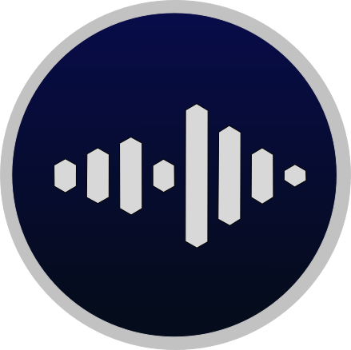 <code>elgato-wave-link</code></a></td></tr>
<tr><td align="center"><a href="../logos/elysian.svg"> <code>elysian</code></a></td><td align="center"><a href="../logos/embraer.svg"> <code>embraer</code></a></td><td align="center"><a href="../logos/emby.svg"> <code>emby</code></a></td><td align="center"><a href="../logos/emoncms.svg">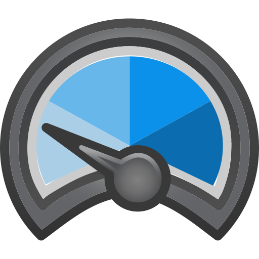 <code>emoncms</code></a></td><td align="center"><a href="../logos/emq.svg"> <code>emq</code></a></td><td align="center"><a href="../logos/emqx.svg"> <code>emqx</code></a></td></tr>
<tr><td align="center"><a href="../logos/emsesp.svg">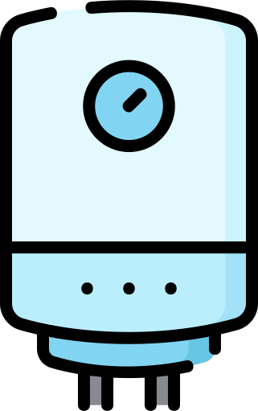 <code>emsesp</code></a></td><td align="center"><a href="../logos/enbizcard.svg"> <code>enbizcard</code></a></td><td align="center"><a href="../logos/enclosed.svg"> <code>enclosed</code></a></td><td align="center"><a href="../logos/endel.svg"> <code>endel</code></a></td><td align="center"><a href="../logos/endless.svg"> <code>endless</code></a></td><td align="center"><a href="../logos/endurain.svg"> <code>endurain</code></a></td></tr>
<tr><td align="center"><a href="../logos/enhance.svg">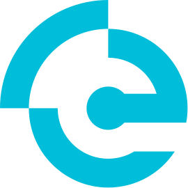 <code>enhance</code></a></td><td align="center"><a href="../logos/enphase.svg"> <code>enphase</code></a></td><td align="center"><a href="../logos/ente-locker.svg"> <code>ente-locker</code></a></td><td align="center"><a href="../logos/ente-photos.svg"> <code>ente-photos</code></a></td><td align="center"><a href="../logos/entergy.svg"> <code>entergy</code></a></td><td align="center"><a href="../logos/eonvelope.svg"> <code>eonvelope</code></a></td></tr>
<tr><td align="center"><a href="../logos/ephemera.svg"> <code>ephemera</code></a></td><td align="center"><a href="../logos/ergo.svg"> <code>ergo</code></a></td><td align="center"><a href="../logos/ersatztv.svg"> <code>ersatztv</code></a></td><td align="center"><a href="../logos/erste.svg"> <code>erste</code></a></td><td align="center"><a href="../logos/erste-george.svg"> <code>erste-george</code></a></td><td align="center"><a href="../logos/erugo.svg">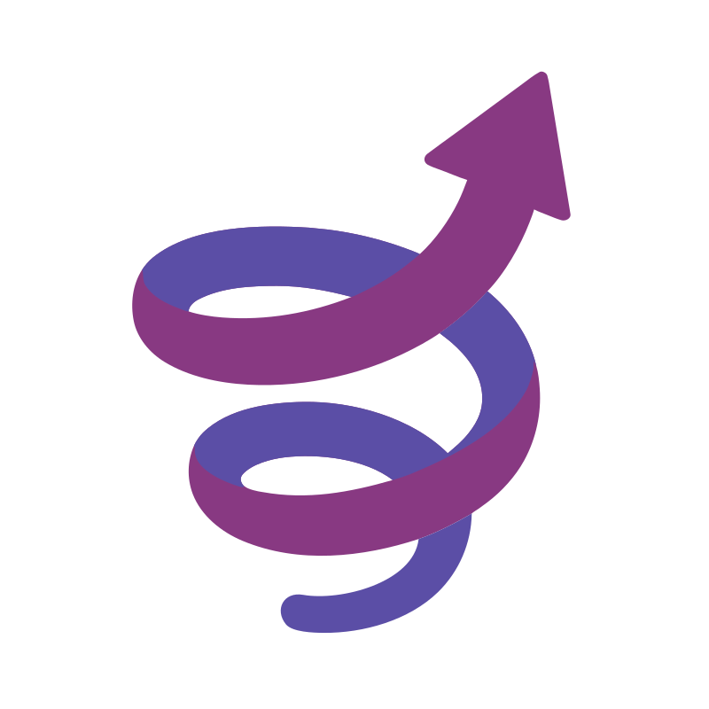 <code>erugo</code></a></td></tr>
<tr><td align="center"><a href="../logos/espconnect.svg">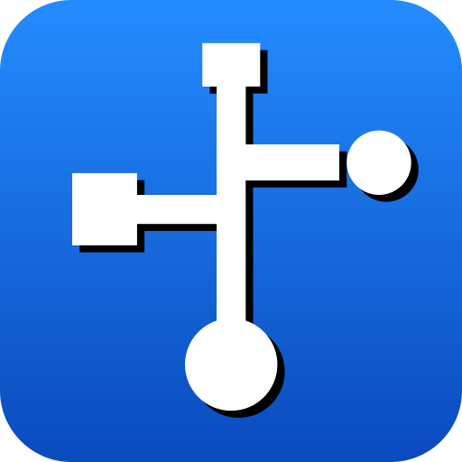 <code>espconnect</code></a></td><td align="center"><a href="../logos/esphome.svg">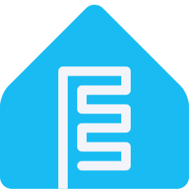 <code>esphome</code></a></td><td align="center"><a href="../logos/esphome-alt.svg"> <code>esphome-alt</code></a></td><td align="center"><a href="../logos/espocrm.svg"> <code>espocrm</code></a></td><td align="center"><a href="../logos/eternal-vows.svg">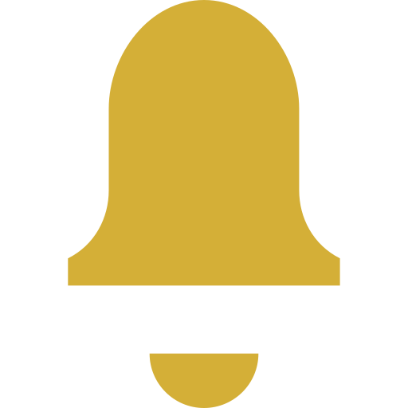 <code>eternal-vows</code></a></td><td align="center"><a href="../logos/etesync.svg"> <code>etesync</code></a></td></tr>
<tr><td align="center"><a href="../logos/etherpad.svg"> <code>etherpad</code></a></td><td align="center"><a href="../logos/eu-calendar.svg"> <code>eu-calendar</code></a></td><td align="center"><a href="../logos/eu-docs.svg"> <code>eu-docs</code></a></td><td align="center"><a href="../logos/eu-drive.svg"> <code>eu-drive</code></a></td><td align="center"><a href="../logos/eu-presentation.svg"> <code>eu-presentation</code></a></td><td align="center"><a href="../logos/eu-spreadsheet.svg"> <code>eu-spreadsheet</code></a></td></tr>
<tr><td align="center"><a href="../logos/eu-talk.svg"> <code>eu-talk</code></a></td><td align="center"><a href="../logos/europris.svg"> <code>europris</code></a></td><td align="center"><a href="../logos/evcc.svg"> <code>evcc</code></a></td><td align="center"><a href="../logos/everhour.svg"> <code>everhour</code></a></td><td align="center"><a href="../logos/evernote.svg"> <code>evernote</code></a></td><td align="center"><a href="../logos/evernote-wordmark.svg"> <code>evernote-wordmark</code></a></td></tr>
<tr><td align="center"><a href="../logos/evsy.svg"> <code>evsy</code></a></td><td align="center"><a href="../logos/excalidash.svg">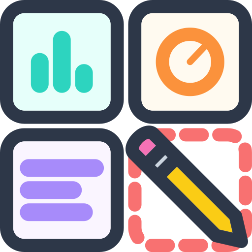 <code>excalidash</code></a></td><td align="center"><a href="../logos/exclaimer.svg"> <code>exclaimer</code></a></td><td align="center"><a href="../logos/exercism.svg"> <code>exercism</code></a></td><td align="center"><a href="../logos/eziwiki.svg">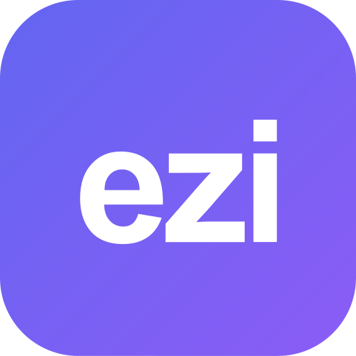 <code>eziwiki</code></a></td><td align="center"><a href="../logos/f1-dash.svg"> <code>f1-dash</code></a></td></tr>
<tr><td align="center"><a href="../logos/f4map.svg"> <code>f4map</code></a></td><td align="center"><a href="../logos/facebook-messenger.svg"> <code>facebook-messenger</code></a></td><td align="center"><a href="../logos/fairphone.svg"> <code>fairphone</code></a></td><td align="center"><a href="../logos/falcon-player.svg"> <code>falcon-player</code></a></td><td align="center"><a href="../logos/falkon-breeze.svg"> <code>falkon-breeze</code></a></td><td align="center"><a href="../logos/faridoon.svg"> <code>faridoon</code></a></td></tr>
<tr><td align="center"><a href="../logos/fast-com.svg"> <code>fast-com</code></a></td><td align="center"><a href="../logos/fasten-health.svg"> <code>fasten-health</code></a></td><td align="center"><a href="../logos/fastmail.svg"> <code>fastmail</code></a></td><td align="center"><a href="../logos/fava.svg"> <code>fava</code></a></td><td align="center"><a href="../logos/faved.svg">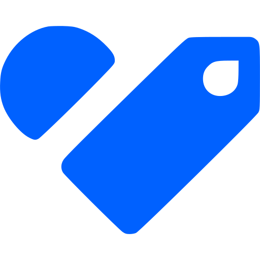 <code>faved</code></a></td><td align="center"><a href="../logos/fedora-alt.svg"> <code>fedora-alt</code></a></td></tr>
<tr><td align="center"><a href="../logos/feedbase.svg"> <code>feedbase</code></a></td><td align="center"><a href="../logos/feedbin.svg"> <code>feedbin</code></a></td><td align="center"><a href="../logos/feedlynx.svg"> <code>feedlynx</code></a></td><td align="center"><a href="../logos/feedpushr.svg"> <code>feedpushr</code></a></td><td align="center"><a href="../logos/feeds-fun.svg">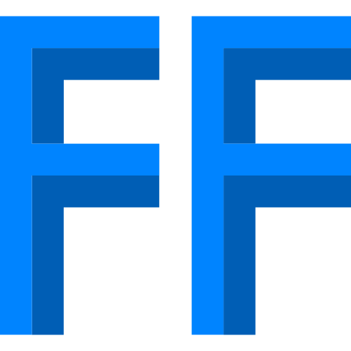 <code>feeds-fun</code></a></td><td align="center"><a href="../logos/feishin.svg"> <code>feishin</code></a></td></tr>
<tr><td align="center"><a href="../logos/fenrus.svg"> <code>fenrus</code></a></td><td align="center"><a href="../logos/ferdium.svg"> <code>ferdium</code></a></td><td align="center"><a href="../logos/ferretdb.svg"> <code>ferretdb</code></a></td><td align="center"><a href="../logos/ferrishare.svg"> <code>ferrishare</code></a></td><td align="center"><a href="../logos/ferron.svg">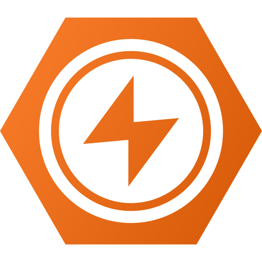 <code>ferron</code></a></td><td align="center"><a href="../logos/fhem.svg"> <code>fhem</code></a></td></tr>
<tr><td align="center"><a href="../logos/fidelity.svg"> <code>fidelity</code></a></td><td align="center"><a href="../logos/fider.svg"> <code>fider</code></a></td><td align="center"><a href="../logos/filameter.svg">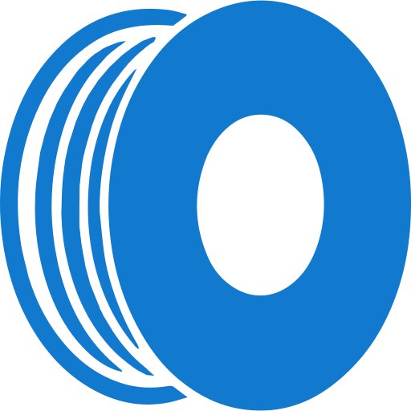 <code>filameter</code></a></td><td align="center"><a href="../logos/file-explorer.svg"> <code>file-explorer</code></a></td><td align="center"><a href="../logos/file-portal.svg"> <code>file-portal</code></a></td><td align="center"><a href="../logos/file-wizard.svg"> <code>file-wizard</code></a></td></tr>
<tr><td align="center"><a href="../logos/filebot.svg"> <code>filebot</code></a></td><td align="center"><a href="../logos/filebrowser.svg"> <code>filebrowser</code></a></td><td align="center"><a href="../logos/filebrowser-quantum.svg"> <code>filebrowser-quantum</code></a></td><td align="center"><a href="../logos/filecloud.svg"> <code>filecloud</code></a></td><td align="center"><a href="../logos/filedrop.svg">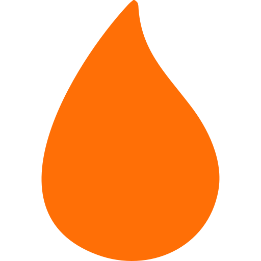 <code>filedrop</code></a></td><td align="center"><a href="../logos/fileflows.svg">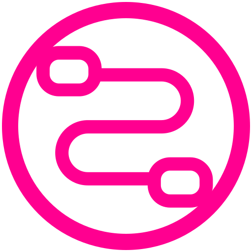 <code>fileflows</code></a></td></tr>
<tr><td align="center"><a href="../logos/filegator.svg"> <code>filegator</code></a></td><td align="center"><a href="../logos/filen.svg"> <code>filen</code></a></td><td align="center"><a href="../logos/filepizza.svg">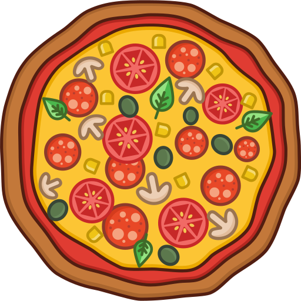 <code>filepizza</code></a></td><td align="center"><a href="../logos/filerise.svg"> <code>filerise</code></a></td><td align="center"><a href="../logos/filerun.svg">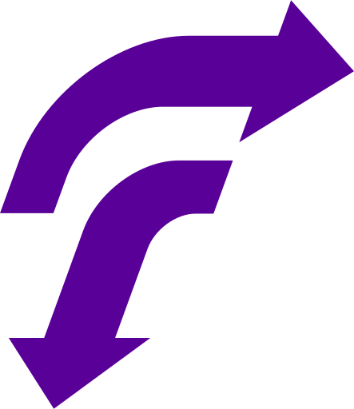 <code>filerun</code></a></td><td align="center"><a href="../logos/files.svg"> <code>files</code></a></td></tr>
<tr><td align="center"><a href="../logos/files-community.svg"> <code>files-community</code></a></td><td align="center"><a href="../logos/filestash.svg"> <code>filestash</code></a></td><td align="center"><a href="../logos/filesync.svg"> <code>filesync</code></a></td><td align="center"><a href="../logos/filezilla.svg"> <code>filezilla</code></a></td><td align="center"><a href="../logos/finamp.svg"> <code>finamp</code></a></td><td align="center"><a href="../logos/finanzen-zero.svg"> <code>finanzen-zero</code></a></td></tr>
<tr><td align="center"><a href="../logos/findroid.svg"> <code>findroid</code></a></td><td align="center"><a href="../logos/finn.svg">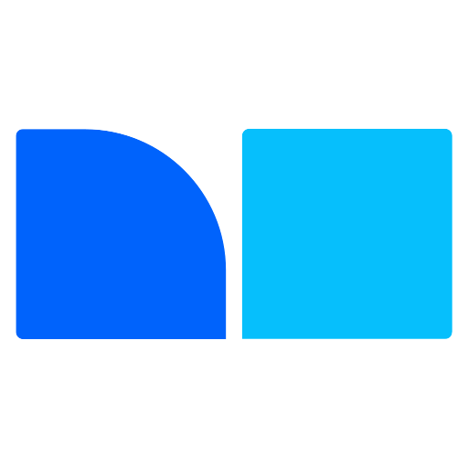 <code>finn</code></a></td><td align="center"><a href="../logos/fios.svg"> <code>fios</code></a></td><td align="center"><a href="../logos/firefly.svg"> <code>firefly</code></a></td><td align="center"><a href="../logos/firefox-beta.svg"> <code>firefox-beta</code></a></td><td align="center"><a href="../logos/firefox-developer-edition.svg"> <code>firefox-developer-edition</code></a></td></tr>
<tr><td align="center"><a href="../logos/firefox-lite.svg"> <code>firefox-lite</code></a></td><td align="center"><a href="../logos/firefox-nightly.svg"> <code>firefox-nightly</code></a></td><td align="center"><a href="../logos/firefox-send.svg"> <code>firefox-send</code></a></td><td align="center"><a href="../logos/fireshare.svg"> <code>fireshare</code></a></td><td align="center"><a href="../logos/firezone.svg"> <code>firezone</code></a></td><td align="center"><a href="../logos/fittrackee.svg"> <code>fittrackee</code></a></td></tr>
<tr><td align="center"><a href="../logos/fladder.svg"> <code>fladder</code></a></td><td align="center"><a href="../logos/flaresolverr.svg"> <code>flaresolverr</code></a></td><td align="center"><a href="../logos/flashpaper.svg"> <code>flashpaper</code></a></td><td align="center"><a href="../logos/flatnotes.svg">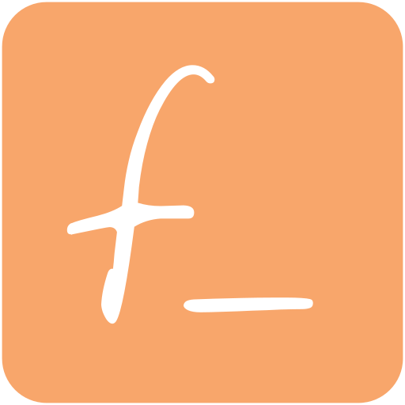 <code>flatnotes</code></a></td><td align="center"><a href="../logos/fleetdm.svg">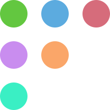 <code>fleetdm</code></a></td><td align="center"><a href="../logos/fli-so.svg"> <code>fli-so</code></a></td></tr>
<tr><td align="center"><a href="../logos/flightradar24.svg"> <code>flightradar24</code></a></td><td align="center"><a href="../logos/flint.svg"> <code>flint</code></a></td><td align="center"><a href="../logos/flixor.svg"> <code>flixor</code></a></td><td align="center"><a href="../logos/flohmarkt.svg">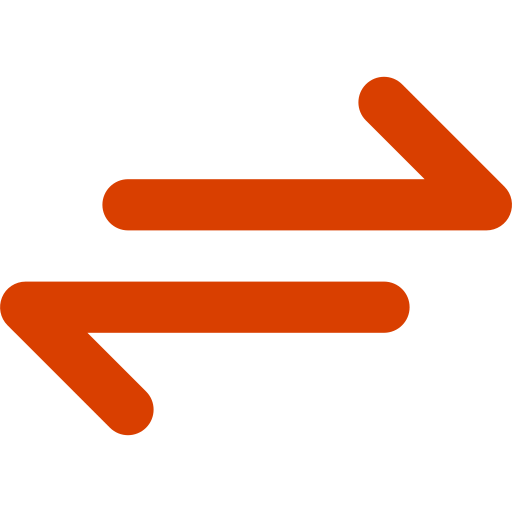 <code>flohmarkt</code></a></td><td align="center"><a href="../logos/flood.svg"> <code>flood</code></a></td><td align="center"><a href="../logos/floorp.svg"> <code>floorp</code></a></td></tr>
<tr><td align="center"><a href="../logos/flow-launcher.svg"> <code>flow-launcher</code></a></td><td align="center"><a href="../logos/flow-like.svg">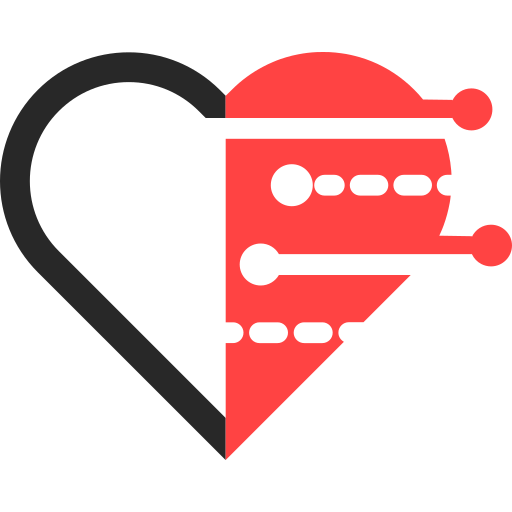 <code>flow-like</code></a></td><td align="center"><a href="../logos/flowinquiry.svg"> <code>flowinquiry</code></a></td><td align="center"><a href="../logos/flowise.svg">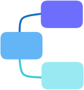 <code>flowise</code></a></td><td align="center"><a href="../logos/flowtunes.svg"> <code>flowtunes</code></a></td><td align="center"><a href="../logos/fluent-reader.svg"> <code>fluent-reader</code></a></td></tr>
<tr><td align="center"><a href="../logos/fluffychat.svg"> <code>fluffychat</code></a></td><td align="center"><a href="../logos/fluidcalendar.svg">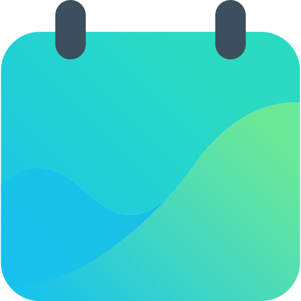 <code>fluidcalendar</code></a></td><td align="center"><a href="../logos/fluidd.svg"> <code>fluidd</code></a></td><td align="center"><a href="../logos/flux-cd.svg"> <code>flux-cd</code></a></td><td align="center"><a href="../logos/flux-operator.svg">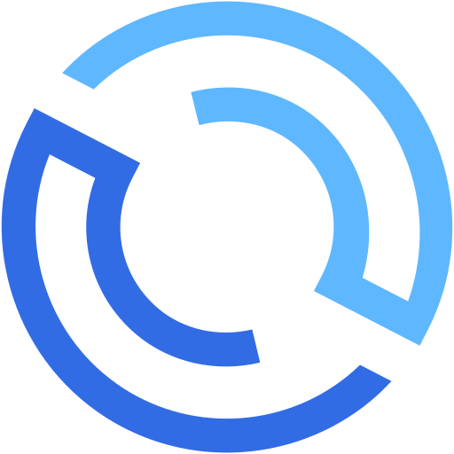 <code>flux-operator</code></a></td><td align="center"><a href="../logos/fmd.svg"> <code>fmd</code></a></td></tr>
<tr><td align="center"><a href="../logos/fnos.svg"> <code>fnos</code></a></td><td align="center"><a href="../logos/focalboard.svg"> <code>focalboard</code></a></td><td align="center"><a href="../logos/foldergram.svg">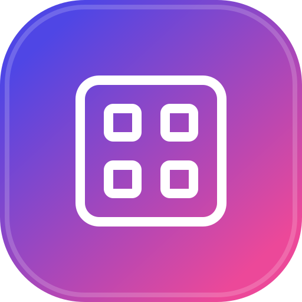 <code>foldergram</code></a></td><td align="center"><a href="../logos/folding-home.svg">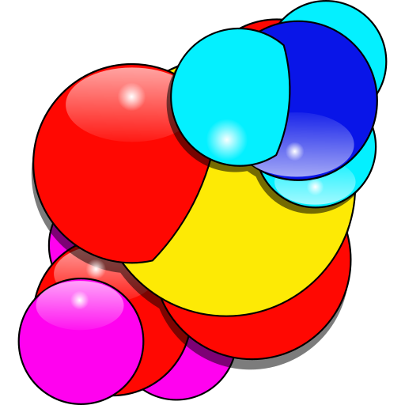 <code>folding-home</code></a></td><td align="center"><a href="../logos/foldingathome.svg">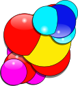 <code>foldingathome</code></a></td><td align="center"><a href="../logos/font-awesome-icons.svg"> <code>font-awesome-icons</code></a></td></tr>
<tr><td align="center"><a href="../logos/forauth.svg"> <code>forauth</code></a></td><td align="center"><a href="../logos/foreflight.svg"> <code>foreflight</code></a></td><td align="center"><a href="../logos/forgejo.svg"> <code>forgejo</code></a></td><td align="center"><a href="../logos/formance.svg"> <code>formance</code></a></td><td align="center"><a href="../logos/formbricks.svg"> <code>formbricks</code></a></td><td align="center"><a href="../logos/forms-md.svg"> <code>forms-md</code></a></td></tr>
<tr><td align="center"><a href="../logos/forte.svg"> <code>forte</code></a></td><td align="center"><a href="../logos/fortinet.svg">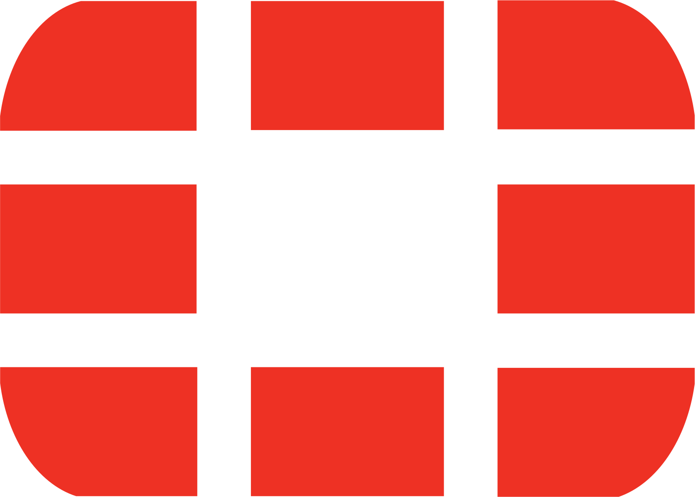 <code>fortinet</code></a></td><td align="center"><a href="../logos/foss-events.svg"> <code>foss-events</code></a></td><td align="center"><a href="../logos/fossil.svg"> <code>fossil</code></a></td><td align="center"><a href="../logos/foxit.svg"> <code>foxit</code></a></td><td align="center"><a href="../logos/framadate.svg">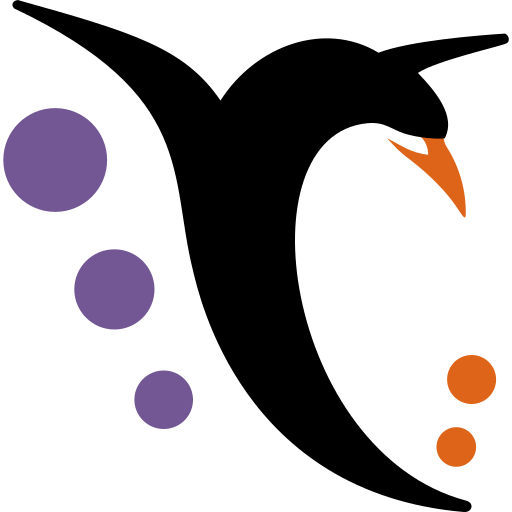 <code>framadate</code></a></td></tr>
<tr><td align="center"><a href="../logos/frames.svg">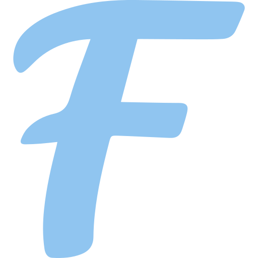 <code>frames</code></a></td><td align="center"><a href="../logos/frankmd.svg">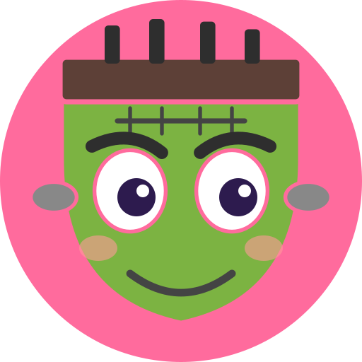 <code>frankmd</code></a></td><td align="center"><a href="../logos/franz.svg"> <code>franz</code></a></td><td align="center"><a href="../logos/frappe-books.svg"> <code>frappe-books</code></a></td><td align="center"><a href="../logos/frappe-builder.svg"> <code>frappe-builder</code></a></td><td align="center"><a href="../logos/frappe-erpnext.svg"> <code>frappe-erpnext</code></a></td></tr>
<tr><td align="center"><a href="../logos/frappe-framework.svg">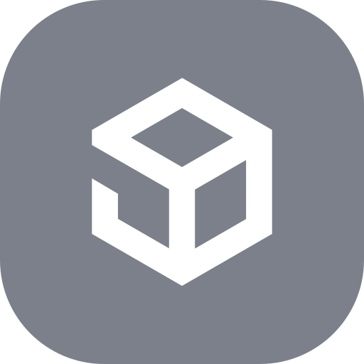 <code>frappe-framework</code></a></td><td align="center"><a href="../logos/frappe-gameplan.svg"> <code>frappe-gameplan</code></a></td><td align="center"><a href="../logos/frappe-helpdesk.svg"> <code>frappe-helpdesk</code></a></td><td align="center"><a href="../logos/frappe-hr.svg"> <code>frappe-hr</code></a></td><td align="center"><a href="../logos/frappe-insights.svg">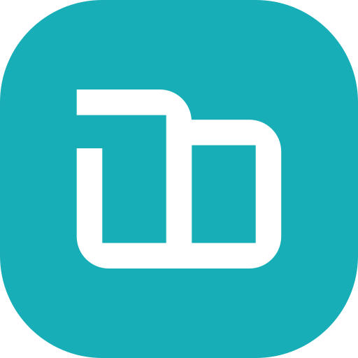 <code>frappe-insights</code></a></td><td align="center"><a href="../logos/frappe-learning.svg"> <code>frappe-learning</code></a></td></tr>
<tr><td align="center"><a href="../logos/frappe-lending.svg"> <code>frappe-lending</code></a></td><td align="center"><a href="../logos/free-isp.svg"> <code>free-isp</code></a></td><td align="center"><a href="../logos/free-sas.svg">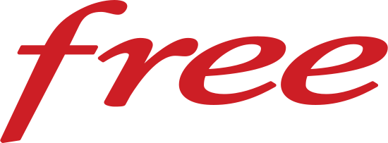 <code>free-sas</code></a></td><td align="center"><a href="../logos/freecad.svg"> <code>freecad</code></a></td><td align="center"><a href="../logos/freedcamp.svg"> <code>freedcamp</code></a></td><td align="center"><a href="../logos/freedcamp-wordmark.svg"> <code>freedcamp-wordmark</code></a></td></tr>
<tr><td align="center"><a href="../logos/freeipa.svg"> <code>freeipa</code></a></td><td align="center"><a href="../logos/freenas.svg"> <code>freenas</code></a></td><td align="center"><a href="../logos/freenom.svg"> <code>freenom</code></a></td><td align="center"><a href="../logos/freepbx.svg"> <code>freepbx</code></a></td><td align="center"><a href="../logos/freeradius.svg"> <code>freeradius</code></a></td><td align="center"><a href="../logos/freeresend.svg"> <code>freeresend</code></a></td></tr>
<tr><td align="center"><a href="../logos/freescout.svg"> <code>freescout</code></a></td><td align="center"><a href="../logos/freeshard.svg">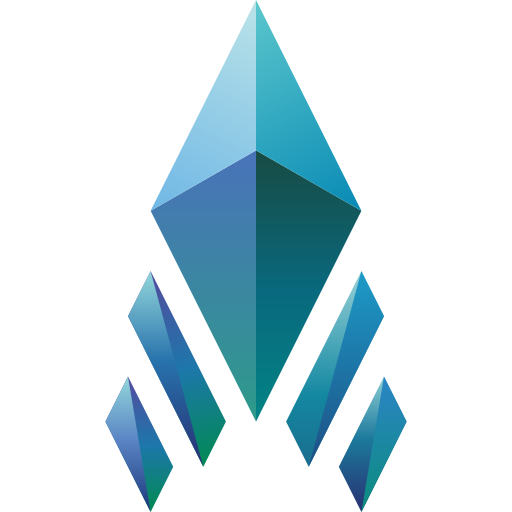 <code>freeshard</code></a></td><td align="center"><a href="../logos/fresh-editor.svg">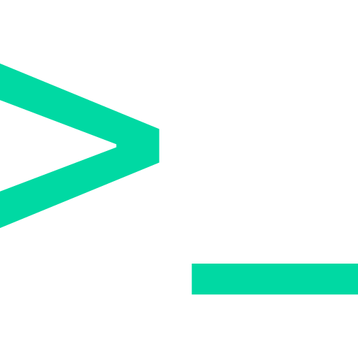 <code>fresh-editor</code></a></td><td align="center"><a href="../logos/freshbooks.svg"> <code>freshbooks</code></a></td><td align="center"><a href="../logos/freshping.svg"> <code>freshping</code></a></td><td align="center"><a href="../logos/freshrss.svg"> <code>freshrss</code></a></td></tr>
<tr><td align="center"><a href="../logos/frigate.svg"> <code>frigate</code></a></td><td align="center"><a href="../logos/frigoligo.svg">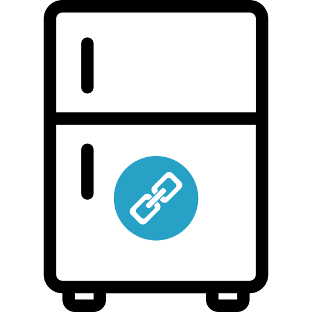 <code>frigoligo</code></a></td><td align="center"><a href="../logos/fritzbox.svg">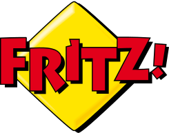 <code>fritzbox</code></a></td><td align="center"><a href="../logos/fronius.svg">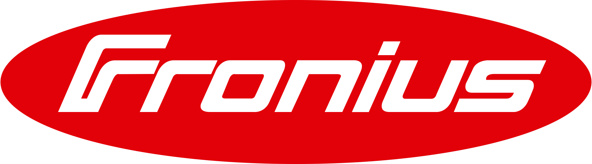 <code>fronius</code></a></td><td align="center"><a href="../logos/frontapp.svg"> <code>frontapp</code></a></td><td align="center"><a href="../logos/frontapp-wordmark.svg"> <code>frontapp-wordmark</code></a></td></tr>
<tr><td align="center"><a href="../logos/frp.svg"> <code>frp</code></a></td><td align="center"><a href="../logos/fruux.svg"> <code>fruux</code></a></td><td align="center"><a href="../logos/fubotv.svg"> <code>fubotv</code></a></td><td align="center"><a href="../logos/fulcio.svg"> <code>fulcio</code></a></td><td align="center"><a href="../logos/fumadocs.svg">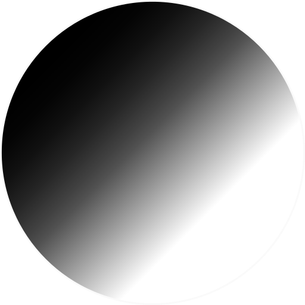 <code>fumadocs</code></a></td><td align="center"><a href="../logos/funkwhale.svg"> <code>funkwhale</code></a></td></tr>
<tr><td align="center"><a href="../logos/fusionauth.svg"> <code>fusionauth</code></a></td><td align="center"><a href="../logos/gameyfin.svg">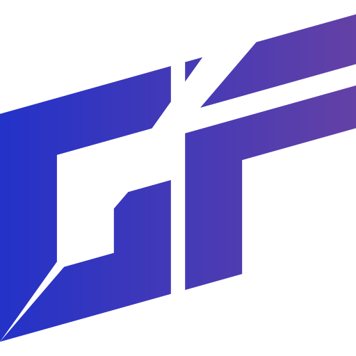 <code>gameyfin</code></a></td><td align="center"><a href="../logos/garage.svg"> <code>garage</code></a></td><td align="center"><a href="../logos/garlic-hub.svg">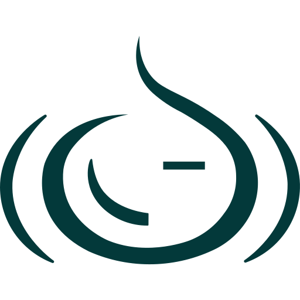 <code>garlic-hub</code></a></td><td align="center"><a href="../logos/garmin-grafana.svg">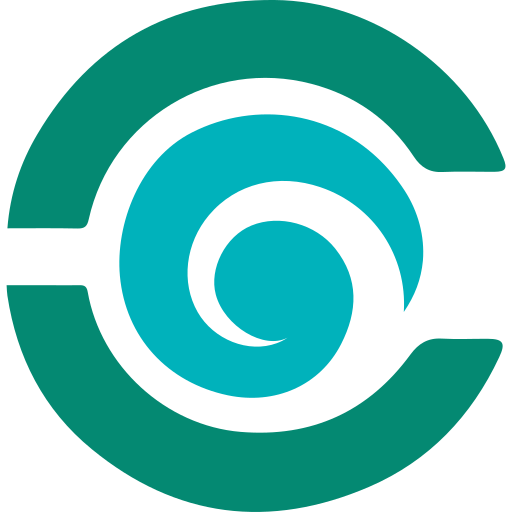 <code>garmin-grafana</code></a></td><td align="center"><a href="../logos/gathio.svg">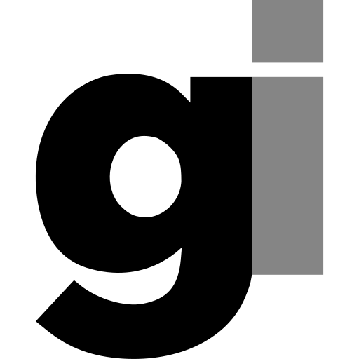 <code>gathio</code></a></td></tr>
<tr><td align="center"><a href="../logos/gatus.svg"> <code>gatus</code></a></td><td align="center"><a href="../logos/gboard.svg"> <code>gboard</code></a></td><td align="center"><a href="../logos/gdms.svg"> <code>gdms</code></a></td><td align="center"><a href="../logos/geckoview.svg"> <code>geckoview</code></a></td><td align="center"><a href="../logos/geeftlist.svg"> <code>geeftlist</code></a></td><td align="center"><a href="../logos/geekbot.svg"> <code>geekbot</code></a></td></tr>
<tr><td align="center"><a href="../logos/genua.svg"> <code>genua</code></a></td><td align="center"><a href="../logos/geo-guessr.svg"> <code>geo-guessr</code></a></td><td align="center"><a href="../logos/geopulse.svg"> <code>geopulse</code></a></td><td align="center"><a href="../logos/gerbera.svg"> <code>gerbera</code></a></td><td align="center"><a href="../logos/gerrit.svg"> <code>gerrit</code></a></td><td align="center"><a href="../logos/get-iplayer.svg">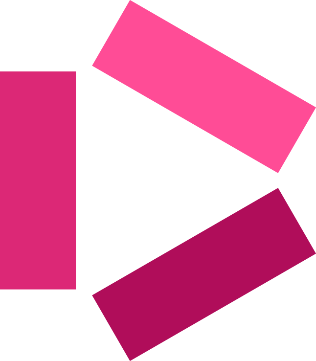 <code>get-iplayer</code></a></td></tr>
<tr><td align="center"><a href="../logos/getcomics.svg"> <code>getcomics</code></a></td><td align="center"><a href="../logos/ghostboard.svg"> <code>ghostboard</code></a></td><td align="center"><a href="../logos/ghostfolio.svg"> <code>ghostfolio</code></a></td><td align="center"><a href="../logos/gigaset.svg"> <code>gigaset</code></a></td><td align="center"><a href="../logos/gitbucket.svg"> <code>gitbucket</code></a></td><td align="center"><a href="../logos/gitbundle.svg"> <code>gitbundle</code></a></td></tr>
<tr><td align="center"><a href="../logos/gitee.svg"> <code>gitee</code></a></td><td align="center"><a href="../logos/gitsave.svg"> <code>gitsave</code></a></td><td align="center"><a href="../logos/gitsign.svg"> <code>gitsign</code></a></td><td align="center"><a href="../logos/glance.svg">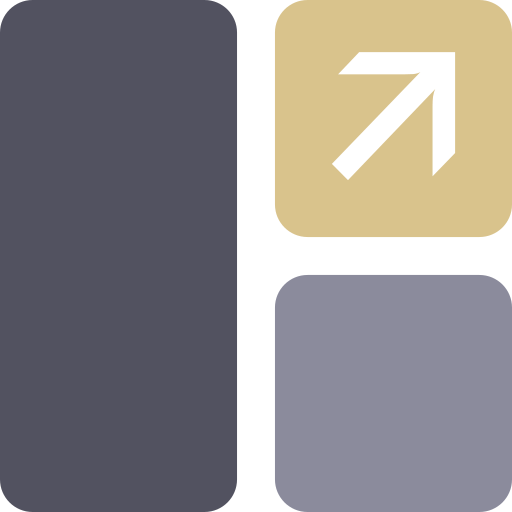 <code>glance</code></a></td><td align="center"><a href="../logos/glances.svg"> <code>glances</code></a></td><td align="center"><a href="../logos/glinet.svg"> <code>glinet</code></a></td></tr>
<tr><td align="center"><a href="../logos/glitchtip.svg"> <code>glitchtip</code></a></td><td align="center"><a href="../logos/global-threat-map.svg">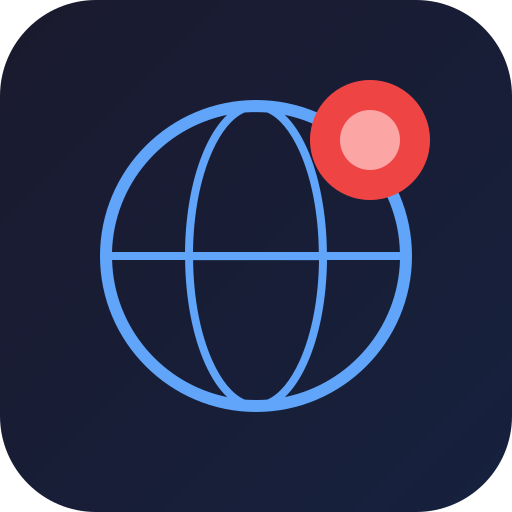 <code>global-threat-map</code></a></td><td align="center"><a href="../logos/globaleaks.svg"> <code>globaleaks</code></a></td><td align="center"><a href="../logos/glowstone.svg"> <code>glowstone</code></a></td><td align="center"><a href="../logos/glpi.svg"> <code>glpi</code></a></td><td align="center"><a href="../logos/gluetun.svg">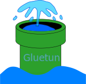 <code>gluetun</code></a></td></tr>
<tr><td align="center"><a href="../logos/gmail-cleaner.svg"> <code>gmail-cleaner</code></a></td><td align="center"><a href="../logos/gns3.svg">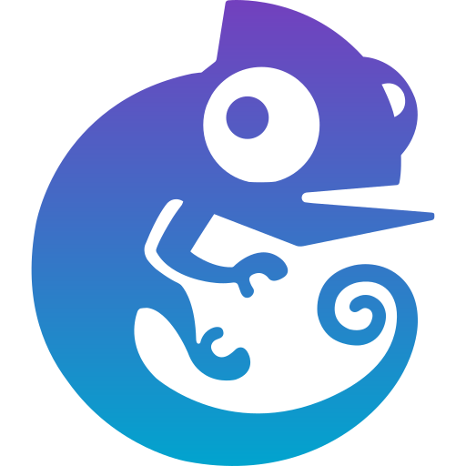 <code>gns3</code></a></td><td align="center"><a href="../logos/gnustep.svg"> <code>gnustep</code></a></td><td align="center"><a href="../logos/go2rtc.svg"> <code>go2rtc</code></a></td><td align="center"><a href="../logos/goaccess.svg"> <code>goaccess</code></a></td><td align="center"><a href="../logos/godaddy-alt.svg"> <code>godaddy-alt</code></a></td></tr>
<tr><td align="center"><a href="../logos/goil.svg"> <code>goil</code></a></td><td align="center"><a href="../logos/goil-wordmark.svg"> <code>goil-wordmark</code></a></td><td align="center"><a href="../logos/golang.svg"> <code>golang</code></a></td><td align="center"><a href="../logos/golang-wordmark.svg"> <code>golang-wordmark</code></a></td><td align="center"><a href="../logos/goldilocks.svg"> <code>goldilocks</code></a></td><td align="center"><a href="../logos/golink.svg"> <code>golink</code></a></td></tr>
<tr><td align="center"><a href="../logos/gomft.svg"> <code>gomft</code></a></td><td align="center"><a href="../logos/gonic.svg">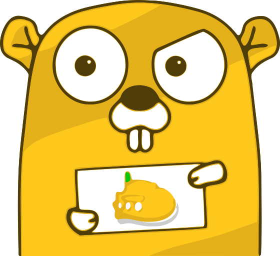 <code>gonic</code></a></td><td align="center"><a href="../logos/google-360suite.svg"> <code>google-360suite</code></a></td><td align="center"><a href="../logos/google-admin.svg"> <code>google-admin</code></a></td><td align="center"><a href="../logos/google-alerts.svg"> <code>google-alerts</code></a></td><td align="center"><a href="../logos/google-calendar.svg"> <code>google-calendar</code></a></td></tr>
<tr><td align="center"><a href="../logos/google-calendar-2026.svg"> <code>google-calendar-2026</code></a></td><td align="center"></td><td align="center"><a href="../logos/google-collaborative-content-tools.svg"> <code>google-collaborative-content-tools</code></a></td><td align="center"><a href="../logos/google-compute-engine.svg">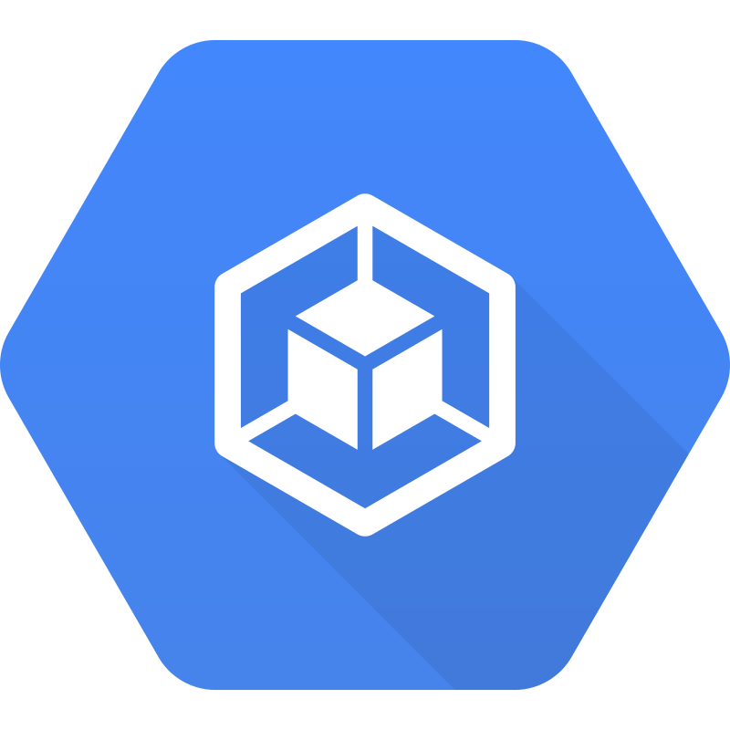 <code>google-compute-engine</code></a></td><td align="center"><a href="../logos/google-contacts.svg"> <code>google-contacts</code></a></td><td align="center"><a href="../logos/google-currents.svg"> <code>google-currents</code></a></td></tr>
<tr><td align="center"><a href="../logos/google-docs.svg"> <code>google-docs</code></a></td><td align="center"><a href="../logos/google-docs-2026.svg"> <code>google-docs-2026</code></a></td><td align="center"><a href="../logos/google-docs-editors.svg"> <code>google-docs-editors</code></a></td><td align="center"><a href="../logos/google-drive.svg"> <code>google-drive</code></a></td><td align="center"><a href="../logos/google-drive-2026.svg">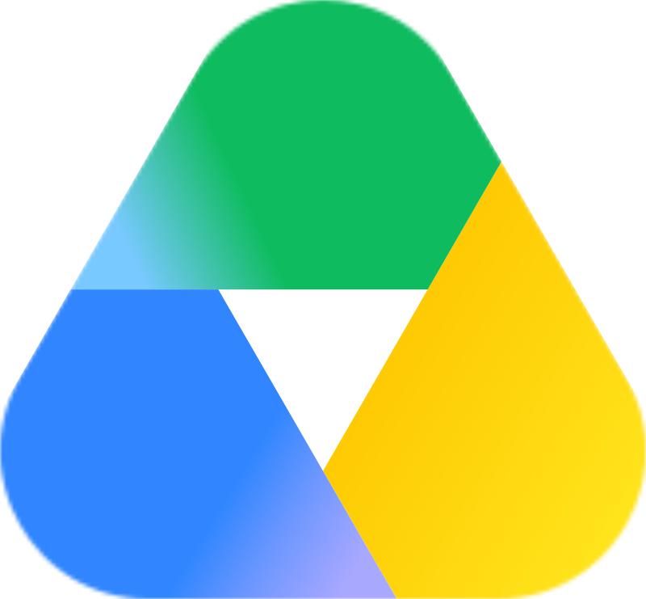 <code>google-drive-2026</code></a></td><td align="center"><a href="../logos/google-drive-wordmark.svg"> <code>google-drive-wordmark</code></a></td></tr>
<tr><td align="center"><a href="../logos/google-earth.svg">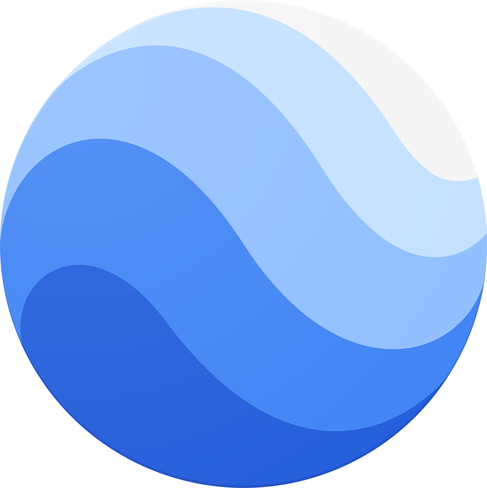 <code>google-earth</code></a></td><td align="center"><a href="../logos/google-fi.svg"> <code>google-fi</code></a></td><td align="center"><a href="../logos/google-find.svg">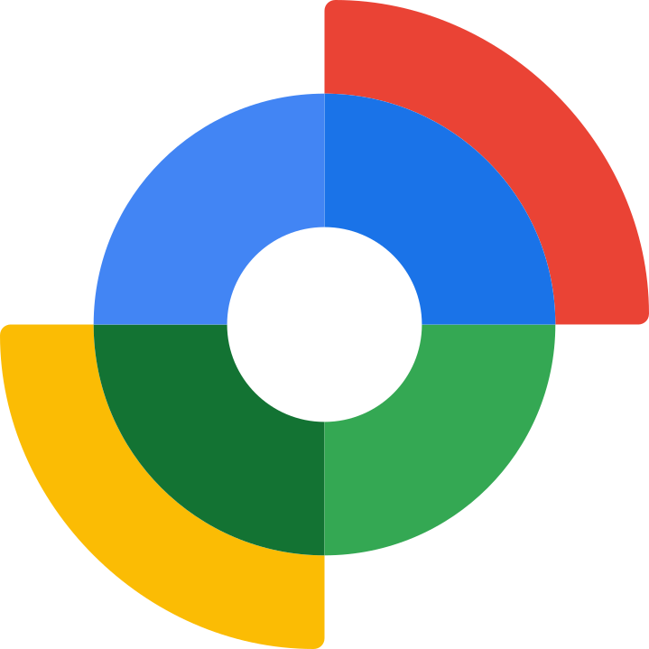 <code>google-find</code></a></td><td align="center"><a href="../logos/google-forms.svg"> <code>google-forms</code></a></td><td align="center"><a href="../logos/google-forms-2026.svg">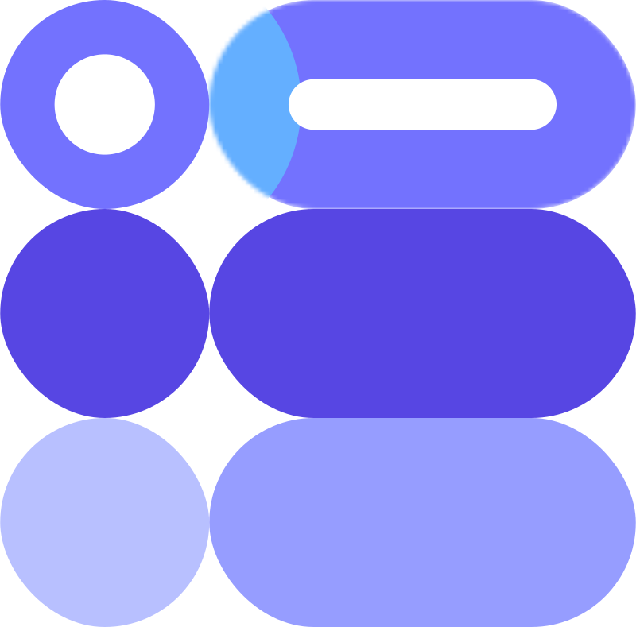 <code>google-forms-2026</code></a></td><td align="center"><a href="../logos/google-gmail.svg"> <code>google-gmail</code></a></td></tr>
<tr><td align="center"><a href="../logos/google-gmail-2026.svg"> <code>google-gmail-2026</code></a></td><td align="center"><a href="../logos/google-gsuite.svg"> <code>google-gsuite</code></a></td><td align="center"><a href="../logos/google-idx.svg">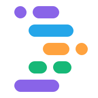 <code>google-idx</code></a></td><td align="center"><a href="../logos/google-inbox.svg"> <code>google-inbox</code></a></td><td align="center"><a href="../logos/google-jules.svg"> <code>google-jules</code></a></td><td align="center"><a href="../logos/google-keep.svg"> <code>google-keep</code></a></td></tr>
<tr><td align="center"><a href="../logos/google-keep-2026.svg"> <code>google-keep-2026</code></a></td><td align="center"><a href="../logos/google-lens.svg"> <code>google-lens</code></a></td><td align="center"><a href="../logos/google-meet-2026.svg"> <code>google-meet-2026</code></a></td><td align="center"><a href="../logos/google-messages.svg"> <code>google-messages</code></a></td><td align="center"><a href="../logos/google-news.svg"> <code>google-news</code></a></td><td align="center"><a href="../logos/google-play-books.svg"> <code>google-play-books</code></a></td></tr>
<tr><td align="center"><a href="../logos/google-play-games.svg"> <code>google-play-games</code></a></td><td align="center"><a href="../logos/google-sheets.svg"> <code>google-sheets</code></a></td><td align="center"><a href="../logos/google-sheets-2026.svg"> <code>google-sheets-2026</code></a></td><td align="center"><a href="../logos/google-shopping.svg"> <code>google-shopping</code></a></td><td align="center"><a href="../logos/google-sites.svg"> <code>google-sites</code></a></td><td align="center"><a href="../logos/google-slides.svg"> <code>google-slides</code></a></td></tr>
<tr><td align="center"><a href="../logos/google-slides-2026.svg"> <code>google-slides-2026</code></a></td><td align="center"><a href="../logos/google-street-view.svg"> <code>google-street-view</code></a></td><td align="center"><a href="../logos/google-tasks.svg"> <code>google-tasks</code></a></td><td align="center"><a href="../logos/google-tasks-2026.svg"> <code>google-tasks-2026</code></a></td><td align="center"><a href="../logos/google-translate.svg"> <code>google-translate</code></a></td><td align="center"><a href="../logos/google-voice.svg"> <code>google-voice</code></a></td></tr>
<tr><td align="center"><a href="../logos/google-wifi.svg"> <code>google-wifi</code></a></td><td align="center"><a href="../logos/google-workspace.svg"> <code>google-workspace</code></a></td><td align="center"><a href="../logos/gopeed.svg"> <code>gopeed</code></a></td><td align="center"><a href="../logos/gophish.svg">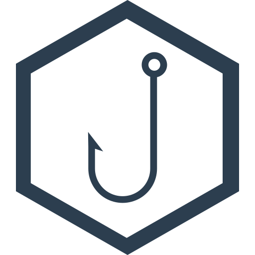 <code>gophish</code></a></td><td align="center"><a href="../logos/gose.svg">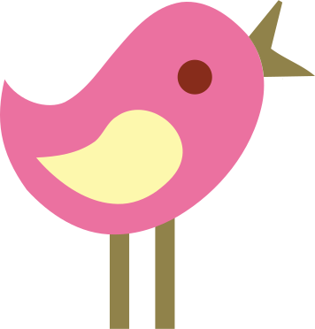 <code>gose</code></a></td><td align="center"><a href="../logos/gossa.svg">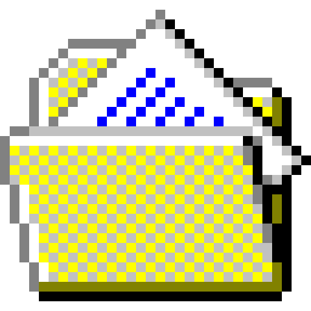 <code>gossa</code></a></td></tr>
<tr><td align="center"><a href="../logos/gosuki.svg">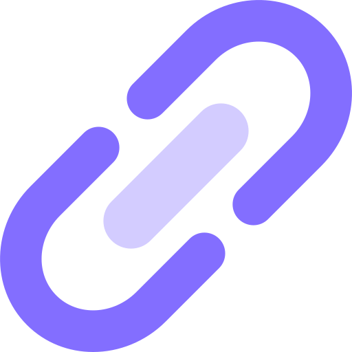 <code>gosuki</code></a></td><td align="center"><a href="../logos/gotify.svg"> <code>gotify</code></a></td><td align="center"><a href="../logos/grafana-alerts-dashboard.svg"> <code>grafana-alerts-dashboard</code></a></td><td align="center"><a href="../logos/grafana-alloy.svg"> <code>grafana-alloy</code></a></td><td align="center"><a href="../logos/grammarly.svg"> <code>grammarly</code></a></td><td align="center"><a href="../logos/grammarly-wordmark.svg"> <code>grammarly-wordmark</code></a></td></tr>
<tr><td align="center"><a href="../logos/gramps.svg">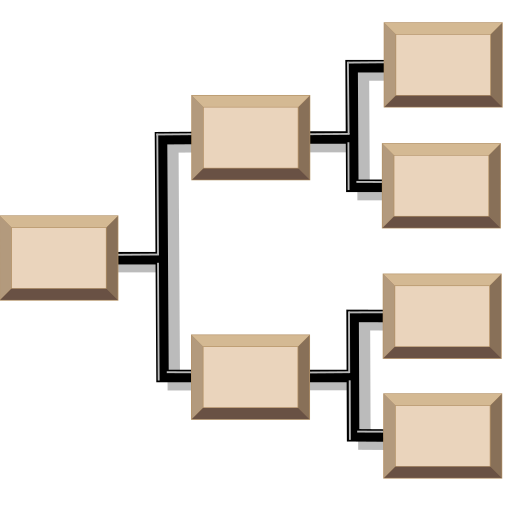 <code>gramps</code></a></td><td align="center"><a href="../logos/gramps-web.svg">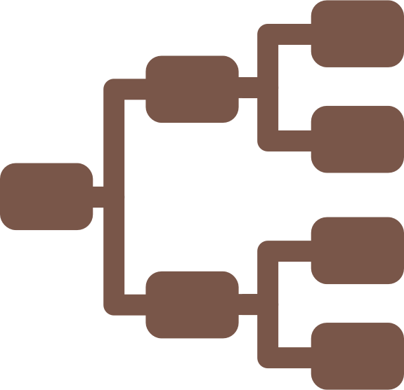 <code>gramps-web</code></a></td><td align="center"><a href="../logos/grandstream.svg"> <code>grandstream</code></a></td><td align="center"><a href="../logos/graphhopper.svg"> <code>graphhopper</code></a></td><td align="center"><a href="../logos/graphite.svg"> <code>graphite</code></a></td><td align="center"><a href="../logos/grass-io.svg"> <code>grass-io</code></a></td></tr>
<tr><td align="center"><a href="../logos/gravit-designer.svg"> <code>gravit-designer</code></a></td><td align="center"><a href="../logos/grayjay.svg">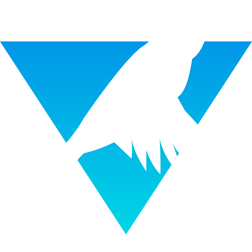 <code>grayjay</code></a></td><td align="center"><a href="../logos/greenbone.svg"> <code>greenbone</code></a></td><td align="center"><a href="../logos/gridscale.svg"> <code>gridscale</code></a></td><td align="center"><a href="../logos/grimmory.svg"> <code>grimmory</code></a></td><td align="center"><a href="../logos/grimoire.svg"> <code>grimoire</code></a></td></tr>
<tr><td align="center"><a href="../logos/grist.svg"> <code>grist</code></a></td><td align="center"><a href="../logos/grocy.svg"> <code>grocy</code></a></td><td align="center"><a href="../logos/groly.svg"> <code>groly</code></a></td><td align="center"><a href="../logos/growchief.svg">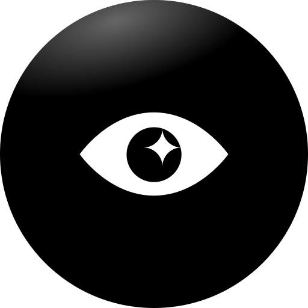 <code>growchief</code></a></td><td align="center"><a href="../logos/gryt.svg">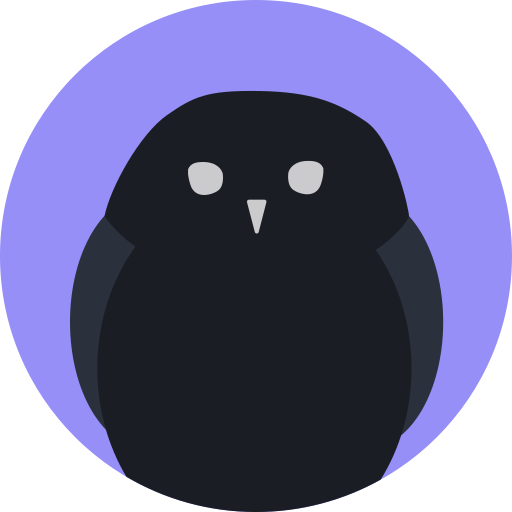 <code>gryt</code></a></td><td align="center"><a href="../logos/gsap.svg"> <code>gsap</code></a></td></tr>
<tr><td align="center"><a href="../logos/guardian-plex.svg"> <code>guardian-plex</code></a></td><td align="center"><a href="../logos/hammond.svg"> <code>hammond</code></a></td><td align="center"><a href="../logos/handbrake.svg"> <code>handbrake</code></a></td><td align="center"><a href="../logos/hanko.svg"> <code>hanko</code></a></td><td align="center"><a href="../logos/haptic.svg"> <code>haptic</code></a></td><td align="center"><a href="../logos/harbor.svg"> <code>harbor</code></a></td></tr>
<tr><td align="center"><a href="../logos/harbor-guard.svg"> <code>harbor-guard</code></a></td><td align="center"><a href="../logos/harbor-scale.svg">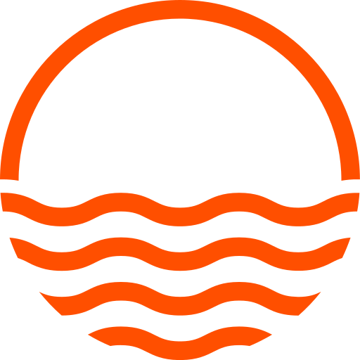 <code>harbor-scale</code></a></td><td align="center"><a href="../logos/hardcover.svg"> <code>hardcover</code></a></td><td align="center"><a href="../logos/harvester.svg"> <code>harvester</code></a></td><td align="center"><a href="../logos/hashicorp-boundary.svg">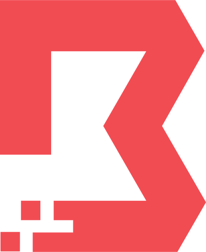 <code>hashicorp-boundary</code></a></td><td align="center"><a href="../logos/hashicorp-consul.svg">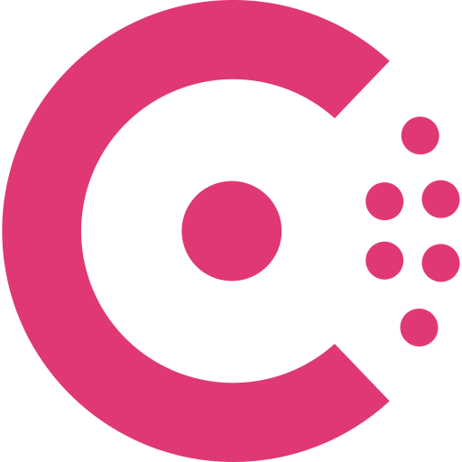 <code>hashicorp-consul</code></a></td></tr>
<tr><td align="center"><a href="../logos/hashicorp-nomad.svg">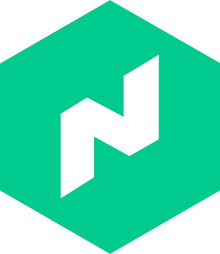 <code>hashicorp-nomad</code></a></td><td align="center"><a href="../logos/hashicorp-packer.svg"> <code>hashicorp-packer</code></a></td><td align="center"><a href="../logos/hashicorp-terraform.svg">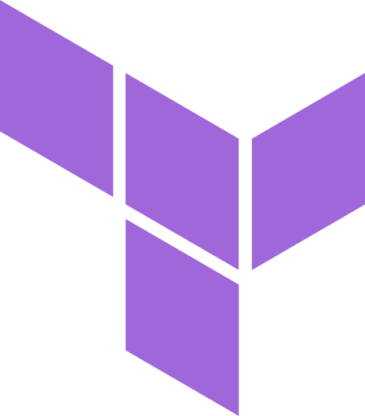 <code>hashicorp-terraform</code></a></td><td align="center"><a href="../logos/hashicorp-vagrant.svg"> <code>hashicorp-vagrant</code></a></td><td align="center"><a href="../logos/hashicorp-vault.svg">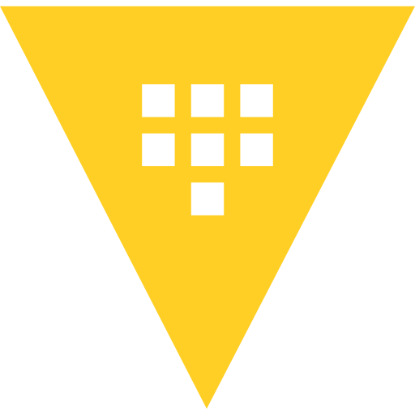 <code>hashicorp-vault</code></a></td><td align="center"><a href="../logos/hashicorp-waypoint.svg"> <code>hashicorp-waypoint</code></a></td></tr>
<tr><td align="center"><a href="../logos/hastypaste.svg"> <code>hastypaste</code></a></td><td align="center"><a href="../logos/hathway.svg"> <code>hathway</code></a></td><td align="center"><a href="../logos/hatsh.svg"> <code>hatsh</code></a></td><td align="center"><a href="../logos/hauk.svg"> <code>hauk</code></a></td><td align="center"><a href="../logos/haus.svg"> <code>haus</code></a></td><td align="center"><a href="../logos/hbo.svg"> <code>hbo</code></a></td></tr>
<tr><td align="center"><a href="../logos/hcl-verse.svg"> <code>hcl-verse</code></a></td><td align="center"><a href="../logos/hdhomerun.svg"> <code>hdhomerun</code></a></td><td align="center"><a href="../logos/headlamp.svg">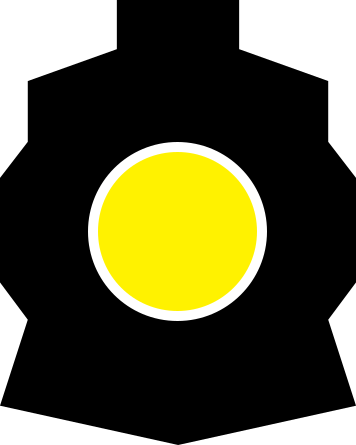 <code>headlamp</code></a></td><td align="center"><a href="../logos/headplane.svg"> <code>headplane</code></a></td><td align="center"><a href="../logos/headscale.svg">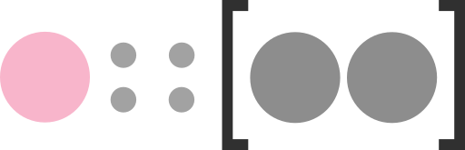 <code>headscale</code></a></td><td align="center"><a href="../logos/healarr.svg"> <code>healarr</code></a></td></tr>
<tr><td align="center"><a href="../logos/healthchecks.svg"> <code>healthchecks</code></a></td><td align="center"><a href="../logos/hedgedoc.svg"> <code>hedgedoc</code></a></td><td align="center"><a href="../logos/heimdall.svg"> <code>heimdall</code></a></td><td align="center"><a href="../logos/helium-mobile.svg"> <code>helium-mobile</code></a></td><td align="center"><a href="../logos/helium-token.svg"> <code>helium-token</code></a></td><td align="center"><a href="../logos/helix.svg"> <code>helix</code></a></td></tr>
<tr><td align="center"><a href="../logos/hemmelig.svg"> <code>hemmelig</code></a></td><td align="center"><a href="../logos/heptabase.svg"> <code>heptabase</code></a></td><td align="center"><a href="../logos/here-now.svg"> <code>here-now</code></a></td><td align="center"><a href="../logos/hermes-icon.svg"> <code>hermes-icon</code></a></td><td align="center"><a href="../logos/hestia.svg"> <code>hestia</code></a></td><td align="center"><a href="../logos/hetrixtools.svg">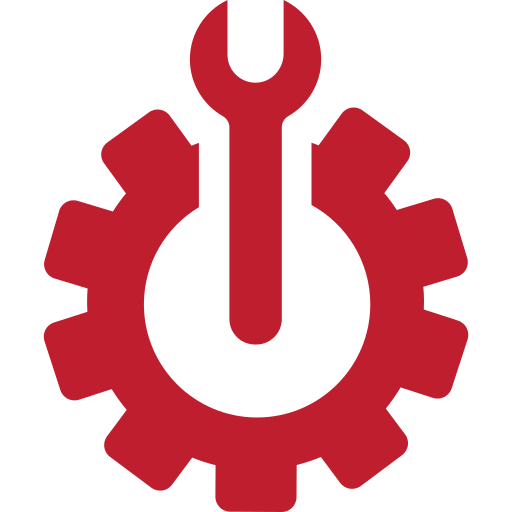 <code>hetrixtools</code></a></td></tr>
<tr><td align="center"><a href="../logos/hetzner.svg"> <code>hetzner</code></a></td><td align="center"><a href="../logos/hetzner-h.svg"> <code>hetzner-h</code></a></td><td align="center"><a href="../logos/hewlett-packard-enterprise.svg">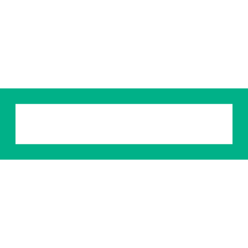 <code>hewlett-packard-enterprise</code></a></td><td align="center"><a href="../logos/hexabot.svg"> <code>hexabot</code></a></td><td align="center"><a href="../logos/hexedit.svg">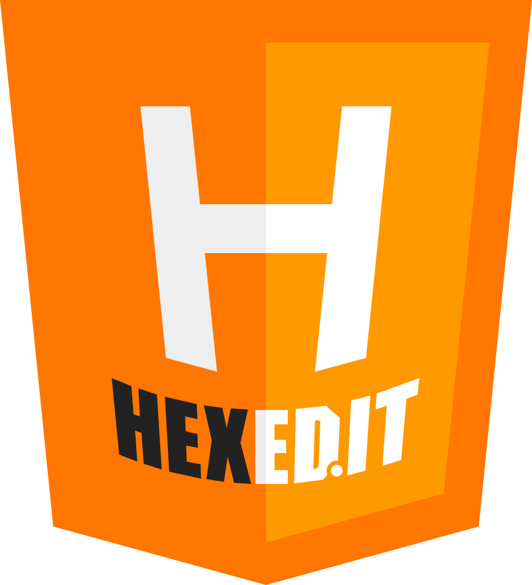 <code>hexedit</code></a></td><td align="center"><a href="../logos/hexos.svg">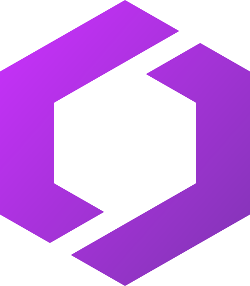 <code>hexos</code></a></td></tr>
<tr><td align="center"><a href="../logos/heyform.svg"> <code>heyform</code></a></td><td align="center"><a href="../logos/heylogin.svg"> <code>heylogin</code></a></td><td align="center"><a href="../logos/hhf-technology.svg">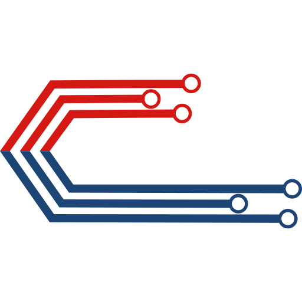 <code>hhf-technology</code></a></td><td align="center"><a href="../logos/hi-anime.svg"> <code>hi-anime</code></a></td><td align="center"><a href="../logos/hi-events.svg"> <code>hi-events</code></a></td><td align="center"><a href="../logos/hifiberry.svg"> <code>hifiberry</code></a></td></tr>
<tr><td align="center"><a href="../logos/hikvision.svg"> <code>hikvision</code></a></td><td align="center"><a href="../logos/hilook.svg"> <code>hilook</code></a></td><td align="center"><a href="../logos/hister.svg"> <code>hister</code></a></td><td align="center"><a href="../logos/hitkeep.svg">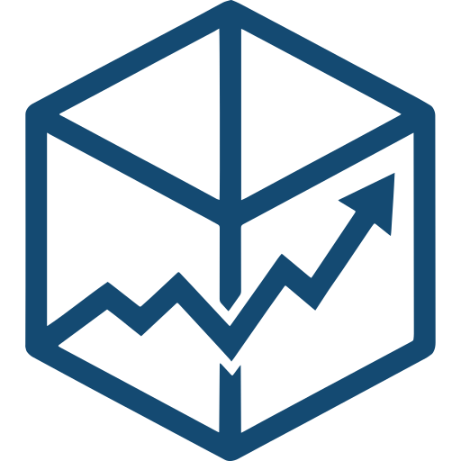 <code>hitkeep</code></a></td><td align="center"><a href="../logos/hivedav.svg">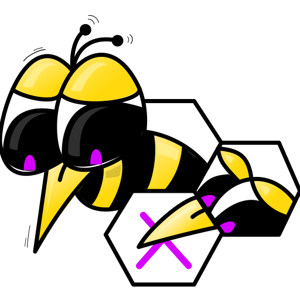 <code>hivedav</code></a></td><td align="center"><a href="../logos/hoarder.svg"> <code>hoarder</code></a></td></tr>
<tr><td align="center"><a href="../logos/hollo.svg"> <code>hollo</code></a></td><td align="center"><a href="../logos/homarr.svg">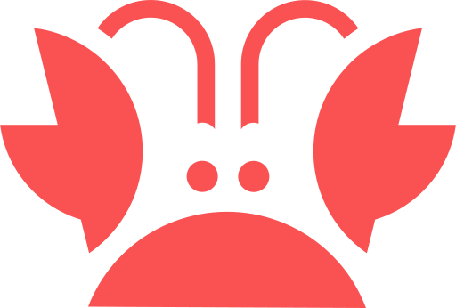 <code>homarr</code></a></td><td align="center"><a href="../logos/home-assistant-alt.svg"> <code>home-assistant-alt</code></a></td><td align="center"><a href="../logos/home-assistant-matter-hub.svg">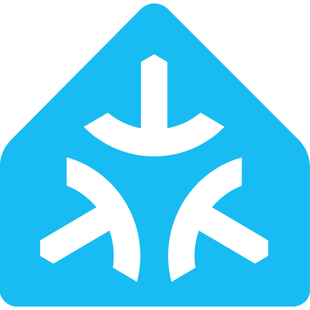 <code>home-assistant-matter-hub</code></a></td><td align="center"><a href="../logos/home-information.svg"> <code>home-information</code></a></td><td align="center"><a href="../logos/homebox.svg">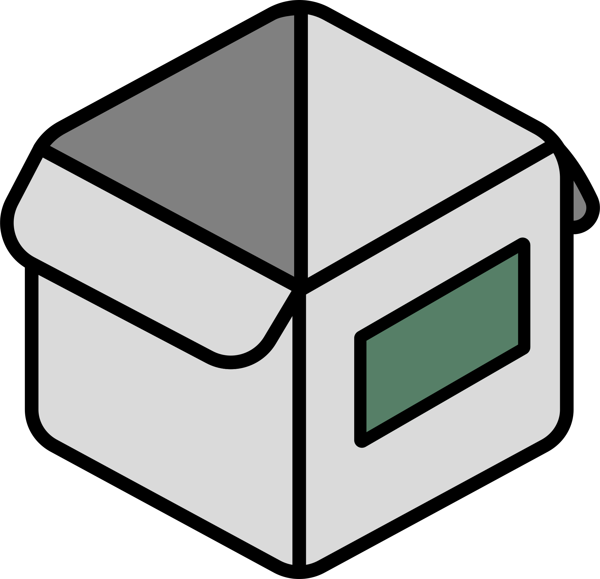 <code>homebox</code></a></td></tr>
<tr><td align="center"><a href="../logos/homebridge.svg"> <code>homebridge</code></a></td><td align="center"><a href="../logos/homedash.svg">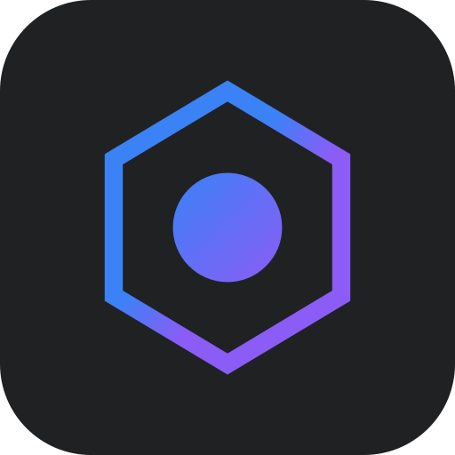 <code>homedash</code></a></td><td align="center"><a href="../logos/homehub.svg"> <code>homehub</code></a></td><td align="center"><a href="../logos/homelabids.svg">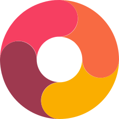 <code>homelabids</code></a></td><td align="center"><a href="../logos/homelable.svg"> <code>homelable</code></a></td><td align="center"><a href="../logos/homematic-ip.svg"> <code>homematic-ip</code></a></td></tr>
<tr><td align="center"><a href="../logos/homer.svg">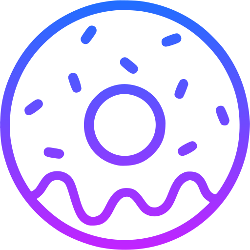 <code>homer</code></a></td><td align="center"><a href="../logos/homescreen-hero.svg"> <code>homescreen-hero</code></a></td><td align="center"><a href="../logos/honda-jet.svg"> <code>honda-jet</code></a></td><td align="center"><a href="../logos/hoobs.svg"> <code>hoobs</code></a></td><td align="center"><a href="../logos/hoodik.svg">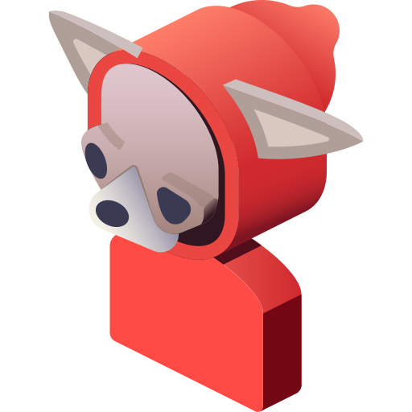 <code>hoodik</code></a></td><td align="center"><a href="../logos/hook0.svg">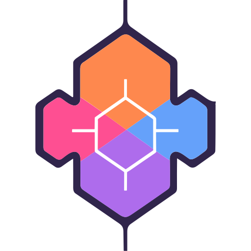 <code>hook0</code></a></td></tr>
<tr><td align="center"><a href="../logos/hortusfox.svg"> <code>hortusfox</code></a></td><td align="center"><a href="../logos/hostinger.svg">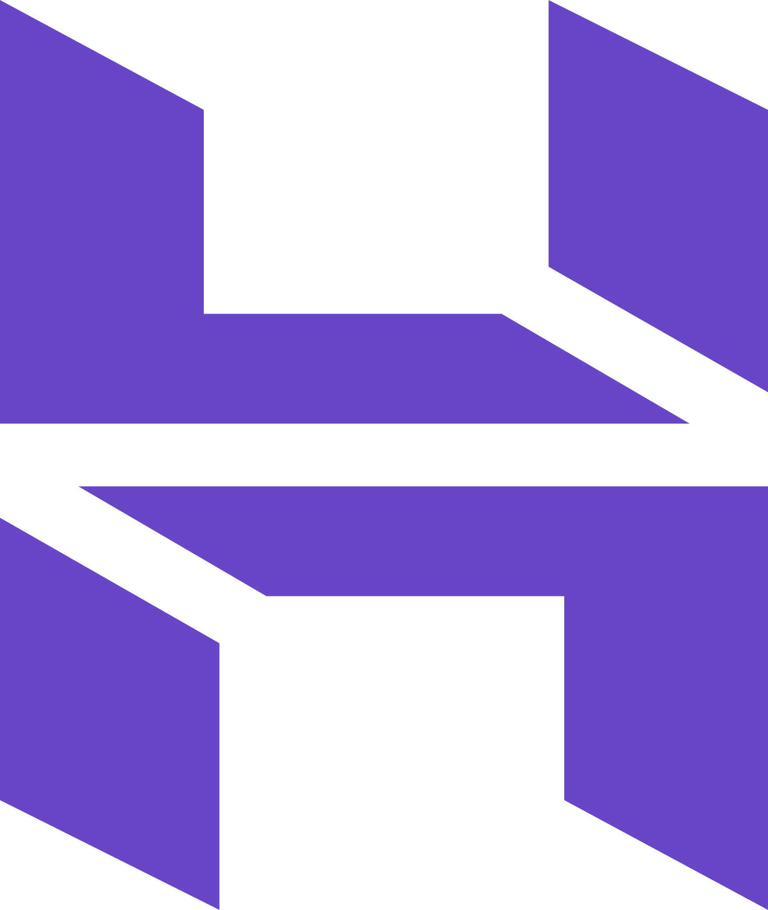 <code>hostinger</code></a></td><td align="center"><a href="../logos/hotio.svg">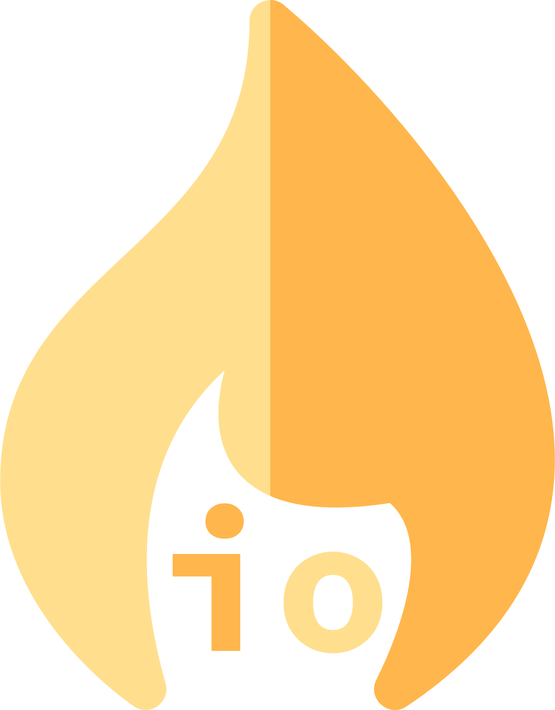 <code>hotio</code></a></td><td align="center"><a href="../logos/hpe.svg"> <code>hpe</code></a></td><td align="center"><a href="../logos/hpe-aruba.svg"> <code>hpe-aruba</code></a></td><td align="center"><a href="../logos/html.svg"> <code>html</code></a></td></tr>
<tr><td align="center"><a href="../logos/hubitat.svg"> <code>hubitat</code></a></td><td align="center"><a href="../logos/hubzilla.svg">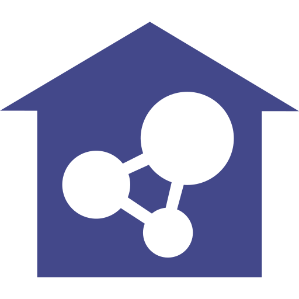 <code>hubzilla</code></a></td><td align="center"><a href="../logos/huginn.svg"> <code>huginn</code></a></td><td align="center"><a href="../logos/humhub.svg">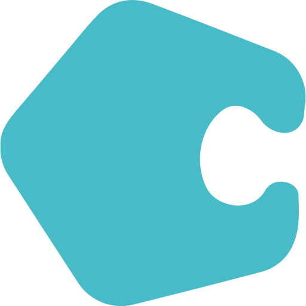 <code>humhub</code></a></td><td align="center"><a href="../logos/hydra.svg"> <code>hydra</code></a></td><td align="center"><a href="../logos/hydrus-web.svg"> <code>hydrus-web</code></a></td></tr>
<tr><td align="center"><a href="../logos/hyperhdr.svg"> <code>hyperhdr</code></a></td><td align="center"><a href="../logos/hypermind.svg">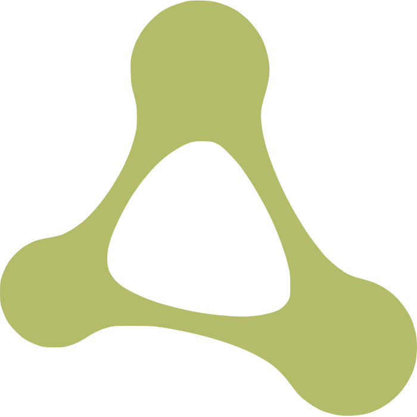 <code>hypermind</code></a></td><td align="center"><a href="../logos/hyperpipe.svg"> <code>hyperpipe</code></a></td><td align="center"><a href="../logos/hyprland.svg">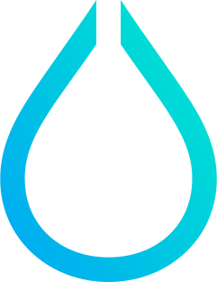 <code>hyprland</code></a></td><td align="center"><a href="../logos/hyvor-relay.svg">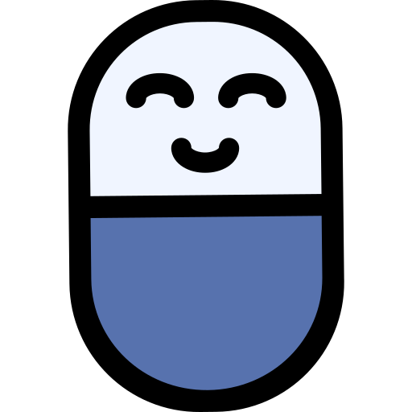 <code>hyvor-relay</code></a></td><td align="center"><a href="../logos/i-librarian.svg"> <code>i-librarian</code></a></td></tr>
<tr><td align="center"><a href="../logos/i2p.svg">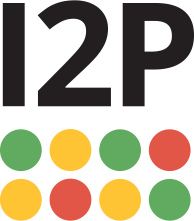 <code>i2p</code></a></td><td align="center"><a href="../logos/i2pd.svg"> <code>i2pd</code></a></td><td align="center"><a href="../logos/iammeter.svg"> <code>iammeter</code></a></td><td align="center"><a href="../logos/ical.svg"> <code>ical</code></a></td><td align="center"><a href="../logos/icecast.svg">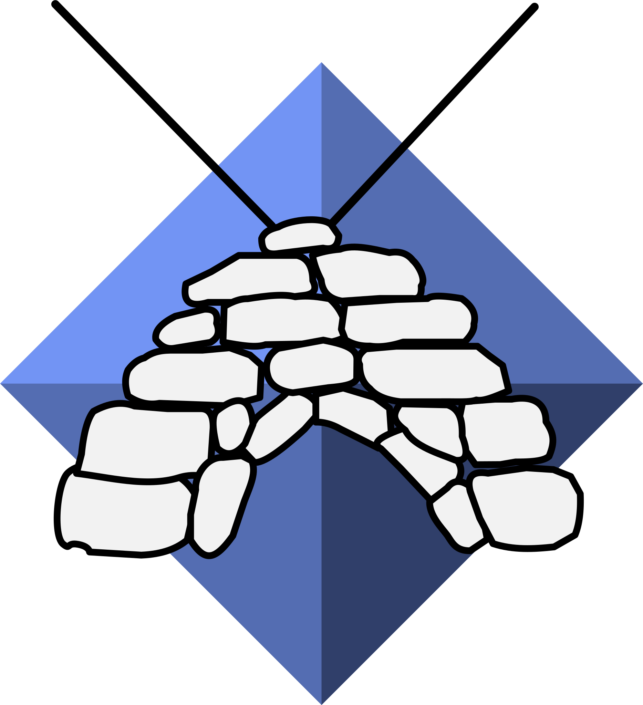 <code>icecast</code></a></td><td align="center"><a href="../logos/icewarp.svg"> <code>icewarp</code></a></td></tr>
<tr><td align="center"><a href="../logos/icewarp-office.svg"> <code>icewarp-office</code></a></td><td align="center"><a href="../logos/icinga-full.svg"> <code>icinga-full</code></a></td><td align="center"><a href="../logos/icloud.svg"> <code>icloud</code></a></td><td align="center"><a href="../logos/icon.svg"> <code>icon</code></a></td><td align="center"><a href="../logos/idealo.svg"> <code>idealo</code></a></td><td align="center"><a href="../logos/ideco.svg">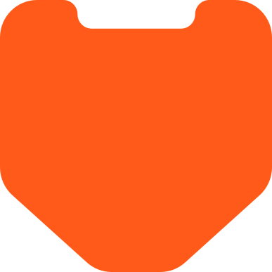 <code>ideco</code></a></td></tr>
<tr><td align="center"><a href="../logos/ideon.svg">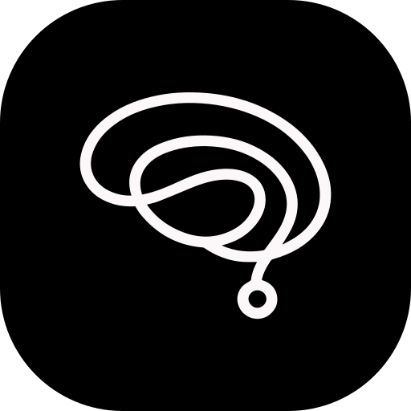 <code>ideon</code></a></td><td align="center"><a href="../logos/idrac.svg"> <code>idrac</code></a></td><td align="center"><a href="../logos/idrive.svg"> <code>idrive</code></a></td><td align="center"><a href="../logos/ifttt.svg"> <code>ifttt</code></a></td><td align="center"><a href="../logos/ifttt-wordmark.svg"> <code>ifttt-wordmark</code></a></td><td align="center"><a href="../logos/ignidash.svg">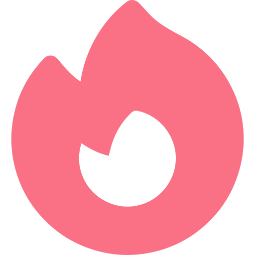 <code>ignidash</code></a></td></tr>
<tr><td align="center"><a href="../logos/ikuai.svg"> <code>ikuai</code></a></td><td align="center"><a href="../logos/iliadbox-svg.svg"> <code>iliadbox-svg</code></a></td><td align="center"><a href="../logos/ilo.svg"> <code>ilo</code></a></td><td align="center"><a href="../logos/immich.svg"> <code>immich</code></a></td><td align="center"><a href="../logos/immich-frame.svg">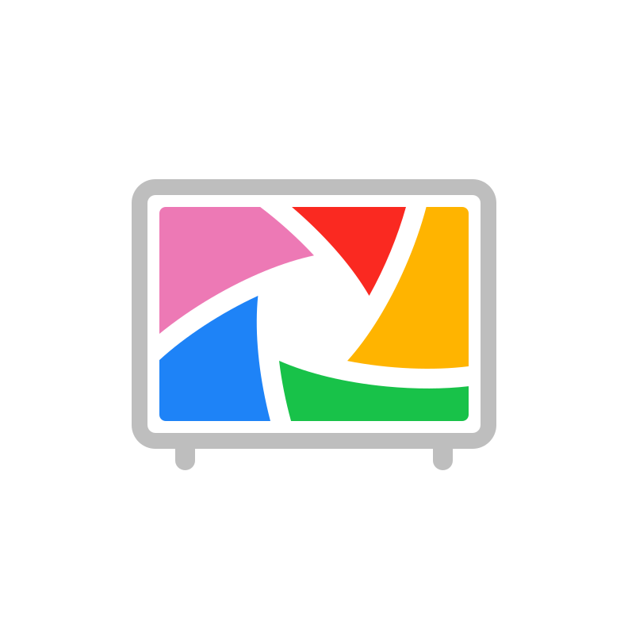 <code>immich-frame</code></a></td><td align="center"><a href="../logos/immich-kiosk.svg">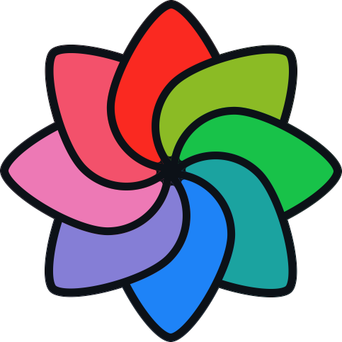 <code>immich-kiosk</code></a></td></tr>
<tr><td align="center"><a href="../logos/immich-power-tools.svg">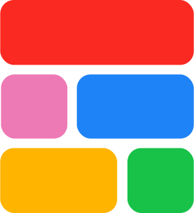 <code>immich-power-tools</code></a></td><td align="center"><a href="../logos/immich-public-proxy.svg">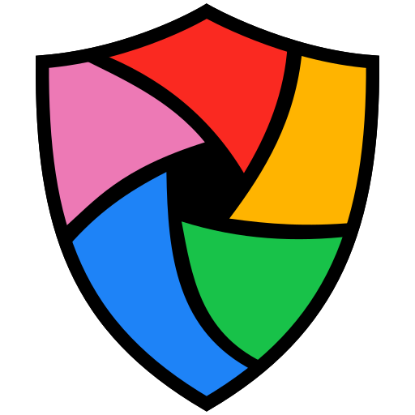 <code>immich-public-proxy</code></a></td><td align="center"><a href="../logos/incus.svg">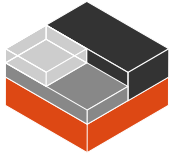 <code>incus</code></a></td><td align="center"><a href="../logos/inexogy.svg"> <code>inexogy</code></a></td><td align="center"><a href="../logos/infinite-craft.svg">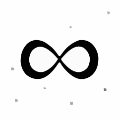 <code>infinite-craft</code></a></td><td align="center"><a href="../logos/infisical.svg"> <code>infisical</code></a></td></tr>
<tr><td align="center"><a href="../logos/infomaniak-k.svg"> <code>infomaniak-k</code></a></td><td align="center"><a href="../logos/infomaniak-kdrive.svg"> <code>infomaniak-kdrive</code></a></td><td align="center"><a href="../logos/infomaniak-kmeet.svg"> <code>infomaniak-kmeet</code></a></td><td align="center"><a href="../logos/infomaniak-swisstransfer.svg"> <code>infomaniak-swisstransfer</code></a></td><td align="center"><a href="../logos/initiative-project-management.svg"> <code>initiative-project-management</code></a></td><td align="center"><a href="../logos/inngest.svg"> <code>inngest</code></a></td></tr>
<tr><td align="center"><a href="../logos/inoreader.svg">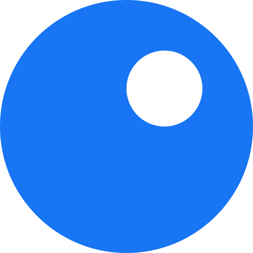 <code>inoreader</code></a></td><td align="center"><a href="../logos/inspircd.svg">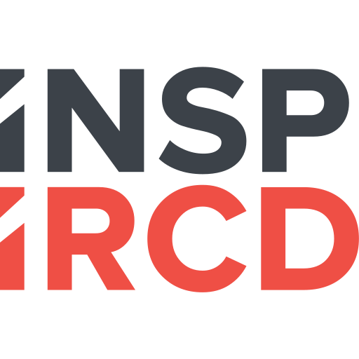 <code>inspircd</code></a></td><td align="center"><a href="../logos/instagram-reels.svg"> <code>instagram-reels</code></a></td><td align="center"><a href="../logos/installatron.svg">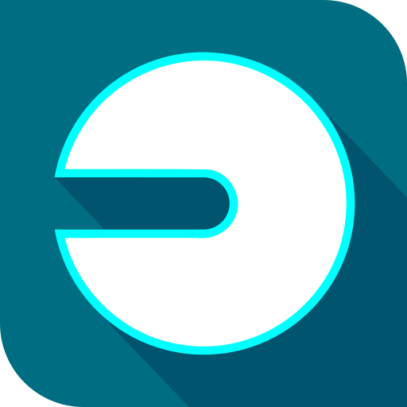 <code>installatron</code></a></td><td align="center"><a href="../logos/instapods.svg"> <code>instapods</code></a></td><td align="center"><a href="../logos/instatus.svg"> <code>instatus</code></a></td></tr>
<tr><td align="center"><a href="../logos/instradaogm.svg">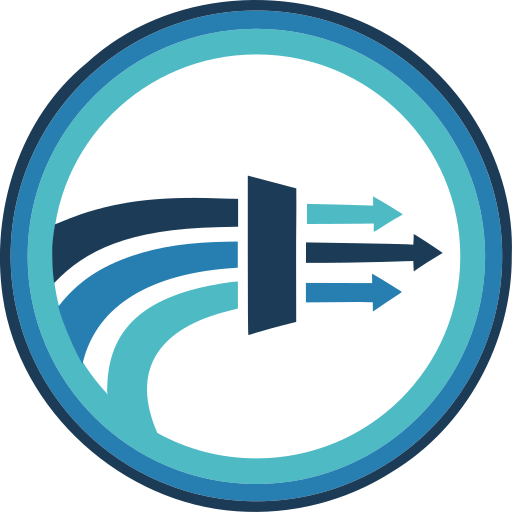 <code>instradaogm</code></a></td><td align="center"><a href="../logos/instructure-canvas.svg">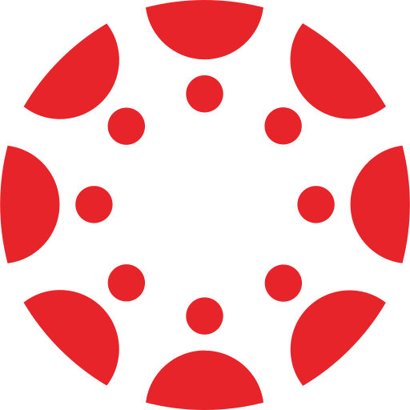 <code>instructure-canvas</code></a></td><td align="center"><a href="../logos/intellij.svg"> <code>intellij</code></a></td><td align="center"><a href="../logos/intelowl.svg">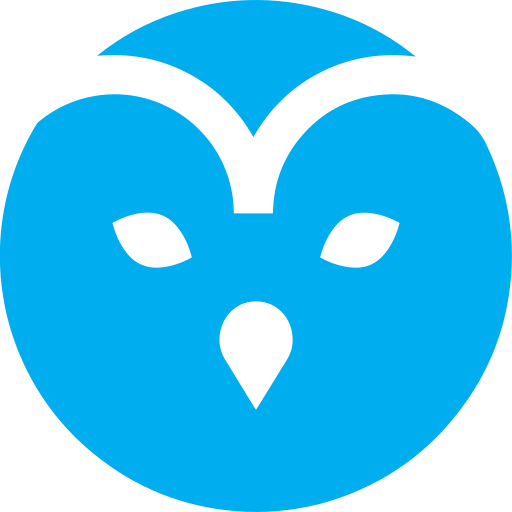 <code>intelowl</code></a></td><td align="center"><a href="../logos/interactive-brokers.svg"> <code>interactive-brokers</code></a></td><td align="center"><a href="../logos/interfere.svg"> <code>interfere</code></a></td></tr>
<tr><td align="center"><a href="../logos/interfere-wordmark.svg"> <code>interfere-wordmark</code></a></td><td align="center"><a href="../logos/interlock.svg"> <code>interlock</code></a></td><td align="center"><a href="../logos/intervals-icu.svg"> <code>intervals-icu</code></a></td><td align="center"><a href="../logos/inventree.svg">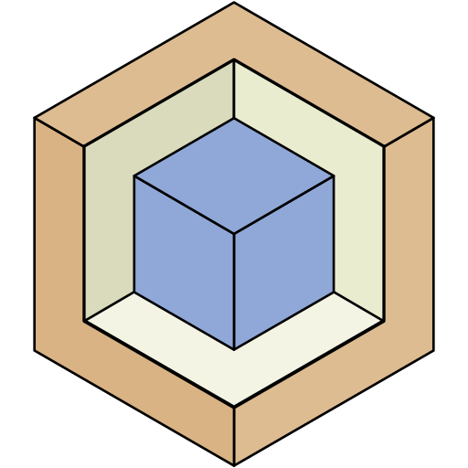 <code>inventree</code></a></td><td align="center"><a href="../logos/investbrain.svg"> <code>investbrain</code></a></td><td align="center"><a href="../logos/invidious.svg">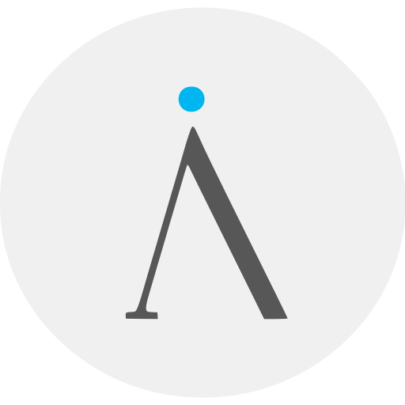 <code>invidious</code></a></td></tr>
<tr><td align="center"><a href="../logos/invio.svg"> <code>invio</code></a></td><td align="center"><a href="../logos/invisioncommunity.svg"> <code>invisioncommunity</code></a></td><td align="center"><a href="../logos/invoice-ninja.svg"> <code>invoice-ninja</code></a></td><td align="center"><a href="../logos/invoiceplane.svg"> <code>invoiceplane</code></a></td><td align="center"><a href="../logos/invoicerr.svg"> <code>invoicerr</code></a></td><td align="center"><a href="../logos/invoiceshelf.svg"> <code>invoiceshelf</code></a></td></tr>
<tr><td align="center"><a href="../logos/iobroker.svg"> <code>iobroker</code></a></td><td align="center"><a href="../logos/ionos.svg"> <code>ionos</code></a></td><td align="center"><a href="../logos/ipboard.svg"> <code>ipboard</code></a></td><td align="center"><a href="../logos/ipfs.svg">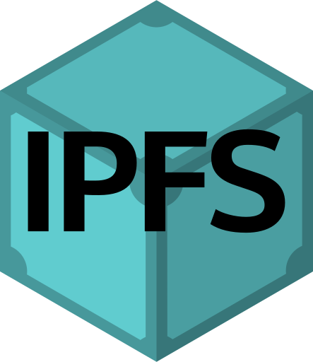 <code>ipfs</code></a></td><td align="center"><a href="../logos/iplayarr.svg">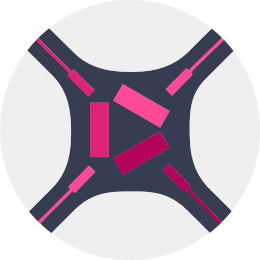 <code>iplayarr</code></a></td><td align="center"><a href="../logos/ipvanish.svg"> <code>ipvanish</code></a></td></tr>
<tr><td align="center"><a href="../logos/ironcalc.svg"> <code>ironcalc</code></a></td><td align="center"><a href="../logos/ironmount.svg">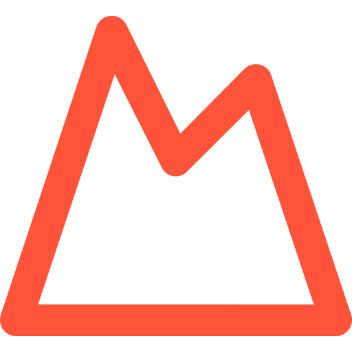 <code>ironmount</code></a></td><td align="center"><a href="../logos/irs.svg"> <code>irs</code></a></td><td align="center"><a href="../logos/ispconfig.svg"> <code>ispconfig</code></a></td><td align="center"><a href="../logos/issabel-pbx.svg"> <code>issabel-pbx</code></a></td><td align="center"><a href="../logos/issabel-pbx-wordmark.svg"> <code>issabel-pbx-wordmark</code></a></td></tr>
<tr><td align="center"><a href="../logos/istio.svg"> <code>istio</code></a></td><td align="center"><a href="../logos/it-glue.svg"> <code>it-glue</code></a></td><td align="center"><a href="../logos/it-tools.svg"> <code>it-tools</code></a></td><td align="center"><a href="../logos/italki.svg"> <code>italki</code></a></td><td align="center"><a href="../logos/itop.svg"> <code>itop</code></a></td><td align="center"><a href="../logos/itsm-ng.svg"> <code>itsm-ng</code></a></td></tr>
<tr><td align="center"><a href="../logos/ivanti.svg"> <code>ivanti</code></a></td><td align="center"><a href="../logos/iventoy.svg"> <code>iventoy</code></a></td><td align="center"><a href="../logos/jackett.svg"> <code>jackett</code></a></td><td align="center"><a href="../logos/jaeger.svg">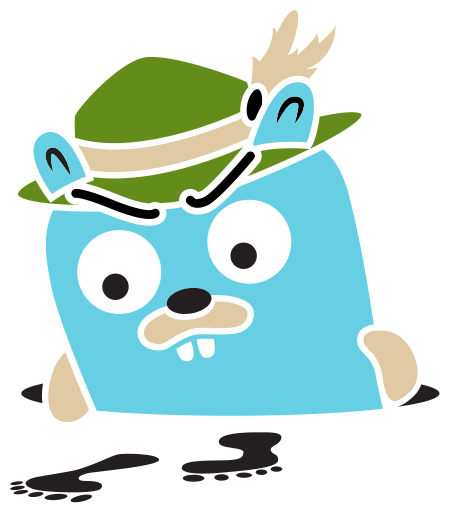 <code>jaeger</code></a></td><td align="center"><a href="../logos/jeedom.svg"> <code>jeedom</code></a></td><td align="center"><a href="../logos/jellify.svg">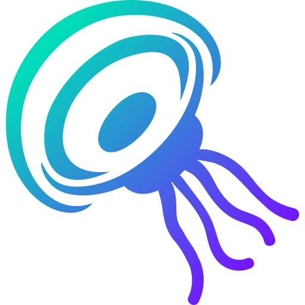 <code>jellify</code></a></td></tr>
<tr><td align="center"><a href="../logos/jellyfin-vue.svg"> <code>jellyfin-vue</code></a></td><td align="center"><a href="../logos/jellyseerr.svg"> <code>jellyseerr</code></a></td><td align="center"><a href="../logos/jellyswarrm.svg">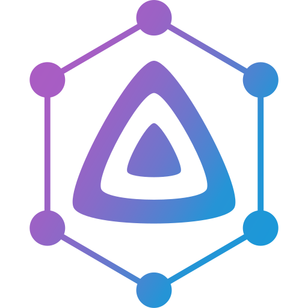 <code>jellyswarrm</code></a></td><td align="center"><a href="../logos/jellywatch.svg">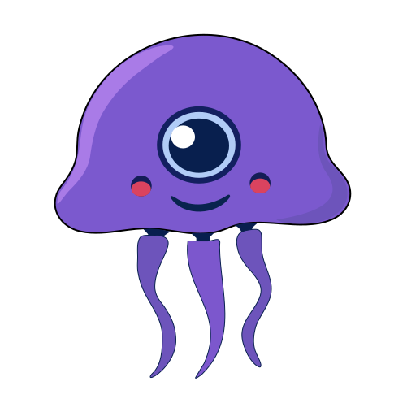 <code>jellywatch</code></a></td><td align="center"><a href="../logos/jelu.svg"> <code>jelu</code></a></td><td align="center"><a href="../logos/jetblue-airways.svg"> <code>jetblue-airways</code></a></td></tr>
<tr><td align="center"><a href="../logos/jetbrains-toolbox.svg"> <code>jetbrains-toolbox</code></a></td><td align="center"><a href="../logos/jetbrains-youtrack.svg"> <code>jetbrains-youtrack</code></a></td><td align="center"><a href="../logos/jetkvm.svg"> <code>jetkvm</code></a></td><td align="center"><a href="../logos/jetkvm-full.svg"> <code>jetkvm-full</code></a></td><td align="center"><a href="../logos/jfa-go.svg">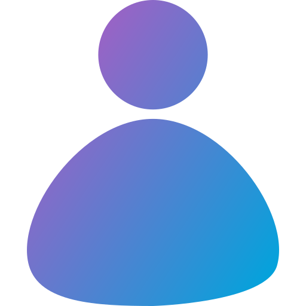 <code>jfa-go</code></a></td><td align="center"><a href="../logos/jinear.svg"> <code>jinear</code></a></td></tr>
<tr><td align="center"><a href="../logos/jio.svg"> <code>jio</code></a></td><td align="center"><a href="../logos/jira.svg"> <code>jira</code></a></td><td align="center"><a href="../logos/jitsi.svg"> <code>jitsi</code></a></td><td align="center"><a href="../logos/jitsi-meet.svg"> <code>jitsi-meet</code></a></td><td align="center"><a href="../logos/joplin.svg"> <code>joplin</code></a></td><td align="center"><a href="../logos/jotty.svg"> <code>jotty</code></a></td></tr>
<tr><td align="center"><a href="../logos/journiv.svg"> <code>journiv</code></a></td><td align="center"><a href="../logos/jsreport.svg"> <code>jsreport</code></a></td><td align="center"><a href="../logos/jstor.svg">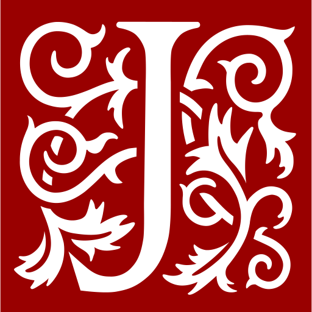 <code>jstor</code></a></td><td align="center"><a href="../logos/jujutsu-vcs.svg">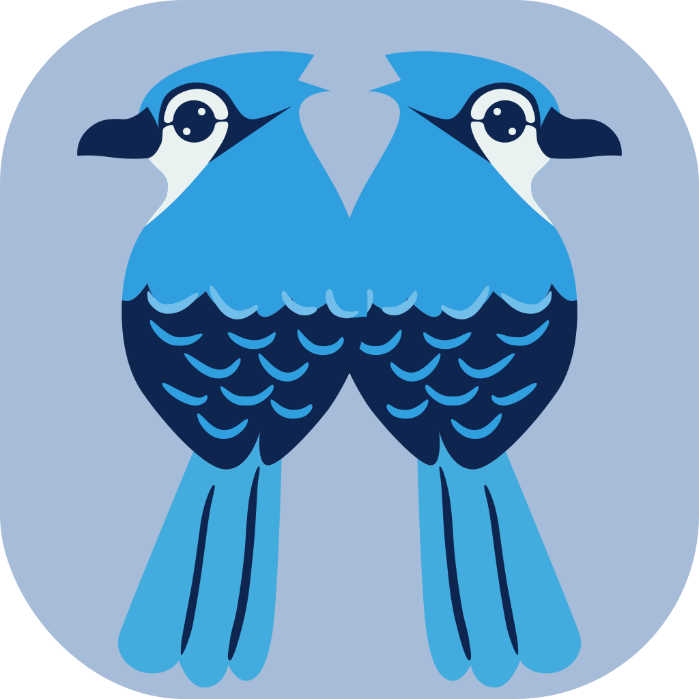 <code>jujutsu-vcs</code></a></td><td align="center"><a href="../logos/jula.svg"> <code>jula</code></a></td><td align="center"><a href="../logos/jump.svg">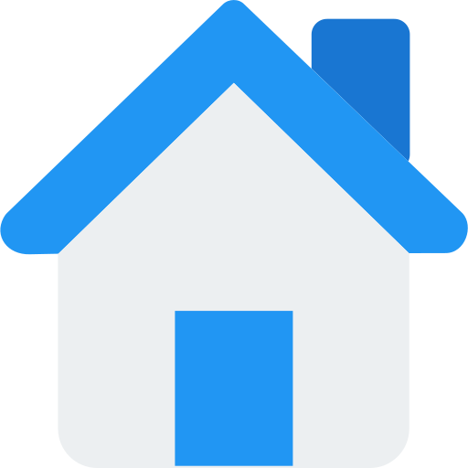 <code>jump</code></a></td></tr>
<tr><td align="center"><a href="../logos/jumpserver.svg"> <code>jumpserver</code></a></td><td align="center"><a href="../logos/k3s.svg"> <code>k3s</code></a></td><td align="center"><a href="../logos/kaboai.svg">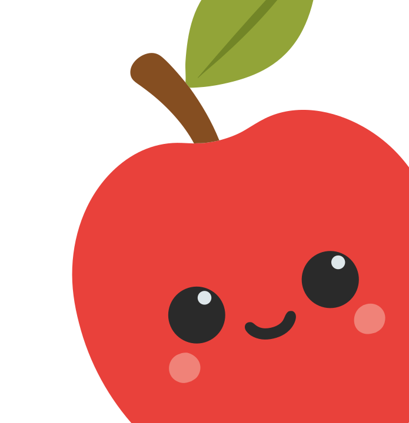 <code>kaboai</code></a></td><td align="center"><a href="../logos/kamatera.svg"> <code>kamatera</code></a></td><td align="center"><a href="../logos/kamiyomu.svg"> <code>kamiyomu</code></a></td><td align="center"><a href="../logos/kan.svg"> <code>kan</code></a></td></tr>
<tr><td align="center"><a href="../logos/kanba.svg">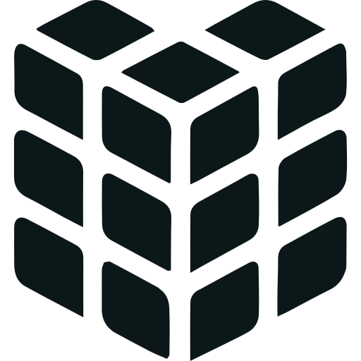 <code>kanba</code></a></td><td align="center"><a href="../logos/kanboard.svg">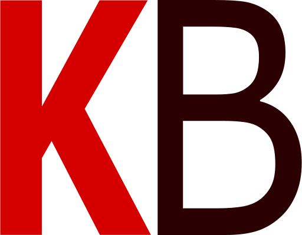 <code>kanboard</code></a></td><td align="center"><a href="../logos/kaneo.svg"> <code>kaneo</code></a></td><td align="center"><a href="../logos/kanidm.svg"> <code>kanidm</code></a></td><td align="center"><a href="../logos/kapowarr.svg"> <code>kapowarr</code></a></td><td align="center"><a href="../logos/karakeep.svg"> <code>karakeep</code></a></td></tr>
<tr><td align="center"><a href="../logos/karrot.svg">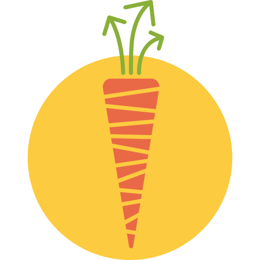 <code>karrot</code></a></td><td align="center"><a href="../logos/kasm.svg"> <code>kasm</code></a></td><td align="center"><a href="../logos/kasten-k10.svg"> <code>kasten-k10</code></a></td><td align="center"><a href="../logos/kaufland.svg">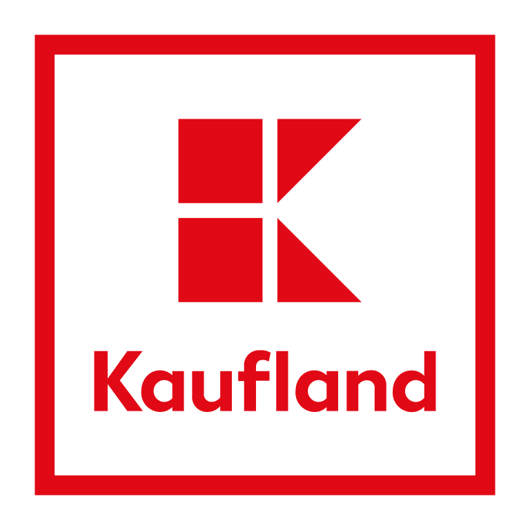 <code>kaufland</code></a></td><td align="center"><a href="../logos/kaunta.svg">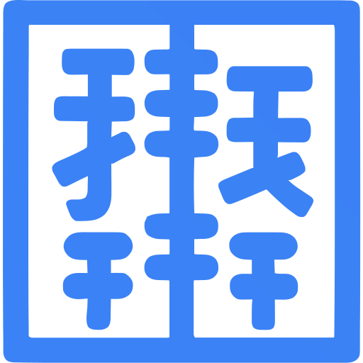 <code>kaunta</code></a></td><td align="center"><a href="../logos/kavita.svg"> <code>kavita</code></a></td></tr>
<tr><td align="center"><a href="../logos/kbin.svg"> <code>kbin</code></a></td><td align="center"><a href="../logos/keda.svg">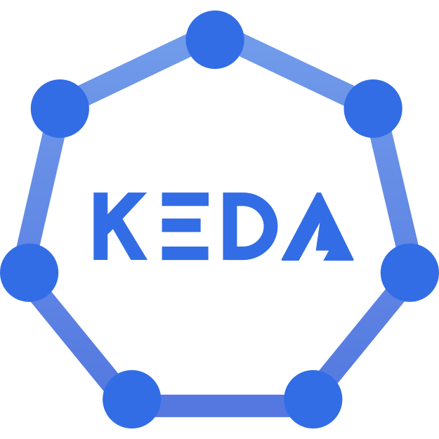 <code>keda</code></a></td><td align="center"><a href="../logos/keenetic.svg"> <code>keenetic</code></a></td><td align="center"><a href="../logos/keenetic-alt.svg">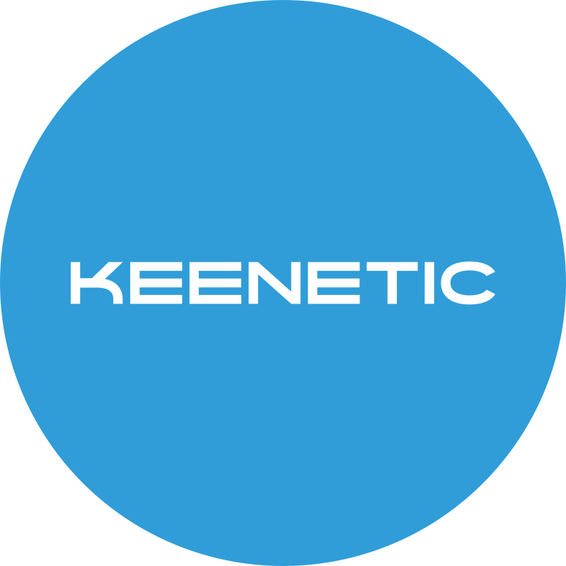 <code>keenetic-alt</code></a></td><td align="center"><a href="../logos/keepass.svg"> <code>keepass</code></a></td><td align="center"><a href="../logos/keila.svg"> <code>keila</code></a></td></tr>
<tr><td align="center"><a href="../logos/kener.svg"> <code>kener</code></a></td><td align="center"><a href="../logos/kerberos.svg"> <code>kerberos</code></a></td><td align="center"><a href="../logos/kestra.svg">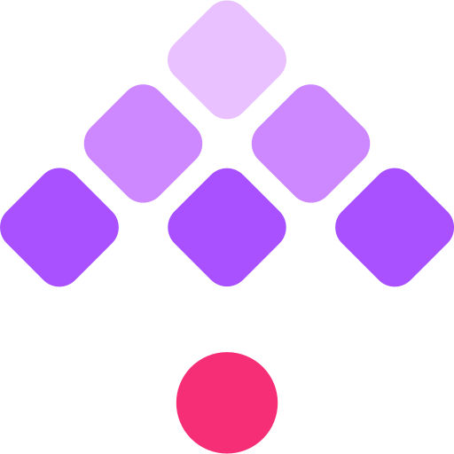 <code>kestra</code></a></td><td align="center"><a href="../logos/keyhelp.svg"> <code>keyhelp</code></a></td><td align="center"><a href="../logos/keyoxide.svg">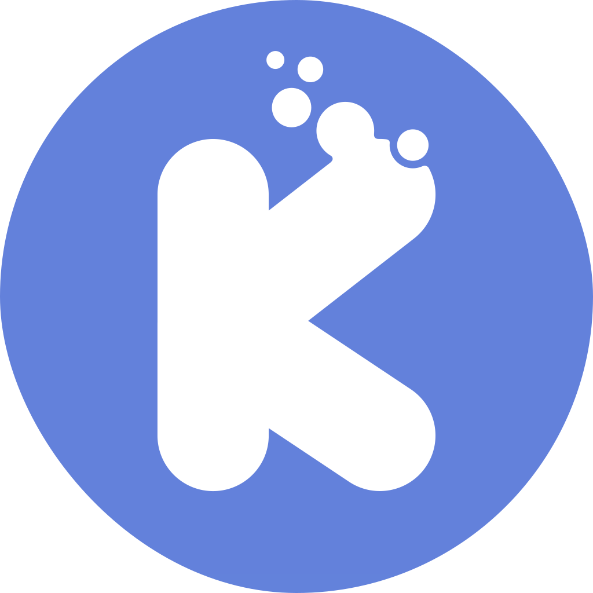 <code>keyoxide</code></a></td><td align="center"><a href="../logos/keyoxide-alt.svg">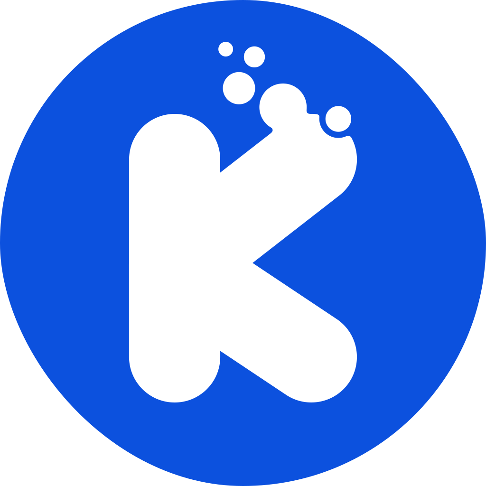 <code>keyoxide-alt</code></a></td></tr>
<tr><td align="center"><a href="../logos/khoj.svg">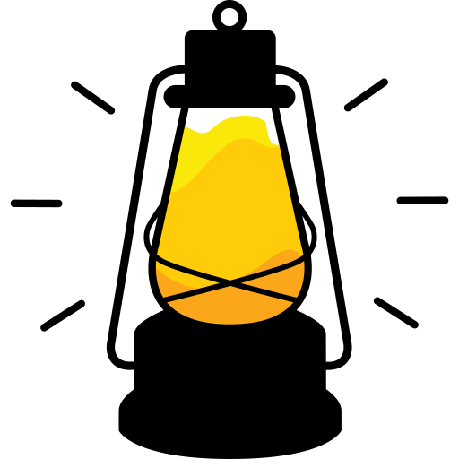 <code>khoj</code></a></td><td align="center"><a href="../logos/kimai.svg"> <code>kimai</code></a></td><td align="center"><a href="../logos/kinopub.svg"> <code>kinopub</code></a></td><td align="center"><a href="../logos/kiroshi.svg">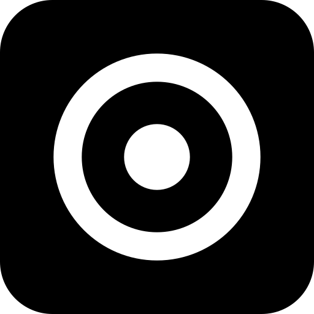 <code>kiroshi</code></a></td><td align="center"><a href="../logos/kitana.svg"> <code>kitana</code></a></td><td align="center"><a href="../logos/kitchenowl.svg"> <code>kitchenowl</code></a></td></tr>
<tr><td align="center"><a href="../logos/kiwix.svg"> <code>kiwix</code></a></td><td align="center"><a href="../logos/kjell-company.svg"> <code>kjell-company</code></a></td><td align="center"><a href="../logos/kleinanzeigen.svg"> <code>kleinanzeigen</code></a></td><td align="center"><a href="../logos/kleopatra.svg"> <code>kleopatra</code></a></td><td align="center"><a href="../logos/klipper.svg">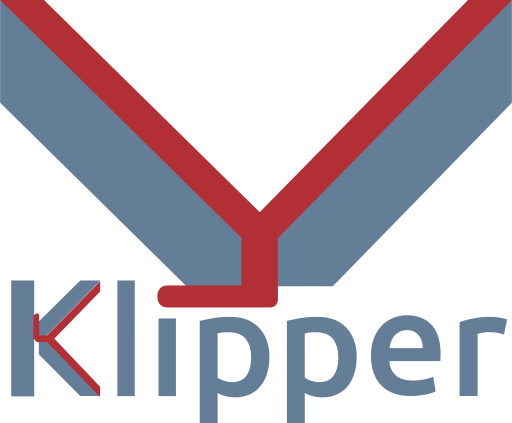 <code>klipper</code></a></td><td align="center"><a href="../logos/knx.svg"> <code>knx</code></a></td></tr>
<tr><td align="center"><a href="../logos/ko-insight.svg"> <code>ko-insight</code></a></td><td align="center"><a href="../logos/koel.svg">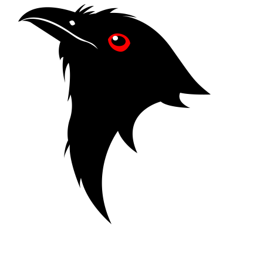 <code>koel</code></a></td><td align="center"><a href="../logos/koillection.svg">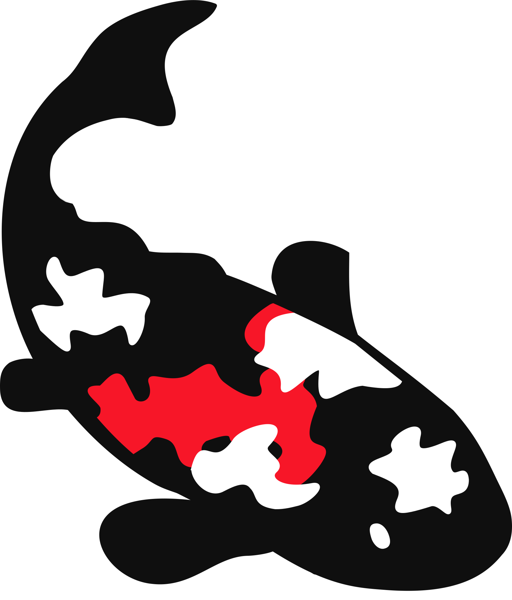 <code>koillection</code></a></td><td align="center"><a href="../logos/komelia.svg">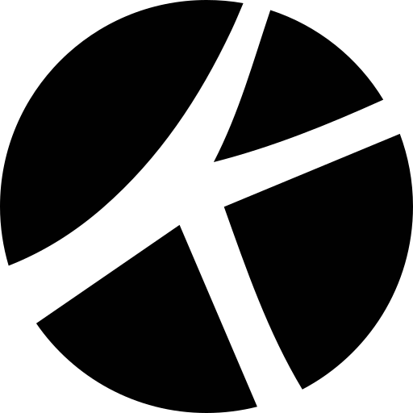 <code>komelia</code></a></td><td align="center"><a href="../logos/kometa.svg"> <code>kometa</code></a></td><td align="center"><a href="../logos/komga.svg"> <code>komga</code></a></td></tr>
<tr><td align="center"><a href="../logos/komodo-cd.svg"> <code>komodo-cd</code></a></td><td align="center"><a href="../logos/komoot.svg"> <code>komoot</code></a></td><td align="center"><a href="../logos/komplett.svg"> <code>komplett</code></a></td><td align="center"><a href="../logos/konica-minolta.svg"> <code>konica-minolta</code></a></td><td align="center"><a href="../logos/kontoj.svg"> <code>kontoj</code></a></td><td align="center"><a href="../logos/kook.svg"> <code>kook</code></a></td></tr>
<tr><td align="center"><a href="../logos/kopia.svg"> <code>kopia</code></a></td><td align="center"><a href="../logos/koreader.svg">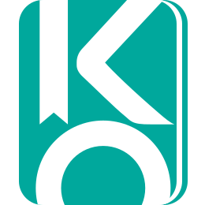 <code>koreader</code></a></td><td align="center"><a href="../logos/koshelf.svg"> <code>koshelf</code></a></td><td align="center"><a href="../logos/kostos.svg"> <code>kostos</code></a></td><td align="center"><a href="../logos/kpn.svg"> <code>kpn</code></a></td><td align="center"><a href="../logos/krakend.svg">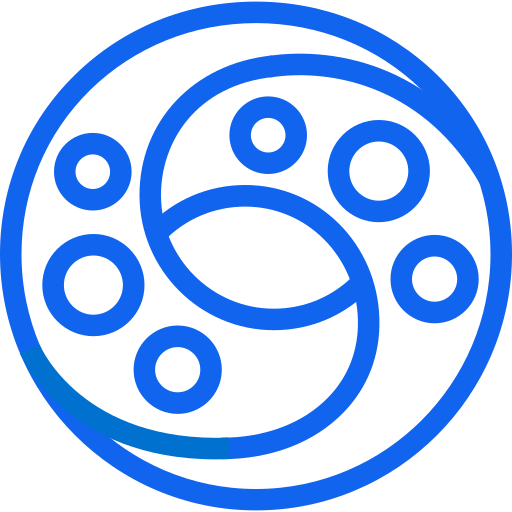 <code>krakend</code></a></td></tr>
<tr><td align="center"><a href="../logos/krokiet.svg">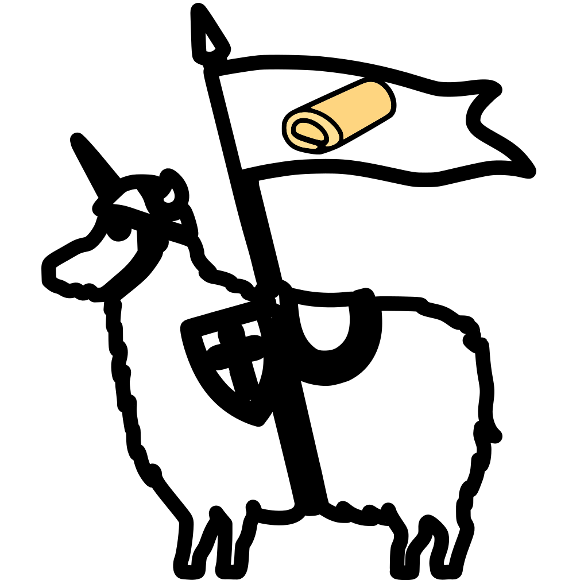 <code>krokiet</code></a></td><td align="center"><a href="../logos/krusader.svg"> <code>krusader</code></a></td><td align="center"><a href="../logos/ksuite.svg"> <code>ksuite</code></a></td><td align="center"><a href="../logos/ksuite-calendar.svg"> <code>ksuite-calendar</code></a></td><td align="center"><a href="../logos/ksuite-chk.svg"> <code>ksuite-chk</code></a></td><td align="center"><a href="../logos/ksuite-contacts.svg"> <code>ksuite-contacts</code></a></td></tr>
<tr><td align="center"><a href="../logos/ksuite-docs.svg"> <code>ksuite-docs</code></a></td><td align="center"><a href="../logos/ksuite-grids.svg"> <code>ksuite-grids</code></a></td><td align="center"><a href="../logos/ksuite-kchat.svg"> <code>ksuite-kchat</code></a></td><td align="center"><a href="../logos/ksuite-kdrive.svg"> <code>ksuite-kdrive</code></a></td><td align="center"><a href="../logos/ksuite-kmeet.svg"> <code>ksuite-kmeet</code></a></td><td align="center"><a href="../logos/ksuite-kpaste.svg"> <code>ksuite-kpaste</code></a></td></tr>
<tr><td align="center"><a href="../logos/ksuite-manager.svg"> <code>ksuite-manager</code></a></td><td align="center"><a href="../logos/ksuite-points.svg"> <code>ksuite-points</code></a></td><td align="center"><a href="../logos/ksuite-swisstransfer.svg"> <code>ksuite-swisstransfer</code></a></td><td align="center"><a href="../logos/kubecraft.svg"> <code>kubecraft</code></a></td><td align="center"><a href="../logos/kubetail.svg"> <code>kubetail</code></a></td><td align="center"><a href="../logos/kumiho.svg">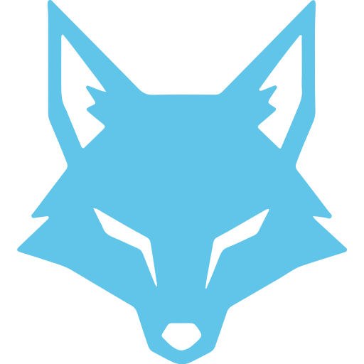 <code>kumiho</code></a></td></tr>
<tr><td align="center"><a href="../logos/kyoo.svg">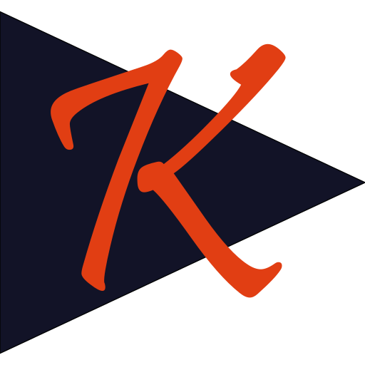 <code>kyoo</code></a></td><td align="center"><a href="../logos/lab-dash.svg"> <code>lab-dash</code></a></td><td align="center"><a href="../logos/lact.svg">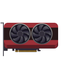 <code>lact</code></a></td><td align="center"><a href="../logos/ladder.svg">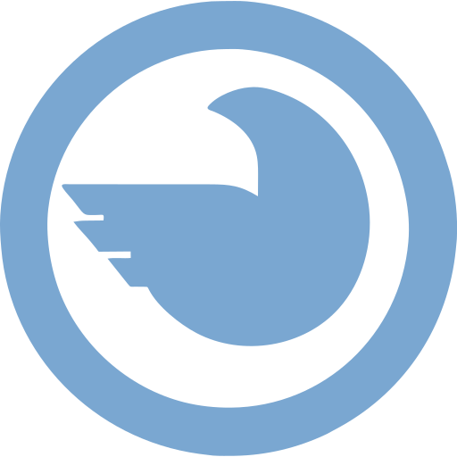 <code>ladder</code></a></td><td align="center"><a href="../logos/lakefs.svg"> <code>lakefs</code></a></td><td align="center"><a href="../logos/lancache.svg">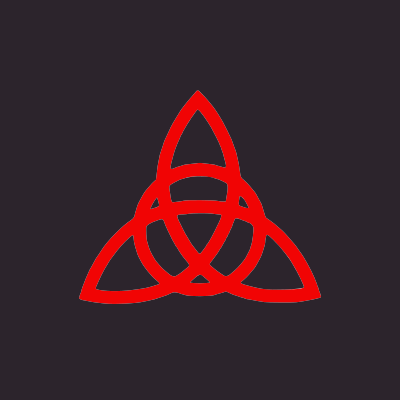 <code>lancache</code></a></td></tr>
<tr><td align="center"><a href="../logos/lancache-net.svg">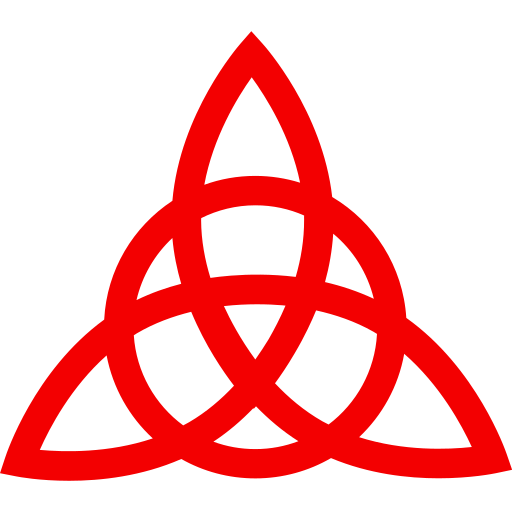 <code>lancache-net</code></a></td><td align="center"><a href="../logos/lancom.svg"> <code>lancom</code></a></td><td align="center"><a href="../logos/lancom-wordmark.svg"> <code>lancom-wordmark</code></a></td><td align="center"><a href="../logos/lancommander.svg"> <code>lancommander</code></a></td><td align="center"><a href="../logos/langfuse.svg"> <code>langfuse</code></a></td><td align="center"><a href="../logos/languagetool.svg"> <code>languagetool</code></a></td></tr>
<tr><td align="center"><a href="../logos/laracasts.svg"> <code>laracasts</code></a></td><td align="center"><a href="../logos/lark.svg"> <code>lark</code></a></td><td align="center"><a href="../logos/lastsignal.svg">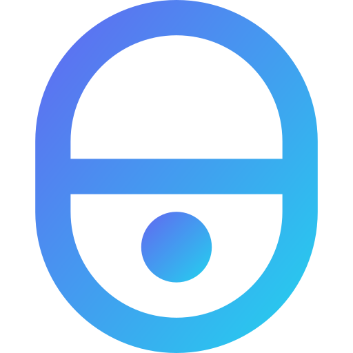 <code>lastsignal</code></a></td><td align="center"><a href="../logos/latitudesh.svg"> <code>latitudesh</code></a></td><td align="center"><a href="../logos/laudspeaker.svg">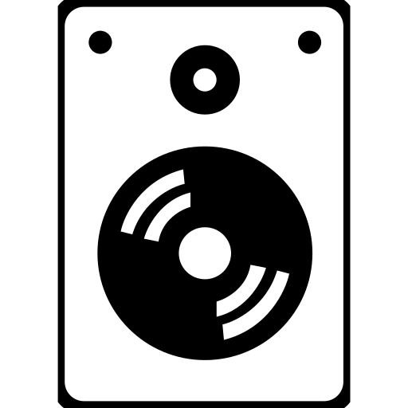 <code>laudspeaker</code></a></td><td align="center"><a href="../logos/ldap.svg"> <code>ldap</code></a></td></tr>
<tr><td align="center"><a href="../logos/leafwiki.svg"> <code>leafwiki</code></a></td><td align="center"><a href="../logos/leankit.svg"> <code>leankit</code></a></td><td align="center"><a href="../logos/leankit-wordmark.svg"> <code>leankit-wordmark</code></a></td><td align="center"><a href="../logos/leanote.svg">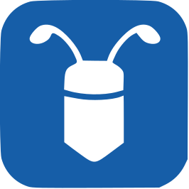 <code>leanote</code></a></td><td align="center"><a href="../logos/leantime.svg">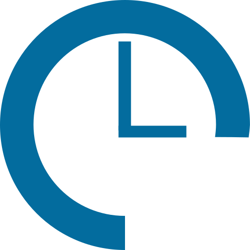 <code>leantime</code></a></td><td align="center"><a href="../logos/lemmy.svg">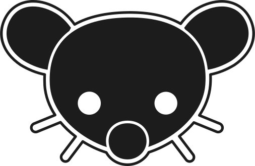 <code>lemmy</code></a></td></tr>
<tr><td align="center"><a href="../logos/letterfeed.svg"> <code>letterfeed</code></a></td><td align="center"><a href="../logos/lexmark.svg"> <code>lexmark</code></a></td><td align="center"><a href="../logos/lexware.svg"> <code>lexware</code></a></td><td align="center"><a href="../logos/libation.svg"> <code>libation</code></a></td><td align="center"><a href="../logos/librariarr.svg">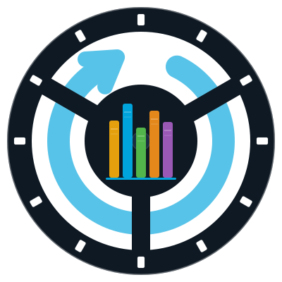 <code>librariarr</code></a></td><td align="center"><a href="../logos/librechat.svg"> <code>librechat</code></a></td></tr>
<tr><td align="center"><a href="../logos/libreddit.svg"> <code>libreddit</code></a></td><td align="center"><a href="../logos/librenms.svg"> <code>librenms</code></a></td><td align="center"><a href="../logos/libreoffice-colibre-graphic.svg"> <code>libreoffice-colibre-graphic</code></a></td><td align="center"><a href="../logos/libreoffice-colibre-presentation.svg"> <code>libreoffice-colibre-presentation</code></a></td><td align="center"><a href="../logos/libreoffice-colibre-spreadsheet.svg"> <code>libreoffice-colibre-spreadsheet</code></a></td><td align="center"><a href="../logos/libreoffice-colibre-text.svg"> <code>libreoffice-colibre-text</code></a></td></tr>
<tr><td align="center"><a href="../logos/librephotos.svg">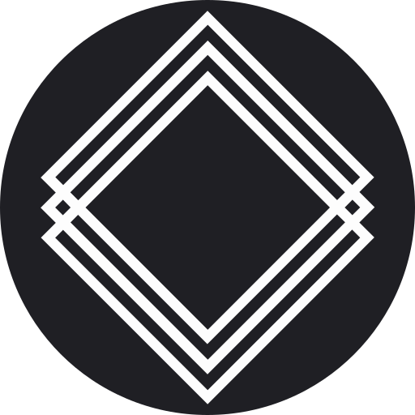 <code>librephotos</code></a></td><td align="center"><a href="../logos/libretranslate.svg"> <code>libretranslate</code></a></td><td align="center"><a href="../logos/librewolf.svg">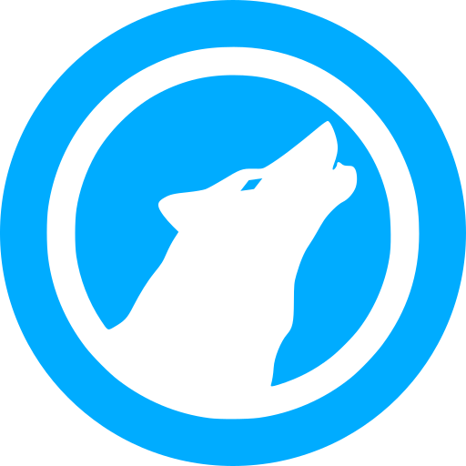 <code>librewolf</code></a></td><td align="center"><a href="../logos/librum.svg">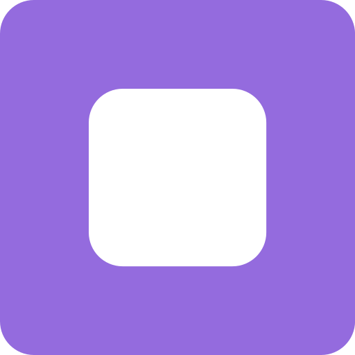 <code>librum</code></a></td><td align="center"><a href="../logos/lichess.svg"> <code>lichess</code></a></td><td align="center"><a href="../logos/lidarr.svg">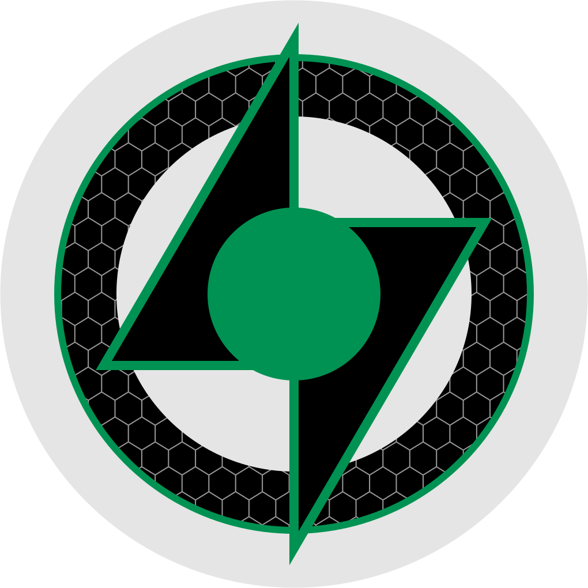 <code>lidarr</code></a></td></tr>
<tr><td align="center"><a href="../logos/lidarr-radarr.svg"> <code>lidarr-radarr</code></a></td><td align="center"><a href="../logos/lidbrainz.svg">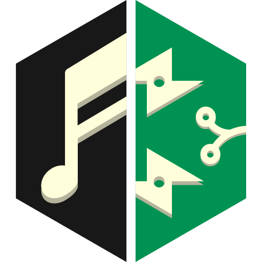 <code>lidbrainz</code></a></td><td align="center"><a href="../logos/lidl.svg"> <code>lidl</code></a></td><td align="center"><a href="../logos/limesurvey.svg"> <code>limesurvey</code></a></td><td align="center"><a href="../logos/lineage.svg">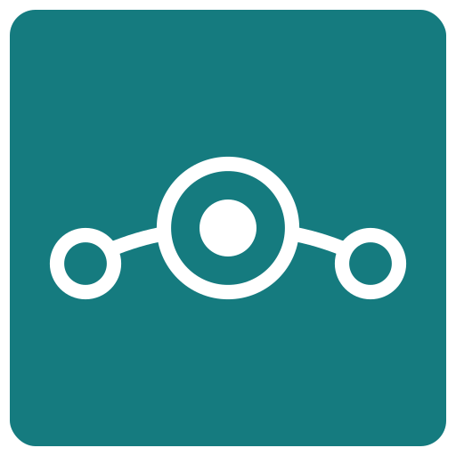 <code>lineage</code></a></td><td align="center"><a href="../logos/linear.svg">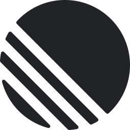 <code>linear</code></a></td></tr>
<tr><td align="center"><a href="../logos/linear-wordmark.svg"> <code>linear-wordmark</code></a></td><td align="center"><a href="../logos/lingarr.svg"> <code>lingarr</code></a></td><td align="center"><a href="../logos/linguacafe.svg">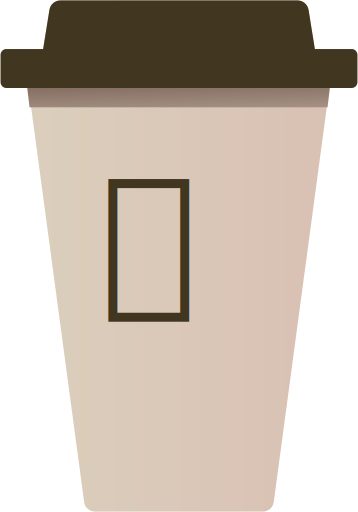 <code>linguacafe</code></a></td><td align="center"><a href="../logos/lingva-translate.svg"> <code>lingva-translate</code></a></td><td align="center"><a href="../logos/linkace.svg"> <code>linkace</code></a></td><td align="center"><a href="../logos/linkding.svg"> <code>linkding</code></a></td></tr>
<tr><td align="center"><a href="../logos/linkstack.svg">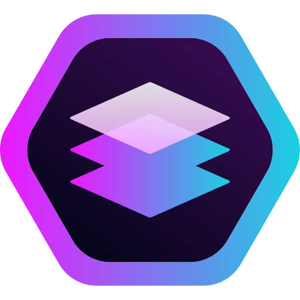 <code>linkstack</code></a></td><td align="center"><a href="../logos/linksys.svg"> <code>linksys</code></a></td><td align="center"><a href="../logos/linkwarden.svg"> <code>linkwarden</code></a></td><td align="center"><a href="../logos/liremdb.svg"> <code>liremdb</code></a></td><td align="center"><a href="../logos/listenarr.svg"> <code>listenarr</code></a></td><td align="center"><a href="../logos/listenbrainz.svg"> <code>listenbrainz</code></a></td></tr>
<tr><td align="center"><a href="../logos/listing-lab.svg"> <code>listing-lab</code></a></td><td align="center"><a href="../logos/listmonk.svg"> <code>listmonk</code></a></td><td align="center"><a href="../logos/listseerr.svg"> <code>listseerr</code></a></td><td align="center"><a href="../logos/lite-speed.svg"> <code>lite-speed</code></a></td><td align="center"><a href="../logos/litlyx.svg"> <code>litlyx</code></a></td><td align="center"><a href="../logos/littlelink.svg"> <code>littlelink</code></a></td></tr>
<tr><td align="center"><a href="../logos/littlelink-custom.svg">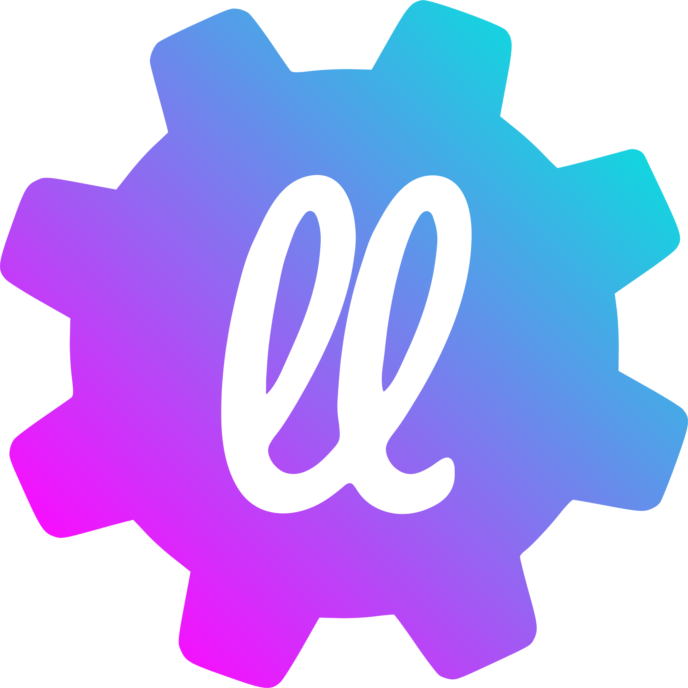 <code>littlelink-custom</code></a></td><td align="center"><a href="../logos/live-blog.svg"> <code>live-blog</code></a></td><td align="center"><a href="../logos/livebook.svg"> <code>livebook</code></a></td><td align="center"><a href="../logos/liwan.svg"> <code>liwan</code></a></td><td align="center"><a href="../logos/lldap.svg"> <code>lldap</code></a></td><td align="center"><a href="../logos/lms-mixtape.svg"> <code>lms-mixtape</code></a></td></tr>
<tr><td align="center"><a href="../logos/lnbits.svg"> <code>lnbits</code></a></td><td align="center"><a href="../logos/loandash.svg"> <code>loandash</code></a></td><td align="center"><a href="../logos/lobehub.svg"> <code>lobehub</code></a></td><td align="center"><a href="../logos/local-content-share.svg">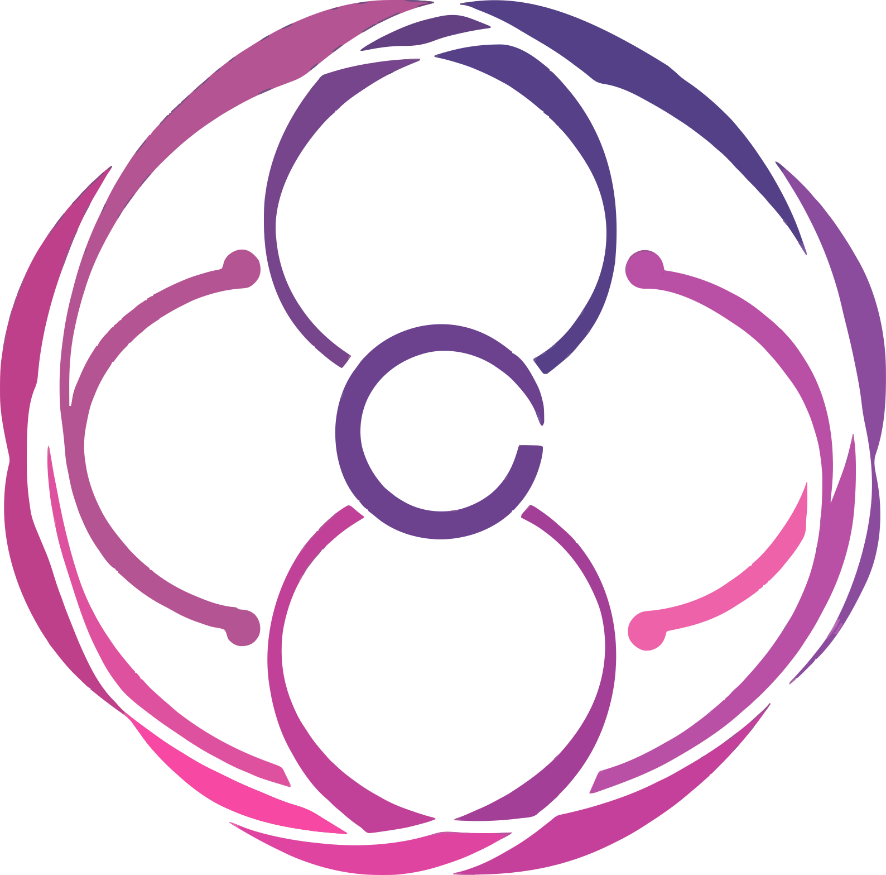 <code>local-content-share</code></a></td><td align="center"><a href="../logos/local-xpose.svg"> <code>local-xpose</code></a></td><td align="center"><a href="../logos/localess.svg"> <code>localess</code></a></td></tr>
<tr><td align="center"><a href="../logos/locals.svg"> <code>locals</code></a></td><td align="center"><a href="../logos/lockheed-martin.svg">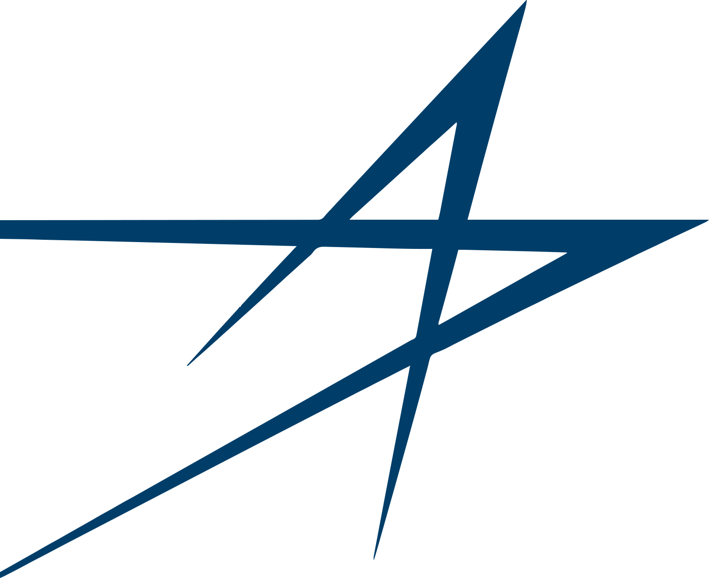 <code>lockheed-martin</code></a></td><td align="center"><a href="../logos/lodestone.svg"> <code>lodestone</code></a></td><td align="center"><a href="../logos/logchef.svg">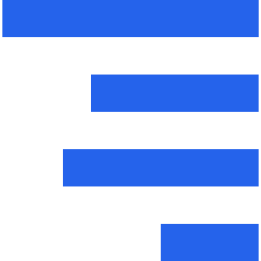 <code>logchef</code></a></td><td align="center"><a href="../logos/logforge.svg"> <code>logforge</code></a></td><td align="center"><a href="../logos/logitech-legacy.svg">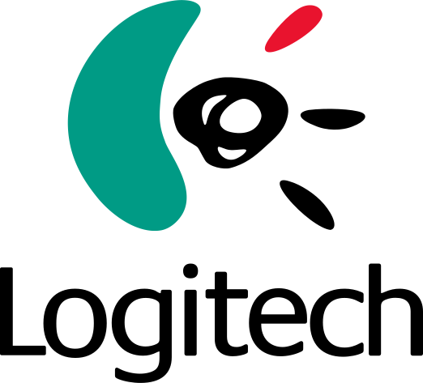 <code>logitech-legacy</code></a></td></tr>
<tr><td align="center"><a href="../logos/loglibrarian.svg"> <code>loglibrarian</code></a></td><td align="center"><a href="../logos/loglynx.svg"> <code>loglynx</code></a></td><td align="center"><a href="../logos/logseq.svg">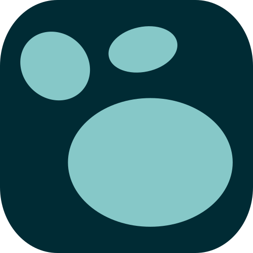 <code>logseq</code></a></td><td align="center"><a href="../logos/logtide.svg">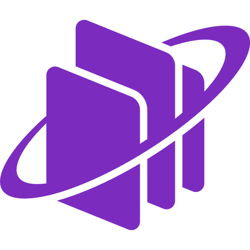 <code>logtide</code></a></td><td align="center"><a href="../logos/logto.svg"> <code>logto</code></a></td><td align="center"><a href="../logos/logwell.svg"> <code>logwell</code></a></td></tr>
<tr><td align="center"><a href="../logos/loki.svg"> <code>loki</code></a></td><td align="center"><a href="../logos/longhorn.svg">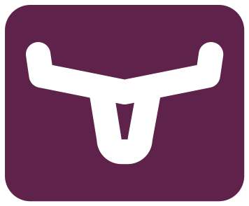 <code>longhorn</code></a></td><td align="center"><a href="../logos/loom.svg"> <code>loom</code></a></td><td align="center"><a href="../logos/loom-wordmark.svg"> <code>loom-wordmark</code></a></td><td align="center"><a href="../logos/lostack.svg"> <code>lostack</code></a></td><td align="center"><a href="../logos/lowcoder.svg">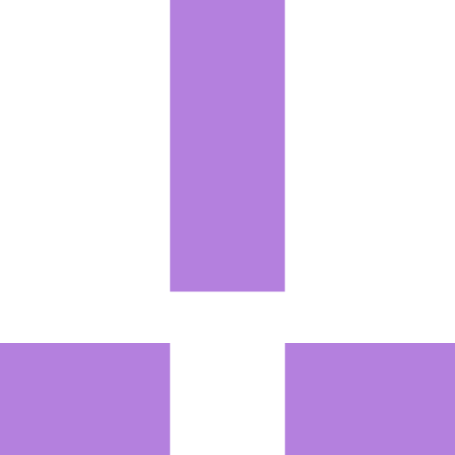 <code>lowcoder</code></a></td></tr>
<tr><td align="center"><a href="../logos/loxone.svg"> <code>loxone</code></a></td><td align="center"><a href="../logos/loxone-full.svg"> <code>loxone-full</code></a></td><td align="center"><a href="../logos/ludus.svg"> <code>ludus</code></a></td><td align="center"><a href="../logos/lufin.svg"> <code>lufin</code></a></td><td align="center"><a href="../logos/lululemon.svg">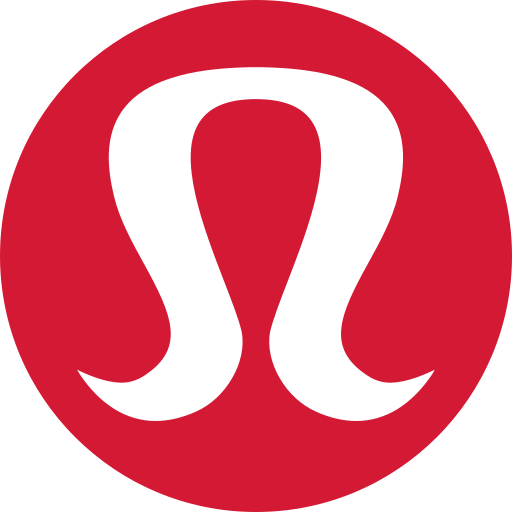 <code>lululemon</code></a></td><td align="center"><a href="../logos/luna-dashboard.svg"> <code>luna-dashboard</code></a></td></tr>
<tr><td align="center"><a href="../logos/lunalytics.svg"> <code>lunalytics</code></a></td><td align="center"><a href="../logos/lunasea.svg"> <code>lunasea</code></a></td><td align="center"><a href="../logos/luxriot.svg"> <code>luxriot</code></a></td><td align="center"><a href="../logos/lynx.svg">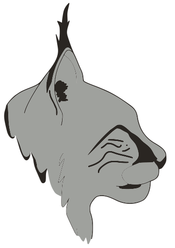 <code>lynx</code></a></td><td align="center"><a href="../logos/lyrion.svg"> <code>lyrion</code></a></td><td align="center"><a href="../logos/m3u-editor.svg"> <code>m3u-editor</code></a></td></tr>
<tr><td align="center"><a href="../logos/macmon.svg"> <code>macmon</code></a></td><td align="center"><a href="../logos/macrumors.svg">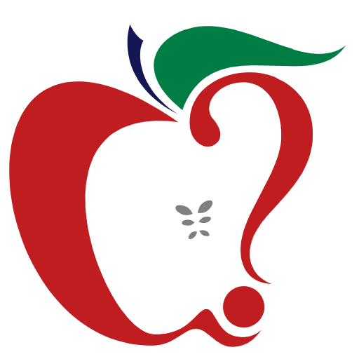 <code>macrumors</code></a></td><td align="center"><a href="../logos/mafl.svg">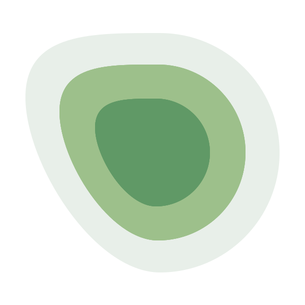 <code>mafl</code></a></td><td align="center"><a href="../logos/magicinfo.svg"> <code>magicinfo</code></a></td><td align="center"><a href="../logos/magicmirror2.svg">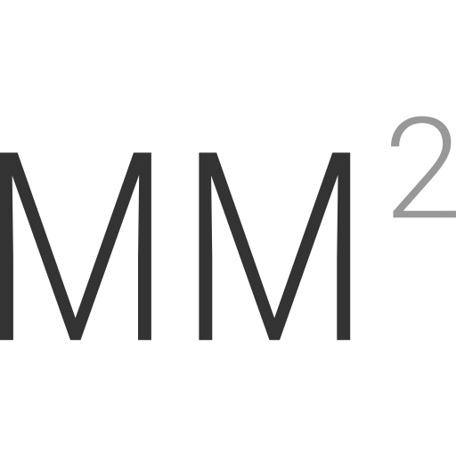 <code>magicmirror2</code></a></td><td align="center"><a href="../logos/mailbox.svg"> <code>mailbox</code></a></td></tr>
<tr><td align="center"><a href="../logos/mailcow.svg"> <code>mailcow</code></a></td><td align="center"><a href="../logos/mailfence.svg"> <code>mailfence</code></a></td><td align="center"><a href="../logos/mailpit.svg"> <code>mailpit</code></a></td><td align="center"><a href="../logos/mailstore.svg"> <code>mailstore</code></a></td><td align="center"><a href="../logos/mainsail.svg"> <code>mainsail</code></a></td><td align="center"><a href="../logos/maintenant.svg"> <code>maintenant</code></a></td></tr>
<tr><td align="center"><a href="../logos/maker-management-platform.svg"> <code>maker-management-platform</code></a></td><td align="center"><a href="../logos/maker-world.svg"> <code>maker-world</code></a></td><td align="center"><a href="../logos/makers-vault.svg"> <code>makers-vault</code></a></td><td align="center"><a href="../logos/maloja.svg"> <code>maloja</code></a></td><td align="center"><a href="../logos/maltego.svg"> <code>maltego</code></a></td><td align="center"><a href="../logos/maltego-wordmark.svg"> <code>maltego-wordmark</code></a></td></tr>
<tr><td align="center"><a href="../logos/manga-dex.svg"> <code>manga-dex</code></a></td><td align="center"><a href="../logos/manifest.svg"> <code>manifest</code></a></td><td align="center"><a href="../logos/mantrae.svg"> <code>mantrae</code></a></td><td align="center"><a href="../logos/many-notes.svg">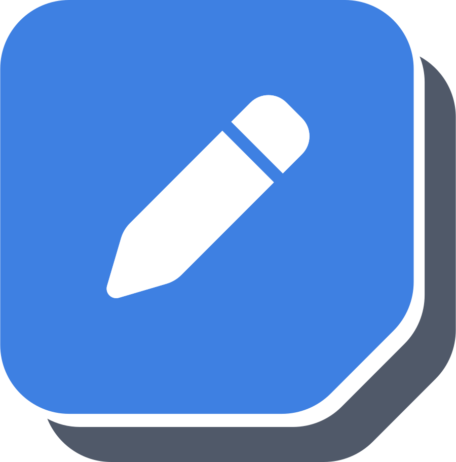 <code>many-notes</code></a></td><td align="center"><a href="../logos/manyfold.svg">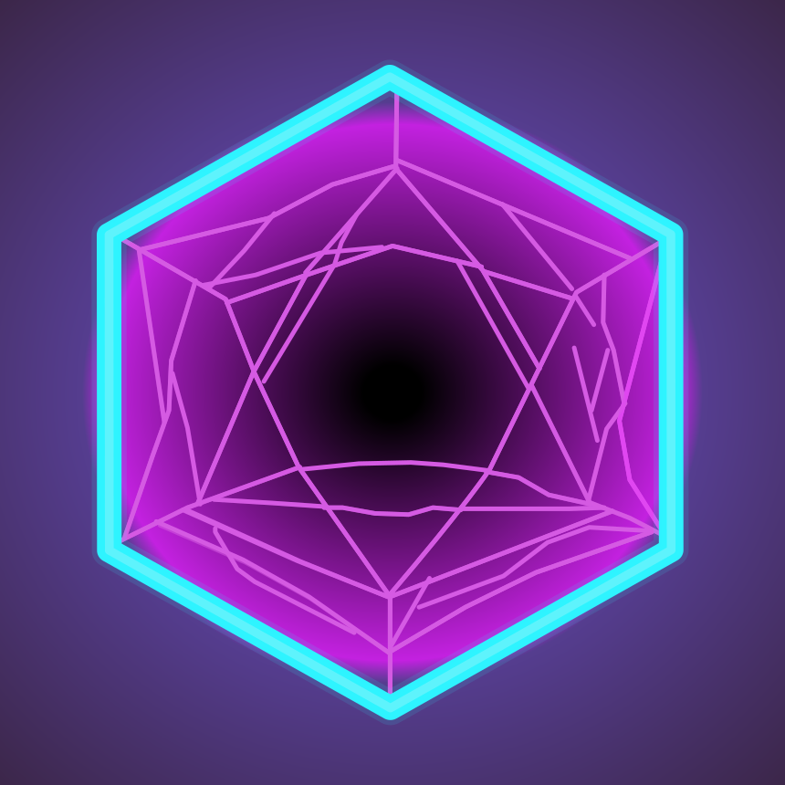 <code>manyfold</code></a></td><td align="center"><a href="../logos/mapcomplete.svg"> <code>mapcomplete</code></a></td></tr>
<tr><td align="center"><a href="../logos/mapillary.svg"> <code>mapillary</code></a></td><td align="center"><a href="../logos/maptiler.svg"> <code>maptiler</code></a></td><td align="center"><a href="../logos/mapy.svg"> <code>mapy</code></a></td><td align="center"><a href="../logos/marimo.svg"> <code>marimo</code></a></td><td align="center"><a href="../logos/markstack.svg"> <code>markstack</code></a></td><td align="center"><a href="../logos/marktplaats.svg">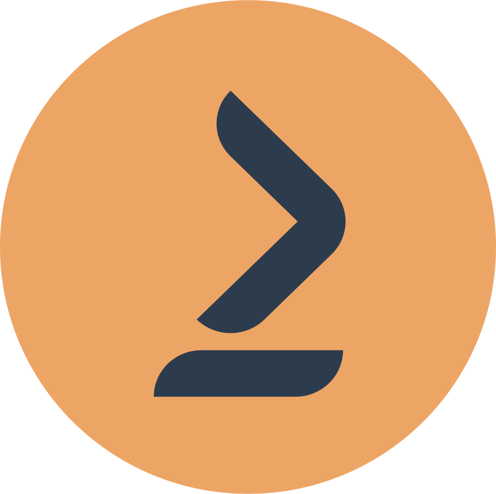 <code>marktplaats</code></a></td></tr>
<tr><td align="center"><a href="../logos/marp.svg">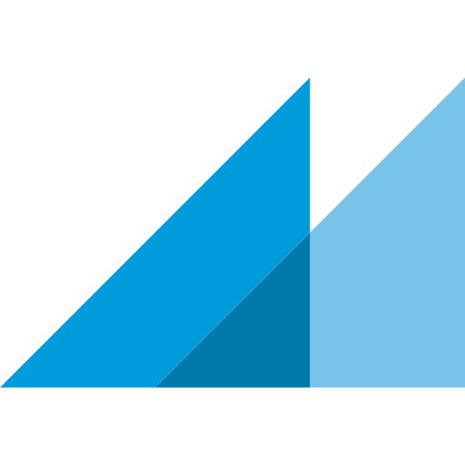 <code>marp</code></a></td><td align="center"><a href="../logos/marreta.svg">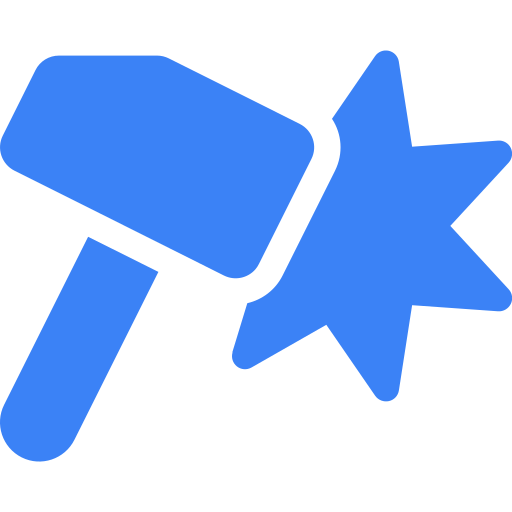 <code>marreta</code></a></td><td align="center"><a href="../logos/matchexec.svg">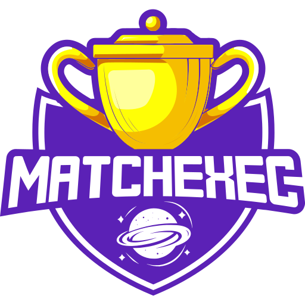 <code>matchexec</code></a></td><td align="center"><a href="../logos/material-design-icons.svg"> <code>material-design-icons</code></a></td><td align="center"><a href="../logos/materialious.svg">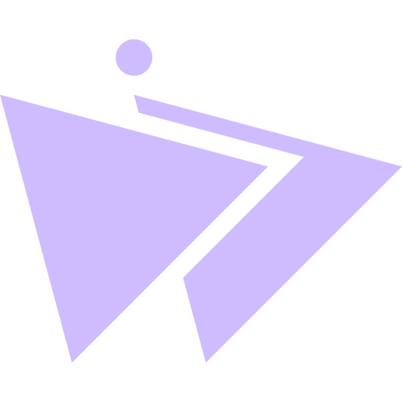 <code>materialious</code></a></td><td align="center"><a href="../logos/mathesar.svg"> <code>mathesar</code></a></td></tr>
<tr><td align="center"><a href="../logos/matrix-synapse.svg"> <code>matrix-synapse</code></a></td><td align="center"><a href="../logos/matterbridge.svg"> <code>matterbridge</code></a></td><td align="center"><a href="../logos/max.svg"> <code>max</code></a></td><td align="center"><a href="../logos/maxun.svg"> <code>maxun</code></a></td><td align="center"><a href="../logos/mayan-edms.svg"> <code>mayan-edms</code></a></td><td align="center"><a href="../logos/maybe.svg">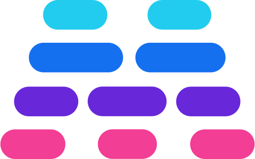 <code>maybe</code></a></td></tr>
<tr><td align="center"><a href="../logos/mazanoke.svg"> <code>mazanoke</code></a></td><td align="center"><a href="../logos/mbin.svg">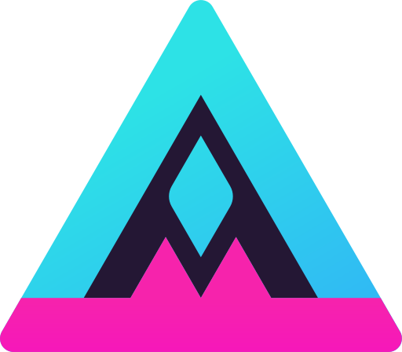 <code>mbin</code></a></td><td align="center"><a href="../logos/mealie.svg"> <code>mealie</code></a></td><td align="center"><a href="../logos/medama.svg"> <code>medama</code></a></td><td align="center"><a href="../logos/medassist.svg"> <code>medassist</code></a></td><td align="center"><a href="../logos/media-manager.svg">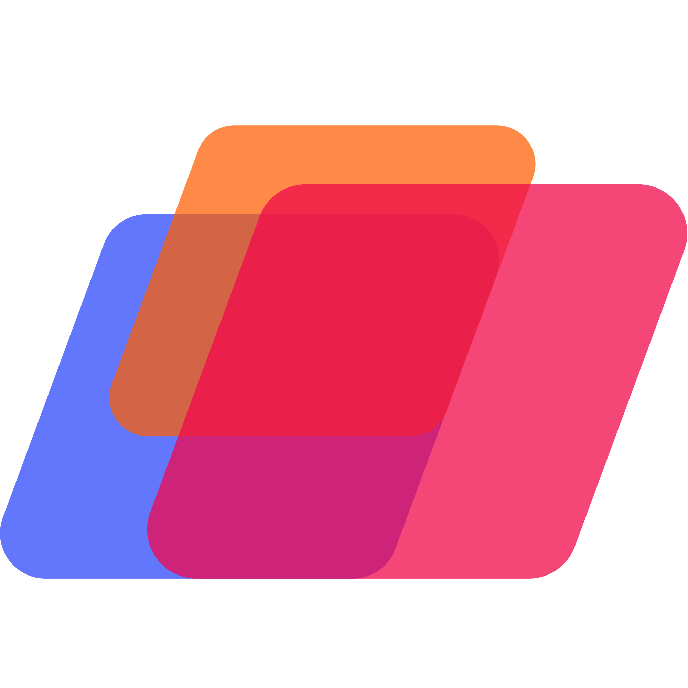 <code>media-manager</code></a></td></tr>
<tr><td align="center"><a href="../logos/mediafire.svg">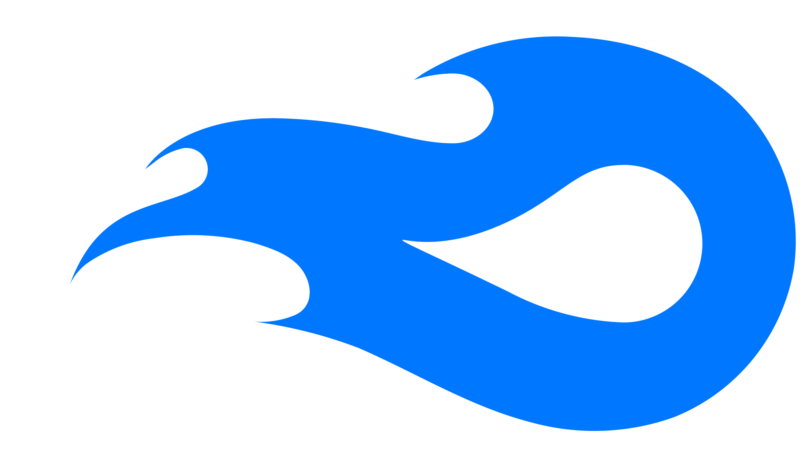 <code>mediafire</code></a></td><td align="center"><a href="../logos/medialyze.svg"> <code>medialyze</code></a></td><td align="center"><a href="../logos/mediamtx.svg"> <code>mediamtx</code></a></td><td align="center"><a href="../logos/mediathekview.svg"> <code>mediathekview</code></a></td><td align="center"><a href="../logos/mediawiki.svg"> <code>mediawiki</code></a></td><td align="center"><a href="../logos/mediawiki-wordmark.svg"> <code>mediawiki-wordmark</code></a></td></tr>
<tr><td align="center"><a href="../logos/medikeep.svg"> <code>medikeep</code></a></td><td align="center"><a href="../logos/mediux.svg"> <code>mediux</code></a></td><td align="center"><a href="../logos/meelo.svg">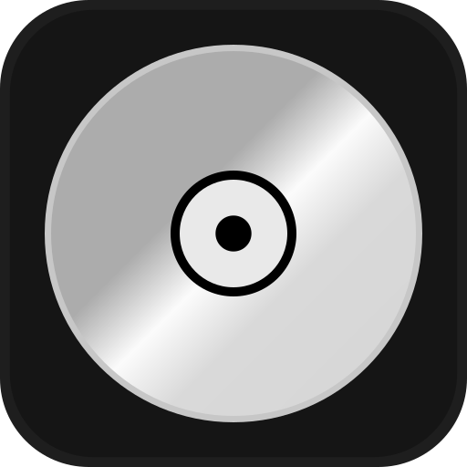 <code>meelo</code></a></td><td align="center"><a href="../logos/meetable.svg"> <code>meetable</code></a></td><td align="center"><a href="../logos/mega-nz.svg"> <code>mega-nz</code></a></td><td align="center"><a href="../logos/meme-search.svg"> <code>meme-search</code></a></td></tr>
<tr><td align="center"><a href="../logos/memories.svg"> <code>memories</code></a></td><td align="center"><a href="../logos/mend-container.svg"> <code>mend-container</code></a></td><td align="center"><a href="../logos/mend-io.svg">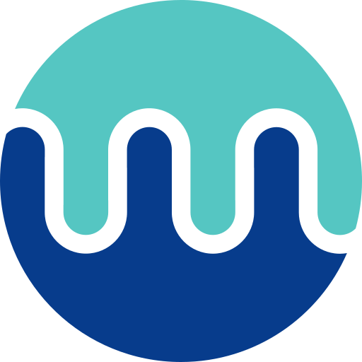 <code>mend-io</code></a></td><td align="center"><a href="../logos/mend-renovate.svg"> <code>mend-renovate</code></a></td><td align="center"><a href="../logos/mend-sast.svg"> <code>mend-sast</code></a></td><td align="center"><a href="../logos/mend-sca.svg">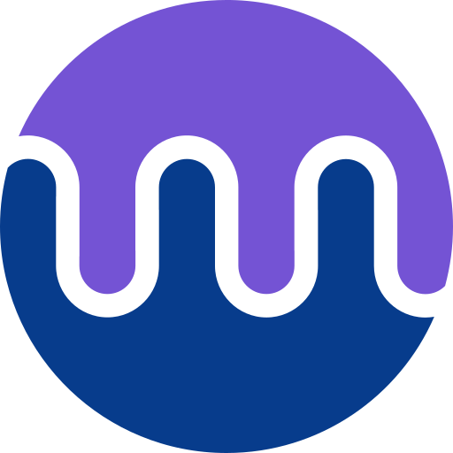 <code>mend-sca</code></a></td></tr>
<tr><td align="center"><a href="../logos/meraki.svg"> <code>meraki</code></a></td><td align="center"><a href="../logos/mercusys.svg"> <code>mercusys</code></a></td><td align="center"><a href="../logos/mergeable.svg"> <code>mergeable</code></a></td><td align="center"><a href="../logos/mergerfs.svg"> <code>mergerfs</code></a></td><td align="center"><a href="../logos/meshping.svg"> <code>meshping</code></a></td><td align="center"><a href="../logos/meshtastic.svg">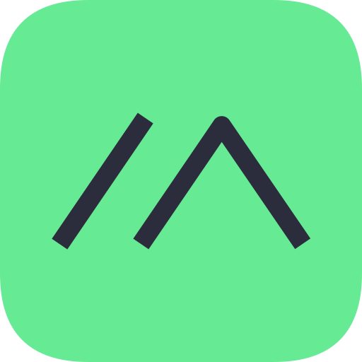 <code>meshtastic</code></a></td></tr>
<tr><td align="center"><a href="../logos/metabrainz.svg"> <code>metabrainz</code></a></td><td align="center"><a href="../logos/metadata-remote.svg">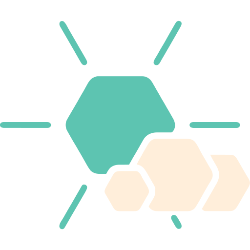 <code>metadata-remote</code></a></td><td align="center"><a href="../logos/metallb.svg">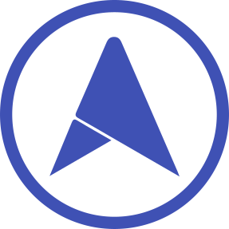 <code>metallb</code></a></td><td align="center"><a href="../logos/metube.svg"> <code>metube</code></a></td><td align="center"><a href="../logos/micro-center.svg">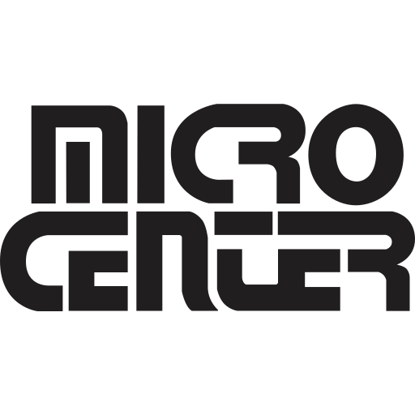 <code>micro-center</code></a></td><td align="center"><a href="../logos/microbin.svg"> <code>microbin</code></a></td></tr>
<tr><td align="center"><a href="../logos/microsandbox.svg">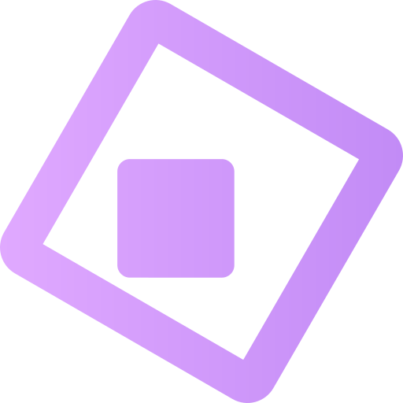 <code>microsandbox</code></a></td><td align="center"><a href="../logos/microsoft-365.svg"> <code>microsoft-365</code></a></td><td align="center"><a href="../logos/microsoft-365-admin-center.svg"> <code>microsoft-365-admin-center</code></a></td><td align="center"><a href="../logos/microsoft-access-2000.svg"> <code>microsoft-access-2000</code></a></td><td align="center"><a href="../logos/microsoft-access-2013.svg"> <code>microsoft-access-2013</code></a></td><td align="center"><a href="../logos/microsoft-access-2018.svg">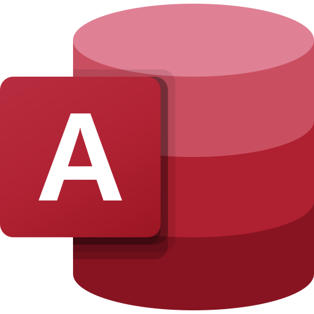 <code>microsoft-access-2018</code></a></td></tr>
<tr><td align="center"><a href="../logos/microsoft-bing.svg"> <code>microsoft-bing</code></a></td><td align="center"><a href="../logos/microsoft-clipchamp.svg"> <code>microsoft-clipchamp</code></a></td><td align="center"><a href="../logos/microsoft-dataverse.svg">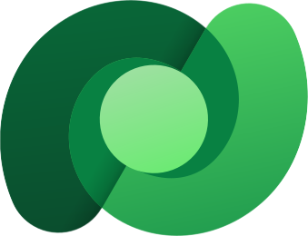 <code>microsoft-dataverse</code></a></td><td align="center"><a href="../logos/microsoft-defender.svg"> <code>microsoft-defender</code></a></td><td align="center"><a href="../logos/microsoft-defender-2020.svg"> <code>microsoft-defender-2020</code></a></td><td align="center"><a href="../logos/microsoft-editor.svg"> <code>microsoft-editor</code></a></td></tr>
<tr><td align="center"><a href="../logos/microsoft-excel.svg"> <code>microsoft-excel</code></a></td><td align="center"><a href="../logos/microsoft-excel-2000.svg"> <code>microsoft-excel-2000</code></a></td><td align="center"><a href="../logos/microsoft-excel-2013.svg"> <code>microsoft-excel-2013</code></a></td><td align="center"><a href="../logos/microsoft-excel-2018.svg"> <code>microsoft-excel-2018</code></a></td><td align="center"><a href="../logos/microsoft-exchange.svg"> <code>microsoft-exchange</code></a></td><td align="center"><a href="../logos/microsoft-forms.svg">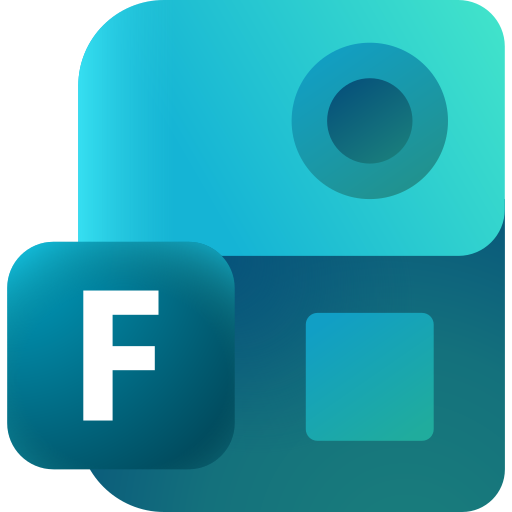 <code>microsoft-forms</code></a></td></tr>
<tr><td align="center"><a href="../logos/microsoft-forms-2016.svg"> <code>microsoft-forms-2016</code></a></td><td align="center"><a href="../logos/microsoft-forms-2019.svg">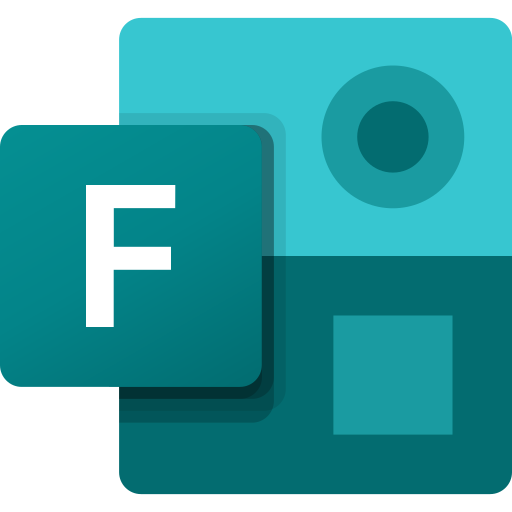 <code>microsoft-forms-2019</code></a></td><td align="center"><a href="../logos/microsoft-intune.svg"> <code>microsoft-intune</code></a></td><td align="center"><a href="../logos/microsoft-office.svg"> <code>microsoft-office</code></a></td><td align="center"><a href="../logos/microsoft-onedrive.svg"> <code>microsoft-onedrive</code></a></td><td align="center"><a href="../logos/microsoft-onedrive-2018.svg"> <code>microsoft-onedrive-2018</code></a></td></tr>
<tr><td align="center"><a href="../logos/microsoft-onenote.svg"> <code>microsoft-onenote</code></a></td><td align="center"><a href="../logos/microsoft-onenote-2013.svg"> <code>microsoft-onenote-2013</code></a></td><td align="center"><a href="../logos/microsoft-onenote-2018.svg">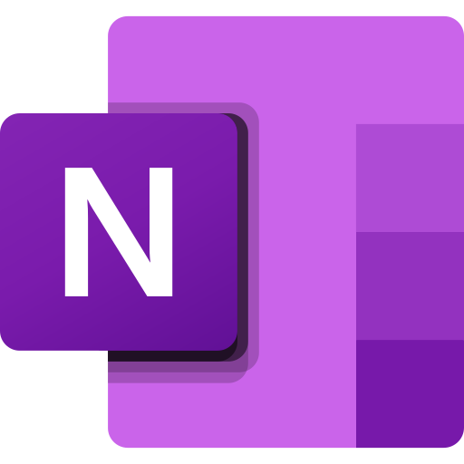 <code>microsoft-onenote-2018</code></a></td><td align="center"><a href="../logos/microsoft-outlook.svg"> <code>microsoft-outlook</code></a></td><td align="center"><a href="../logos/microsoft-outlook-2000.svg"> <code>microsoft-outlook-2000</code></a></td><td align="center"><a href="../logos/microsoft-outlook-2013.svg"> <code>microsoft-outlook-2013</code></a></td></tr>
<tr><td align="center"><a href="../logos/microsoft-outlook-2018.svg"> <code>microsoft-outlook-2018</code></a></td><td align="center"><a href="../logos/microsoft-power-automate.svg"> <code>microsoft-power-automate</code></a></td><td align="center"><a href="../logos/microsoft-powerpoint.svg"> <code>microsoft-powerpoint</code></a></td><td align="center"><a href="../logos/microsoft-powerpoint-2000.svg"> <code>microsoft-powerpoint-2000</code></a></td><td align="center"><a href="../logos/microsoft-powerpoint-2013.svg"> <code>microsoft-powerpoint-2013</code></a></td><td align="center"><a href="../logos/microsoft-powerpoint-2018.svg">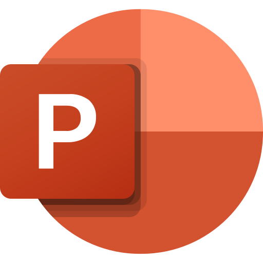 <code>microsoft-powerpoint-2018</code></a></td></tr>
<tr><td align="center"><a href="../logos/microsoft-powertoys.svg"> <code>microsoft-powertoys</code></a></td><td align="center"><a href="../logos/microsoft-sharepoint-2013.svg"> <code>microsoft-sharepoint-2013</code></a></td><td align="center"><a href="../logos/microsoft-teams-2016.svg">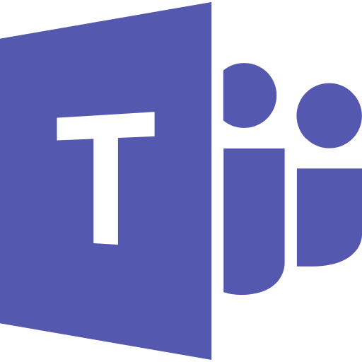 <code>microsoft-teams-2016</code></a></td><td align="center"><a href="../logos/microsoft-teams-2018.svg"> <code>microsoft-teams-2018</code></a></td><td align="center"><a href="../logos/microsoft-todo.svg"> <code>microsoft-todo</code></a></td><td align="center"><a href="../logos/microsoft-word.svg"> <code>microsoft-word</code></a></td></tr>
<tr><td align="center"><a href="../logos/microsoft-word-2000.svg"> <code>microsoft-word-2000</code></a></td><td align="center"><a href="../logos/microsoft-word-2013.svg"> <code>microsoft-word-2013</code></a></td><td align="center"><a href="../logos/microsoft-word-2018.svg"> <code>microsoft-word-2018</code></a></td><td align="center"><a href="../logos/midarr.svg"> <code>midarr</code></a></td><td align="center"><a href="../logos/mikopbx.svg"> <code>mikopbx</code></a></td><td align="center"><a href="../logos/mikrotik.svg"> <code>mikrotik</code></a></td></tr>
<tr><td align="center"><a href="../logos/milanote.svg"> <code>milanote</code></a></td><td align="center"><a href="../logos/milanote-wordmark.svg"> <code>milanote-wordmark</code></a></td><td align="center"><a href="../logos/miles-and-more.svg"> <code>miles-and-more</code></a></td><td align="center"><a href="../logos/milinote.svg"> <code>milinote</code></a></td><td align="center"><a href="../logos/minarca.svg">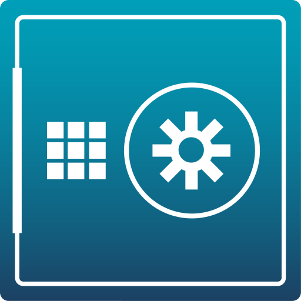 <code>minarca</code></a></td><td align="center"><a href="../logos/minecraft-creeper.svg"> <code>minecraft-creeper</code></a></td></tr>
<tr><td align="center"><a href="../logos/minecraft-detailed.svg">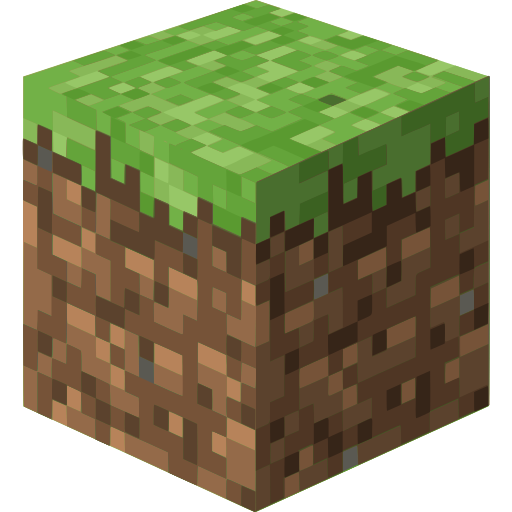 <code>minecraft-detailed</code></a></td><td align="center"><a href="../logos/mini-qr.svg">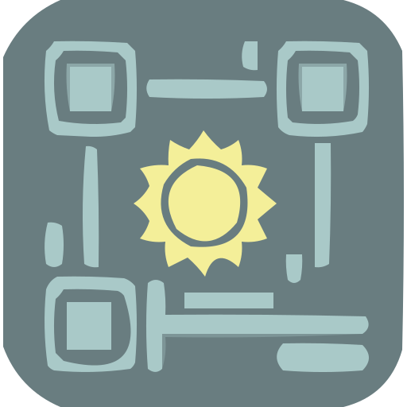 <code>mini-qr</code></a></td><td align="center"><a href="../logos/miniflux.svg"> <code>miniflux</code></a></td><td align="center"><a href="../logos/minimax.svg"> <code>minimax</code></a></td><td align="center"><a href="../logos/minio.svg"> <code>minio</code></a></td><td align="center"><a href="../logos/mint-mobile.svg"> <code>mint-mobile</code></a></td></tr>
<tr><td align="center"><a href="../logos/minthcm.svg"> <code>minthcm</code></a></td><td align="center"><a href="../logos/mintlify.svg"> <code>mintlify</code></a></td><td align="center"><a href="../logos/mintlify-wordmark.svg"> <code>mintlify-wordmark</code></a></td><td align="center"><a href="../logos/minuspod.svg">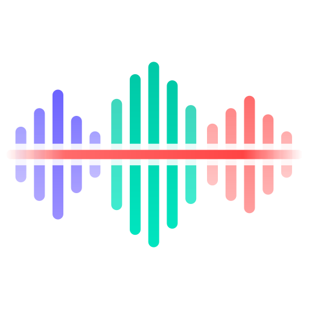 <code>minuspod</code></a></td><td align="center"><a href="../logos/miro.svg"> <code>miro</code></a></td><td align="center"><a href="../logos/miro-wordmark.svg"> <code>miro-wordmark</code></a></td></tr>
<tr><td align="center"><a href="../logos/mirotalk.svg">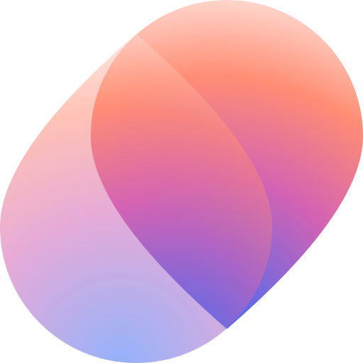 <code>mirotalk</code></a></td><td align="center"><a href="../logos/misskey.svg"> <code>misskey</code></a></td><td align="center"><a href="../logos/mitmproxy.svg">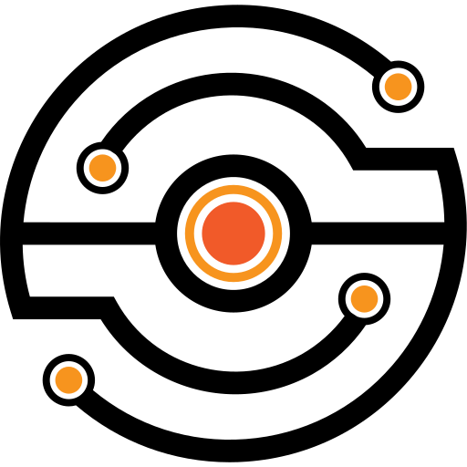 <code>mitmproxy</code></a></td><td align="center"><a href="../logos/mitra.svg">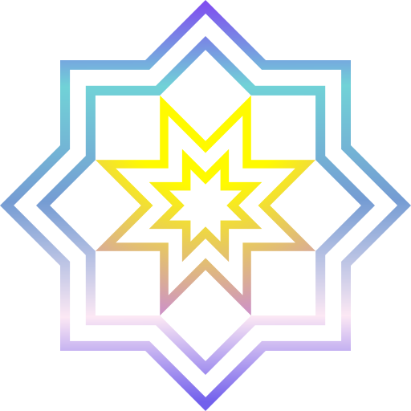 <code>mitra</code></a></td><td align="center"><a href="../logos/mixpost.svg">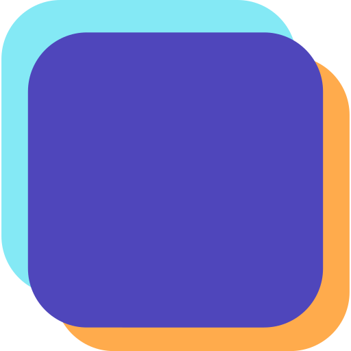 <code>mixpost</code></a></td><td align="center"><a href="../logos/mkdocs.svg">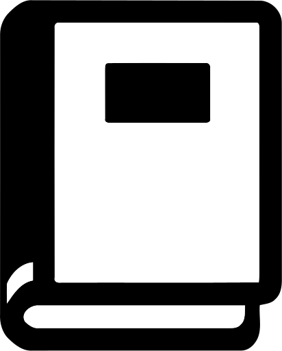 <code>mkdocs</code></a></td></tr>
<tr><td align="center"><a href="../logos/mkvpriority.svg">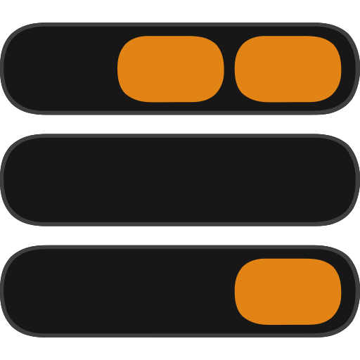 <code>mkvpriority</code></a></td><td align="center"><a href="../logos/ml-flow-wordmark.svg"> <code>ml-flow-wordmark</code></a></td><td align="center"><a href="../logos/mobilizon.svg"> <code>mobilizon</code></a></td><td align="center"><a href="../logos/mobioffice.svg"> <code>mobioffice</code></a></td><td align="center"><a href="../logos/mobotix.svg"> <code>mobotix</code></a></td><td align="center"><a href="../logos/mockos.svg">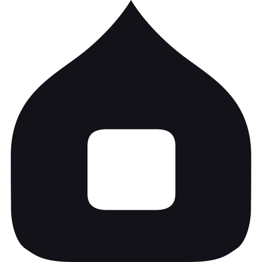 <code>mockos</code></a></td></tr>
<tr><td align="center"><a href="../logos/modrinth.svg">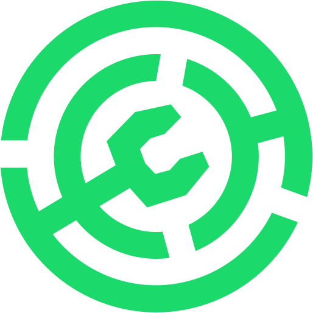 <code>modrinth</code></a></td><td align="center"><a href="../logos/monday.svg"> <code>monday</code></a></td><td align="center"><a href="../logos/monday-wordmark.svg"> <code>monday-wordmark</code></a></td><td align="center"><a href="../logos/monetr.svg"> <code>monetr</code></a></td><td align="center"><a href="../logos/monica.svg"> <code>monica</code></a></td><td align="center"><a href="../logos/monkeytype.svg"> <code>monkeytype</code></a></td></tr>
<tr><td align="center"><a href="../logos/monkeytype-wordmark.svg"> <code>monkeytype-wordmark</code></a></td><td align="center"><a href="../logos/moocup.svg"> <code>moocup</code></a></td><td align="center"><a href="../logos/moodist.svg"> <code>moodist</code></a></td><td align="center"><a href="../logos/moodle.svg"> <code>moodle</code></a></td><td align="center"><a href="../logos/morphos.svg">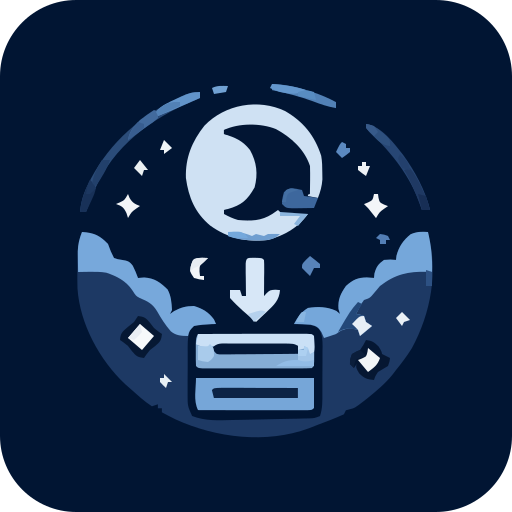 <code>morphos</code></a></td><td align="center"><a href="../logos/morss.svg"> <code>morss</code></a></td></tr>
<tr><td align="center"><a href="../logos/mosquitto.svg"> <code>mosquitto</code></a></td><td align="center"><a href="../logos/motioneye.svg"> <code>motioneye</code></a></td><td align="center"><a href="../logos/mousehole.svg"> <code>mousehole</code></a></td><td align="center"><a href="../logos/mousetrap.svg"> <code>mousetrap</code></a></td><td align="center"><a href="../logos/movary.svg"> <code>movary</code></a></td><td align="center"><a href="../logos/movim.svg"> <code>movim</code></a></td></tr>
<tr><td align="center"><a href="../logos/mqtt.svg"> <code>mqtt</code></a></td><td align="center"><a href="../logos/mqttx.svg"> <code>mqttx</code></a></td><td align="center"><a href="../logos/mstream.svg">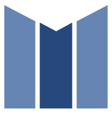 <code>mstream</code></a></td><td align="center"><a href="../logos/mtlynch-picoshare.svg"> <code>mtlynch-picoshare</code></a></td><td align="center"><a href="../logos/mubi.svg"> <code>mubi</code></a></td><td align="center"><a href="../logos/mulesoft.svg"> <code>mulesoft</code></a></td></tr>
<tr><td align="center"><a href="../logos/mullvad.svg"> <code>mullvad</code></a></td><td align="center"><a href="../logos/mullvad-browser.svg"> <code>mullvad-browser</code></a></td><td align="center"><a href="../logos/multi-scrobbler.svg">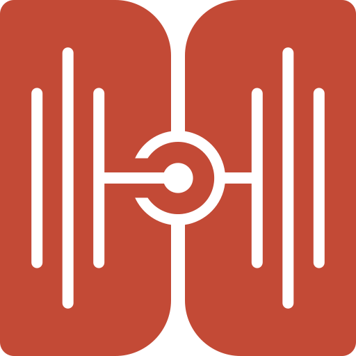 <code>multi-scrobbler</code></a></td><td align="center"><a href="../logos/multifactor-authenticator.svg"> <code>multifactor-authenticator</code></a></td><td align="center"><a href="../logos/mumble.svg"> <code>mumble</code></a></td><td align="center"><a href="../logos/mundraub.svg"> <code>mundraub</code></a></td></tr>
<tr><td align="center"><a href="../logos/munin.svg">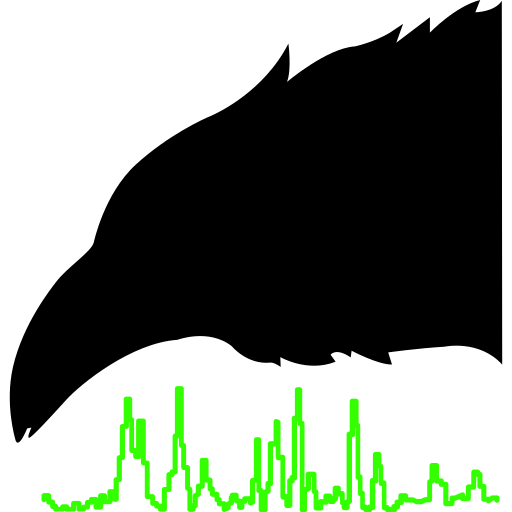 <code>munin</code></a></td><td align="center"><a href="../logos/murena.svg"> <code>murena</code></a></td><td align="center"><a href="../logos/musescore.svg">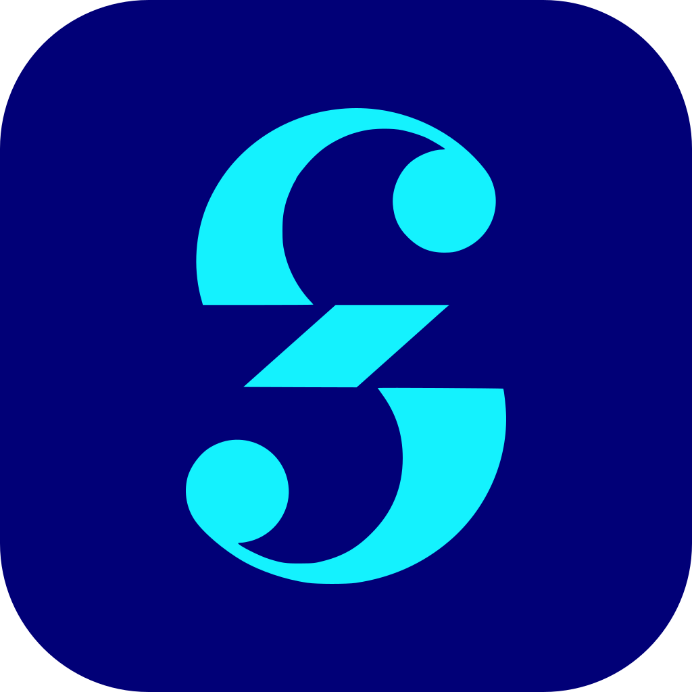 <code>musescore</code></a></td><td align="center"><a href="../logos/musicbrainz.svg"> <code>musicbrainz</code></a></td><td align="center"><a href="../logos/musicbrainz-picard.svg"> <code>musicbrainz-picard</code></a></td><td align="center"><a href="../logos/musivault.svg">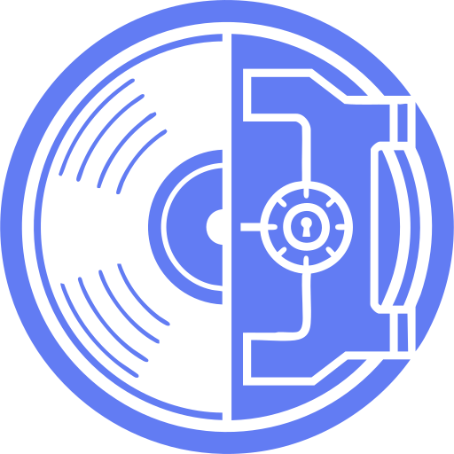 <code>musivault</code></a></td></tr>
<tr><td align="center"><a href="../logos/mxroute.svg"> <code>mxroute</code></a></td><td align="center"><a href="../logos/mydrive.svg"> <code>mydrive</code></a></td><td align="center"><a href="../logos/myheats.svg"> <code>myheats</code></a></td><td align="center"><a href="../logos/myip.svg"> <code>myip</code></a></td><td align="center"><a href="../logos/mympd.svg"> <code>mympd</code></a></td><td align="center"><a href="../logos/myspeed.svg"> <code>myspeed</code></a></td></tr>
<tr><td align="center"><a href="../logos/mysterium.svg"> <code>mysterium</code></a></td><td align="center"><a href="../logos/n8n.svg"> <code>n8n</code></a></td><td align="center"><a href="../logos/n8n-wordmark.svg"> <code>n8n-wordmark</code></a></td><td align="center"><a href="../logos/name-silo.svg"> <code>name-silo</code></a></td><td align="center"><a href="../logos/nametag.svg"> <code>nametag</code></a></td><td align="center"><a href="../logos/nanoclaw.svg">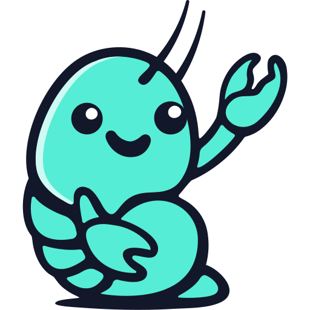 <code>nanoclaw</code></a></td></tr>
<tr><td align="center"><a href="../logos/nanosmart.svg"> <code>nanosmart</code></a></td><td align="center"><a href="../logos/nanote.svg">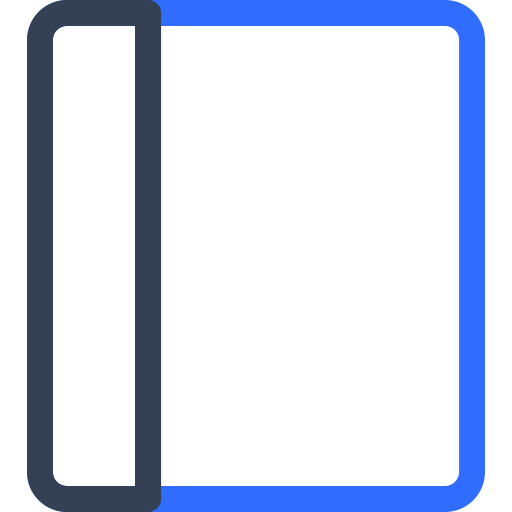 <code>nanote</code></a></td><td align="center"><a href="../logos/nasa-worm.svg"> <code>nasa-worm</code></a></td><td align="center"><a href="../logos/nasdaq.svg"> <code>nasdaq</code></a></td><td align="center"><a href="../logos/natwest.svg"> <code>natwest</code></a></td><td align="center"><a href="../logos/navidrome.svg"> <code>navidrome</code></a></td></tr>
<tr><td align="center"><a href="../logos/navy-federal-credit-union.svg"> <code>navy-federal-credit-union</code></a></td><td align="center"><a href="../logos/nebula.svg"> <code>nebula</code></a></td><td align="center"><a href="../logos/neko.svg"> <code>neko</code></a></td><td align="center"><a href="../logos/nemorosa.svg"> <code>nemorosa</code></a></td><td align="center"><a href="../logos/neodb.svg">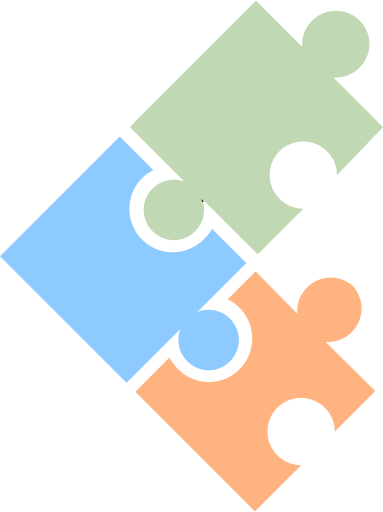 <code>neodb</code></a></td><td align="center"><a href="../logos/neohabit.svg"> <code>neohabit</code></a></td></tr>
<tr><td align="center"><a href="../logos/neon-tech.svg"> <code>neon-tech</code></a></td><td align="center"><a href="../logos/neonlink.svg"> <code>neonlink</code></a></td><td align="center"><a href="../logos/netalertx.svg">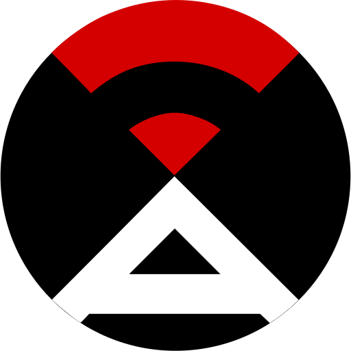 <code>netalertx</code></a></td><td align="center"><a href="../logos/netapp.svg"> <code>netapp</code></a></td><td align="center"><a href="../logos/netatmo.svg"> <code>netatmo</code></a></td><td align="center"><a href="../logos/netbird.svg"> <code>netbird</code></a></td></tr>
<tr><td align="center"><a href="../logos/netboot.svg"> <code>netboot</code></a></td><td align="center"><a href="../logos/netbootxyz.svg">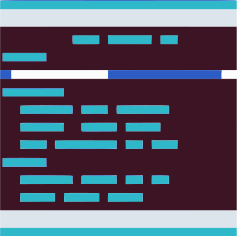 <code>netbootxyz</code></a></td><td align="center"><a href="../logos/netbox.svg">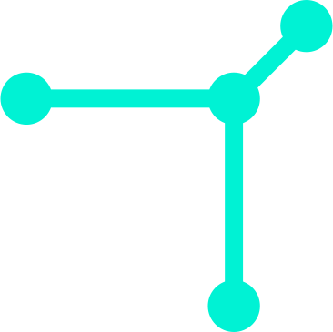 <code>netbox</code></a></td><td align="center"><a href="../logos/netbox-full.svg">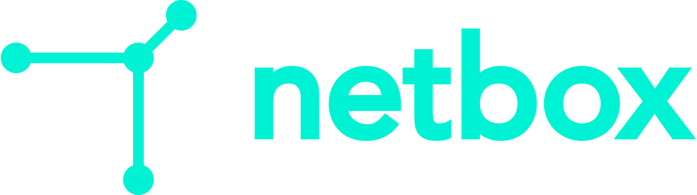 <code>netbox-full</code></a></td><td align="center"><a href="../logos/netdata.svg"> <code>netdata</code></a></td><td align="center"><a href="../logos/netgear.svg"> <code>netgear</code></a></td></tr>
<tr><td align="center"><a href="../logos/netgoat.svg"> <code>netgoat</code></a></td><td align="center"><a href="../logos/netlock-rmm.svg"> <code>netlock-rmm</code></a></td><td align="center"><a href="../logos/netonnet.svg"> <code>netonnet</code></a></td><td align="center"><a href="../logos/netsurf.svg">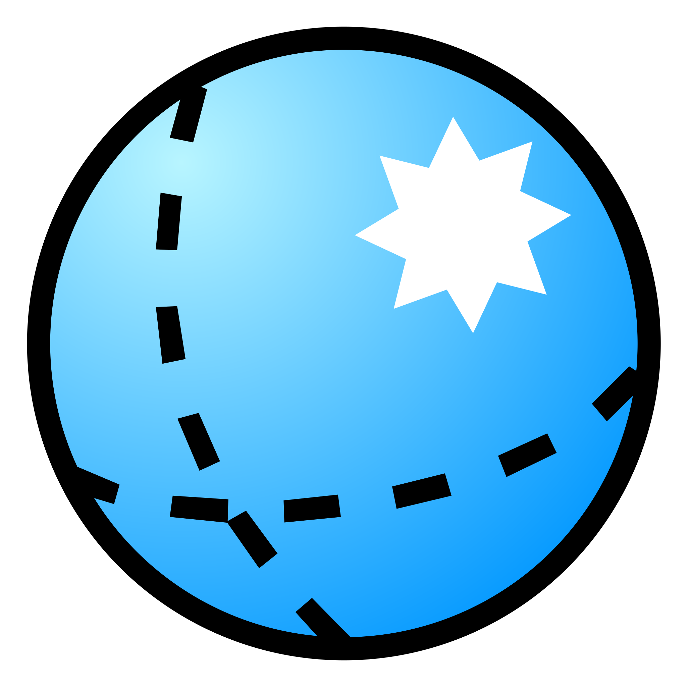 <code>netsurf</code></a></td><td align="center"><a href="../logos/netvisor.svg">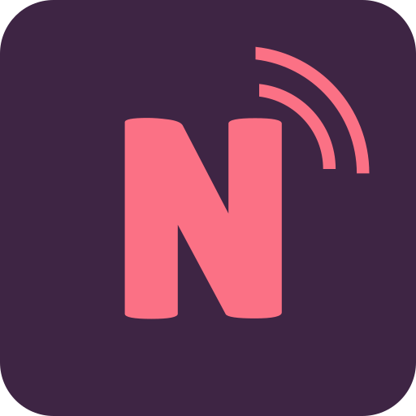 <code>netvisor</code></a></td><td align="center"><a href="../logos/network-ups-tools.svg">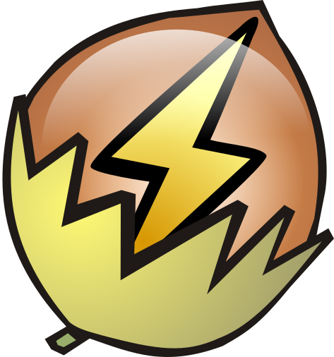 <code>network-ups-tools</code></a></td></tr>
<tr><td align="center"><a href="../logos/networking-toolbox.svg"> <code>networking-toolbox</code></a></td><td align="center"><a href="../logos/new-releases.svg"> <code>new-releases</code></a></td><td align="center"><a href="../logos/newegg.svg"> <code>newegg</code></a></td><td align="center"><a href="../logos/newsblur.svg"> <code>newsblur</code></a></td><td align="center"><a href="../logos/newshosting.svg"> <code>newshosting</code></a></td><td align="center"><a href="../logos/newsku.svg"> <code>newsku</code></a></td></tr>
<tr><td align="center"><a href="../logos/nextbeats.svg"> <code>nextbeats</code></a></td><td align="center"><a href="../logos/nextcloud.svg">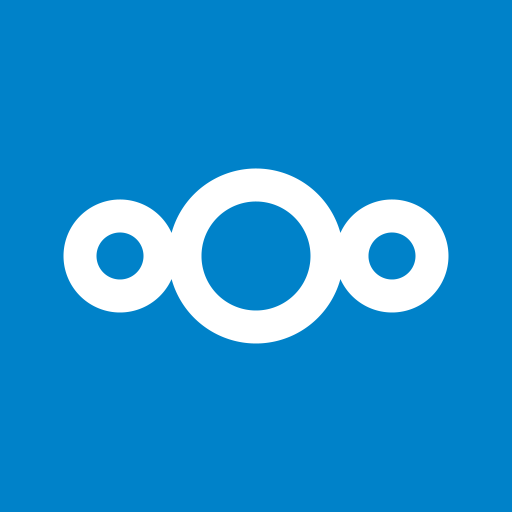 <code>nextcloud</code></a></td><td align="center"><a href="../logos/nextcloud-blue.svg"> <code>nextcloud-blue</code></a></td><td align="center"><a href="../logos/nextcloud-calendar.svg"> <code>nextcloud-calendar</code></a></td><td align="center"><a href="../logos/nextcloud-contacts.svg"> <code>nextcloud-contacts</code></a></td><td align="center"><a href="../logos/nextcloud-cookbook.svg"> <code>nextcloud-cookbook</code></a></td></tr>
<tr><td align="center"><a href="../logos/nextcloud-cospend.svg"> <code>nextcloud-cospend</code></a></td><td align="center"><a href="../logos/nextcloud-deck.svg"> <code>nextcloud-deck</code></a></td><td align="center"><a href="../logos/nextcloud-files.svg"> <code>nextcloud-files</code></a></td><td align="center"><a href="../logos/nextcloud-forms.svg"> <code>nextcloud-forms</code></a></td><td align="center"><a href="../logos/nextcloud-ncdownloader.svg"> <code>nextcloud-ncdownloader</code></a></td><td align="center"><a href="../logos/nextcloud-news.svg">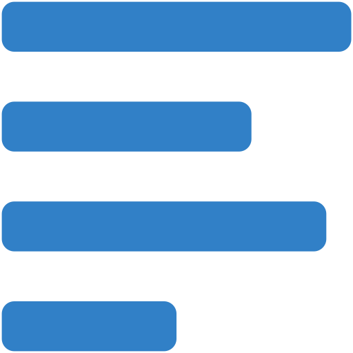 <code>nextcloud-news</code></a></td></tr>
<tr><td align="center"><a href="../logos/nextcloud-notes.svg"> <code>nextcloud-notes</code></a></td><td align="center"><a href="../logos/nextcloud-office.svg"> <code>nextcloud-office</code></a></td><td align="center"><a href="../logos/nextcloud-office-document.svg"> <code>nextcloud-office-document</code></a></td><td align="center"><a href="../logos/nextcloud-office-drawing.svg">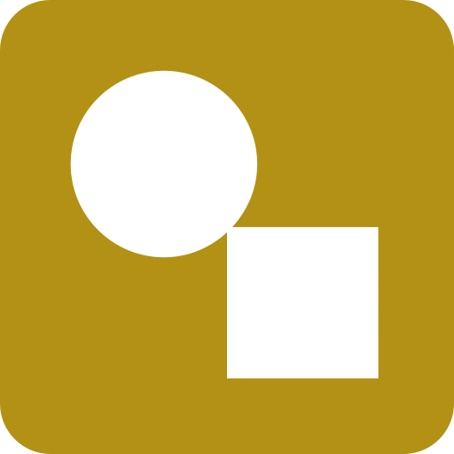 <code>nextcloud-office-drawing</code></a></td><td align="center"><a href="../logos/nextcloud-office-presentation.svg">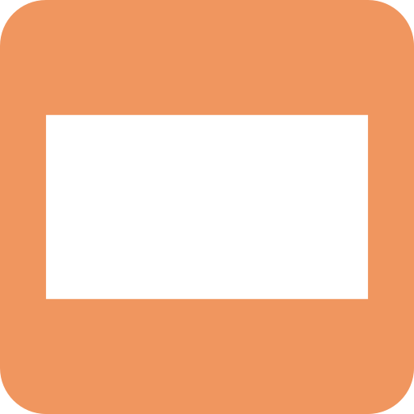 <code>nextcloud-office-presentation</code></a></td><td align="center"><a href="../logos/nextcloud-office-spreadsheet.svg">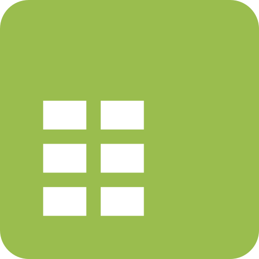 <code>nextcloud-office-spreadsheet</code></a></td></tr>
<tr><td align="center"><a href="../logos/nextcloud-photos.svg"> <code>nextcloud-photos</code></a></td><td align="center"><a href="../logos/nextcloud-tables.svg"> <code>nextcloud-tables</code></a></td><td align="center"><a href="../logos/nextcloud-talk.svg"> <code>nextcloud-talk</code></a></td><td align="center"><a href="../logos/nextcloud-tasks.svg"> <code>nextcloud-tasks</code></a></td><td align="center"><a href="../logos/nextcloud-timemanager.svg"> <code>nextcloud-timemanager</code></a></td><td align="center"><a href="../logos/nextcloud-white.svg"> <code>nextcloud-white</code></a></td></tr>
<tr><td align="center"><a href="../logos/nextcloud-wordmark.svg"> <code>nextcloud-wordmark</code></a></td><td align="center"><a href="../logos/nextcloudpi.svg">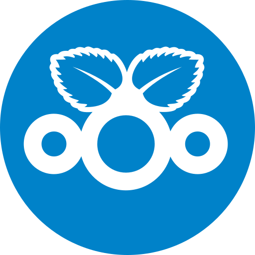 <code>nextcloudpi</code></a></td><td align="center"><a href="../logos/nextdns.svg">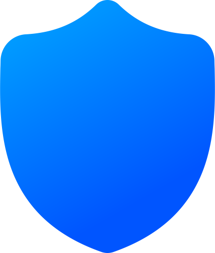 <code>nextdns</code></a></td><td align="center"><a href="../logos/nexterm.svg"> <code>nexterm</code></a></td><td align="center"><a href="../logos/nextexplorer.svg"> <code>nextexplorer</code></a></td><td align="center"><a href="../logos/nextpvr.svg"> <code>nextpvr</code></a></td></tr>
<tr><td align="center"><a href="../logos/nexus.svg"> <code>nexus</code></a></td><td align="center"><a href="../logos/nezha.svg">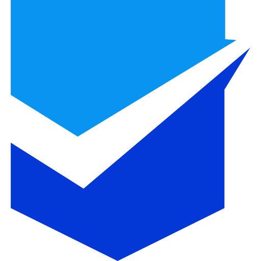 <code>nezha</code></a></td><td align="center"><a href="../logos/nforwardauth.svg"> <code>nforwardauth</code></a></td><td align="center"><a href="../logos/nginx-proxy-manager.svg"> <code>nginx-proxy-manager</code></a></td><td align="center"><a href="../logos/nicotine-plus.svg"> <code>nicotine-plus</code></a></td><td align="center"><a href="../logos/nightlio.svg">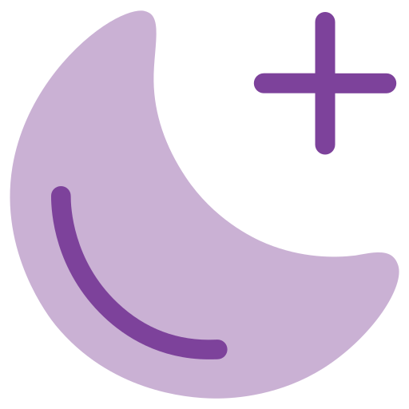 <code>nightlio</code></a></td></tr>
<tr><td align="center"><a href="../logos/nightscout.svg"> <code>nightscout</code></a></td><td align="center"><a href="../logos/nikku.svg"> <code>nikku</code></a></td><td align="center"><a href="../logos/nimtable.svg"> <code>nimtable</code></a></td><td align="center"><a href="../logos/nintendo.svg"> <code>nintendo</code></a></td><td align="center"><a href="../logos/nintendo-switch.svg"> <code>nintendo-switch</code></a></td><td align="center"><a href="../logos/niri.svg"> <code>niri</code></a></td></tr>
<tr><td align="center"><a href="../logos/niri-wordmark.svg"> <code>niri-wordmark</code></a></td><td align="center"><a href="../logos/nirvati.svg">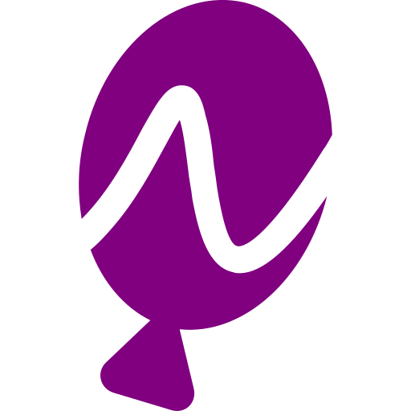 <code>nirvati</code></a></td><td align="center"><a href="../logos/nitter.svg">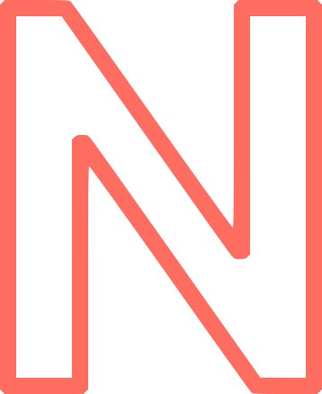 <code>nitter</code></a></td><td align="center"><a href="../logos/njalla.svg">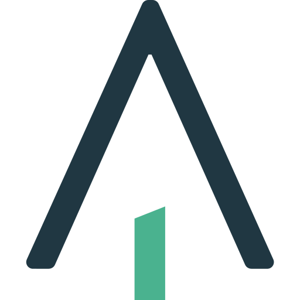 <code>njalla</code></a></td><td align="center"><a href="../logos/nocobase.svg"> <code>nocobase</code></a></td><td align="center"><a href="../logos/node-red.svg"> <code>node-red</code></a></td></tr>
<tr><td align="center"><a href="../logos/nodebb.svg"> <code>nodebb</code></a></td><td align="center"><a href="../logos/nodecosmos.svg">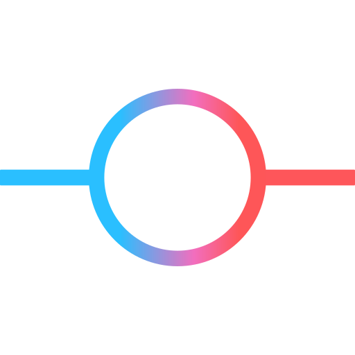 <code>nodecosmos</code></a></td><td align="center"><a href="../logos/nodejs-alt.svg"> <code>nodejs-alt</code></a></td><td align="center"><a href="../logos/nodemailer.svg"> <code>nodemailer</code></a></td><td align="center"><a href="../logos/nodyx.svg">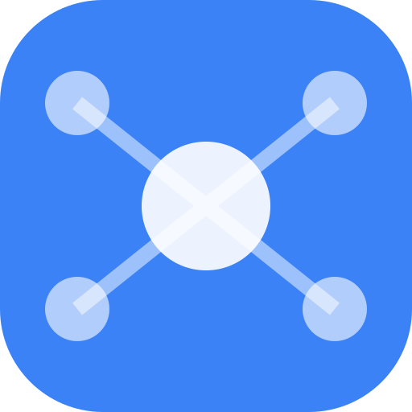 <code>nodyx</code></a></td><td align="center"><a href="../logos/noisedash.svg"> <code>noisedash</code></a></td></tr>
<tr><td align="center"><a href="../logos/nomad-travel.svg"> <code>nomad-travel</code></a></td><td align="center"><a href="../logos/nomie.svg">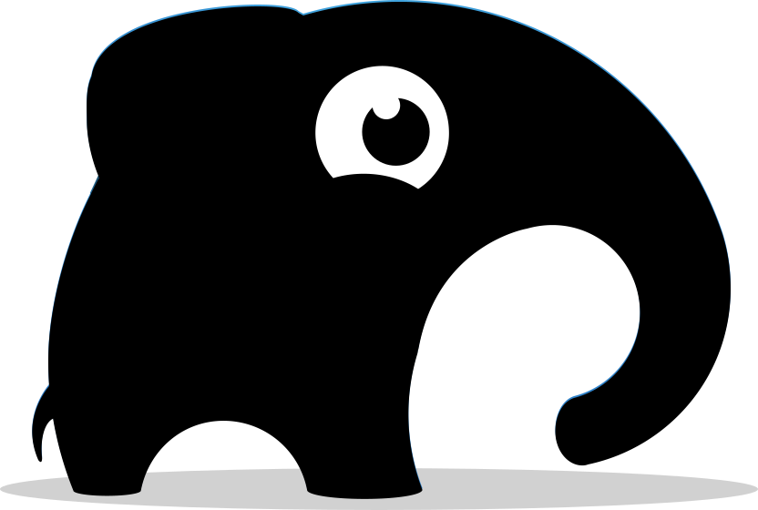 <code>nomie</code></a></td><td align="center"><a href="../logos/noodle-gallery.svg"> <code>noodle-gallery</code></a></td><td align="center"><a href="../logos/norish.svg"> <code>norish</code></a></td><td align="center"><a href="../logos/note-mark.svg"> <code>note-mark</code></a></td><td align="center"><a href="../logos/notebook-lm.svg"> <code>notebook-lm</code></a></td></tr>
<tr><td align="center"><a href="../logos/notediscovery.svg"> <code>notediscovery</code></a></td><td align="center"><a href="../logos/notesnook.svg"> <code>notesnook</code></a></td><td align="center"><a href="../logos/notifiarr.svg">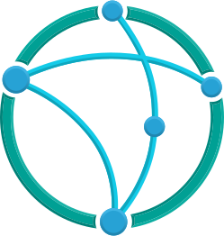 <code>notifiarr</code></a></td><td align="center"><a href="../logos/notifuse.svg">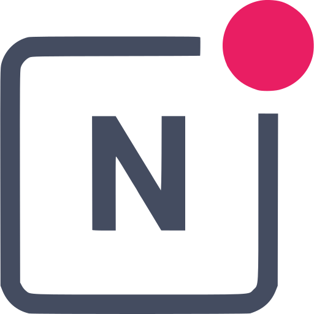 <code>notifuse</code></a></td><td align="center"><a href="../logos/notion.svg"> <code>notion</code></a></td><td align="center"><a href="../logos/notion-calendar.svg"> <code>notion-calendar</code></a></td></tr>
<tr><td align="center"><a href="../logos/notion-wordmark.svg"> <code>notion-wordmark</code></a></td><td align="center"><a href="../logos/noton.svg"> <code>noton</code></a></td><td align="center"><a href="../logos/novnc.svg"> <code>novnc</code></a></td><td align="center"><a href="../logos/npr-one.svg"> <code>npr-one</code></a></td><td align="center"><a href="../logos/nps-enhanced.svg"> <code>nps-enhanced</code></a></td><td align="center"><a href="../logos/nrk-logo.svg"> <code>nrk-logo</code></a></td></tr>
<tr><td align="center"><a href="../logos/nsg.svg"> <code>nsg</code></a></td><td align="center"><a href="../logos/ntfy.svg"> <code>ntfy</code></a></td><td align="center"><a href="../logos/nu-nl.svg"> <code>nu-nl</code></a></td><td align="center"><a href="../logos/nuclino.svg"> <code>nuclino</code></a></td><td align="center"><a href="../logos/nummo.svg">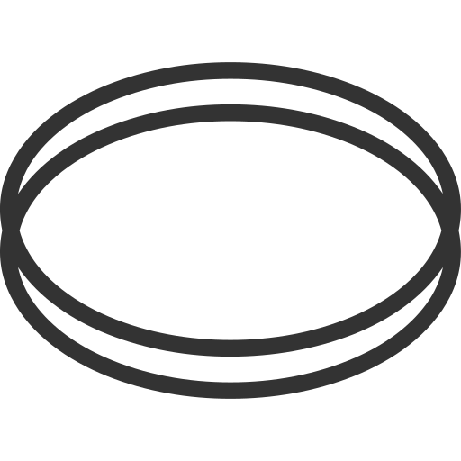 <code>nummo</code></a></td><td align="center"><a href="../logos/nut.svg">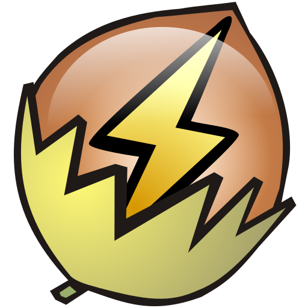 <code>nut</code></a></td></tr>
<tr><td align="center"><a href="../logos/nutalert.svg"> <code>nutalert</code></a></td><td align="center"><a href="../logos/nutanix.svg"> <code>nutanix</code></a></td><td align="center"><a href="../logos/nutritrace.svg"> <code>nutritrace</code></a></td><td align="center"><a href="../logos/nuxt-js-wordmark.svg"> <code>nuxt-js-wordmark</code></a></td><td align="center"><a href="../logos/nx-witness.svg"> <code>nx-witness</code></a></td><td align="center"><a href="../logos/nyt-connections.svg">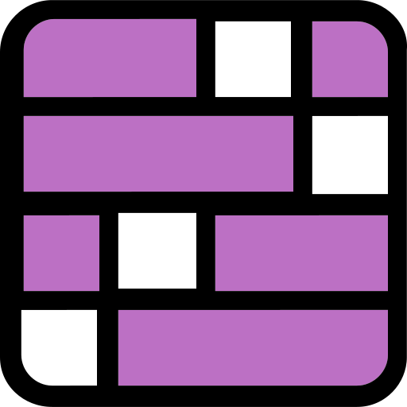 <code>nyt-connections</code></a></td></tr>
<tr><td align="center"><a href="../logos/nyt-crossword.svg"> <code>nyt-crossword</code></a></td><td align="center"><a href="../logos/nyt-letter-boxed.svg">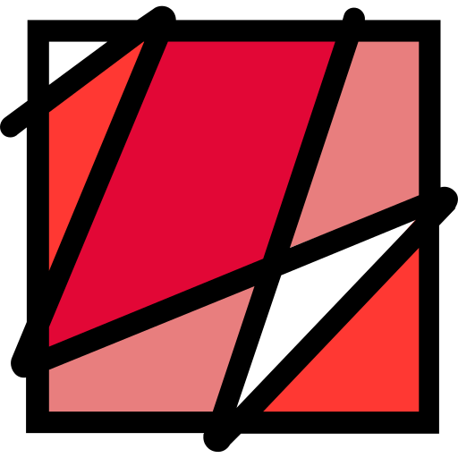 <code>nyt-letter-boxed</code></a></td><td align="center"><a href="../logos/nyt-mini-crossword.svg">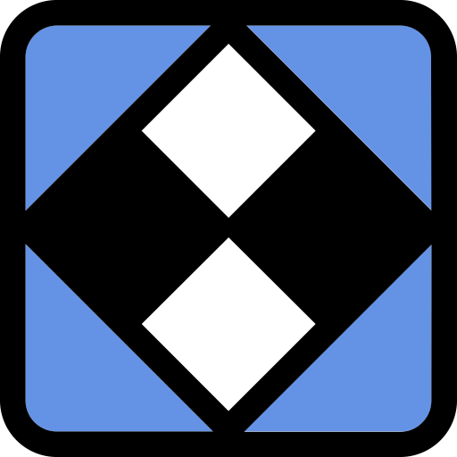 <code>nyt-mini-crossword</code></a></td><td align="center"><a href="../logos/nyt-spelling-bee.svg">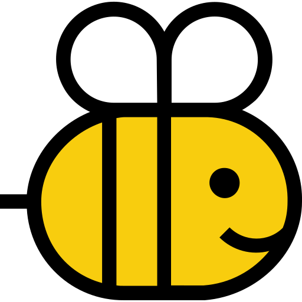 <code>nyt-spelling-bee</code></a></td><td align="center"><a href="../logos/nyt-strands.svg">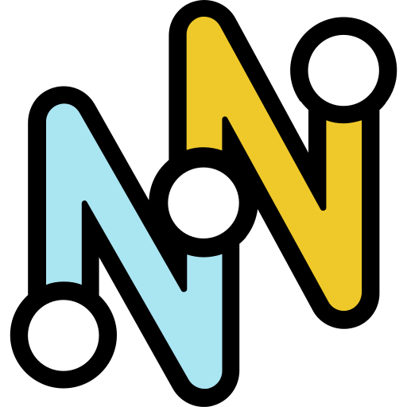 <code>nyt-strands</code></a></td><td align="center"><a href="../logos/nyt-sudoku.svg">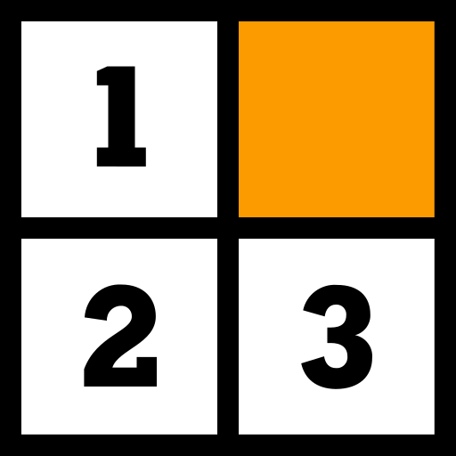 <code>nyt-sudoku</code></a></td></tr>
<tr><td align="center"><a href="../logos/nyt-tiles.svg">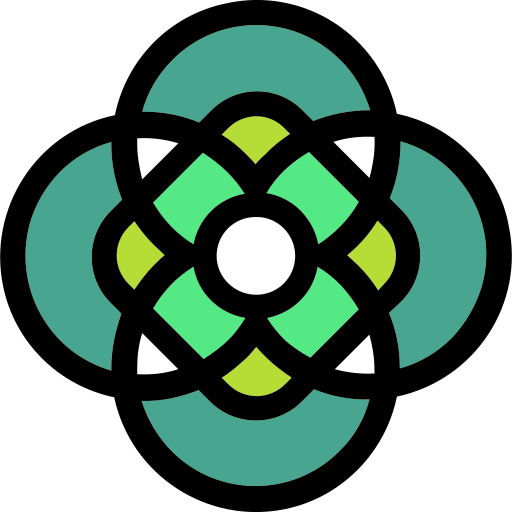 <code>nyt-tiles</code></a></td><td align="center"><a href="../logos/nyt-wordle.svg"> <code>nyt-wordle</code></a></td><td align="center"><a href="../logos/nzbdav.svg"> <code>nzbdav</code></a></td><td align="center"><a href="../logos/nzbget.svg"> <code>nzbget</code></a></td><td align="center"><a href="../logos/nzbhydra2.svg">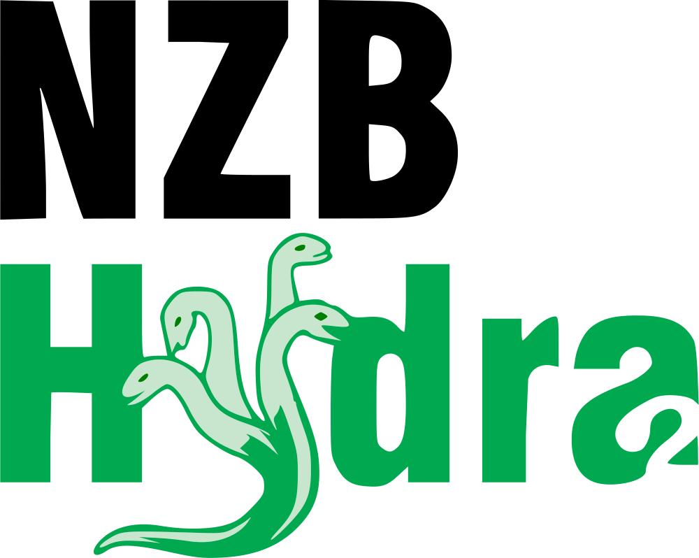 <code>nzbhydra2</code></a></td><td align="center"><a href="../logos/oak-homepage.svg"> <code>oak-homepage</code></a></td></tr>
<tr><td align="center"><a href="../logos/oak-identity.svg"> <code>oak-identity</code></a></td><td align="center"><a href="../logos/oauth2-proxy.svg"> <code>oauth2-proxy</code></a></td><td align="center"><a href="../logos/obico.svg">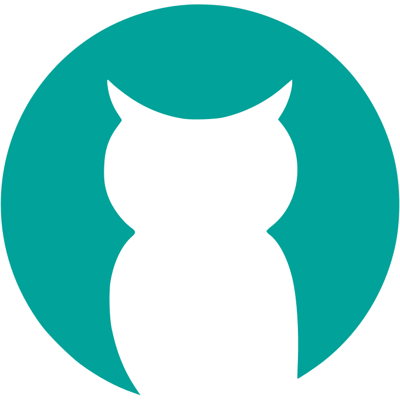 <code>obico</code></a></td><td align="center"><a href="../logos/obs-bygg.svg"> <code>obs-bygg</code></a></td><td align="center"><a href="../logos/obsidian.svg">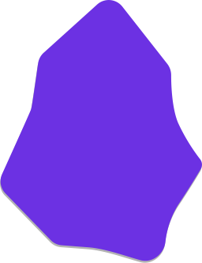 <code>obsidian</code></a></td><td align="center"><a href="../logos/obsidian-wordmark.svg"> <code>obsidian-wordmark</code></a></td></tr>
<tr><td align="center"><a href="../logos/obtainium.svg"> <code>obtainium</code></a></td><td align="center"><a href="../logos/octelium.svg">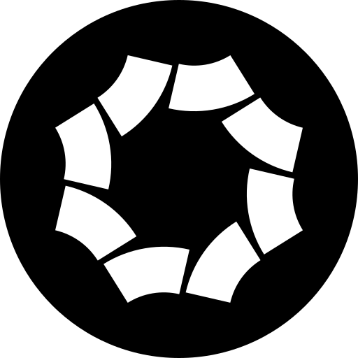 <code>octelium</code></a></td><td align="center"><a href="../logos/octobot.svg"> <code>octobot</code></a></td><td align="center"><a href="../logos/octoprint.svg"> <code>octoprint</code></a></td><td align="center"><a href="../logos/ocular.svg"> <code>ocular</code></a></td><td align="center"><a href="../logos/oculus.svg"> <code>oculus</code></a></td></tr>
<tr><td align="center"><a href="../logos/odoo.svg"> <code>odoo</code></a></td><td align="center"><a href="../logos/odysee.svg"> <code>odysee</code></a></td><td align="center"><a href="../logos/odysee-full.svg"> <code>odysee-full</code></a></td><td align="center"><a href="../logos/odysseus.svg"> <code>odysseus</code></a></td><td align="center"><a href="../logos/oepnvmap.svg"> <code>oepnvmap</code></a></td><td align="center"><a href="../logos/office-365.svg"> <code>office-365</code></a></td></tr>
<tr><td align="center"><a href="../logos/office-eu.svg"> <code>office-eu</code></a></td><td align="center"><a href="../logos/office-eu-wordmark.svg"> <code>office-eu-wordmark</code></a></td><td align="center"><a href="../logos/oh-my-posh.svg"> <code>oh-my-posh</code></a></td><td align="center"><a href="../logos/oikos.svg">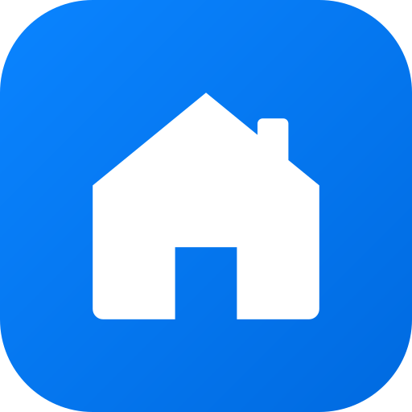 <code>oikos</code></a></td><td align="center"><a href="../logos/old-navy.svg"> <code>old-navy</code></a></td><td align="center"><a href="../logos/olivetin.svg">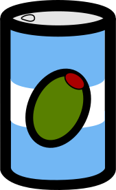 <code>olivetin</code></a></td></tr>
<tr><td align="center"><a href="../logos/omada.svg"> <code>omada</code></a></td><td align="center"><a href="../logos/ombi.svg"> <code>ombi</code></a></td><td align="center"><a href="../logos/omnic-forge.svg">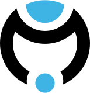 <code>omnic-forge</code></a></td><td align="center"><a href="../logos/omnidb.svg"> <code>omnidb</code></a></td><td align="center"><a href="../logos/omnipoly.svg"> <code>omnipoly</code></a></td><td align="center"><a href="../logos/omnivore.svg"> <code>omnivore</code></a></td></tr>
<tr><td align="center"><a href="../logos/omnom.svg"> <code>omnom</code></a></td><td align="center"><a href="../logos/one-hub.svg"> <code>one-hub</code></a></td><td align="center"><a href="../logos/onedev.svg"> <code>onedev</code></a></td><td align="center"><a href="../logos/onetime-secret.svg"> <code>onetime-secret</code></a></td><td align="center"><a href="../logos/oneuptime.svg"> <code>oneuptime</code></a></td><td align="center"><a href="../logos/onlyfans.svg">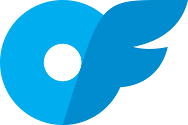 <code>onlyfans</code></a></td></tr>
<tr><td align="center"><a href="../logos/onlyoffice.svg"> <code>onlyoffice</code></a></td><td align="center"><a href="../logos/onshape.svg"> <code>onshape</code></a></td><td align="center"><a href="../logos/onskeskyen.svg">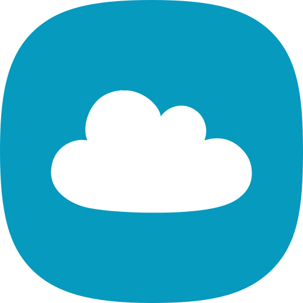 <code>onskeskyen</code></a></td><td align="center"><a href="../logos/ontime.svg">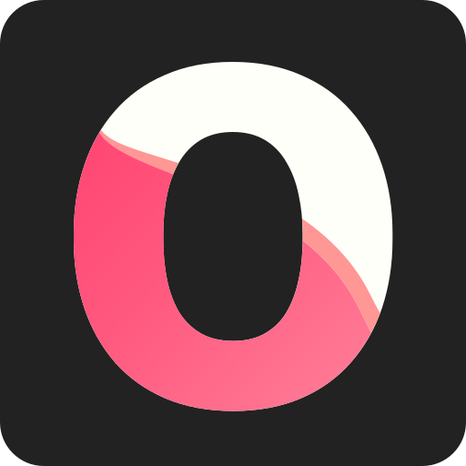 <code>ontime</code></a></td><td align="center"><a href="../logos/onwatch.svg">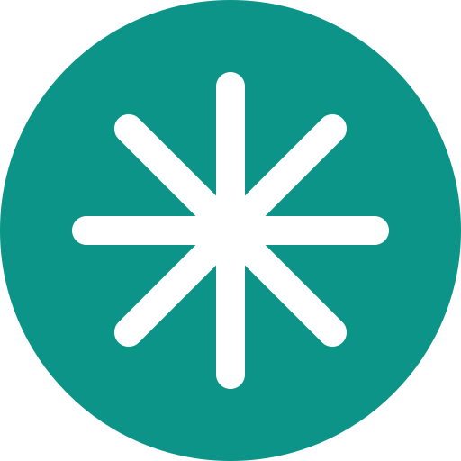 <code>onwatch</code></a></td><td align="center"><a href="../logos/onyka.svg">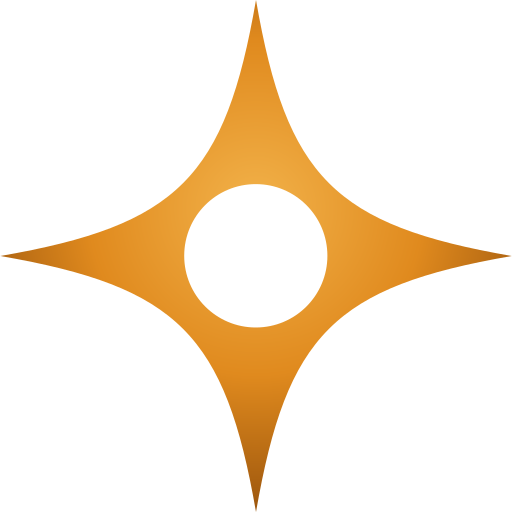 <code>onyka</code></a></td></tr>
<tr><td align="center"><a href="../logos/onyx.svg"> <code>onyx</code></a></td><td align="center"><a href="../logos/ookla-speedtest.svg"> <code>ookla-speedtest</code></a></td><td align="center"><a href="../logos/open-central-control-unit.svg"> <code>open-central-control-unit</code></a></td><td align="center"><a href="../logos/open-classrooms.svg"> <code>open-classrooms</code></a></td><td align="center"><a href="../logos/open-dronelog.svg">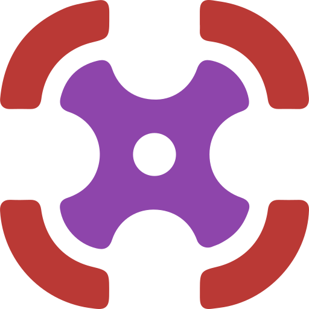 <code>open-dronelog</code></a></td><td align="center"><a href="../logos/open-notebook.svg"> <code>open-notebook</code></a></td></tr>
<tr><td align="center"><a href="../logos/open-observe.svg">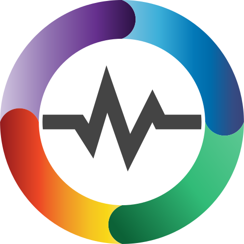 <code>open-observe</code></a></td><td align="center"><a href="../logos/open-regex.svg"> <code>open-regex</code></a></td><td align="center"><a href="../logos/open-resume.svg">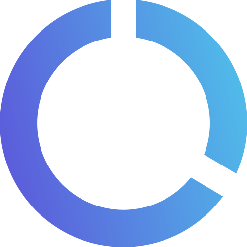 <code>open-resume</code></a></td><td align="center"><a href="../logos/open-source-initiative.svg"> <code>open-source-initiative</code></a></td><td align="center"><a href="../logos/open-wb.svg">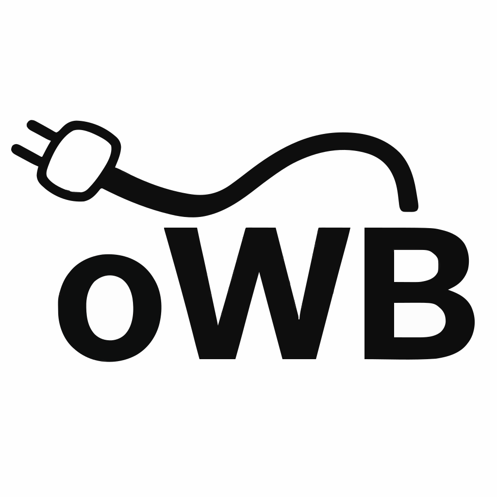 <code>open-wb</code></a></td><td align="center"><a href="../logos/openadserver.svg">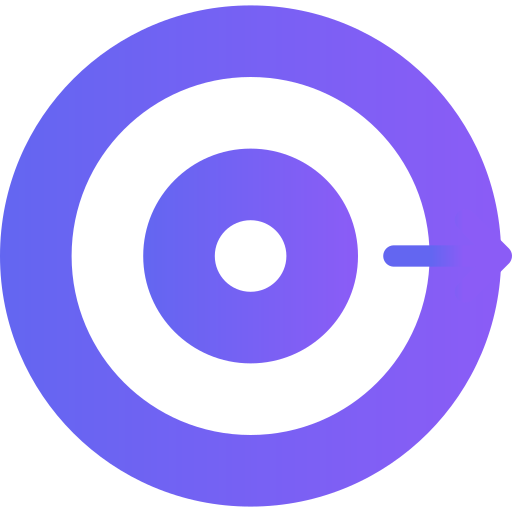 <code>openadserver</code></a></td></tr>
<tr><td align="center"><a href="../logos/openbao.svg">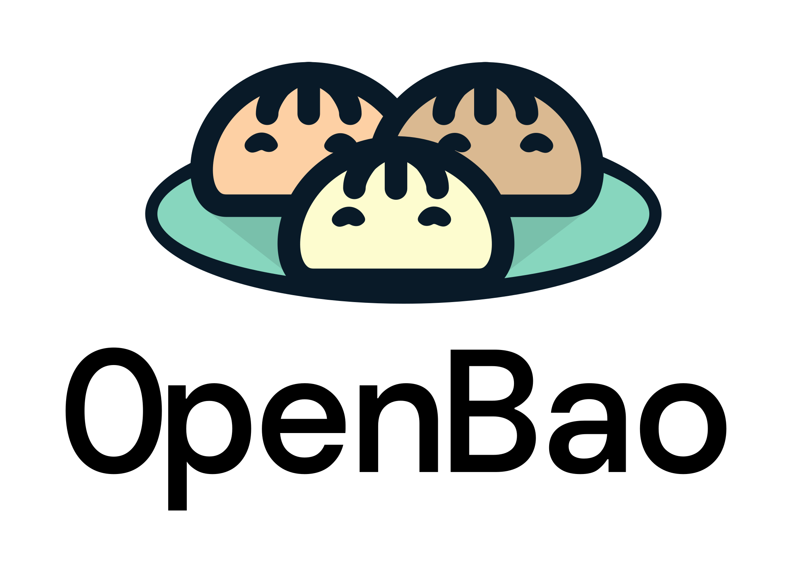 <code>openbao</code></a></td><td align="center"><a href="../logos/openbooks.svg">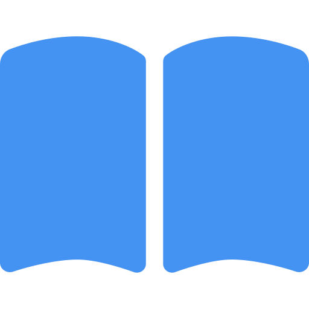 <code>openbooks</code></a></td><td align="center"><a href="../logos/openccu.svg"> <code>openccu</code></a></td><td align="center"><a href="../logos/openchangelog.svg"> <code>openchangelog</code></a></td><td align="center"><a href="../logos/openclaw-wordmark.svg"> <code>openclaw-wordmark</code></a></td><td align="center"><a href="../logos/opencost.svg"> <code>opencost</code></a></td></tr>
<tr><td align="center"><a href="../logos/opencut.svg"> <code>opencut</code></a></td><td align="center"><a href="../logos/openeats.svg"> <code>openeats</code></a></td><td align="center"><a href="../logos/openemr.svg"> <code>openemr</code></a></td><td align="center"><a href="../logos/openeuler.svg">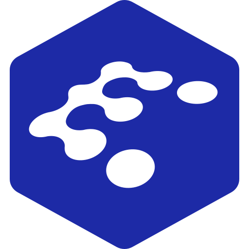 <code>openeuler</code></a></td><td align="center"><a href="../logos/opengist.svg"> <code>opengist</code></a></td><td align="center"><a href="../logos/opengrammar.svg"> <code>opengrammar</code></a></td></tr>
<tr><td align="center"><a href="../logos/openhab.svg"> <code>openhab</code></a></td><td align="center"><a href="../logos/openhands.svg"> <code>openhands</code></a></td><td align="center"><a href="../logos/openldap.svg">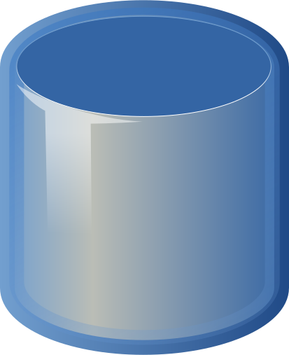 <code>openldap</code></a></td><td align="center"><a href="../logos/openleaf.svg"> <code>openleaf</code></a></td><td align="center"><a href="../logos/openlist.svg"> <code>openlist</code></a></td><td align="center"><a href="../logos/openmediavault.svg"> <code>openmediavault</code></a></td></tr>
<tr><td align="center"><a href="../logos/openpanel.svg"> <code>openpanel</code></a></td><td align="center"><a href="../logos/openprinting-cups.svg">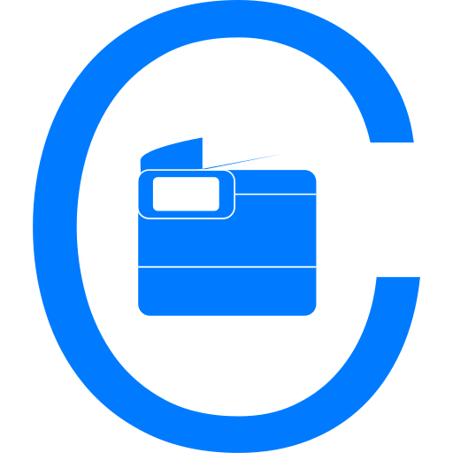 <code>openprinting-cups</code></a></td><td align="center"><a href="../logos/openproject.svg"> <code>openproject</code></a></td><td align="center"><a href="../logos/openreads.svg"> <code>openreads</code></a></td><td align="center"><a href="../logos/openspeedtest.svg"> <code>openspeedtest</code></a></td><td align="center"><a href="../logos/opensuse.svg"> <code>opensuse</code></a></td></tr>
<tr><td align="center"><a href="../logos/opensuse-alp.svg"> <code>opensuse-alp</code></a></td><td align="center"><a href="../logos/opensuse-evergreen.svg">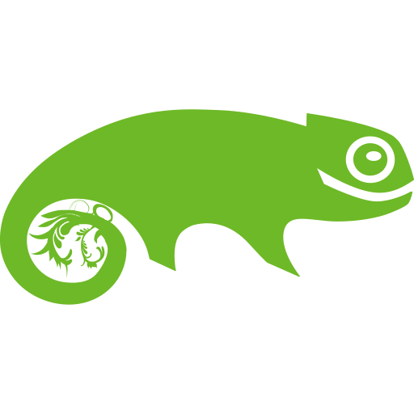 <code>opensuse-evergreen</code></a></td><td align="center"><a href="../logos/opensuse-leap.svg"> <code>opensuse-leap</code></a></td><td align="center"><a href="../logos/opensuse-step.svg"> <code>opensuse-step</code></a></td><td align="center"><a href="../logos/opensuse-tumbleweed.svg"> <code>opensuse-tumbleweed</code></a></td><td align="center"><a href="../logos/opentalk.svg"> <code>opentalk</code></a></td></tr>
<tr><td align="center"><a href="../logos/openttd.svg">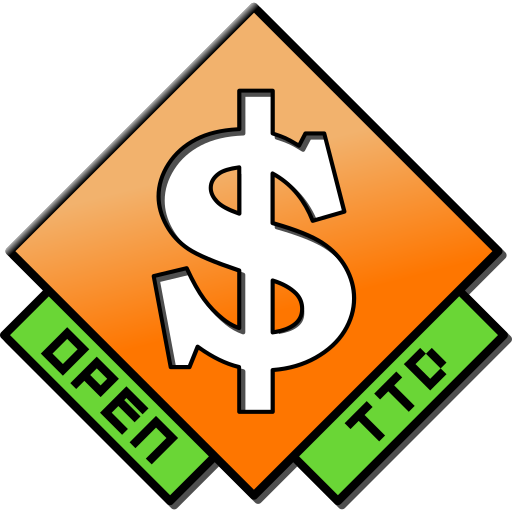 <code>openttd</code></a></td><td align="center"><a href="../logos/openuem.svg"> <code>openuem</code></a></td><td align="center"><a href="../logos/openvas.svg"> <code>openvas</code></a></td><td align="center"><a href="../logos/openwa.svg">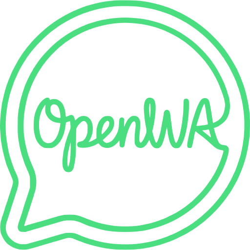 <code>openwa</code></a></td><td align="center"><a href="../logos/openwebrx-plus.svg">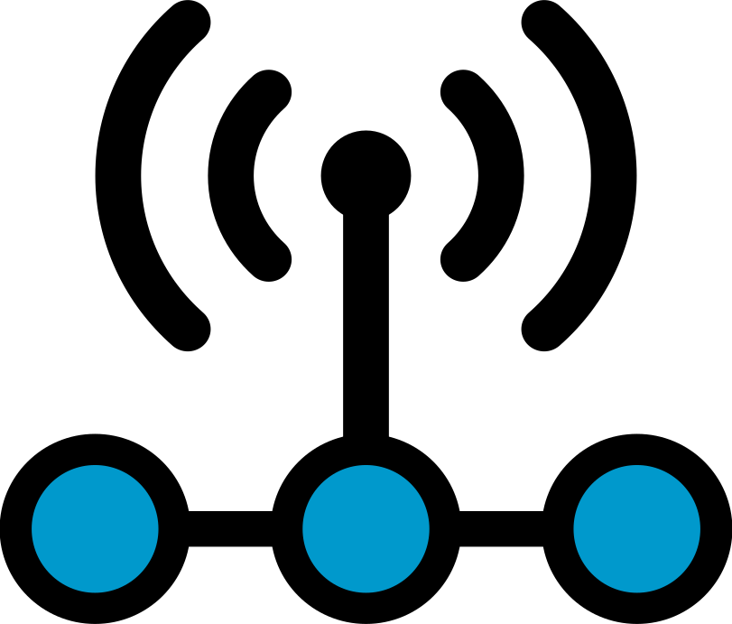 <code>openwebrx-plus</code></a></td><td align="center"><a href="../logos/openwrt.svg"> <code>openwrt</code></a></td></tr>
<tr><td align="center"><a href="../logos/openziti.svg">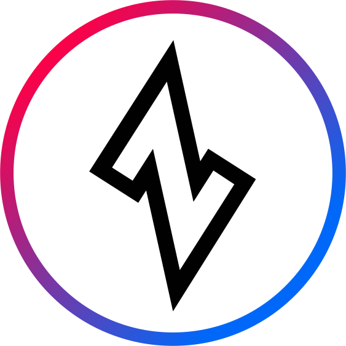 <code>openziti</code></a></td><td align="center"><a href="../logos/opera-touch.svg"> <code>opera-touch</code></a></td><td align="center"><a href="../logos/operately.svg">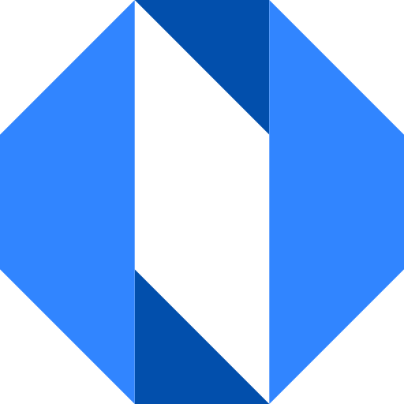 <code>operately</code></a></td><td align="center"><a href="../logos/operational.svg"> <code>operational</code></a></td><td align="center"><a href="../logos/opnform.svg">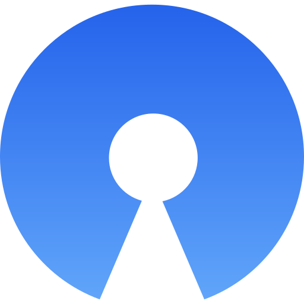 <code>opnform</code></a></td><td align="center"><a href="../logos/opnsense-v1.svg">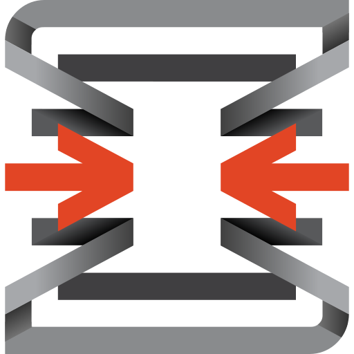 <code>opnsense-v1</code></a></td></tr>
<tr><td align="center"><a href="../logos/optistack.svg"> <code>optistack</code></a></td><td align="center"><a href="../logos/oracle-apex.svg"> <code>oracle-apex</code></a></td><td align="center"><a href="../logos/orange.svg"> <code>orange</code></a></td><td align="center"><a href="../logos/orange-isp.svg">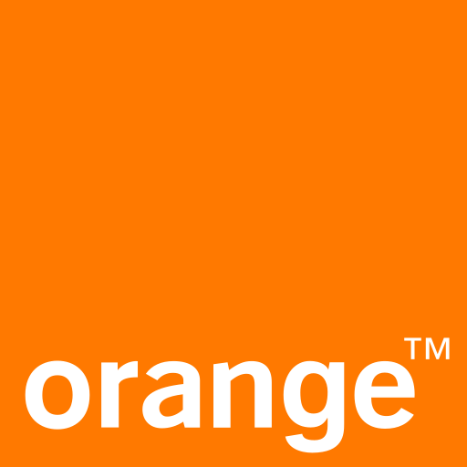 <code>orange-isp</code></a></td><td align="center"><a href="../logos/orb.svg"> <code>orb</code></a></td><td align="center"><a href="../logos/orca-slicer.svg">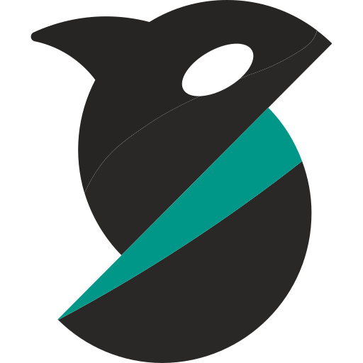 <code>orca-slicer</code></a></td></tr>
<tr><td align="center"><a href="../logos/origamivault.svg"> <code>origamivault</code></a></td><td align="center"><a href="../logos/oscarr.svg"> <code>oscarr</code></a></td><td align="center"><a href="../logos/osmand.svg"> <code>osmand</code></a></td><td align="center"><a href="../logos/osmapp.svg"> <code>osmapp</code></a></td><td align="center"><a href="../logos/osticket.svg"> <code>osticket</code></a></td><td align="center"><a href="../logos/osu.svg"> <code>osu</code></a></td></tr>
<tr><td align="center"><a href="../logos/ots.svg"> <code>ots</code></a></td><td align="center"><a href="../logos/otter-wiki.svg"> <code>otter-wiki</code></a></td><td align="center"><a href="../logos/our-shopping-list.svg"> <code>our-shopping-list</code></a></td><td align="center"><a href="../logos/ourschool.svg"> <code>ourschool</code></a></td><td align="center"><a href="../logos/outline.svg"> <code>outline</code></a></td><td align="center"><a href="../logos/outlook.svg"> <code>outlook</code></a></td></tr>
<tr><td align="center"><a href="../logos/overleaf.svg"> <code>overleaf</code></a></td><td align="center"><a href="../logos/overseerr.svg">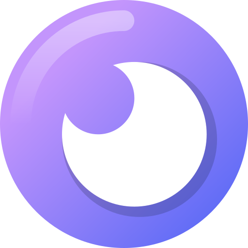 <code>overseerr</code></a></td><td align="center"><a href="../logos/ovh.svg"> <code>ovh</code></a></td><td align="center"><a href="../logos/ovirt.svg"> <code>ovirt</code></a></td><td align="center"><a href="../logos/owlistic.svg"> <code>owlistic</code></a></td><td align="center"><a href="../logos/owncast.svg"> <code>owncast</code></a></td></tr>
<tr><td align="center"><a href="../logos/ownfoil.svg"> <code>ownfoil</code></a></td><td align="center"><a href="../logos/owntone.svg"> <code>owntone</code></a></td><td align="center"><a href="../logos/owntracks.svg"> <code>owntracks</code></a></td><td align="center"><a href="../logos/oxicloud.svg"> <code>oxicloud</code></a></td><td align="center"><a href="../logos/oxker.svg">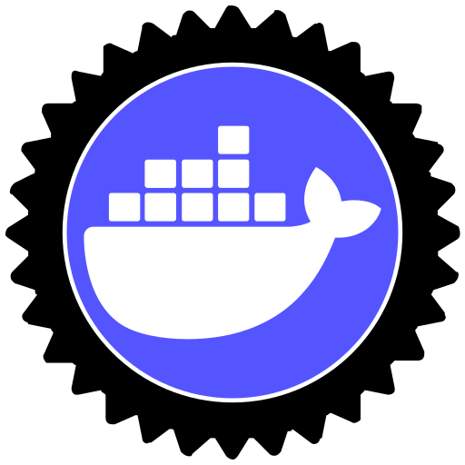 <code>oxker</code></a></td><td align="center"><a href="../logos/p-cal.svg"> <code>p-cal</code></a></td></tr>
<tr><td align="center"><a href="../logos/p1ib.svg">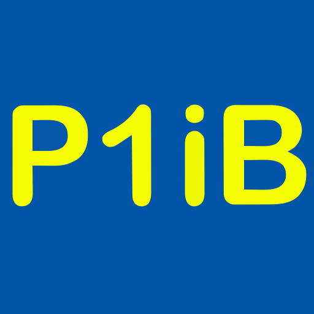 <code>p1ib</code></a></td><td align="center"><a href="../logos/packetfence.svg"> <code>packetfence</code></a></td><td align="center"><a href="../logos/packetfence-full.svg"> <code>packetfence-full</code></a></td><td align="center"><a href="../logos/pairdrop.svg"> <code>pairdrop</code></a></td><td align="center"><a href="../logos/palemoon.svg">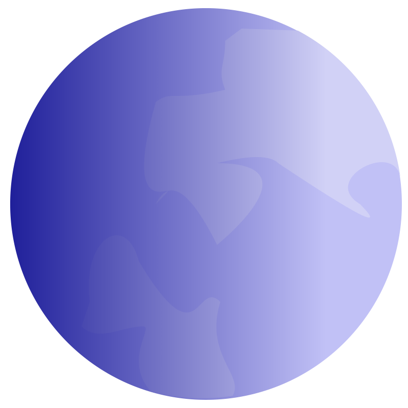 <code>palemoon</code></a></td><td align="center"><a href="../logos/palmr.svg"> <code>palmr</code></a></td></tr>
<tr><td align="center"><a href="../logos/palo-alto.svg"> <code>palo-alto</code></a></td><td align="center"><a href="../logos/pango.svg"> <code>pango</code></a></td><td align="center"><a href="../logos/pangolin.svg">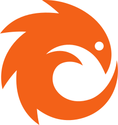 <code>pangolin</code></a></td><td align="center"><a href="../logos/paperless.svg"> <code>paperless</code></a></td><td align="center"><a href="../logos/paperless-home.svg"> <code>paperless-home</code></a></td><td align="center"><a href="../logos/paperless-ng.svg"> <code>paperless-ng</code></a></td></tr>
<tr><td align="center"><a href="../logos/paperless-ngx.svg"> <code>paperless-ngx</code></a></td><td align="center"><a href="../logos/papermark.svg"> <code>papermark</code></a></td><td align="center"><a href="../logos/papermc.svg"> <code>papermc</code></a></td><td align="center"><a href="../logos/papermc-folia.svg"> <code>papermc-folia</code></a></td><td align="center"><a href="../logos/papermc-paper.svg"> <code>papermc-paper</code></a></td><td align="center"><a href="../logos/papermc-velocity.svg"> <code>papermc-velocity</code></a></td></tr>
<tr><td align="center"><a href="../logos/papermerge.svg"> <code>papermerge</code></a></td><td align="center"><a href="../logos/papra.svg"> <code>papra</code></a></td><td align="center"><a href="../logos/paramount-plus.svg"> <code>paramount-plus</code></a></td><td align="center"><a href="../logos/parseable.svg"> <code>parseable</code></a></td><td align="center"><a href="../logos/partkeepr.svg"> <code>partkeepr</code></a></td><td align="center"><a href="../logos/passwork.svg"> <code>passwork</code></a></td></tr>
<tr><td align="center"><a href="../logos/pastebin.svg"> <code>pastebin</code></a></td><td align="center"><a href="../logos/pastefy.svg">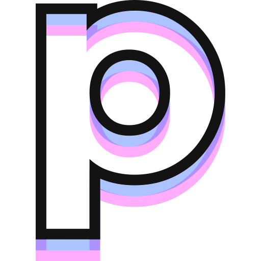 <code>pastefy</code></a></td><td align="center"><a href="../logos/patchmon.svg">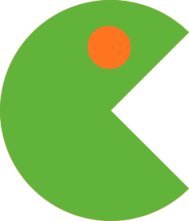 <code>patchmon</code></a></td><td align="center"><a href="../logos/paymenter.svg"> <code>paymenter</code></a></td><td align="center"><a href="../logos/payram.svg">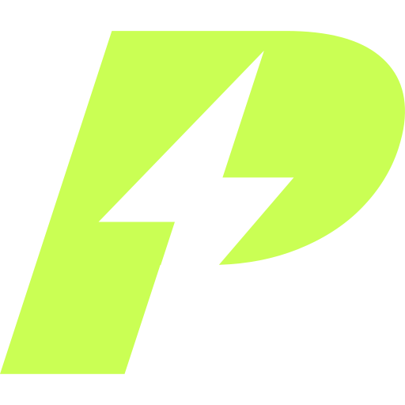 <code>payram</code></a></td><td align="center"><a href="../logos/pdf24.svg"> <code>pdf24</code></a></td></tr>
<tr><td align="center"><a href="../logos/pdfcraft.svg"> <code>pdfcraft</code></a></td><td align="center"><a href="../logos/pdfding.svg"> <code>pdfding</code></a></td><td align="center"><a href="../logos/pdfmathtranslate.svg"> <code>pdfmathtranslate</code></a></td><td align="center"><a href="../logos/peacock.svg">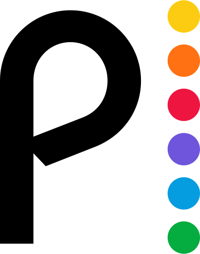 <code>peacock</code></a></td><td align="center"><a href="../logos/peanut.svg"> <code>peanut</code></a></td><td align="center"><a href="../logos/peer-calls.svg"> <code>peer-calls</code></a></td></tr>
<tr><td align="center"><a href="../logos/pelican-panel.svg"> <code>pelican-panel</code></a></td><td align="center"><a href="../logos/penn-state-nittany-lions.svg"> <code>penn-state-nittany-lions</code></a></td><td align="center"><a href="../logos/pent-no.svg"> <code>pent-no</code></a></td><td align="center"><a href="../logos/peppermint.svg"> <code>peppermint</code></a></td><td align="center"><a href="../logos/pepperminty-wiki.svg"> <code>pepperminty-wiki</code></a></td><td align="center"><a href="../logos/pepperstone.svg"> <code>pepperstone</code></a></td></tr>
<tr><td align="center"><a href="../logos/pequeroku.svg"> <code>pequeroku</code></a></td><td align="center"><a href="../logos/perfice.svg"> <code>perfice</code></a></td><td align="center"><a href="../logos/perlite.svg"> <code>perlite</code></a></td><td align="center"><a href="../logos/personal-management-system.svg"> <code>personal-management-system</code></a></td><td align="center"><a href="../logos/perspective.svg"> <code>perspective</code></a></td><td align="center"><a href="../logos/perspective-wordmark.svg"> <code>perspective-wordmark</code></a></td></tr>
<tr><td align="center"><a href="../logos/pf2etools.svg"> <code>pf2etools</code></a></td><td align="center"><a href="../logos/pg-back-web.svg">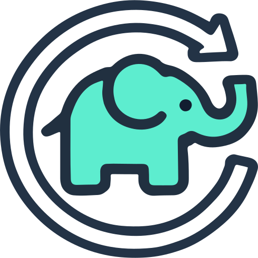 <code>pg-back-web</code></a></td><td align="center"><a href="../logos/pgadmin.svg"> <code>pgadmin</code></a></td><td align="center"><a href="../logos/pgbackweb.svg"> <code>pgbackweb</code></a></td><td align="center"><a href="../logos/phanpy.svg"> <code>phanpy</code></a></td><td align="center"><a href="../logos/phase.svg"> <code>phase</code></a></td></tr>
<tr><td align="center"><a href="../logos/phice.svg">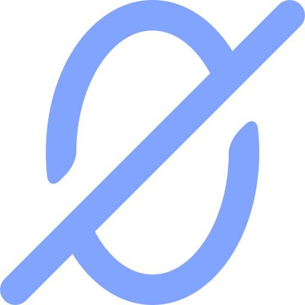 <code>phice</code></a></td><td align="center"><a href="../logos/phoneinfoga.svg"> <code>phoneinfoga</code></a></td><td align="center"><a href="../logos/phorge.svg"> <code>phorge</code></a></td><td align="center"><a href="../logos/phoscon.svg"> <code>phoscon</code></a></td><td align="center"><a href="../logos/photonix.svg"> <code>photonix</code></a></td><td align="center"><a href="../logos/photoprism.svg">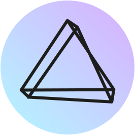 <code>photoprism</code></a></td></tr>
<tr><td align="center"><a href="../logos/photoshop-camera.svg"> <code>photoshop-camera</code></a></td><td align="center"><a href="../logos/photoshop-elements.svg"> <code>photoshop-elements</code></a></td><td align="center"><a href="../logos/photoshop-express.svg"> <code>photoshop-express</code></a></td><td align="center"><a href="../logos/photostructure.svg"> <code>photostructure</code></a></td><td align="center"><a href="../logos/phpsysinfo.svg"> <code>phpsysinfo</code></a></td><td align="center"><a href="../logos/phylum.svg"> <code>phylum</code></a></td></tr>
<tr><td align="center"><a href="../logos/pi-alert.svg">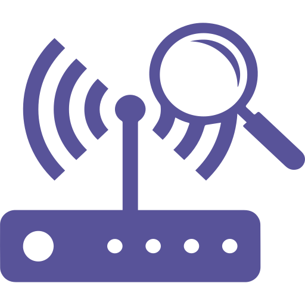 <code>pi-alert</code></a></td><td align="center"><a href="../logos/pi-coding-agent.svg"> <code>pi-coding-agent</code></a></td><td align="center"><a href="../logos/pi-hole.svg">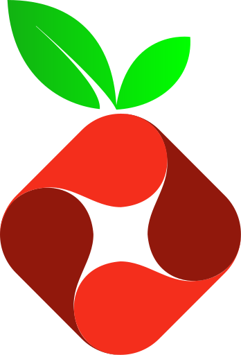 <code>pi-hole</code></a></td><td align="center"><a href="../logos/pi-source.svg">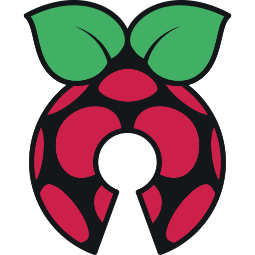 <code>pi-source</code></a></td><td align="center"><a href="../logos/pia.svg"> <code>pia</code></a></td><td align="center"><a href="../logos/pico.svg">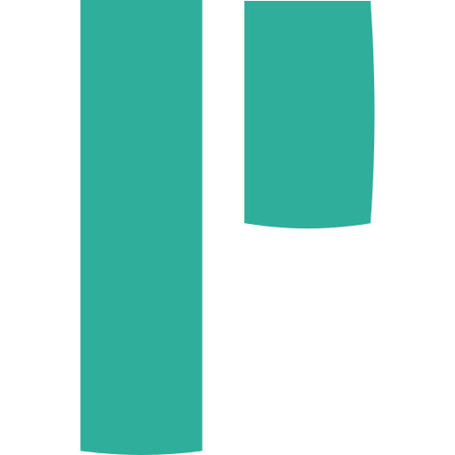 <code>pico</code></a></td></tr>
<tr><td align="center"><a href="../logos/pico-pixel-player.svg"> <code>pico-pixel-player</code></a></td><td align="center"><a href="../logos/pico-sh.svg"> <code>pico-sh</code></a></td><td align="center"><a href="../logos/picoshare.svg">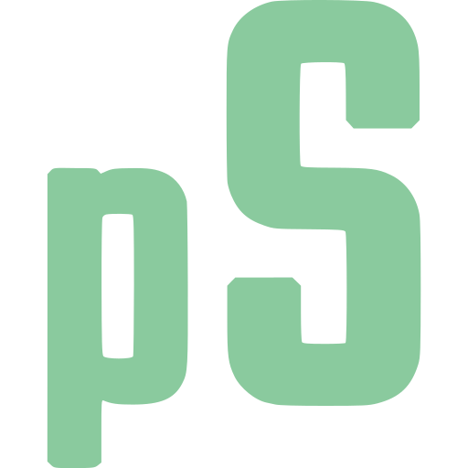 <code>picoshare</code></a></td><td align="center"><a href="../logos/picpeak.svg"> <code>picpeak</code></a></td><td align="center"><a href="../logos/picsur.svg"> <code>picsur</code></a></td><td align="center"><a href="../logos/piefed.svg"> <code>piefed</code></a></td></tr>
<tr><td align="center"><a href="../logos/pigallery2.svg"> <code>pigallery2</code></a></td><td align="center"><a href="../logos/pigeonpod.svg"> <code>pigeonpod</code></a></td><td align="center"><a href="../logos/piholevault.svg">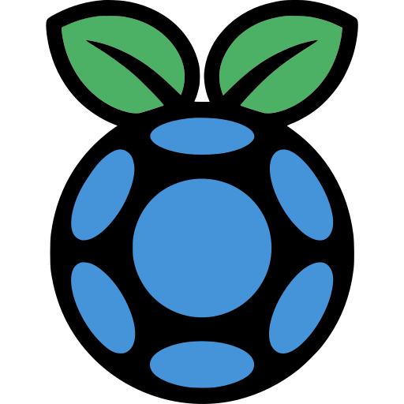 <code>piholevault</code></a></td><td align="center"><a href="../logos/pikapods.svg"> <code>pikapods</code></a></td><td align="center"><a href="../logos/pikvm.svg"> <code>pikvm</code></a></td><td align="center"><a href="../logos/piler.svg"> <code>piler</code></a></td></tr>
<tr><td align="center"><a href="../logos/pinboard.svg"> <code>pinboard</code></a></td><td align="center"><a href="../logos/pinboard-wordmark.svg"> <code>pinboard-wordmark</code></a></td><td align="center"><a href="../logos/pinepods.svg">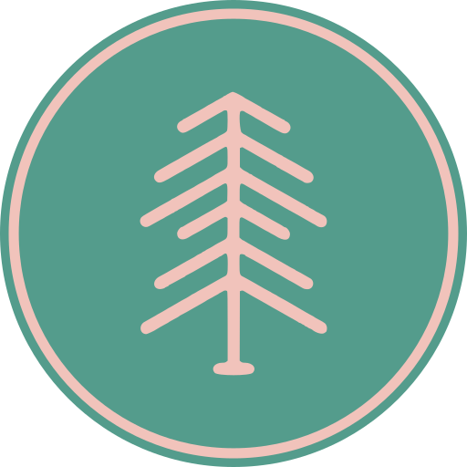 <code>pinepods</code></a></td><td align="center"><a href="../logos/pingora-proxy-manager.svg"> <code>pingora-proxy-manager</code></a></td><td align="center"><a href="../logos/pingvin.svg"> <code>pingvin</code></a></td><td align="center"><a href="../logos/pingvin-share.svg"> <code>pingvin-share</code></a></td></tr>
<tr><td align="center"><a href="../logos/pingvin-share-x.svg"> <code>pingvin-share-x</code></a></td><td align="center"><a href="../logos/pinkary.svg">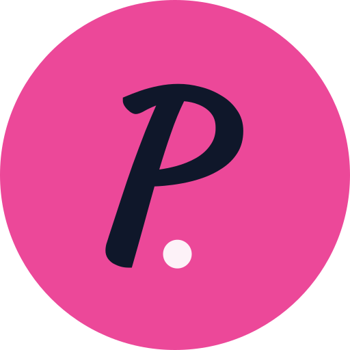 <code>pinkary</code></a></td><td align="center"><a href="../logos/pioneer.svg"> <code>pioneer</code></a></td><td align="center"><a href="../logos/piped.svg">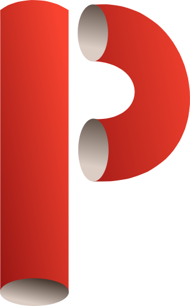 <code>piped</code></a></td><td align="center"><a href="../logos/pipefy.svg"> <code>pipefy</code></a></td><td align="center"><a href="../logos/piper-tts.svg"> <code>piper-tts</code></a></td></tr>
<tr><td align="center"><a href="../logos/pirate-proxy.svg"> <code>pirate-proxy</code></a></td><td align="center"><a href="../logos/pivotal-tracker.svg"> <code>pivotal-tracker</code></a></td><td align="center"><a href="../logos/piwigo.svg"> <code>piwigo</code></a></td><td align="center"><a href="../logos/pixelfin.svg">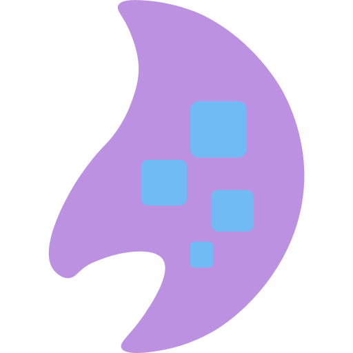 <code>pixelfin</code></a></td><td align="center"><a href="../logos/pkl.svg"> <code>pkl</code></a></td><td align="center"><a href="../logos/planarally.svg"> <code>planarally</code></a></td></tr>
<tr><td align="center"><a href="../logos/plane.svg">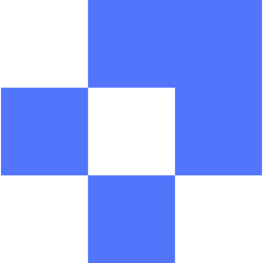 <code>plane</code></a></td><td align="center"><a href="../logos/plane-finder.svg"> <code>plane-finder</code></a></td><td align="center"><a href="../logos/planka.svg">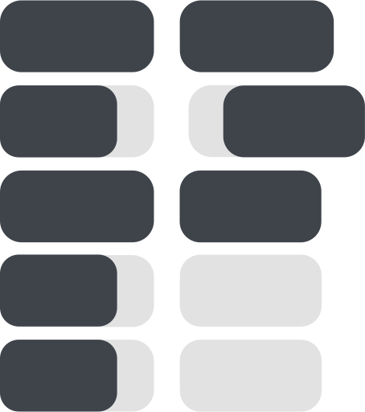 <code>planka</code></a></td><td align="center"><a href="../logos/planless.svg"> <code>planless</code></a></td><td align="center"><a href="../logos/planless-wordmark.svg"> <code>planless-wordmark</code></a></td><td align="center"><a href="../logos/planning-center.svg"> <code>planning-center</code></a></td></tr>
<tr><td align="center"><a href="../logos/planning-center-calendar.svg"> <code>planning-center-calendar</code></a></td><td align="center"><a href="../logos/planning-center-check-ins.svg"> <code>planning-center-check-ins</code></a></td><td align="center"><a href="../logos/planning-center-church-center.svg">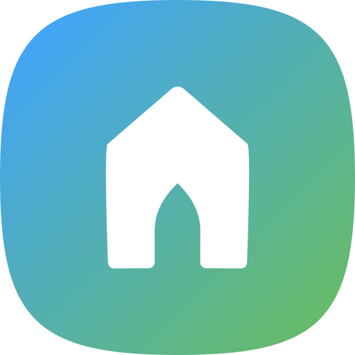 <code>planning-center-church-center</code></a></td><td align="center"><a href="../logos/planning-center-giving.svg"> <code>planning-center-giving</code></a></td><td align="center"><a href="../logos/planning-center-groups.svg"> <code>planning-center-groups</code></a></td><td align="center"><a href="../logos/planning-center-home.svg">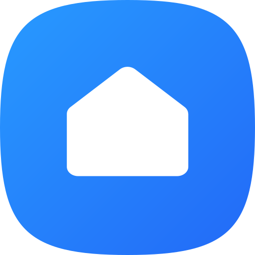 <code>planning-center-home</code></a></td></tr>
<tr><td align="center"><a href="../logos/planning-center-people.svg"> <code>planning-center-people</code></a></td><td align="center"><a href="../logos/planning-center-publishing.svg"> <code>planning-center-publishing</code></a></td><td align="center"><a href="../logos/planning-center-registrations.svg"> <code>planning-center-registrations</code></a></td><td align="center"><a href="../logos/planning-center-services.svg"> <code>planning-center-services</code></a></td><td align="center"><a href="../logos/plantuml.svg">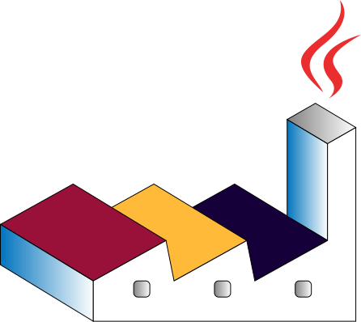 <code>plantuml</code></a></td><td align="center"><a href="../logos/playstation-plus.svg"> <code>playstation-plus</code></a></td></tr>
<tr><td align="center"><a href="../logos/pleroma.svg"> <code>pleroma</code></a></td><td align="center"><a href="../logos/plesk.svg"> <code>plesk</code></a></td><td align="center"><a href="../logos/plex-alt.svg"> <code>plex-alt</code></a></td><td align="center"><a href="../logos/plex-dash.svg"> <code>plex-dash</code></a></td><td align="center"><a href="../logos/plex-photos.svg"> <code>plex-photos</code></a></td><td align="center"><a href="../logos/plex-rewind.svg"> <code>plex-rewind</code></a></td></tr>
<tr><td align="center"><a href="../logos/plexamp.svg"> <code>plexamp</code></a></td><td align="center"><a href="../logos/plexrequests.svg"> <code>plexrequests</code></a></td><td align="center"><a href="../logos/plezy.svg"> <code>plezy</code></a></td><td align="center"><a href="../logos/plikshare.svg"> <code>plikshare</code></a></td><td align="center"><a href="../logos/plume.svg"> <code>plume</code></a></td><td align="center"><a href="../logos/plumio.svg"> <code>plumio</code></a></td></tr>
<tr><td align="center"><a href="../logos/pluton.svg"> <code>pluton</code></a></td><td align="center"><a href="../logos/pocket.svg"> <code>pocket</code></a></td><td align="center"><a href="../logos/pocket-id.svg"> <code>pocket-id</code></a></td><td align="center"><a href="../logos/podfetch.svg"> <code>podfetch</code></a></td><td align="center"><a href="../logos/podify.svg"> <code>podify</code></a></td><td align="center"><a href="../logos/podio.svg"> <code>podio</code></a></td></tr>
<tr><td align="center"><a href="../logos/podman.svg">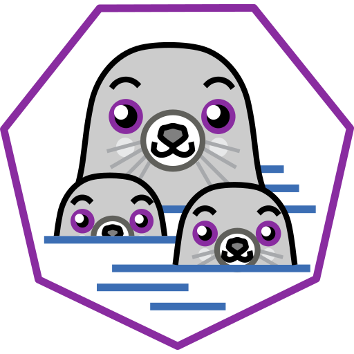 <code>podman</code></a></td><td align="center"><a href="../logos/poeditor.svg"> <code>poeditor</code></a></td><td align="center"><a href="../logos/poeticmetric.svg"> <code>poeticmetric</code></a></td><td align="center"><a href="../logos/pogocache.svg">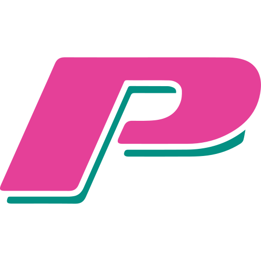 <code>pogocache</code></a></td><td align="center"><a href="../logos/polaris.svg"> <code>polaris</code></a></td><td align="center"><a href="../logos/polarisoffice.svg"> <code>polarisoffice</code></a></td></tr>
<tr><td align="center"><a href="../logos/policycontroller.svg"> <code>policycontroller</code></a></td><td align="center"><a href="../logos/poly.svg"> <code>poly</code></a></td><td align="center"><a href="../logos/polywork.svg"> <code>polywork</code></a></td><td align="center"><a href="../logos/portabase.svg"> <code>portabase</code></a></td><td align="center"><a href="../logos/portainer-alt.svg">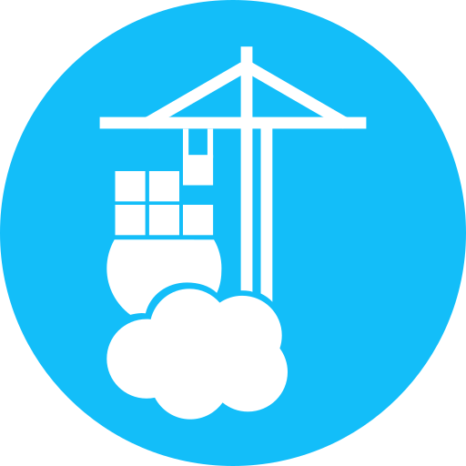 <code>portainer-alt</code></a></td><td align="center"><a href="../logos/portainer-be.svg"> <code>portainer-be</code></a></td></tr>
<tr><td align="center"><a href="../logos/portainer-pink.svg"> <code>portainer-pink</code></a></td><td align="center"><a href="../logos/portainer-v1.svg">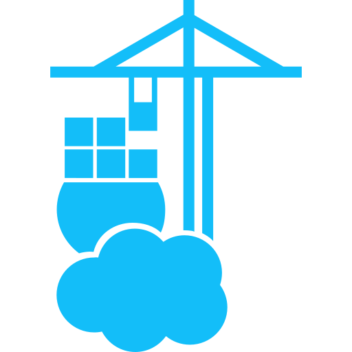 <code>portainer-v1</code></a></td><td align="center"><a href="../logos/portal-relay.svg">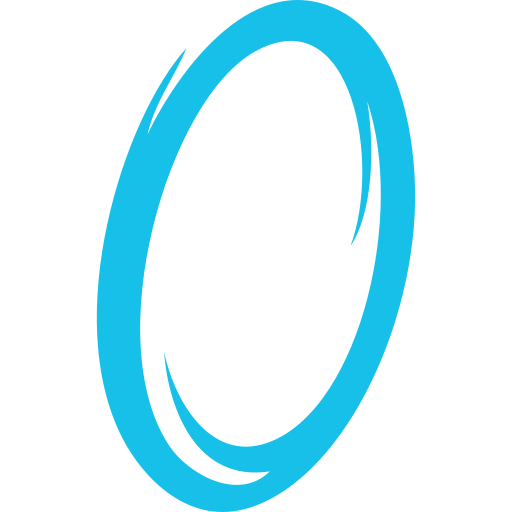 <code>portal-relay</code></a></td><td align="center"><a href="../logos/portnote.svg">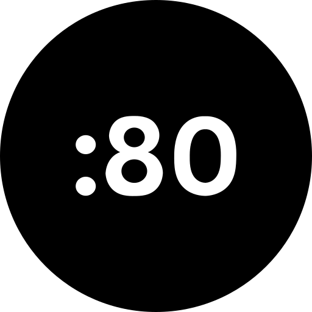 <code>portnote</code></a></td><td align="center"><a href="../logos/portracker.svg"> <code>portracker</code></a></td><td align="center"><a href="../logos/portus.svg"> <code>portus</code></a></td></tr>
<tr><td align="center"><a href="../logos/positive-intentions.svg">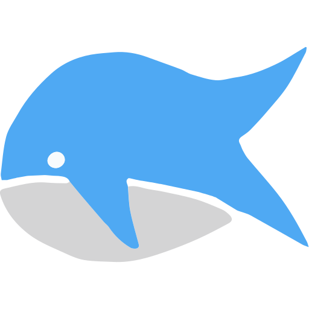 <code>positive-intentions</code></a></td><td align="center"><a href="../logos/post-content.svg"> <code>post-content</code></a></td><td align="center"><a href="../logos/postal.svg"> <code>postal</code></a></td><td align="center"><a href="../logos/postcard.svg"> <code>postcard</code></a></td><td align="center"><a href="../logos/poste.svg"> <code>poste</code></a></td><td align="center"><a href="../logos/posteria.svg"> <code>posteria</code></a></td></tr>
<tr><td align="center"><a href="../logos/posterizarr.svg">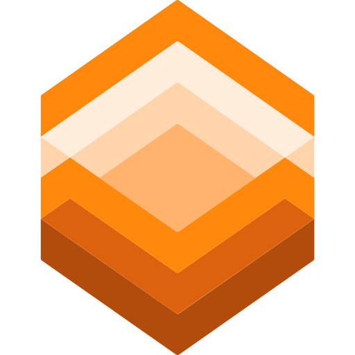 <code>posterizarr</code></a></td><td align="center"><a href="../logos/postgres.svg"> <code>postgres</code></a></td><td align="center"><a href="../logos/postgresus.svg"> <code>postgresus</code></a></td><td align="center"><a href="../logos/postiz.svg"> <code>postiz</code></a></td><td align="center"><a href="../logos/power-norway.svg">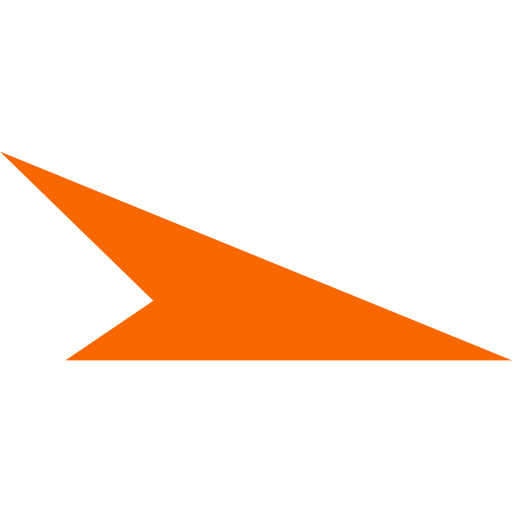 <code>power-norway</code></a></td><td align="center"><a href="../logos/powerbi.svg"> <code>powerbi</code></a></td></tr>
<tr><td align="center"><a href="../logos/powerschool.svg">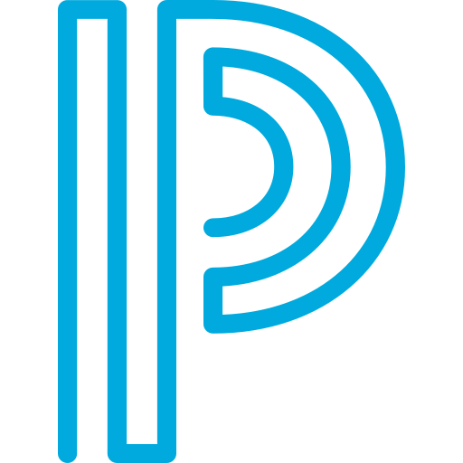 <code>powerschool</code></a></td><td align="center"><a href="../logos/powershell-universal.svg">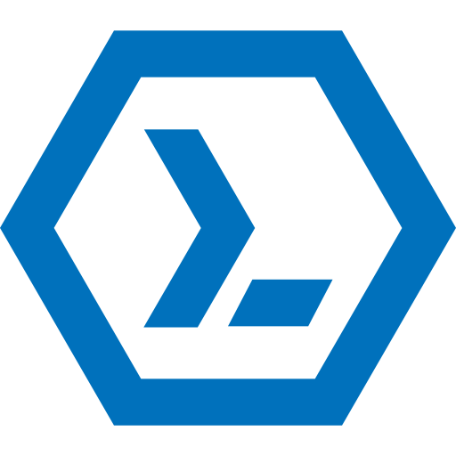 <code>powershell-universal</code></a></td><td align="center"><a href="../logos/poznote.svg"> <code>poznote</code></a></td><td align="center"><a href="../logos/premiumize.svg"> <code>premiumize</code></a></td><td align="center"><a href="../logos/pretix.svg"> <code>pretix</code></a></td><td align="center"><a href="../logos/price-buddy.svg"> <code>price-buddy</code></a></td></tr>
<tr><td align="center"><a href="../logos/priceghost.svg"> <code>priceghost</code></a></td><td align="center"><a href="../logos/primal.svg"> <code>primal</code></a></td><td align="center"><a href="../logos/printables.svg"> <code>printables</code></a></td><td align="center"><a href="../logos/printer.svg"> <code>printer</code></a></td><td align="center"><a href="../logos/pritunl.svg"> <code>pritunl</code></a></td><td align="center"><a href="../logos/privacyidea.svg">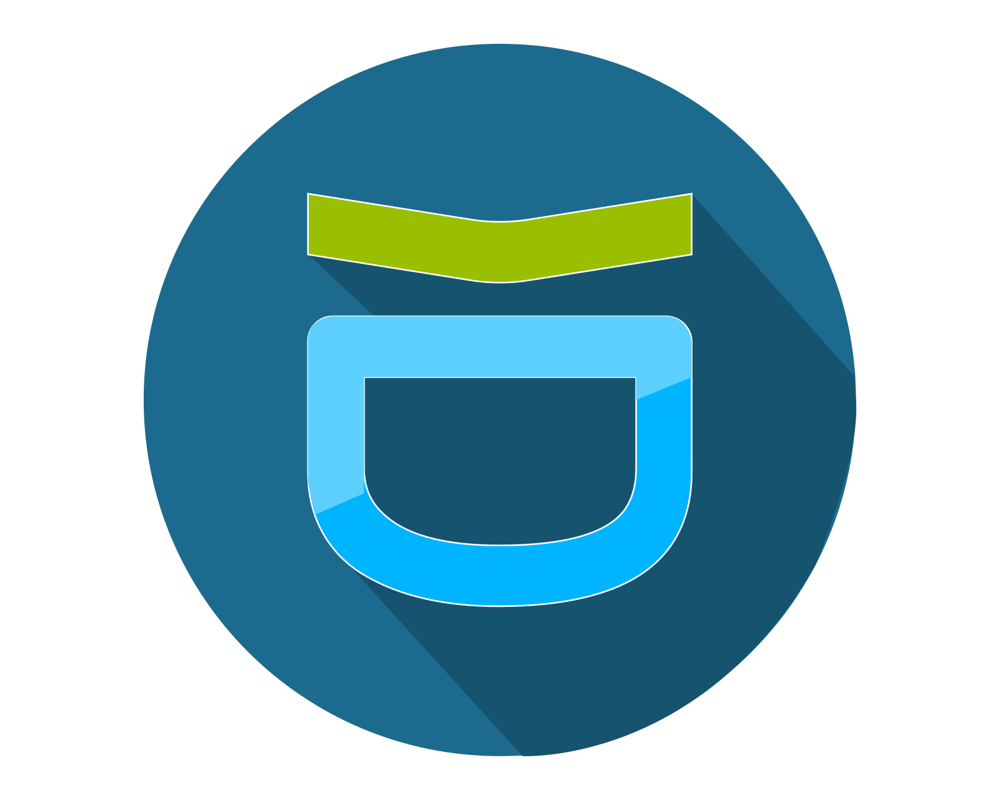 <code>privacyidea</code></a></td></tr>
<tr><td align="center"><a href="../logos/private-captcha.svg"> <code>private-captcha</code></a></td><td align="center"><a href="../logos/private-internet-access.svg"> <code>private-internet-access</code></a></td><td align="center"><a href="../logos/privatebin.svg"> <code>privatebin</code></a></td><td align="center"><a href="../logos/privatefolio.svg"> <code>privatefolio</code></a></td><td align="center"><a href="../logos/productboard.svg"> <code>productboard</code></a></td><td align="center"><a href="../logos/productboard-wordmark.svg"> <code>productboard-wordmark</code></a></td></tr>
<tr><td align="center"><a href="../logos/producteev.svg"> <code>producteev</code></a></td><td align="center"><a href="../logos/profilarr.svg"> <code>profilarr</code></a></td><td align="center"><a href="../logos/progressive.svg">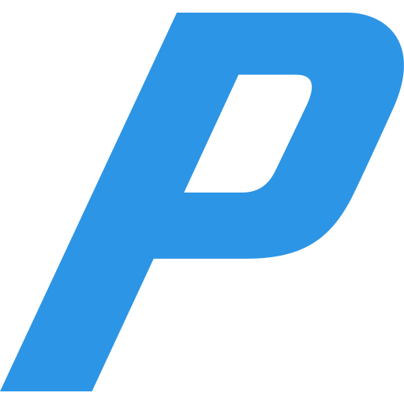 <code>progressive</code></a></td><td align="center"><a href="../logos/projectsend.svg"> <code>projectsend</code></a></td><td align="center"><a href="../logos/prolific.svg"> <code>prolific</code></a></td><td align="center"><a href="../logos/prometheus-node-exporter.svg"> <code>prometheus-node-exporter</code></a></td></tr>
<tr><td align="center"><a href="../logos/proshop.svg"> <code>proshop</code></a></td><td align="center"><a href="../logos/prosody.svg">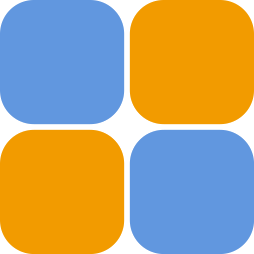 <code>prosody</code></a></td><td align="center"><a href="../logos/proton.svg"> <code>proton</code></a></td><td align="center"><a href="../logos/proton-calendar.svg">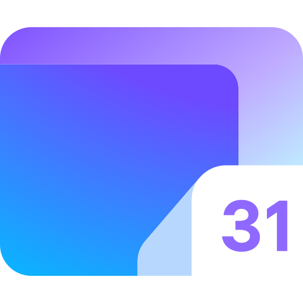 <code>proton-calendar</code></a></td><td align="center"><a href="../logos/proton-docs.svg"> <code>proton-docs</code></a></td><td align="center"><a href="../logos/proton-drive.svg"> <code>proton-drive</code></a></td></tr>
<tr><td align="center"><a href="../logos/proton-lumo.svg"> <code>proton-lumo</code></a></td><td align="center"><a href="../logos/proton-mail.svg"> <code>proton-mail</code></a></td><td align="center"><a href="../logos/proton-meet.svg"> <code>proton-meet</code></a></td><td align="center"><a href="../logos/proton-pass.svg">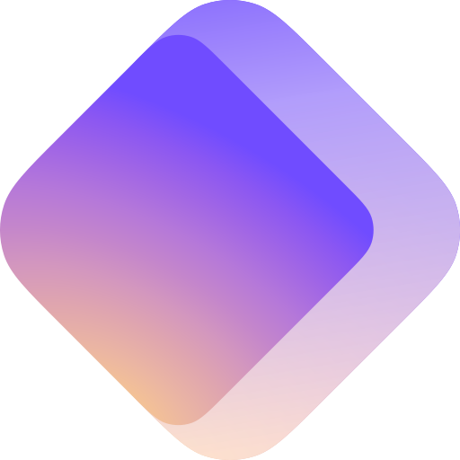 <code>proton-pass</code></a></td><td align="center"><a href="../logos/proton-sheets.svg"> <code>proton-sheets</code></a></td><td align="center"><a href="../logos/proton-vpn.svg"> <code>proton-vpn</code></a></td></tr>
<tr><td align="center"><a href="../logos/proton-vpn-wordmark.svg"> <code>proton-vpn-wordmark</code></a></td><td align="center"><a href="../logos/protondb.svg"> <code>protondb</code></a></td><td align="center"><a href="../logos/prowlarr.svg"> <code>prowlarr</code></a></td><td align="center"><a href="../logos/prowlarr-radarr.svg"> <code>prowlarr-radarr</code></a></td><td align="center"><a href="../logos/proxcenter.svg"> <code>proxcenter</code></a></td><td align="center"><a href="../logos/proxmenux.svg"> <code>proxmenux</code></a></td></tr>
<tr><td align="center"><a href="../logos/proxmox-helper-scripts.svg"> <code>proxmox-helper-scripts</code></a></td><td align="center"><a href="../logos/prtg.svg">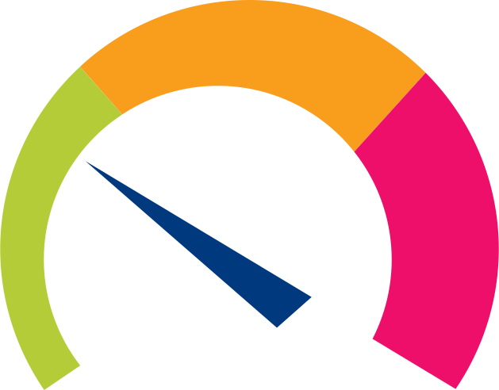 <code>prtg</code></a></td><td align="center"><a href="../logos/prunemate.svg">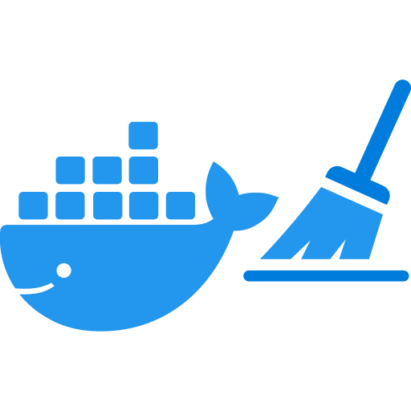 <code>prunemate</code></a></td><td align="center"><a href="../logos/prusa-research.svg"> <code>prusa-research</code></a></td><td align="center"><a href="../logos/ps5-mqtt.svg"> <code>ps5-mqtt</code></a></td><td align="center"><a href="../logos/psitransfer.svg"> <code>psitransfer</code></a></td></tr>
<tr><td align="center"><a href="../logos/pswd.svg">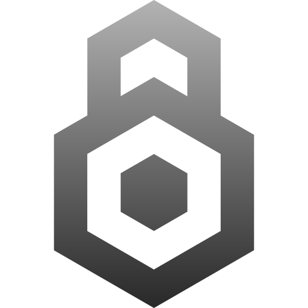 <code>pswd</code></a></td><td align="center"><a href="../logos/pterodactyl.svg"> <code>pterodactyl</code></a></td><td align="center"><a href="../logos/public-pool.svg"> <code>public-pool</code></a></td><td align="center"><a href="../logos/pufferfish-host.svg">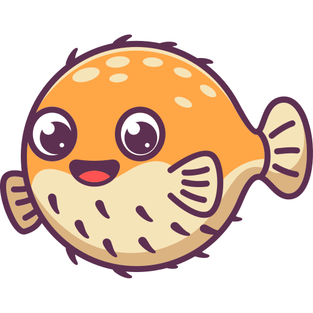 <code>pufferfish-host</code></a></td><td align="center"><a href="../logos/pufferpanel.svg">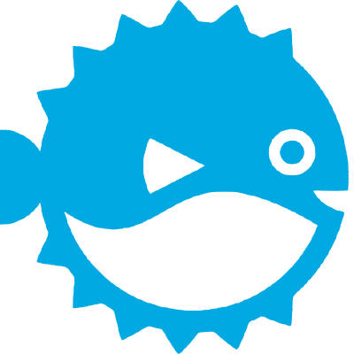 <code>pufferpanel</code></a></td><td align="center"><a href="../logos/pulp-project.svg">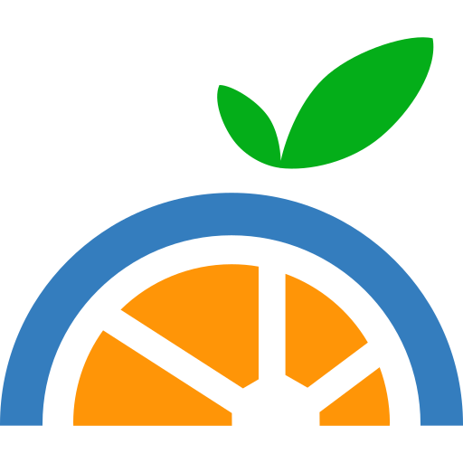 <code>pulp-project</code></a></td></tr>
<tr><td align="center"><a href="../logos/pulsarr.svg"> <code>pulsarr</code></a></td><td align="center"><a href="../logos/pulse.svg"> <code>pulse</code></a></td><td align="center"><a href="../logos/punipuni.svg"> <code>punipuni</code></a></td><td align="center"><a href="../logos/punyshort.svg"> <code>punyshort</code></a></td><td align="center"><a href="../logos/pure-storage.svg"> <code>pure-storage</code></a></td><td align="center"><a href="../logos/purelymail.svg"> <code>purelymail</code></a></td></tr>
<tr><td align="center"><a href="../logos/purpurmc.svg">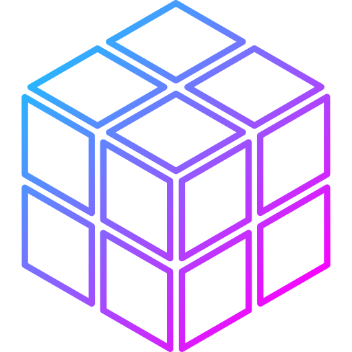 <code>purpurmc</code></a></td><td align="center"><a href="../logos/pushbase.svg">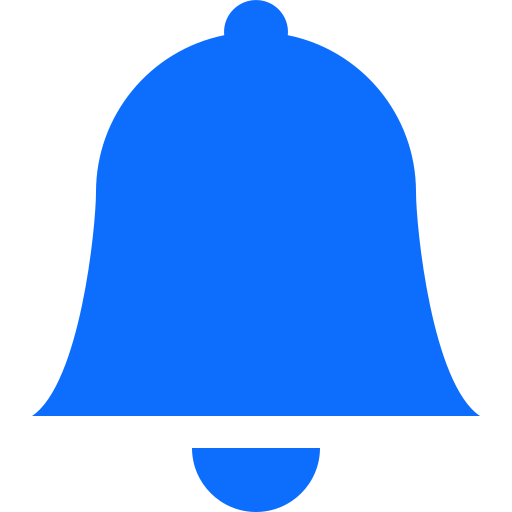 <code>pushbase</code></a></td><td align="center"><a href="../logos/pushbullet.svg"> <code>pushbullet</code></a></td><td align="center"><a href="../logos/pushfish.svg">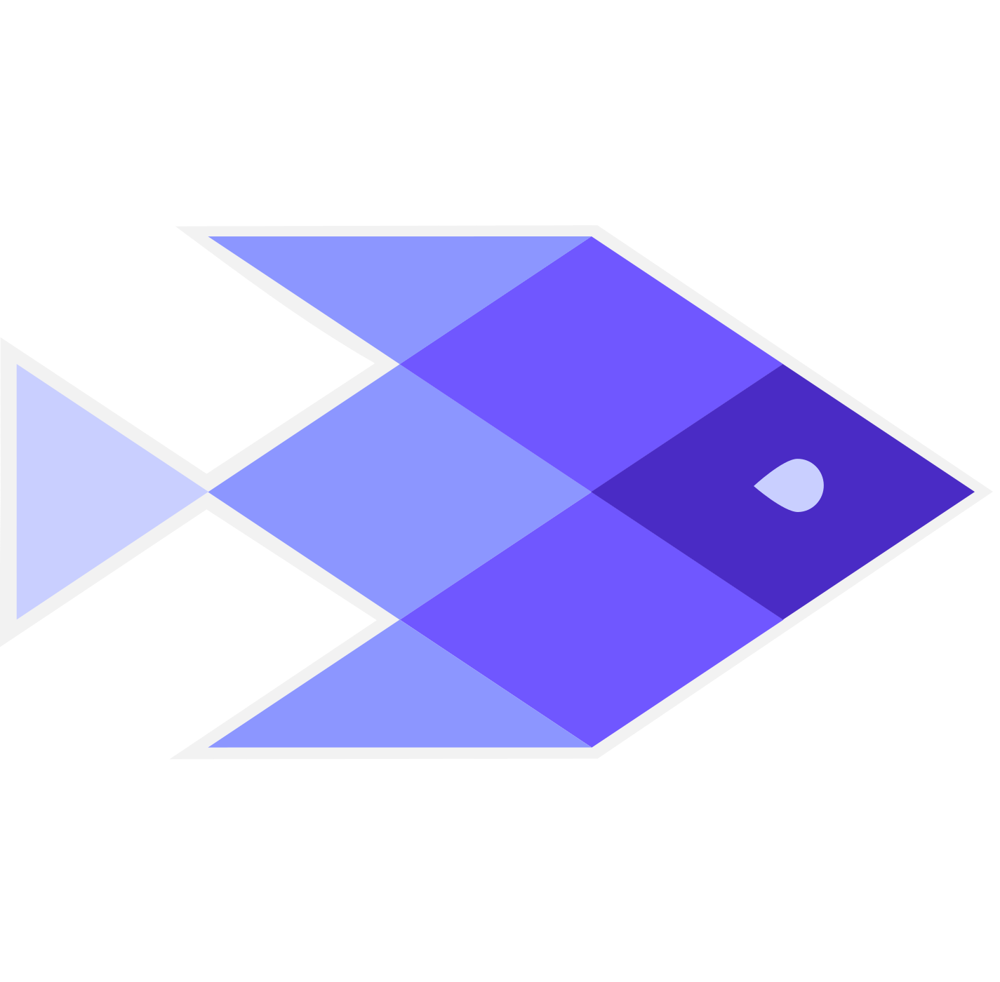 <code>pushfish</code></a></td><td align="center"><a href="../logos/pushover.svg"> <code>pushover</code></a></td><td align="center"><a href="../logos/puter.svg"> <code>puter</code></a></td></tr>
<tr><td align="center"><a href="../logos/putio.svg"> <code>putio</code></a></td><td align="center"><a href="../logos/putty.svg">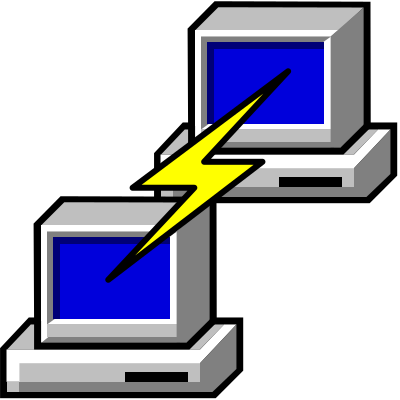 <code>putty</code></a></td><td align="center"><a href="../logos/pve-notebuddy.svg"> <code>pve-notebuddy</code></a></td><td align="center"><a href="../logos/pvy-applytics.svg"> <code>pvy-applytics</code></a></td><td align="center"><a href="../logos/pvy-applytics-wordmark.svg"> <code>pvy-applytics-wordmark</code></a></td><td align="center"><a href="../logos/pvy-appstore.svg"> <code>pvy-appstore</code></a></td></tr>
<tr><td align="center"><a href="../logos/pvy-appstore-wordmark.svg"> <code>pvy-appstore-wordmark</code></a></td><td align="center"><a href="../logos/pvy-archiver.svg"> <code>pvy-archiver</code></a></td><td align="center"><a href="../logos/pvy-archiver-wordmark.svg"> <code>pvy-archiver-wordmark</code></a></td><td align="center"><a href="../logos/pvy-assets.svg"> <code>pvy-assets</code></a></td><td align="center"><a href="../logos/pvy-assets-wordmark.svg"> <code>pvy-assets-wordmark</code></a></td><td align="center"><a href="../logos/pvy-automat.svg"> <code>pvy-automat</code></a></td></tr>
<tr><td align="center"><a href="../logos/pvy-automat-wordmark.svg"> <code>pvy-automat-wordmark</code></a></td><td align="center"><a href="../logos/pvy-backup.svg"> <code>pvy-backup</code></a></td><td align="center"><a href="../logos/pvy-backup-wordmark.svg"> <code>pvy-backup-wordmark</code></a></td><td align="center"><a href="../logos/pvy-base.svg"> <code>pvy-base</code></a></td><td align="center"><a href="../logos/pvy-base-wordmark.svg"> <code>pvy-base-wordmark</code></a></td><td align="center"><a href="../logos/pvy-bookmarks.svg"> <code>pvy-bookmarks</code></a></td></tr>
<tr><td align="center"><a href="../logos/pvy-bookmarks-wordmark.svg"> <code>pvy-bookmarks-wordmark</code></a></td><td align="center"><a href="../logos/pvy-bot.svg"> <code>pvy-bot</code></a></td><td align="center"><a href="../logos/pvy-bot-wordmark.svg"> <code>pvy-bot-wordmark</code></a></td><td align="center"><a href="../logos/pvy-buddy.svg"> <code>pvy-buddy</code></a></td><td align="center"><a href="../logos/pvy-buddy-wordmark.svg"> <code>pvy-buddy-wordmark</code></a></td><td align="center"><a href="../logos/pvy-bugtracker.svg"> <code>pvy-bugtracker</code></a></td></tr>
<tr><td align="center"><a href="../logos/pvy-bugtracker-wordmark.svg"> <code>pvy-bugtracker-wordmark</code></a></td><td align="center"><a href="../logos/pvy-businessos.svg"> <code>pvy-businessos</code></a></td><td align="center"><a href="../logos/pvy-businessos-wordmark.svg"> <code>pvy-businessos-wordmark</code></a></td><td align="center"><a href="../logos/pvy-buttler.svg"> <code>pvy-buttler</code></a></td><td align="center"><a href="../logos/pvy-buttler-wordmark.svg"> <code>pvy-buttler-wordmark</code></a></td><td align="center"><a href="../logos/pvy-cal.svg"> <code>pvy-cal</code></a></td></tr>
<tr><td align="center"><a href="../logos/pvy-cal-wordmark.svg"> <code>pvy-cal-wordmark</code></a></td><td align="center"><a href="../logos/pvy-captcha.svg"> <code>pvy-captcha</code></a></td><td align="center"><a href="../logos/pvy-captcha-wordmark.svg"> <code>pvy-captcha-wordmark</code></a></td><td align="center"><a href="../logos/pvy-central.svg"> <code>pvy-central</code></a></td><td align="center"><a href="../logos/pvy-central-wordmark.svg"> <code>pvy-central-wordmark</code></a></td><td align="center"><a href="../logos/pvy-community.svg"> <code>pvy-community</code></a></td></tr>
<tr><td align="center"><a href="../logos/pvy-community-wordmark.svg"> <code>pvy-community-wordmark</code></a></td><td align="center"><a href="../logos/pvy-devices.svg"> <code>pvy-devices</code></a></td><td align="center"><a href="../logos/pvy-devices-wordmark.svg"> <code>pvy-devices-wordmark</code></a></td><td align="center"><a href="../logos/pvy-files.svg"> <code>pvy-files</code></a></td><td align="center"><a href="../logos/pvy-files-wordmark.svg"> <code>pvy-files-wordmark</code></a></td><td align="center"><a href="../logos/pvy-forms.svg"> <code>pvy-forms</code></a></td></tr>
<tr><td align="center"><a href="../logos/pvy-forms-wordmark.svg"> <code>pvy-forms-wordmark</code></a></td><td align="center"><a href="../logos/pvy-groupware.svg"> <code>pvy-groupware</code></a></td><td align="center"><a href="../logos/pvy-groupware-wordmark.svg"> <code>pvy-groupware-wordmark</code></a></td><td align="center"><a href="../logos/pvy-gtd.svg"> <code>pvy-gtd</code></a></td><td align="center"><a href="../logos/pvy-gtd-wordmark.svg"> <code>pvy-gtd-wordmark</code></a></td><td align="center"><a href="../logos/pvy-homeassistant.svg"> <code>pvy-homeassistant</code></a></td></tr>
<tr><td align="center"><a href="../logos/pvy-homeassistant-wordmark.svg"> <code>pvy-homeassistant-wordmark</code></a></td><td align="center"><a href="../logos/pvy-id.svg"> <code>pvy-id</code></a></td><td align="center"><a href="../logos/pvy-id-wordmark.svg"> <code>pvy-id-wordmark</code></a></td><td align="center"><a href="../logos/pvy-lnkr.svg"> <code>pvy-lnkr</code></a></td><td align="center"><a href="../logos/pvy-lnkr-wordmark.svg"> <code>pvy-lnkr-wordmark</code></a></td><td align="center"><a href="../logos/pvy-local.svg"> <code>pvy-local</code></a></td></tr>
<tr><td align="center"><a href="../logos/pvy-local-wordmark.svg"> <code>pvy-local-wordmark</code></a></td><td align="center"><a href="../logos/pvy-localize.svg">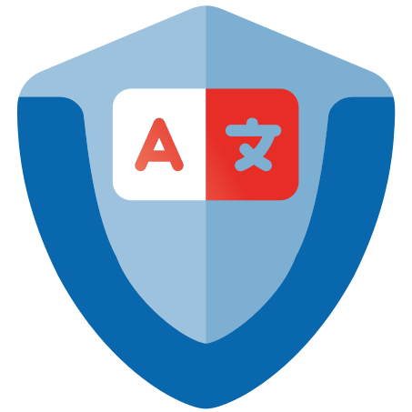 <code>pvy-localize</code></a></td><td align="center"><a href="../logos/pvy-localize-wordmark.svg"> <code>pvy-localize-wordmark</code></a></td><td align="center"><a href="../logos/pvy-mailarchiver.svg"> <code>pvy-mailarchiver</code></a></td><td align="center"><a href="../logos/pvy-mailarchiver-wordmark.svg"> <code>pvy-mailarchiver-wordmark</code></a></td><td align="center"><a href="../logos/pvy-mailr.svg"> <code>pvy-mailr</code></a></td></tr>
<tr><td align="center"><a href="../logos/pvy-mailr-wordmark.svg"> <code>pvy-mailr-wordmark</code></a></td><td align="center"><a href="../logos/pvy-maps.svg"> <code>pvy-maps</code></a></td><td align="center"><a href="../logos/pvy-maps-wordmark.svg"> <code>pvy-maps-wordmark</code></a></td><td align="center"><a href="../logos/pvy-mdm.svg"> <code>pvy-mdm</code></a></td><td align="center"><a href="../logos/pvy-mdm-wordmark.svg"> <code>pvy-mdm-wordmark</code></a></td><td align="center"><a href="../logos/pvy-media.svg"> <code>pvy-media</code></a></td></tr>
<tr><td align="center"><a href="../logos/pvy-media-wordmark.svg"> <code>pvy-media-wordmark</code></a></td><td align="center"><a href="../logos/pvy-mediahub.svg"> <code>pvy-mediahub</code></a></td><td align="center"><a href="../logos/pvy-mediahub-wordmark.svg"> <code>pvy-mediahub-wordmark</code></a></td><td align="center"><a href="../logos/pvy-meeting.svg"> <code>pvy-meeting</code></a></td><td align="center"><a href="../logos/pvy-meeting-wordmark.svg"> <code>pvy-meeting-wordmark</code></a></td><td align="center"><a href="../logos/pvy-mesh.svg"> <code>pvy-mesh</code></a></td></tr>
<tr><td align="center"><a href="../logos/pvy-mesh-wordmark.svg"> <code>pvy-mesh-wordmark</code></a></td><td align="center"><a href="../logos/pvy-messenger.svg"> <code>pvy-messenger</code></a></td><td align="center"><a href="../logos/pvy-messenger-wordmark.svg"> <code>pvy-messenger-wordmark</code></a></td><td align="center"><a href="../logos/pvy-news.svg"> <code>pvy-news</code></a></td><td align="center"><a href="../logos/pvy-news-wordmark.svg"> <code>pvy-news-wordmark</code></a></td><td align="center"><a href="../logos/pvy-notes.svg"> <code>pvy-notes</code></a></td></tr>
<tr><td align="center"><a href="../logos/pvy-notes-wordmark.svg"> <code>pvy-notes-wordmark</code></a></td><td align="center"><a href="../logos/pvy-office.svg"> <code>pvy-office</code></a></td><td align="center"><a href="../logos/pvy-office-wordmark.svg"> <code>pvy-office-wordmark</code></a></td><td align="center"><a href="../logos/pvy-pad.svg"> <code>pvy-pad</code></a></td><td align="center"><a href="../logos/pvy-pad-wordmark.svg"> <code>pvy-pad-wordmark</code></a></td><td align="center"><a href="../logos/pvy-pbx.svg"> <code>pvy-pbx</code></a></td></tr>
<tr><td align="center"><a href="../logos/pvy-pbx-wordmark.svg"> <code>pvy-pbx-wordmark</code></a></td><td align="center"><a href="../logos/pvy-photo.svg"> <code>pvy-photo</code></a></td><td align="center"><a href="../logos/pvy-photo-wordmark.svg"> <code>pvy-photo-wordmark</code></a></td><td align="center"><a href="../logos/pvy-remote.svg"> <code>pvy-remote</code></a></td><td align="center"><a href="../logos/pvy-remote-wordmark.svg"> <code>pvy-remote-wordmark</code></a></td><td align="center"><a href="../logos/pvy-safe.svg"> <code>pvy-safe</code></a></td></tr>
<tr><td align="center"><a href="../logos/pvy-safe-wordmark.svg"> <code>pvy-safe-wordmark</code></a></td><td align="center"><a href="../logos/pvy-search.svg"> <code>pvy-search</code></a></td><td align="center"><a href="../logos/pvy-search-wordmark.svg"> <code>pvy-search-wordmark</code></a></td><td align="center"><a href="../logos/pvy-servicedesk.svg"> <code>pvy-servicedesk</code></a></td><td align="center"><a href="../logos/pvy-servicedesk-wordmark.svg"> <code>pvy-servicedesk-wordmark</code></a></td><td align="center"><a href="../logos/pvy-sign.svg"> <code>pvy-sign</code></a></td></tr>
<tr><td align="center"><a href="../logos/pvy-sign-wordmark.svg"> <code>pvy-sign-wordmark</code></a></td><td align="center"><a href="../logos/pvy-snippets.svg">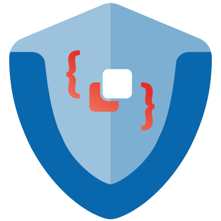 <code>pvy-snippets</code></a></td><td align="center"><a href="../logos/pvy-snippets-wordmark.svg"> <code>pvy-snippets-wordmark</code></a></td><td align="center"><a href="../logos/pvy-spreadsheet.svg">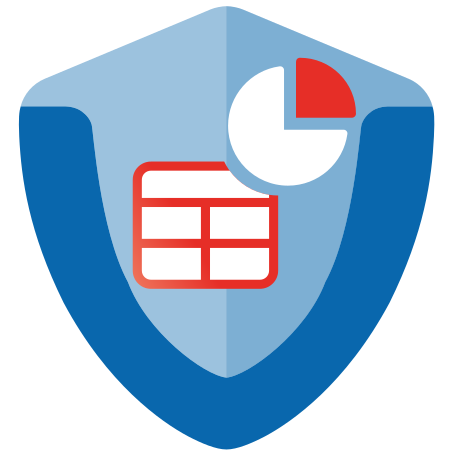 <code>pvy-spreadsheet</code></a></td><td align="center"><a href="../logos/pvy-spreadsheet-wordmark.svg"> <code>pvy-spreadsheet-wordmark</code></a></td><td align="center"><a href="../logos/pvy-start.svg"> <code>pvy-start</code></a></td></tr>
<tr><td align="center"><a href="../logos/pvy-start-wordmark.svg"> <code>pvy-start-wordmark</code></a></td><td align="center"><a href="../logos/pvy-timer.svg">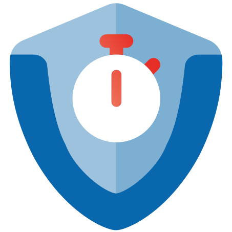 <code>pvy-timer</code></a></td><td align="center"><a href="../logos/pvy-timer-wordmark.svg"> <code>pvy-timer-wordmark</code></a></td><td align="center"><a href="../logos/pvy-ux.svg"> <code>pvy-ux</code></a></td><td align="center"><a href="../logos/pvy-ux-wordmark.svg"> <code>pvy-ux-wordmark</code></a></td><td align="center"><a href="../logos/pvy-vault.svg"> <code>pvy-vault</code></a></td></tr>
<tr><td align="center"><a href="../logos/pvy-vault-wordmark.svg"> <code>pvy-vault-wordmark</code></a></td><td align="center"><a href="../logos/pvy-webcall.svg"> <code>pvy-webcall</code></a></td><td align="center"><a href="../logos/pvy-webcall-wordmark.svg"> <code>pvy-webcall-wordmark</code></a></td><td align="center"><a href="../logos/pvy-wiki.svg"> <code>pvy-wiki</code></a></td><td align="center"><a href="../logos/pvy-wiki-wordmark.svg"> <code>pvy-wiki-wordmark</code></a></td><td align="center"><a href="../logos/pvyaffiliate.svg"> <code>pvyaffiliate</code></a></td></tr>
<tr><td align="center"><a href="../logos/pvyaffiliate-wordmark.svg"> <code>pvyaffiliate-wordmark</code></a></td><td align="center"><a href="../logos/pydio.svg"> <code>pydio</code></a></td><td align="center"><a href="../logos/pyload.svg"> <code>pyload</code></a></td><td align="center"><a href="../logos/pypi-wordmark.svg">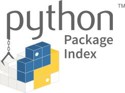 <code>pypi-wordmark</code></a></td><td align="center"><a href="../logos/pyshelf.svg">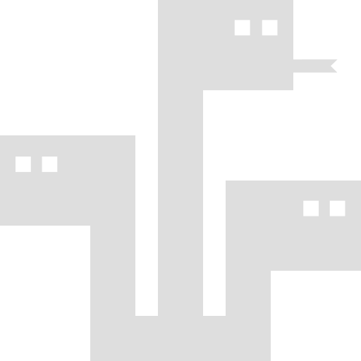 <code>pyshelf</code></a></td><td align="center"><a href="../logos/qbittorrent.svg"> <code>qbittorrent</code></a></td></tr>
<tr><td align="center"><a href="../logos/qd.svg">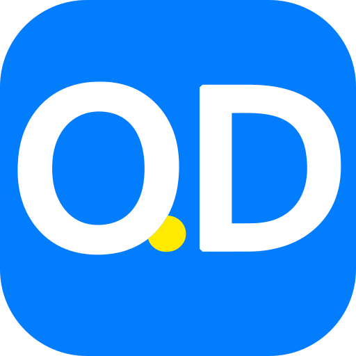 <code>qd</code></a></td><td align="center"><a href="../logos/qd-today.svg"> <code>qd-today</code></a></td><td align="center"><a href="../logos/qdirstat.svg"> <code>qdirstat</code></a></td><td align="center"><a href="../logos/qinglong.svg"> <code>qinglong</code></a></td><td align="center"><a href="../logos/qlik2.svg"> <code>qlik2</code></a></td><td align="center"><a href="../logos/qnap.svg"> <code>qnap</code></a></td></tr>
<tr><td align="center"><a href="../logos/qnap-adra-ndr.svg"> <code>qnap-adra-ndr</code></a></td><td align="center"><a href="../logos/qnap-containers.svg"> <code>qnap-containers</code></a></td><td align="center"><a href="../logos/qnap-qsync.svg"> <code>qnap-qsync</code></a></td><td align="center"><a href="../logos/qnap-qvr-center.svg"> <code>qnap-qvr-center</code></a></td><td align="center"><a href="../logos/qnap-qvr-face.svg"> <code>qnap-qvr-face</code></a></td><td align="center"><a href="../logos/qnap-qvr-human.svg"> <code>qnap-qvr-human</code></a></td></tr>
<tr><td align="center"><a href="../logos/qnap-qvr-surveillance.svg"> <code>qnap-qvr-surveillance</code></a></td><td align="center"><a href="../logos/qnap-virtualization.svg"> <code>qnap-virtualization</code></a></td><td align="center"><a href="../logos/qobuz.svg"> <code>qobuz</code></a></td><td align="center"><a href="../logos/qordoba.svg"> <code>qordoba</code></a></td><td align="center"><a href="../logos/questdb.svg"> <code>questdb</code></a></td><td align="center"><a href="../logos/quetre.svg"> <code>quetre</code></a></td></tr>
<tr><td align="center"><a href="../logos/quick-reference.svg"> <code>quick-reference</code></a></td><td align="center"><a href="../logos/quickbars.svg">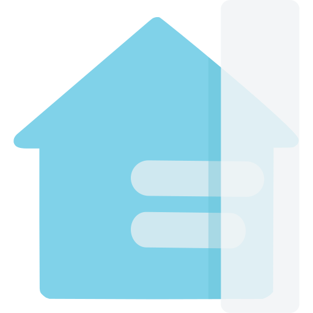 <code>quickbars</code></a></td><td align="center"><a href="../logos/quickshare.svg"> <code>quickshare</code></a></td><td align="center"><a href="../logos/quickstack.svg">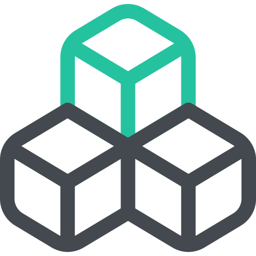 <code>quickstack</code></a></td><td align="center"><a href="../logos/quickwit.svg">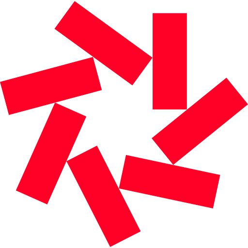 <code>quickwit</code></a></td><td align="center"><a href="../logos/quizlet.svg"> <code>quizlet</code></a></td></tr>
<tr><td align="center"><a href="../logos/qutebrowser.svg"> <code>qutebrowser</code></a></td><td align="center"><a href="../logos/r.svg"> <code>r</code></a></td><td align="center"><a href="../logos/rackpeek.svg"> <code>rackpeek</code></a></td><td align="center"><a href="../logos/rackula.svg"> <code>rackula</code></a></td><td align="center"><a href="../logos/radarr.svg"> <code>radarr</code></a></td><td align="center"><a href="../logos/radarr-4k.svg"> <code>radarr-4k</code></a></td></tr>
<tr><td align="center"><a href="../logos/radarr-anime.svg"> <code>radarr-anime</code></a></td><td align="center"><a href="../logos/radarr-dv.svg"> <code>radarr-dv</code></a></td><td align="center"><a href="../logos/radarr-light-hybrid.svg"> <code>radarr-light-hybrid</code></a></td><td align="center"><a href="../logos/radarr-v1.svg">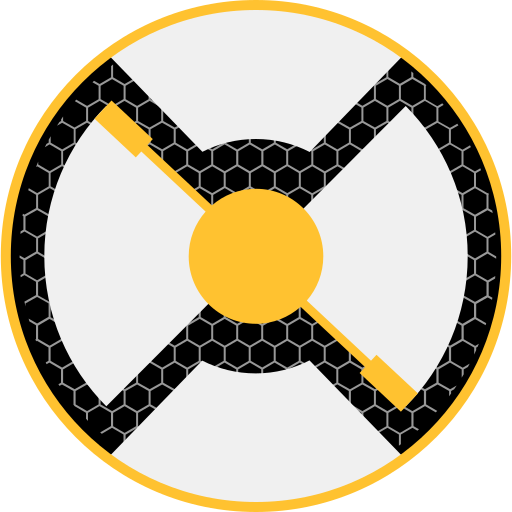 <code>radarr-v1</code></a></td><td align="center"><a href="../logos/radicale.svg">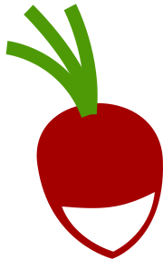 <code>radicale</code></a></td><td align="center"><a href="../logos/radicle.svg">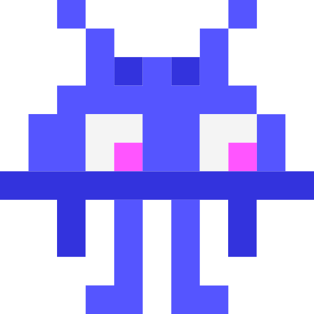 <code>radicle</code></a></td></tr>
<tr><td align="center"><a href="../logos/rahoot.svg"> <code>rahoot</code></a></td><td align="center"><a href="../logos/raindrop-io.svg"> <code>raindrop-io</code></a></td><td align="center"><a href="../logos/rainloop.svg"> <code>rainloop</code></a></td><td align="center"><a href="../logos/rallly.svg"> <code>rallly</code></a></td><td align="center"><a href="../logos/ramp.svg"> <code>ramp</code></a></td><td align="center"><a href="../logos/rancher-desktop.svg"> <code>rancher-desktop</code></a></td></tr>
<tr><td align="center"><a href="../logos/rancher-epinio.svg"> <code>rancher-epinio</code></a></td><td align="center"><a href="../logos/rancher-fleet.svg"> <code>rancher-fleet</code></a></td><td align="center"><a href="../logos/rancher-harvester.svg">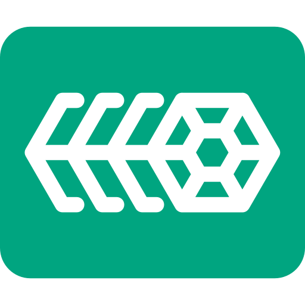 <code>rancher-harvester</code></a></td><td align="center"><a href="../logos/rancher-hypper.svg"> <code>rancher-hypper</code></a></td><td align="center"><a href="../logos/rancher-k3os.svg">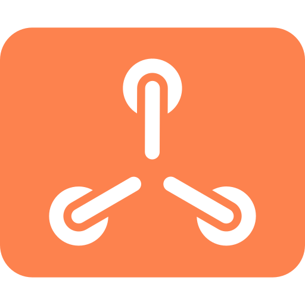 <code>rancher-k3os</code></a></td><td align="center"><a href="../logos/rancher-k3s.svg"> <code>rancher-k3s</code></a></td></tr>
<tr><td align="center"><a href="../logos/rancher-kubewarden.svg"> <code>rancher-kubewarden</code></a></td><td align="center"><a href="../logos/rancher-longhorn.svg">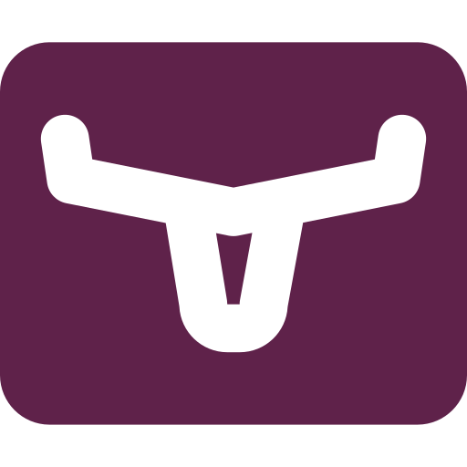 <code>rancher-longhorn</code></a></td><td align="center"><a href="../logos/rancher-opni.svg">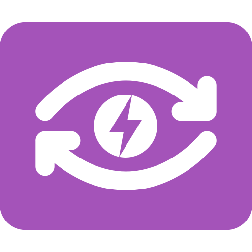 <code>rancher-opni</code></a></td><td align="center"><a href="../logos/rancher-rio.svg">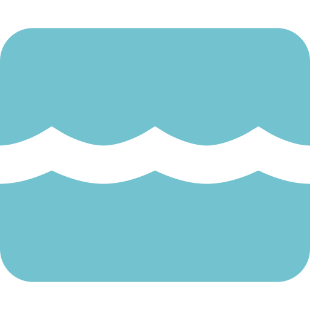 <code>rancher-rio</code></a></td><td align="center"><a href="../logos/rancher-rke.svg">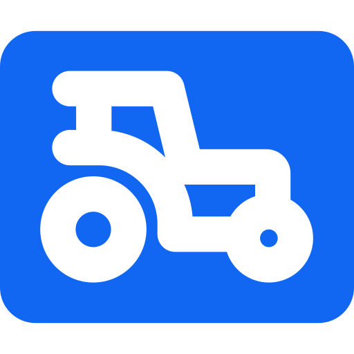 <code>rancher-rke</code></a></td><td align="center"><a href="../logos/rancher-submariner.svg">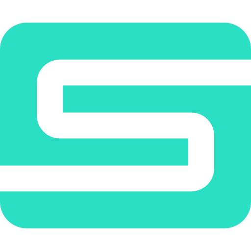 <code>rancher-submariner</code></a></td></tr>
<tr><td align="center"><a href="../logos/randevum.svg"> <code>randevum</code></a></td><td align="center"><a href="../logos/raneto.svg">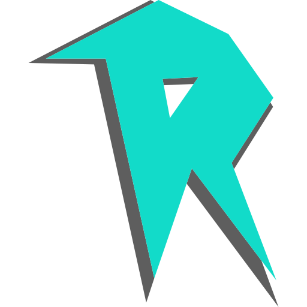 <code>raneto</code></a></td><td align="center"><a href="../logos/rapid-api.svg"> <code>rapid-api</code></a></td><td align="center"><a href="../logos/rapid-api-wordmark.svg"> <code>rapid-api-wordmark</code></a></td><td align="center"><a href="../logos/rapid7.svg"> <code>rapid7</code></a></td><td align="center"><a href="../logos/rauthy.svg">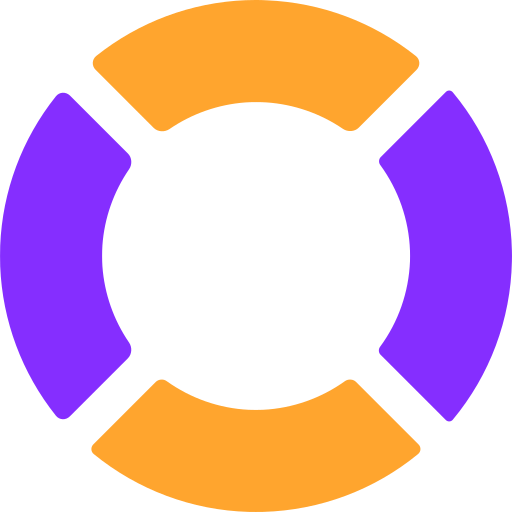 <code>rauthy</code></a></td></tr>
<tr><td align="center"><a href="../logos/raycast.svg"> <code>raycast</code></a></td><td align="center"><a href="../logos/raycast-wordmark.svg"> <code>raycast-wordmark</code></a></td><td align="center"><a href="../logos/raygun-monitoring.svg">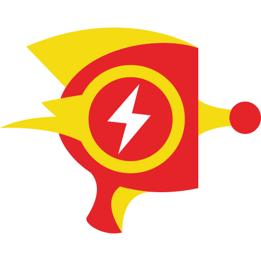 <code>raygun-monitoring</code></a></td><td align="center"><a href="../logos/rdt-client.svg"> <code>rdt-client</code></a></td><td align="center"><a href="../logos/re-command.svg">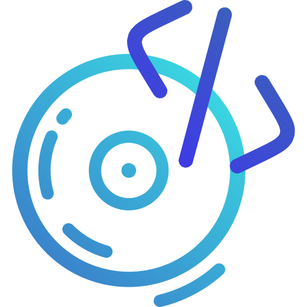 <code>re-command</code></a></td><td align="center"><a href="../logos/re-director.svg">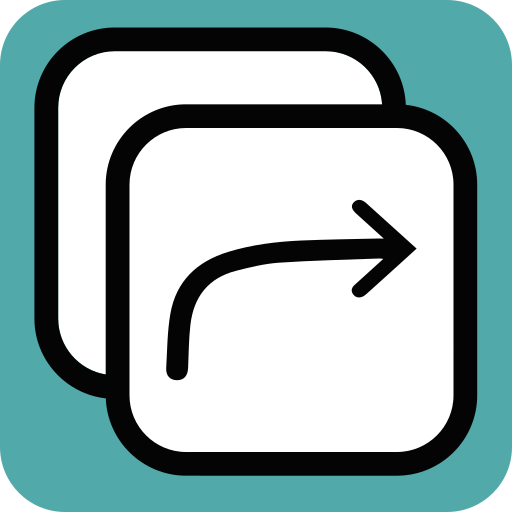 <code>re-director</code></a></td></tr>
<tr><td align="center"><a href="../logos/reactflux.svg"> <code>reactflux</code></a></td><td align="center"><a href="../logos/reactive-resume.svg"> <code>reactive-resume</code></a></td><td align="center"><a href="../logos/readarr.svg"> <code>readarr</code></a></td><td align="center"><a href="../logos/readarr-radarr.svg"> <code>readarr-radarr</code></a></td><td align="center"><a href="../logos/readeck.svg"> <code>readeck</code></a></td><td align="center"><a href="../logos/readmeabook.svg"> <code>readmeabook</code></a></td></tr>
<tr><td align="center"><a href="../logos/readthedocs.svg"> <code>readthedocs</code></a></td><td align="center"><a href="../logos/readwise-reader.svg"> <code>readwise-reader</code></a></td><td align="center"><a href="../logos/real-debrid.svg"> <code>real-debrid</code></a></td><td align="center"><a href="../logos/reality-cruise.svg">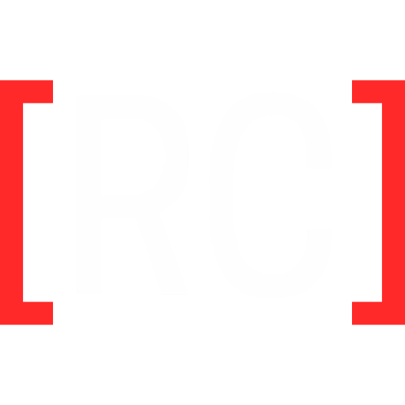 <code>reality-cruise</code></a></td><td align="center"><a href="../logos/realtor-com.svg"> <code>realtor-com</code></a></td><td align="center"><a href="../logos/reaparr.svg"> <code>reaparr</code></a></td></tr>
<tr><td align="center"><a href="../logos/recalbox.svg"> <code>recalbox</code></a></td><td align="center"><a href="../logos/receipt-wrangler.svg">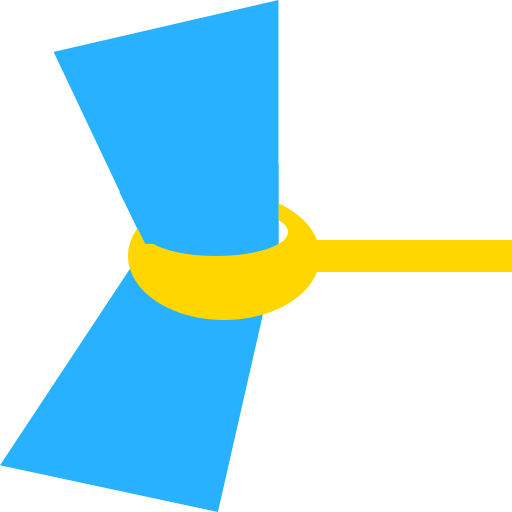 <code>receipt-wrangler</code></a></td><td align="center"><a href="../logos/recipesage.svg"> <code>recipesage</code></a></td><td align="center"><a href="../logos/reclaimerr.svg">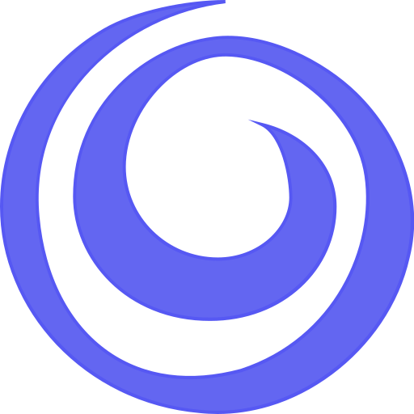 <code>reclaimerr</code></a></td><td align="center"><a href="../logos/recommander.svg">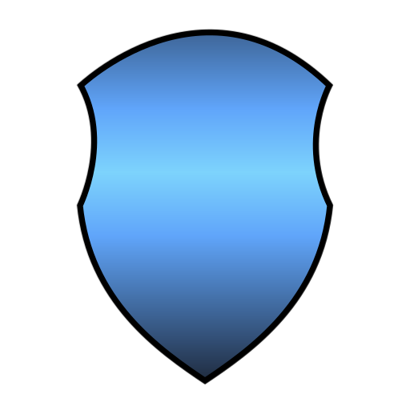 <code>recommander</code></a></td><td align="center"><a href="../logos/recyclarr.svg"> <code>recyclarr</code></a></td></tr>
<tr><td align="center"><a href="../logos/reddit-downvote.svg"> <code>reddit-downvote</code></a></td><td align="center"><a href="../logos/reddit-upvote.svg"> <code>reddit-upvote</code></a></td><td align="center"><a href="../logos/redict.svg"> <code>redict</code></a></td><td align="center"><a href="../logos/redlib.svg"> <code>redlib</code></a></td><td align="center"><a href="../logos/redmine.svg">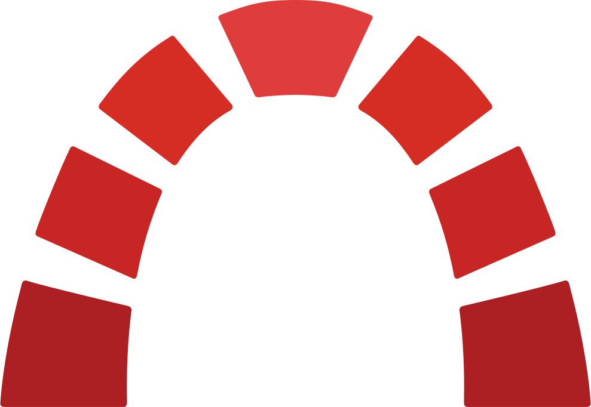 <code>redmine</code></a></td><td align="center"><a href="../logos/redstone-federal-credit-union.svg"> <code>redstone-federal-credit-union</code></a></td></tr>
<tr><td align="center"><a href="../logos/reel.svg"> <code>reel</code></a></td><td align="center"><a href="../logos/reflex.svg"> <code>reflex</code></a></td><td align="center"><a href="../logos/registry-console.svg">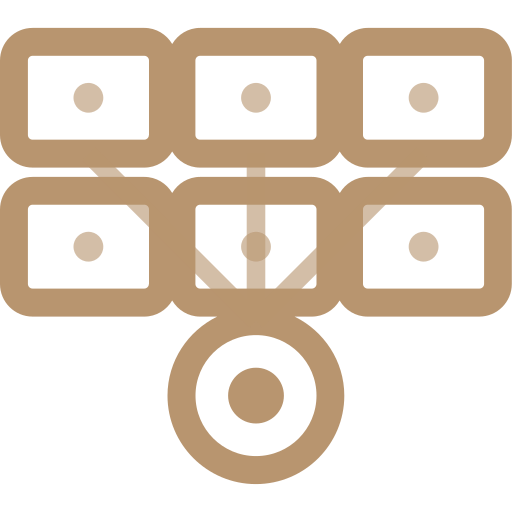 <code>registry-console</code></a></td><td align="center"><a href="../logos/reitti.svg">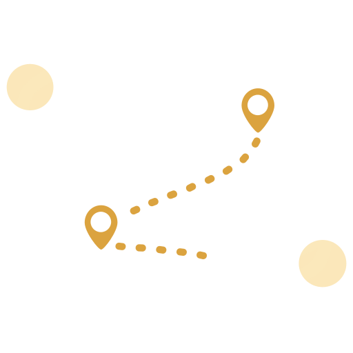 <code>reitti</code></a></td><td align="center"><a href="../logos/rekor.svg"> <code>rekor</code></a></td><td align="center"><a href="../logos/relagit.svg"> <code>relagit</code></a></td></tr>
<tr><td align="center"><a href="../logos/relagit-wordmark.svg"> <code>relagit-wordmark</code></a></td><td align="center"><a href="../logos/relaticle.svg">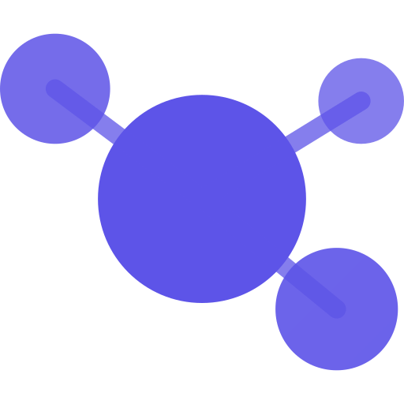 <code>relaticle</code></a></td><td align="center"><a href="../logos/release-argus.svg"> <code>release-argus</code></a></td><td align="center"><a href="../logos/relic-storage.svg"> <code>relic-storage</code></a></td><td align="center"><a href="../logos/remmina.svg"> <code>remmina</code></a></td><td align="center"><a href="../logos/remnawave.svg"> <code>remnawave</code></a></td></tr>
<tr><td align="center"><a href="../logos/remnote.svg"> <code>remnote</code></a></td><td align="center"><a href="../logos/removarr.svg">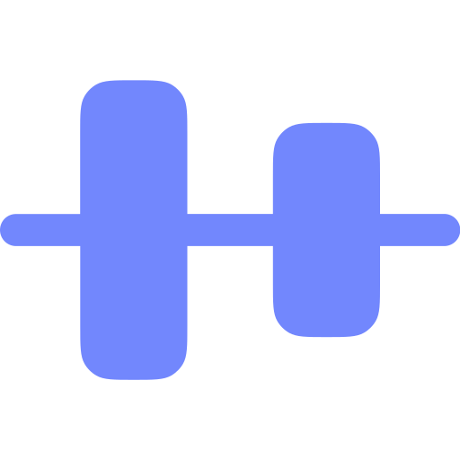 <code>removarr</code></a></td><td align="center"><a href="../logos/renovate.svg"> <code>renovate</code></a></td><td align="center"><a href="../logos/reolink.svg">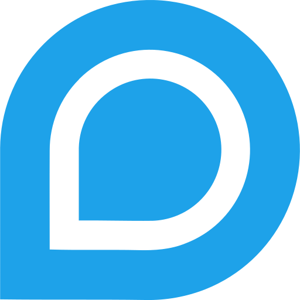 <code>reolink</code></a></td><td align="center"><a href="../logos/replane.svg"> <code>replane</code></a></td><td align="center"><a href="../logos/repoflow.svg">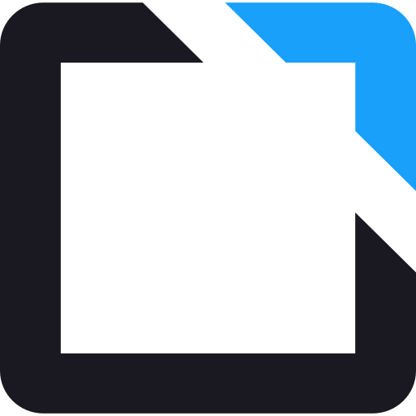 <code>repoflow</code></a></td></tr>
<tr><td align="center"><a href="../logos/requestly.svg"> <code>requestly</code></a></td><td align="center"><a href="../logos/requestrr.svg"> <code>requestrr</code></a></td><td align="center"><a href="../logos/resend.svg"> <code>resend</code></a></td><td align="center"><a href="../logos/resiliosync.svg"> <code>resiliosync</code></a></td><td align="center"><a href="../logos/resiliosync-full.svg"> <code>resiliosync-full</code></a></td><td align="center"><a href="../logos/restreamer.svg"> <code>restreamer</code></a></td></tr>
<tr><td align="center"><a href="../logos/retool.svg"> <code>retool</code></a></td><td align="center"><a href="../logos/retool-wordmark.svg"> <code>retool-wordmark</code></a></td><td align="center"><a href="../logos/retroassembly.svg"> <code>retroassembly</code></a></td><td align="center"><a href="../logos/retrom.svg"> <code>retrom</code></a></td><td align="center"><a href="../logos/retype.svg"> <code>retype</code></a></td><td align="center"><a href="../logos/revanced-manager.svg"> <code>revanced-manager</code></a></td></tr>
<tr><td align="center"><a href="../logos/revel.svg"> <code>revel</code></a></td><td align="center"><a href="../logos/review-board.svg"> <code>review-board</code></a></td><td align="center"><a href="../logos/revolt.svg">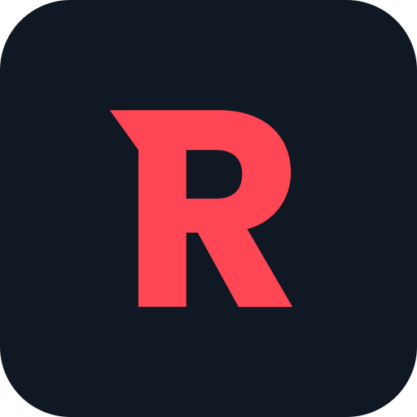 <code>revolt</code></a></td><td align="center"><a href="../logos/rgallery.svg"> <code>rgallery</code></a></td><td align="center"><a href="../logos/rhasspy.svg">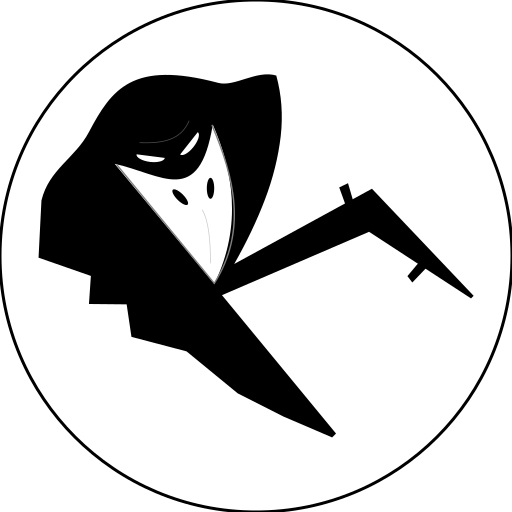 <code>rhasspy</code></a></td><td align="center"><a href="../logos/rhodecode.svg">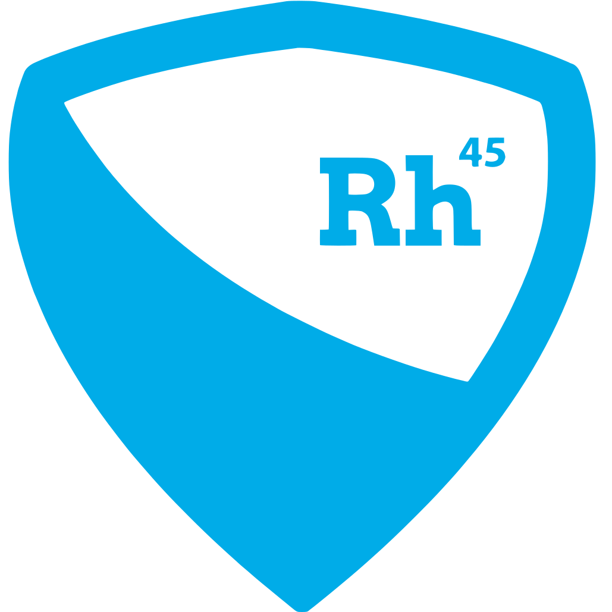 <code>rhodecode</code></a></td></tr>
<tr><td align="center"><a href="../logos/richy.svg"> <code>richy</code></a></td><td align="center"><a href="../logos/rimgo.svg">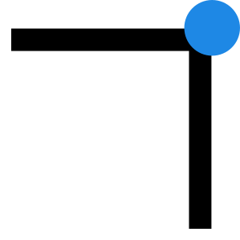 <code>rimgo</code></a></td><td align="center"><a href="../logos/ringlink.svg">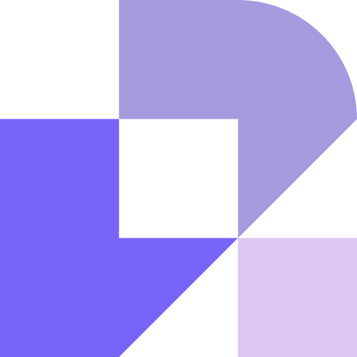 <code>ringlink</code></a></td><td align="center"><a href="../logos/ripe.svg"> <code>ripe</code></a></td><td align="center"><a href="../logos/ripe-atlas.svg">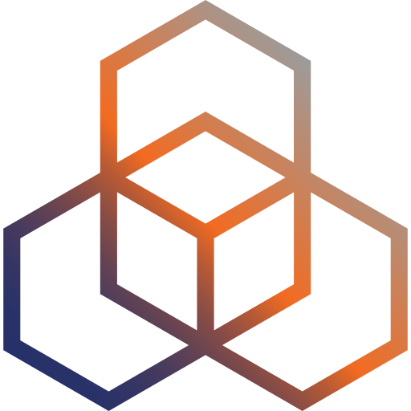 <code>ripe-atlas</code></a></td><td align="center"><a href="../logos/riven.svg"> <code>riven</code></a></td></tr>
<tr><td align="center"><a href="../logos/riverside-fm.svg"> <code>riverside-fm</code></a></td><td align="center"><a href="../logos/robinson.svg"> <code>robinson</code></a></td><td align="center"><a href="../logos/rockstor.svg"> <code>rockstor</code></a></td><td align="center"><a href="../logos/romm.svg">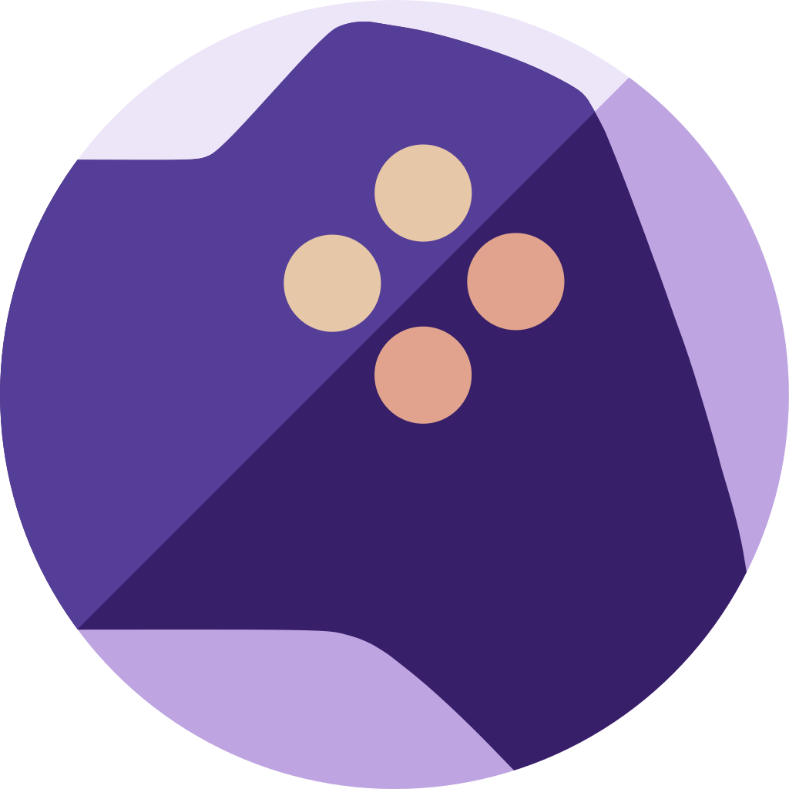 <code>romm</code></a></td><td align="center"><a href="../logos/romm-ps2.svg"> <code>romm-ps2</code></a></td><td align="center"><a href="../logos/romm-snes.svg">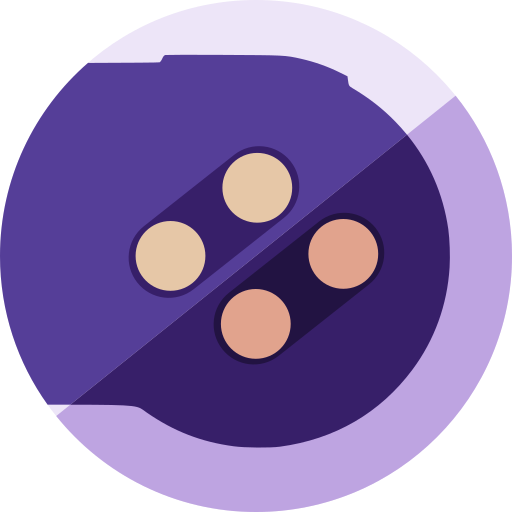 <code>romm-snes</code></a></td></tr>
<tr><td align="center"><a href="../logos/rook.svg"> <code>rook</code></a></td><td align="center"><a href="../logos/roon.svg"> <code>roon</code></a></td><td align="center"><a href="../logos/root-me.svg"> <code>root-me</code></a></td><td align="center"><a href="../logos/rosterhash.svg"> <code>rosterhash</code></a></td><td align="center"><a href="../logos/rotki.svg">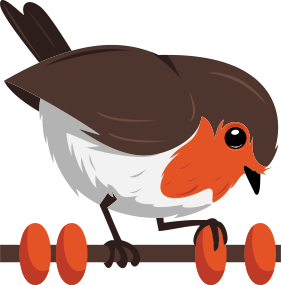 <code>rotki</code></a></td><td align="center"><a href="../logos/roundcube.svg"> <code>roundcube</code></a></td></tr>
<tr><td align="center"><a href="../logos/router.svg">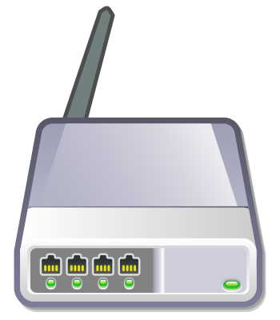 <code>router</code></a></td><td align="center"><a href="../logos/rport.svg"> <code>rport</code></a></td><td align="center"><a href="../logos/rss-bridge.svg"> <code>rss-bridge</code></a></td><td align="center"><a href="../logos/rss-com.svg"> <code>rss-com</code></a></td><td align="center"><a href="../logos/rss-translator.svg"> <code>rss-translator</code></a></td><td align="center"><a href="../logos/rssbox.svg"> <code>rssbox</code></a></td></tr>
<tr><td align="center"><a href="../logos/rsshub.svg">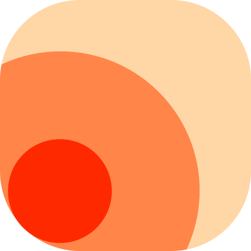 <code>rsshub</code></a></td><td align="center"><a href="../logos/rssrise.svg"> <code>rssrise</code></a></td><td align="center"><a href="../logos/rstudioserver.svg"> <code>rstudioserver</code></a></td><td align="center"><a href="../logos/ruby-on-rails.svg"> <code>ruby-on-rails</code></a></td><td align="center"><a href="../logos/runframe.svg"> <code>runframe</code></a></td><td align="center"><a href="../logos/runonflux.svg"> <code>runonflux</code></a></td></tr>
<tr><td align="center"><a href="../logos/runson.svg"> <code>runson</code></a></td><td align="center"><a href="../logos/runtipi.svg">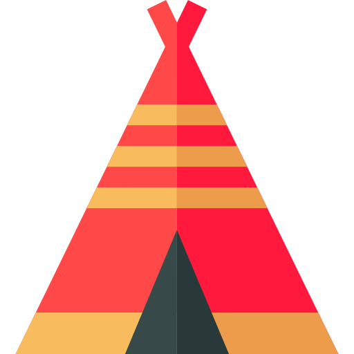 <code>runtipi</code></a></td><td align="center"><a href="../logos/rusta.svg"> <code>rusta</code></a></td><td align="center"><a href="../logos/rustdesk.svg"> <code>rustdesk</code></a></td><td align="center"><a href="../logos/rustfs.svg"> <code>rustfs</code></a></td><td align="center"><a href="../logos/rustpad.svg"> <code>rustpad</code></a></td></tr>
<tr><td align="center"><a href="../logos/rwmarkable.svg"> <code>rwmarkable</code></a></td><td align="center"><a href="../logos/rybbit.svg"> <code>rybbit</code></a></td><td align="center"><a href="../logos/rygel.svg"> <code>rygel</code></a></td><td align="center"><a href="../logos/ryot.svg"> <code>ryot</code></a></td><td align="center"><a href="../logos/sablier.svg">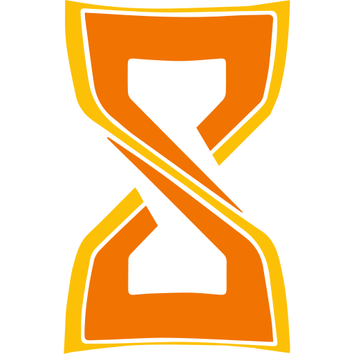 <code>sablier</code></a></td><td align="center"><a href="../logos/sabnzbd.svg"> <code>sabnzbd</code></a></td></tr>
<tr><td align="center"><a href="../logos/safari-ios.svg"> <code>safari-ios</code></a></td><td align="center"><a href="../logos/safebox.svg"> <code>safebox</code></a></td><td align="center"><a href="../logos/safeline.svg"> <code>safeline</code></a></td><td align="center"><a href="../logos/sailfishos.svg"> <code>sailfishos</code></a></td><td align="center"><a href="../logos/salt-project.svg"> <code>salt-project</code></a></td><td align="center"><a href="../logos/saltcorn.svg"> <code>saltcorn</code></a></td></tr>
<tr><td align="center"><a href="../logos/samba-server.svg"> <code>samba-server</code></a></td><td align="center"><a href="../logos/sando.svg"> <code>sando</code></a></td><td align="center"><a href="../logos/sandstorm.svg">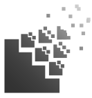 <code>sandstorm</code></a></td><td align="center"><a href="../logos/sandwitches.svg"> <code>sandwitches</code></a></td><td align="center"><a href="../logos/sat-ip.svg"> <code>sat-ip</code></a></td><td align="center"><a href="../logos/sat-ip-wordmark.svg"> <code>sat-ip-wordmark</code></a></td></tr>
<tr><td align="center"><a href="../logos/scanopy.svg">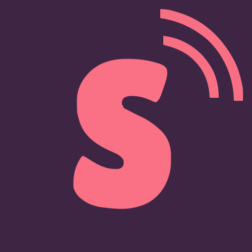 <code>scanopy</code></a></td><td align="center"><a href="../logos/scatola-magica.svg">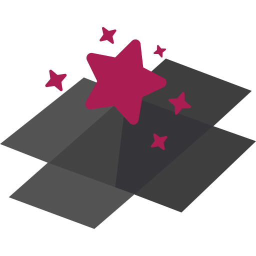 <code>scatola-magica</code></a></td><td align="center"><a href="../logos/schedulearn.svg"> <code>schedulearn</code></a></td><td align="center"><a href="../logos/scholarsome.svg"> <code>scholarsome</code></a></td><td align="center"><a href="../logos/schoolmessenger.svg"> <code>schoolmessenger</code></a></td><td align="center"><a href="../logos/scraparr.svg">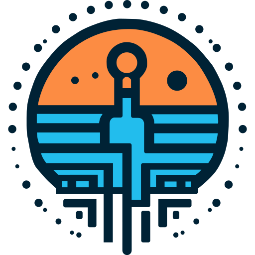 <code>scraparr</code></a></td></tr>
<tr><td align="center"><a href="../logos/scratch-map.svg">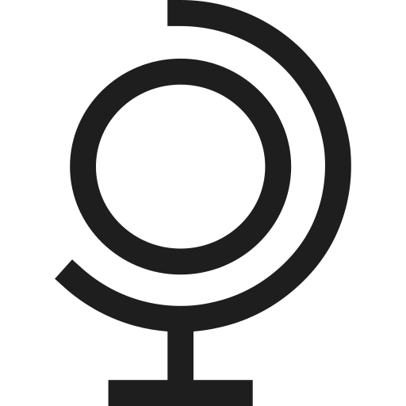 <code>scratch-map</code></a></td><td align="center"><a href="../logos/scrcpy.svg"> <code>scrcpy</code></a></td><td align="center"><a href="../logos/screenconnect.svg"> <code>screenconnect</code></a></td><td align="center"><a href="../logos/screenlite.svg"> <code>screenlite</code></a></td><td align="center"><a href="../logos/scriberr.svg"> <code>scriberr</code></a></td><td align="center"><a href="../logos/scrobblex.svg"> <code>scrobblex</code></a></td></tr>
<tr><td align="center"><a href="../logos/scrutiny.svg"> <code>scrutiny</code></a></td><td align="center"><a href="../logos/scuttle.svg"> <code>scuttle</code></a></td><td align="center"><a href="../logos/seafile.svg"> <code>seafile</code></a></td><td align="center"><a href="../logos/searx.svg">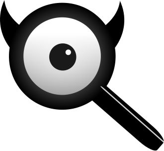 <code>searx</code></a></td><td align="center"><a href="../logos/searxng.svg"> <code>searxng</code></a></td><td align="center"><a href="../logos/seaweedfs.svg">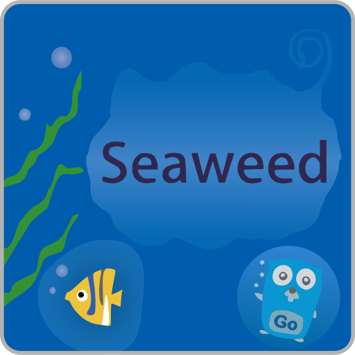 <code>seaweedfs</code></a></td></tr>
<tr><td align="center"><a href="../logos/secluso.svg"> <code>secluso</code></a></td><td align="center"><a href="../logos/secrover.svg"> <code>secrover</code></a></td><td align="center"><a href="../logos/secureai-tools.svg"> <code>secureai-tools</code></a></td><td align="center"><a href="../logos/seedsync.svg"> <code>seedsync</code></a></td><td align="center"><a href="../logos/seelf.svg"> <code>seelf</code></a></td><td align="center"><a href="../logos/seerr.svg"> <code>seerr</code></a></td></tr>
<tr><td align="center"><a href="../logos/self-hosted-gateway.svg"> <code>self-hosted-gateway</code></a></td><td align="center"><a href="../logos/self-hosted-metrics.svg"> <code>self-hosted-metrics</code></a></td><td align="center"><a href="../logos/self-hosted-show.svg">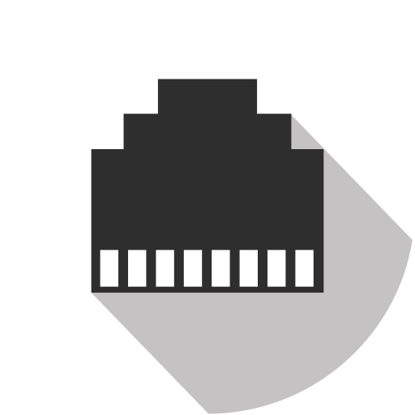 <code>self-hosted-show</code></a></td><td align="center"><a href="../logos/selfh-st.svg"> <code>selfh-st</code></a></td><td align="center"><a href="../logos/send.svg"> <code>send</code></a></td><td align="center"><a href="../logos/send-visee.svg"> <code>send-visee</code></a></td></tr>
<tr><td align="center"><a href="../logos/sendinblue.svg">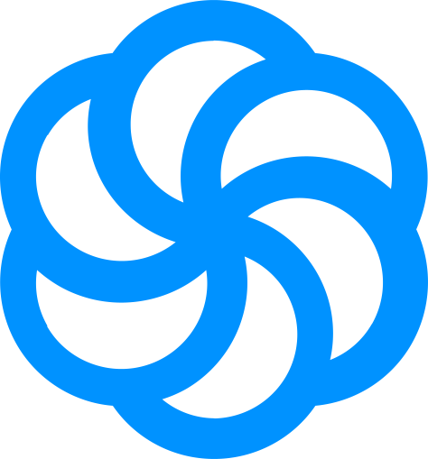 <code>sendinblue</code></a></td><td align="center"><a href="../logos/senlo.svg"> <code>senlo</code></a></td><td align="center"><a href="../logos/seq.svg">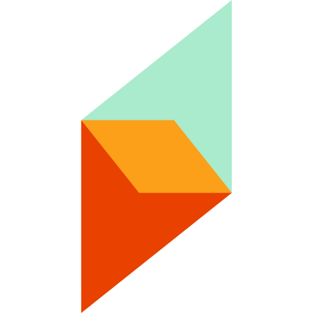 <code>seq</code></a></td><td align="center"><a href="../logos/series-troxide.svg">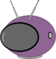 <code>series-troxide</code></a></td><td align="center"><a href="../logos/servarr.svg"> <code>servarr</code></a></td><td align="center"><a href="../logos/serviio.svg">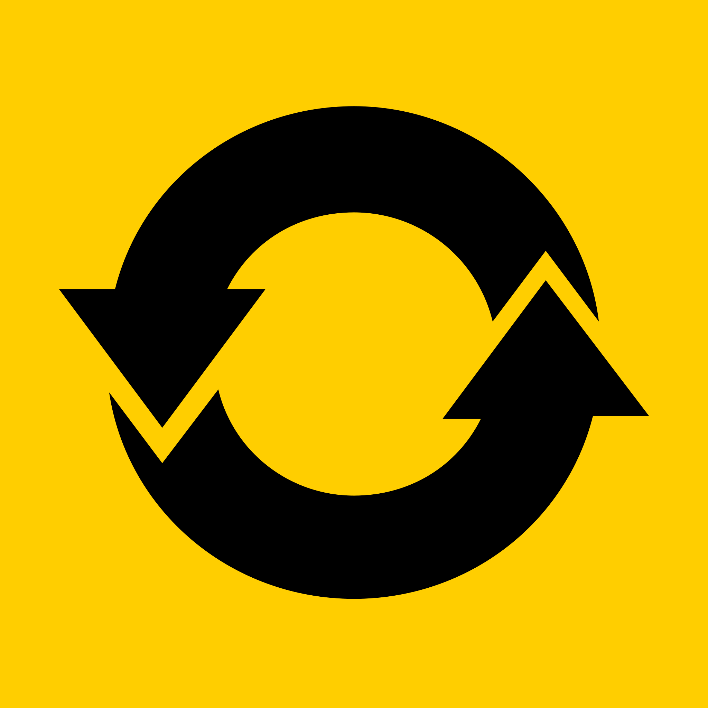 <code>serviio</code></a></td></tr>
<tr><td align="center"><a href="../logos/session.svg"> <code>session</code></a></td><td align="center"><a href="../logos/seznam.svg"> <code>seznam</code></a></td><td align="center"><a href="../logos/sftpgo.svg">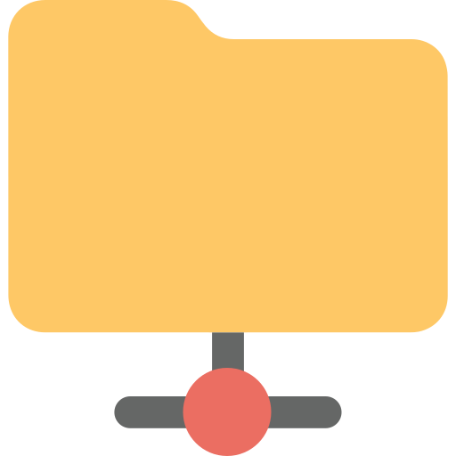 <code>sftpgo</code></a></td><td align="center"><a href="../logos/shaarli.svg"> <code>shaarli</code></a></td><td align="center"><a href="../logos/shako.svg">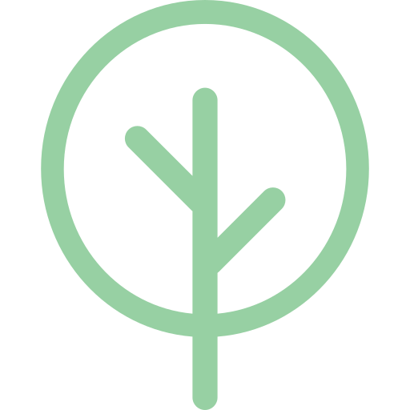 <code>shako</code></a></td><td align="center"><a href="../logos/sharewood.svg"> <code>sharewood</code></a></td></tr>
<tr><td align="center"><a href="../logos/sharkord.svg">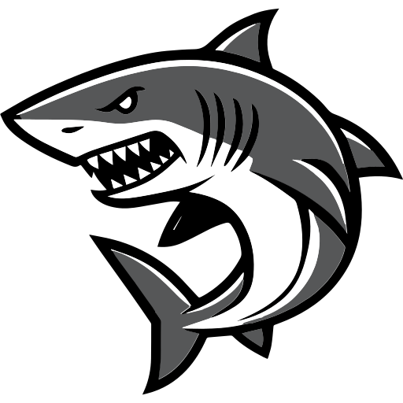 <code>sharkord</code></a></td><td align="center"><a href="../logos/sharry.svg"> <code>sharry</code></a></td><td align="center"><a href="../logos/shelfmark.svg"> <code>shelfmark</code></a></td><td align="center"><a href="../logos/shell-tips.svg"> <code>shell-tips</code></a></td><td align="center"><a href="../logos/shellhub.svg"> <code>shellhub</code></a></td><td align="center"><a href="../logos/shellngn.svg"> <code>shellngn</code></a></td></tr>
<tr><td align="center"><a href="../logos/shelly.svg"> <code>shelly</code></a></td><td align="center"><a href="../logos/shelly-wordmark.svg"> <code>shelly-wordmark</code></a></td><td align="center"><a href="../logos/shinkro.svg">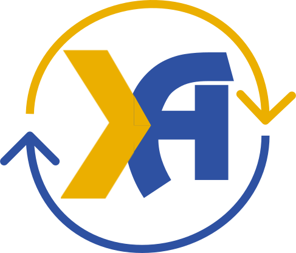 <code>shinkro</code></a></td><td align="center"><a href="../logos/shiori.svg"> <code>shiori</code></a></td><td align="center"><a href="../logos/shlink.svg"> <code>shlink</code></a></td><td align="center"><a href="../logos/shodan.svg">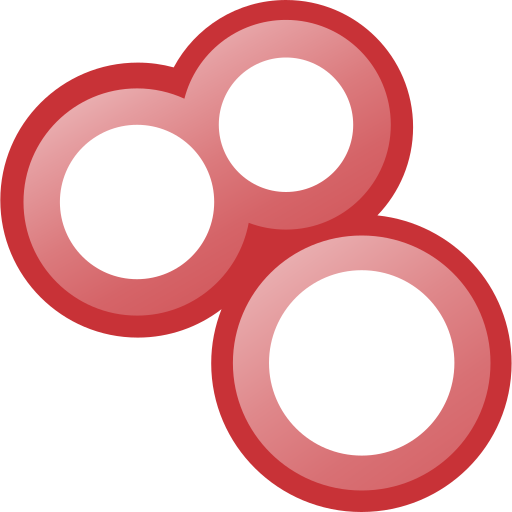 <code>shodan</code></a></td></tr>
</table>

Page **1** · [2](./prod-2.md)

[⬅️ Back to the full catalog](../README.md)
